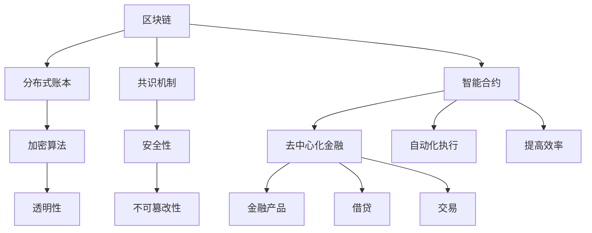

                 

关键词：区块链、去中心化金融、智能合约、未来趋势、技术发展、创新应用

## 摘要

本文将探讨到2050年区块链技术可能的发展方向，特别是去中心化金融（DeFi）和智能合约的演变。随着区块链技术的不断进步，它将在金融领域引发深刻的变革，重新定义信任、安全和效率。本文将深入分析区块链技术的核心概念，探讨去中心化金融的兴起以及智能合约在未来的潜在应用场景，最后讨论区块链技术面临的挑战和未来研究的方向。

## 1. 背景介绍

区块链技术自2008年比特币的诞生以来，已经经历了数十年的发展。区块链的本质是一个去中心化的分布式账本技术，通过加密算法和共识机制确保数据的真实性和不可篡改性。区块链不仅改变了数字货币的发行和交易方式，还在金融、供应链、医疗等多个领域展现出巨大的潜力。

去中心化金融（DeFi）是区块链技术在金融领域的一个重大突破。DeFi利用智能合约构建了一个无需中介的金融系统，使得金融产品的创建、发行和交易变得更加透明和高效。智能合约是一种自动化执行合约条款的计算机程序，通过区块链网络保证其执行的不可篡改性和透明性。

到2050年，随着区块链技术的进一步成熟和普及，我们可以预见去中心化金融和智能合约将深刻改变金融行业，实现更加公平、透明和高效的金融服务。

### 1.1 区块链技术的起源与发展

区块链技术的起源可以追溯到2008年，当时一位化名为中本聪的学者发布了一篇名为《比特币：一种点对点的电子现金系统》的论文。这篇论文提出了一个去中心化的数字货币体系，通过区块链技术实现了点对点交易，无需依赖传统的金融中介机构。比特币的诞生标志着区块链技术的首次商业应用，引发了全球关注。

随着时间的推移，区块链技术逐渐从数字货币领域拓展到金融、供应链、医疗、投票等多个领域。区块链的分布式账本特性使得数据存储和传输更加安全、透明，而智能合约则提供了自动化执行合同条款的能力，大大提高了交易效率。

到2050年，区块链技术预计将达到一个新的高峰，不仅在技术上更加成熟，还将实现更广泛的应用。区块链技术的进步将使去中心化金融（DeFi）和智能合约变得更加普及和高效，为金融行业带来深刻的变革。

### 1.2 去中心化金融（DeFi）的概念与发展

去中心化金融（DeFi）是基于区块链技术的金融应用，旨在通过智能合约实现金融产品和服务去中心化的构建和运行。与传统的中心化金融系统不同，DeFi不需要依赖银行、交易所等中介机构，而是通过区块链网络实现资金的转移和金融交易的自动化。

DeFi的核心在于智能合约，这是一种能够自动执行合同条款的计算机程序。智能合约通过预先编写的代码定义了金融交易的具体规则，确保交易的透明性和不可篡改性。例如，一个去中心化的借贷平台可以通过智能合约实现自动化的借贷过程，包括借款申请、审核、放款和还款等环节。

DeFi的发展始于2017年，当时以太坊区块链上涌现出了一批基于智能合约的金融应用，如 Compound、Aave 等。这些平台提供了去中心化的借贷、流动性挖矿、交易等服务，极大地改变了传统金融的运作模式。随着技术的不断进步和社区的不断参与，DeFi市场规模迅速扩大，吸引了大量的投资者和开发者。

到2050年，DeFi预计将实现更加成熟和广泛的应用。随着区块链技术的进一步发展，DeFi将提供更多元化的金融产品和服务，包括保险、衍生品、资产管理等。此外，去中心化金融将更加注重用户体验，通过优化界面设计和操作流程，使普通人也能够轻松参与。

### 1.3 智能合约的概念与演变

智能合约是区块链技术中的重要组成部分，是一种自动执行合同条款的计算机程序。智能合约通过区块链网络运行，具有高度的透明性和不可篡改性。与传统合同相比，智能合约能够自动化执行合同条款，减少人为干预和操作风险，提高交易效率。

智能合约的起源可以追溯到1995年，当时计算机科学家尼克斯·萨博（Nikos Drakos）提出了智能合约的概念。随后，1996年，理查德·斯通曼（Richard Stallman）在《自由经济》一书中进一步阐述了智能合约的理念。然而，真正将智能合约应用到实际中是随着区块链技术的发展，特别是以太坊平台的推出。

以太坊是一个基于区块链的智能合约平台，它引入了图灵完备的编程语言Solidity，使得开发者可以轻松编写和部署智能合约。以太坊的智能合约不仅限于金融领域，还可以应用于供应链管理、知识产权保护、投票系统等多个领域。

到2050年，智能合约预计将变得更加成熟和多样化。随着区块链技术的不断进步，智能合约的性能和安全性将得到显著提升。同时，开发者将开发出更多创新的应用场景，使智能合约在各个领域发挥更大的作用。例如，在医疗领域，智能合约可以用于自动化管理药品供应链和确保数据的真实性；在法律领域，智能合约可以用于自动化执行法律合同。

## 2. 核心概念与联系

为了更好地理解区块链、去中心化金融和智能合约之间的关系，下面将使用Mermaid流程图展示它们的核心概念和架构。



### 2.1 核心概念解释

- **区块链**：一种分布式账本技术，通过加密算法和共识机制确保数据的真实性和不可篡改性。
- **分布式账本**：数据存储在多个节点上，每个节点都有完整的账本副本，确保数据的透明性和不可篡改性。
- **加密算法**：用于保护数据的安全性和隐私，确保只有授权的用户可以访问和修改数据。
- **共识机制**：多个节点就账本的状态达成一致，确保数据的真实性和一致性。
- **安全性**：通过加密算法和共识机制保证数据的安全和隐私。
- **智能合约**：一种自动执行合同条款的计算机程序，通过区块链网络运行，具有高度的透明性和不可篡改性。
- **去中心化金融**：基于区块链技术的金融系统，无需依赖中介机构，通过智能合约实现金融产品和服务的去中心化构建和运行。
- **金融产品**：在去中心化金融系统中，包括借贷、交易、资产管理等多样化的金融产品。
- **自动化执行**：智能合约能够自动执行合同条款，减少人为干预和操作风险，提高交易效率。
- **提高效率**：通过智能合约和区块链技术，金融交易的执行速度和准确性得到显著提升。

### 2.2 去中心化金融与智能合约的关系

去中心化金融（DeFi）与智能合约密切相关。智能合约是DeFi系统的核心组成部分，用于实现金融交易和服务的自动化执行。智能合约通过区块链网络运行，确保交易的透明性和不可篡改性。

在DeFi系统中，智能合约不仅用于借贷和交易，还可以用于其他金融产品和服务。例如，一个去中心化的交易所可以通过智能合约实现自动化的交易撮合和清算，确保交易的公平性和高效性。此外，智能合约还可以用于资产管理，通过自动化的投资策略实现资产的增值。

总的来说，智能合约和区块链技术为去中心化金融提供了坚实的基础，使得金融产品和服务的创建、发行和交易变得更加透明、高效和去中心化。

## 3. 核心算法原理 & 具体操作步骤

### 3.1 算法原理概述

区块链技术的核心算法包括加密算法、共识机制和智能合约。下面将分别介绍这些算法的原理。

- **加密算法**：加密算法用于保护区块链上的数据安全。常见的加密算法包括哈希算法（如SHA-256）、对称加密算法（如AES）和非对称加密算法（如RSA）。哈希算法用于生成数据摘要，确保数据的完整性和不可篡改性。对称加密算法和非对称加密算法用于加密和解密数据，确保只有授权的用户可以访问和修改数据。
- **共识机制**：共识机制用于确保区块链网络中的多个节点就账本的状态达成一致。常见的共识机制包括工作量证明（PoW）、权益证明（PoS）和委托权益证明（DPoS）。这些机制通过数学算法和奖励机制激励节点参与网络维护，确保区块链的安全性和一致性。
- **智能合约**：智能合约是一种自动执行合同条款的计算机程序。智能合约通过区块链网络运行，确保其执行的透明性和不可篡改性。智能合约的编程语言通常是基于图灵完备的，例如以太坊的Solidity。

### 3.2 算法步骤详解

- **加密算法**：
  1. 数据输入：将需要加密的数据输入加密算法。
  2. 生成密钥：根据加密算法生成一对密钥（公钥和私钥）。
  3. 数据加密：使用公钥对数据进行加密。
  4. 数据存储：将加密后的数据存储在区块链上。
  5. 数据解密：需要时，使用私钥对数据进行解密。
- **共识机制**：
  1. 节点加入：新节点加入区块链网络，进行身份验证。
  2. 数据验证：节点对交易数据进行验证，确保其合法性和有效性。
  3. 生成区块：节点生成新的区块，并将交易数据写入区块。
  4. 区块传播：新生成的区块在网络中传播，其他节点进行验证。
  5. 达成共识：网络中的节点就区块的合法性达成共识，更新账本。
- **智能合约**：
  1. 编写合约：开发者使用智能合约编程语言编写智能合约代码。
  2. 部署合约：将智能合约部署到区块链上，使其在网络上运行。
  3. 合约执行：当触发合约条件时，智能合约自动执行预定义的操作。
  4. 合约结果：智能合约执行的结果记录在区块链上，供所有人查看。

### 3.3 算法优缺点

- **加密算法**：
  - 优点：确保数据的安全性和隐私，防止未经授权的访问和篡改。
  - 缺点：加密和解密过程需要一定的计算资源，可能导致性能下降。
- **共识机制**：
  - 优点：确保区块链网络的安全性和一致性，防止恶意节点攻击。
  - 缺点：部分共识机制（如PoW）可能导致资源浪费和能源消耗。
- **智能合约**：
  - 优点：自动化执行合同条款，减少人为干预和操作风险，提高交易效率。
  - 缺点：智能合约一旦部署，无法修改，可能导致潜在的安全漏洞。

### 3.4 算法应用领域

- **加密算法**：广泛应用于金融、医疗、供应链等领域，确保数据的安全和隐私。
- **共识机制**：广泛应用于区块链网络，确保数据的一致性和安全性。
- **智能合约**：广泛应用于金融、供应链、投票等领域，实现自动化执行和高效管理。

## 4. 数学模型和公式 & 详细讲解 & 举例说明

### 4.1 数学模型构建

在区块链技术中，数学模型扮演着关键角色，用于确保数据的安全性和一致性。以下将介绍几个关键的数学模型和公式。

1. **哈希函数**：哈希函数是一种将任意长度的输入数据映射为固定长度的输出数据的函数。常见的哈希函数包括SHA-256、SHA-3等。哈希函数的输出被称为哈希值，具有以下特性：
   - **抗碰撞性**：给定一个输入数据，很难找到另一个不同的输入数据，使其产生相同的哈希值。
   - **单向性**：给定一个哈希值，无法反推出原始输入数据。

   **公式**：\( H = \text{SHA-256}(M) \)

2. **椭圆曲线加密**：椭圆曲线加密（ECC）是一种非对称加密算法，用于确保数据传输的安全。ECC利用椭圆曲线的数学特性，生成一对密钥（公钥和私钥）。

   **公式**：
   - 公钥：\( Q = kG \)，其中 \( G \) 是基点，\( k \) 是私钥。
   - 私钥：\( k \)。

3. **共识机制**：工作量证明（PoW）是一种常见的共识机制，用于确保区块链网络的安全。PoW通过解决一个数学难题来证明节点的计算能力。

   **公式**：\( \text{PoW}(P, R) = \text{solve}(M, R) \)，其中 \( M \) 是要验证的交易，\( R \) 是一个随机数，\( P \) 是产生的哈希值。

4. **智能合约**：智能合约通过预定义的逻辑规则执行特定操作。Solidity是一种常用的智能合约编程语言。

   **公式**：\( \text{if-else} \) 语句、\( \text{for} \) 循环、\( \text{while} \) 循环等。

### 4.2 公式推导过程

1. **哈希函数**：SHA-256是一种常见的哈希函数，其推导过程基于分组迭代算法。

   - **初始化**：定义初始值，如八个32位的整数。
   - **消息处理**：将消息划分为512位的分组，并进行初始化处理。
   - **压缩函数**：定义一个压缩函数，用于处理每个分组。
   - **输出**：输出最终的哈希值。

2. **椭圆曲线加密**：椭圆曲线加密基于椭圆曲线离散对数问题，其推导过程如下：

   - **椭圆曲线定义**：定义椭圆曲线和基点。
   - **点加法**：定义椭圆曲线上的点加法。
   - **点倍法**：定义椭圆曲线上的点倍法。
   - **离散对数**：求解椭圆曲线离散对数问题，得到私钥。

3. **工作量证明**：工作量证明的推导过程如下：

   - **随机数生成**：生成一个随机数 \( R \)。
   - **哈希计算**：计算 \( \text{PoW}(M, R) \) 的哈希值。
   - **难度调整**：根据网络的难度要求，调整 \( M \) 的值，直到满足难度要求。

4. **智能合约**：智能合约的推导过程基于编程语言的语法和语义。

   - **变量声明**：声明变量。
   - **控制结构**：编写条件语句和循环结构。
   - **函数定义**：定义函数，包括输入参数和返回值。
   - **合约执行**：执行预定义的逻辑规则。

### 4.3 案例分析与讲解

以下是一个简单的智能合约案例，用于实现一个简单的借贷平台。

```solidity
// SPDX-License-Identifier: MIT
pragma solidity ^0.8.0;

contract借贷平台 {
    mapping(address => uint256) 公众资金;
    
    function 借款（address borrower，uint256 amount）public {
        require（公众资金[msg.sender] >= amount， "余额不足"）；
        公众资金[msg.sender] -= amount；
        公众资金[borrower] += amount；
    }

    function 还款（address borrower，uint256 amount）public {
        require（公众资金[borrower] >= amount， "借款余额不足"）；
        公众资金[borrower] -= amount；
        公众资金[msg.sender] += amount；
    }
}
```

1. **合约结构**：合约包含一个映射（mapping）结构，用于存储用户的余额信息。

2. **借款函数**：借款函数允许用户从公众资金中提取金额。函数接收借款人和借款金额作为输入参数。

3. **还款函数**：还款函数允许借款人向公众资金还款。函数接收借款人和还款金额作为输入参数。

通过这个案例，我们可以看到智能合约如何通过预定义的逻辑规则实现借贷功能。智能合约的透明性和不可篡改性确保了借贷过程的公平和可信。

## 5. 项目实践：代码实例和详细解释说明

### 5.1 开发环境搭建

在进行区块链项目的开发之前，我们需要搭建一个合适的环境。以下是搭建开发环境的基本步骤：

1. **安装Node.js**：Node.js是一个基于Chrome V8引擎的JavaScript运行环境，用于编译和运行JavaScript代码。你可以从官方网站下载并安装Node.js。
2. **安装Truffle**：Truffle是一个开发框架，用于构建、部署和交互智能合约。你可以通过npm（Node Package Manager）安装Truffle。在命令行中运行以下命令：

   ```bash
   npm install -g truffle
   ```

3. **安装Ganache**：Ganache是一个本地以太坊区块链节点，用于测试智能合约。你可以从官方网站下载并安装Ganache，或者通过npm安装：

   ```bash
   npm install -g ganache-cli
   ```

4. **创建项目**：使用Truffle创建一个新的项目。在命令行中运行以下命令：

   ```bash
   truffle init
   ```

   这将创建一个包含基本结构的项目文件夹。

### 5.2 源代码详细实现

以下是一个简单的借贷平台的智能合约源代码，使用Solidity编写：

```solidity
// SPDX-License-Identifier: MIT
pragma solidity ^0.8.0;

contract BorrowPlatform {
    mapping(address => uint256) public balances;

    function deposit() public payable {
        balances[msg.sender()] += msg.value;
    }

    function borrow(uint256 amount) public {
        require(balances[msg.sender()] >= amount, "Insufficient balance");
        balances[msg.sender()] -= amount;
        payable(msg.sender()).transfer(amount);
    }

    function repay() public payable {
        uint256 amount = msg.value;
        balances[msg.sender()] += amount;
        payable(address(this)).transfer(amount);
    }
}
```

- **合约结构**：合约包含一个映射（mapping）结构，用于存储用户的余额信息。
- **deposit函数**：deposit函数允许用户向合约地址发送以太币，并更新用户的余额。
- **borrow函数**：borrow函数允许用户从合约中提取以太币，但需要满足余额要求。
- **repay函数**：repay函数允许用户向合约地址还款，并更新用户的余额。

### 5.3 代码解读与分析

1. **pragma声明**：pragma ^0.8.0指定了智能合约的编译器版本。这个版本声明了合约支持的特性，包括汇编代码和汇编指令。
2. **合约结构**：合约包含一个映射（mapping）结构，用于存储用户的余额信息。映射是一种关联数组，允许通过键（在这个案例中是地址）来访问和修改值（余额）。
3. **deposit函数**：deposit函数使用`public payable`修饰符，意味着它可以通过发送以太币来调用，并且可以接收以太币。函数中的`msg.value`是一个内置变量，表示发送的以太币数量。
4. **borrow函数**：borrow函数使用`public`修饰符，意味着它可以被公开调用。函数中的`require`语句用于检查余额是否足够，以确保借贷操作的有效性。如果余额不足，函数将抛出错误。
5. **repay函数**：repay函数与borrow函数类似，但它接收以太币并将其转移到合约地址。这允许用户还款。

### 5.4 运行结果展示

1. **部署合约**：在Ganache中创建一个本地以太坊区块链，然后使用Truffle部署合约。在命令行中运行以下命令：

   ```bash
   truffle migrate
   ```

   这将部署智能合约到本地区块链。
2. **测试合约**：使用Truffle框架测试合约功能。在命令行中运行以下命令：

   ```bash
   truffle test
   ```

   这将运行合约测试脚本，验证合约功能是否正常。

## 6. 实际应用场景

区块链技术已经在金融、供应链、医疗、投票等多个领域取得了显著的应用成果。以下是一些实际应用场景的详细介绍：

### 6.1 金融领域

在金融领域，区块链技术已经被广泛应用于支付、借贷、交易和资产管理等方面。例如，比特币和以太坊等数字货币利用区块链技术实现了去中心化的支付系统，使得跨境支付和交易变得更加快捷和安全。同时，去中心化金融（DeFi）平台如Aave和Compound通过智能合约提供了去中心化的借贷和交易服务，用户可以直接参与金融市场，无需依赖传统金融机构。

### 6.2 供应链管理

区块链技术可以用于供应链管理，确保产品的真实性和透明度。通过区块链，每个环节的数据都可以被记录和验证，从而实现全程可追溯。例如，沃尔玛等大型零售商已经使用区块链技术追踪食品供应链，确保产品的质量和来源。此外，区块链还可以用于物流和运输，提高供应链的效率和准确性。

### 6.3 医疗领域

在医疗领域，区块链技术可以用于管理患者数据、药品供应链和医疗记录。通过区块链，医疗数据可以实现去中心化的存储和共享，确保数据的安全性和隐私。例如，医院可以使用区块链技术存储患者的医疗记录，患者可以自主管理自己的数据，并授权第三方访问。此外，区块链还可以用于药品溯源，确保药品的真实性和有效性。

### 6.4 投票系统

区块链技术也被广泛应用于投票系统，确保投票的公正性和透明性。通过区块链，投票结果可以被记录和验证，防止篡改和双花攻击。例如，瑞士等一些国家和地区已经开始试点使用区块链技术进行投票。此外，区块链技术还可以用于其他选举系统，如选民身份验证和投票计数。

### 6.5 法律领域

在法律领域，区块链技术可以用于自动化执行法律合同和智能合约。通过智能合约，法律条款可以自动化执行，确保合同履行的透明性和不可篡改性。例如，房地产交易可以使用智能合约自动执行合同条款，减少人为干预和纠纷。此外，区块链还可以用于知识产权保护，确保创作者的权益得到保障。

### 6.6 其他应用

除了上述领域，区块链技术还可以应用于游戏、能源、教育等领域。例如，在游戏领域，区块链技术可以用于确保虚拟资产的唯一性和安全性。在能源领域，区块链可以用于电力交易和能源管理，提高能源的效率和可持续性。在教育领域，区块链可以用于认证和学位管理，确保学历的真实性和透明度。

总之，区块链技术的应用领域非常广泛，随着技术的不断进步和创新的不断涌现，未来将有更多的应用场景得到探索和实现。

### 6.7 未来应用展望

随着区块链技术的不断成熟和普及，未来将出现更多创新的应用场景和商业模式。以下是一些可能的未来应用展望：

1. **智能城市**：区块链技术可以用于智能城市建设，实现城市管理的智能化和高效化。通过区块链，城市交通、能源、环境等各方面的数据可以实现实时共享和智能分析，提高城市运行的效率和可持续性。

2. **数字身份认证**：区块链技术可以用于数字身份认证，确保个人身份信息的真实性和隐私性。通过区块链，个人可以自主管理自己的身份信息，并在需要时授权第三方访问。这有助于解决当前数字身份认证系统中存在的安全隐患和隐私问题。

3. **跨境支付**：区块链技术可以用于跨境支付，提高支付效率和降低成本。通过区块链，跨境支付可以实现实时到账，无需依赖传统金融机构，从而减少中间环节和交易费用。这有助于推动全球贸易和金融的发展。

4. **去中心化应用（dApps）**：随着区块链技术的发展，将会有更多去中心化应用（dApps）涌现。dApps将提供各种服务和产品，从金融交易、游戏到社交媒体等。这些应用将更加透明、公平和用户友好，为用户提供更好的体验。

5. **物联网（IoT）**：区块链技术可以与物联网技术相结合，实现物联网设备的去中心化管理和数据共享。通过区块链，物联网设备可以实现自主通信和数据交换，提高物联网系统的安全性和可靠性。

6. **数字资产**：随着数字经济的发展，越来越多的资产将被数字化，如数字货币、数字艺术品、数字房地产等。区块链技术将为这些数字资产提供安全、透明和去中心化的交易平台，推动数字资产市场的发展。

总之，区块链技术的未来应用前景广阔，将在多个领域引发深刻的变革。随着技术的不断进步和创新的不断涌现，我们可以期待一个更加智能、高效和去中心化的未来。

## 7. 工具和资源推荐

### 7.1 学习资源推荐

对于想要深入了解区块链技术和智能合约的开发者，以下是一些推荐的学习资源：

1. **书籍**：
   - 《区块链技术指南》
   - 《智能合约：原理与实践》
   - 《以太坊设计理念》

2. **在线课程**：
   - Coursera上的“Blockchain and cryptocurrencies”课程
   - edX上的“Introduction to Blockchain”课程

3. **官方文档**：
   - Ethereum官方文档（https://ethereum.org/en/developers/docs/）
   - Solidity官方文档（https://soliditylang.org/docs/）

### 7.2 开发工具推荐

在进行区块链和智能合约开发时，以下是一些实用的开发工具：

1. **编程语言**：
   - Solidity：用于编写智能合约的编程语言。
   - Vyper：另一种用于编写智能合约的编程语言，更适合高级开发者。

2. **开发框架**：
   - Truffle：一个用于智能合约开发的框架，提供编译、部署和测试功能。
   - Hardhat：一个更现代的智能合约开发框架，提供丰富的插件和扩展。

3. **测试环境**：
   - Ganache：一个本地以太坊区块链节点，用于测试智能合约。
   - Remix：一个在线智能合约开发环境，支持Solidity和Vyper。

### 7.3 相关论文推荐

以下是一些关于区块链技术和智能合约的知名论文，适合研究人员和开发者阅读：

1. **比特币**：
   - "Bitcoin: A Peer-to-Peer Electronic Cash System"（中本聪，2008年）

2. **智能合约**：
   - "Smart Contracts: A New Paradigm for Contracts"（Andrzej Musiał，2016年）
   - "Formal Specification of Bitcoin's Script Language"（Stefan Brands，2011年）

3. **以太坊**：
   - "Ethereum: A Secure Decentralized General Smart Contract Platform"（Gavin Andresen，2014年）
   - "Homomorphic Encryption: A Comprehensive Introduction"（Dan Boneh，2017年）

通过这些资源，读者可以深入了解区块链和智能合约的核心概念、技术和应用，为未来的研究和开发打下坚实的基础。

## 8. 总结：未来发展趋势与挑战

区块链技术从比特币的诞生以来，经历了数十年的发展，已经从单一的数字货币应用扩展到金融、供应链、医疗、投票等多个领域。随着技术的不断进步，区块链在未来将继续发挥重要作用，推动去中心化金融（DeFi）和智能合约的广泛应用。

### 8.1 研究成果总结

到2050年，区块链技术预计将取得以下研究成果：

1. **更高的性能和安全性**：随着硬件和算法的进步，区块链网络的性能将得到显著提升，处理速度和存储容量将大幅增加。同时，更加安全的加密算法和共识机制将确保区块链的安全性。
2. **更广泛的去中心化应用**：去中心化金融（DeFi）将渗透到金融领域的各个角落，提供更加透明、公平和高效的金融服务。同时，智能合约将在供应链管理、医疗、法律等领域发挥更大的作用。
3. **更高效的共识机制**：新的共识机制（如权益证明PoS、委托权益证明DPoS等）将取代传统的工作量证明PoW，减少能源消耗和资源浪费，提高网络效率。

### 8.2 未来发展趋势

未来，区块链技术将呈现以下发展趋势：

1. **融合其他新兴技术**：区块链技术将与人工智能、物联网、大数据等新兴技术相结合，实现更智能化、更高效的应用。例如，区块链+物联网将推动智能城市和智能家居的发展。
2. **标准化和规范化**：随着区块链技术的广泛应用，标准化和规范化将变得尤为重要。国际组织和行业联盟将制定统一的区块链技术标准和规范，确保不同区块链系统之间的互操作性。
3. **跨链技术发展**：跨链技术将实现不同区块链之间的互操作，打破技术孤岛，促进区块链生态系统的融合和扩展。

### 8.3 面临的挑战

尽管区块链技术具有巨大的潜力，但在未来仍将面临以下挑战：

1. **技术瓶颈**：当前区块链技术的性能和可扩展性仍然有限，特别是在处理大规模交易时。未来需要克服这些技术瓶颈，实现更高的处理速度和容量。
2. **安全风险**：智能合约和安全漏洞仍然是一个严重的问题，特别是在去中心化金融领域。未来需要开发更安全的智能合约编程语言和工具，提高系统的安全性。
3. **监管挑战**：随着区块链技术的广泛应用，监管问题也将日益突出。如何平衡技术创新和监管需求，确保区块链生态系统的健康发展，是一个重大的挑战。

### 8.4 研究展望

未来，区块链技术的研究方向将包括：

1. **提高性能和可扩展性**：研究新型共识机制和分布式存储技术，提高区块链的性能和可扩展性。
2. **隐私保护**：研究更加高效的隐私保护技术，确保区块链上的数据安全和用户隐私。
3. **智能合约优化**：研究更高效、更安全的智能合约编程语言和工具，提高智能合约的可靠性和可用性。

总之，区块链技术将在未来继续发展，推动去中心化金融和智能合约的广泛应用。尽管面临诸多挑战，但通过持续的研究和技术创新，我们有理由相信，区块链技术将为人类社会带来更加美好和可持续的未来。

## 9. 附录：常见问题与解答

### Q1. 区块链技术是如何工作的？

区块链技术通过分布式账本和加密算法确保数据的真实性和不可篡改性。每个区块链网络由多个节点组成，节点之间通过共识机制就账本的状态达成一致。数据在区块链上以区块的形式存储，每个区块包含一定数量的交易记录。新产生的区块通过加密算法与之前的区块链接，形成一条不可篡改的区块链。

### Q2. 去中心化金融（DeFi）与传统金融有什么区别？

去中心化金融（DeFi）是一个无需依赖传统金融中介机构的金融系统，通过智能合约实现金融产品和服务去中心化的构建和运行。与传统金融系统相比，DeFi具有更高的透明性、可访问性和效率。此外，DeFi消除了中介费用，使得金融服务的成本更低。

### Q3. 智能合约是如何工作的？

智能合约是一种自动执行合同条款的计算机程序，通过区块链网络运行。智能合约的代码定义了交易的规则和条件，当触发特定条件时，智能合约自动执行预定义的操作，如转移资金或执行合约。智能合约具有高度的透明性和不可篡改性。

### Q4. 区块链技术在哪些领域有应用？

区块链技术已经在金融、供应链、医疗、投票等多个领域取得了应用成果。未来，区块链技术有望在智能城市、数字身份认证、物联网等领域发挥更大的作用。

### Q5. 区块链技术是否安全？

区块链技术通过加密算法和共识机制确保数据的安全和隐私。然而，智能合约和安全漏洞仍然是一个严重的问题，特别是在去中心化金融领域。因此，未来的研究需要关注提高智能合约的安全性。

### Q6. 区块链技术是否会替代传统金融？

区块链技术不会完全替代传统金融，而是与之互补。区块链技术提供了一种去中心化、透明和高效的金融服务模式，有助于降低成本、提高效率。然而，传统金融系统在合规性、监管和用户体验方面仍具有一定的优势。

### Q7. 区块链技术的未来发展方向是什么？

未来的区块链技术发展方向包括提高性能和可扩展性、隐私保护、智能合约优化、跨链技术等。此外，区块链技术还将与其他新兴技术（如人工智能、物联网）相结合，推动更多的创新应用。

## 作者署名

作者：禅与计算机程序设计艺术 / Zen and the Art of Computer Programming

