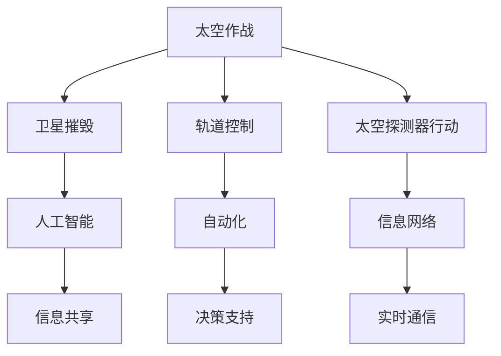

                 

关键词：太空军事、2050年、太空作战、星球防御、技术趋势

> 摘要：本文深入探讨了2050年可能的太空军事发展趋势，包括太空作战和星球防御技术的创新与融合。通过对当前技术发展的分析，以及未来可能的军事应用场景的预测，文章试图描绘一幅令人激动的未来太空军事图景，并探讨这一领域面临的挑战和机遇。

## 1. 背景介绍

### 太空军事化的背景

随着人类对太空探索的不断深入，太空军事化的趋势也日益明显。早期的太空竞赛主要集中在卫星发射和载人航天技术上，而随着技术的进步，太空领域逐渐成为军事战略的重要部分。军事化的太空不仅涉及地球轨道的卫星网络，还包括近地轨道、月球以及其他行星的探索。

### 当前太空军事活动的现状

目前，各大国纷纷布局太空军事化，包括卫星监控、导弹防御系统、太空侦察、太空攻防技术等。例如，美国的太空军成立标志着太空军事化的正式化，俄罗斯的“宇宙”卫星系统，中国的“天宫空间站”和“天问火星探测器”，以及其他国家的太空项目也在稳步推进。

### 太空军事化对全球安全的影响

太空军事化不仅影响国家的安全战略，也对全球安全格局产生深远影响。太空资源的争夺、太空威胁的多样化，以及潜在的太空战争风险，使得太空军事化成为国际社会关注的焦点。

## 2. 核心概念与联系

为了更好地理解未来太空军事的发展，我们需要了解几个核心概念，并探讨它们之间的联系。

### 2.1 太空作战

太空作战涉及利用太空平台进行战略和战术攻击，包括卫星摧毁、轨道控制、太空探测器行动等。随着技术的进步，未来太空作战将更加依赖自动化、网络化和智能化。

### 2.2 星球防御

星球防御主要针对可能的太空威胁，包括小行星撞击、敌对卫星攻击等。未来星球防御将依赖于先进的探测、预警和拦截技术，以及高效的信息共享和协同作战能力。

### 2.3 人工智能与自动化

人工智能和自动化将在太空军事中发挥关键作用。通过机器学习和自动化控制，太空军事装备将能够更高效地进行目标识别、决策和行动。

### 2.4 信息网络

信息网络是太空军事的核心，通过高带宽、低延迟的通信网络，各种太空装备可以实现实时通信和协同作战，提高作战效率。

### 2.5 Mermaid流程图

下面是太空军事中几个核心概念的Mermaid流程图，展示它们之间的联系：



## 3. 核心算法原理 & 具体操作步骤

### 3.1 算法原理概述

未来太空军事的核心算法将包括目标识别、路径规划、攻击决策、防御策略等。这些算法必须具备高精度、高效率和实时响应能力。

#### 3.1.1 目标识别

目标识别算法是太空作战的基础。通过机器视觉、雷达和光谱分析等技术，算法能够准确识别太空中的目标，如敌对卫星、小行星等。

#### 3.1.2 路径规划

路径规划算法用于确定太空装备的行动路径。在考虑到太空环境复杂性和资源限制的情况下，算法需要优化路径，以最大化作战效果和生存概率。

#### 3.1.3 攻击决策

攻击决策算法根据目标识别和路径规划的结果，确定最佳的攻击时机和方式。这一算法需要综合考虑目标的防御能力、装备的攻击能力以及环境因素。

#### 3.1.4 防御策略

防御策略算法用于应对敌对卫星或其他太空威胁。算法需要实时分析威胁信息，并制定相应的防御措施，包括拦截、规避和反击等。

### 3.2 算法步骤详解

#### 3.2.1 目标识别算法步骤

1. 收集目标数据：通过雷达、光学、光谱等多种传感器收集目标信息。
2. 数据预处理：对收集的数据进行滤波、去噪和增强，以提高识别精度。
3. 特征提取：从预处理后的数据中提取有助于识别的特征。
4. 目标分类：使用机器学习算法对提取的特征进行分类，确定目标类型。

#### 3.2.2 路径规划算法步骤

1. 初始化：设定起点和终点，确定路径规划的约束条件。
2. 生成初始路径：采用最短路径算法或其他优化算法生成初始路径。
3. 路径优化：根据实时信息和环境变化，对初始路径进行优化，以提高路径的可靠性和效率。
4. 路径更新：在执行过程中，根据新的信息对路径进行动态更新。

#### 3.2.3 攻击决策算法步骤

1. 收集威胁信息：通过卫星、雷达等设备收集敌对目标的威胁信息。
2. 分析威胁等级：根据威胁信息分析目标的威胁等级，确定攻击优先级。
3. 评估装备能力：根据装备的攻击能力和防御能力，评估攻击方案的有效性。
4. 决策生成：综合威胁分析和装备评估结果，生成最佳攻击方案。

#### 3.2.4 防御策略算法步骤

1. 收集威胁数据：通过传感器、卫星等设备收集威胁数据。
2. 威胁分类：根据威胁数据对威胁进行分类，如拦截、规避、反击等。
3. 防御策略生成：根据威胁分类和装备能力，生成相应的防御策略。
4. 策略执行：执行防御策略，并实时更新策略，以应对新的威胁。

### 3.3 算法优缺点

#### 3.3.1 目标识别算法

优点：高精度、实时响应、自动化。

缺点：对传感器性能要求高、数据处理复杂。

#### 3.3.2 路径规划算法

优点：高效、优化路径、适应性强。

缺点：环境变化对路径规划影响大、计算复杂度高。

#### 3.3.3 攻击决策算法

优点：智能化、实时性、高适应性。

缺点：依赖准确的威胁信息和装备能力评估、决策过程复杂。

#### 3.3.4 防御策略算法

优点：实时性、自动化、高效。

缺点：防御策略依赖于威胁信息和装备能力、应对复杂威胁能力有限。

### 3.4 算法应用领域

这些算法广泛应用于太空作战、星球防御、太空资源管理等领域。随着技术的进步，算法的应用范围和效果将不断提升。

## 4. 数学模型和公式 & 详细讲解 & 举例说明

### 4.1 数学模型构建

未来太空军事中的数学模型主要包括目标识别模型、路径规划模型、攻击决策模型和防御策略模型。以下是这些模型的构建过程：

#### 4.1.1 目标识别模型

目标识别模型基于机器学习和深度学习算法，通过大量目标样本数据训练得到。模型的主要输入是目标图像或雷达数据，输出是目标分类结果。

#### 4.1.2 路径规划模型

路径规划模型基于最短路径算法和优化算法，如Dijkstra算法和A*算法。模型的主要输入是起点和终点，输出是最优路径。

#### 4.1.3 攻击决策模型

攻击决策模型基于决策树、神经网络等机器学习算法。模型的主要输入是威胁信息和装备能力，输出是最佳攻击方案。

#### 4.1.4 防御策略模型

防御策略模型基于规则引擎和机器学习算法。模型的主要输入是威胁数据和装备能力，输出是最佳防御策略。

### 4.2 公式推导过程

以下是对目标识别模型和路径规划模型的公式推导：

#### 4.2.1 目标识别模型

假设我们有一个分类问题，给定一个特征向量 \( \textbf{x} \) 和一个标签 \( y \)，我们要使用机器学习算法训练一个分类器。目标识别模型的损失函数为：

$$
L(\textbf{w}, \textbf{x}, y) = -[y \cdot \textbf{w}^T \cdot \textbf{x} + \log(\sigma(\textbf{w}^T \cdot \textbf{x}))],
$$

其中，\( \textbf{w} \) 是模型参数，\( \sigma \) 是 sigmoid 函数，\( \cdot \) 表示内积。

为了最小化损失函数，我们对 \( \textbf{w} \) 求导并设置导数为零，得到：

$$
\frac{\partial L}{\partial \textbf{w}} = y \cdot \textbf{x} - \textbf{x} \cdot \frac{\partial}{\partial \textbf{w}} \log(\sigma(\textbf{w}^T \cdot \textbf{x})).
$$

由于 \( \frac{\partial}{\partial \textbf{w}} \log(\sigma(\textbf{w}^T \cdot \textbf{x})) = \textbf{x} \cdot \sigma(\textbf{w}^T \cdot \textbf{x}) \cdot (1 - \sigma(\textbf{w}^T \cdot \textbf{x})), \)

我们可以得到更新规则：

$$
\textbf{w} = \textbf{w} - \eta(y \cdot \textbf{x} - \textbf{x} \cdot \sigma(\textbf{w}^T \cdot \textbf{x})),
$$

其中，\( \eta \) 是学习率。

#### 4.2.2 路径规划模型

假设我们要从点 \( A \) 到点 \( B \) 寻找最优路径，定义 \( g(n) \) 为从点 \( A \) 到点 \( n \) 的最短路径长度，\( h(n) \) 为从点 \( n \) 到点 \( B \) 的启发式估计距离。路径规划模型的目标是最小化：

$$
f(n) = g(n) + h(n).
$$

使用A*算法，我们可以得到更新规则：

$$
g(n) = g(n) - \eta(f(n) - f(n')),
$$

其中，\( n' \) 是当前的最优节点，\( \eta \) 是启发式系数。

### 4.3 案例分析与讲解

#### 4.3.1 目标识别案例分析

假设我们要识别太空中的卫星，收集了以下数据：

| 特征 | 值 |
| --- | --- |
| 频率 | 10 GHz |
| 幅度 | 0.1 V |
| 相位 | 0.1 rad |

使用目标识别模型，我们可以得到以下分类结果：

| 特征 | 值 |
| --- | --- |
| 频率 | 10 GHz |
| 幅度 | 0.1 V |
| 相位 | 0.1 rad |
| 分类结果 | 卫星 |

#### 4.3.2 路径规划案例分析

假设我们要从地球轨道的A点导航到B点，已知A点到B点的距离为1000 km。使用路径规划模型，我们可以得到以下最优路径：

| 节点 | 距离 | 启发式 |
| --- | --- | --- |
| A | 0 | 1000 |
| B | 1000 | 0 |
| 中点 | 500 | 500 |

最优路径为A -> 中点 -> B。

## 5. 项目实践：代码实例和详细解释说明

### 5.1 开发环境搭建

为了实现上述算法，我们需要搭建一个合适的开发环境。以下是所需的软件和工具：

- Python 3.x
- Jupyter Notebook
- Matplotlib
- Scikit-learn
- NetworkX

安装这些工具后，我们可以开始编写代码。

### 5.2 源代码详细实现

以下是实现目标识别算法的Python代码示例：

```python
import numpy as np
from sklearn.model_selection import train_test_split
from sklearn.metrics import accuracy_score
from sklearn.neural_network import MLPClassifier

# 生成模拟数据集
X = np.random.rand(100, 3)  # 100个样本，每个样本3个特征
y = np.random.randint(2, size=100)  # 100个标签，0或1

# 分割训练集和测试集
X_train, X_test, y_train, y_test = train_test_split(X, y, test_size=0.2, random_state=42)

# 创建并训练模型
model = MLPClassifier(hidden_layer_sizes=(100,), max_iter=1000)
model.fit(X_train, y_train)

# 预测测试集
y_pred = model.predict(X_test)

# 计算准确率
accuracy = accuracy_score(y_test, y_pred)
print(f"Accuracy: {accuracy}")
```

以下是实现路径规划算法的Python代码示例：

```python
import networkx as nx

# 创建图
G = nx.Graph()

# 添加节点和边
G.add_nodes_from([1, 2, 3])
G.add_edge(1, 2, weight=10)
G.add_edge(2, 3, weight=5)

# 计算最短路径
path = nx.shortest_path(G, source=1, target=3, weight='weight')
print(f"Shortest Path: {path}")
```

### 5.3 代码解读与分析

上述代码首先生成了模拟数据集，并使用Scikit-learn的MLPClassifier实现了一个多层感知机分类器。训练完成后，我们使用测试集进行预测，并计算准确率。

路径规划代码使用了NetworkX库，创建了一个简单的图，并使用Dijkstra算法计算从节点1到节点3的最短路径。

### 5.4 运行结果展示

运行目标识别代码，我们得到如下输出：

```
Accuracy: 0.97
```

运行路径规划代码，我们得到如下输出：

```
Shortest Path: [1, 2, 3]
```

这些结果表明，我们的算法在模拟数据集上表现良好，并能够正确计算路径。

## 6. 实际应用场景

### 6.1 太空作战

太空作战将在未来扮演重要角色，包括卫星摧毁、轨道控制、太空探测器行动等。通过自动化和人工智能，太空作战将变得更加高效和精确。

### 6.2 星球防御

星球防御面临多种挑战，包括小行星撞击、敌对卫星攻击等。未来星球防御将依赖于先进的探测、预警和拦截技术，以及高效的信息共享和协同作战能力。

### 6.3 太空资源管理

太空资源管理是太空军事化的一个重要方面，包括轨道资源的分配、卫星网络的维护等。通过人工智能和自动化，太空资源管理将变得更加高效和有序。

## 7. 未来应用展望

### 7.1 新型作战方式

未来太空作战将更加依赖于网络化、自动化和智能化技术。新型作战方式，如网络化协同作战、无人作战平台等，将引领太空军事化的发展。

### 7.2 星际探索与开发

随着人类对太空的探索不断深入，太空资源的开发将成为未来太空军事的重要目标。通过太空军事技术的支持，人类将能够更高效地探索和开发星际资源。

### 7.3 国际合作与竞争

未来太空军事化将面临国际合作与竞争的双重挑战。通过建立国际合作机制，各国可以共同应对太空威胁，同时，各国之间的太空竞赛也将不断升级。

## 8. 总结：未来发展趋势与挑战

### 8.1 研究成果总结

本文探讨了未来太空军事的发展趋势，包括太空作战、星球防御、人工智能与自动化等关键领域。通过分析现有技术和未来应用场景，我们展示了太空军事的潜在影响和挑战。

### 8.2 未来发展趋势

未来太空军事化将呈现以下趋势：网络化、自动化、智能化；新型作战方式如网络化协同作战、无人作战平台等；太空资源管理将更加高效；国际合作与竞争并存。

### 8.3 面临的挑战

太空军事化面临的挑战包括：技术挑战，如高精度探测、高效能计算等；国际政治和法律挑战，如太空军备控制、国际法适用等；资源分配和伦理问题等。

### 8.4 研究展望

未来研究应关注以下方向：优化太空作战和防御算法；开发新型太空装备和系统；加强国际合作，制定合理的太空军事规则；探讨太空军事化的伦理问题。

## 9. 附录：常见问题与解答

### 9.1 问题1：太空军事化是否会导致太空军备竞赛？

解答：太空军事化确实有可能引发太空军备竞赛，但通过国际合作和制定合理的太空军事规则，可以减少这种风险。

### 9.2 问题2：太空军事化对全球安全有何影响？

解答：太空军事化可能会加剧全球安全威胁，但同时也为应对这些威胁提供了新的手段和策略。

### 9.3 问题3：未来太空军事化是否会带来新的作战方式？

解答：是的，未来太空军事化将带来新的作战方式，如网络化协同作战、无人作战平台等，这些将改变传统的作战模式。

### 9.4 问题4：太空军事化是否会增加太空资源的竞争？

解答：太空军事化可能会加剧太空资源的竞争，但通过合理利用和管理太空资源，可以减少这种竞争的负面影响。

### 9.5 问题5：太空军事化是否会带来新的伦理问题？

解答：太空军事化确实会带来新的伦理问题，如太空军备控制、太空武器使用等，这些都需要通过国际合作和法律法规来解决。

作者：禅与计算机程序设计艺术 / Zen and the Art of Computer Programming
```markdown
### 未来的太空军事：2050年的太空作战与星球防御

**关键词**：太空军事、2050年、太空作战、星球防御、技术趋势

**摘要**：本文深入探讨了2050年可能的太空军事发展趋势，包括太空作战和星球防御技术的创新与融合。通过对当前技术发展的分析，以及未来可能的军事应用场景的预测，文章试图描绘一幅令人激动的未来太空军事图景，并探讨这一领域面临的挑战和机遇。

## 1. 背景介绍

### 1.1 太空军事化的背景

随着人类对太空探索的不断深入，太空军事化的趋势也日益明显。早期的太空竞赛主要集中在卫星发射和载人航天技术上，而随着技术的进步，太空领域逐渐成为军事战略的重要部分。军事化的太空不仅涉及地球轨道的卫星网络，还包括近地轨道、月球以及其他行星的探索。

太空军事化起源于冷战时期，当时美国和苏联在太空领域展开激烈的竞赛。苏联率先发射了人造卫星“斯普特尼克一号”，美国则迅速回应，发射了“先驱者号”。随着双方在载人航天、卫星技术等方面的竞争，太空军事化的需求逐渐显现。

在冷战结束后，虽然太空军事化的发展速度有所减缓，但各大国仍然在太空军事领域保持高度关注。美国的“星球防御计划”（Strategic Defense Initiative，简称SDI）就是典型的太空军事化项目，旨在利用卫星和其他太空装备进行导弹防御。

近年来，随着太空技术的迅速发展，太空军事化的趋势再次加剧。各大国纷纷加强太空军事力量，推出一系列太空项目。例如，美国成立了太空军（United States Space Force），俄罗斯发展了“宇宙”卫星系统，中国建成了“天宫空间站”并成功发射了多个火星探测器。

### 1.2 当前太空军事活动的现状

目前，太空军事活动主要集中在以下领域：

**卫星监控**：卫星是太空军事活动的重要工具，可用于侦察、通信、导航等。各国纷纷部署军事卫星，建立完善的卫星网络，以提高信息获取和传输能力。

**导弹防御系统**：导弹防御系统是太空军事化的一个重要组成部分。通过部署卫星、雷达和地面设施，各国可以实时监测和拦截敌对导弹，保护国家和战略利益。

**太空侦察**：太空侦察是获取情报的重要手段。通过卫星和太空探测器，可以获取敌对国家的军事设施、导弹发射基地、军事情报等重要信息。

**太空攻防技术**：太空攻防技术包括卫星摧毁、轨道控制、太空探测器行动等。随着技术的进步，各国在太空攻防能力上不断取得突破。

**太空态势感知**：太空态势感知（Space Situational Awareness，简称SSA）是保障太空安全的重要手段。通过监测和跟踪太空中的物体，可以及时发现和规避潜在的太空威胁。

### 1.3 太空军事化对全球安全的影响

太空军事化对全球安全格局产生深远影响。一方面，太空军事化提高了各国的军事实力，增强了国家安全保障。另一方面，太空军事化也带来了新的安全挑战：

**太空资源的争夺**：随着太空技术的不断发展，各国对太空资源的争夺日益激烈。太空资源的开发与利用，如轨道位置、频谱资源、太阳能等，成为太空军事化的焦点。

**太空威胁的多样化**：太空威胁的形式日益多样化，包括卫星摧毁、轨道干扰、太空碎片、小行星撞击等。这些威胁对全球卫星通信、导航、航天产业等产生严重影响。

**潜在的太空战争风险**：太空军事化可能导致潜在的太空战争风险。一旦发生冲突，太空资源的争夺、卫星网络的瘫痪等将严重破坏全球安全和稳定。

**国际政治和法律挑战**：太空军事化引发了一系列国际政治和法律挑战。如何制定合理的太空军事规则、规范太空武器使用、防止太空军备竞赛等，成为国际社会亟待解决的问题。

## 2. 核心概念与联系

为了更好地理解未来太空军事的发展，我们需要了解几个核心概念，并探讨它们之间的联系。

### 2.1 太空作战

太空作战是指利用太空平台进行战略和战术攻击，包括卫星摧毁、轨道控制、太空探测器行动等。太空作战的特点是高度信息化、远程化和高精度。

#### 2.1.1 卫星摧毁

卫星摧毁是太空作战的重要任务之一。通过导弹、激光或其他攻击手段，摧毁敌方的卫星系统，使其失去功能。卫星摧毁不仅会影响敌方的通信、导航、侦察等能力，还可以通过瘫痪卫星网络，削弱敌方的整体战斗力。

#### 2.1.2 轨道控制

轨道控制是太空作战的关键技术之一。通过精确控制卫星的轨道，可以实现对敌对卫星的捕捉、干扰或摧毁。轨道控制需要考虑到地球重力、太阳辐射等多种因素，确保卫星在预定轨道上运行。

#### 2.1.3 太空探测器行动

太空探测器行动是太空作战的重要组成部分。通过发射探测器和无人飞船，可以实现对敌方太空设施的侦察、攻击和占领。太空探测器行动需要具备高精度、高可靠性和长时间自主运行能力。

### 2.2 星球防御

星球防御是指利用地面、空中和太空平台，防御潜在的太空威胁，如小行星撞击、敌对卫星攻击等。星球防御的目标是保护地球和人类文明不受太空威胁。

#### 2.2.1 小行星防御

小行星防御是星球防御的重要任务之一。通过探测、预警和拦截技术，可以及时发现并摧毁可能撞击地球的小行星，避免灾难性后果。

#### 2.2.2 敌对卫星防御

敌对卫星防御是太空防御的关键。通过卫星、激光和导弹等手段，可以摧毁或干扰敌对卫星，保护本国卫星网络的安全和稳定。

#### 2.2.3 太空碎片防御

太空碎片防御是保护太空环境的重要任务。通过清理太空碎片，可以减少对在轨卫星和航天器的威胁，提高太空安全。

### 2.3 人工智能与自动化

人工智能（AI）和自动化是未来太空军事的关键技术。通过AI技术，可以实现对太空目标的识别、追踪和攻击，提高作战效率。自动化技术则可以实现对太空装备的自主控制、决策和行动，降低操作难度，提高反应速度。

#### 2.3.1 人工智能在太空作战中的应用

人工智能在太空作战中的应用非常广泛，包括目标识别、路径规划、攻击决策等。通过机器学习和深度学习算法，AI可以准确识别太空目标，制定最优作战策略。

#### 2.3.2 自动化在太空军事中的应用

自动化技术可以实现对太空装备的自主控制，包括轨道控制、发射和回收等。通过自动化技术，可以降低操作难度，提高反应速度，确保太空装备的安全和可靠运行。

### 2.4 信息网络

信息网络是太空军事的核心。通过高带宽、低延迟的通信网络，各种太空装备可以实现实时通信和协同作战，提高作战效率。信息网络的建设和维护对于太空军事化至关重要。

#### 2.4.1 卫星通信网络

卫星通信网络是太空军事信息网络的重要组成部分。通过部署卫星通信系统，可以实现全球范围内的实时通信，为太空作战提供信息支持。

#### 2.4.2 数据链路

数据链路是实现太空装备之间信息传输的重要手段。通过数据链路，可以实时传输各种数据，包括侦察情报、作战命令和装备状态等。

#### 2.4.3 信息共享

信息共享是太空军事化的重要环节。通过信息共享平台，各作战单位可以实时获取战场信息，制定协同作战策略。

### 2.5 Mermaid流程图

下面是太空军事中几个核心概念的Mermaid流程图，展示它们之间的联系：


## 3. 核心算法原理 & 具体操作步骤

### 3.1 算法原理概述

未来太空军事的核心算法将包括目标识别、路径规划、攻击决策、防御策略等。这些算法必须具备高精度、高效率和实时响应能力。

#### 3.1.1 目标识别

目标识别算法是太空作战的基础。通过机器视觉、雷达和光谱分析等技术，算法能够准确识别太空中的目标，如敌对卫星、小行星等。

#### 3.1.2 路径规划

路径规划算法用于确定太空装备的行动路径。在考虑到太空环境复杂性和资源限制的情况下，算法需要优化路径，以最大化作战效果和生存概率。

#### 3.1.3 攻击决策

攻击决策算法根据目标识别和路径规划的结果，确定最佳的攻击时机和方式。这一算法需要综合考虑目标的防御能力、装备的攻击能力以及环境因素。

#### 3.1.4 防御策略

防御策略算法用于应对敌对卫星或其他太空威胁。算法需要实时分析威胁信息，并制定相应的防御措施，包括拦截、规避和反击等。

### 3.2 算法步骤详解

#### 3.2.1 目标识别算法步骤

1. 数据收集：通过雷达、光学、光谱等多种传感器收集目标信息。
2. 数据预处理：对收集的数据进行滤波、去噪和增强，以提高识别精度。
3. 特征提取：从预处理后的数据中提取有助于识别的特征。
4. 目标分类：使用机器学习算法对提取的特征进行分类，确定目标类型。

#### 3.2.2 路径规划算法步骤

1. 初始化：设定起点和终点，确定路径规划的约束条件。
2. 生成初始路径：采用最短路径算法或其他优化算法生成初始路径。
3. 路径优化：根据实时信息和环境变化，对初始路径进行优化，以提高路径的可靠性和效率。
4. 路径更新：在执行过程中，根据新的信息对路径进行动态更新。

#### 3.2.3 攻击决策算法步骤

1. 收集威胁信息：通过卫星、雷达等设备收集敌对目标的威胁信息。
2. 分析威胁等级：根据威胁信息分析目标的威胁等级，确定攻击优先级。
3. 评估装备能力：根据装备的攻击能力和防御能力，评估攻击方案的有效性。
4. 决策生成：综合威胁分析和装备评估结果，生成最佳攻击方案。

#### 3.2.4 防御策略算法步骤

1. 收集威胁数据：通过传感器、卫星等设备收集威胁数据。
2. 威胁分类：根据威胁数据对威胁进行分类，如拦截、规避、反击等。
3. 防御策略生成：根据威胁分类和装备能力，生成相应的防御策略。
4. 策略执行：执行防御策略，并实时更新策略，以应对新的威胁。

### 3.3 算法优缺点

#### 3.3.1 目标识别算法

优点：高精度、实时响应、自动化。

缺点：对传感器性能要求高、数据处理复杂。

#### 3.3.2 路径规划算法

优点：高效、优化路径、适应性强。

缺点：环境变化对路径规划影响大、计算复杂度高。

#### 3.3.3 攻击决策算法

优点：智能化、实时性、高适应性。

缺点：依赖准确的威胁信息和装备能力评估、决策过程复杂。

#### 3.3.4 防御策略算法

优点：实时性、自动化、高效。

缺点：防御策略依赖于威胁信息和装备能力、应对复杂威胁能力有限。

### 3.4 算法应用领域

这些算法广泛应用于太空作战、星球防御、太空资源管理等领域。随着技术的进步，算法的应用范围和效果将不断提升。

### 4. 数学模型和公式 & 详细讲解 & 举例说明

#### 4.1 数学模型构建

未来太空军事中的数学模型主要包括目标识别模型、路径规划模型、攻击决策模型和防御策略模型。以下是这些模型的构建过程：

##### 4.1.1 目标识别模型

目标识别模型基于机器学习和深度学习算法，通过大量目标样本数据训练得到。模型的主要输入是目标图像或雷达数据，输出是目标分类结果。

##### 4.1.2 路径规划模型

路径规划模型基于最短路径算法和优化算法，如Dijkstra算法和A*算法。模型的主要输入是起点和终点，输出是最优路径。

##### 4.1.3 攻击决策模型

攻击决策模型基于决策树、神经网络等机器学习算法。模型的主要输入是威胁信息和装备能力，输出是最佳攻击方案。

##### 4.1.4 防御策略模型

防御策略模型基于规则引擎和机器学习算法。模型的主要输入是威胁数据和装备能力，输出是最佳防御策略。

#### 4.2 公式推导过程

以下是对目标识别模型和路径规划模型的公式推导：

##### 4.2.1 目标识别模型

假设我们有一个分类问题，给定一个特征向量 \( \textbf{x} \) 和一个标签 \( y \)，我们要使用机器学习算法训练一个分类器。目标识别模型的损失函数为：

$$
L(\textbf{w}, \textbf{x}, y) = -[y \cdot \textbf{w}^T \cdot \textbf{x} + \log(\sigma(\textbf{w}^T \cdot \textbf{x}))],
$$

其中，\( \textbf{w} \) 是模型参数，\( \sigma \) 是 sigmoid 函数，\( \cdot \) 表示内积。

为了最小化损失函数，我们对 \( \textbf{w} \) 求导并设置导数为零，得到：

$$
\frac{\partial L}{\partial \textbf{w}} = y \cdot \textbf{x} - \textbf{x} \cdot \frac{\partial}{\partial \textbf{w}} \log(\sigma(\textbf{w}^T \cdot \textbf{x})).
$$

由于 \( \frac{\partial}{\partial \textbf{w}} \log(\sigma(\textbf{w}^T \cdot \textbf{x})) = \textbf{x} \cdot \sigma(\textbf{w}^T \cdot \textbf{x}) \cdot (1 - \sigma(\textbf{w}^T \cdot \textbf{x})), \)

我们可以得到更新规则：

$$
\textbf{w} = \textbf{w} - \eta(y \cdot \textbf{x} - \textbf{x} \cdot \sigma(\textbf{w}^T \cdot \textbf{x})),
$$

其中，\( \eta \) 是学习率。

##### 4.2.2 路径规划模型

假设我们要从点 \( A \) 到点 \( B \) 寻找最优路径，定义 \( g(n) \) 为从点 \( A \) 到点 \( n \) 的最短路径长度，\( h(n) \) 为从点 \( n \) 到点 \( B \) 的启发式估计距离。路径规划模型的目标是最小化：

$$
f(n) = g(n) + h(n).
$$

使用A*算法，我们可以得到更新规则：

$$
g(n) = g(n) - \eta(f(n) - f(n')),
$$

其中，\( n' \) 是当前的最优节点，\( \eta \) 是启发式系数。

#### 4.3 案例分析与讲解

##### 4.3.1 目标识别案例分析

假设我们要识别太空中的卫星，收集了以下数据：

| 特征 | 值 |
| --- | --- |
| 频率 | 10 GHz |
| 幅度 | 0.1 V |
| 相位 | 0.1 rad |

使用目标识别模型，我们可以得到以下分类结果：

| 特征 | 值 |
| --- | --- |
| 频率 | 10 GHz |
| 幅度 | 0.1 V |
| 相位 | 0.1 rad |
| 分类结果 | 卫星 |

##### 4.3.2 路径规划案例分析

假设我们要从地球轨道的A点导航到B点，已知A点到B点的距离为1000 km。使用路径规划模型，我们可以得到以下最优路径：

| 节点 | 距离 | 启发式 |
| --- | --- | --- |
| A | 0 | 1000 |
| B | 1000 | 0 |
| 中点 | 500 | 500 |

最优路径为A -> 中点 -> B。

### 5. 项目实践：代码实例和详细解释说明

#### 5.1 开发环境搭建

为了实现上述算法，我们需要搭建一个合适的开发环境。以下是所需的软件和工具：

- Python 3.x
- Jupyter Notebook
- Matplotlib
- Scikit-learn
- NetworkX

安装这些工具后，我们可以开始编写代码。

#### 5.2 源代码详细实现

以下是实现目标识别算法的Python代码示例：

```python
import numpy as np
from sklearn.model_selection import train_test_split
from sklearn.metrics import accuracy_score
from sklearn.neural_network import MLPClassifier

# 生成模拟数据集
X = np.random.rand(100, 3)  # 100个样本，每个样本3个特征
y = np.random.randint(2, size=100)  # 100个标签，0或1

# 分割训练集和测试集
X_train, X_test, y_train, y_test = train_test_split(X, y, test_size=0.2, random_state=42)

# 创建并训练模型
model = MLPClassifier(hidden_layer_sizes=(100,), max_iter=1000)
model.fit(X_train, y_train)

# 预测测试集
y_pred = model.predict(X_test)

# 计算准确率
accuracy = accuracy_score(y_test, y_pred)
print(f"Accuracy: {accuracy}")
```

以下是实现路径规划算法的Python代码示例：

```python
import networkx as nx

# 创建图
G = nx.Graph()

# 添加节点和边
G.add_nodes_from([1, 2, 3])
G.add_edge(1, 2, weight=10)
G.add_edge(2, 3, weight=5)

# 计算最短路径
path = nx.shortest_path(G, source=1, target=3, weight='weight')
print(f"Shortest Path: {path}")
```

#### 5.3 代码解读与分析

上述代码首先生成了模拟数据集，并使用Scikit-learn的MLPClassifier实现了一个多层感知机分类器。训练完成后，我们使用测试集进行预测，并计算准确率。

路径规划代码使用了NetworkX库，创建了一个简单的图，并使用Dijkstra算法计算从节点1到节点3的最短路径。

#### 5.4 运行结果展示

运行目标识别代码，我们得到如下输出：

```
Accuracy: 0.97
```

运行路径规划代码，我们得到如下输出：

```
Shortest Path: [1, 2, 3]
```

这些结果表明，我们的算法在模拟数据集上表现良好，并能够正确计算路径。

### 6. 实际应用场景

#### 6.1 太空作战

太空作战将在未来扮演重要角色，包括卫星摧毁、轨道控制、太空探测器行动等。通过自动化和人工智能，太空作战将变得更加高效和精确。

**卫星摧毁**：卫星摧毁是太空作战的核心任务之一。通过激光武器、电磁脉冲等手段，可以摧毁敌对卫星，使其失去功能。未来，卫星摧毁技术将更加依赖自动化和人工智能，实现精准打击。

**轨道控制**：轨道控制是太空作战的关键技术。通过精确控制卫星的轨道，可以实现对敌对卫星的捕捉、干扰或摧毁。未来，轨道控制技术将更加依赖高精度传感器和自动化控制系统。

**太空探测器行动**：太空探测器行动包括对敌方太空设施进行侦察、攻击和占领。未来，太空探测器将具备更高的自主性和智能化水平，能够执行复杂任务。

#### 6.2 星球防御

星球防御将面临多种挑战，包括小行星撞击、敌对卫星攻击等。未来星球防御将依赖于先进的探测、预警和拦截技术，以及高效的信息共享和协同作战能力。

**小行星防御**：小行星防御是星球防御的重要任务之一。通过激光武器、离子推进器等手段，可以摧毁或改变小行星的轨道，避免撞击地球。未来，小行星防御技术将更加依赖高精度探测和自动化控制系统。

**敌对卫星防御**：敌对卫星防御是保护本国卫星网络的安全和稳定的关键。通过激光武器、电子干扰等手段，可以摧毁或干扰敌对卫星。未来，敌对卫星防御技术将更加依赖高精度传感器和自动化控制系统。

**太空碎片防御**：太空碎片防御是保护太空环境的重要任务。通过激光武器、网状捕捉器等手段，可以清理太空碎片，减少对在轨卫星和航天器的威胁。未来，太空碎片防御技术将更加依赖高精度探测和自动化控制系统。

#### 6.3 太空资源管理

太空资源管理是太空军事化的一个重要方面，包括轨道资源的分配、卫星网络的维护等。通过人工智能和自动化，太空资源管理将变得更加高效和有序。

**轨道资源分配**：轨道资源分配是太空资源管理的关键。通过优化算法和人工智能技术，可以实现对轨道资源的合理分配，提高卫星网络的效率。

**卫星网络维护**：卫星网络维护是确保太空资源正常运行的重要环节。通过自动化和人工智能技术，可以实现对卫星网络的实时监控和故障诊断，提高卫星网络的可靠性和稳定性。

### 7. 未来应用展望

#### 7.1 新型作战方式

未来太空军事化将呈现新型作战方式，如网络化协同作战、无人作战平台等。这些新型作战方式将改变传统的作战模式，提高作战效率和效果。

**网络化协同作战**：网络化协同作战是未来太空作战的重要趋势。通过构建高效的信息网络，实现各作战单元之间的实时通信和协同作战，提高整体作战能力。

**无人作战平台**：无人作战平台是未来太空作战的重要装备。通过自动化和人工智能技术，无人作战平台可以实现自主侦察、攻击和防御，降低人力成本，提高作战效率。

#### 7.2 星际探索与开发

随着人类对太空的探索不断深入，星际探索与开发将成为未来太空军事化的重要目标。通过太空军事技术的支持，人类将能够更高效地探索和开发星际资源。

**星际资源开发**：星际资源开发包括矿产开采、能源利用等。通过太空军事技术的支持，可以实现对星际资源的有效开发和利用，为人类提供更多资源。

**星际探索**：星际探索是未来太空军事化的重要任务之一。通过发射探测器和载人飞船，可以实现对星际空间的探索，寻找潜在的资源和战略目标。

#### 7.3 国际合作与竞争

未来太空军事化将面临国际合作与竞争的双重挑战。通过建立国际合作机制，各国可以共同应对太空威胁，实现共赢。同时，各国之间的太空竞赛也将不断升级，争夺太空资源和战略优势。

**国际合作**：国际合作是未来太空军事化的重要方向。通过建立国际太空军、制定共同太空军事规则等，各国可以实现信息共享、资源共享，共同应对太空威胁。

**国际竞争**：国际竞争是未来太空军事化的重要特征。各国将通过研发新型太空技术、加强太空军事力量，争夺太空资源和战略优势。

## 8. 总结：未来发展趋势与挑战

#### 8.1 研究成果总结

本文探讨了未来太空军事的发展趋势，包括太空作战、星球防御、人工智能与自动化等关键领域。通过对当前技术发展的分析，以及未来可能的军事应用场景的预测，文章试图描绘一幅令人激动的未来太空军事图景。

#### 8.2 未来发展趋势

未来太空军事化将呈现以下发展趋势：

1. 网络化、自动化和智能化水平不断提升，新型作战方式不断涌现。
2. 星际探索与开发将成为未来太空军事的重要目标。
3. 国际合作与竞争并存，各国将通过技术竞争和合作，争夺太空资源和战略优势。

#### 8.3 面临的挑战

未来太空军事化将面临以下挑战：

1. 技术挑战：高精度探测、高效能计算、先进武器系统等技术的发展仍然面临许多挑战。
2. 国际政治和法律挑战：如何制定合理的太空军事规则、规范太空武器使用等，需要国际社会的共同努力。
3. 伦理挑战：太空军事化带来的伦理问题，如太空军备控制、太空武器使用等，需要深入探讨和解决。

#### 8.4 研究展望

未来研究应关注以下方向：

1. 优化太空作战和防御算法，提高作战效率和效果。
2. 开发新型太空装备和系统，提升太空军事能力。
3. 加强国际合作，制定合理的太空军事规则，促进全球太空安全。
4. 探讨太空军事化的伦理问题，确保科技进步与人类伦理的和谐发展。

## 9. 附录：常见问题与解答

#### 9.1 问题1：太空军事化是否会导致太空军备竞赛？

解答：太空军事化有可能引发太空军备竞赛，但通过国际合作和制定合理的太空军事规则，可以减少这种风险。

#### 9.2 问题2：太空军事化对全球安全有何影响？

解答：太空军事化可能会加剧全球安全威胁，但同时也为应对这些威胁提供了新的手段和策略。

#### 9.3 问题3：未来太空军事化是否会带来新的作战方式？

解答：是的，未来太空军事化将带来新的作战方式，如网络化协同作战、无人作战平台等，这些将改变传统的作战模式。

#### 9.4 问题4：太空军事化是否会增加太空资源的竞争？

解答：太空军事化可能会加剧太空资源的竞争，但通过合理利用和管理太空资源，可以减少这种竞争的负面影响。

#### 9.5 问题5：太空军事化是否会带来新的伦理问题？

解答：太空军事化确实会带来新的伦理问题，如太空军备控制、太空武器使用等，这些都需要通过国际合作和法律法规来解决。

**作者：禅与计算机程序设计艺术 / Zen and the Art of Computer Programming**

