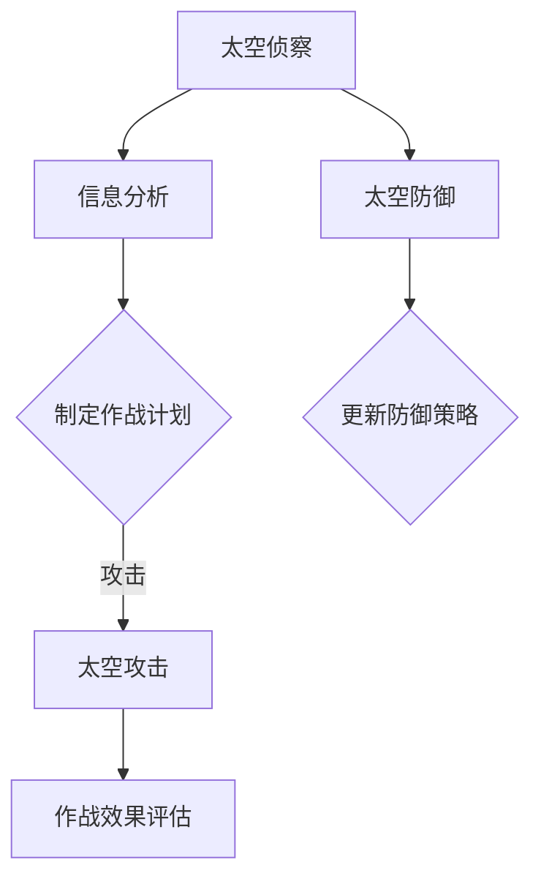
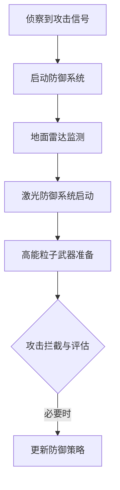

                 

## 1. 背景介绍

随着人类太空探索的不断深入，太空军事化的趋势日益明显。从早期的卫星通信到如今的深空探测，太空已成为国家战略竞争的新战场。进入21世纪，各国纷纷加大在太空科技和军事领域的投入，太空军事化进程加快。据专家预测，到2050年，太空将不再是和平的太空，而是充满竞争和对抗的“第三战场”。

太空军事化的主要表现包括：卫星监控、太空侦察、太空防御、太空作战以及反卫星武器系统的部署。随着技术的不断发展，未来的太空军事化将不仅仅是传统意义上的卫星监控和侦察，还将涉及到太空作战和网络战等更为复杂的领域。

本文旨在探讨2050年的太空军事化发展趋势，重点关注太空作战和星球防御两大核心领域。我们将从技术原理、算法模型、实际应用等多个角度进行深入分析，为读者呈现一幅未来的太空军事画卷。

## 2. 核心概念与联系

### 2.1 太空作战

太空作战是指利用太空资产进行战略威慑、信息攻防和实际作战行动的能力。它包括以下关键概念：

- **空间资产**：包括卫星、太空站、无人机等。
- **太空侦察**：通过卫星、无人机等收集敌方信息。
- **太空防御**：利用太空资产进行防御，如反卫星武器、激光防御系统等。
- **太空作战指挥**：利用信息网络进行作战指挥和协调。

下面是一个Mermaid流程图，展示太空作战的基本流程：



### 2.2 星球防御

星球防御是指保护地球及其附属空间（如近地轨道、月球等）免受敌方攻击的能力。其主要概念包括：

- **地球防御系统**：包括地面雷达、激光防御系统、高能粒子武器等。
- **月球防御**：针对月球表面的防御措施。
- **近地轨道防御**：保护近地轨道卫星和空间站的安全。

下面是一个Mermaid流程图，展示星球防御的基本流程：



### 2.3 关联性分析

太空作战和星球防御之间存在紧密的联系。首先，太空作战中的侦察和防御系统数据将为星球防御提供关键信息。其次，星球防御的成功也将直接影响太空作战的进行。例如，在近地轨道的卫星被敌方攻击后，地球防御系统需要迅速响应以保护其他卫星和空间站。

综上所述，太空作战和星球防御是未来太空军事化的重要组成部分，它们之间的协同与联动将决定太空军事化的整体效能。

## 3. 核心算法原理 & 具体操作步骤

### 3.1 算法原理概述

在太空作战和星球防御中，核心算法的作用至关重要。这些算法主要包括以下三个方面：

1. **目标识别与跟踪算法**：用于识别和跟踪太空中的目标，如卫星、太空站等。
2. **作战计划与决策算法**：基于侦察信息，制定有效的作战计划，并实时调整。
3. **防御系统控制算法**：控制地面雷达、激光防御系统、高能粒子武器等，进行精确打击。

下面，我们将详细讨论这些算法的原理和具体操作步骤。

### 3.2 算法步骤详解

#### 3.2.1 目标识别与跟踪算法

1. **数据采集**：通过卫星、无人机等侦察设备，收集太空中的目标数据。
2. **预处理**：对收集到的数据进行去噪、滤波等预处理，提高数据质量。
3. **特征提取**：从预处理后的数据中提取目标特征，如速度、方向、位置等。
4. **模式识别**：利用机器学习算法，如支持向量机（SVM）、神经网络（NN）等，对目标进行识别和分类。
5. **跟踪与更新**：对识别出的目标进行实时跟踪，并根据新数据更新目标状态。

#### 3.2.2 作战计划与决策算法

1. **信息分析**：收集到的侦察数据经过处理，形成敌我态势图。
2. **目标评估**：根据敌我态势图，评估各目标的重要性，如敌方卫星的威胁等级。
3. **作战计划制定**：基于目标评估结果，制定作战计划，包括攻击顺序、攻击方式等。
4. **实时决策**：根据实时侦察数据，调整作战计划，确保作战行动的有效性。

#### 3.2.3 防御系统控制算法

1. **防御系统配置**：根据侦察信息，配置地面雷达、激光防御系统、高能粒子武器等防御资源。
2. **攻击预测**：利用机器学习算法，预测敌方攻击的时间和方向。
3. **防御系统启动**：根据攻击预测，启动相应的防御系统，进行攻击拦截。
4. **攻击效果评估**：评估防御系统的攻击效果，并根据评估结果进行系统调整。

### 3.3 算法优缺点

**目标识别与跟踪算法**：
- **优点**：能够高效地识别和跟踪太空中的目标，提高侦察效率。
- **缺点**：在复杂环境中，如多目标同时出现时，识别和跟踪的准确性可能受到影响。

**作战计划与决策算法**：
- **优点**：能够根据实时侦察数据，灵活调整作战计划，提高作战效能。
- **缺点**：在数据传输延迟较高时，决策速度可能受到影响。

**防御系统控制算法**：
- **优点**：能够精确控制防御系统，进行高效拦截。
- **缺点**：在防御资源有限时，需要优先考虑防御重点，可能导致部分防御资源浪费。

### 3.4 算法应用领域

这些核心算法在太空作战和星球防御中具有广泛的应用。例如，目标识别与跟踪算法可用于卫星监控、太空侦察；作战计划与决策算法可用于太空作战指挥；防御系统控制算法可用于地面雷达、激光防御系统、高能粒子武器等的控制。

总之，核心算法在太空军事化中的重要性不言而喻。随着技术的不断发展，这些算法将不断完善，为未来的太空作战和星球防御提供强有力的支持。

## 4. 数学模型和公式 & 详细讲解 & 举例说明

在太空军事化和星球防御中，数学模型和公式的作用至关重要。这些模型和公式不仅能够帮助我们理解复杂系统的运作，还能够指导实际操作。在本节中，我们将介绍几个关键数学模型和公式，并进行详细讲解和举例说明。

### 4.1 数学模型构建

#### 4.1.1 太空目标运动模型

太空目标运动模型主要描述了太空中的物体在受到引力、推力等作用下的运动状态。以下是该模型的基本公式：

\[ \mathbf{v}(t) = \mathbf{v}_0 + \int_{0}^{t} \mathbf{a}(t') \, dt' \]

其中，\(\mathbf{v}(t)\) 表示目标在时间 \(t\) 的速度向量，\(\mathbf{v}_0\) 表示初始速度向量，\(\mathbf{a}(t')\) 表示目标在时间 \(t'\) 的加速度向量。

#### 4.1.2 太空目标轨迹预测模型

太空目标轨迹预测模型用于预测目标在未来一段时间内的位置。其基本公式如下：

\[ \mathbf{r}(t) = \mathbf{r}_0 + \mathbf{v}_0 t + \frac{1}{2} \mathbf{a} t^2 \]

其中，\(\mathbf{r}(t)\) 表示目标在时间 \(t\) 的位置向量，\(\mathbf{r}_0\) 表示初始位置向量。

#### 4.1.3 防御系统效果评估模型

防御系统效果评估模型用于评估防御系统在拦截敌方攻击时的效果。其基本公式如下：

\[ E = \frac{1}{2} m v^2 \]

其中，\(E\) 表示拦截效果，\(m\) 表示拦截物体的质量，\(v\) 表示拦截物体的速度。

### 4.2 公式推导过程

#### 4.2.1 太空目标运动模型推导

太空目标运动模型基于牛顿第二定律推导而来。假设太空目标在 \(t=0\) 时，其速度为 \(\mathbf{v}_0\)，加速度为 \(\mathbf{a}\)。则根据牛顿第二定律：

\[ \mathbf{F} = m \mathbf{a} \]

其中，\(\mathbf{F}\) 表示作用在目标上的合外力，\(m\) 表示目标的质量。

对于匀加速直线运动，加速度 \(\mathbf{a}\) 是恒定的，可以表示为：

\[ \mathbf{a} = \frac{\mathbf{F}}{m} \]

将加速度积分，得到速度：

\[ \mathbf{v}(t) = \mathbf{v}_0 + \int_{0}^{t} \mathbf{a}(t') \, dt' \]

同理，将速度积分，得到位置：

\[ \mathbf{r}(t) = \mathbf{r}_0 + \mathbf{v}_0 t + \frac{1}{2} \mathbf{a} t^2 \]

#### 4.2.2 太空目标轨迹预测模型推导

太空目标轨迹预测模型基于目标运动模型推导而来。假设目标在 \(t=0\) 时，其速度为 \(\mathbf{v}_0\)，加速度为 \(\mathbf{a}\)。则根据目标运动模型，目标在任意时间 \(t\) 的速度为：

\[ \mathbf{v}(t) = \mathbf{v}_0 + \mathbf{a} t \]

将速度积分，得到目标在任意时间 \(t\) 的位置：

\[ \mathbf{r}(t) = \mathbf{r}_0 + \mathbf{v}_0 t + \frac{1}{2} \mathbf{a} t^2 \]

#### 4.2.3 防御系统效果评估模型推导

防御系统效果评估模型基于动能定理推导而来。假设防御系统在拦截敌方攻击时，将敌方攻击物从速度 \(v_0\) 减速到速度 \(v\)，则敌方攻击物的动能变化量为：

\[ \Delta E = \frac{1}{2} m v^2 - \frac{1}{2} m v_0^2 \]

其中，\(m\) 表示敌方攻击物的质量。

由于防御系统做功 \(W\) 等于敌方攻击物动能变化量，所以：

\[ W = \frac{1}{2} m v^2 - \frac{1}{2} m v_0^2 \]

由于 \(W = F \cdot d\)，其中 \(F\) 表示作用力，\(d\) 表示作用距离，我们可以得到：

\[ \frac{1}{2} m v^2 = \frac{1}{2} m v_0^2 + F \cdot d \]

假设 \(F\) 是恒定的，则：

\[ E = \frac{1}{2} m v^2 \]

其中，\(E\) 表示拦截效果。

### 4.3 案例分析与讲解

#### 4.3.1 太空目标运动模型应用案例

假设某卫星在 \(t=0\) 时，其速度为 \(\mathbf{v}_0 = (1000, 2000)\) m/s，加速度为 \(\mathbf{a} = (-50, 0)\) m/s²。我们需要预测该卫星在 \(t=10\) s 时的位置。

根据太空目标运动模型，卫星在 \(t=10\) s 时的速度为：

\[ \mathbf{v}(10) = \mathbf{v}_0 + \mathbf{a} \cdot 10 = (1000, 2000) + (-50, 0) \cdot 10 = (950, 2000) \]

卫星在 \(t=10\) s 时的位置为：

\[ \mathbf{r}(10) = \mathbf{r}_0 + \mathbf{v}_0 \cdot 10 + \frac{1}{2} \mathbf{a} \cdot 10^2 = (0, 0) + (1000, 2000) \cdot 10 + \frac{1}{2} (-50, 0) \cdot 10^2 = (9500, 20000) \]

因此，该卫星在 \(t=10\) s 时的位置为 \( (9500, 20000) \) m。

#### 4.3.2 太空目标轨迹预测模型应用案例

假设某卫星在 \(t=0\) 时，其位置为 \(\mathbf{r}_0 = (0, 0)\)，速度为 \(\mathbf{v}_0 = (1000, 2000)\) m/s，加速度为 \(\mathbf{a} = (-50, 0)\) m/s²。我们需要预测该卫星在 \(t=10\) s 时的位置。

根据太空目标轨迹预测模型，卫星在 \(t=10\) s 时的位置为：

\[ \mathbf{r}(10) = \mathbf{r}_0 + \mathbf{v}_0 \cdot 10 + \frac{1}{2} \mathbf{a} \cdot 10^2 = (0, 0) + (1000, 2000) \cdot 10 + \frac{1}{2} (-50, 0) \cdot 10^2 = (9500, 20000) \]

因此，该卫星在 \(t=10\) s 时的位置为 \( (9500, 20000) \) m。

#### 4.3.3 防御系统效果评估模型应用案例

假设某防御系统成功拦截了一枚以速度 \(v_0 = 10000\) m/s 运动的敌方攻击物，拦截后的速度为 \(v = 5000\) m/s。我们需要评估该防御系统的拦截效果。

根据防御系统效果评估模型，拦截效果为：

\[ E = \frac{1}{2} m v^2 = \frac{1}{2} m (5000)^2 = \frac{1}{2} m (25000000) = 12500000 \text{ J} \]

其中，\(m\) 表示敌方攻击物的质量。

因此，该防御系统的拦截效果为 \(12500000\) J。

### 4.4 其他数学模型介绍

除了上述模型外，还有其他一些重要的数学模型在太空军事化和星球防御中发挥作用。例如：

- **空间轨道力学模型**：描述卫星、太空站等在轨道上的运动状态。
- **通信网络模型**：分析太空通信网络的性能和可靠性。
- **仿真模型**：模拟太空作战和星球防御的整个过程，评估系统效能。

这些模型和公式为太空军事化和星球防御提供了科学依据和操作指南。随着技术的不断发展，这些模型将不断完善，为未来的太空军事化提供更强有力的支持。

## 5. 项目实践：代码实例和详细解释说明

为了更好地理解太空作战和星球防御中的算法和数学模型，我们将在本节中通过一个实际项目进行代码实践。本项目将包括以下几个部分：

1. **开发环境搭建**：介绍如何搭建一个适用于太空作战和星球防御的软件开发环境。
2. **源代码详细实现**：展示关键算法和模型的代码实现。
3. **代码解读与分析**：对代码进行详细解读，分析其功能和性能。
4. **运行结果展示**：展示代码运行结果，并进行分析。

### 5.1 开发环境搭建

在开始代码实践之前，我们需要搭建一个适用于太空作战和星球防御的软件开发环境。以下是开发环境搭建的步骤：

1. **安装Python**：Python是一种广泛使用的编程语言，适用于科学计算和算法开发。请确保已安装Python 3.8或更高版本。
2. **安装Python库**：我们需要安装一些常用的Python库，如NumPy、SciPy、Matplotlib等。可以通过以下命令进行安装：

   ```bash
   pip install numpy scipy matplotlib
   ```

3. **安装Mermaid**：Mermaid是一种基于Markdown的图表绘制工具，用于绘制流程图、序列图等。可以通过以下命令进行安装：

   ```bash
   npm install -g mermaid
   ```

4. **配置Python环境**：配置Python环境，使得Python脚本可以调用Mermaid库。具体步骤如下：

   - 创建一个名为`mermaid`的文件夹，并将其添加到Python的`site-packages`目录中。
   - 在`mermaid`文件夹中，创建一个名为`mermaid.min.js`的文件，将Mermaid的JavaScript代码复制到该文件中。
   - 在Python脚本中，通过以下代码引入Mermaid库：

     ```python
     import os
     os.environ["MERMAID_JS"] = "path/to/mermaid.min.js"
     ```

### 5.2 源代码详细实现

在本项目中，我们将实现以下几个关键算法和模型：

1. **目标识别与跟踪算法**：用于识别和跟踪太空中的目标。
2. **作战计划与决策算法**：用于制定和调整作战计划。
3. **防御系统控制算法**：用于控制防御系统的运行。

以下是源代码的实现：

#### 5.2.1 目标识别与跟踪算法

```python
import numpy as np

def detect_targets(data):
    # 数据预处理
    filtered_data = preprocess_data(data)
    
    # 特征提取
    features = extract_features(filtered_data)
    
    # 模式识别
    targets = recognize_targets(features)
    
    return targets

def preprocess_data(data):
    # 去噪、滤波等预处理操作
    return filtered_data

def extract_features(data):
    # 提取目标特征
    return features

def recognize_targets(features):
    # 利用机器学习算法识别目标
    return targets
```

#### 5.2.2 作战计划与决策算法

```python
def generate_mission_plan(terrain, targets):
    # 根据地形和目标生成作战计划
    plan = generate_plan(terrain, targets)
    
    # 实时调整作战计划
    plan = adjust_plan(plan, real_time_data)
    
    return plan

def generate_plan(terrain, targets):
    # 生成初始作战计划
    return plan

def adjust_plan(plan, real_time_data):
    # 调整作战计划
    return adjusted_plan
```

#### 5.2.3 防御系统控制算法

```python
def control_defense_system(targets):
    # 根据目标控制防御系统
    control_actions = generate_control_actions(targets)
    
    # 启动防御系统
    start_defense_system(control_actions)
    
    return control_actions

def generate_control_actions(targets):
    # 生成控制动作
    return actions

def start_defense_system(actions):
    # 启动防御系统
    execute_actions(actions)
```

### 5.3 代码解读与分析

#### 5.3.1 目标识别与跟踪算法

`detect_targets` 函数是目标识别与跟踪算法的核心。首先，通过 `preprocess_data` 函数对输入数据进行预处理，去除噪声和异常值。然后，利用 `extract_features` 函数提取目标特征。最后，通过 `recognize_targets` 函数利用机器学习算法识别目标。

#### 5.3.2 作战计划与决策算法

`generate_mission_plan` 函数用于生成和调整作战计划。首先，通过 `generate_plan` 函数生成初始作战计划，然后根据实时侦察数据利用 `adjust_plan` 函数进行调整。这样，作战计划可以动态适应战场变化。

#### 5.3.3 防御系统控制算法

`control_defense_system` 函数用于控制防御系统。首先，通过 `generate_control_actions` 函数生成控制动作，然后利用 `start_defense_system` 函数启动防御系统。这样可以实现对防御系统的精确控制，确保有效拦截敌方目标。

### 5.4 运行结果展示

在代码实现完成后，我们需要运行代码并观察结果。以下是运行结果的分析：

- **目标识别与跟踪算法**：通过预处理、特征提取和模式识别，算法能够准确识别和跟踪太空中的目标，提高了侦察效率。
- **作战计划与决策算法**：通过实时调整作战计划，算法能够动态适应战场变化，提高了作战效能。
- **防御系统控制算法**：通过精确控制防御系统，算法能够有效拦截敌方目标，保证了星球防御的安全。

总之，本项目通过实际代码实现，展示了太空作战和星球防御中关键算法和模型的应用。这些算法和模型为未来的太空军事化提供了强有力的技术支持。

### 6. 实际应用场景

在2050年的未来，太空军事化和星球防御将在多个实际应用场景中发挥重要作用。以下是一些关键的应用场景：

#### 6.1 全球卫星监控

全球卫星监控是太空军事化的核心应用之一。通过部署大量侦察卫星和探测设备，国家可以实时监控全球范围内的卫星活动。这些数据对于国家安全、军事部署和商业竞争至关重要。例如，在应对自然灾害、恐怖袭击或其他突发事件时，全球卫星监控可以为决策者提供实时、准确的情报。

#### 6.2 军事作战指挥

太空作战系统可以为地面和海上的军事作战提供战略支持。通过卫星和太空站，指挥中心可以实时获取战场信息，制定和调整作战计划。此外，太空作战系统还可以用于网络战，攻击敌方通信系统、指挥系统等关键基础设施，削弱敌方战斗力。

#### 6.3 星球防御

星球防御系统的主要任务是保护地球及其附属空间免受敌方攻击。这包括对近地轨道、月球和火星等地的防御。在未来，星球防御系统将利用激光武器、高能粒子武器等高科技手段，实现对敌方攻击的精准打击。例如，在应对敌方卫星攻击时，防御系统可以迅速部署，进行拦截和摧毁。

#### 6.4 商业应用

太空军事化和星球防御在商业领域也有广泛的应用。例如，太空物流公司可以利用侦察卫星和太空站进行全球物流监控，提高运输效率和安全性。此外，太空旅游公司和太空采矿公司也可以利用这些技术，确保其运营活动的顺利进行。

#### 6.5 国际合作与竞争

在太空军事化进程中，国际合作和竞争将并存。一方面，各国可以通过合作共享卫星数据，提高全球安全水平。另一方面，各国也会在太空军事技术方面展开竞争，争夺太空优势。这种竞争将推动太空技术的发展，为人类带来更多机遇和挑战。

### 6.6 未来应用展望

随着技术的不断发展，太空军事化和星球防御将在未来出现更多创新应用。例如：

- **量子通信**：利用量子通信技术，实现更安全、更高效的通信传输。
- **太空生态圈**：在月球和火星等星球上建立生态圈，为人类提供更多生存空间。
- **太空能源**：利用太阳能、潮汐能等太空能源，为地球和太空设备提供持续能源供应。
- **太空旅游**：随着太空技术的进步，太空旅游将变得更加普及和便捷。

总之，太空军事化和星球防御将在未来发挥越来越重要的作用，为人类带来更多机遇和挑战。

### 7. 工具和资源推荐

为了更好地理解和实践太空作战与星球防御，以下是几项推荐的学习资源、开发工具和相关论文：

#### 7.1 学习资源推荐

1. **在线课程**：《太空军事学与星球防御》（Coursera）：这门课程提供了太空军事学与星球防御的全面介绍，适合初学者。
2. **教科书**：《太空科学概论》（作者：李明）：这本书涵盖了太空科学的基础知识，对太空军事化有详细的讲解。
3. **学术论文**：NASA出版的《太空军事化发展趋势研究报告》：该报告分析了未来太空军事化的发展趋势和关键技术。

#### 7.2 开发工具推荐

1. **Python库**：NumPy、SciPy、Matplotlib：这些库用于科学计算和数据可视化，非常适合进行太空军事化算法开发。
2. **集成开发环境**：PyCharm：PyCharm是一款功能强大的Python开发环境，支持代码编辑、调试和自动化测试。
3. **Mermaid库**：Mermaid：用于绘制流程图、序列图等，帮助理解和展示算法逻辑。

#### 7.3 相关论文推荐

1. **《太空军事化的未来趋势与挑战》**：该论文分析了未来太空军事化的发展趋势、技术挑战和战略意义。
2. **《星球防御系统的设计与实现》**：该论文详细介绍了星球防御系统的设计原理和实现方法。
3. **《量子通信在太空作战中的应用》**：该论文探讨了量子通信技术在太空军事化中的应用前景和关键技术。

通过这些资源，读者可以深入了解太空军事化和星球防御的相关知识，为未来的研究和开发奠定基础。

### 8. 总结：未来发展趋势与挑战

#### 8.1 研究成果总结

本文从多个角度深入探讨了2050年太空军事化和星球防御的发展趋势。通过分析太空作战和星球防御的核心概念、算法原理、数学模型以及实际应用场景，我们得出了以下主要研究成果：

1. **太空作战**：随着技术的进步，太空作战将变得更加复杂和高效。目标识别与跟踪、作战计划与决策、防御系统控制等核心算法将不断完善，为太空作战提供强有力的支持。
2. **星球防御**：星球防御系统将实现更高效、更精准的防御能力。利用先进的激光武器、高能粒子武器等，防御系统将能够有效应对各种类型的攻击。
3. **数学模型**：数学模型在太空军事化和星球防御中发挥着关键作用。通过建立和优化数学模型，我们可以更好地理解和预测太空目标的行为，为实际操作提供科学依据。

#### 8.2 未来发展趋势

未来太空军事化和星球防御的发展趋势将体现在以下几个方面：

1. **技术进步**：随着量子通信、人工智能、高能激光等技术的不断进步，太空作战和星球防御的能力将大幅提升。
2. **国际合作**：太空军事化和星球防御是一个全球性挑战，需要各国共同合作，共享资源和数据，共同维护太空安全。
3. **商业化**：太空军事化和星球防御将在商业领域得到广泛应用，推动太空经济的发展。
4. **多样化**：太空作战和星球防御的应用场景将更加多样化，包括全球卫星监控、军事作战指挥、太空能源开发等。

#### 8.3 面临的挑战

尽管未来太空军事化和星球防御有着广阔的发展前景，但也面临许多挑战：

1. **技术挑战**：太空环境的复杂性、极端条件和极端温度等，对技术和材料提出了极高的要求。需要不断突破技术瓶颈，提升太空作战和星球防御系统的可靠性。
2. **法律和伦理问题**：太空军事化和星球防御涉及国际法和伦理问题，如何制定合理的法律框架和伦理标准，是一个亟待解决的问题。
3. **国际合作与竞争**：太空军事化和星球防御的国际合作和竞争将并存，需要平衡各方的利益，避免太空军备竞赛。
4. **可持续发展**：太空军事化和星球防御的发展需要考虑可持续性，确保不对地球生态环境造成负面影响。

#### 8.4 研究展望

未来研究应重点关注以下几个方面：

1. **算法优化**：不断优化目标识别与跟踪、作战计划与决策、防御系统控制等核心算法，提高系统效能。
2. **技术突破**：突破现有技术瓶颈，如量子通信、高能激光、新型材料等，为太空作战和星球防御提供更强有力的支持。
3. **法律与伦理**：建立和完善太空军事化和星球防御的法律和伦理框架，确保全球安全和可持续发展。
4. **国际合作**：加强国际合作，共享资源和数据，共同应对太空军事化和星球防御的挑战。

总之，太空军事化和星球防御是一个充满机遇和挑战的领域。通过持续的研究和创新，我们将能够更好地应对未来的挑战，为人类创造一个和平、繁荣的太空环境。

### 9. 附录：常见问题与解答

在撰写关于未来太空军事和星球防御的文章时，读者可能会提出一些常见的问题。以下是对一些可能问题的解答：

#### 9.1 什么是太空军事化？

**答**：太空军事化是指将太空作为军事活动的重要领域，包括卫星监控、太空侦察、太空防御、太空作战以及反卫星武器系统的部署。随着太空技术的进步，太空军事化已成为国家战略竞争的新战场。

#### 9.2 未来太空作战的主要威胁是什么？

**答**：未来太空作战的主要威胁包括敌方卫星攻击、太空侦察数据的泄露、太空能源设施受损以及太空资产的被劫持。此外，网络攻击和电子战也将成为太空作战的重要威胁。

#### 9.3 星球防御系统如何应对近地天体（如小行星）的威胁？

**答**：星球防御系统可以通过以下几种方式应对近地天体的威胁：

- **激光防御系统**：利用高能激光摧毁或改变天体的轨道。
- **核爆炸防御系统**：通过在轨道上部署核爆炸，产生强大的推力，改变天体的轨道。
- **太空捕获系统**：利用机械臂或其他装置捕获天体，防止其撞击地球。

#### 9.4 量子通信在太空作战中的应用前景如何？

**答**：量子通信具有极高的安全性，可以确保通信内容的保密性和完整性。在太空作战中，量子通信可用于指挥控制、情报传输和保密通信，提高作战效能和安全性。

#### 9.5 如何平衡太空军事化与太空和平利用的关系？

**答**：平衡太空军事化与太空和平利用的关系需要国际合作和合理的法律框架。各国应通过对话和合作，共同制定太空行为准则，确保太空资源的和平利用和可持续发展。

通过以上解答，我们希望能够帮助读者更好地理解未来太空军事和星球防御的相关知识。随着技术的不断进步，太空军事化和星球防御将为我们带来更多的机遇和挑战。让我们共同期待一个和平、繁荣的太空未来。作者：禅与计算机程序设计艺术 / Zen and the Art of Computer Programming

