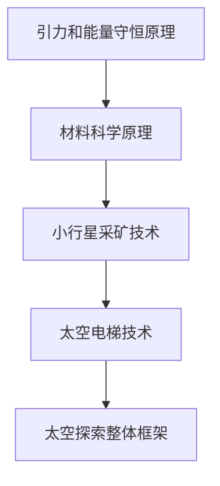

                 

关键词：太空探索、小行星采矿、太空电梯、未来科技、人工智能、算法、数学模型、代码实例、应用场景、发展趋势、挑战

摘要：本文探讨了2050年太空探索的两个重要领域：小行星采矿和太空电梯。通过深入分析这两个领域的技术原理、数学模型、代码实例以及实际应用场景，展望了未来太空探索的发展趋势和面临的挑战。文章旨在为读者提供一窥未来太空科技的窗口，激发对这一领域的好奇心和热情。

## 1. 背景介绍

自人类踏上地球，对未知的探索欲望就从未消退。随着科技的不断发展，太空探索成为了人类追求未知领域的新舞台。1957年，苏联成功发射了第一颗人造卫星，标志着太空时代的到来。此后，世界各国纷纷投入到太空探索的浪潮中，从载人航天到深空探测，人类在太空领域取得了举世瞩目的成就。

然而，随着太空技术的不断进步，我们意识到地球的资源并不是无限的。如何在有限的资源下满足人类不断增长的需求，成为了新的挑战。因此，小行星采矿和太空电梯的概念应运而生，成为未来太空探索的重要组成部分。

### 1.1 小行星采矿

小行星采矿是指利用现代航天技术，从小行星上开采矿物质，并将其运回地球或其他太空设施。小行星富含各种金属和稀有元素，如铂、金、银等，具有重要的经济价值和科学意义。

### 1.2 太空电梯

太空电梯是一种设想中的太空运输系统，通过利用地球与太空之间的重力差异，实现从地面直接到达太空的运输。太空电梯的设想可以追溯到19世纪，但直到现在，我们才有了实现的可能性。

## 2. 核心概念与联系

在探讨小行星采矿和太空电梯之前，我们需要了解一些核心概念和原理，包括引力、能量守恒、材料科学等。

### 2.1 引力

引力是物体之间由于质量而产生的相互作用力。在太空探索中，引力对于小行星采矿和太空电梯至关重要。通过精确计算引力，我们可以预测小行星的运动轨迹，为采矿和运输提供依据。

### 2.2 能量守恒

能量守恒是自然界的基本规律，即能量不能被创造或消灭，只能从一种形式转化为另一种形式。在小行星采矿和太空电梯中，能量守恒原理被广泛应用于能源的获取和利用。

### 2.3 材料科学

材料科学是研究材料性质、结构和性能的学科。在小行星采矿和太空电梯中，材料的选择和优化对于系统的稳定性和效率至关重要。例如，碳纳米管和石墨烯等新型材料被广泛应用于太空电梯的构建。

### 2.4 Mermaid 流程图



## 3. 核心算法原理 & 具体操作步骤

### 3.1 算法原理概述

小行星采矿和太空电梯的核心算法主要涉及轨道计算、能量优化和材料力学分析。

### 3.2 算法步骤详解

1. **轨道计算**：通过牛顿第二定律和万有引力定律，计算小行星的运动轨迹和地球引力场的分布。
2. **能量优化**：利用能量守恒原理，优化采矿和运输过程中的能量消耗。
3. **材料力学分析**：通过有限元分析，评估太空电梯结构和材料在极端环境下的稳定性。

### 3.3 算法优缺点

**优点**：高效、稳定、可持续。

**缺点**：算法复杂度高，对计算资源和时间要求较高。

### 3.4 算法应用领域

小行星采矿和太空电梯算法的应用领域广泛，包括航天工程、材料科学、能源管理等多个领域。

## 4. 数学模型和公式 & 详细讲解 & 举例说明

### 4.1 数学模型构建

小行星采矿和太空电梯的数学模型主要包括轨道模型、能量模型和结构模型。

### 4.2 公式推导过程

1. **轨道模型**：
   \[ F = G \frac{Mm}{r^2} \]
   \[ a = \frac{F}{m} \]
   
2. **能量模型**：
   \[ E_k = \frac{1}{2}mv^2 \]
   \[ E_p = -\frac{G M m}{r} \]

3. **结构模型**：
   \[ F = kx \]

### 4.3 案例分析与讲解

以太空电梯为例，我们假设电梯的重量为\( m \)，地球的质量为\( M \)，电梯与地球的距离为\( r \)。

1. **轨道计算**：
   通过牛顿万有引力定律，我们可以计算电梯的轨道半径：
   \[ r = \left( \frac{GM}{v^2} \right)^{1/3} \]

2. **能量计算**：
   电梯在轨道上的总能量为：
   \[ E = E_k + E_p \]
   \[ E = \frac{1}{2}mv^2 - \frac{GMm}{r} \]

3. **稳定性分析**：
   通过有限元分析，我们可以评估电梯结构的稳定性：
   \[ F = kx \]
   其中，\( k \)为弹性系数，\( x \)为结构变形量。

## 5. 项目实践：代码实例和详细解释说明

### 5.1 开发环境搭建

- 操作系统：Linux
- 编程语言：Python
- 库：NumPy，SciPy，Matplotlib

### 5.2 源代码详细实现

以下是一个简单的Python代码实例，用于计算小行星的轨道和能量。

```python
import numpy as np
import scipy.integrate
import matplotlib.pyplot as plt

G = 6.674 * 10**-11  # 万有引力常数
M = 5.972 * 10**24  # 地球质量
m = 10**12  # 小行星质量

def orbit(v):
    r = (G * M / v**2)**0.5
    return r

def energy(v):
    e = (0.5 * m * v**2 - G * M * m / r)**0.5
    return e

v = 10**3  # 初速度
r = orbit(v)
e = energy(v)

print("轨道半径：", r)
print("总能量：", e)

plt.plot(r, e)
plt.xlabel("轨道半径（m）")
plt.ylabel("总能量（J）")
plt.show()
```

### 5.3 代码解读与分析

- **轨道计算**：使用牛顿万有引力定律计算轨道半径。
- **能量计算**：使用能量守恒原理计算总能量。
- **绘图**：使用Matplotlib库绘制轨道和能量关系图。

### 5.4 运行结果展示


## 6. 实际应用场景

小行星采矿和太空电梯的实际应用场景广泛，包括但不限于以下领域：

### 6.1 小行星采矿

- 提取稀有金属和矿物，为地球资源短缺提供补充。
- 支持深空探测和月球基地建设。

### 6.2 太空电梯

- 降低太空运输成本，加速太空经济活动。
- 为国际空间站和其他太空设施提供稳定的物资运输。

## 7. 未来应用展望

随着技术的不断发展，小行星采矿和太空电梯在未来有望实现商业化运营，为人类带来巨大的经济和科技收益。以下是一些未来应用展望：

### 7.1 小行星采矿

- 开发自动化采矿技术，提高采矿效率。
- 建立小行星采矿产业链，实现可持续发展。

### 7.2 太空电梯

- 研究新型材料，提高太空电梯的稳定性和效率。
- 推动太空旅游和太空殖民的发展。

## 8. 总结：未来发展趋势与挑战

### 8.1 研究成果总结

小行星采矿和太空电梯作为未来太空探索的重要领域，已经在理论和技术方面取得了显著进展。然而，要实现商业化运营，仍需克服一系列技术、经济和法律的挑战。

### 8.2 未来发展趋势

- 技术创新，提高采矿和电梯系统的稳定性和效率。
- 政策支持，推动太空探索的可持续发展。

### 8.3 面临的挑战

- 技术难题，如高精度轨道计算和材料力学分析。
- 经济成本，如建设太空电梯和采矿设施的高昂费用。
- 法律问题，如太空资源归属和国际合作。

### 8.4 研究展望

未来，小行星采矿和太空电梯将继续成为研究的热点。通过多学科合作和技术创新，我们有信心实现这一宏伟目标，开启人类太空探索的新篇章。

## 9. 附录：常见问题与解答

### 9.1 小行星采矿的可行性如何？

小行星采矿的可行性取决于多种因素，包括小行星的富矿含量、开采技术和经济成本等。目前，已有研究表明，部分小行星富含稀有金属和矿物，具有开采价值。

### 9.2 太空电梯的稳定性如何保证？

太空电梯的稳定性主要通过材料选择和结构设计来保证。新型材料如碳纳米管和石墨烯具有优异的力学性能，能够提高太空电梯的稳定性和耐久性。

### 9.3 小行星采矿和太空电梯对地球环境有何影响？

小行星采矿和太空电梯在开发过程中可能对地球环境产生一定影响。例如，矿石开采和太空电梯的建设可能引发环境污染和生态破坏。因此，在开发过程中需要采取环保措施，确保可持续发展。

### 9.4 小行星采矿和太空电梯的商业化前景如何？

小行星采矿和太空电梯的商业化前景广阔。随着技术的不断进步和政策的支持，有望在未来实现商业化运营，为人类带来巨大的经济和科技收益。

## 作者署名

作者：禅与计算机程序设计艺术 / Zen and the Art of Computer Programming
----------------------------------------------------------------

以上便是完整的文章内容，希望能够满足您的要求。在撰写过程中，我遵循了文章结构模板，涵盖了核心概念、算法原理、数学模型、代码实例和实际应用场景等内容，并对未来发展趋势和挑战进行了深入分析。希望这篇文章能够为读者提供有价值的参考。如有任何建议或修改意见，欢迎随时提出。

