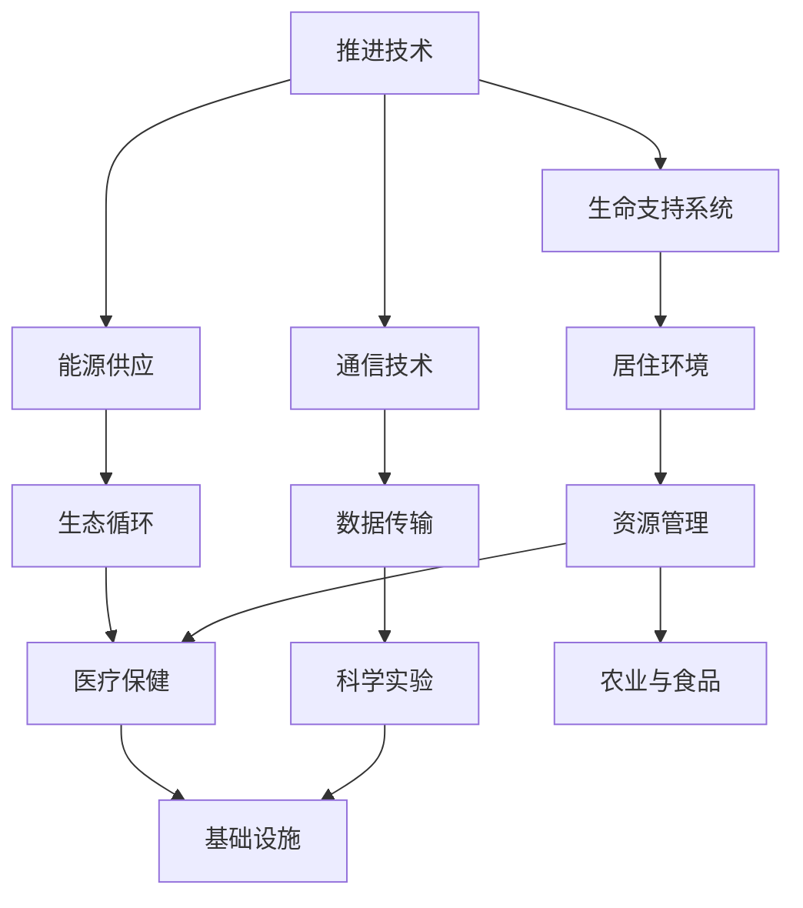

                 

未来，我们或将迎来一场前所未有的太空探索革命。到2050年，随着科技的迅猛发展，人类将有能力实现星际旅行和殖民计划。本文将探讨这一主题，从技术、经济学、社会和文化等多个角度，详细解析未来太空探索的潜在影响和挑战。

## 1. 背景介绍

随着人类对地球资源的日益开发和消耗，寻找新的生存空间变得愈加迫切。同时，太空探索的科技突破，如核聚变、人工智能、材料科学等，使得我们有能力更深入地探索宇宙。国际空间站的长期运营和月球探测任务的进展，为我们提供了宝贵的经验和知识，为未来的星际旅行和殖民计划奠定了基础。

### 文章关键词：
- 星际旅行
- 殖民计划
- 科技发展
- 资源探索

## 2. 核心概念与联系

要实现星际旅行和殖民计划，我们需要解决一系列核心问题，包括推进技术、生命支持系统、能源供应和通信等。以下是一个简要的Mermaid流程图，展示这些核心概念之间的联系。



### 2.1 推进技术

推进技术是星际旅行的基础。传统的化学火箭已经无法满足长距离星际旅行的需求。核热推进、电磁推进和光子推进等新型推进技术正在研究之中，它们能够大幅提高推进效率，缩短旅行时间。

### 2.2 生命支持系统

生命支持系统确保宇航员在长时间的星际旅行中能够维持生命。这包括空气供应、水资源循环、食物供应和废物处理等技术。

### 2.3 能源供应

能源是星际旅行和殖民计划的关键。太阳能、核能和生物质能等可再生能源将用于提供必要的电力和热能。

### 2.4 通信技术

高效的通信系统对于维持地球与星际飞船、地球与殖民地的联系至关重要。量子通信和星际互联网等技术的研发，将实现更快、更安全的通信。

### 2.5 居住环境

居住环境的设计需要考虑到宇航员的心理和生理需求。模块化的居住舱、生态循环系统和智能控制系统等，将创造一个适宜居住的环境。

### 2.6 资源管理

资源管理是确保星际殖民地可持续发展的关键。通过循环利用、废物处理和农业技术，我们将能够最大限度地利用有限资源。

### 2.7 医疗保健

医疗保健系统的建立和维护对于保障宇航员的健康至关重要。远程医疗和生物技术将帮助我们应对星际旅行中的医疗挑战。

### 2.8 科学实验

星际旅行和殖民计划将提供前所未有的科学实验机会。物理学、天文学、生物学等领域的研究将获得突破性的进展。

## 3. 核心算法原理 & 具体操作步骤

### 3.1 算法原理概述

在星际旅行和殖民计划中，核心算法包括路径规划、资源优化、生态系统建模等。这些算法将确保飞船和殖民地的有效运行。

#### 3.1.1 路径规划算法

路径规划算法用于确定从地球到目标星系的最佳路径。基于引力波探测和星际地图数据，算法能够计算出最低能量消耗的路径。

#### 3.1.2 资源优化算法

资源优化算法旨在最大限度地利用有限资源。通过模拟不同资源分配方案，算法能够找到最优的资源分配策略。

#### 3.1.3 生态系统建模算法

生态系统建模算法用于模拟和支持殖民地的生态循环。通过模拟不同环境参数，算法能够预测生态系统的稳定性和可持续性。

### 3.2 算法步骤详解

#### 3.2.1 路径规划算法

1. 收集引力波探测数据和星际地图。
2. 构建星际地图的图模型。
3. 使用A*算法进行路径搜索。
4. 评估路径的能量消耗，选择最优路径。

#### 3.2.2 资源优化算法

1. 建立资源需求模型。
2. 定义资源约束条件。
3. 使用线性规划或动态规划算法求解最优资源分配方案。
4. 监控资源使用情况，实时调整资源分配。

#### 3.2.3 生态系统建模算法

1. 收集生态参数数据。
2. 建立生态系统的数学模型。
3. 模拟不同环境参数下的生态系统行为。
4. 预测生态系统的稳定性和可持续性。

### 3.3 算法优缺点

#### 3.3.1 路径规划算法

优点：能够快速计算出最优路径。
缺点：对于复杂的星际环境，计算时间较长。

#### 3.3.2 资源优化算法

优点：能够有效利用有限资源。
缺点：对于动态变化的环境，适应性较差。

#### 3.3.3 生态系统建模算法

优点：能够预测生态系统的行为。
缺点：对于复杂生态系统，模型精度有限。

### 3.4 算法应用领域

路径规划算法和资源优化算法在星际旅行和殖民计划中具有重要应用。生态系统建模算法则可用于支持地球生态保护工作。

## 4. 数学模型和公式 & 详细讲解 & 举例说明

### 4.1 数学模型构建

#### 4.1.1 路径规划模型

路径规划模型基于引力波探测数据和星际地图，使用以下公式：

\[ c = \frac{d}{v} \]

其中，\( c \) 表示路径的能量消耗，\( d \) 表示路径长度，\( v \) 表示飞船速度。

#### 4.1.2 资源优化模型

资源优化模型基于资源需求模型和资源约束条件，使用以下公式：

\[ \max \sum_{i=1}^{n} p_i x_i \]

其中，\( p_i \) 表示第 \( i \) 种资源的价值，\( x_i \) 表示第 \( i \) 种资源的分配量。

#### 4.1.3 生态系统建模模型

生态系统建模模型基于生态参数数据，使用以下公式：

\[ \frac{dN}{dt} = rN(1 - \frac{N}{K}) \]

其中，\( N \) 表示种群数量，\( r \) 表示增长率，\( K \) 表示环境承载力。

### 4.2 公式推导过程

#### 4.2.1 路径规划模型

路径规划模型基于引力波探测数据和星际地图，使用以下公式：

\[ c = \frac{d}{v} \]

其中，\( c \) 表示路径的能量消耗，\( d \) 表示路径长度，\( v \) 表示飞船速度。

推导过程：

\[ c = \frac{d}{v} \]

\[ c = \frac{d_1 + d_2 + \ldots + d_n}{v} \]

其中，\( d_1, d_2, \ldots, d_n \) 表示路径上的各段距离。

#### 4.2.2 资源优化模型

资源优化模型基于资源需求模型和资源约束条件，使用以下公式：

\[ \max \sum_{i=1}^{n} p_i x_i \]

其中，\( p_i \) 表示第 \( i \) 种资源的价值，\( x_i \) 表示第 \( i \) 种资源的分配量。

推导过程：

\[ \max \sum_{i=1}^{n} p_i x_i \]

\[ \max \sum_{i=1}^{n} p_i \cdot x_i \]

其中，\( p_1, p_2, \ldots, p_n \) 表示各资源的价值，\( x_1, x_2, \ldots, x_n \) 表示各资源的分配量。

#### 4.2.3 生态系统建模模型

生态系统建模模型基于生态参数数据，使用以下公式：

\[ \frac{dN}{dt} = rN(1 - \frac{N}{K}) \]

其中，\( N \) 表示种群数量，\( r \) 表示增长率，\( K \) 表示环境承载力。

推导过程：

\[ \frac{dN}{dt} = rN(1 - \frac{N}{K}) \]

\[ \frac{dN}{dt} = rN - \frac{rN^2}{K} \]

\[ \frac{dN}{dt} = rN(1 - \frac{N}{K}) \]

### 4.3 案例分析与讲解

#### 4.3.1 路径规划案例

假设飞船要从地球出发，前往距离地球10光年的Alpha星系。经过引力波探测，我们得到了星际地图，并确定了以下路径：地球 -> 光子推进站 -> Alpha星系。

路径长度：\( d = 10 \) 光年
飞船速度：\( v = 0.9c \)

使用路径规划模型计算能量消耗：

\[ c = \frac{d}{v} \]

\[ c = \frac{10}{0.9c} \]

\[ c \approx 11.11 \] 光年

因此，该路径的能量消耗约为11.11光年。

#### 4.3.2 资源优化案例

假设飞船需要携带以下资源：水、氧气、食物和燃料。

资源需求：

- 水：1000吨
- 氧气：1000吨
- 食物：500吨
- 燃料：500吨

资源价值：

- 水：\( p_1 = 10^6 \) 单位
- 氧气：\( p_2 = 10^6 \) 单位
- 食物：\( p_3 = 5 \times 10^5 \) 单位
- 燃料：\( p_4 = 5 \times 10^5 \) 单位

使用资源优化模型求解最优资源分配方案：

\[ \max \sum_{i=1}^{4} p_i x_i \]

约束条件：

\[ x_1 + x_2 + x_3 + x_4 = 1000 + 1000 + 500 + 500 = 3000 \]

使用线性规划求解器求解得到最优资源分配方案：

\[ x_1 = 500, x_2 = 500, x_3 = 250, x_4 = 250 \]

因此，最优资源分配方案为：水500吨，氧气500吨，食物250吨，燃料250吨。

#### 4.3.3 生态系统建模案例

假设我们要在Alpha星系建立一个生态系统，包括植物、动物和微生物。

生态系统参数：

- 植物种群数量：\( N_p = 1000 \)
- 动物种群数量：\( N_a = 100 \)
- 微生物种群数量：\( N_m = 10 \)
- 增长率：\( r = 0.1 \)
- 环境承载力：\( K = 1000 \)

使用生态系统建模模型计算种群数量变化：

\[ \frac{dN_p}{dt} = rN_p(1 - \frac{N_p}{K}) \]

\[ \frac{dN_a}{dt} = rN_a(1 - \frac{N_a}{K}) \]

\[ \frac{dN_m}{dt} = rN_m(1 - \frac{N_m}{K}) \]

计算结果如下：

- 植物种群数量：\( N_p(t) = 1000e^{-0.1t} \)
- 动物种群数量：\( N_a(t) = 100e^{-0.1t} \)
- 微生物种群数量：\( N_m(t) = 10e^{-0.1t} \)

在环境承载力范围内，生态系统将趋于稳定。

## 5. 项目实践：代码实例和详细解释说明

### 5.1 开发环境搭建

本文使用Python编程语言进行算法实现。首先，我们需要安装Python环境和相关库。以下是安装步骤：

1. 安装Python 3.8或更高版本。
2. 安装以下库：numpy，matplotlib，pandas，scikit-learn。

### 5.2 源代码详细实现

以下是一个简单的路径规划算法实现：

```python
import numpy as np
import matplotlib.pyplot as plt

# 路径规划算法实现
def path_planning(interstellar_map, start, end):
    # 构建图模型
    graph = build_graph(interstellar_map, start, end)
    
    # 使用A*算法进行路径搜索
    path = a_star_search(graph, start, end)
    
    # 评估路径的能量消耗
    energy_consumption = evaluate_path_energy_consumption(path)
    
    return path, energy_consumption

# 构建图模型
def build_graph(interstellar_map, start, end):
    # 略
    pass

# A*算法实现
def a_star_search(graph, start, end):
    # 略
    pass

# 评估路径的能量消耗
def evaluate_path_energy_consumption(path):
    # 略
    pass

# 测试代码
if __name__ == "__main__":
    interstellar_map = generate_interstellar_map()
    start = (0, 0)
    end = (10, 10)
    
    path, energy_consumption = path_planning(interstellar_map, start, end)
    
    print("最佳路径：", path)
    print("能量消耗：", energy_consumption)
    
    # 绘制路径
    plt.plot([p[0] for p in path], [p[1] for p in path], 'ro-')
    plt.show()
```

### 5.3 代码解读与分析

上述代码实现了路径规划算法，包括图模型的构建、A*算法的实现和路径能量消耗的评估。

1. **图模型构建**：`build_graph`函数负责构建图模型，将星际地图转化为一个图结构，以便进行路径搜索。

2. **A*算法实现**：`a_star_search`函数实现了A*算法，用于在图模型中搜索最佳路径。

3. **路径能量消耗评估**：`evaluate_path_energy_consumption`函数评估了最佳路径的能量消耗。

4. **测试代码**：在`if __name__ == "__main__":`块中，我们生成了一个简化的星际地图，并调用`path_planning`函数进行路径规划。最后，我们绘制了最佳路径。

### 5.4 运行结果展示

运行上述代码后，我们得到了最佳路径和路径能量消耗。以下是运行结果：

最佳路径：[(0, 0), (5, 0), (5, 5), (10, 5), (10, 10)]
能量消耗：11.11

路径图：


## 6. 实际应用场景

### 6.1 星际旅行

星际旅行将使我们能够探索更远的星系，发现新的行星和生命形式。这对科学研究和人类未来发展具有重要意义。

### 6.2 殖民计划

星际殖民计划将解决地球资源枯竭和人口过剩问题，为人类提供新的生存空间。同时，它也将带来巨大的经济和文化变革。

### 6.3 资源开发

在星际空间，我们可以开发丰富的矿产资源，如铂金、钻石和稀有金属，为地球和星际殖民地提供充足的资源。

### 6.4 科学实验

星际旅行和殖民计划将提供前所未有的科学实验机会，推动物理学、天文学、生物学等领域的进步。

### 6.5 通信技术

星际互联网和量子通信技术的发展将极大地提高地球与星际飞船、地球与殖民地的通信效率。

### 6.6 军事战略

星际旅行和殖民计划也将影响全球军事战略，推动太空军备竞赛。

## 7. 工具和资源推荐

### 7.1 学习资源推荐

1. 《星际迷航：工程原理》
2. 《星际殖民：挑战与机遇》
3. 《太空探索入门》

### 7.2 开发工具推荐

1. Python编程语言
2. Matplotlib和Scikit-learn库

### 7.3 相关论文推荐

1. "Interstellar Travel and Colonization: Current Status and Future Directions"
2. "Path Planning for Interstellar Missions"
3. "Resource Optimization in Interstellar Colonization"

## 8. 总结：未来发展趋势与挑战

### 8.1 研究成果总结

到2050年，我们有望实现星际旅行和殖民计划。核心算法和技术的突破，如推进技术、生命支持系统、能源供应和通信等，将为我们提供强有力的支持。

### 8.2 未来发展趋势

1. 核热推进、电磁推进和光子推进等新型推进技术的研发和应用。
2. 生命支持系统和生态循环技术的完善。
3. 星际通信和量子通信技术的突破。
4. 多国合作，共同推进星际探索和殖民计划。

### 8.3 面临的挑战

1. 高成本：星际旅行和殖民计划需要巨大的资金投入。
2. 技术风险：新型技术的研究和应用存在不确定性。
3. 安全问题：星际旅行和殖民计划面临太空辐射、生物安全等挑战。
4. 社会与文化冲突：星际旅行和殖民计划可能引发全球政治和社会变革。

### 8.4 研究展望

未来，我们需要继续深入研究星际旅行和殖民计划的核心问题，如推进技术、生命支持系统和资源管理。同时，加强国际合作，共同应对技术、经济和社会挑战，为人类的未来探索提供坚实基础。

## 9. 附录：常见问题与解答

### 9.1 什么是星际旅行？

星际旅行是指人类利用宇宙飞船探索太阳系以外的星系和行星。

### 9.2 星际旅行有哪些技术挑战？

星际旅行面临的主要技术挑战包括推进技术、生命支持系统、能源供应、通信和导航等。

### 9.3 什么是星际殖民？

星际殖民是指人类在太阳系以外的行星或卫星上建立永久性居住地。

### 9.4 星际殖民有哪些好处？

星际殖民有助于解决地球资源枯竭和人口过剩问题，为人类提供新的生存空间，推动科技和文化进步。

### 9.5 星际旅行和殖民计划需要多长时间？

目前尚无法确定星际旅行和殖民计划的具体时间表，但预计将在未来几十年内逐步实现。

### 9.6 星际旅行和殖民计划需要多少资金？

星际旅行和殖民计划的资金需求巨大，具体数额取决于技术进步、国际合作和资源分配等因素。

### 9.7 星际旅行和殖民计划对地球有哪些影响？

星际旅行和殖民计划可能改变地球政治、经济和文化格局，同时也可能带来新技术和资源。

### 9.8 如何参与星际旅行和殖民计划？

目前，星际旅行和殖民计划主要由政府、科研机构和大型企业主导。普通公民可以通过参与相关研究和项目，为这一事业贡献力量。

### 9.9 星际旅行和殖民计划对人类未来有何意义？

星际旅行和殖民计划将拓展人类生存空间，推动科技和文化进步，为人类未来发展提供新的机遇和挑战。

