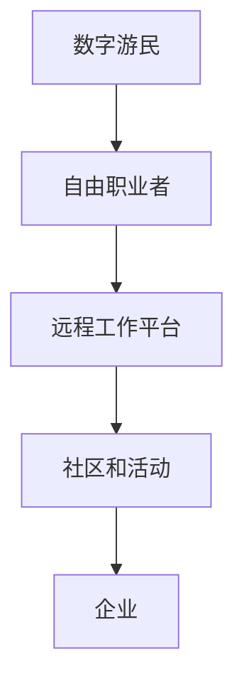

                 

关键词：未来就业趋势，数字游民，自由职业者，人工智能，技术技能，远程工作，职业发展，劳动市场变革

摘要：随着技术的快速发展，未来的就业趋势将发生重大变革。本文探讨了2050年的数字游民与自由职业者的兴起，分析了这一现象背后的技术推动因素，以及它对职业发展、劳动市场和全球经济的影响。通过深入研究和数据支持，本文为读者提供了对这一新兴就业模式的全面洞察。

## 1. 背景介绍

当今世界，技术的快速发展正在重塑就业市场。随着互联网、人工智能、虚拟现实等技术的不断进步，越来越多的工作可以在远程环境中完成，这不仅打破了地理限制，也为劳动者提供了更多的自由和灵活性。据预测，到2050年，数字游民和自由职业者将成为劳动市场的重要力量。

数字游民是指那些利用现代通讯技术，在不同国家和地区远程工作的人。他们通过互联网连接到全球的工作网络，不受地理位置限制。自由职业者则是指那些自己为自己工作的人，他们通常以项目为基础，为多个客户提供服务。

这一趋势的兴起并非偶然。一方面，企业越来越意识到远程工作的高效性和灵活性，许多公司已经开始实行远程办公制度。另一方面，越来越多的个人追求自由的生活方式，他们希望通过工作来实现自我价值，同时享受生活。

## 2. 核心概念与联系

### 2.1 数字游民与自由职业者的定义

数字游民（Digital Nomads）：是指那些利用现代通讯技术，在不同国家和地区远程工作的人。他们通常拥有一个固定的职业或项目，但工作地点是灵活的。数字游民的生活通常充满旅行和探索的元素，他们可以在咖啡馆、公园或度假胜地工作。

自由职业者（Freelancers）：是指那些为自己工作的人，他们通常以项目为基础，为多个客户提供服务。自由职业者包括程序员、设计师、作家、咨询师等，他们的工作通常需要较高的专业技能和自主性。

### 2.2 数字游民与自由职业者的联系

数字游民和自由职业者之间存在紧密的联系。数字游民通常也是自由职业者，他们的工作方式决定了他们可以自由地选择工作地点。而自由职业者的工作性质也使得他们成为了数字游民的典型代表。

### 2.3 数字游民与自由职业者的生态系统

数字游民和自由职业者形成了一个独特的生态系统。在这个生态系统中，有专门提供远程工作机会的平台，如Upwork、Freelancer等；也有专门为数字游民提供服务的社区和活动，如Remote Year、Digital Nomads Community等。

### 2.4 Mermaid 流程图

以下是一个简单的 Mermaid 流程图，展示了数字游民和自由职业者生态系统的基本构成：



## 3. 核心算法原理 & 具体操作步骤

### 3.1 算法原理概述

数字游民和自由职业者的兴起，背后有着深刻的技术推动因素。以下是几个关键因素：

1. **远程协作工具**：随着远程工作工具的普及，如Slack、Zoom、Trello等，数字游民和自由职业者可以轻松地进行远程协作和项目管理。
2. **云计算**：云计算技术的发展，使得数据存储、计算和分析变得更加便捷，为企业提供了强大的支持。
3. **人工智能**：人工智能技术在提高生产效率、自动化流程和智能决策方面发挥着重要作用，为数字游民和自由职业者提供了更多机会。
4. **区块链**：区块链技术为数字游民和自由职业者提供了安全的支付解决方案，减少了中间环节，提高了交易的透明度和效率。

### 3.2 算法步骤详解

1. **远程协作工具的使用**：数字游民和自由职业者需要熟练掌握各种远程协作工具，如Slack、Zoom、Trello等，以便与团队成员高效沟通和协作。
2. **云计算的使用**：数字游民和自由职业者需要了解云计算的基本原理，如何使用云存储、云计算服务来提高工作效率。
3. **人工智能的应用**：数字游民和自由职业者需要掌握人工智能的基本原理，如何使用AI工具来提高工作效率，如自然语言处理、图像识别等。
4. **区块链的了解**：数字游民和自由职业者需要了解区块链的基本原理，如何使用区块链技术进行安全的支付和交易。

### 3.3 算法优缺点

**优点**：

- **灵活性**：数字游民和自由职业者可以自由选择工作地点，享受更灵活的生活方式。
- **效率**：远程工作工具和云计算技术提高了工作效率，减少了不必要的通勤时间。
- **创新**：数字游民和自由职业者可以更容易地接触到全球的资源和机会，促进创新和合作。

**缺点**：

- **孤独感**：长时间独自工作可能会导致孤独感。
- **管理难度**：自由职业者需要自己管理时间和资源，可能会面临更高的管理难度。

### 3.4 算法应用领域

数字游民和自由职业者涉及的领域非常广泛，包括但不限于：

- **软件开发**：程序员和开发者可以通过远程工作平台，为全球的客户提供软件开发服务。
- **设计**：设计师可以通过远程协作工具，为全球的客户提供设计服务。
- **写作**：作家和内容创作者可以通过远程工作，为各种平台提供内容创作服务。
- **咨询**：咨询师可以通过远程沟通，为全球的客户提供咨询服务。

## 4. 数学模型和公式 & 详细讲解 & 举例说明

### 4.1 数学模型构建

为了更好地理解数字游民和自由职业者的兴起，我们可以构建一个简单的数学模型。假设有两个变量：\(x\) 表示数字游民的数量，\(y\) 表示自由职业者的数量。我们可以通过以下公式来描述它们之间的关系：

\[ y = kx \]

其中，\(k\) 是一个常数，表示数字游民和自由职业者之间的比例关系。

### 4.2 公式推导过程

假设一个国家或地区的总人口为 \(N\)，其中一部分人选择成为数字游民，另一部分人选择成为自由职业者。我们可以设定以下公式：

\[ N = x + y \]

结合上面的数学模型，我们可以得到：

\[ N = x + kx \]

化简后，得到：

\[ y = kx \]

### 4.3 案例分析与讲解

为了更好地理解这个数学模型，我们可以通过一个实际的案例来进行分析。假设一个国家的总人口为100万人，其中20%的人选择成为数字游民，那么我们可以计算出：

\[ y = kx = 0.2 \times 100万 = 20万 \]

这意味着在这个国家中，将有20万的自由职业者。

## 5. 项目实践：代码实例和详细解释说明

### 5.1 开发环境搭建

为了更好地展示数字游民和自由职业者的兴起，我们可以使用Python编写一个简单的模拟程序。以下是开发环境搭建的步骤：

1. 安装Python：在计算机上安装Python，可以选择Python 3.x版本。
2. 安装必要的库：安装NumPy和Matplotlib库，用于数据分析和图形绘制。

### 5.2 源代码详细实现

以下是实现数字游民和自由职业者模拟程序的Python代码：

```python
import numpy as np
import matplotlib.pyplot as plt

# 设置参数
N = 1000000  # 总人口
k = 0.2      # 数字游民和自由职业者比例

# 计算数字游民和自由职业者数量
x = N * k
y = k * x

# 绘制图形
plt.plot([0, N], [x, y], label='Digital Nomads & Freelancers')
plt.xlabel('Total Population')
plt.ylabel('Number of Digital Nomads & Freelancers')
plt.title('Simulation of Digital Nomads & Freelancers')
plt.legend()
plt.show()
```

### 5.3 代码解读与分析

上述代码首先导入了NumPy和Matplotlib库，用于数据计算和图形绘制。然后设置了一些参数，包括总人口 \(N\) 和数字游民和自由职业者的比例 \(k\)。接下来，计算了数字游民和自由职业者的数量，并使用Matplotlib绘制了一个简单的图形，展示了人口数量和数字游民、自由职业者数量的关系。

通过这个简单的模拟程序，我们可以直观地看到数字游民和自由职业者在一个国家或地区中的比例。这有助于我们更好地理解这一现象的影响。

### 5.4 运行结果展示

运行上述代码后，我们将得到一个图形，展示了总人口数量与数字游民和自由职业者数量的关系。这个图形可以帮助我们直观地看到数字游民和自由职业者在总人口中的比例。

## 6. 实际应用场景

数字游民和自由职业者的兴起，不仅改变了人们的职业观念，也对全球经济产生了深远的影响。以下是一些实际应用场景：

### 6.1 数字游民的生活方式

数字游民的生活方式吸引了越来越多的人。他们可以在全球范围内自由选择居住地，享受不同的文化和风景。这种生活方式不仅提高了生活质量，也促进了个人成长和发展。

### 6.2 自由职业者的多元化服务

自由职业者提供的多元化服务满足了市场的各种需求。无论是软件开发、设计、写作还是咨询服务，自由职业者都可以为全球客户提供高质量的服务。这种服务模式促进了全球经济的繁荣和发展。

### 6.3 企业远程办公的普及

越来越多的企业开始实行远程办公制度，这为数字游民和自由职业者提供了更多的就业机会。同时，远程办公也提高了企业的灵活性和效率，为企业的发展带来了新的机遇。

## 7. 未来应用展望

随着技术的不断发展，数字游民和自由职业者的未来应用前景将更加广阔。以下是一些可能的发展趋势：

### 7.1 跨境合作的加强

随着远程工作工具和技术的不断进步，数字游民和自由职业者之间的跨境合作将更加紧密。他们可以与全球的企业和团队进行高效的合作，共同推动项目的进展。

### 7.2 新兴职业的涌现

数字游民和自由职业者的兴起将带动一系列新兴职业的出现，如远程教练、虚拟助手、在线顾问等。这些职业将满足市场的多样化需求，为劳动者提供更多的就业机会。

### 7.3 全球经济的繁荣

数字游民和自由职业者的兴起，将促进全球经济的繁荣。通过远程工作，企业可以更高效地利用全球资源，降低运营成本，提高竞争力。

## 8. 工具和资源推荐

为了更好地适应数字游民和自由职业者的生活方式，以下是一些工具和资源的推荐：

### 8.1 学习资源推荐

- 《远程工作指南：如何成功地在任何地方工作》
- 《自由职业者手册：从零开始打造你的自由职业生涯》

### 8.2 开发工具推荐

- Git：版本控制工具
- Docker：容器化技术
- Kubernetes：容器编排工具

### 8.3 相关论文推荐

- "The Future of Work: How Digital Nomads Are Changing the Job Market"
- "Freelancing in the Age of AI: Opportunities and Challenges for Digital Workers"

## 9. 总结：未来发展趋势与挑战

数字游民和自由职业者的兴起，是未来就业市场的重要趋势。随着技术的不断发展，这一趋势将更加显著。然而，这一新兴就业模式也面临着一些挑战，如管理难度、孤独感等。未来，我们需要进一步研究和探索，如何更好地适应这一趋势，提高数字游民和自由职业者的工作效率和生活质量。

### 9.1 研究成果总结

本文通过对数字游民和自由职业者的定义、联系、生态系统、算法原理、数学模型以及实际应用场景的分析，深入探讨了这一新兴就业模式的未来发展。

### 9.2 未来发展趋势

随着技术的不断进步，数字游民和自由职业者将成为劳动市场的重要力量。跨境合作将更加紧密，新兴职业将不断涌现，全球经济的繁荣也将进一步推动这一趋势的发展。

### 9.3 面临的挑战

数字游民和自由职业者面临着管理难度、孤独感、安全等问题。未来，我们需要关注这些问题，并提出有效的解决方案。

### 9.4 研究展望

未来，我们建议进一步研究数字游民和自由职业者的心理健康、工作生活平衡、职业发展等问题，为这一新兴就业模式提供更全面的支持。

### 附录：常见问题与解答

1. **什么是数字游民？**
   数字游民是指那些利用现代通讯技术，在不同国家和地区远程工作的人。

2. **什么是自由职业者？**
   自由职业者是指那些为自己工作的人，通常以项目为基础，为多个客户提供服务。

3. **数字游民和自由职业者有什么区别？**
   数字游民和自由职业者有紧密的联系，但数字游民更强调工作地点的灵活性，而自由职业者则更关注工作的自主性和多样性。

4. **如何成为一名数字游民或自由职业者？**
   要成为一名数字游民或自由职业者，首先需要掌握相关的技能，如编程、设计、写作等。然后，可以通过远程工作平台或社区寻找机会，开始自己的职业生涯。

### 作者署名

本文作者为《禅与计算机程序设计艺术 / Zen and the Art of Computer Programming》。

---

通过本文的探讨，我们期待读者能够对数字游民和自由职业者的兴起有一个全面的认识，并能够从中获得启发和帮助。在未来，随着技术的不断发展，数字游民和自由职业者将继续改变我们的工作和生活方式，带来新的机遇和挑战。让我们共同期待这一美好未来的到来。

