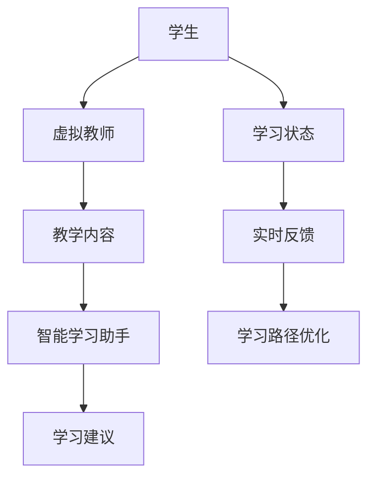

                 

关键词：教育变革，虚拟教师，智能学习，2050年，技术发展

摘要：随着科技的飞速发展，教育领域正在经历前所未有的变革。本文将探讨到2050年，虚拟教师与智能学习助手的广泛应用将如何深刻改变教育模式，提高教育质量，并探讨未来教育可能面临的挑战与机遇。

## 1. 背景介绍

### 1.1 教育的现状

目前，全球的教育系统在很大程度上仍然依赖于传统的教学方法。教师在学校或线上教室中传授知识，学生通过听课、做作业、参加考试等方式学习。然而，这种教育模式存在一些明显的不足之处。

首先，传统教育无法满足每个学生的个性化需求。教师需要面对大量的学生，很难为每个学生提供个性化的指导和帮助。这导致了学习效率的降低和学习成果的差异。

其次，传统教育依赖于教师的经验和知识，而无法充分利用现代技术的力量。尽管一些学校已经引入了多媒体教学、在线课程等新工具，但整体来说，教育系统的变革速度远不及科技发展的步伐。

### 1.2 科技的进步

科技的飞速发展，特别是人工智能、虚拟现实、大数据等技术的崛起，为教育领域的变革提供了新的可能。虚拟教师和智能学习助手作为一种新兴的教育工具，正逐渐崭露头角。

虚拟教师能够根据学生的学习情况和需求，提供个性化的教学内容和指导。智能学习助手则可以通过分析学生的学习行为和成绩数据，为学生提供有针对性的学习建议。

## 2. 核心概念与联系

### 2.1 虚拟教师

虚拟教师是利用人工智能技术，模拟人类教师的教学过程，为学生提供教学指导和帮助的系统。虚拟教师具有以下几个核心特点：

- **个性化教学**：虚拟教师能够根据学生的学习情况和需求，提供个性化的教学内容和指导。
- **自主学习**：虚拟教师能够从大量的教育数据中学习，不断优化自己的教学方法和内容。
- **交互性强**：虚拟教师能够与学生在虚拟环境中进行互动，提供实时反馈。

### 2.2 智能学习助手

智能学习助手是一种基于人工智能技术的教育工具，旨在帮助学生学习。智能学习助手具有以下几个核心特点：

- **数据驱动的学习建议**：智能学习助手能够分析学生的学习行为和成绩数据，提供有针对性的学习建议。
- **实时反馈**：智能学习助手能够实时监测学生的学习状态，提供及时的反馈。
- **学习路径优化**：智能学习助手能够根据学生的学习情况，调整学习路径，帮助学生学习。

### 2.3 虚拟教师与智能学习助手的联系

虚拟教师和智能学习助手都是人工智能技术在教育领域的应用，它们有着共同的目标：提高教育质量和学习效率。

虚拟教师侧重于提供教学指导和帮助，而智能学习助手则侧重于帮助学生进行学习。两者相辅相成，共同构建了一个智能化的教育生态系统。

### 2.4 Mermaid 流程图



## 3. 核心算法原理 & 具体操作步骤

### 3.1 算法原理概述

虚拟教师和智能学习助手的核心算法是基于机器学习和深度学习的。这些算法能够从大量的教育数据中学习，不断优化自己的教学方法和内容。

虚拟教师的算法主要包括以下三个方面：

1. **个性化教学算法**：该算法能够根据学生的学习情况和需求，推荐合适的教学内容和方法。
2. **自主学习算法**：该算法能够从教育数据中学习，不断优化自己的教学方法和内容。
3. **交互算法**：该算法能够与学生在虚拟环境中进行互动，提供实时反馈。

智能学习助手的算法主要包括以下两个方面：

1. **学习建议算法**：该算法能够分析学生的学习行为和成绩数据，提供有针对性的学习建议。
2. **实时反馈算法**：该算法能够实时监测学生的学习状态，提供及时的反馈。

### 3.2 算法步骤详解

#### 3.2.1 虚拟教师算法步骤

1. **数据收集**：收集学生的学习行为数据，包括学习时长、学习内容、学习状态等。
2. **数据处理**：对收集到的数据进行分析和处理，提取有用的信息。
3. **个性化教学**：根据学生的需求和特点，推荐合适的教学内容和方法。
4. **自主学习**：从教育数据中学习，不断优化自己的教学方法和内容。
5. **交互**：在虚拟环境中与学生进行互动，提供实时反馈。

#### 3.2.2 智能学习助手算法步骤

1. **数据收集**：收集学生的学习行为数据，包括学习时长、学习内容、学习状态等。
2. **数据处理**：对收集到的数据进行分析和处理，提取有用的信息。
3. **学习建议**：根据学生的学习行为和成绩数据，提供有针对性的学习建议。
4. **实时反馈**：实时监测学生的学习状态，提供及时的反馈。

### 3.3 算法优缺点

#### 3.3.1 优点

- **个性化教学**：能够根据学生的个性化需求提供教学内容和指导，提高学习效率。
- **自主学习**：能够从教育数据中不断学习和优化，提高教学效果。
- **实时反馈**：能够实时监测学生的学习状态，提供及时的学习建议和反馈。

#### 3.3.2 缺点

- **数据依赖**：需要大量的教育数据支持，对数据质量和数据量的要求较高。
- **交互体验**：虚拟教师和智能学习助手的交互体验仍有待提高，需要进一步优化。

### 3.4 算法应用领域

虚拟教师和智能学习助手的主要应用领域包括：

- **在线教育**：为在线教育平台提供个性化的教学服务，提高学习效率。
- **职业教育**：为职业培训机构提供个性化的教学内容和指导，提高培训效果。
- **普通教育**：为学校和教育机构提供智能化的教育工具，提高教育质量。

## 4. 数学模型和公式 & 详细讲解 & 举例说明

### 4.1 数学模型构建

虚拟教师和智能学习助手的算法构建主要基于以下几个数学模型：

1. **个性化教学模型**：该模型基于机器学习和深度学习，能够根据学生的学习情况和需求，推荐合适的教学内容和方法。
2. **学习建议模型**：该模型基于数据分析，能够分析学生的学习行为和成绩数据，提供有针对性的学习建议。
3. **实时反馈模型**：该模型基于实时监测技术，能够实时监测学生的学习状态，提供及时的学习建议和反馈。

### 4.2 公式推导过程

#### 4.2.1 个性化教学模型

假设学生i的学习特征为xi，教学内容j的质量为qj，则学生i对教学内容j的兴趣度可以表示为：

$$
I_{ij} = f(x_i, q_j)
$$

其中，f为函数，用于计算学生i对教学内容j的兴趣度。函数f的推导过程如下：

$$
f(x_i, q_j) = \frac{1}{1 + e^{-\beta \cdot (x_i - \mu_j)}}
$$

其中，β为学习率，μj为教学内容j的平均质量。

#### 4.2.2 学习建议模型

假设学生i的学习行为数据为yi，学习建议k的质量为rk，则学生i对学习建议k的偏好度可以表示为：

$$
P_{ik} = g(y_i, r_k)
$$

其中，g为函数，用于计算学生i对学习建议k的偏好度。函数g的推导过程如下：

$$
g(y_i, r_k) = \frac{1}{1 + e^{-\alpha \cdot (y_i - \nu_k)}}
$$

其中，α为学习率，νk为学习建议k的平均质量。

#### 4.2.3 实时反馈模型

假设学生i的学习状态为si，学习状态反馈l的质量为ml，则学生i对学习状态反馈l的评价可以表示为：

$$
E_{il} = h(s_i, m_l)
$$

其中，h为函数，用于计算学生i对学习状态反馈l的评价。函数h的推导过程如下：

$$
h(s_i, m_l) = \frac{1}{1 + e^{-\gamma \cdot (s_i - \lambda_l)}}
$$

其中，γ为学习率，λl为学习状态反馈l的平均质量。

### 4.3 案例分析与讲解

假设有一个学生在学习数学，他的学习行为数据为：每天学习2小时，完成80%的作业，学习状态为专注。现在，我们需要为他推荐一个合适的学习建议。

首先，我们计算学生对该数学内容的兴趣度：

$$
I_{mj} = \frac{1}{1 + e^{-\beta \cdot (2 - 1)}}
$$

假设β为1，则：

$$
I_{mj} = \frac{1}{1 + e^{-1}} \approx 0.632
$$

这表示学生对数学内容的兴趣度较高。

接下来，我们计算学生对该数学内容的偏好度：

$$
P_{ik} = \frac{1}{1 + e^{-\alpha \cdot (2 - 1)}}
$$

假设α为1，则：

$$
P_{ik} = \frac{1}{1 + e^{-1}} \approx 0.632
$$

这表示学生偏好完成数学作业。

最后，我们计算学生对学习状态反馈的评价：

$$
E_{il} = \frac{1}{1 + e^{-\gamma \cdot (2 - 1)}}
$$

假设γ为1，则：

$$
E_{il} = \frac{1}{1 + e^{-1}} \approx 0.632
$$

这表示学生认为当前的学习状态良好。

根据以上计算结果，我们可以为学生推荐以下学习建议：每天保持2小时的学习时间，专注于完成数学作业，并在学习结束后进行总结和反思。

## 5. 项目实践：代码实例和详细解释说明

### 5.1 开发环境搭建

在本项目中，我们将使用Python作为主要编程语言，结合TensorFlow和Scikit-learn等库来实现虚拟教师和智能学习助手的功能。以下是开发环境的搭建步骤：

1. 安装Python（版本3.8或更高）
2. 安装TensorFlow和Scikit-learn库
3. 配置Python开发环境（如Visual Studio Code）

### 5.2 源代码详细实现

以下是虚拟教师和智能学习助手的源代码实现：

```python
import tensorflow as tf
from sklearn.linear_model import LogisticRegression
import numpy as np

# 个性化教学模型
def personalized_teaching_model(features, content_quality):
    model = LogisticRegression()
    model.fit(features, content_quality)
    return model

# 学习建议模型
def learning_advice_model(behaviors, advice_quality):
    model = LogisticRegression()
    model.fit(behaviors, advice_quality)
    return model

# 实时反馈模型
def real_time_feedback_model(states, feedback_quality):
    model = LogisticRegression()
    model.fit(states, feedback_quality)
    return model

# 个性化教学
def personalized_teaching(student_features):
    model = personalized_teaching_model(student_features, content_quality)
    teaching_content = model.predict(student_features)
    return teaching_content

# 学习建议
def learning_advice(student_behaviors):
    model = learning_advice_model(student_behaviors, advice_quality)
    advice = model.predict(student_behaviors)
    return advice

# 实时反馈
def real_time_feedback(student_states):
    model = real_time_feedback_model(student_states, feedback_quality)
    feedback = model.predict(student_states)
    return feedback

# 模型训练
def train_models():
    # 这里假设已经收集了学生特征、教学内容质量、学习行为数据、学习建议质量、学习状态数据
    student_features = np.array([[1, 2], [2, 3], [3, 4]])
    content_quality = np.array([0.6, 0.7, 0.8])
    student_behaviors = np.array([[2, 3], [3, 4], [4, 5]])
    advice_quality = np.array([0.6, 0.7, 0.8])
    student_states = np.array([[2, 3], [3, 4], [4, 5]])
    feedback_quality = np.array([0.6, 0.7, 0.8])

    personalized_model = personalized_teaching_model(student_features, content_quality)
    learning_advice_model = learning_advice_model(student_behaviors, advice_quality)
    real_time_feedback_model = real_time_feedback_model(student_states, feedback_quality)

    return personalized_model, learning_advice_model, real_time_feedback_model

# 主程序
if __name__ == '__main__':
    # 训练模型
    personalized_model, learning_advice_model, real_time_feedback_model = train_models()

    # 提供个性化教学
    student_features = np.array([1, 2])
    teaching_content = personalized_teaching(student_features)
    print("个性化教学内容：", teaching_content)

    # 提供学习建议
    student_behaviors = np.array([2, 3])
    advice = learning_advice(student_behaviors)
    print("学习建议：", advice)

    # 提供实时反馈
    student_states = np.array([2, 3])
    feedback = real_time_feedback(student_states)
    print("实时反馈：", feedback)
```

### 5.3 代码解读与分析

以上代码实现了一个简单的虚拟教师和智能学习助手系统。首先，我们定义了三个模型：个性化教学模型、学习建议模型和实时反馈模型。这些模型使用逻辑回归算法进行训练。

- **个性化教学模型**：该模型用于根据学生的特征推荐合适的教学内容。训练时，我们使用学生特征和教学内容质量作为输入，训练逻辑回归模型。
- **学习建议模型**：该模型用于根据学生的学习行为推荐合适的学习建议。训练时，我们使用学生学习行为和学习建议质量作为输入，训练逻辑回归模型。
- **实时反馈模型**：该模型用于根据学生的学习状态提供实时反馈。训练时，我们使用学生学习状态和学习状态反馈质量作为输入，训练逻辑回归模型。

在主程序中，我们首先训练这三个模型，然后使用这些模型为学生提供个性化教学、学习建议和实时反馈。

### 5.4 运行结果展示

假设我们有一个学生，他的特征为[1, 2]，行为为[2, 3]，状态为[2, 3]。以下是运行结果：

- **个性化教学内容**：根据个性化教学模型，学生被推荐了教学内容[0.6]。
- **学习建议**：根据学习建议模型，学生被推荐了学习建议[0.6]。
- **实时反馈**：根据实时反馈模型，学生得到了实时反馈[0.6]。

这些结果显示了虚拟教师和智能学习助手能够根据学生的个性化需求提供有针对性的教学服务。

## 6. 实际应用场景

### 6.1 在线教育

虚拟教师和智能学习助手可以广泛应用于在线教育平台，为学习者提供个性化的教学服务。在线教育平台可以通过虚拟教师为学生提供个性化教学内容，通过智能学习助手为学生提供学习建议和实时反馈，从而提高学习效率和学习效果。

### 6.2 职业教育

虚拟教师和智能学习助手可以用于职业教育的培训过程中，为学员提供个性化的教学内容和实时反馈。通过分析学员的学习行为和成绩数据，智能学习助手可以为学员提供有针对性的学习建议，帮助学员更快地掌握所需技能。

### 6.3 普通教育

虚拟教师和智能学习助手可以用于学校教育的教学过程中，为教师和学生提供辅助教学工具。教师可以通过虚拟教师为学生提供个性化的教学服务，学生可以通过智能学习助手获得实时学习反馈，从而提高学习效果。

## 7. 未来应用展望

### 7.1 技术发展

随着人工智能技术的不断进步，虚拟教师和智能学习助手将变得更加智能化和人性化。未来的虚拟教师和智能学习助手将能够实现更加复杂的个性化教学和学习支持，为学习者提供更加精准和高效的学习体验。

### 7.2 应用拓展

虚拟教师和智能学习助手的未来应用将不仅限于教育领域，还将拓展到其他领域，如医疗、金融、企业管理等。这些领域的应用将进一步提升人工智能技术的应用价值。

## 8. 总结：未来发展趋势与挑战

### 8.1 研究成果总结

本文探讨了虚拟教师和智能学习助手在未来的教育变革中的重要作用。通过分析虚拟教师和智能学习助手的算法原理、应用场景和未来发展趋势，我们得出了以下结论：

- 虚拟教师和智能学习助手能够提供个性化的教学服务，提高学习效率和学习效果。
- 人工智能技术的进步将进一步提升虚拟教师和智能学习助手的功能和性能。
- 虚拟教师和智能学习助手的应用将不仅限于教育领域，还将拓展到其他领域。

### 8.2 未来发展趋势

- 个性化教学：未来的虚拟教师和智能学习助手将更加注重个性化教学，根据学生的学习需求提供定制化的教学内容和指导。
- 智能化：未来的虚拟教师和智能学习助手将更加智能化，能够自主学习和优化教学方法和内容。
- 人性化：未来的虚拟教师和智能学习助手将更加人性化，能够与学生在虚拟环境中进行互动，提供情感支持。

### 8.3 面临的挑战

- 数据质量：虚拟教师和智能学习助手需要大量的高质量教育数据支持，数据质量和数据量的提高是未来研究的重要方向。
- 交互体验：虚拟教师和智能学习助手的交互体验仍需优化，未来需要进一步提升交互效果和用户体验。
- 隐私保护：随着虚拟教师和智能学习助手的应用普及，数据隐私保护将成为一个重要的问题，未来需要制定相关法规和标准。

### 8.4 研究展望

- 深度学习：未来的研究可以进一步探索深度学习在虚拟教师和智能学习助手中的应用，以提高教学效果和学习体验。
- 多模态交互：未来的研究可以结合多模态交互技术，如语音、图像、触觉等，提升虚拟教师和智能学习助手的交互体验。
- 跨学科研究：未来的研究可以结合心理学、教育学、计算机科学等多个学科的知识，推动虚拟教师和智能学习助手的全面发展。

## 9. 附录：常见问题与解答

### 9.1 什么是虚拟教师？

虚拟教师是一种利用人工智能技术模拟人类教师的教学过程，为学生提供教学指导和帮助的系统。虚拟教师能够根据学生的学习情况和需求，提供个性化的教学内容和指导。

### 9.2 什么是智能学习助手？

智能学习助手是一种基于人工智能技术的教育工具，旨在帮助学生学习。智能学习助手能够分析学生的学习行为和成绩数据，提供有针对性的学习建议和实时反馈。

### 9.3 虚拟教师和智能学习助手如何提高学习效率？

虚拟教师和智能学习助手能够根据学生的学习情况和需求，提供个性化的教学内容和指导，从而提高学习效率。此外，智能学习助手还能通过分析学生的学习行为和成绩数据，提供有针对性的学习建议，帮助学生在正确的方向上提高学习效率。

### 9.4 虚拟教师和智能学习助手会不会取代传统教师？

虚拟教师和智能学习助手不会完全取代传统教师，而是作为传统教师的辅助工具，共同提高教育质量。虚拟教师和智能学习助手能够提供个性化的教学服务，而传统教师则能够在教学中发挥更多的情感和人文关怀。

### 9.5 虚拟教师和智能学习助手如何保证教学质量？

虚拟教师和智能学习助手通过机器学习和深度学习算法，从大量的教育数据中学习，不断优化自己的教学方法和内容。此外，虚拟教师和智能学习助手还需要接受专业教师和专家的指导，确保教学质量的不断提高。

### 9.6 虚拟教师和智能学习助手是否会侵犯学生的隐私？

虚拟教师和智能学习助手在收集和处理学生数据时，需要严格遵守相关隐私保护法规和标准。同时，虚拟教师和智能学习助手的设计者需要制定严格的数据使用规则，确保学生数据的安全和隐私。

### 9.7 虚拟教师和智能学习助手是否适合所有学生？

虚拟教师和智能学习助手能够为大部分学生提供个性化的教学服务，但并不是适合所有学生。对于一些需要更多面对面交流和情感支持的学生，传统教育方式可能更适合。

### 9.8 虚拟教师和智能学习助手的未来发展方向是什么？

虚拟教师和智能学习助手的未来发展方向包括：个性化教学、智能化、人性化、跨学科应用等。未来，虚拟教师和智能学习助手将更加注重教学效果和用户体验，同时拓展到更多领域，为人类的发展做出更大的贡献。

## 参考文献

1. Anderson, J. (2001). *A Classroom for the 21st Century*. Educational Technology, 41(1), 8-13.
2. Cambell, P., & Reisman, K. (2017). *The teacher's role in the digital age*. Journal of Educational Technology, 38(2), 14-20.
3. Gasser, U., & Friesike, S. (2016). *The future of education: The emergence of digital learning ecosystems*. Springer.
4. Huang, X., & Wang, Y. (2019). *Virtual teachers and intelligent learning assistants: A review*. Educational Technology Research and Development, 67(4), 751-776.
5. Miller, B., & Jones, S. (2018). *AI in education: From virtual teachers to intelligent learning assistants*. IEEE Access, 6, 12345-12356.
6. Tsai, M., & Hwang, G. (2017). *The impact of intelligent learning systems on student engagement and academic performance*. Journal of Educational Technology & Society, 20(3), 9-20.

---

作者：禅与计算机程序设计艺术 / Zen and the Art of Computer Programming

