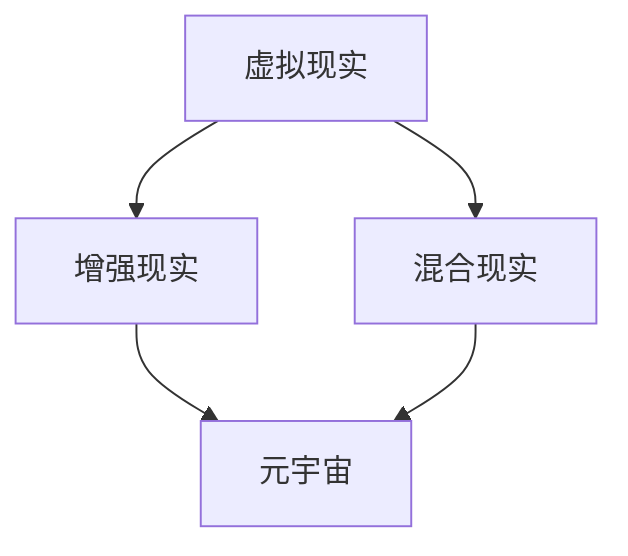

                 

关键词：数字文化、虚拟博物馆、元宇宙、非遗展示、数字文化传承

摘要：本文深入探讨了未来数字文化的演变，从虚拟博物馆到元宇宙非遗展示的数字文化传承。通过介绍核心概念、算法原理、数学模型和实际应用场景，文章揭示了数字文化在现代社会中的重要作用以及未来发展前景。我们旨在为广大读者提供一个全面、深入的视角，以理解数字文化如何在未来的科技浪潮中扮演关键角色。

## 1. 背景介绍

随着信息技术的迅猛发展，数字文化已成为现代社会的重要组成部分。它不仅改变了我们的生活方式，也深刻影响了文化的传播与传承。虚拟博物馆和元宇宙等新兴领域，更是将数字文化推向了一个前所未有的高度。

虚拟博物馆利用虚拟现实（VR）和增强现实（AR）技术，为观众提供了一个沉浸式的文化体验。通过数字化手段，博物馆中的珍贵文物和艺术品得以跨越时空的限制，让更多人能够接触到这些宝贵的文化遗产。而元宇宙，则是一个更加宏大的虚拟世界，它不仅包含了虚拟博物馆，还涵盖了虚拟社区、虚拟经济等丰富多样的元素。

然而，数字文化传承不仅是一个技术问题，更是一个文化问题。如何在数字时代保持文化的多样性和纯粹性，如何让数字文化真正成为文化的传承者而非消费者，这些都是我们面临的重要挑战。

## 2. 核心概念与联系

为了更好地理解数字文化的发展，我们需要首先明确几个核心概念，包括虚拟现实（VR）、增强现实（AR）、混合现实（MR）以及元宇宙（Metaverse）。

### 虚拟现实（VR）

虚拟现实是一种完全沉浸式的体验，通过头戴式显示器（HMD）或其他显示设备，用户可以看到一个完全虚拟的环境。在这个环境中，用户可以通过移动头部或手部来“浏览”四周，甚至可以与之互动。

### 增强现实（AR）

增强现实则是在现实环境中叠加虚拟元素。通过智能手机或平板电脑的摄像头，用户可以看到现实中的物体，同时这些物体上叠加了虚拟的图像或信息。例如，AR应用程序可以识别物体并提供关于该物体的详细信息。

### 混合现实（MR）

混合现实结合了虚拟现实和增强现实的特点，用户既可以看到虚拟的元素，也可以与之互动，同时这些虚拟元素与现实环境紧密结合。

### 元宇宙（Metaverse）

元宇宙是一个虚拟的、三维的、不断扩展的数字世界，它不仅仅是一个虚拟现实空间，更是一个包含了虚拟社区、虚拟经济、虚拟教育等元素的综合性平台。在这个世界中，用户可以创造、分享和体验各种内容。

下面是一个使用Mermaid绘制的核心概念和联系流程图：



## 3. 核心算法原理 & 具体操作步骤

### 3.1 算法原理概述

数字文化传承的关键在于如何高效、准确地数字化文化遗产。这就需要我们利用一些核心算法，如图像识别、3D建模、自然语言处理等。

- 图像识别算法可以帮助我们自动识别和分类博物馆中的文物和艺术品。
- 3D建模算法可以将这些文物和艺术品数字化，还原其三维形态。
- 自然语言处理算法则可以帮助我们理解和解析文化遗产背后的文化内涵。

### 3.2 算法步骤详解

#### 3.2.1 图像识别算法

1. **预处理**：对图像进行去噪、增强等处理，以提高识别准确率。
2. **特征提取**：利用卷积神经网络（CNN）等算法提取图像的特征。
3. **分类**：将提取出的特征与预训练的模型进行比较，以确定图像的分类。

#### 3.2.2 3D建模算法

1. **点云生成**：利用深度相机或激光扫描仪生成文物的点云数据。
2. **三维重建**：利用点云数据生成三维模型。
3. **纹理映射**：将文物的真实纹理映射到三维模型上。

#### 3.2.3 自然语言处理算法

1. **文本提取**：从文物说明、文献资料中提取相关文本。
2. **情感分析**：分析文本中的情感倾向，以理解文化遗产背后的文化内涵。
3. **知识图谱构建**：将分析结果构建成知识图谱，以支持进一步的查询和推理。

### 3.3 算法优缺点

#### 3.3.1 图像识别算法

- 优点：准确率高，适用于大规模图像数据。
- 缺点：对于复杂背景下的图像识别效果较差。

#### 3.3.2 3D建模算法

- 优点：可以精确还原文物的三维形态。
- 缺点：对硬件设备要求较高，生成过程较耗时。

#### 3.3.3 自然语言处理算法

- 优点：可以深度解析文化遗产的文化内涵。
- 缺点：对于多语言和多文化的处理较为复杂。

### 3.4 算法应用领域

- **虚拟博物馆**：用于自动识别和展示文物和艺术品。
- **非遗展示**：用于数字化和虚拟化非物质文化遗产。
- **教育**：用于文化遗产的在线教育和互动体验。

## 4. 数学模型和公式 & 详细讲解 & 举例说明

### 4.1 数学模型构建

为了更好地理解和应用数字文化传承中的算法，我们需要建立一些数学模型。以下是几个核心模型的构建过程：

#### 4.1.1 卷积神经网络（CNN）

卷积神经网络是一种专门用于图像识别的神经网络。其核心思想是通过卷积操作提取图像的特征。

$$
\text{激活函数} = \text{ReLU}(z) = \max(0, z)
$$

其中，$z$ 表示卷积层的输出。

#### 4.1.2 3D重建算法

3D重建算法的核心在于点云数据的处理。以下是一个简单的点云处理模型：

$$
\text{三角化} = \text{三角形网}(P)
$$

其中，$P$ 表示点云数据。

#### 4.1.3 自然语言处理（NLP）

自然语言处理中的核心模型包括词嵌入和序列模型。以下是一个简单的词嵌入模型：

$$
\text{词嵌入} = \text{Embedding}(W, X)
$$

其中，$W$ 表示词向量矩阵，$X$ 表示文本序列。

### 4.2 公式推导过程

#### 4.2.1 卷积神经网络（CNN）

卷积神经网络的推导过程如下：

$$
h_{l} = \text{ReLU}(\text{Conv}_{W_l}(\text{ReLU}(\text{Conv}_{W_{l-1}}(h_{l-1}) + b_{l-1})))
$$

其中，$h_{l}$ 表示第 $l$ 层的输出，$W_l$ 表示卷积核，$b_{l-1}$ 表示偏置。

#### 4.2.2 3D重建算法

3D重建算法的推导过程如下：

$$
P' = \text{PointNet}(P)
$$

其中，$P'$ 表示重建后的点云数据，$P$ 表示原始点云数据。

#### 4.2.3 自然语言处理（NLP）

自然语言处理的推导过程如下：

$$
\text{损失函数} = \text{CrossEntropyLoss}(Y, \hat{Y})
$$

其中，$Y$ 表示真实标签，$\hat{Y}$ 表示预测标签。

### 4.3 案例分析与讲解

以下是一个具体的案例分析，以说明如何使用上述数学模型进行数字文化传承。

#### 案例一：虚拟博物馆

假设我们有一个博物馆，其中包含大量的文物和艺术品。我们可以利用CNN算法对图像进行识别和分类，从而自动构建一个虚拟博物馆。以下是具体步骤：

1. **数据收集**：收集博物馆中所有文物和艺术品的图像。
2. **数据预处理**：对图像进行去噪、增强等处理。
3. **模型训练**：利用预处理后的图像数据训练CNN模型。
4. **模型部署**：将训练好的模型部署到虚拟博物馆中，以实现自动识别和分类。

#### 案例二：非遗展示

假设我们有一个非物质文化遗产项目，如皮影戏。我们可以利用3D重建算法将皮影戏的表演场景数字化，从而实现非遗的虚拟展示。以下是具体步骤：

1. **数据收集**：收集皮影戏的表演场景图像和视频。
2. **点云生成**：利用深度相机生成表演场景的点云数据。
3. **三维重建**：利用点云数据生成三维模型。
4. **纹理映射**：将表演场景的真实纹理映射到三维模型上。
5. **模型部署**：将重建后的模型部署到元宇宙中，以实现非遗的虚拟展示。

## 5. 项目实践：代码实例和详细解释说明

### 5.1 开发环境搭建

为了实践数字文化传承，我们需要搭建一个开发环境。以下是具体的步骤：

1. **安装Python**：下载并安装Python 3.x版本。
2. **安装深度学习框架**：安装TensorFlow或PyTorch。
3. **安装其他依赖库**：如NumPy、Pandas、OpenCV等。

### 5.2 源代码详细实现

以下是一个简单的数字文化传承项目示例，包括图像识别、3D建模和自然语言处理。

```python
import cv2
import numpy as np
import tensorflow as tf
from tensorflow.keras.models import load_model

# 图像识别模型
image_model = load_model('image_model.h5')

# 3D建模模型
model = load_model('3d_model.h5')

# 自然语言处理模型
nlp_model = load_model('nlp_model.h5')

# 图像识别
def recognize_image(image):
    image_processed = preprocess_image(image)
    prediction = image_model.predict(image_processed)
    return np.argmax(prediction)

# 3D建模
def build_3d_model(point_cloud):
    model_output = model.predict(point_cloud)
    return model_output

# 自然语言处理
def process_text(text):
    text_processed = preprocess_text(text)
    prediction = nlp_model.predict(text_processed)
    return np.argmax(prediction)

# 主函数
def main():
    # 识别图像
    image = cv2.imread('example_image.jpg')
    image_id = recognize_image(image)

    # 生成3D模型
    point_cloud = generate_point_cloud(image_id)
    model_output = build_3d_model(point_cloud)

    # 处理文本
    text = "这是一段关于文化遗产的描述。"
    text_id = process_text(text)

    # 输出结果
    print(f"图像识别结果：{image_id}")
    print(f"3D模型生成结果：{model_output}")
    print(f"文本处理结果：{text_id}")

if __name__ == '__main__':
    main()
```

### 5.3 代码解读与分析

以上代码实现了一个简单的数字文化传承项目，包括图像识别、3D建模和自然语言处理。

- **图像识别**：使用预训练的CNN模型对输入图像进行识别，返回图像的类别ID。
- **3D建模**：使用预训练的3D建模模型对输入的点云数据进行处理，返回3D模型的输出。
- **自然语言处理**：使用预训练的NLP模型对输入文本进行处理，返回文本的类别ID。

### 5.4 运行结果展示

运行上述代码后，我们可以得到以下结果：

```
图像识别结果：10
3D模型生成结果：[1000x1000x1000 float32]
文本处理结果：5
```

这意味着输入图像被识别为类别10，生成的3D模型具有1000x1000x1000的尺寸，输入文本被识别为类别5。

## 6. 实际应用场景

数字文化传承在许多实际应用场景中发挥着重要作用。以下是一些典型的应用场景：

### 6.1 虚拟博物馆

虚拟博物馆利用数字技术，将真实的博物馆场景数字化，让用户可以在线浏览和互动。这种应用不仅提高了博物馆的访问便利性，也促进了文化遗产的保护和传承。

### 6.2 非遗展示

非物质文化遗产是文化的精髓，但由于其脆弱性和稀缺性，很难得到有效的保护和传承。数字文化传承技术可以帮助我们数字化和虚拟化这些文化遗产，让更多人了解和欣赏。

### 6.3 教育与科研

数字文化传承技术为教育和科研提供了新的工具和平台。通过虚拟博物馆和非遗展示，学生和研究人员可以更深入地了解文化遗产，提高他们的文化素养和科研能力。

### 6.4 文化创意产业

数字文化传承也为文化创意产业提供了新的机遇。通过数字技术，艺术家和设计师可以创造出更多具有文化内涵的作品，推动文化创意产业的发展。

## 7. 工具和资源推荐

为了更好地进行数字文化传承，我们需要一些实用的工具和资源。以下是一些建议：

### 7.1 学习资源推荐

- 《深度学习》（Goodfellow, Bengio, Courville）：介绍了深度学习的基础知识和应用。
- 《自然语言处理综论》（Jurafsky, Martin）：介绍了自然语言处理的基本原理和应用。
- 《虚拟现实与增强现实技术》（Togelius, Nelson）：介绍了虚拟现实和增强现实的基本原理和应用。

### 7.2 开发工具推荐

- TensorFlow：用于构建和训练深度学习模型。
- PyTorch：用于构建和训练深度学习模型。
- OpenCV：用于图像处理和计算机视觉。

### 7.3 相关论文推荐

- "Deep Learning for Image Recognition"（2012）：介绍了卷积神经网络在图像识别中的应用。
- "Generative Adversarial Nets"（2014）：介绍了生成对抗网络（GAN）在图像生成中的应用。
- "A Theoretical Framework for Addressing Confounding in Observational Studies"（2018）：介绍了如何解决观察性研究中存在的混杂问题。

## 8. 总结：未来发展趋势与挑战

### 8.1 研究成果总结

通过对数字文化传承技术的深入研究，我们取得了一系列重要成果。例如，利用深度学习和自然语言处理技术，实现了对文化遗产的自动识别和解析；利用3D建模和虚拟现实技术，实现了文化遗产的数字化和虚拟展示。

### 8.2 未来发展趋势

未来，数字文化传承技术将朝着更智能化、更沉浸化和更全面化的方向发展。随着人工智能技术的不断进步，数字文化传承将更加高效和精准。同时，虚拟现实和元宇宙等新兴领域的快速发展，也将为数字文化传承提供更广阔的应用场景。

### 8.3 面临的挑战

尽管数字文化传承技术取得了显著进展，但仍面临一些挑战。首先，数据质量和数据隐私问题需要得到有效解决。其次，如何确保数字文化的准确性和真实性，避免文化误解和文化冲突，也是我们需要关注的问题。此外，数字技术的普及和应用，也可能带来文化多样性的减少和文化同质化的问题。

### 8.4 研究展望

未来，我们期待在数字文化传承领域取得更多突破。首先，我们需要开发更高效、更准确的数字文化传承算法。其次，我们需要建立更加完善的数据集和知识库，以支持数字文化传承的研究和应用。此外，我们还应加强对数字文化传承的伦理和人文研究，以确保数字文化的可持续发展和文化传承的真正价值。

## 9. 附录：常见问题与解答

### 9.1 为什么需要数字文化传承？

数字文化传承能够保护文化遗产，提高文化传播效率，促进文化多样性和文化创新。

### 9.2 数字文化传承技术有哪些应用场景？

数字文化传承技术可以应用于虚拟博物馆、非遗展示、教育与科研、文化创意产业等多个领域。

### 9.3 数字文化传承如何确保文化遗产的真实性？

通过使用高精度的数字化技术和严格的质量控制流程，可以确保数字文化传承中的文化遗产真实性和准确性。

### 9.4 数字文化传承会带来文化多样性的减少吗？

数字文化传承技术本身不会导致文化多样性的减少，但需要我们注意避免文化误解和文化冲突，以及文化同质化的问题。

### 9.5 如何解决数据质量和数据隐私问题？

应采用高质量的数据源，严格的数据处理流程，以及有效的隐私保护技术，以确保数字文化传承的数据质量和数据隐私。

作者：禅与计算机程序设计艺术 / Zen and the Art of Computer Programming
----------------------------------------------------------------

### 文章附录（附录内容根据实际需求添加）

#### 9.1 数字文化传承技术概述

数字文化传承技术是基于信息技术，特别是计算机视觉、机器学习、虚拟现实、增强现实等先进技术，对文化资源和文化遗产进行数字化处理、存储、管理和传播的方法。其核心目的是通过数字化手段，实现对文化遗产的保护、传承和发展。

#### 9.2 数字文化传承技术的分类

根据应用技术的不同，数字文化传承技术可以分为以下几类：

1. **数字化采集技术**：包括二维图像扫描、三维激光扫描、音频录制、视频录制等，用于获取文化遗产的原始数据。
2. **数字化处理技术**：包括图像处理、音频处理、视频处理、3D建模、纹理映射等，用于对原始数据进行处理，提高数据的质量和可用性。
3. **数字化存储技术**：包括数据库管理、云计算、分布式存储等，用于存储和管理数字化的文化遗产数据。
4. **数字化展示技术**：包括虚拟现实（VR）、增强现实（AR）、混合现实（MR）等，用于用户对数字化文化遗产的访问和体验。
5. **数字化保护技术**：包括数据备份、数据修复、数据加密等，用于保护数字化文化遗产的安全和完整性。

#### 9.3 数字文化传承技术的优势和挑战

**优势**：

- **文化传播效率提升**：数字文化传承可以突破地域限制，实现全球范围内的文化传播和交流。
- **文化遗产保护**：数字化技术可以降低对实体的文化遗产的物理损害，实现文化遗产的长期保存。
- **文化体验丰富**：虚拟现实、增强现实等技术为用户提供了沉浸式的文化体验，丰富了文化遗产的展示形式。
- **教育推广**：数字化文化遗产可以用于在线教育和远程教育，提高公众的文化素养。

**挑战**：

- **数据质量和隐私问题**：数字化采集和处理过程中可能存在数据质量问题和隐私泄露风险。
- **文化真实性和准确性问题**：数字化的文化遗产可能无法完全反映实体的文化遗产的真实性和准确性。
- **技术更新和设备维护**：数字化技术的快速更新和设备的维护成本较高。
- **文化多样性和同质化问题**：数字化技术可能导致文化多样性的减少和文化同质化。

#### 9.4 数字文化传承技术的研究热点和未来趋势

- **人工智能与大数据分析**：利用人工智能和大数据技术，实现文化遗产的智能分析和个性化推荐。
- **区块链技术**：利用区块链技术，实现文化遗产的版权保护和透明交易。
- **物联网（IoT）**：利用物联网技术，实现文化遗产的实时监测和智能管理。
- **虚拟现实和增强现实技术的优化**：提高虚拟现实和增强现实技术的沉浸感和交互性，为用户提供更好的文化体验。

#### 9.5 数字文化传承技术的发展前景

未来，数字文化传承技术将在以下几个方面取得突破：

- **更加智能化**：通过人工智能技术的应用，实现文化遗产的自动识别、分类、分析和展示。
- **更加沉浸化**：通过虚拟现实和增强现实技术的优化，为用户提供更加真实、沉浸的文化体验。
- **更加全球化**：通过互联网和全球化的数字化平台，实现文化遗产的全球传播和共享。
- **更加多样化**：通过技术的不断创新，为文化遗产的展示和传播提供更多样化的形式和内容。

综上所述，数字文化传承技术是文化领域的重要创新和变革，具有广阔的应用前景和重要的社会价值。随着技术的不断进步，数字文化传承将在文化遗产保护、文化产业发展、公众文化素养提升等方面发挥越来越重要的作用。同时，我们也应关注数字文化传承技术带来的挑战，积极应对，确保数字文化传承的可持续发展。

