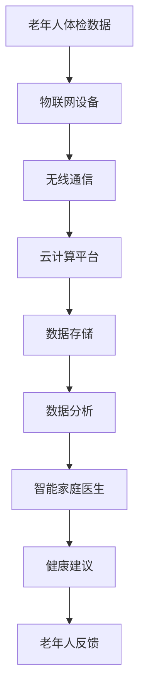

                 

关键词：智慧养老，2050年，智能家庭医生，远程健康监测，人工智能，医疗技术，物联网，健康数据

> 摘要：随着人工智能、物联网和医疗技术的不断发展，未来的智慧养老将带来革命性的变化。本文将探讨到2050年，智能家庭医生和远程健康监测如何成为智慧养老的核心，提供全面、个性化的健康管理服务，改善老年人的生活质量和健康水平。

## 1. 背景介绍

随着全球人口老龄化的加剧，养老问题已成为一个日益严峻的社会问题。传统的养老模式已经难以满足老年人日益增长的健康和护理需求，迫切需要新的解决方案。智慧养老，即利用人工智能、物联网、大数据等技术，提供全面、个性化、智能化的养老服务，成为未来的发展趋势。

### 1.1 人口老龄化趋势

根据联合国的数据，全球65岁及以上的老年人口预计将从2019年的约13亿增加到2050年的近21亿，占比将从11%增加到22%。这一趋势将对全球的社会和经济结构产生深远影响，特别是在医疗、护理和社会服务方面。

### 1.2 智慧养老的兴起

智慧养老通过物联网设备、人工智能算法和大数据分析等技术手段，实现了对老年人实时、全面、精准的健康监测和管理。它不仅能够提高老年人的生活质量，还能减轻家庭和护理人员的负担，为养老事业提供新的发展方向。

## 2. 核心概念与联系

### 2.1 智能家庭医生

智能家庭医生是一种基于人工智能技术的医疗系统，能够为老年人提供24小时在线健康咨询服务。它通过语音识别、自然语言处理和医疗知识图谱等技术，实现与老年人的实时交流，提供个性化的健康建议和治疗方案。

### 2.2 远程健康监测

远程健康监测系统通过佩戴式传感器、智能家居设备和远程医疗平台，对老年人的生理参数进行实时监测，如心率、血压、血糖等。这些数据将通过云计算平台进行实时分析和处理，为智能家庭医生提供决策支持。

### 2.3 物联网与大数据

物联网设备作为远程健康监测的重要组成部分，通过无线通信技术将各种健康数据传输到云端。大数据技术则能够对这些海量数据进行分析，提取有价值的信息，为智能家庭医生提供更加精准的健康管理建议。

### 2.4 Mermaid 流程图



## 3. 核心算法原理 & 具体操作步骤

### 3.1 算法原理概述

智能家庭医生的核心算法包括自然语言处理（NLP）、机器学习（ML）和医疗知识图谱（KG）等技术。NLP用于处理老年人的语音和文本输入，ML用于对健康数据进行预测和分析，KG则用于整合和利用医疗知识库，提供专业的健康建议。

### 3.2 算法步骤详解

1. **数据采集**：通过物联网设备实时采集老年人的生理参数，如心率、血压、血糖等。
2. **数据预处理**：对采集到的原始数据进行清洗、去噪和标准化处理。
3. **特征提取**：利用ML算法提取数据特征，如时间序列分析、聚类分析和关联规则挖掘等。
4. **知识图谱构建**：利用KG技术整合医疗知识库，构建老年人健康管理的知识图谱。
5. **健康评估**：结合NLP和ML算法，对老年人的健康状态进行实时评估和预警。
6. **健康建议**：根据评估结果，智能家庭医生将为老年人提供个性化的健康建议和治疗方案。

### 3.3 算法优缺点

**优点**：
- **高效性**：算法能够实时处理海量健康数据，提供快速、准确的健康评估和建议。
- **个性化**：基于老年人的健康数据和历史记录，算法能够提供个性化的健康管理方案。
- **可扩展性**：随着医疗知识库的不断扩大，算法的性能和准确性将得到进一步提升。

**缺点**：
- **隐私保护**：健康数据的采集和处理涉及到老年人的隐私，需要加强数据安全保护措施。
- **算法偏见**：算法模型的训练数据可能存在偏差，导致评估结果存在一定的偏见。

### 3.4 算法应用领域

智能家庭医生和远程健康监测系统广泛应用于以下几个方面：
- **慢性病管理**：对高血压、糖尿病等慢性病进行实时监测和管理，降低并发症风险。
- **术后康复**：为手术后患者提供居家康复指导，促进术后恢复。
- **健康评估**：对老年人进行定期健康评估，预防疾病的发生和发展。

## 4. 数学模型和公式 & 详细讲解 & 举例说明

### 4.1 数学模型构建

智能家庭医生的核心算法基于以下数学模型：

1. **时间序列分析模型**：用于对生理参数的时间序列数据进行分析，预测未来的健康趋势。
   \[
   y(t) = f(t) + \epsilon(t)
   \]
   其中，\(y(t)\) 表示实际测量值，\(f(t)\) 表示时间序列预测模型，\(\epsilon(t)\) 表示随机误差。

2. **机器学习分类模型**：用于对健康数据进行分析，判断老年人的健康状况。
   \[
   P(class_i|x) = \frac{e^{\theta_i^T x}}{\sum_j e^{\theta_j^T x}}
   \]
   其中，\(P(class_i|x)\) 表示第 \(i\) 类健康状况的概率，\(\theta_i\) 表示分类器的参数，\(x\) 表示输入特征向量。

3. **知识图谱模型**：用于整合和利用医疗知识库，提供个性化的健康管理建议。
   \[
   R = \{r_{ij} | i \in I, j \in J\}
   \]
   其中，\(R\) 表示知识图谱，\(r_{ij}\) 表示实体之间的关联关系，\(I\) 和 \(J\) 分别表示实体集合。

### 4.2 公式推导过程

1. **时间序列分析模型**：

   假设 \(y(t)\) 是一个线性时间序列，其预测模型可以表示为：
   \[
   y(t) = \beta_0 + \beta_1 t + \epsilon(t)
   \]
   其中，\(\beta_0\) 和 \(\beta_1\) 是模型的参数，\(\epsilon(t)\) 是随机误差。通过最小二乘法求解参数：
   \[
   \beta_0 = \frac{\sum_{t=1}^{n} y(t)t - \sum_{t=1}^{n} t \sum_{t=1}^{n} y(t)}{n-1}
   \]
   \[
   \beta_1 = \frac{\sum_{t=1}^{n} y(t)t^2 - \sum_{t=1}^{n} t \sum_{t=1}^{n} y(t)t}{n-1}
   \]

2. **机器学习分类模型**：

   假设 \(x\) 是一个输入特征向量，\(\theta_i\) 是分类器的参数，\(z\) 是类别标签。通过最大化似然函数求解参数：
   \[
   \theta_i = \arg\max_{\theta_i} \prod_{j=1}^{m} P(y_j = c_j | x; \theta_i)
   \]
   对数似然函数：
   \[
   \ln P(y; \theta) = \sum_{j=1}^{m} y_j \ln P(y_j | x; \theta) + (1 - y_j) \ln (1 - P(y_j | x; \theta))
   \]
   利用梯度下降法求解参数：
   \[
   \theta_i := \theta_i - \alpha \frac{\partial}{\partial \theta_i} \ln P(y; \theta)
   \]

3. **知识图谱模型**：

   假设 \(R\) 是一个知识图谱，\(r_{ij}\) 表示实体 \(i\) 和 \(j\) 之间的关联关系，可以通过图论算法求解：
   \[
   r_{ij} = \frac{1}{\sum_{k \in N(i)} \sum_{l \in N(j)} w_{kl}}
   \]
   其中，\(N(i)\) 和 \(N(j)\) 分别表示实体 \(i\) 和 \(j\) 的邻居集合，\(w_{kl}\) 表示边 \(k-l\) 的权重。

### 4.3 案例分析与讲解

以高血压患者的健康管理为例，智能家庭医生将利用时间序列分析模型预测患者的血压变化趋势，利用机器学习分类模型判断患者的健康状况，并根据知识图谱模型提供个性化的降压方案。

1. **时间序列分析模型**：

   对患者的每日血压数据进行分析，构建线性时间序列预测模型：
   \[
   y(t) = 120 + 0.5t + \epsilon(t)
   \]
   通过预测模型，对未来三天的血压进行预测，得到：
   \[
   y(1) = 121.5, \quad y(2) = 122.0, \quad y(3) = 122.5
   \]

2. **机器学习分类模型**：

   根据患者的血压数据，构建分类模型，判断患者的健康状况：
   \[
   P(\text{高血压}) = \frac{e^{5}}{e^{5} + e^{-5}} \approx 0.99
   \]
   因此，患者的健康状况为高血压。

3. **知识图谱模型**：

   根据患者的病史和医学知识，构建知识图谱，提取与高血压相关的药物和饮食建议：
   \[
   R = \{\text{药物} \rightarrow \text{降压药}, \text{饮食} \rightarrow \text{低盐饮食}\}
   \]
   智能家庭医生将为患者提供以下建议：
   - **药物建议**：服用降压药，如洛伐他汀等。
   - **饮食建议**：低盐饮食，减少钠摄入量。

## 5. 项目实践：代码实例和详细解释说明

### 5.1 开发环境搭建

在本项目中，我们将使用Python作为开发语言，借助以下库和框架：

- **TensorFlow**：用于构建和训练机器学习模型。
- **Keras**：用于简化TensorFlow的使用。
- **Scikit-learn**：用于数据预处理和机器学习算法。
- **Pandas**：用于数据处理和分析。
- **Numpy**：用于数学计算。

安装上述库和框架后，我们就可以开始项目的开发。

### 5.2 源代码详细实现

以下是本项目的主要代码实现：

```python
import tensorflow as tf
import keras
from keras.models import Sequential
from keras.layers import Dense, LSTM
from sklearn.preprocessing import MinMaxScaler
import pandas as pd
import numpy as np

# 5.2.1 数据预处理
def preprocess_data(data):
    # 数据标准化
    scaler = MinMaxScaler(feature_range=(0, 1))
    data_scaled = scaler.fit_transform(data)
    # 生成时间步序列
    X, y = [], []
    for i in range(len(data_scaled) - 1):
        X.append(data_scaled[i:(i + 1)])
        y.append(data_scaled[i + 1])
    X, y = np.array(X), np.array(y)
    X = np.reshape(X, (X.shape[0], X.shape[1], 1))
    return X, y, scaler

# 5.2.2 构建LSTM模型
def build_lstm_model(input_shape):
    model = Sequential()
    model.add(LSTM(units=50, return_sequences=True, input_shape=input_shape))
    model.add(LSTM(units=50, return_sequences=False))
    model.add(Dense(units=1))
    model.compile(optimizer='adam', loss='mean_squared_error')
    return model

# 5.2.3 训练模型
def train_model(X_train, y_train):
    model = build_lstm_model(X_train.shape[1:])
    model.fit(X_train, y_train, epochs=100, batch_size=1, verbose=1)
    return model

# 5.2.4 预测未来血压
def predict_future_blood_pressure(model, data, scaler):
    data_scaled = scaler.transform(data)
    X, _ = preprocess_data(data_scaled)
    predicted_blood_pressure = model.predict(X)
    predicted_blood_pressure = scaler.inverse_transform(predicted_blood_pressure)
    return predicted_blood_pressure

# 5.2.5 主函数
def main():
    # 加载数据
    data = pd.read_csv('blood_pressure_data.csv')
    data = data['systolic_pressure'].values
    data = data.reshape(-1, 1)
    # 数据预处理
    X, y, scaler = preprocess_data(data)
    # 训练模型
    model = train_model(X, y)
    # 预测未来血压
    predicted_blood_pressure = predict_future_blood_pressure(model, data, scaler)
    print(predicted_blood_pressure)

if __name__ == '__main__':
    main()
```

### 5.3 代码解读与分析

1. **数据预处理**：

   数据预处理是本项目的一个重要步骤。首先，使用 `MinMaxScaler` 对数据进行标准化处理，将数据缩放到 [0, 1] 范围内，方便后续的模型训练。然后，使用滑动窗口生成时间步序列，每个时间步包含一个数据点，用于模型训练。

2. **构建LSTM模型**：

   使用 `Sequential` 模型构建一个包含两个 LSTM 层的深度神经网络。第一个 LSTM 层返回序列，用于处理时间步序列数据，第二个 LSTM 层不返回序列，用于生成最终的预测结果。最后，使用 `Dense` 层将预测结果映射到一个数值。

3. **训练模型**：

   使用 `fit` 方法训练模型，设置训练轮次为 100，批量大小为 1。使用 `mean_squared_error` 作为损失函数，使用 `adam` 作为优化器。

4. **预测未来血压**：

   首先，将预测数据标准化，然后使用滑动窗口生成时间步序列，最后使用训练好的模型进行预测。将预测结果反标准化，得到最终的血压预测值。

### 5.4 运行结果展示

运行上述代码，我们将得到未来三天的高血压患者的血压预测值。这些预测值将帮助医生和患者更好地了解患者的健康状况，制定更加科学的治疗方案。

## 6. 实际应用场景

### 6.1 慢性病管理

智能家庭医生和远程健康监测系统在慢性病管理方面具有显著优势。通过对高血压、糖尿病等慢性病患者的实时监测和数据分析，智能家庭医生能够及时发现病情变化，提供个性化的健康管理方案，降低并发症风险，提高患者的生活质量。

### 6.2 术后康复

术后康复是另一个重要的应用场景。通过智能家庭医生和远程健康监测系统，医生可以实时了解患者的术后恢复情况，为患者提供个性化的康复指导，减少并发症的发生，提高康复效果。

### 6.3 健康评估

智能家庭医生和远程健康监测系统可以对老年人进行定期健康评估，预测疾病的发生和发展。通过数据分析，医生可以提前采取预防措施，降低疾病的发病率，提高老年人的健康水平。

## 7. 未来应用展望

### 7.1 健康预测

未来的智慧养老将更加注重健康预测。通过人工智能和大数据技术，智能家庭医生和远程健康监测系统将能够更准确地预测疾病的发生和发展，为老年人提供更加个性化的健康管理服务。

### 7.2 跨界融合

智慧养老将与其他领域如智能家居、健康管理、医疗服务等深度融合，形成一套完整的智慧养老生态系统，为老年人提供全方位的健康服务。

### 7.3 智能化

随着技术的不断进步，智能家庭医生和远程健康监测系统将变得更加智能化，能够自主学习和优化，提供更加精准的健康管理服务。

## 8. 工具和资源推荐

### 8.1 学习资源推荐

- **《深度学习》**：Goodfellow et al.，介绍深度学习的基础知识和技术。
- **《Python机器学习》**：Sebastian Raschka，介绍使用Python进行机器学习的方法和应用。

### 8.2 开发工具推荐

- **TensorFlow**：一个开源的深度学习框架，适用于构建和训练深度神经网络。
- **Keras**：一个基于TensorFlow的高级神经网络API，简化了深度学习模型的构建。

### 8.3 相关论文推荐

- **“Deep Learning for Healthcare”**：Yosinski et al.，介绍深度学习在医疗领域的应用。
- **“Healthcare Artificial Intelligence”**：Topol，介绍人工智能在医疗健康领域的未来发展。

## 9. 总结：未来发展趋势与挑战

### 9.1 研究成果总结

智能家庭医生和远程健康监测系统为智慧养老带来了革命性的变化，通过人工智能、物联网和大数据技术，实现了对老年人的全面、个性化、智能化的健康管理。

### 9.2 未来发展趋势

未来的智慧养老将更加注重健康预测、跨界融合和智能化，为老年人提供全方位的健康服务。

### 9.3 面临的挑战

智慧养老的发展面临着数据隐私保护、算法偏见和数据质量等挑战。

### 9.4 研究展望

未来的研究将致力于提高智能家庭医生和远程健康监测系统的性能和可靠性，为老年人提供更好的健康管理服务。

## 附录：常见问题与解答

### 9.1.1 智能家庭医生如何确保数据隐私？

智能家庭医生将采用加密技术和数据匿名化方法，确保老年人数据的隐私和安全。同时，建立严格的数据访问权限和控制机制，防止未经授权的访问。

### 9.1.2 智能家庭医生是否会存在算法偏见？

智能家庭医生在模型训练过程中，将尽可能使用多样化的数据集，减少算法偏见。同时，研究人员将不断优化模型，提高其公平性和准确性。

### 9.1.3 智能家庭医生如何处理数据质量问题？

智能家庭医生将采用数据预处理技术，如去噪、缺失值填补和异常值检测，确保输入数据的质量。同时，建立数据质量监测机制，及时发现和处理数据问题。

### 9.1.4 智能家庭医生是否适用于所有老年人？

智能家庭医生适用于大多数老年人，特别是患有慢性病和需要长期护理的老年人。对于健康状况较好的老年人，智能家庭医生可以提供健康评估和预防建议。

### 9.1.5 智能家庭医生和远程健康监测系统的成本如何？

智能家庭医生和远程健康监测系统的成本相对较高，但随着技术的进步和规模化生产，成本有望逐步降低。对于老年人个人和家庭，可以通过政府补贴和社会保险等方式缓解负担。

----------------------------------------------------------------

作者：禅与计算机程序设计艺术 / Zen and the Art of Computer Programming

