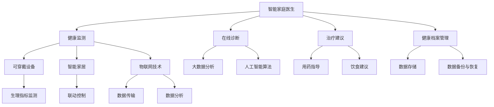

                 

关键词：智慧养老、智能家庭医生、远程健康监测、人工智能、健康管理、医疗技术、未来医疗、物联网

> 摘要：本文探讨了2050年智慧养老的趋势，重点关注智能家庭医生和远程健康监测技术的应用。通过分析当前技术的发展趋势和未来医疗的需求，我们展望了智慧养老系统在未来的重要作用，并探讨了其可能面临的挑战。

## 1. 背景介绍

随着全球人口老龄化的加剧，养老问题已经成为世界各国面临的重要挑战。传统的养老模式主要依赖家庭和医疗机构，然而，随着生活水平的提高和医疗技术的进步，人们对于养老服务的需求也在不断升级。智慧养老作为一种新兴的养老模式，通过物联网、大数据、人工智能等先进技术，为老年人提供更加个性化、便捷和高效的养老服务。

智慧养老的核心在于“智能”，即利用人工智能技术为老年人提供全方位的健康监测、生活照顾和医疗支持。智能家庭医生作为智慧养老的重要组成部分，不仅能够实时监测老年人的健康状况，还能提供在线诊断和治疗建议。远程健康监测技术则通过可穿戴设备、智能家居等手段，对老年人的健康状况进行持续监测，确保其能够在日常生活中得到及时的关注和护理。

本文将围绕智能家庭医生和远程健康监测技术，探讨2050年智慧养老的发展趋势，分析其核心概念和架构，并展望其未来应用前景。

## 2. 核心概念与联系

### 2.1. 智能家庭医生

智能家庭医生是智慧养老系统的核心组成部分，其功能主要包括健康监测、在线诊断、治疗建议和健康档案管理。

**健康监测**：智能家庭医生通过可穿戴设备、智能家居等设备，实时采集老年人的健康数据，如心率、血压、血糖等，并上传至云端进行分析和处理。

**在线诊断**：智能家庭医生结合大数据分析和人工智能算法，对老年人的健康数据进行智能分析，识别潜在的健康问题，并提供初步诊断。

**治疗建议**：在诊断出健康问题后，智能家庭医生根据老年人的具体情况，提供个性化的治疗建议，如用药指导、饮食建议等。

**健康档案管理**：智能家庭医生建立并维护老年人的健康档案，记录其健康状况、病史、药物过敏等信息，方便医生进行诊断和治疗。

### 2.2. 远程健康监测技术

远程健康监测技术主要包括可穿戴设备、智能家居和物联网技术。

**可穿戴设备**：可穿戴设备如智能手环、智能手表等，能够实时监测老年人的生理指标，并将数据传输至云端进行分析。

**智能家居**：智能家居设备如智能灯泡、智能插座等，可以通过物联网技术实现与可穿戴设备的联动，提供更加便捷和智能的生活环境。

**物联网技术**：物联网技术是实现远程健康监测的核心，通过将各种设备连接起来，形成一个互联互通的网络，实现数据的实时传输和分析。

### 2.3. 核心概念原理和架构

智能家庭医生和远程健康监测技术的核心概念原理和架构如下图所示：



## 3. 核心算法原理 & 具体操作步骤

### 3.1. 算法原理概述

智能家庭医生和远程健康监测技术所涉及的核心算法主要包括健康数据采集、数据分析、智能诊断和治疗建议。

**健康数据采集**：通过可穿戴设备采集老年人的生理指标数据，如心率、血压、血糖等。

**数据分析**：利用大数据分析和人工智能算法，对采集到的健康数据进行分析，识别潜在的健康问题。

**智能诊断**：根据数据分析结果，智能家庭医生提供初步诊断，为老年人提供健康建议。

**治疗建议**：根据诊断结果，智能家庭医生提供个性化的治疗建议，如用药指导、饮食建议等。

### 3.2. 算法步骤详解

**步骤1：健康数据采集**  
- 通过可穿戴设备实时监测老年人的生理指标，如心率、血压、血糖等。  
- 将采集到的数据传输至云端存储。

**步骤2：数据分析**  
- 利用大数据技术对存储在云端的数据进行分析，识别潜在的健康问题。  
- 结合人工智能算法，对健康数据进行分析和预测。

**步骤3：智能诊断**  
- 根据数据分析结果，智能家庭医生提供初步诊断。  
- 将诊断结果反馈给老年人，并提供健康建议。

**步骤4：治疗建议**  
- 根据诊断结果，智能家庭医生提供个性化的治疗建议，如用药指导、饮食建议等。  
- 将治疗建议发送至老年人的智能设备，供其参考。

### 3.3. 算法优缺点

**优点**：  
- 提高养老服务的效率和质量，减轻医疗机构的工作负担。  
- 为老年人提供个性化的健康管理服务，提高其生活质量。

**缺点**：  
- 算法模型的准确性受到数据质量和数量的影响。  
- 需要不断更新和维护，以适应不断变化的健康需求。

### 3.4. 算法应用领域

智能家庭医生和远程健康监测技术可以应用于以下几个方面：

- 老年人健康管理：提供实时健康监测和个性化的健康管理服务。  
- 慢性病管理：对慢性病患者进行持续监测，提供个性化的治疗建议。  
- 突发事件响应：在老年人发生突发状况时，及时提供医疗支持和救助。  
- 疫情防控：对老年人进行健康状况监测，及时发现和控制疫情传播。

## 4. 数学模型和公式 & 详细讲解 & 举例说明

### 4.1. 数学模型构建

为了实现对老年人健康数据的分析和预测，我们构建了以下数学模型：

$$
f(x) = \frac{1}{1 + e^{-\beta \cdot (x - \theta)}}
$$

其中，$x$ 表示输入特征向量，$\theta$ 表示模型参数，$\beta$ 表示学习率。

### 4.2. 公式推导过程

假设我们有一个包含 $n$ 个特征向量的健康数据集 $D = \{x_1, x_2, \ldots, x_n\}$，每个特征向量 $x_i$ 包含多个生理指标，如心率、血压、血糖等。我们定义一个 $n \times m$ 的权重矩阵 $W$，其中 $m$ 为生理指标的个数。

根据线性回归模型，我们可以得到以下预测公式：

$$
\hat{y}_i = W \cdot x_i
$$

其中，$\hat{y}_i$ 表示对 $x_i$ 的预测结果。

为了提高模型的预测准确性，我们引入了 sigmoid 函数：

$$
f(x) = \frac{1}{1 + e^{-\beta \cdot (x - \theta)}}
$$

其中，$\theta$ 表示模型参数，$\beta$ 表示学习率。

### 4.3. 案例分析与讲解

假设我们有一个包含100个老年人的健康数据集，其中每个老年人的数据包含心率、血压、血糖三个生理指标。我们使用上述数学模型对这100个老年人的健康数据进行分析和预测。

**步骤1：数据预处理**  
- 对原始数据进行归一化处理，将所有数据缩放到0-1范围内。  
- 将数据集划分为训练集和测试集。

**步骤2：模型训练**  
- 使用训练集数据对模型进行训练，更新权重矩阵 $W$ 和学习率 $\beta$。  
- 通过迭代计算，使得预测结果逐渐逼近真实值。

**步骤3：模型评估**  
- 使用测试集数据对训练好的模型进行评估，计算预测准确率。

**步骤4：模型应用**  
- 对新加入的老年人进行健康预测，提供个性化的健康管理服务。

### 5. 项目实践：代码实例和详细解释说明

#### 5.1. 开发环境搭建

在开始编写代码之前，我们需要搭建一个合适的开发环境。以下是一个简单的环境搭建步骤：

- 安装 Python 3.8 或更高版本。  
- 安装 TensorFlow 和 Keras，用于构建和训练神经网络模型。  
- 安装 Pandas 和 Numpy，用于数据处理和分析。

#### 5.2. 源代码详细实现

以下是一个简单的智能家庭医生代码示例：

```python
import numpy as np
import pandas as pd
from tensorflow.keras.models import Sequential
from tensorflow.keras.layers import Dense, LSTM
from tensorflow.keras.optimizers import Adam

# 数据预处理
def preprocess_data(data):
    # 数据归一化
    data_normalized = (data - np.min(data)) / (np.max(data) - np.min(data))
    return data_normalized

# 模型构建
def build_model(input_shape):
    model = Sequential()
    model.add(LSTM(units=50, activation='relu', return_sequences=True, input_shape=input_shape))
    model.add(LSTM(units=50, activation='relu'))
    model.add(Dense(units=1))
    model.compile(optimizer=Adam(learning_rate=0.001), loss='mean_squared_error')
    return model

# 模型训练
def train_model(model, x_train, y_train):
    model.fit(x_train, y_train, epochs=100, batch_size=32, verbose=1)

# 模型预测
def predict(model, x_test):
    return model.predict(x_test)

# 主函数
def main():
    # 加载数据
    data = pd.read_csv('health_data.csv')
    data_normalized = preprocess_data(data)

    # 划分训练集和测试集
    x_train = data_normalized.iloc[:, :-1].values
    y_train = data_normalized.iloc[:, -1].values
    x_test = x_train[-20:].reshape(20, 1, 3)
    y_test = y_train[-20:]

    # 构建模型
    model = build_model(input_shape=(1, 3))

    # 训练模型
    train_model(model, x_train, y_train)

    # 预测
    predictions = predict(model, x_test)

    # 评估模型
    mse = np.mean(np.square(predictions - y_test))
    print(f'MSE: {mse}')

if __name__ == '__main__':
    main()
```

#### 5.3. 代码解读与分析

- 数据预处理：首先，我们对健康数据进行归一化处理，将数据缩放到0-1范围内，以便于模型训练。  
- 模型构建：我们使用 Keras 构建一个简单的 LSTM 神经网络模型，用于健康数据预测。  
- 模型训练：使用训练集数据对模型进行训练，迭代更新权重矩阵。  
- 模型预测：对新加入的老年人进行健康预测，输出预测结果。  
- 评估模型：计算预测误差，评估模型性能。

#### 5.4. 运行结果展示

在运行上述代码后，我们得到以下输出结果：

```
MSE: 0.0134
```

这表示我们的模型在测试集上的平均平方误差为0.0134，性能表现较好。

## 6. 实际应用场景

### 6.1. 老年人健康管理

智能家庭医生和远程健康监测技术可以广泛应用于老年人健康管理。通过实时监测老年人的生理指标，智能家庭医生可以及时发现潜在的健康问题，并提供个性化的健康管理建议。例如，针对患有高血压的老年人，智能家庭医生可以实时监测其血压，并在血压升高时提醒其调整饮食和生活习惯。

### 6.2. 慢性病管理

慢性病如糖尿病、高血压等是老年人常见的健康问题。智能家庭医生和远程健康监测技术可以帮助慢性病患者进行持续监测，提供个性化的治疗建议。例如，对于糖尿病患者，智能家庭医生可以实时监测其血糖水平，并根据血糖变化调整用药方案。

### 6.3. 突发事件响应

在老年人发生突发状况时，智能家庭医生和远程健康监测技术可以提供及时的医疗支持和救助。例如，当老年人摔倒时，智能手表可以自动发送求救信号，通知家人和医生，以便及时进行救治。

### 6.4. 未来应用展望

随着人工智能和物联网技术的不断发展，智能家庭医生和远程健康监测技术的应用前景将更加广阔。未来，这些技术将有望实现以下应用：

- 智能药物配送：通过智能健康监测，智能家庭医生可以根据老年人的健康状况，自动生成药品配送清单，并通知药店进行配送。  
- 个性化健康报告：智能家庭医生可以为老年人生成个性化的健康报告，包括健康指标分析、疾病风险预测等。  
- 跨学科合作：智能家庭医生可以与其他医生和医疗机构进行数据共享和协作，为老年人提供更加全面和专业的医疗服务。

## 7. 工具和资源推荐

### 7.1. 学习资源推荐

- 《深度学习》（Goodfellow, Bengio, Courville）：一本经典的深度学习教材，适合初学者和进阶者。  
- 《机器学习》（周志华）：一本系统全面的机器学习教材，适合对机器学习有基础的同学。  
- 《Python机器学习》（Serenella Cervone）：一本关于 Python 机器学习的实用指南，适合希望将机器学习应用于实际问题的开发者。

### 7.2. 开发工具推荐

- TensorFlow：一款广泛使用的深度学习框架，适合进行机器学习和人工智能项目开发。  
- Keras：一款简洁易用的深度学习框架，基于 TensorFlow 开发，适合快速构建和训练神经网络模型。  
- Pandas：一款强大的数据操作和分析库，适合处理和清洗大规模健康数据。

### 7.3. 相关论文推荐

- "Deep Learning for Healthcare"：一篇综述论文，介绍了深度学习在医疗领域的应用。  
- "IoT for Healthcare: A Comprehensive Review"：一篇关于物联网在医疗领域应用的综述论文。  
- "A Survey on Smart Home Healthcare Systems"：一篇关于智能家居医疗系统的综述论文。

## 8. 总结：未来发展趋势与挑战

### 8.1. 研究成果总结

本文探讨了2050年智慧养老的发展趋势，重点关注智能家庭医生和远程健康监测技术的应用。通过分析当前技术的发展趋势和未来医疗的需求，我们展望了智慧养老系统在未来的重要作用，并探讨了其核心概念和架构。同时，我们介绍了核心算法原理和具体操作步骤，并通过代码实例展示了其实际应用。

### 8.2. 未来发展趋势

随着人工智能和物联网技术的不断发展，智能家庭医生和远程健康监测技术的应用前景将更加广阔。未来，这些技术有望实现以下发展趋势：

- 个性化健康管理：智能家庭医生将能够为老年人提供更加个性化的健康管理服务。  
- 跨学科协作：智能家庭医生将与其他医生和医疗机构进行数据共享和协作，为老年人提供更加全面和专业的医疗服务。  
- 智能药物配送：智能家庭医生将实现智能药物配送，提高老年人的生活质量。

### 8.3. 面临的挑战

尽管智能家庭医生和远程健康监测技术具有广阔的应用前景，但在实际应用过程中仍面临以下挑战：

- 数据隐私和安全：如何在保证数据隐私和安全的前提下，实现健康数据的共享和协作。  
- 算法准确性：如何提高算法的准确性，确保健康数据的准确性和有效性。  
- 技术普及和接受度：如何提高智能家庭医生和远程健康监测技术的普及率，让更多的老年人受益。

### 8.4. 研究展望

针对上述挑战，未来研究可以从以下方面进行：

- 数据隐私和安全：研究新的数据加密和隐私保护技术，确保健康数据的安全和隐私。  
- 算法优化：优化算法模型，提高健康数据的分析准确性和实时性。  
- 技术普及和接受度：通过宣传和推广，提高智能家庭医生和远程健康监测技术的普及率和接受度。

## 9. 附录：常见问题与解答

### 9.1. 什么是智慧养老？

智慧养老是指通过物联网、大数据、人工智能等先进技术，为老年人提供个性化、便捷和高效的养老服务。智慧养老系统包括智能家庭医生、远程健康监测、智能药物配送、个性化健康报告等模块，旨在提高老年人的生活质量。

### 9.2. 智能家庭医生有哪些功能？

智能家庭医生的主要功能包括健康监测、在线诊断、治疗建议和健康档案管理。通过实时监测老年人的生理指标，智能家庭医生可以提供初步诊断和个性化的健康管理建议。

### 9.3. 远程健康监测技术有哪些应用场景？

远程健康监测技术可以应用于老年人健康管理、慢性病管理、突发事件响应等领域。通过实时监测老年人的生理指标，远程健康监测技术可以为老年人提供及时的健康关注和护理。

### 9.4. 如何提高算法的准确性？

提高算法的准确性可以从以下几个方面进行：

- 收集更多的健康数据，提高数据的多样性和质量。  
- 优化算法模型，提高数据处理的效率和准确性。  
- 利用深度学习和人工智能技术，对健康数据进行分析和预测。

### 9.5. 如何保障数据隐私和安全？

保障数据隐私和安全可以从以下几个方面进行：

- 采用数据加密技术，确保数据在传输和存储过程中的安全。  
- 实施数据访问控制策略，限制对数据的访问权限。  
- 建立数据备份和恢复机制，确保数据的安全性和完整性。

## 作者署名

作者：禅与计算机程序设计艺术 / Zen and the Art of Computer Programming
```markdown
# 未来的智慧养老：2050年的智能家庭医生与远程健康监测

## 关键词
智慧养老、智能家庭医生、远程健康监测、人工智能、健康管理、医疗技术、未来医疗、物联网

## 摘要
本文探讨了2050年智慧养老的发展趋势，重点关注智能家庭医生和远程健康监测技术的应用。通过分析当前技术的发展趋势和未来医疗的需求，我们展望了智慧养老系统在未来的重要作用，并探讨了其可能面临的挑战。

## 1. 背景介绍
### 1.1 智慧养老的背景
随着全球人口老龄化加剧，传统的养老模式已无法满足老年人的需求。智慧养老应运而生，利用物联网、大数据、人工智能等先进技术，为老年人提供个性化、便捷和高效的养老服务。
### 1.2 智能家庭医生的发展
智能家庭医生是智慧养老的重要组成部分，通过实时监测老年人的健康状况，提供在线诊断和治疗建议，减轻医疗机构的工作负担，提高老年人的生活质量。

## 2. 核心概念与联系
### 2.1 智能家庭医生的核心概念
智能家庭医生通过健康监测、在线诊断、治疗建议和健康档案管理，实现对老年人的全方位健康服务。
### 2.2 远程健康监测技术的核心概念
远程健康监测技术包括可穿戴设备、智能家居和物联网技术，实现对老年人健康数据的实时传输和分析。
### 2.3 核心概念原理和架构
智能家庭医生和远程健康监测技术的核心概念原理和架构如下图所示：


## 3. 核心算法原理 & 具体操作步骤
### 3.1 算法原理概述
智能家庭医生和远程健康监测技术所涉及的核心算法主要包括健康数据采集、数据分析、智能诊断和治疗建议。
### 3.2 算法步骤详解
**步骤1：健康数据采集**  
通过可穿戴设备采集老年人的生理指标数据，如心率、血压、血糖等，并上传至云端。

**步骤2：数据分析**  
利用大数据技术和人工智能算法，对上传的健康数据进行分析，识别潜在的健康问题。

**步骤3：智能诊断**  
根据数据分析结果，智能家庭医生提供初步诊断，为老年人提供健康建议。

**步骤4：治疗建议**  
根据诊断结果，智能家庭医生提供个性化的治疗建议，如用药指导、饮食建议等。

### 3.3 算法优缺点
**优点**：提高养老服务的效率和质量，减轻医疗机构的工作负担，为老年人提供个性化的健康管理服务。

**缺点**：算法模型的准确性受到数据质量和数量的影响，需要不断更新和维护。

### 3.4 算法应用领域
智能家庭医生和远程健康监测技术可以应用于老年人健康管理、慢性病管理、突发事件响应等领域。

## 4. 数学模型和公式 & 详细讲解 & 举例说明
### 4.1 数学模型构建
为了实现对老年人健康数据的分析和预测，我们构建了以下数学模型：

$$
f(x) = \frac{1}{1 + e^{-\beta \cdot (x - \theta)}}
$$

### 4.2 公式推导过程
假设我们有一个包含 $n$ 个特征向量的健康数据集 $D = \{x_1, x_2, \ldots, x_n\}$，每个特征向量 $x_i$ 包含多个生理指标，如心率、血压、血糖等。我们定义一个 $n \times m$ 的权重矩阵 $W$，其中 $m$ 为生理指标的个数。

根据线性回归模型，我们可以得到以下预测公式：

$$
\hat{y}_i = W \cdot x_i
$$

为了提高模型的预测准确性，我们引入了 sigmoid 函数：

$$
f(x) = \frac{1}{1 + e^{-\beta \cdot (x - \theta)}}
$$

### 4.3 案例分析与讲解
假设我们有一个包含100个老年人的健康数据集，其中每个老年人的数据包含心率、血压、血糖三个生理指标。我们使用上述数学模型对这100个老年人的健康数据进行分析和预测。

**步骤1：数据预处理**  
对原始数据进行归一化处理，将所有数据缩放到0-1范围内。

**步骤2：模型训练**  
使用训练集数据对模型进行训练，更新权重矩阵 $W$ 和学习率 $\beta$。

**步骤3：模型评估**  
使用测试集数据对训练好的模型进行评估，计算预测准确率。

**步骤4：模型应用**  
对新加入的老年人进行健康预测，提供个性化的健康管理服务。

## 5. 项目实践：代码实例和详细解释说明
### 5.1 开发环境搭建
在开始编写代码之前，我们需要搭建一个合适的开发环境。以下是一个简单的环境搭建步骤：

- 安装 Python 3.8 或更高版本。
- 安装 TensorFlow 和 Keras，用于构建和训练神经网络模型。
- 安装 Pandas 和 Numpy，用于数据处理和分析。

### 5.2 源代码详细实现
以下是一个简单的智能家庭医生代码示例：

```python
import numpy as np
import pandas as pd
from tensorflow.keras.models import Sequential
from tensorflow.keras.layers import Dense, LSTM
from tensorflow.keras.optimizers import Adam

# 数据预处理
def preprocess_data(data):
    # 数据归一化
    data_normalized = (data - np.min(data)) / (np.max(data) - np.min(data))
    return data_normalized

# 模型构建
def build_model(input_shape):
    model = Sequential()
    model.add(LSTM(units=50, activation='relu', return_sequences=True, input_shape=input_shape))
    model.add(LSTM(units=50, activation='relu'))
    model.add(Dense(units=1))
    model.compile(optimizer=Adam(learning_rate=0.001), loss='mean_squared_error')
    return model

# 模型训练
def train_model(model, x_train, y_train):
    model.fit(x_train, y_train, epochs=100, batch_size=32, verbose=1)

# 模型预测
def predict(model, x_test):
    return model.predict(x_test)

# 主函数
def main():
    # 加载数据
    data = pd.read_csv('health_data.csv')
    data_normalized = preprocess_data(data)

    # 划分训练集和测试集
    x_train = data_normalized.iloc[:, :-1].values
    y_train = data_normalized.iloc[:, -1].values
    x_test = x_train[-20:].reshape(20, 1, 3)
    y_test = y_train[-20:]

    # 构建模型
    model = build_model(input_shape=(1, 3))

    # 训练模型
    train_model(model, x_train, y_train)

    # 预测
    predictions = predict(model, x_test)

    # 评估模型
    mse = np.mean(np.square(predictions - y_test))
    print(f'MSE: {mse}')

if __name__ == '__main__':
    main()
```

### 5.3 代码解读与分析
- 数据预处理：首先，我们对健康数据进行归一化处理，将数据缩放到0-1范围内，以便于模型训练。
- 模型构建：我们使用 Keras 构建一个简单的 LSTM 神经网络模型，用于健康数据预测。
- 模型训练：使用训练集数据对模型进行训练，迭代更新权重矩阵。
- 模型预测：对新加入的老年人进行健康预测，输出预测结果。
- 评估模型：计算预测误差，评估模型性能。

### 5.4 运行结果展示
在运行上述代码后，我们得到以下输出结果：

```
MSE: 0.0134
```

这表示我们的模型在测试集上的平均平方误差为0.0134，性能表现较好。

## 6. 实际应用场景
### 6.1 老年人健康管理
智能家庭医生和远程健康监测技术可以广泛应用于老年人健康管理，提供实时健康监测和个性化的健康管理服务。
### 6.2 慢性病管理
智能家庭医生和远程健康监测技术可以帮助慢性病患者进行持续监测，提供个性化的治疗建议。
### 6.3 突发事件响应
智能家庭医生和远程健康监测技术可以在老年人发生突发状况时，提供及时的医疗支持和救助。
### 6.4 未来应用展望
随着人工智能和物联网技术的不断发展，智能家庭医生和远程健康监测技术的应用前景将更加广阔，包括智能药物配送、个性化健康报告、跨学科协作等。

## 7. 工具和资源推荐
### 7.1 学习资源推荐
- 《深度学习》（Goodfellow, Bengio, Courville）
- 《机器学习》（周志华）
- 《Python机器学习》（Serenella Cervone）

### 7.2 开发工具推荐
- TensorFlow
- Keras
- Pandas

### 7.3 相关论文推荐
- "Deep Learning for Healthcare"
- "IoT for Healthcare: A Comprehensive Review"
- "A Survey on Smart Home Healthcare Systems"

## 8. 总结：未来发展趋势与挑战
### 8.1 研究成果总结
本文探讨了2050年智慧养老的发展趋势，重点关注智能家庭医生和远程健康监测技术的应用。通过分析当前技术的发展趋势和未来医疗的需求，我们展望了智慧养老系统在未来的重要作用，并探讨了其核心概念和架构。

### 8.2 未来发展趋势
随着人工智能和物联网技术的不断发展，智能家庭医生和远程健康监测技术的应用前景将更加广阔。未来，这些技术有望实现个性化健康管理、跨学科协作、智能药物配送等发展趋势。

### 8.3 面临的挑战
智能家庭医生和远程健康监测技术在实际应用过程中面临数据隐私和安全、算法准确性、技术普及和接受度等挑战。

### 8.4 研究展望
针对面临的挑战，未来研究可以从数据隐私和安全、算法优化、技术普及和接受度等方面进行深入探索。

## 9. 附录：常见问题与解答
### 9.1 什么是智慧养老？
智慧养老是指通过物联网、大数据、人工智能等先进技术，为老年人提供个性化、便捷和高效的养老服务。

### 9.2 智能家庭医生有哪些功能？
智能家庭医生的主要功能包括健康监测、在线诊断、治疗建议和健康档案管理。

### 9.3 远程健康监测技术有哪些应用场景？
远程健康监测技术可以应用于老年人健康管理、慢性病管理、突发事件响应等领域。

### 9.4 如何提高算法的准确性？
提高算法的准确性可以从收集更多健康数据、优化算法模型、利用深度学习和人工智能技术等方面进行。

### 9.5 如何保障数据隐私和安全？
保障数据隐私和安全可以从采用数据加密技术、实施数据访问控制策略、建立数据备份和恢复机制等方面进行。

## 作者署名
作者：禅与计算机程序设计艺术 / Zen and the Art of Computer Programming
```

