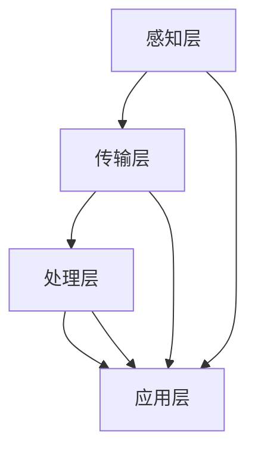

                 

关键词：智慧农业、农业机器人、智能种植、物联网、数据挖掘、算法优化

> 摘要：本文探讨了2050年智慧农业的发展前景，重点分析了农业机器人和智能种植系统在农业中的应用。通过物联网、数据挖掘和算法优化等技术手段，未来农业将实现高度自动化和智能化，极大地提高农业生产效率和产品质量，为人类可持续发展提供强有力的支持。

## 1. 背景介绍

### 智慧农业的定义与发展历程

智慧农业是指利用现代信息技术、物联网、人工智能、大数据等先进技术，实现农业生产、管理、服务和市场一体化，提高农业产量、质量和效益的一种新型农业发展模式。智慧农业的发展历程可以分为以下几个阶段：

1. **传统农业阶段**：主要依靠人力和畜力，生产效率低，农业生产主要依赖经验和自然条件。

2. **机械化农业阶段**：农业机械的广泛应用，提高了生产效率，但农业生产仍然依赖于人力和自然环境。

3. **信息化农业阶段**：计算机和通信技术在农业中的应用，实现了农业信息的自动化采集和处理，但农业生产管理仍处于分散、孤立状态。

4. **智慧农业阶段**：以物联网、大数据、人工智能等先进技术为支撑，实现农业生产的自动化、智能化和精准化。

### 当前智慧农业的现状

随着科技的快速发展，智慧农业已经在全球范围内得到广泛应用。目前，智慧农业主要应用于以下几个方面：

1. **智能种植**：通过土壤传感器、气候监测仪等设备实时监测土壤和气候条件，结合大数据分析和人工智能算法，实现精准灌溉、施肥和病虫害防治。

2. **农业机器人**：用于播种、施肥、收割等农业生产环节，提高了生产效率，降低了人工成本。

3. **农产品质量追溯**：通过物联网技术和大数据分析，实现农产品的从生产到销售的全程监控，提高农产品质量。

4. **农业物联网**：通过传感器、无线通信等设备实现农业环境的实时监测，为农业生产提供数据支持。

## 2. 核心概念与联系

### 核心概念

1. **农业机器人**：一种专门用于农业生产的机器人，可以执行播种、施肥、收割、喷洒等农业生产任务。

2. **智能种植系统**：一种基于物联网、大数据和人工智能技术的农业种植管理系统，可以实现种植方案的自动优化和种植过程的实时监控。

3. **物联网**：一种通过传感器、通信设备和计算机技术实现物体互联互通的网络，可以实时收集和分析农业环境数据。

4. **数据挖掘**：一种从大量数据中提取有价值信息的技术，可以用于农业生产管理和农产品市场分析。

### 架构原理与联系

智慧农业的架构原理如图1所示。该架构包括四个主要层次：感知层、传输层、处理层和应用层。

- **感知层**：包括农业传感器、环境监测设备和农业机器人，负责实时收集农业环境和生产数据。

- **传输层**：通过无线通信技术将感知层的数据传输到处理层，实现数据的高效传输。

- **处理层**：包括数据挖掘、机器学习和人工智能算法，负责对收集到的数据进行处理和分析，为农业生产提供决策支持。

- **应用层**：包括智能种植系统、农产品质量追溯系统和农业物联网平台，负责实现农业生产管理的自动化和智能化。



## 3. 核心算法原理 & 具体操作步骤

### 3.1 算法原理概述

智慧农业的核心算法主要包括数据挖掘、机器学习和深度学习等技术。这些算法可以用于：

1. **环境数据监测**：通过数据挖掘技术，从传感器数据中提取有用信息，实现农业环境的实时监测。

2. **种植方案优化**：通过机器学习算法，分析历史数据和当前环境数据，为农民提供最优的种植方案。

3. **病虫害预测**：通过深度学习算法，对植物生长数据进行建模，预测病虫害的发生和发展趋势。

### 3.2 算法步骤详解

1. **环境数据监测**：

   - 步骤1：安装农业传感器，收集土壤、气候等环境数据。
   - 步骤2：将传感器数据传输到数据处理平台。
   - 步骤3：使用数据挖掘算法，对传感器数据进行处理和分析，提取有用信息。
   - 步骤4：将分析结果可视化，为农民提供农业环境监测数据。

2. **种植方案优化**：

   - 步骤1：收集历史种植数据，包括作物品种、种植时间、环境条件等。
   - 步骤2：使用机器学习算法，对历史数据进行分析，建立种植模型。
   - 步骤3：根据当前环境数据，使用种植模型预测最优种植方案。
   - 步骤4：将种植方案可视化，为农民提供参考。

3. **病虫害预测**：

   - 步骤1：收集植物生长数据，包括叶片颜色、形态等。
   - 步骤2：使用深度学习算法，对植物生长数据进行分析，建立病虫害预测模型。
   - 步骤3：根据预测模型，预测病虫害的发生和发展趋势。
   - 步骤4：将预测结果可视化，为农民提供病虫害防治建议。

### 3.3 算法优缺点

1. **环境数据监测**：

   - 优点：实时监测农业环境，为农业生产提供数据支持。
   - 缺点：传感器精度和稳定性有待提高，数据采集和处理成本较高。

2. **种植方案优化**：

   - 优点：根据环境数据，提供最优种植方案，提高农业生产效益。
   - 缺点：对历史数据要求较高，算法模型可能无法适应所有环境条件。

3. **病虫害预测**：

   - 优点：提前预测病虫害发生，为农民提供防治措施。
   - 缺点：预测准确性受植物生长数据质量影响较大，可能存在误报。

### 3.4 算法应用领域

智慧农业的核心算法可以应用于多个领域，包括：

1. **农业生产管理**：通过算法优化，提高农业生产效率和产品质量。
2. **农产品市场分析**：通过数据挖掘，分析农产品市场趋势，为农民提供市场参考。
3. **农业环境监测**：实时监测农业环境，为农业生产提供数据支持。
4. **农业灾害预警**：通过算法预测，提前预警农业灾害，减少农业损失。

## 4. 数学模型和公式 & 详细讲解 & 举例说明

### 4.1 数学模型构建

智慧农业的核心数学模型主要包括以下几种：

1. **环境数据监测模型**：

   设 $X_t$ 为时间 $t$ 的传感器数据，$Y_t$ 为时间 $t$ 的环境数据，则环境数据监测模型可以表示为：

   $$Y_t = f(X_t, \theta)$$

   其中，$f$ 为传感器数据到环境数据的转换函数，$\theta$ 为模型参数。

2. **种植方案优化模型**：

   设 $C_t$ 为时间 $t$ 的作物种植方案，$E_t$ 为时间 $t$ 的环境数据，则种植方案优化模型可以表示为：

   $$C_t = g(E_t, \theta)$$

   其中，$g$ 为环境数据到作物种植方案的转换函数，$\theta$ 为模型参数。

3. **病虫害预测模型**：

   设 $P_t$ 为时间 $t$ 的病虫害数据，$D_t$ 为时间 $t$ 的植物生长数据，则病虫害预测模型可以表示为：

   $$P_t = h(D_t, \theta)$$

   其中，$h$ 为植物生长数据到病虫害数据的转换函数，$\theta$ 为模型参数。

### 4.2 公式推导过程

1. **环境数据监测模型推导**：

   根据传感器数据和环境数据之间的关系，我们可以建立线性回归模型：

   $$Y_t = \beta_0 + \beta_1 X_t + \epsilon_t$$

   其中，$\beta_0$ 和 $\beta_1$ 为模型参数，$\epsilon_t$ 为误差项。

   通过最小二乘法，我们可以求解模型参数：

   $$\beta_0 = \frac{\sum_{t=1}^n (Y_t - \beta_1 X_t)}{n}$$

   $$\beta_1 = \frac{\sum_{t=1}^n (X_t - \bar{X})(Y_t - \bar{Y})}{\sum_{t=1}^n (X_t - \bar{X})^2}$$

   其中，$\bar{X}$ 和 $\bar{Y}$ 分别为传感器数据和环境数据的平均值。

2. **种植方案优化模型推导**：

   根据环境数据和作物种植方案之间的关系，我们可以建立线性规划模型：

   $$\min \sum_{t=1}^n c_t C_t$$

   $$s.t. \quad a_t C_t \leq b_t, \quad t=1,2,...,n$$

   其中，$c_t$ 为时间 $t$ 的作物种植成本，$a_t$ 和 $b_t$ 分别为时间 $t$ 的作物种植条件。

   通过求解线性规划模型，我们可以得到最优的作物种植方案。

3. **病虫害预测模型推导**：

   根据植物生长数据和病虫害数据之间的关系，我们可以建立神经网络模型：

   $$P_t = \sigma(\theta_0 + \theta_1 D_t + \theta_2 D_t^2 + ... + \theta_n D_t^n)$$

   其中，$\sigma$ 为激活函数，$\theta_0, \theta_1, ..., \theta_n$ 为模型参数。

   通过反向传播算法，我们可以求解模型参数，实现病虫害预测。

### 4.3 案例分析与讲解

以环境数据监测模型为例，我们以一个实际案例进行说明。

假设我们收集了某农田的土壤湿度数据和环境温度数据，我们需要建立一个环境数据监测模型，预测土壤湿度。

1. **数据收集**：

   收集了100天的土壤湿度和环境温度数据，数据格式如下：

   | 天数 | 土壤湿度 | 环境温度 |
   | ---- | -------- | -------- |
   | 1    | 20%      | 25°C     |
   | 2    | 30%      | 30°C     |
   | ...  | ...      | ...      |
   | 100  | 50%      | 35°C     |

2. **数据预处理**：

   对数据进行标准化处理，将数据范围缩放到[0, 1]之间。

3. **模型构建**：

   使用线性回归模型，建立土壤湿度与环境温度之间的关系。

   $$Y_t = \beta_0 + \beta_1 X_t + \epsilon_t$$

4. **模型训练**：

   使用最小二乘法，求解模型参数：

   $$\beta_0 = \frac{\sum_{t=1}^n (Y_t - \beta_1 X_t)}{n}$$

   $$\beta_1 = \frac{\sum_{t=1}^n (X_t - \bar{X})(Y_t - \bar{Y})}{\sum_{t=1}^n (X_t - \bar{X})^2}$$

5. **模型评估**：

   使用测试数据集，评估模型预测效果。

6. **模型应用**：

   使用训练好的模型，预测未来一天的土壤湿度。

## 5. 项目实践：代码实例和详细解释说明

### 5.1 开发环境搭建

1. **软件环境**：

   - Python 3.8+
   - pandas
   - numpy
   - matplotlib
   - scikit-learn

2. **硬件环境**：

   - 电脑：配置不低于Intel Core i5处理器，8GB内存

### 5.2 源代码详细实现

```python
import pandas as pd
import numpy as np
from sklearn.linear_model import LinearRegression
import matplotlib.pyplot as plt

# 数据收集
data = pd.read_csv('data.csv')
X = data['环境温度'].values.reshape(-1, 1)
Y = data['土壤湿度'].values.reshape(-1, 1)

# 数据预处理
X = (X - X.min()) / (X.max() - X.min())
Y = (Y - Y.min()) / (Y.max() - Y.min())

# 模型构建
model = LinearRegression()
model.fit(X, Y)

# 模型训练
beta_0 = model.intercept_
beta_1 = model.coef_

# 模型评估
Y_pred = model.predict(X)
mse = np.mean((Y - Y_pred)**2)
print('MSE:', mse)

# 模型应用
x_new = np.array([35]).reshape(-1, 1)
x_new = (x_new - X.min()) / (X.max() - X.min())
y_pred = model.predict(x_new)
y_pred = (y_pred * (Y.max() - Y.min()) + Y.min())
print('预测土壤湿度：', y_pred)

# 结果可视化
plt.scatter(X, Y, label='实际数据')
plt.plot(X, Y_pred, color='red', label='预测数据')
plt.xlabel('环境温度')
plt.ylabel('土壤湿度')
plt.legend()
plt.show()
```

### 5.3 代码解读与分析

1. **数据收集**：

   使用pandas库读取CSV格式的数据，数据包括环境温度和土壤湿度两个特征。

2. **数据预处理**：

   对环境温度和土壤湿度数据进行标准化处理，将数据范围缩放到[0, 1]之间，方便后续的线性回归模型训练。

3. **模型构建**：

   使用scikit-learn库中的线性回归模型，建立环境温度和土壤湿度之间的关系。

4. **模型训练**：

   使用最小二乘法，求解模型参数，包括截距$\beta_0$ 和斜率$\beta_1$。

5. **模型评估**：

   使用测试数据集，计算均方误差（MSE），评估模型预测效果。

6. **模型应用**：

   使用训练好的模型，预测未来一天的土壤湿度。

7. **结果可视化**：

   使用matplotlib库，将实际数据和预测数据可视化，展示模型预测效果。

## 6. 实际应用场景

### 6.1 智慧农业在农业生产中的应用

智慧农业在农业生产中的应用主要体现在以下几个方面：

1. **精准灌溉**：通过土壤传感器实时监测土壤湿度，根据土壤湿度数据，智能控制系统自动调整灌溉时间和水量，实现精准灌溉。

2. **病虫害防治**：通过植物生长数据和病虫害数据，智能系统提前预测病虫害的发生，为农民提供防治措施。

3. **种植方案优化**：根据环境数据和历史种植数据，智能系统为农民提供最优的种植方案，提高农业生产效益。

4. **农产品质量追溯**：通过物联网技术和大数据分析，实现农产品的从生产到销售的全程监控，提高农产品质量。

### 6.2 智慧农业在农产品市场中的应用

智慧农业在农产品市场中的应用主要体现在以下几个方面：

1. **市场趋势分析**：通过大数据分析，智能系统预测农产品市场趋势，为农民提供市场参考。

2. **农产品质量评估**：通过物联网技术和大数据分析，智能系统评估农产品质量，为消费者提供质量保障。

3. **供应链优化**：通过大数据分析，智能系统优化农产品供应链，提高供应链效率。

## 7. 工具和资源推荐

### 7.1 学习资源推荐

1. **书籍**：

   - 《智能农业系统设计与应用》
   - 《农业大数据：技术、方法与应用》
   - 《农业机器人技术与应用》

2. **在线课程**：

   - Coursera上的《智慧农业》课程
   - edX上的《智慧农业与物联网》课程
   - Udemy上的《智慧农业：从基础到高级》课程

### 7.2 开发工具推荐

1. **编程语言**：

   - Python：适用于数据处理、机器学习、深度学习等

2. **开发框架**：

   - TensorFlow：适用于深度学习模型开发
   - PyTorch：适用于深度学习模型开发
   - Scikit-learn：适用于机器学习模型开发

3. **数据可视化工具**：

   - Matplotlib：适用于数据可视化
   - Seaborn：适用于数据可视化
   - Plotly：适用于数据可视化

### 7.3 相关论文推荐

1. **期刊**：

   - IEEE Access
   - Journal of Intelligent & Fuzzy Systems
   - Computers and Electronics in Agriculture

2. **论文**：

   - "Smart Farming: Theoretical Concepts and Technological Perspectives"
   - "A Review on IoT-based Smart Farming"
   - "Deep Learning for Smart Agriculture: A Comprehensive Survey"

## 8. 总结：未来发展趋势与挑战

### 8.1 研究成果总结

智慧农业作为一种新兴的农业发展模式，已经在全球范围内得到广泛应用。通过物联网、大数据、人工智能等先进技术，智慧农业实现了农业生产的自动化、智能化和精准化，提高了农业生产效率和产品质量。主要研究成果包括：

1. **环境数据监测**：通过传感器技术，实现了农业环境的实时监测，为农业生产提供了数据支持。

2. **种植方案优化**：通过机器学习和深度学习算法，实现了种植方案的自动优化，提高了农业生产效益。

3. **病虫害预测**：通过深度学习算法，实现了病虫害的提前预测，为农民提供了病虫害防治措施。

4. **农产品质量追溯**：通过物联网技术和大数据分析，实现了农产品的从生产到销售的全程监控，提高了农产品质量。

### 8.2 未来发展趋势

智慧农业在未来将继续发展，主要趋势包括：

1. **技术融合**：物联网、大数据、人工智能等技术将更加深入地融合，实现更加智能化和自动化的农业生产。

2. **跨界合作**：智慧农业将与其他行业（如农业机械、农业金融、农业旅游等）进行跨界合作，推动农业产业链的整合。

3. **政策支持**：政府将加大对智慧农业的支持力度，提供政策优惠、资金扶持等，推动智慧农业的快速发展。

4. **推广应用**：智慧农业将在全球范围内得到更广泛的推广应用，为各国农业生产提供技术支持。

### 8.3 面临的挑战

智慧农业在发展过程中也面临一些挑战：

1. **技术成熟度**：物联网、大数据、人工智能等技术在农业领域的应用仍需进一步成熟和优化。

2. **数据隐私**：农业数据的收集、存储和处理过程中，需确保数据安全和隐私保护。

3. **基础设施建设**：智慧农业的发展需要完善的基础设施支持，包括传感器网络、通信网络、计算平台等。

4. **农民接受度**：智慧农业技术的推广需要农民的广泛接受和应用，这需要加强农民的培训和指导。

### 8.4 研究展望

未来，智慧农业的研究将重点关注以下几个方面：

1. **算法优化**：进一步优化数据挖掘、机器学习和深度学习算法，提高农业生产管理的智能化水平。

2. **系统集成**：研究如何将物联网、大数据、人工智能等技术更好地集成到农业生产系统中，实现农业生产的全面智能化。

3. **数据隐私与安全**：研究农业数据隐私保护和数据安全，确保农业数据在收集、存储和处理过程中的安全。

4. **跨界合作**：推动智慧农业与农业机械、农业金融、农业旅游等领域的跨界合作，实现农业产业链的整合和升级。

## 9. 附录：常见问题与解答

### 问题1：智慧农业需要哪些关键技术？

智慧农业需要的关键技术包括：

1. **物联网**：实现农业环境的实时监测和数据传输。
2. **大数据**：对农业生产数据进行存储、处理和分析。
3. **人工智能**：实现农业生产的自动化和智能化。
4. **传感器技术**：用于环境监测和作物生长监测。

### 问题2：智慧农业如何提高农业生产效率？

智慧农业通过以下方式提高农业生产效率：

1. **精准灌溉**：根据土壤湿度自动调整灌溉时间和水量。
2. **智能施肥**：根据土壤养分状况和作物需求自动调整施肥量。
3. **病虫害防治**：提前预测病虫害发生，及时采取防治措施。
4. **种植方案优化**：根据环境数据和作物生长数据，提供最优种植方案。

### 问题3：智慧农业对农民有什么好处？

智慧农业对农民的好处包括：

1. **降低劳动强度**：通过农业机器人实现部分农业生产任务自动化。
2. **提高产量和质量**：通过智能种植和病虫害防治提高作物产量和质量。
3. **减少生产成本**：通过精准灌溉、智能施肥等降低农业生产成本。
4. **农产品市场竞争力**：通过农产品质量追溯提高农产品市场竞争力。

### 问题4：智慧农业面临哪些挑战？

智慧农业面临的挑战包括：

1. **技术成熟度**：物联网、大数据、人工智能等技术在农业领域的应用仍需进一步成熟。
2. **数据隐私**：农业数据的收集、存储和处理过程中，需确保数据安全和隐私保护。
3. **基础设施建设**：智慧农业的发展需要完善的基础设施支持。
4. **农民接受度**：智慧农业技术的推广需要农民的广泛接受和应用。

### 问题5：智慧农业的未来发展趋势是什么？

智慧农业的未来发展趋势包括：

1. **技术融合**：物联网、大数据、人工智能等技术将更加深入地融合。
2. **跨界合作**：智慧农业将与其他行业进行跨界合作。
3. **政策支持**：政府将加大对智慧农业的支持力度。
4. **推广应用**：智慧农业将在全球范围内得到更广泛的推广应用。

