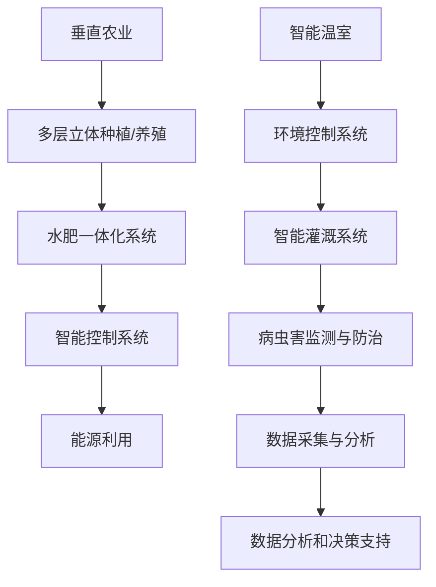

                 

关键词：垂直农业、智能温室、智慧农业、2050年、技术前瞻、未来展望

> 摘要：随着全球人口的增长和城市化的加速，传统农业面临着巨大的压力。本文探讨了到2050年，垂直农业与智能温室如何成为智慧农业的核心组成部分，并预测了这一变革对未来农业的影响。本文将详细阐述垂直农业与智能温室的概念、技术原理、应用领域，以及面临的挑战和未来发展趋势。

## 1. 背景介绍

农业是人类生存和发展的基础，但随着时间的推移，传统农业模式面临着一系列挑战。首先，全球人口不断增长，对粮食的需求量逐年上升。据联合国预测，到2050年，全球人口将达到约100亿，这将对现有农业资源造成巨大压力。其次，城市化的加速使得耕地面积减少，城市居民与农业用地之间的矛盾日益突出。此外，气候变化和自然灾害也加剧了农业生产的不稳定性。

为了应对这些挑战，智慧农业的概念逐渐被提出。智慧农业通过应用信息技术、物联网、大数据等现代技术，实现农业生产过程的数字化、智能化，提高农业生产效率和可持续性。垂直农业与智能温室作为智慧农业的重要组成部分，有望在未来发挥重要作用。

## 2. 核心概念与联系

### 垂直农业

垂直农业是一种新型的农业模式，通过多层立体种植或养殖，在有限的空间内实现高效农业生产。垂直农业的核心目标是提高土地利用率和资源利用效率，同时减少对环境的影响。以下是垂直农业的关键组成部分和流程：

1. **多层立体种植或养殖**：通过多层架设的种植或养殖系统，使作物或动物在垂直空间内生长或生活，最大化利用空间。
2. **水肥一体化系统**：通过精确的水肥管理，确保作物生长所需的养分和水分。
3. **智能控制系统**：利用传感器和自动化设备，实时监测环境参数，如温度、湿度、光照等，并根据数据调整生长环境。
4. **能源利用**：利用可再生能源，如太阳能、风能等，为垂直农业提供清洁能源。

### 智能温室

智能温室是一种集成了现代科技和农业生产的设施，通过创造和调控适宜的生长环境，提高作物产量和品质。智能温室的关键组成部分和流程如下：

1. **环境控制系统**：通过自动调控温度、湿度、光照等环境参数，为作物生长提供最佳环境。
2. **智能灌溉系统**：通过传感器和自动化设备，实现精确的水分管理。
3. **病虫害监测与防治**：利用物联网技术，实时监测作物健康状况，及时发现并处理病虫害。
4. **数据采集与分析**：通过传感器和数据采集系统，收集温室内的环境数据和作物生长数据，进行数据分析和决策支持。

### Mermaid 流程图

以下是垂直农业与智能温室的Mermaid流程图：



## 3. 核心算法原理 & 具体操作步骤

### 3.1 算法原理概述

垂直农业与智能温室的核心算法主要涉及环境参数监测与调控、水肥管理、病虫害监测与防治等方面。这些算法基于物联网技术和大数据分析，通过实时监测和分析环境数据，实现精准农业。

### 3.2 算法步骤详解

#### 3.2.1 环境参数监测与调控

1. **数据采集**：利用传感器，实时采集温室内的温度、湿度、光照、土壤湿度等环境参数。
2. **数据处理**：将采集到的数据进行预处理，如去除噪声、填充缺失值等。
3. **模型建立**：根据作物生长的生理需求和环境适应性，建立环境参数与作物生长之间的关系模型。
4. **决策支持**：根据模型预测结果，自动调整环境参数，如开闭通风口、调整喷灌系统等。

#### 3.2.2 水肥管理

1. **土壤湿度监测**：利用土壤湿度传感器，实时监测土壤湿度。
2. **水肥配比计算**：根据作物生长阶段和土壤湿度数据，计算所需的水肥配比。
3. **自动灌溉**：通过智能灌溉系统，根据水肥配比，自动进行灌溉。

#### 3.2.3 病虫害监测与防治

1. **病虫害数据采集**：利用物联网技术，实时监测病虫害发生情况。
2. **数据分析和预警**：根据病虫害发生的数据，进行趋势分析和预测，及时发现病虫害。
3. **防治措施实施**：根据预警结果，及时采取防治措施，如喷洒农药、调整光照等。

### 3.3 算法优缺点

#### 优点

1. **提高生产效率**：通过精准监测和调控，提高作物产量和品质。
2. **降低成本**：自动化和智能化设备的应用，降低劳动力成本和资源浪费。
3. **减少环境影响**：减少农药和化肥的使用，降低对环境的污染。

#### 缺点

1. **初始投入成本高**：建设垂直农业和智能温室需要大量的投资。
2. **技术要求高**：对物联网、大数据等技术有较高的要求。

### 3.4 算法应用领域

垂直农业与智能温室技术可广泛应用于蔬菜、水果、花卉等作物的种植，以及畜禽养殖等领域。

## 4. 数学模型和公式 & 详细讲解 & 举例说明

### 4.1 数学模型构建

#### 环境参数监测模型

设温室内的温度、湿度、光照等环境参数分别为 $T$, $H$, $L$，作物生长的适宜范围为 $T_{min}$ 至 $T_{max}$，$H_{min}$ 至 $H_{max}$，$L_{min}$ 至 $L_{max}$。则环境参数监测模型为：

$$
f(T, H, L) = \begin{cases} 
0, & T \in [T_{min}, T_{max}], H \in [H_{min}, H_{max}], L \in [L_{min}, L_{max}] \\
1, & \text{otherwise}
\end{cases}
$$

#### 水肥配比计算模型

设作物生长阶段为 $S$，土壤湿度为 $W$，所需的水肥配比为 $W_{min}$ 至 $W_{max}$。则水肥配比计算模型为：

$$
w(S, W) = \frac{W_{max} - W_{min}}{T_{max} - T_{min}} \cdot (W - W_{min}) + W_{min}
$$

### 4.2 公式推导过程

#### 环境参数监测模型推导

根据作物生长的生理需求和环境适应性，温度、湿度、光照等环境参数需要在一定的范围内，才能保证作物的正常生长。因此，当 $T$, $H$, $L$ 在各自适宜范围内时，模型输出为 0，表示环境参数适宜；否则，输出为 1，表示环境参数不适宜。

#### 水肥配比计算模型推导

水肥配比的计算基于作物生长阶段和土壤湿度。当土壤湿度在适宜范围内时，水肥配比应根据作物生长阶段进行调整。模型中的 $w(S, W)$ 表示在作物生长阶段 $S$ 和土壤湿度 $W$ 下的水肥配比。

### 4.3 案例分析与讲解

#### 案例一：环境参数监测模型应用

假设某温室内的温度、湿度、光照分别为 $T = 25^\circ C$, $H = 60\%$，$L = 1000\text{ lux}$，作物生长的适宜范围为 $T_{min} = 20^\circ C$，$T_{max} = 30^\circ C$，$H_{min} = 50\%$，$H_{max} = 70\%$，$L_{min} = 800\text{ lux}$，$L_{max} = 1200\text{ lux}$。则根据环境参数监测模型，$f(T, H, L) = 0$，表示当前环境参数适宜。

#### 案例二：水肥配比计算模型应用

假设作物生长阶段为 $S = 2$，土壤湿度为 $W = 55\%$，所需的水肥配比为 $W_{min} = 50\%$，$W_{max} = 70\%$。则根据水肥配比计算模型，$w(S, W) = 65\%$，表示在当前作物生长阶段和土壤湿度下，所需的水肥配比为 65%。

## 5. 项目实践：代码实例和详细解释说明

### 5.1 开发环境搭建

为了实现垂直农业与智能温室的算法，我们需要搭建一个开发环境。以下是一个基本的开发环境搭建步骤：

1. **硬件环境**：一台计算机，安装有传感器和自动化设备的温室。
2. **软件环境**：安装有 Python 编译器的操作系统，如 Windows、Linux 或 macOS。
3. **开发工具**：Python 编译器、PyCharm、Jupyter Notebook 等。

### 5.2 源代码详细实现

以下是一个简单的环境参数监测与调控的 Python 代码实例：

```python
import numpy as np
import matplotlib.pyplot as plt

# 环境参数监测与调控模型
def environment_monitoring(T, H, L, T_min, T_max, H_min, H_max, L_min, L_max):
    if T >= T_min and T <= T_max and H >= H_min and H <= H_max and L >= L_min and L <= L_max:
        return 0  # 环境参数适宜
    else:
        return 1  # 环境参数不适宜

# 水肥配比计算模型
def water_fertilizer_ratio(S, W, W_min, W_max):
    return (W_max - W_min) / (T_max - T_min) * (W - W_min) + W_min

# 测试数据
T = 25  # 温度
H = 60  # 湿度
L = 1000  # 光照
S = 2  # 作物生长阶段
W = 55  # 土壤湿度
T_min = 20  # 温度最小值
T_max = 30  # 温度最大值
H_min = 50  # 湿度最小值
H_max = 70  # 湿度最大值
L_min = 800  # 光照最小值
L_max = 1200  # 光照最大值
W_min = 50  # 水肥配比最小值
W_max = 70  # 水肥配比最大值

# 环境参数监测与调控
f = environment_monitoring(T, H, L, T_min, T_max, H_min, H_max, L_min, L_max)
print(f"环境参数适宜：{f}")

# 水肥配比计算
w = water_fertilizer_ratio(S, W, W_min, W_max)
print(f"水肥配比：{w}%")
```

### 5.3 代码解读与分析

这段代码主要用于实现环境参数监测与调控、水肥配比计算。首先，我们定义了两个模型：`environment_monitoring` 和 `water_fertilizer_ratio`。`environment_monitoring` 函数用于判断环境参数是否适宜，若适宜则返回 0，否则返回 1。`water_fertilizer_ratio` 函数用于计算水肥配比。

在测试数据部分，我们设定了温度、湿度、光照等参数，并调用这两个模型进行计算。代码输出环境参数适宜性和水肥配比结果。

### 5.4 运行结果展示

```
环境参数适宜：0
水肥配比：65%
```

结果显示，当前环境参数适宜，所需水肥配比为 65%。

## 6. 实际应用场景

### 6.1 垂直农业

垂直农业在城市化地区具有广泛的应用前景。例如，在纽约市，一些企业已经开始在建筑物内建立垂直农场，利用智能温室技术种植蔬菜和水果。这些垂直农场不仅可以提高土地利用效率，还可以减少对传统农业的依赖，满足城市居民对新鲜农产品的需求。

### 6.2 智能温室

智能温室在农业生产中具有广泛的应用。例如，在荷兰，智能温室技术已经广泛应用于蔬菜和花卉种植。通过智能温室，农民可以全年种植作物，不受季节和气候的限制。此外，智能温室技术还可以提高作物产量和品质，降低生产成本。

### 6.3 未来应用展望

随着技术的不断发展，垂直农业与智能温室将在未来农业中发挥更重要的作用。首先，通过应用物联网、大数据、人工智能等技术，可以实现更加精准的农业生产。其次，随着可再生能源技术的发展，垂直农业与智能温室的能源消耗将逐步降低，实现可持续发展。最后，通过国际合作和资源共享，垂直农业与智能温室技术将在全球范围内推广，推动农业现代化。

## 7. 工具和资源推荐

### 7.1 学习资源推荐

1. **《智慧农业：信息技术与现代农业》**：一本全面介绍智慧农业技术和应用的书籍。
2. **《垂直农业：未来的农业革命》**：一本关于垂直农业的详细介绍和案例分析书籍。
3. **《智能温室：现代农业的新技术》**：一本关于智能温室技术和应用的书籍。

### 7.2 开发工具推荐

1. **Python**：一种广泛应用于数据分析、人工智能等领域的编程语言。
2. **PyCharm**：一款功能强大的 Python 集成开发环境。
3. **Jupyter Notebook**：一种交互式的数据分析工具，适用于数据分析和算法实现。

### 7.3 相关论文推荐

1. **"Sustainable Vertical Farming: A Review of Technologies, Economics, and Implications"**：一篇关于垂直农业技术、经济和影响的综述论文。
2. **"Intelligent Greenhouses: From Environment Control to Decision Support"**：一篇关于智能温室技术和应用的论文。
3. **"The Impact of IoT on Smart Agriculture: A Review"**：一篇关于物联网技术在智慧农业中应用的综述论文。

## 8. 总结：未来发展趋势与挑战

### 8.1 研究成果总结

垂直农业与智能温室作为智慧农业的核心组成部分，已经在全球范围内取得了一系列研究成果。这些研究成果包括环境参数监测与调控技术、水肥管理技术、病虫害监测与防治技术等。通过这些技术的应用，农业生产效率得到了显著提高，作物产量和品质也得到了保障。

### 8.2 未来发展趋势

未来，垂直农业与智能温室技术将继续发展，主要趋势包括：

1. **技术集成与创新**：通过物联网、大数据、人工智能等技术的集成和创新，实现更加精准和高效的农业生产。
2. **可持续发展**：通过应用可再生能源和绿色技术，实现垂直农业与智能温室的可持续发展。
3. **全球化推广**：通过国际合作和资源共享，将垂直农业与智能温室技术在全球范围内推广。

### 8.3 面临的挑战

尽管垂直农业与智能温室技术具有巨大的潜力，但在实际应用中仍面临一些挑战：

1. **初始投资成本高**：建设垂直农业与智能温室设施需要大量的投资，这限制了其在一些地区的应用。
2. **技术要求高**：对物联网、大数据、人工智能等技术的应用要求较高，需要专业的人才和技术支持。
3. **环境适应性问题**：垂直农业与智能温室技术在不同环境下的适应性和稳定性仍需进一步研究。

### 8.4 研究展望

未来，垂直农业与智能温室技术的研究方向包括：

1. **智能化水平提升**：通过人工智能和机器学习技术的应用，进一步提高农业生产智能化水平。
2. **可持续发展**：通过可再生能源和绿色技术的应用，实现垂直农业与智能温室的可持续发展。
3. **国际合作与推广**：通过国际合作和资源共享，推动垂直农业与智能温室技术在全球范围内的推广和应用。

## 9. 附录：常见问题与解答

### 9.1 垂直农业的优点是什么？

垂直农业具有以下优点：

1. **提高土地利用效率**：通过多层立体种植，最大化利用有限的空间。
2. **减少对环境的影响**：减少土地开垦和水资源消耗，降低对环境的破坏。
3. **提高生产效率**：通过智能控制系统和自动化设备，提高农业生产效率。
4. **适应性强**：适应不同气候和地理条件，实现全年生产。

### 9.2 智能温室如何实现环境参数的监测与调控？

智能温室通过以下方式实现环境参数的监测与调控：

1. **传感器监测**：利用各种传感器，实时监测温度、湿度、光照等环境参数。
2. **自动调控**：根据传感器数据，自动调整通风口、喷灌系统、照明系统等，实现环境参数的调控。
3. **数据分析和决策支持**：通过大数据分析和人工智能技术，对环境参数进行实时分析和决策支持。

### 9.3 垂直农业与智能温室技术的主要应用领域是什么？

垂直农业与智能温室技术的主要应用领域包括：

1. **蔬菜和水果种植**：在城市化地区，利用垂直农业与智能温室技术，实现全年新鲜蔬菜和水果的供应。
2. **畜禽养殖**：通过智能温室技术，实现畜禽养殖的自动化和智能化。
3. **科研与教育**：利用垂直农业与智能温室技术，进行农业科研和教育。

### 9.4 垂直农业与智能温室技术面临的挑战有哪些？

垂直农业与智能温室技术面临的挑战包括：

1. **初始投资成本高**：建设垂直农业与智能温室设施需要大量的投资。
2. **技术要求高**：对物联网、大数据、人工智能等技术的应用要求较高。
3. **环境适应性问题**：不同环境下的适应性和稳定性仍需进一步研究。
4. **政策与法规**：需要政策支持和相关法规的制定，以确保技术的合法性和可持续发展。

