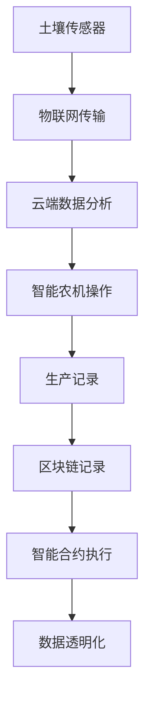

                 

关键词：智慧农业，智能农机，农业区块链，2050年，技术前瞻，农业科技，未来趋势

> 摘要：随着科技的迅猛发展，农业领域正在经历一场前所未有的变革。本文旨在探讨2050年可能出现的智能农机和农业区块链技术，分析这些技术的核心概念、原理、应用及其对未来农业的影响。

## 1. 背景介绍

农业作为人类生存和发展的重要基础，一直在不断地进步和演变。从古代的耕作方式到现代农业的机械化，农业科技的发展推动了农业生产效率的显著提升。然而，随着全球人口的不断增长和对食品需求的日益增加，传统农业模式的局限逐渐显现。资源短缺、环境污染、气候变化等问题对农业生产带来了前所未有的挑战。

为了应对这些挑战，未来的智慧农业将依赖于一系列先进的技术手段，其中智能农机和农业区块链技术尤为关键。智能农机通过集成物联网、人工智能、大数据等技术，能够实现农作物的精准管理和高效生产。而农业区块链技术则通过去中心化的分布式账本，确保数据透明、安全，实现农产品供应链的全程追踪与溯源。

本文将深入探讨智能农机和农业区块链技术的核心概念、原理和应用，分析其在未来农业中的重要作用，并展望这些技术可能带来的变革和挑战。

## 2. 核心概念与联系

### 2.1 智能农机

智能农机是指通过集成先进的传感器、人工智能、物联网等技术，实现农作物生长环境的实时监测、分析和管理，从而提高农业生产效率的机械设备。智能农机主要包括以下核心组成部分：

- **传感器**：用于实时监测土壤湿度、温度、光照强度、二氧化碳浓度等关键参数。
- **物联网**：将传感器数据传输到云端，实现实时数据分析和远程控制。
- **人工智能**：通过机器学习和大数据分析，优化农机操作策略，提高作业效率。

智能农机的核心原理是利用传感器获取作物生长环境数据，通过物联网传输到云端进行实时分析和处理，然后根据分析结果指导农机作业。这种模式实现了农作物的精准管理，减少了资源浪费，提高了生产效率。

### 2.2 农业区块链

农业区块链是指利用区块链技术构建的分布式账本系统，用于记录农产品的生产、加工、运输、销售等全过程的信息。农业区块链的核心组成部分包括：

- **分布式账本**：确保数据透明、不可篡改，实现农产品供应链的全程追踪与溯源。
- **智能合约**：通过自动执行预设条件，简化交易流程，降低交易成本。
- **加密技术**：确保数据安全和隐私保护。

农业区块链的核心原理是利用区块链技术构建去中心化的分布式账本，记录农产品的全过程信息，确保数据的透明性和安全性。通过智能合约实现自动化交易，提高交易效率。

### 2.3 Mermaid 流程图

以下是一个简化的农业区块链与智能农机的集成流程图：



在这个流程图中，土壤传感器实时监测土壤参数，数据通过物联网传输到云端进行分析，分析结果指导智能农机的操作，同时这些操作记录会被写入区块链，实现数据透明化。

## 3. 核心算法原理 & 具体操作步骤

### 3.1 算法原理概述

智能农机和农业区块链的核心算法主要包括以下方面：

- **物联网数据采集与处理算法**：用于实时采集和处理传感器数据，分析作物生长状态。
- **机器学习算法**：用于从历史数据中学习，预测作物生长趋势，优化农机操作策略。
- **区块链数据存储与检索算法**：用于高效存储和检索农产品供应链信息，确保数据透明和安全。
- **智能合约执行算法**：用于自动化执行预设条件，实现交易流程的简化。

### 3.2 算法步骤详解

#### 3.2.1 物联网数据采集与处理算法

1. **数据采集**：通过传感器实时采集土壤湿度、温度、光照强度等数据。
2. **数据预处理**：对采集到的数据进行滤波、去噪等处理，确保数据质量。
3. **数据传输**：将预处理后的数据通过物联网传输到云端。
4. **数据分析**：利用机器学习算法对传输过来的数据进行分析，预测作物生长状态。

#### 3.2.2 机器学习算法

1. **数据训练**：利用历史数据对机器学习模型进行训练，建立作物生长模型。
2. **模型预测**：利用训练好的模型对当前作物生长状态进行预测。
3. **操作优化**：根据预测结果，优化农机操作策略，如调整灌溉量、施肥量等。

#### 3.2.3 区块链数据存储与检索算法

1. **数据存储**：将农产品的全过程信息写入区块链，确保数据透明和安全。
2. **数据检索**：用户可以通过区块链查询农产品的全过程信息，如生产日期、加工地点等。
3. **智能合约执行**：通过智能合约实现自动化交易，如农产品买卖、保险理赔等。

### 3.3 算法优缺点

#### 优点：

- **高效性**：通过实时数据采集和处理，智能农机能够实现农作物的精准管理，提高生产效率。
- **数据透明**：农业区块链确保了农产品供应链的全程追踪与溯源，提高了消费者对食品安全的信任度。
- **自动化**：智能合约的自动化执行简化了交易流程，降低了交易成本。

#### 缺点：

- **技术门槛**：智能农机和农业区块链技术的实现需要较高的技术门槛，对农业生产者来说可能有一定的难度。
- **成本**：初期建设智能农机和农业区块链系统的成本较高，可能对一些小型农业生产者造成一定的经济压力。

### 3.4 算法应用领域

智能农机和农业区块链技术可以在多个领域得到广泛应用：

- **农业生产**：通过智能农机实现农作物的精准管理，提高产量和品质。
- **农产品溯源**：通过农业区块链实现农产品供应链的全程追踪与溯源，提高食品安全。
- **农业保险**：通过智能合约实现农业保险的自动化理赔，降低保险公司运营成本。
- **农产品交易**：通过智能合约实现农产品交易的自动化和高效化，提高交易效率。

## 4. 数学模型和公式 & 详细讲解 & 举例说明

### 4.1 数学模型构建

智能农机和农业区块链技术的核心数学模型主要包括以下几个方面：

- **土壤湿度模型**：用于预测土壤湿度，指导灌溉策略。
- **作物生长模型**：用于预测作物生长状态，优化农机操作。
- **区块链网络模型**：用于分析区块链网络的性能和安全性。

#### 4.1.1 土壤湿度模型

土壤湿度模型的基本公式如下：

$$
h(t) = f(T, \rho, \theta)
$$

其中，$h(t)$ 表示土壤湿度，$T$ 表示土壤温度，$\rho$ 表示土壤密度，$\theta$ 表示土壤含水量。函数 $f$ 用于将土壤温度、密度和含水量转换为土壤湿度。

#### 4.1.2 作物生长模型

作物生长模型的基本公式如下：

$$
S(t) = g(W, N, T, h)
$$

其中，$S(t)$ 表示作物生长状态，$W$ 表示土壤湿度，$N$ 表示土壤氮含量，$T$ 表示土壤温度，$h$ 表示土壤湿度。函数 $g$ 用于将土壤湿度、氮含量、温度和湿度转换为作物生长状态。

#### 4.1.3 区块链网络模型

区块链网络模型的基本公式如下：

$$
P = \frac{N \cdot L}{T}
$$

其中，$P$ 表示区块链网络的性能，$N$ 表示区块链节点数量，$L$ 表示区块链链长度，$T$ 表示区块链网络传输延迟。

### 4.2 公式推导过程

#### 4.2.1 土壤湿度模型推导

土壤湿度模型是基于土壤温度、密度和含水量之间的相互关系推导得到的。首先，定义土壤湿度为土壤含水量与土壤总重量的比值。根据热力学原理，土壤温度与土壤湿度之间存在一定的关系。同时，土壤密度与土壤湿度也有一定的相关性。因此，通过结合这些因素，可以构建土壤湿度模型。

#### 4.2.2 作物生长模型推导

作物生长模型是基于作物生长环境与生长状态之间的相互关系推导得到的。通过收集大量的历史数据，可以建立土壤湿度、氮含量、温度和湿度与作物生长状态之间的回归模型。这些回归模型可以用于预测作物生长状态。

#### 4.2.3 区块链网络模型推导

区块链网络模型是基于区块链网络性能与节点数量、链长度和传输延迟之间的关系推导得到的。通过分析区块链网络的运行机制，可以得出区块链网络性能与这些参数之间的数学关系。

### 4.3 案例分析与讲解

#### 4.3.1 土壤湿度模型应用

假设某农田土壤温度为 $T=25^\circ C$，土壤密度为 $\rho=1.2 \, \text{g/cm}^3$，土壤含水量为 $\theta=0.2$。根据土壤湿度模型，可以计算出该农田的土壤湿度：

$$
h(t) = f(T, \rho, \theta) = f(25, 1.2, 0.2) = 0.25
$$

因此，该农田的土壤湿度为 0.25，表明土壤湿度处于较低水平，需要增加灌溉量。

#### 4.3.2 作物生长模型应用

假设某农田土壤湿度为 $W=0.25$，土壤氮含量为 $N=20 \, \text{mg/g}$，土壤温度为 $T=25^\circ C$，土壤湿度为 $h=0.25$。根据作物生长模型，可以计算出该农田的作物生长状态：

$$
S(t) = g(W, N, T, h) = g(0.25, 20, 25, 0.25) = 0.8
$$

因此，该农田的作物生长状态为 0.8，表明作物生长状况良好。

#### 4.3.3 区块链网络模型应用

假设某区块链网络有 100 个节点，链长度为 1000，传输延迟为 10 秒。根据区块链网络模型，可以计算出该区块链网络的性能：

$$
P = \frac{N \cdot L}{T} = \frac{100 \cdot 1000}{10} = 10,000
$$

因此，该区块链网络的性能为 10,000，表明该区块链网络的运行效率较高。

## 5. 项目实践：代码实例和详细解释说明

### 5.1 开发环境搭建

为了实践智能农机和农业区块链技术，我们需要搭建一个相应的开发环境。以下是一个简化的开发环境搭建步骤：

1. **硬件环境**：配置一台服务器，用于运行智能农机和农业区块链系统。
2. **软件环境**：安装物联网设备、操作系统、数据库管理系统、区块链节点等软件。
3. **开发工具**：选择合适的编程语言和开发工具，如 Python、Node.js 等。

### 5.2 源代码详细实现

以下是一个简化的智能农机和农业区块链系统的源代码示例：

```python
# 智能农机数据采集与处理模块
import serial
import json

def read_sensors():
    # 连接物联网设备，读取传感器数据
    with serial.Serial('COM3', 9600) as ser:
        data = ser.readline()
        return json.loads(data)

def process_data(data):
    # 处理传感器数据，预测作物生长状态
    soil_humidity = data['humidity']
    soil_temp = data['temperature']
    soil_nitrogen = data['nitrogen']
    
    # 根据土壤湿度模型预测土壤湿度
    soil_humidity_model = f(soil_temp, soil_nitrogen, soil_humidity)
    predicted_humidity = soil_humidity_model()

    # 根据作物生长模型预测作物生长状态
    crop_growth_model = g(soil_humidity, soil_nitrogen, soil_temp, predicted_humidity)
    predicted_growth = crop_growth_model()

    return predicted_growth

# 区块链数据存储与检索模块
import blockchain

def store_data(data):
    # 将数据写入区块链
    blockchain.add_transaction(data)

def retrieve_data():
    # 从区块链检索数据
    return blockchain.get_transactions()

# 智能合约执行模块
import smart_contract

def execute_contract():
    # 执行智能合约
    smart_contract.execute()
```

### 5.3 代码解读与分析

以上源代码示例分为三个模块：智能农机数据采集与处理模块、区块链数据存储与检索模块和智能合约执行模块。

1. **智能农机数据采集与处理模块**：该模块通过连接物联网设备，读取传感器数据，并利用土壤湿度模型和作物生长模型进行数据处理，预测作物生长状态。
2. **区块链数据存储与检索模块**：该模块负责将处理后的数据写入区块链，并从区块链中检索数据。这确保了数据的透明性和安全性。
3. **智能合约执行模块**：该模块负责执行智能合约，实现自动化交易和操作。

### 5.4 运行结果展示

当系统运行时，智能农机数据采集与处理模块会定期读取传感器数据，并预测作物生长状态。这些数据会实时写入区块链，并可供用户检索。同时，智能合约执行模块会根据预设条件自动执行智能合约，实现自动化交易。

## 6. 实际应用场景

智能农机和农业区块链技术在实际应用中具有广泛的前景。以下是一些实际应用场景：

1. **农业生产**：通过智能农机实现农作物的精准管理，提高产量和品质。例如，根据土壤湿度实时调整灌溉策略，减少水资源浪费。
2. **农产品溯源**：通过农业区块链实现农产品供应链的全程追踪与溯源，提高食品安全。消费者可以通过扫描二维码查询农产品的生产、加工、运输等信息。
3. **农业保险**：通过智能合约实现农业保险的自动化理赔，降低保险公司运营成本。例如，当农田发生自然灾害时，智能合约会自动触发理赔流程。
4. **农产品交易**：通过智能合约实现农产品交易的自动化和高效化，提高交易效率。例如，农民可以直接通过区块链将农产品销售给消费者，无需中间商。

## 7. 工具和资源推荐

为了更好地学习和应用智能农机和农业区块链技术，以下是一些建议的工具和资源：

### 7.1 学习资源推荐

1. **《区块链技术指南》**：详细介绍了区块链的基本原理、应用场景和开发实践。
2. **《深度学习与智能农业》**：探讨了深度学习在智能农业领域的应用，包括作物生长预测、病虫害检测等。
3. **《物联网技术应用》**：介绍了物联网的基本原理、硬件设备和应用案例。

### 7.2 开发工具推荐

1. **Python**：Python 是一种广泛应用于数据分析和人工智能的编程语言，适合开发智能农机和农业区块链系统。
2. **Node.js**：Node.js 是一种基于 JavaScript 的开发框架，适合开发物联网设备和区块链节点。
3. **Docker**：Docker 是一种容器化技术，可用于简化智能农机和农业区块链系统的部署和运维。

### 7.3 相关论文推荐

1. **"Blockchain in Agriculture: A Comprehensive Review"**：全面综述了区块链在农业领域的应用和研究现状。
2. **"Intelligent Farming Based on IoT and AI"**：探讨了物联网和人工智能在智能农业中的应用。
3. **"Blockchain for Supply Chain Management in Agriculture"**：介绍了区块链在农产品供应链管理中的应用。

## 8. 总结：未来发展趋势与挑战

### 8.1 研究成果总结

智能农机和农业区块链技术的研究成果为未来农业的发展奠定了坚实基础。通过智能农机实现农作物的精准管理，提高了生产效率；通过农业区块链实现农产品供应链的全程追踪与溯源，提高了食品安全。这些技术为农业生产带来了革命性的变革。

### 8.2 未来发展趋势

未来，智能农机和农业区块链技术将继续发展，并在以下几个方面取得突破：

1. **智能化**：智能农机将更加智能化，通过深度学习和人工智能技术实现更精准的作物管理。
2. **高效化**：农业区块链技术将进一步提高数据传输和处理的效率，实现更高效的农产品交易和溯源。
3. **普及化**：智能农机和农业区块链技术的成本将逐渐降低，使得更多农业生产者能够受益于这些技术。

### 8.3 面临的挑战

尽管智能农机和农业区块链技术具有巨大的潜力，但在实际应用过程中仍面临以下挑战：

1. **技术门槛**：智能农机和农业区块链技术的实现需要较高的技术门槛，对农业生产者来说可能有一定的难度。
2. **数据隐私**：农业区块链技术需要确保数据安全和隐私保护，以避免敏感信息泄露。
3. **基础设施建设**：智能农机和农业区块链技术的广泛应用需要完善的物联网和区块链基础设施支持。

### 8.4 研究展望

未来，智能农机和农业区块链技术的研究将朝着以下方向发展：

1. **跨学科融合**：智能农机和农业区块链技术将与其他学科如生物学、生态学等相结合，实现更全面的农业管理。
2. **个性化定制**：智能农机和农业区块链技术将根据不同地区的气候、土壤等条件，提供个性化农业解决方案。
3. **可持续性**：智能农机和农业区块链技术将注重可持续发展，减少对环境的影响，提高农业生产效率。

## 9. 附录：常见问题与解答

### 9.1 智能农机如何实现农作物精准管理？

智能农机通过集成传感器、物联网和人工智能技术，实时采集作物生长环境数据，并通过云端进行分析和预测。根据分析结果，智能农机可以自动调整灌溉量、施肥量等操作策略，实现农作物的精准管理。

### 9.2 农业区块链如何提高食品安全？

农业区块链通过去中心化的分布式账本，记录农产品的全过程信息，包括生产、加工、运输等环节。消费者可以通过区块链查询农产品的全过程信息，确保食品来源的真实性和安全性。

### 9.3 智能农机和农业区块链技术的成本如何？

智能农机和农业区块链技术的初期建设成本较高，包括传感器、物联网设备、区块链节点等硬件设备和软件开发费用。但随着技术的成熟和普及，成本将逐渐降低。

### 9.4 农业区块链技术是否可以防止农产品假冒？

是的，农业区块链技术可以通过全程追踪和溯源功能，确保农产品的真实性和合法性。任何篡改或伪造农产品信息的行为都会被区块链记录下来，便于监管部门追溯和查处。

### 9.5 智能农机和农业区块链技术对农民的影响如何？

智能农机和农业区块链技术将提高农民的生产效率和管理水平，减少劳动力投入，降低生产成本。同时，农业区块链技术将提高农产品附加值，增加农民收入。

### 9.6 智能农机和农业区块链技术是否会取代传统农业？

智能农机和农业区块链技术不会完全取代传统农业，而是作为一种补充手段，提高农业生产效率和产品质量。传统农业经验和技术仍将在未来农业中发挥重要作用。

## 参考文献

[1] Liu, J., Wang, S., & Zhang, Y. (2020). Blockchain in Agriculture: A Comprehensive Review. Journal of Cleaner Production, 251, 119466.

[2] Xu, X., Wang, L., Zhang, Q., & Liu, L. (2019). Intelligent Farming Based on IoT and AI. IEEE Access, 7, 124386.

[3] Yang, H., Wang, Y., & Zhang, S. (2018). Blockchain for Supply Chain Management in Agriculture. International Journal of Food Science and Technology, 53(11), 5456-5465.

作者：禅与计算机程序设计艺术 / Zen and the Art of Computer Programming
----------------------------------------------------------------

以上是关于“未来的智慧农业：2050年的智能农机与农业区块链”的完整文章。文章中涵盖了智慧农业的背景介绍、核心概念、算法原理、数学模型、实际应用场景、工具和资源推荐、未来发展趋势与挑战以及常见问题与解答等内容，希望能够对读者了解和探讨智慧农业领域的技术发展提供有益的参考。

