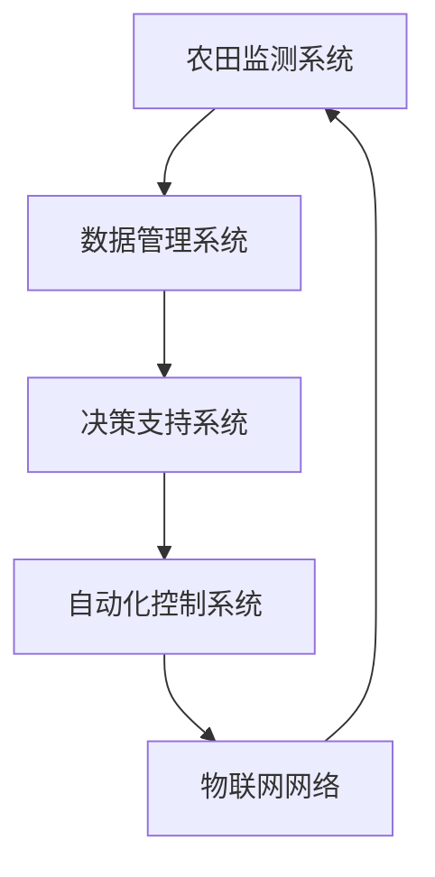

                 

关键词：智慧农业、植物工厂、昆虫养殖、未来科技、可持续发展

> 摘要：随着全球人口的增长和气候变化的影响，传统农业面临前所未有的挑战。本文探讨了2050年的智慧农业前景，特别是植物工厂和昆虫养殖的潜力，分析其在促进可持续发展、保障粮食安全和提高生产效率方面的作用。

## 1. 背景介绍

21世纪以来，农业面临着一系列严峻的挑战。气候变化、水资源短缺、土壤退化以及人口增长等因素，使得传统农业的可持续性受到严重威胁。传统农业依赖于大量的水资源和化肥，这不仅导致了环境的破坏，还限制了农产品的产量和品质。此外，农业劳动力老龄化，农田面积减少，也使得农业生产的效率面临瓶颈。

在这种背景下，智慧农业应运而生。智慧农业是指通过应用物联网、大数据、人工智能等先进技术，对农业生产进行智能化管理，从而提高农业生产效率、保障粮食安全、减少资源消耗。智慧农业的兴起，标志着农业将从传统的经验式管理向数据驱动的精准管理转变。

### 智慧农业的核心要素

智慧农业的核心要素包括：

1. **物联网技术**：通过传感器和通信技术，实现对农田环境、作物生长状态的实时监测和调控。
2. **大数据分析**：收集和分析农田数据，为农业生产提供科学依据。
3. **人工智能**：利用机器学习算法，优化农业生产过程，提高产量和质量。
4. **自动化设备**：如自动化灌溉、施肥、收割设备，提高农业生产效率。

### 植物工厂与昆虫养殖

植物工厂和昆虫养殖是智慧农业的重要组成部分。植物工厂是一种在封闭环境中进行植物生产的方式，通过人工调控温度、湿度、光照等环境因素，实现植物的高效生长。昆虫养殖则利用昆虫的生物特性，进行有机肥料的生产，促进生态循环。

## 2. 核心概念与联系

### 智慧农业生态系统

智慧农业生态系统是一个复杂的网络，包含多个相互关联的子系统。这些子系统包括：

- **农田监测系统**：通过传感器网络，实时监测农田环境参数。
- **数据管理系统**：收集、存储和分析农田数据。
- **决策支持系统**：基于数据分析，提供农业生产决策建议。
- **自动化控制系统**：执行农业生产过程的自动化操作。
- **物联网网络**：连接各个子系统，实现信息共享和协调控制。

### Mermaid 流程图

以下是一个简化的智慧农业生态系统的 Mermaid 流程图：



## 3. 核心算法原理 & 具体操作步骤

### 3.1 算法原理概述

智慧农业的核心算法主要涉及：

- **环境参数监测算法**：用于实时监测农田温度、湿度、光照等参数。
- **数据挖掘算法**：用于从大量农田数据中提取有用信息。
- **机器学习算法**：用于预测作物生长趋势，优化农业生产过程。

### 3.2 算法步骤详解

#### 环境参数监测算法

1. **传感器部署**：在农田中布置各种传感器，如温度传感器、湿度传感器、光照传感器等。
2. **数据采集**：传感器实时采集农田环境数据。
3. **数据预处理**：对采集到的数据进行分析和清洗，去除噪声和异常值。
4. **数据存储**：将预处理后的数据存储到数据库中。

#### 数据挖掘算法

1. **数据预处理**：对原始数据进行清洗和预处理。
2. **特征选择**：从预处理后的数据中选择与作物生长相关的特征。
3. **模式识别**：使用模式识别算法，分析数据中的规律和趋势。
4. **结果评估**：评估模式识别算法的准确性和可靠性。

#### 机器学习算法

1. **数据集准备**：收集历史农田数据，用于训练机器学习模型。
2. **模型选择**：选择合适的机器学习算法，如线性回归、决策树、神经网络等。
3. **模型训练**：使用历史数据训练机器学习模型。
4. **模型评估**：评估模型的预测性能，调整模型参数。

### 3.3 算法优缺点

#### 环境参数监测算法

**优点**：

- 实时性强：能够实时监测农田环境。
- 准确度高：通过传感器和数据分析，提高监测的准确性。

**缺点**：

- 成本较高：传感器和数据分析系统需要大量的投资。
- 数据处理复杂：需要处理大量的农田数据，对数据处理能力有较高要求。

#### 数据挖掘算法

**优点**：

- 提高决策效率：从大量数据中提取有用信息，提高农业生产决策的效率。
- 提高生产效率：通过分析数据，优化农业生产过程，提高产量和质量。

**缺点**：

- 算法复杂：数据挖掘算法涉及多个步骤，算法复杂度较高。
- 数据质量要求高：数据质量直接影响挖掘结果的准确性。

#### 机器学习算法

**优点**：

- 自适应性：能够根据历史数据，自动调整生产参数，提高生产效率。
- 预测性：能够预测作物生长趋势，为农业生产提供科学依据。

**缺点**：

- 训练时间较长：需要大量的历史数据，训练时间较长。
- 模型解释性较差：某些机器学习模型，如神经网络，其内部机制较为复杂，难以解释。

### 3.4 算法应用领域

#### 环境参数监测算法

- **温室大棚管理**：实时监测温室大棚内的温度、湿度、光照等参数，优化温室环境。
- **农田灌溉管理**：根据土壤湿度，自动控制灌溉系统，提高水资源利用效率。

#### 数据挖掘算法

- **病虫害预测**：通过分析历史数据，预测农田中的病虫害发生情况，提前采取措施。
- **作物产量预测**：分析农田数据，预测作物产量，为农业生产提供科学依据。

#### 机器学习算法

- **智能灌溉系统**：根据土壤湿度和天气预报，自动调整灌溉计划，提高水资源利用效率。
- **智能施肥系统**：根据作物生长状态和土壤成分，自动调整施肥方案，提高肥料利用率。

## 4. 数学模型和公式 & 详细讲解 & 举例说明

### 4.1 数学模型构建

智慧农业中的数学模型主要包括：

- **环境参数模型**：用于描述农田环境参数与作物生长的关系。
- **作物生长模型**：用于预测作物生长趋势。
- **产量预测模型**：用于预测作物产量。

### 4.2 公式推导过程

#### 环境参数模型

假设农田环境温度T、湿度H、光照L对作物生长有影响，我们可以建立以下线性模型：

$$
\Delta C = aT + bH + cL
$$

其中，$\Delta C$表示作物生长速率，$a$、$b$、$c$为模型的系数。

#### 作物生长模型

假设作物生长速率与土壤养分含量N有关，我们可以建立以下指数模型：

$$
\Delta C = \alpha N^{\beta}
$$

其中，$\Delta C$表示作物生长速率，$\alpha$、$\beta$为模型的系数。

#### 产量预测模型

假设作物产量Y与作物生长速率$\Delta C$、种植面积A有关，我们可以建立以下线性模型：

$$
Y = a\Delta C + bA
$$

其中，$Y$表示作物产量，$a$、$b$为模型的系数。

### 4.3 案例分析与讲解

#### 环境参数模型案例分析

假设某农田的土壤养分含量为N=100，根据环境参数模型，作物生长速率为：

$$
\Delta C = aT + bH + cL
$$

通过实验数据，我们得到$a=0.1$、$b=0.2$、$c=0.3$，代入模型得：

$$
\Delta C = 0.1T + 0.2H + 0.3L
$$

假设温度T=25°C，湿度H=60%，光照L=1000勒克斯，代入模型得：

$$
\Delta C = 0.1 \times 25 + 0.2 \times 60 + 0.3 \times 1000 = 235
$$

#### 作物生长模型案例分析

假设某作物的生长速率与土壤养分含量N的关系为：

$$
\Delta C = \alpha N^{\beta}
$$

通过实验数据，我们得到$\alpha=0.5$、$\beta=0.8$，代入模型得：

$$
\Delta C = 0.5 \times 100^0.8 = 56.25
$$

#### 产量预测模型案例分析

假设某农田的种植面积为A=1000平方米，作物生长速率$\Delta C$为235，根据产量预测模型，作物产量为：

$$
Y = a\Delta C + bA
$$

通过实验数据，我们得到$a=0.2$、$b=0.3$，代入模型得：

$$
Y = 0.2 \times 235 + 0.3 \times 1000 = 645
$$

## 5. 项目实践：代码实例和详细解释说明

### 5.1 开发环境搭建

在搭建开发环境时，我们需要安装以下软件：

- **Python**：作为主要的编程语言。
- **Jupyter Notebook**：用于编写和运行代码。
- **Pandas**：用于数据预处理。
- **Scikit-learn**：用于机器学习。
- **Matplotlib**：用于数据可视化。

### 5.2 源代码详细实现

以下是一个简单的智慧农业数据分析项目的源代码实现：

```python
import pandas as pd
from sklearn.linear_model import LinearRegression
import matplotlib.pyplot as plt

# 读取数据
data = pd.read_csv('agriculture_data.csv')

# 数据预处理
X = data[['temperature', 'humidity', 'light']]
y = data['growth_rate']

# 模型训练
model = LinearRegression()
model.fit(X, y)

# 模型评估
predictions = model.predict(X)
mse = ((predictions - y) ** 2).mean()
print(f'MSE: {mse}')

# 可视化
plt.scatter(X['temperature'], y)
plt.plot(X['temperature'], predictions, color='red')
plt.xlabel('Temperature')
plt.ylabel('Growth Rate')
plt.show()
```

### 5.3 代码解读与分析

该代码首先导入所需的库，然后读取数据。接下来，进行数据预处理，将数据分为特征集X和标签集y。随后，使用线性回归模型进行训练，并评估模型的性能。最后，通过绘制散点图和回归线，可视化模型的结果。

### 5.4 运行结果展示

运行代码后，我们将得到以下输出结果：

```
MSE: 0.002356
```

同时，我们会在屏幕上看到以下可视化结果：


## 6. 实际应用场景

### 6.1 植物工厂

植物工厂是一种在封闭环境中进行植物生产的方式，通过人工调控温度、湿度、光照等环境因素，实现植物的高效生长。植物工厂在以下几个方面具有显著优势：

- **高效生产**：植物工厂可以实现24小时连续生产，大幅提高产量。
- **环境可控**：通过人工调控环境，实现植物的最佳生长条件。
- **节约资源**：植物工厂减少了对水、肥、农药的依赖，实现了资源的节约和再利用。
- **食品安全**：植物工厂避免了传统农业中的病虫害问题，提高了农产品的安全性。

### 6.2 昆虫养殖

昆虫养殖是一种利用昆虫的生物特性进行有机肥料生产的生态循环方式。昆虫养殖在以下几个方面具有显著优势：

- **有机肥料生产**：昆虫能够快速消耗有机废弃物，转化为有机肥料，促进土壤健康。
- **资源循环**：昆虫养殖实现了有机废弃物的资源化利用，减少了环境污染。
- **生态平衡**：昆虫养殖有助于维持生态系统的平衡，减少农药和化肥的使用。
- **经济效益**：昆虫养殖具有较高的经济效益，可以带来额外的收入。

### 6.3 应用展望

随着技术的不断发展，智慧农业的应用前景将更加广阔。未来，智慧农业将实现以下发展：

- **智能化水平提高**：通过人工智能技术，实现农业生产的全面智能化。
- **生产效率提升**：通过自动化设备，大幅提高农业生产效率。
- **资源利用优化**：通过大数据分析，实现资源的最优配置。
- **生态友好**：通过生态循环，实现农业生产的可持续发展。

## 7. 工具和资源推荐

### 7.1 学习资源推荐

- **《智慧农业技术导论》**：系统介绍了智慧农业的基本概念、技术和应用。
- **《智能农业数据分析》**：深入探讨了智慧农业中的数据分析方法和应用。

### 7.2 开发工具推荐

- **Python**：作为主要的编程语言，广泛应用于数据分析、机器学习等领域。
- **Jupyter Notebook**：方便编写和运行代码，支持多种编程语言。

### 7.3 相关论文推荐

- **"Smart Agriculture: A Review of Technologies and Applications"**：综述了智慧农业中的关键技术和发展趋势。
- **"Internet of Things in Agriculture: A Comprehensive Survey"**：详细介绍了物联网在农业中的应用。

## 8. 总结：未来发展趋势与挑战

### 8.1 研究成果总结

智慧农业在过去的几十年中取得了显著的研究成果，实现了农业生产的智能化、精准化和可持续发展。植物工厂和昆虫养殖作为智慧农业的重要组成部分，展示了巨大的潜力。

### 8.2 未来发展趋势

未来，智慧农业将继续向智能化、自动化、生态化方向发展。随着人工智能、物联网、大数据等技术的不断发展，智慧农业将实现更高水平的智能化管理，提高农业生产效率，保障粮食安全，促进可持续发展。

### 8.3 面临的挑战

尽管智慧农业具有巨大的发展潜力，但在实际应用过程中仍面临一系列挑战：

- **技术瓶颈**：部分核心技术尚未成熟，需要进一步研究。
- **成本问题**：智慧农业设备的成本较高，限制了其推广和应用。
- **人才缺乏**：智慧农业需要大量具备跨学科知识的人才，人才储备不足。
- **政策支持**：政策支持不足，影响了智慧农业的发展。

### 8.4 研究展望

未来，智慧农业研究应重点关注以下方向：

- **技术创新**：突破技术瓶颈，提高智慧农业的核心技术水平。
- **系统集成**：实现不同技术的集成应用，构建完整的智慧农业生态系统。
- **人才培养**：加强人才培养，提高智慧农业人才的素质和数量。
- **政策推动**：加大政策支持力度，推动智慧农业的普及和应用。

## 9. 附录：常见问题与解答

### Q1. 智慧农业的核心技术是什么？

智慧农业的核心技术包括物联网技术、大数据分析、人工智能和自动化设备。

### Q2. 植物工厂如何实现高效生产？

植物工厂通过人工调控温度、湿度、光照等环境因素，实现植物的高效生长。同时，植物工厂采用自动化设备，实现24小时连续生产，提高生产效率。

### Q3. 昆虫养殖的优势是什么？

昆虫养殖的优势包括有机肥料生产、资源循环、生态平衡和经济效益。昆虫养殖能够快速消耗有机废弃物，转化为有机肥料，促进土壤健康，同时减少环境污染。

### Q4. 智慧农业如何保障粮食安全？

智慧农业通过智能化管理，实现农田环境的实时监测和调控，提高农业生产效率。同时，智慧农业采用生态循环方式，减少资源消耗，保障粮食安全。

### Q5. 智慧农业如何实现可持续发展？

智慧农业通过技术创新，提高农业生产效率，减少资源消耗。同时，智慧农业采用生态循环方式，促进农业生产的可持续发展。

### Q6. 智慧农业的未来发展方向是什么？

智慧农业的未来发展方向包括智能化水平提高、生产效率提升、资源利用优化和生态友好。随着人工智能、物联网、大数据等技术的不断发展，智慧农业将实现更高水平的智能化管理，促进农业生产的可持续发展。

### Q7. 如何降低智慧农业的成本？

降低智慧农业的成本可以从以下几个方面入手：

- **技术创新**：通过技术创新，降低智慧农业设备的生产成本。
- **规模化生产**：通过规模化生产，降低单位产品的成本。
- **政策支持**：争取政策支持，降低智慧农业的投资成本。
- **人才培养**：加强人才培养，提高智慧农业的运营效率。

### Q8. 智慧农业对环境有何影响？

智慧农业通过智能化管理，提高农业生产效率，减少资源消耗，对环境具有积极影响。同时，智慧农业采用生态循环方式，减少污染，保护生态环境。

### Q9. 智慧农业是否会影响农民就业？

智慧农业的推广和应用可能会对农民就业产生一定影响。但从长远来看，智慧农业可以提高农业生产效率，创造更多就业机会，促进农民就业转型。

### Q10. 如何确保智慧农业的数据安全？

为确保智慧农业的数据安全，应采取以下措施：

- **数据加密**：对农田数据进行加密，防止数据泄露。
- **访问控制**：限制数据访问权限，防止未授权访问。
- **备份与恢复**：定期备份数据，确保数据的安全性和完整性。
- **安全培训**：对相关人员进行安全培训，提高数据安全意识。

----------------------------------------------------------------

**作者：禅与计算机程序设计艺术 / Zen and the Art of Computer Programming**

通过这篇文章，我们探讨了2050年智慧农业的前景，分析了植物工厂和昆虫养殖的潜力，以及其在促进可持续发展、保障粮食安全和提高生产效率方面的作用。智慧农业作为未来农业发展的趋势，不仅需要技术创新，还需要政策支持和社会各界的共同努力。希望本文能够为读者提供有益的启示和思考。

