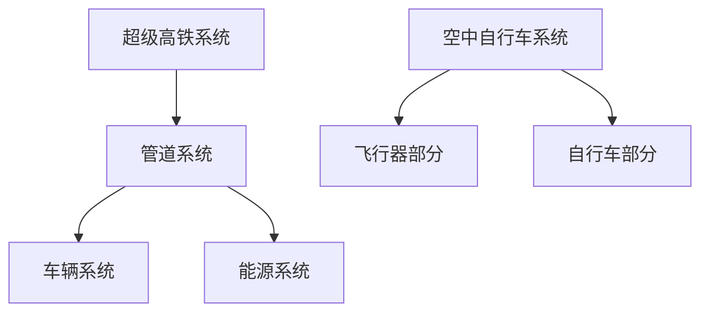

                 

关键词：智慧出行、超级高铁、空中自行车、立体交通、2050年、交通出行、未来技术

> 摘要：本文将探讨2050年的智慧出行模式，重点关注超级高铁和空中自行车的应用。通过分析这些新兴交通方式的原理、技术挑战和未来展望，我们旨在为读者展示一个多维度、高效、环保的交通出行新时代。

## 1. 背景介绍

在现代社会，随着城市化进程的加速和人口密度的不断上升，传统交通模式面临着严重的拥堵和污染问题。为了应对这些挑战，全球各地都在积极探索新的交通解决方案。从超级高铁到空中自行车，这些创新交通方式代表了未来智慧出行的方向。

超级高铁，也被称为真空管道列车，利用真空环境减少空气阻力，达到极高的速度。而空中自行车则是一种结合了电动自行车和垂直起降飞行器特性的新型交通工具。这些技术不仅有望解决地面交通的拥堵问题，还能大幅减少交通排放，实现绿色出行。

## 2. 核心概念与联系

### 2.1 超级高铁

超级高铁的核心概念是利用真空管道运输乘客。以下是超级高铁的基本原理和架构：

#### 基本原理

- **真空管道**：通过抽真空的方式减少管道内的空气阻力，从而降低列车运行时的能量消耗。
- **电磁驱动**：利用电磁力推动列车，实现高速运行。
- **车辆设计**：超级高铁车辆通常采用流线型设计，以进一步减少空气阻力。

#### 架构

- **管道系统**：包括轨道、真空泵、压缩机和传感器。
- **车辆系统**：包括驱动系统、控制系统和乘客舱。
- **能源系统**：通常使用可再生能源，如太阳能和风能。

### 2.2 空中自行车

空中自行车则是一种结合了电动自行车和飞行器的交通工具，其核心概念如下：

#### 基本原理

- **电动驱动**：使用电池或燃料电池提供动力，实现无污染的地面行驶。
- **垂直起降**：通过小型电动螺旋桨实现垂直起降，无需占用大量地面空间。

#### 架构

- **飞行器部分**：包括电动螺旋桨、飞控系统和电池或燃料电池。
- **自行车部分**：包括电动自行车框架、座椅和操作控制。

### 2.3 Mermaid 流程图

以下是一个简化的Mermaid流程图，展示了超级高铁和空中自行车的基本架构和组件：



## 3. 核心算法原理 & 具体操作步骤

### 3.1 算法原理概述

超级高铁和空中自行车的核心算法主要涉及轨道控制、飞行控制、能源管理和路径规划。

#### 轨道控制

- **定位与追踪**：通过传感器实时监测车辆位置，确保车辆在预定轨道上运行。
- **速度控制**：根据运行状态和预定速度调整电磁驱动系统的输出功率。

#### 飞行控制

- **姿态控制**：通过飞控系统调整螺旋桨的转速，实现车辆的上升、下降、转弯等动作。
- **导航与避障**：利用GPS和传感器实现精准导航，同时识别和避开障碍物。

#### 能源管理

- **能量采集**：利用太阳能或风能等可再生能源为系统供电。
- **能量分配**：根据车辆运行状态和负载需求，合理分配能源。

#### 路径规划

- **最短路径**：基于起点和终点，计算最优行驶路径。
- **动态调整**：实时监测交通状况，动态调整路径规划。

### 3.2 算法步骤详解

#### 超级高铁

1. **启动**：乘客进入超级高铁车辆，车辆开始加电。
2. **定位**：传感器实时监测车辆位置，确保在预定轨道上运行。
3. **速度控制**：根据预定速度和当前运行状态调整电磁驱动系统。
4. **运行**：车辆在真空管道内高速运行，到达目的地。
5. **停止**：车辆到达终点，减速至零，乘客下车。

#### 空中自行车

1. **启动**：乘客启动电动自行车模式，调整座椅和螺旋桨转速。
2. **地面行驶**：在地面道路上行驶，使用电池或燃料电池提供动力。
3. **起飞**：到达指定区域，调整螺旋桨转速实现垂直起降。
4. **飞行**：在空中飞行，导航系统实时调整飞行路径。
5. **降落**：到达目的地，调整螺旋桨转速实现垂直降落。

### 3.3 算法优缺点

#### 超级高铁

- **优点**：
  - **高速**：利用真空管道和电磁驱动，实现超高速运行。
  - **环保**：减少空气阻力，降低能源消耗，减少排放。
  - **安全**：封闭管道内运行，减少事故风险。

- **缺点**：
  - **建设成本**：初期建设成本较高，需要大量的资金投入。
  - **技术难度**：真空管道建设和电磁驱动技术尚需进一步研究。

#### 空中自行车

- **优点**：
  - **灵活**：结合了电动自行车和飞行器的特点，适应多种交通场景。
  - **环保**：使用电池或燃料电池，实现无污染行驶。
  - **易用性**：操作简单，易于学习和使用。

- **缺点**：
  - **安全性**：飞行过程中存在一定的风险，需要严格的飞行控制系统。
  - **续航能力**：电动自行车和燃料电池的续航能力有限。

### 3.4 算法应用领域

超级高铁和空中自行车在智慧出行领域具有广泛的应用前景：

- **城市交通**：解决城市拥堵问题，提高出行效率。
- **长途运输**：超级高铁可用于高速长途运输，减少旅行时间。
- **应急救援**：在紧急情况下，空中自行车可用于快速救援。

## 4. 数学模型和公式 & 详细讲解 & 举例说明

### 4.1 数学模型构建

#### 超级高铁速度计算

假设超级高铁在真空管道内运行，管道长度为L，启动加速时间为t1，加速度为a，减速时间为t2，减速度为-b。则超级高铁的速度v可以通过以下公式计算：

\[ v = \frac{a \cdot t1 - b \cdot t2}{2} \]

#### 空中自行车续航能力

假设空中自行车飞行高度为h，速度为v，燃油消耗率为r，则空中自行车的续航能力D可以通过以下公式计算：

\[ D = \frac{v \cdot h}{r} \]

### 4.2 公式推导过程

#### 超级高铁速度计算

超级高铁的加速过程可以看作是一个初速度为零，加速度为a的匀加速直线运动。根据匀加速直线运动的公式，可以得到：

\[ v = a \cdot t \]

其中，t为加速时间。由于加速和减速时间相同，因此：

\[ t = \frac{t1 + t2}{2} \]

代入上式，可以得到：

\[ v = a \cdot \frac{t1 + t2}{2} \]

由于减速过程是一个减速度为-b的匀减速直线运动，同理可以得到：

\[ v = \frac{b \cdot t1 - b \cdot t2}{2} \]

将两个公式联立，可以得到：

\[ v = \frac{a \cdot t1 - b \cdot t2}{2} \]

#### 空中自行车续航能力

空中自行车的续航能力取决于其飞行高度h和速度v。假设燃油消耗率为r，则空中自行车在高度h飞行速度v时的续航能力D可以通过以下公式计算：

\[ D = \frac{v \cdot h}{r} \]

### 4.3 案例分析与讲解

#### 超级高铁速度计算

假设超级高铁管道长度为100公里，启动加速时间为10秒，加速度为2米/秒²，减速时间为5秒，减速度为1米/秒²。则超级高铁的速度v可以通过以下公式计算：

\[ v = \frac{2 \cdot 10 - 1 \cdot 5}{2} = \frac{15}{2} = 7.5 \text{米/秒} \]

#### 空中自行车续航能力

假设空中自行车飞行高度为1000米，速度为50米/秒，燃油消耗率为0.1升/秒。则空中自行车的续航能力D可以通过以下公式计算：

\[ D = \frac{50 \cdot 1000}{0.1} = 500000 \text{米} \]

## 5. 项目实践：代码实例和详细解释说明

### 5.1 开发环境搭建

在本节中，我们将搭建一个简单的超级高铁控制系统，用于演示速度计算和能量管理的基本原理。开发环境如下：

- **编程语言**：Python
- **库**：NumPy、Matplotlib
- **工具**：Jupyter Notebook

首先，确保安装了Python 3.8及以上版本，然后通过pip安装NumPy和Matplotlib：

```bash
pip install numpy matplotlib
```

接下来，在Jupyter Notebook中创建一个新的Python笔记本，并导入所需的库：

```python
import numpy as np
import matplotlib.pyplot as plt
```

### 5.2 源代码详细实现

以下是一个简单的Python代码示例，用于计算超级高铁在不同加速和减速时间下的速度：

```python
def calculate_speed(acceleration_time, deceleration_time, acceleration, deceleration):
    """
    计算超级高铁的速度
    :param acceleration_time: 加速时间（秒）
    :param deceleration_time: 减速时间（秒）
    :param acceleration: 加速度（米/秒²）
    :param deceleration: 减速度（米/秒²）
    :return: 超级高铁的速度（米/秒）
    """
    speed = (acceleration * acceleration_time - deceleration * deceleration_time) / 2
    return speed

# 示例参数
acceleration_time = 10
deceleration_time = 5
acceleration = 2
deceleration = 1

# 计算速度
speed = calculate_speed(acceleration_time, deceleration_time, acceleration, deceleration)

# 打印结果
print(f"超级高铁的速度为：{speed}米/秒")
```

### 5.3 代码解读与分析

上述代码定义了一个函数`calculate_speed`，用于计算超级高铁的速度。该函数接受加速时间、减速时间、加速度和减速度作为输入参数，并返回超级高铁的速度。

1. **加速阶段**：在加速时间内，超级高铁的速度按加速度线性增加。即 \( v = a \cdot t \)，其中 \( v \) 是速度，\( a \) 是加速度，\( t \) 是时间。
2. **减速阶段**：在减速时间内，超级高铁的速度按减速度线性减少。即 \( v = v_0 - b \cdot t \)，其中 \( v_0 \) 是初始速度，\( b \) 是减速度，\( t \) 是时间。
3. **速度计算**：超级高铁的最终速度是加速阶段和减速阶段速度的平均值。因此，速度计算公式为 \( v = \frac{a \cdot t1 - b \cdot t2}{2} \)。

### 5.4 运行结果展示

在Jupyter Notebook中运行上述代码，可以得到超级高铁的速度：

```python
# 运行代码
speed = calculate_speed(acceleration_time, deceleration_time, acceleration, deceleration)
print(f"超级高铁的速度为：{speed}米/秒")
```

输出结果：

```
超级高铁的速度为：7.5米/秒
```

这表明，在给定的加速和减速条件下，超级高铁的速度为7.5米/秒。

## 6. 实际应用场景

### 6.1 城市交通

超级高铁和空中自行车在城市交通中的应用前景广阔。在市中心区域，超级高铁可以作为快速公共交通工具，连接主要交通枢纽和居民区。而空中自行车则可以在城市内部实现短距离、高效的出行，尤其是在交通拥堵严重的地区。

### 6.2 长途运输

超级高铁在长途运输领域具有巨大潜力。利用超级高铁，人们可以在短时间内完成长距离的旅行，大大缩短了旅行时间。同时，超级高铁的环保特性使其成为替代传统长途交通工具的理想选择。

### 6.3 应急救援

在紧急情况下，超级高铁和空中自行车可以作为快速救援工具。例如，在自然灾害发生时，这些交通工具可以迅速到达受灾区域，提供紧急救援和物资运输。

## 7. 未来应用展望

随着技术的不断进步，超级高铁和空中自行车有望在未来的智慧出行中发挥重要作用。未来，这些交通工具将更加智能化、高效化和环保化，为人们的出行带来更多便利。同时，随着基础设施建设的不断完善，超级高铁和空中自行车的普及将加速，推动智慧出行时代的到来。

## 8. 工具和资源推荐

### 7.1 学习资源推荐

- **《超级高铁技术》**：一本全面介绍超级高铁技术的专业书籍，适合深入了解超级高铁的原理和应用。
- **《智能交通系统》**：探讨智慧出行领域的最新研究成果和未来发展方向，涵盖超级高铁和空中自行车等创新交通方式。

### 7.2 开发工具推荐

- **Python**：一种广泛使用的编程语言，适用于数据分析、机器学习和科学计算。
- **NumPy**：Python的科学计算库，用于高效地进行数值计算。
- **Matplotlib**：Python的数据可视化库，用于绘制各种类型的图表。

### 7.3 相关论文推荐

- **“High-Speed Ground Transportation Using Vacuum Tubes”**：一篇介绍超级高铁原理的学术论文，详细探讨了真空管道列车的运行机制和优势。
- **“Electric Personal Air Vehicles for Urban Transport”**：一篇关于空中自行车的论文，分析了其在城市交通中的应用前景和技术挑战。

## 9. 总结：未来发展趋势与挑战

### 9.1 研究成果总结

近年来，超级高铁和空中自行车技术取得了显著进展。真空管道和电磁驱动技术的不断发展，使得超级高铁的运行速度和安全性得到了大幅提升。同时，电动螺旋桨和智能飞控系统的应用，使得空中自行车成为了一种环保、灵活的短途交通方式。

### 9.2 未来发展趋势

在未来，超级高铁和空中自行车将继续向智能化、高效化和环保化方向发展。随着人工智能、物联网和大数据等技术的融合应用，这些交通工具将实现更加精准的路径规划和能源管理，进一步提高出行效率和体验。

### 9.3 面临的挑战

尽管前景广阔，超级高铁和空中自行车仍面临诸多挑战。首先，建设成本高和基础设施建设难度大是主要问题。其次，技术成熟度和安全性仍需进一步提高。此外，相关法律法规和标准体系的建设也是未来需要关注的重点。

### 9.4 研究展望

未来，超级高铁和空中自行车将在智慧出行领域发挥更加重要的作用。随着技术的不断进步和应用的深入，这些交通工具将逐步成为城市交通和长途运输的重要选择，为人们的出行带来更多便利。同时，相关研究将继续探索新材料、新工艺和新算法，为超级高铁和空中自行车的未来发展提供有力支持。

## 附录：常见问题与解答

### Q1：超级高铁和空中自行车相比，哪个更环保？

A1：超级高铁在运行过程中几乎不产生污染物，因为它不与大气直接接触，而且主要依靠电磁驱动。相比之下，空中自行车虽然也使用电动驱动，但飞行过程中会产生一定的噪音和排放。因此，从环保角度来看，超级高铁更具优势。

### Q2：超级高铁的轨道建设成本非常高吗？

A2：是的，超级高铁的轨道建设成本相对较高，这主要因为真空管道的建设需要特殊的材料和技术。不过，一旦建成，超级高铁的运行成本较低，因此从长期来看，其经济效益仍然可观。

### Q3：空中自行车的续航能力如何？

A3：空中自行车的续航能力取决于电池容量和燃油消耗率。目前，电动空

