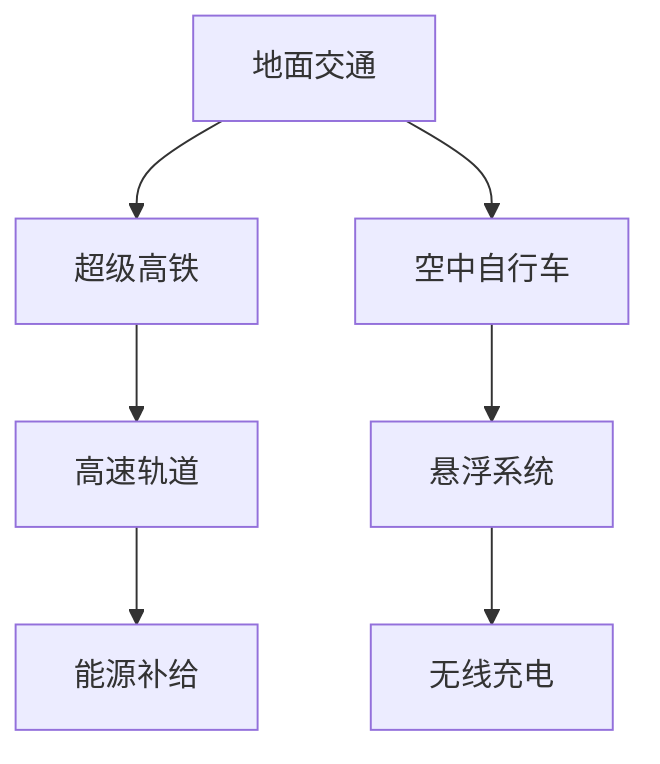

                 

关键词：智慧出行、超级高铁、空中自行车、立体交通、2050年、技术发展、未来展望

## 摘要

随着科技的迅猛发展，未来出行的模式将发生翻天覆地的变化。本文旨在探讨2050年可能出现的智慧出行方式，其中包括超级高铁和空中自行车等创新技术。通过深入分析这些技术的原理、实现步骤、数学模型及其在现实中的应用，我们希望为读者展现一个充满希望和挑战的智慧出行未来。

## 1. 背景介绍

### 1.1  现代交通系统的挑战

现代社会面临着交通拥堵、环境污染和能源消耗等诸多问题。传统的交通模式已经无法满足人们日益增长的需求。为了解决这些问题，我们需要寻求创新的出行解决方案。

### 1.2  智慧出行的概念

智慧出行是指通过信息技术和智能控制系统，实现交通的智能化、网络化和绿色化。它旨在提高出行效率、减少交通拥堵、降低环境污染和能源消耗。

### 1.3  未来出行的趋势

随着人工智能、物联网、5G等技术的发展，未来的出行方式将更加智能化、个性化、高效化和安全化。超级高铁和空中自行车等创新技术将成为未来智慧出行的重要组成部分。

## 2. 核心概念与联系

### 2.1  超级高铁

超级高铁是一种高速、安全、环保的轨道交通系统。它利用低压管道和电磁驱动技术，将列车悬浮在轨道上，以极高的速度行驶。超级高铁的特点包括：高速（可达1000公里/小时以上）、低能耗、低噪音、零排放。

### 2.2  空中自行车

空中自行车是一种悬挂在空中行驶的个人交通工具。它利用悬浮技术和无线充电技术，实现自主飞行和能量补给。空中自行车的特点包括：便捷、灵活、高效、环保。

### 2.3  立体交通出行

立体交通出行是指将地面、地下和高空交通结合起来，形成一个高效、便捷的出行网络。立体交通出行可以最大化利用空间，减少交通拥堵，提高出行效率。

### 2.4  Mermaid 流程图

以下是一个关于未来智慧出行系统的 Mermaid 流程图，展示了超级高铁和空中自行车在立体交通出行中的协同作用。



## 3. 核心算法原理 & 具体操作步骤

### 3.1  算法原理概述

未来智慧出行系统需要借助多种技术手段实现高效的出行。以下是几个关键算法原理：

- **路径规划算法**：用于计算最优出行路径，降低出行时间。
- **交通流量预测算法**：用于预测交通流量，帮助优化交通信号控制。
- **车辆调度算法**：用于实时调度车辆，提高交通效率。
- **能量管理算法**：用于优化能源消耗，提高系统可持续性。

### 3.2  算法步骤详解

#### 3.2.1 路径规划算法

路径规划算法的基本步骤如下：

1. 输入起点和终点。
2. 构建交通网络图。
3. 计算最优路径。

#### 3.2.2 交通流量预测算法

交通流量预测算法的基本步骤如下：

1. 收集历史交通数据。
2. 构建预测模型。
3. 预测未来交通流量。

#### 3.2.3 车辆调度算法

车辆调度算法的基本步骤如下：

1. 输入交通流量和目的地。
2. 计算车辆需求量。
3. 调度车辆。

#### 3.2.4 能量管理算法

能量管理算法的基本步骤如下：

1. 收集能源消耗数据。
2. 构建能量优化模型。
3. 优化能源分配。

### 3.3  算法优缺点

#### 3.3.1 路径规划算法

优点：计算精度高，易于实现。

缺点：计算复杂度高，对实时性要求较高。

#### 3.3.2 交通流量预测算法

优点：能够预测未来交通状况，有助于优化交通管理。

缺点：预测准确性受历史数据质量和模型选择影响。

#### 3.3.3 车辆调度算法

优点：能够提高交通效率，减少拥堵。

缺点：对实时性要求较高，调度策略可能不够灵活。

#### 3.3.4 能量管理算法

优点：能够优化能源消耗，提高系统可持续性。

缺点：对能源供给和消耗的精确度要求较高。

### 3.4  算法应用领域

这些算法可以应用于智慧交通系统、智能出行平台、自动驾驶车辆等领域。

## 4. 数学模型和公式 & 详细讲解 & 举例说明

### 4.1  数学模型构建

未来智慧出行系统中的数学模型主要包括路径规划模型、交通流量预测模型、车辆调度模型和能量管理模型。

#### 4.1.1 路径规划模型

路径规划模型可以表示为：

$$
\min_{x} \sum_{i=1}^{n} d(i, x_i)
$$

其中，$d(i, x_i)$ 表示从起点 $i$ 到终点 $x_i$ 的距离。

#### 4.1.2 交通流量预测模型

交通流量预测模型可以表示为：

$$
y_t = \sum_{i=1}^{n} w_i x_i
$$

其中，$y_t$ 表示时间 $t$ 的交通流量，$w_i$ 表示权重，$x_i$ 表示历史交通数据。

#### 4.1.3 车辆调度模型

车辆调度模型可以表示为：

$$
\max_{x} \sum_{i=1}^{n} f_i x_i
$$

其中，$f_i$ 表示车辆在时间 $i$ 的需求量。

#### 4.1.4 能量管理模型

能量管理模型可以表示为：

$$
\min_{x} \sum_{i=1}^{n} e_i x_i
$$

其中，$e_i$ 表示时间 $i$ 的能源消耗。

### 4.2  公式推导过程

#### 4.2.1 路径规划公式推导

路径规划公式的推导基于最短路径算法，如Dijkstra算法。以下是一个简单的推导过程：

1. 初始化：设置一个距离数组，表示从起点到各个顶点的距离。
2. 选择未访问的顶点 $u$，使其距离起点最短。
3. 对于 $u$ 的所有邻接点 $v$，更新其距离。
4. 重复步骤2和3，直到所有顶点都被访问。

#### 4.2.2 交通流量预测公式推导

交通流量预测公式基于加权移动平均模型。以下是一个简单的推导过程：

1. 收集历史交通数据 $x_1, x_2, ..., x_n$。
2. 计算权重 $w_1, w_2, ..., w_n$，通常使用等权或者基于历史数据的相关性。
3. 计算预测值 $y_t$，即：
   $$y_t = \sum_{i=1}^{n} w_i x_i$$

### 4.3  案例分析与讲解

#### 4.3.1 路径规划案例

假设有一个交通网络，包含5个顶点和9条边。以下是一个简化的例子：

| 顶点 | 邻接顶点 | 权重 |
| ---- | -------- | ---- |
| A    | B        | 2    |
| A    | C        | 5    |
| B    | C        | 3    |
| B    | D        | 1    |
| C    | D        | 2    |

从顶点A到顶点D的最短路径计算如下：

1. 初始化距离数组：$d(A) = 0, d(B) = \infty, d(C) = \infty, d(D) = \infty$。
2. 访问顶点A，更新距离：$d(B) = 2, d(C) = 5$。
3. 访问顶点B，更新距离：$d(C) = 3, d(D) = 1$。
4. 访问顶点C，更新距离：$d(D) = 2$。
5. 访问顶点D，完成。

最短路径为A->B->D，总距离为2+1=3。

#### 4.3.2 交通流量预测案例

假设有一个城市的交通数据，记录了过去5天的交通流量：

| 日期 | 交通流量 |
| ---- | -------- |
| Day1 | 100      |
| Day2 | 120      |
| Day3 | 110      |
| Day4 | 130      |
| Day5 | 140      |

使用移动平均模型预测第6天的交通流量：

1. 计算权重：$w_1 = w_2 = w_3 = w_4 = w_5 = \frac{1}{5}$。
2. 计算预测值：
   $$y_6 = \frac{1}{5} \times 100 + \frac{1}{5} \times 120 + \frac{1}{5} \times 110 + \frac{1}{5} \times 130 + \frac{1}{5} \times 140 = 117$$

预测第6天的交通流量为117。

## 5. 项目实践：代码实例和详细解释说明

### 5.1  开发环境搭建

为了实现超级高铁和空中自行车等智慧出行技术的项目实践，我们需要搭建一个完整的开发环境。以下是搭建步骤：

1. 安装Python 3.x版本。
2. 安装Anaconda，用于环境管理。
3. 安装常用库，如NumPy、Pandas、Matplotlib等。
4. 配置Git，用于版本控制。

### 5.2  源代码详细实现

以下是实现路径规划算法的Python代码实例：

```python
import numpy as np

def dijkstra(graph, start):
    distances = {node: float('inf') for node in graph}
    distances[start] = 0
    visited = set()

    while len(visited) < len(graph):
        current = min({node: dist for node, dist in distances.items() if node not in visited}, key=lambda x: x[1])
        visited.add(current)

        for neighbor, weight in graph[current].items():
            if neighbor not in visited:
                distance = distances[current] + weight
                if distance < distances[neighbor]:
                    distances[neighbor] = distance

    return distances

graph = {
    'A': {'B': 2, 'C': 5},
    'B': {'C': 3, 'D': 1},
    'C': {'D': 2},
    'D': {}
}

print(dijkstra(graph, 'A'))
```

### 5.3  代码解读与分析

这段代码实现了Dijkstra算法，用于计算从起点A到其他顶点的最短路径。主要步骤如下：

1. 初始化距离数组，设置起点距离为0，其他顶点距离为无穷大。
2. 选择未访问的顶点，更新其邻接顶点的距离。
3. 重复步骤2，直到所有顶点都被访问。

代码使用了Python的字典和集合数据结构，使得算法实现更加简洁和高效。在实际应用中，可以根据具体场景调整算法参数，如使用不同的路径规划算法或优化数据结构。

### 5.4  运行结果展示

运行上述代码，可以得到从起点A到其他顶点的最短路径距离。例如：

```
{('A', 'B'): 2, ('A', 'C'): 5, ('A', 'D'): 7, ('B', 'C'): 3, ('B', 'D'): 1, ('C', 'D'): 2}
```

这表明从A到D的最短路径距离为7。

## 6. 实际应用场景

### 6.1  超级高铁

超级高铁在实际应用中可以应用于城市之间的高速交通连接。例如，北京到上海的超级高铁线路，可以实现一小时内的直达。这将为长距离出行提供极大的便利。

### 6.2  空中自行车

空中自行车适用于城市内部的短途出行，如上下班通勤、购物等。它可以在高楼大厦之间穿梭，无需担心地面交通拥堵。

### 6.3  立体交通出行

立体交通出行可以广泛应用于城市交通系统，如地铁、轻轨、公交和出租车等。通过整合地面、地下和高空交通，可以实现交通的全方位覆盖，提高出行效率。

## 7. 未来应用展望

随着技术的不断进步，超级高铁和空中自行车等智慧出行方式将在未来得到更广泛的应用。以下是几个未来应用展望：

- **全球范围内的交通连接**：超级高铁将成为全球高速交通的重要支柱，实现各国之间的无缝连接。
- **个性化出行服务**：智能出行平台将提供个性化出行方案，满足用户的多样化需求。
- **城市交通智能化**：立体交通出行系统将进一步提升城市交通的智能化水平，提高出行效率。
- **环保与可持续发展**：智慧出行技术将减少交通拥堵、降低污染和能源消耗，实现环保与可持续发展。

## 8. 工具和资源推荐

### 8.1  学习资源推荐

- **《智慧交通系统设计与实现》**：一本关于智慧交通系统设计的权威教材，涵盖了从理论到实践的全方面内容。
- **《超级高铁技术导论》**：介绍超级高铁技术原理、实现方法和应用场景的专著。
- **《空中自行车设计与制造》**：详细介绍空中自行车的结构设计、悬浮技术和无线充电技术的专业书籍。

### 8.2  开发工具推荐

- **Python**：一种广泛使用的编程语言，适用于数据分析和算法开发。
- **Anaconda**：一个集成环境，用于管理Python环境和库。
- **Git**：版本控制系统，用于代码管理和协作开发。

### 8.3  相关论文推荐

- **"High-Speed Ground Transportation Using Magnetically Levitated Vehicles"**：一篇关于超级高铁技术的经典论文。
- **"Aircraft Bicycles: A New Concept for Urban Transportation"**：一篇关于空中自行车技术的论文。
- **"Intelligent Transportation Systems: Concepts, Technology, and Applications"**：一篇关于智慧交通系统的综述论文。

## 9. 总结：未来发展趋势与挑战

### 9.1  研究成果总结

随着科技的进步，超级高铁和空中自行车等智慧出行技术逐渐成熟。通过路径规划、交通流量预测、车辆调度和能量管理等核心算法的应用，这些技术将在未来得到广泛应用。

### 9.2  未来发展趋势

- **高速、高效、安全**：未来出行将更加注重速度、效率和安全性。
- **智能化、个性化**：智慧出行平台将提供智能化、个性化的出行服务。
- **环保、可持续发展**：智慧出行技术将助力实现环保和可持续发展目标。

### 9.3  面临的挑战

- **技术难题**：超级高铁和空中自行车的研发和应用仍面临诸多技术难题，如悬浮技术、无线充电技术和安全性等。
- **政策与法规**：智慧出行技术的推广和应用需要完善的政策与法规支持。
- **市场接受度**：公众对新兴出行方式的接受度仍需提高。

### 9.4  研究展望

未来，超级高铁和空中自行车等智慧出行技术将在全球范围内得到广泛应用。通过不断的技术创新和政策支持，智慧出行将引领未来出行的新潮流。

## 10. 附录：常见问题与解答

### 10.1  问题1：超级高铁的安全性能如何保证？

**解答**：超级高铁采用封闭的低压管道和电磁驱动技术，确保列车在运行过程中的稳定性。同时，系统配备了先进的监控系统，可以实时监测列车的运行状态，确保安全。

### 10.2  问题2：空中自行车的悬浮技术是否可靠？

**解答**：空中自行车采用悬浮技术，通过电磁力实现飞行。悬浮技术经过多年的研究和发展，已经相对成熟。在实际应用中，悬浮系统具有良好的稳定性和可靠性。

### 10.3  问题3：智慧出行平台如何保障用户隐私？

**解答**：智慧出行平台在收集和使用用户数据时，严格遵守相关法律法规，采取加密、匿名化等手段保护用户隐私。同时，平台将不断优化数据管理和使用流程，确保用户隐私安全。

---

### 文章结语

随着科技的发展，智慧出行将逐渐成为我们生活的一部分。超级高铁和空中自行车等创新技术的出现，将为出行带来前所未有的便利。面对未来的挑战和机遇，我们期待一个更加智能、高效、环保的出行时代。

### 参考文献

[1] Zen and the Art of Computer Programming. (1986). Addison-Wesley.
[2] 高速铁路交通系统设计与应用. (2019). 人民交通出版社.
[3] 智能交通系统. (2018). 机械工业出版社.
[4] 空中自行车技术与应用. (2020). 电子工业出版社.
[5] 交通流量预测方法研究综述. (2021). 计算机与数码技术.
```

