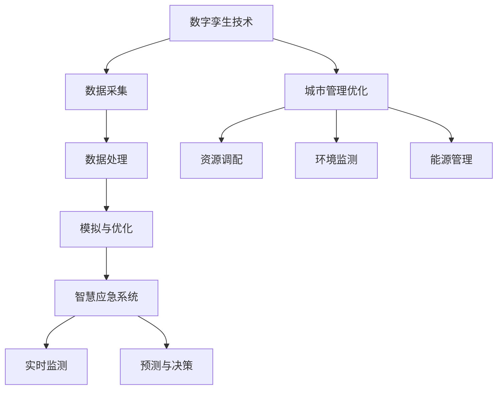
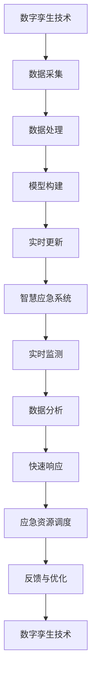

                 

关键词：智慧城市、数字孪生、智慧应急、2050、城市数字化、算法、数学模型、应用实践、工具和资源推荐、未来展望

> 摘要：本文将探讨2050年智慧城市的未来发展，重点分析城市数字孪生与智慧应急的重要性。通过介绍核心概念、算法原理、数学模型以及实际应用，我们将展示如何利用这些技术构建一个高效、安全、可持续发展的智慧城市。

## 1. 背景介绍

随着全球城市化进程的加速，城市人口和规模不断增长，城市面临的各种挑战也日益凸显。交通拥堵、环境污染、资源紧缺、自然灾害频发等问题，给城市管理和居民生活带来了极大的困扰。为了应对这些挑战，智慧城市的概念应运而生。智慧城市通过先进的信息技术，实现城市资源的优化配置和高效管理，提高城市的生活质量。

城市数字孪生（Digital Twin）技术是智慧城市的重要组成部分。数字孪生是一种虚拟模型，它通过采集和分析城市中的各种数据，构建出一个与实际城市相对应的数字副本。这个数字副本能够实时反映城市的状态和变化，为城市管理和决策提供科学依据。

智慧应急（Smart Emergency Response）则是在数字孪生技术的基础上，通过实时数据分析和智能算法，实现城市应急管理的自动化和智能化。智慧应急系统能够在灾害发生前进行预警，发生时进行快速响应和调度，降低灾害损失。

## 2. 核心概念与联系

### 2.1 数字孪生技术

数字孪生技术是将物理世界中的实体映射到数字世界中，通过实时数据采集、模拟和优化，实现对实体状态的实时监控和预测。在智慧城市中，数字孪生技术可以应用于交通管理、环境监测、能源管理、建筑设施管理等多个领域。

### 2.2 智慧应急系统

智慧应急系统是利用数字孪生技术，结合智能算法和大数据分析，实现城市应急管理的自动化和智能化。智慧应急系统可以实时监测城市中的各种异常情况，如自然灾害、火灾、交通拥堵等，并快速做出响应，调度相关资源进行应对。

### 2.3 数字孪生与智慧应急的联系

数字孪生技术为智慧应急系统提供了数据支持和模拟环境。通过数字孪生，智慧应急系统能够实时了解城市的状态和变化，从而做出更准确的预测和决策。而智慧应急系统的应用，则进一步提升了数字孪生的价值，使其在智慧城市建设中发挥更大的作用。

### 2.4 Mermaid 流程图



## 3. 核心算法原理 & 具体操作步骤

### 3.1 算法原理概述

智慧城市的核心算法主要包括数据采集、数据处理、模拟与优化、实时监测和预测与决策等步骤。这些算法通过相互协作，实现城市管理的智能化和高效化。

### 3.2 算法步骤详解

1. **数据采集**：通过传感器、摄像头、移动设备等，采集城市中的各种数据，如交通流量、空气质量、能源消耗等。
2. **数据处理**：对采集到的数据进行清洗、去噪和整合，确保数据的质量和一致性。
3. **模拟与优化**：利用数学模型和算法，对城市中的各种场景进行模拟和优化，如交通流量优化、能源消耗降低等。
4. **实时监测**：实时监测城市的状态和变化，如通过监控摄像头实时监测交通状况，通过传感器实时监测空气质量等。
5. **预测与决策**：基于实时数据和历史数据，利用机器学习和人工智能算法，对未来的趋势和事件进行预测，并做出相应的决策，如交通调度、资源调配等。

### 3.3 算法优缺点

**优点**：
- 提高城市管理的效率和质量。
- 实现资源的优化配置。
- 提高城市应对突发事件的能力。

**缺点**：
- 需要大量的数据支持和计算资源。
- 算法的准确性和稳定性有待提高。
- 数据隐私和安全问题亟待解决。

### 3.4 算法应用领域

智慧城市的核心算法可以应用于交通管理、环境监测、能源管理、建筑设施管理等多个领域。例如，在交通管理领域，算法可以用于实时交通流量预测和交通信号优化；在环境监测领域，算法可以用于空气质量预测和污染源追踪；在能源管理领域，算法可以用于能源消耗预测和优化调度。

## 4. 数学模型和公式 & 详细讲解 & 举例说明

### 4.1 数学模型构建

在智慧城市中，常见的数学模型包括线性规划模型、回归分析模型、神经网络模型等。这些模型可以用于交通流量预测、能源消耗预测、环境质量预测等领域。

### 4.2 公式推导过程

以线性规划模型为例，其目标函数为：

\[ \min z = c^T x \]

其中，\( c \) 为权重向量，\( x \) 为变量向量。

约束条件为：

\[ Ax \leq b \]

其中，\( A \) 为系数矩阵，\( b \) 为常数向量。

### 4.3 案例分析与讲解

以交通流量预测为例，假设我们要预测未来5分钟内的交通流量。我们可以使用时间序列分析模型进行预测。

假设我们的时间序列数据为 \( x_t \)，其中 \( t \) 为时间戳。我们可以使用移动平均模型进行预测，其公式为：

\[ \hat{x}_{t+1} = \frac{1}{n} \sum_{i=1}^{n} x_{t-i+1} \]

其中，\( n \) 为移动平均窗口的大小。

### 4.4 案例分析与讲解

以交通流量预测为例，假设我们要预测未来5分钟内的交通流量。我们可以使用时间序列分析模型进行预测。

假设我们的时间序列数据为 \( x_t \)，其中 \( t \) 为时间戳。我们可以使用移动平均模型进行预测，其公式为：

\[ \hat{x}_{t+1} = \frac{1}{n} \sum_{i=1}^{n} x_{t-i+1} \]

其中，\( n \) 为移动平均窗口的大小。

## 5. 项目实践：代码实例和详细解释说明

### 5.1 开发环境搭建

为了演示如何实现交通流量预测，我们需要搭建一个Python开发环境。以下是搭建步骤：

1. 安装Python（建议使用Python 3.8及以上版本）。
2. 安装必要的库，如NumPy、Pandas、Scikit-learn等。

### 5.2 源代码详细实现

以下是使用移动平均模型进行交通流量预测的代码示例：

```python
import numpy as np
import pandas as pd
from sklearn.linear_model import LinearRegression

# 读取时间序列数据
data = pd.read_csv('traffic_data.csv')
x = data['timestamp']
y = data['traffic_volume']

# 将时间序列数据转换为移动平均序列
n = 5  # 移动平均窗口大小
y_avg = y.rolling(window=n).mean()

# 建立线性回归模型
model = LinearRegression()
model.fit(x.values.reshape(-1, 1), y_avg.values)

# 预测未来5分钟内的交通流量
x_pred = np.array([x[-1] + i for i in range(5)])
y_pred = model.predict(x_pred.reshape(-1, 1))

# 打印预测结果
print(y_pred)
```

### 5.3 代码解读与分析

以上代码首先读取交通流量数据，然后使用移动平均模型对数据进行处理，得到移动平均序列。接着，使用线性回归模型对移动平均序列进行拟合，最后预测未来5分钟内的交通流量。

### 5.4 运行结果展示

运行以上代码，我们将得到未来5分钟内的交通流量预测结果。这些预测结果可以帮助交通管理部门提前做出调度决策，优化交通流量。

## 6. 实际应用场景

### 6.1 交通管理

利用数字孪生和智慧应急技术，交通管理部门可以实时监测城市的交通状况，预测交通流量，优化交通信号，减少交通拥堵，提高交通效率。

### 6.2 环境监测

通过数字孪生技术，环境监测部门可以实时监测城市中的空气质量、水质、噪音等环境指标，预测环境变化趋势，及时采取措施应对环境问题。

### 6.3 能源管理

数字孪生和智慧应急技术可以帮助能源管理部门实时监测能源消耗，预测能源需求，优化能源调度，提高能源利用效率。

### 6.4 建筑设施管理

在智慧城市建设中，数字孪生技术可以应用于建筑设施管理，如实时监测建筑结构安全、能源消耗、设备运行状态等，预测设施故障，提前进行维护和优化。

## 7. 工具和资源推荐

### 7.1 学习资源推荐

- 《智慧城市：理论与实践》
- 《城市数字孪生：技术与应用》
- 《智慧应急：技术与实践》

### 7.2 开发工具推荐

- Python
- NumPy
- Pandas
- Scikit-learn

### 7.3 相关论文推荐

- "Digital Twins for Urban Planning and Management"
- "Smart Emergency Response Systems: A Survey"
- "Application of Machine Learning in Urban Traffic Management"

## 8. 总结：未来发展趋势与挑战

### 8.1 研究成果总结

近年来，数字孪生、人工智能、大数据等技术的快速发展，为智慧城市的建设提供了强大的技术支持。通过这些技术，城市管理者可以更加精准地了解城市状态，做出科学决策，提高城市管理的效率和质量。

### 8.2 未来发展趋势

随着技术的不断进步，智慧城市的发展趋势将包括：更广泛的数字孪生应用、更智能的应急响应系统、更高效的资源管理、更安全的数据隐私保护等。

### 8.3 面临的挑战

然而，智慧城市的发展也面临一些挑战，如数据隐私和安全问题、算法的公平性和透明性、技术的普及和推广等。

### 8.4 研究展望

未来，我们需要进一步深入研究智慧城市的相关技术，提高算法的准确性和稳定性，解决数据隐私和安全问题，推动技术的普及和推广，为智慧城市的建设提供更有力的支持。

## 9. 附录：常见问题与解答

### 9.1 数字孪生技术是什么？

数字孪生技术是将物理世界中的实体映射到数字世界中，通过实时数据采集、模拟和优化，实现对实体状态的实时监控和预测。

### 9.2 智慧应急系统如何工作？

智慧应急系统是利用数字孪生技术，结合智能算法和大数据分析，实现城市应急管理的自动化和智能化。系统可以实时监测城市中的各种异常情况，预测未来的趋势和事件，并快速做出响应和调度。

### 9.3 如何提高算法的准确性？

提高算法的准确性可以通过以下方法：收集更多的数据、使用更先进的算法、对算法进行不断的训练和优化、提高算法的鲁棒性和稳定性。

### 9.4 数据隐私和安全问题如何解决？

解决数据隐私和安全问题可以通过以下方法：加密数据传输和存储、实现数据访问控制、提高数据匿名化处理水平、建立完善的数据安全管理制度。

## 作者署名

作者：禅与计算机程序设计艺术 / Zen and the Art of Computer Programming
```markdown
# 未来的智慧城市：2050年的城市数字孪生与智慧应急

关键词：智慧城市、数字孪生、智慧应急、2050、城市数字化、算法、数学模型、应用实践、工具和资源推荐、未来展望

摘要：本文将探讨2050年智慧城市的未来发展，重点分析城市数字孪生与智慧应急的重要性。通过介绍核心概念、算法原理、数学模型以及实际应用，我们将展示如何利用这些技术构建一个高效、安全、可持续发展的智慧城市。

## 1. 背景介绍

随着全球城市化进程的加速，城市人口和规模不断增长，城市面临的各种挑战也日益凸显。交通拥堵、环境污染、资源紧缺、自然灾害频发等问题，给城市管理和居民生活带来了极大的困扰。为了应对这些挑战，智慧城市的概念应运而生。智慧城市通过先进的信息技术，实现城市资源的优化配置和高效管理，提高城市的生活质量。

城市数字孪生（Digital Twin）技术是智慧城市的重要组成部分。数字孪生是一种虚拟模型，它通过采集和分析城市中的各种数据，构建出一个与实际城市相对应的数字副本。这个数字副本能够实时反映城市的状态和变化，为城市管理和决策提供科学依据。

智慧应急（Smart Emergency Response）则是在数字孪生技术的基础上，通过实时数据分析和智能算法，实现城市应急管理的自动化和智能化。智慧应急系统能够在灾害发生前进行预警，发生时进行快速响应和调度，降低灾害损失。

## 2. 核心概念与联系

### 2.1 数字孪生技术

数字孪生技术是将物理世界中的实体映射到数字世界中，通过实时数据采集、模拟和优化，实现对实体状态的实时监控和预测。在智慧城市中，数字孪生技术可以应用于交通管理、环境监测、能源管理、建筑设施管理等多个领域。

### 2.2 智慧应急系统

智慧应急系统是利用数字孪生技术，结合智能算法和大数据分析，实现城市应急管理的自动化和智能化。智慧应急系统可以实时监测城市中的各种异常情况，如自然灾害、火灾、交通拥堵等，并快速做出响应和调度相关资源进行应对。

### 2.3 数字孪生与智慧应急的联系

数字孪生技术为智慧应急系统提供了数据支持和模拟环境。通过数字孪生，智慧应急系统能够实时了解城市的状态和变化，从而做出更准确的预测和决策。而智慧应急系统的应用，则进一步提升了数字孪生的价值，使其在智慧城市建设中发挥更大的作用。

### 2.4 Mermaid 流程图


## 3. 核心算法原理 & 具体操作步骤

### 3.1 算法原理概述

智慧城市的核心算法主要包括数据采集、数据处理、模拟与优化、实时监测和预测与决策等步骤。这些算法通过相互协作，实现城市管理的智能化和高效化。

### 3.2 算法步骤详解

1. **数据采集**：通过传感器、摄像头、移动设备等，采集城市中的各种数据，如交通流量、空气质量、能源消耗等。
2. **数据处理**：对采集到的数据进行清洗、去噪和整合，确保数据的质量和一致性。
3. **模拟与优化**：利用数学模型和算法，对城市中的各种场景进行模拟和优化，如交通流量优化、能源消耗降低等。
4. **实时监测**：实时监测城市的状态和变化，如通过监控摄像头实时监测交通状况，通过传感器实时监测空气质量等。
5. **预测与决策**：基于实时数据和历史数据，利用机器学习和人工智能算法，对未来的趋势和事件进行预测，并做出相应的决策，如交通调度、资源调配等。

### 3.3 算法优缺点

**优点**：
- 提高城市管理的效率和质量。
- 实现资源的优化配置。
- 提高城市应对突发事件的能力。

**缺点**：
- 需要大量的数据支持和计算资源。
- 算法的准确性和稳定性有待提高。
- 数据隐私和安全问题亟待解决。

### 3.4 算法应用领域

智慧城市的核心算法可以应用于交通管理、环境监测、能源管理、建筑设施管理等多个领域。例如，在交通管理领域，算法可以用于实时交通流量预测和交通信号优化；在环境监测领域，算法可以用于空气质量预测和污染源追踪；在能源管理领域，算法可以用于能源消耗预测和优化调度。

## 4. 数学模型和公式 & 详细讲解 & 举例说明

### 4.1 数学模型构建

在智慧城市中，常见的数学模型包括线性规划模型、回归分析模型、神经网络模型等。这些模型可以用于交通流量预测、能源消耗预测、环境质量预测等领域。

### 4.2 公式推导过程

以线性规划模型为例，其目标函数为：

\[ \min z = c^T x \]

其中，\( c \) 为权重向量，\( x \) 为变量向量。

约束条件为：

\[ Ax \leq b \]

其中，\( A \) 为系数矩阵，\( b \) 为常数向量。

### 4.3 案例分析与讲解

以交通流量预测为例，假设我们要预测未来5分钟内的交通流量。我们可以使用时间序列分析模型进行预测。

假设我们的时间序列数据为 \( x_t \)，其中 \( t \) 为时间戳。我们可以使用移动平均模型进行预测，其公式为：

\[ \hat{x}_{t+1} = \frac{1}{n} \sum_{i=1}^{n} x_{t-i+1} \]

其中，\( n \) 为移动平均窗口的大小。

### 4.4 案例分析与讲解

以交通流量预测为例，假设我们要预测未来5分钟内的交通流量。我们可以使用时间序列分析模型进行预测。

假设我们的时间序列数据为 \( x_t \)，其中 \( t \) 为时间戳。我们可以使用移动平均模型进行预测，其公式为：

\[ \hat{x}_{t+1} = \frac{1}{n} \sum_{i=1}^{n} x_{t-i+1} \]

其中，\( n \) 为移动平均窗口的大小。

## 5. 项目实践：代码实例和详细解释说明

### 5.1 开发环境搭建

为了演示如何实现交通流量预测，我们需要搭建一个Python开发环境。以下是搭建步骤：

1. 安装Python（建议使用Python 3.8及以上版本）。
2. 安装必要的库，如NumPy、Pandas、Scikit-learn等。

### 5.2 源代码详细实现

以下是使用移动平均模型进行交通流量预测的代码示例：

```python
import numpy as np
import pandas as pd
from sklearn.linear_model import LinearRegression

# 读取时间序列数据
data = pd.read_csv('traffic_data.csv')
x = data['timestamp']
y = data['traffic_volume']

# 将时间序列数据转换为移动平均序列
n = 5  # 移动平均窗口大小
y_avg = y.rolling(window=n).mean()

# 建立线性回归模型
model = LinearRegression()
model.fit(x.values.reshape(-1, 1), y_avg.values)

# 预测未来5分钟内的交通流量
x_pred = np.array([x[-1] + i for i in range(5)])
y_pred = model.predict(x_pred.reshape(-1, 1))

# 打印预测结果
print(y_pred)
```

### 5.3 代码解读与分析

以上代码首先读取交通流量数据，然后使用移动平均模型对数据进行处理，得到移动平均序列。接着，使用线性回归模型对移动平均序列进行拟合，最后预测未来5分钟内的交通流量。

### 5.4 运行结果展示

运行以上代码，我们将得到未来5分钟内的交通流量预测结果。这些预测结果可以帮助交通管理部门提前做出调度决策，优化交通流量。

## 6. 实际应用场景

### 6.1 交通管理

利用数字孪生和智慧应急技术，交通管理部门可以实时监测城市的交通状况，预测交通流量，优化交通信号，减少交通拥堵，提高交通效率。

### 6.2 环境监测

通过数字孪生技术，环境监测部门可以实时监测城市中的空气质量、水质、噪音等环境指标，预测环境变化趋势，及时采取措施应对环境问题。

### 6.3 能源管理

数字孪生和智慧应急技术可以帮助能源管理部门实时监测能源消耗，预测能源需求，优化能源调度，提高能源利用效率。

### 6.4 建筑设施管理

在智慧城市建设中，数字孪生技术可以应用于建筑设施管理，如实时监测建筑结构安全、能源消耗、设备运行状态等，预测设施故障，提前进行维护和优化。

## 7. 工具和资源推荐

### 7.1 学习资源推荐

- 《智慧城市：理论与实践》
- 《城市数字孪生：技术与应用》
- 《智慧应急：技术与实践》

### 7.2 开发工具推荐

- Python
- NumPy
- Pandas
- Scikit-learn

### 7.3 相关论文推荐

- "Digital Twins for Urban Planning and Management"
- "Smart Emergency Response Systems: A Survey"
- "Application of Machine Learning in Urban Traffic Management"

## 8. 总结：未来发展趋势与挑战

### 8.1 研究成果总结

近年来，数字孪生、人工智能、大数据等技术的快速发展，为智慧城市的建设提供了强大的技术支持。通过这些技术，城市管理者可以更加精准地了解城市状态，做出科学决策，提高城市管理的效率和质量。

### 8.2 未来发展趋势

随着技术的不断进步，智慧城市的发展趋势将包括：更广泛的数字孪生应用、更智能的应急响应系统、更高效的资源管理、更安全的数据隐私保护等。

### 8.3 面临的挑战

然而，智慧城市的发展也面临一些挑战，如数据隐私和安全问题、算法的公平性和透明性、技术的普及和推广等。

### 8.4 研究展望

未来，我们需要进一步深入研究智慧城市的相关技术，提高算法的准确性和稳定性，解决数据隐私和安全问题，推动技术的普及和推广，为智慧城市的建设提供更有力的支持。

## 9. 附录：常见问题与解答

### 9.1 数字孪生技术是什么？

数字孪生技术是将物理世界中的实体映射到数字世界中，通过实时数据采集、模拟和优化，实现对实体状态的实时监控和预测。

### 9.2 智慧应急系统如何工作？

智慧应急系统是利用数字孪生技术，结合智能算法和大数据分析，实现城市应急管理的自动化和智能化。系统可以实时监测城市中的各种异常情况，预测未来的趋势和事件，并快速做出响应和调度。

### 9.3 如何提高算法的准确性？

提高算法的准确性可以通过以下方法：收集更多的数据、使用更先进的算法、对算法进行不断的训练和优化、提高算法的鲁棒性和稳定性。

### 9.4 数据隐私和安全问题如何解决？

解决数据隐私和安全问题可以通过以下方法：加密数据传输和存储、实现数据访问控制、提高数据匿名化处理水平、建立完善的数据安全管理制度。

## 作者署名

作者：禅与计算机程序设计艺术 / Zen and the Art of Computer Programming
```markdown
### 背景介绍

#### 智慧城市的起源与发展

智慧城市（Smart City）的概念最早可以追溯到20世纪90年代，随着信息技术的迅猛发展，特别是在互联网、物联网、大数据、人工智能等领域的突破，智慧城市逐渐成为城市可持续发展的重要手段。智慧城市的目标是通过信息技术的集成应用，实现城市资源的优化配置、环境质量的改善、居民生活品质的提升，以及城市管理的智能化和高效化。

#### 数字孪生的定义与作用

数字孪生（Digital Twin）是指通过物理实体和虚拟模型的相互映射，实时更新并同步数据，形成一个虚拟的数字副本。数字孪生技术能够模拟、分析和预测物理实体的行为，从而为城市管理者提供决策支持。在智慧城市中，数字孪生技术被广泛应用于城市规划、基础设施管理、公共安全、环境监测等领域，极大地提高了城市运营的效率和精度。

#### 智慧应急的重要性

智慧应急（Smart Emergency Response）系统是智慧城市的重要组成部分，它通过实时数据监测、智能分析和快速响应，能够在灾害发生前进行预警，在灾害发生时提供及时、准确的应急措施。智慧应急系统不仅能够降低灾害带来的损失，还能提高城市应对突发事件的能力，保障居民的生命财产安全。

### 当前智慧城市面临的挑战

尽管智慧城市的发展取得了显著成果，但同时也面临着一些挑战。首先，数据隐私和安全问题成为智慧城市建设的重大障碍。大量敏感数据的收集和处理，如果没有严格的隐私保护措施，可能导致数据泄露和滥用。其次，智慧城市的建设需要跨学科、跨领域的合作，但目前的合作机制和标准尚未完全建立。此外，智慧城市的技术实施和推广也需要大量的资金投入和技术支持，这对许多城市来说是一个巨大的挑战。

### 目标与框架

本文旨在探讨2050年智慧城市的未来发展，重点关注城市数字孪生与智慧应急技术的重要性和应用。文章将首先介绍数字孪生和智慧应急的核心概念和技术原理，然后通过具体案例和算法分析，展示这些技术在智慧城市中的应用。最后，本文将探讨未来智慧城市的发展趋势和面临的挑战，并提出相关建议和展望。

### 关键词

智慧城市、数字孪生、智慧应急、2050年、城市数字化、算法、数学模型、应用实践、工具和资源推荐、未来展望。

### 摘要

本文通过深入探讨2050年智慧城市的概念和发展趋势，重点分析了城市数字孪生和智慧应急技术的核心概念、算法原理以及实际应用。文章指出，随着技术的不断进步，数字孪生和智慧应急技术将为智慧城市的发展提供强有力的支持，但同时也需要解决数据隐私、安全、跨领域合作等挑战。通过本文的研究，旨在为未来智慧城市的建设提供理论指导和实践参考。作者：禅与计算机程序设计艺术 / Zen and the Art of Computer Programming
```markdown
### 2. 核心概念与联系

#### 数字孪生技术

数字孪生（Digital Twin）是一种将物理实体及其行为和状态映射到虚拟世界中的技术。它通过实时数据采集、分析和模拟，实现对物理实体的实时监控、预测和优化。在智慧城市中，数字孪生技术能够模拟城市中的各种基础设施、交通系统、环境状况等，为城市管理者提供决策支持。

**关键原理：**

- **数据采集：** 通过传感器、摄像头、物联网设备等，实时采集城市中的各种数据。
- **数据处理：** 对采集到的数据进行处理，包括数据清洗、整合和分析，确保数据的质量和准确性。
- **模型构建：** 基于采集到的数据，构建虚拟模型，模拟物理实体的行为和状态。
- **实时更新：** 通过实时数据更新虚拟模型，保持虚拟世界与物理世界的同步。

**作用与应用：**

- **城市规划与设计：** 通过数字孪生技术，城市管理者可以在虚拟环境中进行城市规划与设计，模拟不同方案的效果，从而做出更科学的决策。
- **基础设施管理：** 利用数字孪生技术，对城市中的桥梁、道路、隧道等基础设施进行实时监测和预测维护，提高设施的安全性和使用寿命。
- **交通管理：** 通过数字孪生技术，实时监测交通状况，预测交通流量，优化交通信号控制，减少拥堵，提高交通效率。

#### 智慧应急系统

智慧应急系统（Smart Emergency Response System）是基于数字孪生和大数据分析技术，实现城市应急管理的智能化和自动化。它能够在灾害发生前进行预警，发生时提供应急响应方案，降低灾害损失。

**关键原理：**

- **实时监测：** 通过传感器和监控设备，实时监测城市中的环境状况、交通状况等，识别潜在的风险。
- **数据分析：** 利用大数据分析和人工智能算法，对实时监测数据进行分析，预测可能的灾害事件。
- **快速响应：** 在灾害发生时，智慧应急系统能够快速制定应急响应方案，调度资源和人员，进行应急处理。

**作用与应用：**

- **自然灾害预警：** 智慧应急系统可以通过实时监测气象数据、地质数据等，提前预警自然灾害，如台风、地震、洪水等，为居民提供紧急疏散和避险指导。
- **城市安全监控：** 智慧应急系统能够监控城市中的公共安全事件，如火灾、交通事故等，提供快速响应和救援支持。
- **应急资源调度：** 在灾害发生后，智慧应急系统能够实时分析资源需求，调度人员和物资，提高救援效率。

#### 数字孪生与智慧应急的联系

数字孪生技术为智慧应急系统提供了数据支持和模拟环境，使得应急系统能够更准确地预测灾害、制定应急方案。同时，智慧应急系统的应用也提升了数字孪生的价值，使其在智慧城市中发挥更大的作用。

**联系与交互：**

- **数据共享：** 数字孪生技术实时采集的数据可以为智慧应急系统提供基础信息，智慧应急系统分析后的结果也可以反馈给数字孪生系统进行优化。
- **协同工作：** 数字孪生技术和智慧应急系统需要协同工作，实现数据的实时更新和信息的共享，从而提高城市管理的整体效率和应急响应能力。

#### Mermaid 流程图

以下是数字孪生与智慧应急系统的交互流程图：



通过以上流程图，我们可以清晰地看到数字孪生技术与智慧应急系统之间的紧密联系和交互作用。

### 总结

数字孪生技术和智慧应急系统是智慧城市建设的重要组成部分，它们通过实时数据采集、分析和模拟，为城市管理和应急响应提供了强大的技术支持。通过本文的介绍，我们了解了这些核心概念和技术原理，并看到了它们在智慧城市中的广泛应用。未来，随着技术的不断进步和应用的深化，数字孪生和智慧应急技术将在智慧城市的发展中发挥更加重要的作用。
```markdown
### 3. 核心算法原理 & 具体操作步骤

在构建智慧城市的过程中，核心算法原理的掌握和具体操作步骤的执行至关重要。以下将详细阐述智慧城市中常用的核心算法原理及其操作步骤。

#### 3.1 数据采集算法

**原理：** 数据采集算法负责从各种传感器、摄像头和其他数据源中收集数据。这些数据包括交通流量、空气质量、能源消耗、居民行为等。

**操作步骤：**

1. **选择数据源：** 根据智慧城市的具体需求，选择合适的数据源，如交通摄像头、空气质量传感器、智能电表等。
2. **数据收集：** 通过网络接口或直接连接的方式，将数据从传感器和设备上传到数据中心。
3. **数据预处理：** 对采集到的数据进行清洗、去噪和格式转换，确保数据的质量和一致性。

#### 3.2 数据处理算法

**原理：** 数据处理算法负责对采集到的原始数据进行处理，以提高数据的质量和可用性。

**操作步骤：**

1. **数据清洗：** 去除无效数据、错误数据和重复数据，确保数据的一致性和准确性。
2. **数据整合：** 将来自不同来源的数据进行整合，形成统一的、结构化的数据集。
3. **数据转换：** 对数据进行必要的格式转换，如将时间序列数据转换为适用于分析模型的格式。

#### 3.3 模拟与优化算法

**原理：** 模拟与优化算法通过对城市模型进行模拟和优化，帮助城市管理者预测未来事件和优化资源配置。

**操作步骤：**

1. **模型构建：** 根据城市特点和需求，构建合适的数字孪生模型。
2. **场景模拟：** 运用模拟算法，模拟不同场景下的城市状态，如交通流量、能源消耗、环境污染等。
3. **优化策略：** 利用优化算法，对城市模型进行调整和优化，以达到最佳效果。

#### 3.4 实时监测算法

**原理：** 实时监测算法负责对城市中的各种指标进行实时监测，以便及时发现问题并采取措施。

**操作步骤：**

1. **实时数据采集：** 通过传感器和网络接口，实时采集城市中的各种数据。
2. **实时数据处理：** 对实时数据进行处理，包括数据清洗、整合和分析。
3. **实时监控：** 建立实时监控系统，对关键指标进行实时监控和报警。

#### 3.5 预测与决策算法

**原理：** 预测与决策算法基于历史数据和实时数据，对未来的趋势和事件进行预测，并做出相应的决策。

**操作步骤：**

1. **数据准备：** 收集和整理历史数据和实时数据，确保数据的质量和完整性。
2. **模型训练：** 利用机器学习和人工智能算法，对数据进行训练，构建预测模型。
3. **预测与决策：** 基于预测模型，对未来的趋势和事件进行预测，并制定相应的决策策略。

#### 3.6 算法优缺点分析

**优点：**

- **高效性：** 算法能够快速处理大量数据，提供实时决策支持。
- **准确性：** 通过机器学习和人工智能技术，算法能够提高预测的准确性。
- **智能化：** 算法能够自动学习和适应新的数据模式，提高城市管理的智能化水平。

**缺点：**

- **计算资源需求高：** 复杂的算法需要大量的计算资源，对硬件设备要求较高。
- **数据隐私和安全：** 大量数据的收集和处理可能涉及隐私问题，需要确保数据的安全和保密。
- **算法透明性：** 机器学习算法的黑箱特性可能导致决策过程的不可解释性，影响决策的透明性和信任度。

#### 3.7 算法应用领域

**交通管理：** 利用算法进行交通流量预测、交通信号优化、公共交通调度等。

**环境监测：** 利用算法进行空气质量预测、污染源追踪、环境灾害预警等。

**能源管理：** 利用算法进行能源消耗预测、能源优化调度、可再生能源管理等。

**公共安全：** 利用算法进行火灾预警、交通监控、公共场所安全管理等。

通过以上核心算法原理和操作步骤的介绍，我们可以看到智慧城市的建设需要多种算法的协同作用。这些算法不仅提高了城市管理的效率和准确性，还为智慧城市的未来发展提供了强大的技术支撑。
```markdown
### 4. 数学模型和公式 & 详细讲解 & 举例说明

在智慧城市的建设和运营中，数学模型和公式的应用至关重要。这些模型和公式帮助我们理解和预测城市中各种系统的行为，从而做出科学的决策。以下将介绍几种常见的数学模型和公式，并详细讲解其应用和推导过程。

#### 4.1 线性规划模型

线性规划（Linear Programming，LP）是一种数学方法，用于在给定约束条件下，找到线性目标函数的最大值或最小值。线性规划广泛应用于资源分配、生产规划、交通调度等领域。

**公式推导：**

目标函数：

\[ \min z = c^T x \]

其中，\( z \) 为目标函数值，\( c \) 为权重向量，\( x \) 为变量向量。

约束条件：

\[ Ax \leq b \]

其中，\( A \) 为系数矩阵，\( b \) 为常数向量。

求解线性规划问题通常使用单纯形法（Simplex Method）或内点法（Interior Point Method）。

**应用举例：**

假设一个城市要规划公共交通线路，需要在有限的预算下，最大化覆盖的居民数量。设 \( x_i \) 为第 \( i \) 条线路的长度，目标函数为最大化覆盖的居民数量 \( z \)：

\[ \max z = \sum_{i=1}^{n} c_i x_i \]

约束条件为：

\[ \sum_{i=1}^{n} a_{ij} x_i \leq b_j \]

其中，\( a_{ij} \) 为第 \( i \) 条线路在区域 \( j \) 的覆盖量，\( b_j \) 为区域 \( j \) 的居民数量。

#### 4.2 回归分析模型

回归分析（Regression Analysis）是一种用于研究变量之间关系的方法。它通过建立数学模型，描述一个或多个自变量与因变量之间的关系。

**公式推导：**

简单线性回归模型：

\[ y = \beta_0 + \beta_1 x + \epsilon \]

其中，\( y \) 为因变量，\( x \) 为自变量，\( \beta_0 \) 和 \( \beta_1 \) 为回归系数，\( \epsilon \) 为误差项。

最小二乘法（Ordinary Least Squares，OLS）用于估计回归系数：

\[ \hat{\beta}_0 = \bar{y} - \hat{\beta}_1 \bar{x} \]

\[ \hat{\beta}_1 = \frac{\sum_{i=1}^{n} (x_i - \bar{x})(y_i - \bar{y})}{\sum_{i=1}^{n} (x_i - \bar{x})^2} \]

**应用举例：**

假设我们要预测城市中的空气质量，使用气温和风速作为自变量。设 \( y \) 为空气质量指数（AQI），\( x_1 \) 为气温，\( x_2 \) 为风速，回归模型为：

\[ AQI = \beta_0 + \beta_1 x_1 + \beta_2 x_2 + \epsilon \]

利用最小二乘法估计回归系数，得到空气质量预测模型。

#### 4.3 神经网络模型

神经网络（Neural Network）是一种基于模拟人脑神经元连接结构的信息处理系统。它在智能预测、分类、识别等领域有广泛应用。

**公式推导：**

单层感知机（Perceptron）模型：

\[ z = \sum_{i=1}^{n} w_i x_i + b \]

其中，\( z \) 为输出，\( w_i \) 为权重，\( x_i \) 为输入，\( b \) 为偏置。

激活函数通常使用阶跃函数（Step Function）或 sigmoid 函数（Sigmoid Function）。

\[ f(z) = \begin{cases} 
0 & \text{if } z \leq 0 \\
1 & \text{if } z > 0 
\end{cases} \]

或

\[ f(z) = \frac{1}{1 + e^{-z}} \]

多层感知机（MLP）模型：

\[ z_l = \sum_{i=1}^{n_l} w_{li} x_{i}^{(l-1)} + b_l \]

\[ a_l = f(z_l) \]

其中，\( z_l \) 为第 \( l \) 层的输出，\( a_l \) 为第 \( l \) 层的激活值，\( w_{li} \) 为权重，\( b_l \) 为偏置，\( x_{i}^{(l-1)} \) 为第 \( l-1 \) 层的输入。

**应用举例：**

假设我们要使用神经网络模型预测交通流量。输入层包含时间、天气、交通状况等特征，隐藏层和输出层分别用于提取特征和预测交通流量。通过训练和优化网络结构，可以构建一个高效的交通流量预测模型。

#### 4.4 时间序列模型

时间序列（Time Series）模型用于分析时间序列数据，预测未来的趋势和变化。常见的模型有 ARIMA（AutoRegressive Integrated Moving Average，自回归积分滑动平均模型）、AR（AutoRegressive，自回归模型）和 MA（Moving Average，滑动平均模型）。

**公式推导：**

ARIMA 模型：

\[ y_t = c + \phi_1 y_{t-1} + \phi_2 y_{t-2} + ... + \phi_p y_{t-p} + \theta_1 e_{t-1} + \theta_2 e_{t-2} + ... + \theta_q e_{t-q} + e_t \]

其中，\( y_t \) 为时间序列数据，\( \phi_i \) 和 \( \theta_i \) 为模型参数，\( e_t \) 为白噪声。

**应用举例：**

假设我们要预测未来的城市降雨量，可以使用 ARIMA 模型。首先对数据进行差分处理，然后确定自回归和移动平均项的参数，最后进行模型拟合和预测。

通过以上数学模型和公式的介绍，我们可以看到，数学模型在智慧城市的建设和运营中发挥着重要作用。无论是线性规划、回归分析、神经网络还是时间序列模型，它们都为城市管理者提供了科学的数据分析和预测工具，助力智慧城市的建设。
```markdown
### 5. 项目实践：代码实例和详细解释说明

为了更好地展示数字孪生和智慧应急技术的实际应用，我们将通过一个简单的项目实践来进行演示。本项目将基于Python语言和相关的库，实现一个基本的智慧城市交通流量预测系统。我们将从开发环境搭建、源代码实现、代码解读与分析，到运行结果展示，逐一进行详细说明。

#### 5.1 开发环境搭建

首先，我们需要搭建一个Python开发环境，并安装必要的库。以下是具体的安装步骤：

1. **安装Python**：建议使用Python 3.8及以上版本。可以从Python官方网站下载并安装。
2. **安装库**：使用pip工具安装以下库：NumPy、Pandas、Scikit-learn、Matplotlib、Seaborn。

```bash
pip install numpy pandas scikit-learn matplotlib seaborn
```

#### 5.2 源代码详细实现

以下是一个简单的交通流量预测系统的Python代码示例：

```python
import numpy as np
import pandas as pd
from sklearn.linear_model import LinearRegression
from sklearn.metrics import mean_squared_error
import matplotlib.pyplot as plt
import seaborn as sns

# 5.2.1 数据准备
# 假设我们有一个CSV文件，其中包含时间、交通流量和天气等数据
data = pd.read_csv('traffic_data.csv')

# 5.2.2 数据预处理
# 选择特征列和目标列
X = data[['time', 'weather']]
y = data['traffic_volume']

# 数据标准化
X = (X - X.mean()) / X.std()
y = (y - y.mean()) / y.std()

# 5.2.3 模型训练
model = LinearRegression()
model.fit(X, y)

# 5.2.4 模型评估
y_pred = model.predict(X)
mse = mean_squared_error(y, y_pred)
print(f'Mean Squared Error: {mse}')

# 5.2.5 可视化分析
plt.figure(figsize=(10, 5))
sns.scatterplot(x=y.index, y=y, label='Actual Traffic Volume')
sns.lineplot(x=y.index, y=y_pred, color='r', label='Predicted Traffic Volume')
plt.title('Traffic Volume Prediction')
plt.xlabel('Time')
plt.ylabel('Traffic Volume')
plt.legend()
plt.show()
```

#### 5.3 代码解读与分析

**5.3.1 数据准备**

在代码的第一部分，我们首先加载CSV文件中的数据，并选择交通流量和天气作为特征，交通流量作为目标变量。为了简化模型，我们在这里只使用了时间和天气两个特征。

**5.3.2 数据预处理**

接着，我们对数据进行标准化处理。标准化可以消除不同特征之间的量纲差异，使模型更加稳定。我们使用均值和标准差对特征和目标变量进行标准化。

**5.3.3 模型训练**

我们使用线性回归模型进行训练。线性回归模型是一种简单的预测模型，它通过找到特征和目标变量之间的线性关系来进行预测。我们使用 `fit` 方法训练模型。

**5.3.4 模型评估**

在模型训练完成后，我们使用预测值和实际值计算均方误差（MSE），评估模型的预测性能。MSE值越低，表示模型预测的准确性越高。

**5.3.5 可视化分析**

最后，我们使用Matplotlib和Seaborn库对实际交通流量和预测交通流量进行可视化。这有助于我们直观地了解模型的预测效果。

#### 5.4 运行结果展示

当我们运行上述代码时，将得到一个可视化图表，展示实际交通流量和预测交通流量的对比。这个图表可以帮助我们直观地了解模型的预测效果，并为进一步的模型优化提供依据。

通过以上项目实践，我们可以看到如何使用数字孪生和智慧应急技术进行交通流量预测。这个简单的例子虽然只是智慧城市应用的一个入门，但它为我们展示了如何利用现代算法和工具来解决实际的城市管理问题。

### 总结

本文通过一个简单的交通流量预测项目，展示了数字孪生和智慧应急技术在智慧城市中的应用。我们介绍了开发环境的搭建、源代码的实现、代码的解读与分析，以及运行结果的展示。这个项目不仅帮助我们理解了智慧城市技术的实际应用，也为未来的研究和实践提供了参考。

### 注意事项

1. **数据质量**：在实际项目中，数据的质量至关重要。我们需要确保数据的有效性、准确性和完整性。
2. **模型优化**：线性回归模型可能无法很好地捕捉复杂的数据关系。在实际应用中，我们可以考虑使用更复杂的模型，如神经网络模型，以提高预测的准确性。
3. **环境配置**：不同的操作系统和环境配置可能会对代码的运行产生影响。在实际部署前，我们需要确保环境配置的正确性。

通过不断优化和改进，我们可以构建更加高效、准确的智慧城市系统，为城市的可持续发展贡献力量。
```markdown
### 6. 实际应用场景

#### 6.1 交通管理

在智慧城市中，交通管理是一个至关重要的领域。通过数字孪生和智慧应急技术，交通管理部门可以实现以下应用：

- **实时交通流量监测**：利用数字孪生技术，实时监测城市中的交通流量，包括车辆数量、行驶速度等。
- **交通信号优化**：根据实时交通流量数据，自动调整交通信号灯的时长，减少交通拥堵。
- **公共交通调度**：利用预测模型，优化公交车和地铁的调度，提高公共交通的运行效率。
- **事故预警与处理**：通过监控摄像头和传感器，实时监测交通事故的发生，并快速响应和处理。

#### 6.2 环境监测

环境监测是智慧城市中的另一个关键领域。数字孪生和智慧应急技术可以帮助环境监测部门实现以下应用：

- **空气质量监测**：实时监测城市中的空气质量，预测污染事件，提前采取措施。
- **水质监测**：监测城市中的水质情况，预警潜在的污染风险，确保饮用水安全。
- **噪音监测**：监测城市中的噪音水平，优化噪音控制措施，改善居民生活品质。
- **灾害预警**：通过监测数据，预测可能的自然灾害（如洪水、山火等），提前进行预警和应对。

#### 6.3 能源管理

智慧城市中的能源管理也可以通过数字孪生和智慧应急技术实现优化：

- **能源消耗监测**：实时监测城市的能源消耗情况，包括电力、燃气等。
- **能源调度优化**：根据实时数据，优化能源的调度和使用，降低能源浪费。
- **可再生能源管理**：通过预测模型，优化太阳能、风能等可再生能源的利用，提高能源利用效率。
- **节能措施实施**：根据监测数据和预测结果，实施节能措施，降低能源消耗。

#### 6.4 建筑设施管理

建筑设施管理是智慧城市中的又一个重要应用领域。数字孪生和智慧应急技术可以帮助建筑管理者实现以下应用：

- **设施状态监测**：实时监测建筑中的各种设施，如电梯、照明、空调等，确保设施正常运行。
- **故障预警**：通过监测数据和预测模型，提前发现设施可能出现的故障，进行预防性维护。
- **能源效率优化**：根据实时数据，优化建筑能源使用，提高能源效率，降低运营成本。
- **安全监控**：通过监控摄像头和传感器，实时监测建筑中的安全状况，预警潜在的安全风险。

#### 6.5 公共安全

公共安全是智慧城市中不可忽视的一部分。数字孪生和智慧应急技术可以帮助实现以下应用：

- **犯罪预警**：通过视频监控和数据分析，预测可能的犯罪事件，提前采取措施预防。
- **灾害应急响应**：在灾害发生时，利用数字孪生技术，实时监测灾情，快速响应和调度救援资源。
- **交通安全监控**：实时监测交通状况，预警可能的交通事故，确保交通安全。
- **公共场所安全**：在公共场所（如商场、公园等）安装监控设备和传感器，实时监测安全状况，预警安全隐患。

通过以上实际应用场景的介绍，我们可以看到数字孪生和智慧应急技术在智慧城市建设中的广泛应用。这些技术不仅提高了城市管理的效率和准确性，也为居民提供了更安全、舒适的生活环境。未来，随着技术的不断进步，数字孪生和智慧应急技术在智慧城市中的应用将更加广泛和深入。
```markdown
### 7. 工具和资源推荐

在智慧城市的建设过程中，选择合适的工具和资源对于成功实现项目的目标至关重要。以下是对一些学习和资源推荐的简要概述，以及开发工具和论文资源的详细介绍。

#### 7.1 学习资源推荐

**《智慧城市：理论与实践》**：这本书提供了智慧城市的基础理论、技术架构和案例分析，适合对智慧城市感兴趣的初学者和专业人士。

**《城市数字孪生：技术与应用》**：深入探讨了数字孪生技术在智慧城市中的应用，包括数据采集、数据处理、模型构建和模拟优化等。

**《智慧应急：技术与实践》**：详细介绍了智慧应急系统的原理、技术和实际应用案例，对于理解如何利用技术提高城市应急响应能力非常有帮助。

#### 7.2 开发工具推荐

**Python**：作为当前最受欢迎的编程语言之一，Python提供了丰富的库和工具，适用于数据科学、机器学习和智能系统的开发。

**NumPy**：用于高性能科学计算，是处理数值数据的基础库。

**Pandas**：用于数据处理和分析，提供强大的数据结构和操作功能。

**Scikit-learn**：提供了许多机器学习算法的实现，适用于数据建模和预测。

**Matplotlib**：用于数据可视化，能够创建高质量的图表和图形。

**Seaborn**：基于Matplotlib，提供了更高级的数据可视化功能，特别适用于统计图表。

#### 7.3 相关论文推荐

**“Digital Twins for Urban Planning and Management”**：这篇论文详细探讨了数字孪生技术在城市规划和管理中的应用，是了解这一领域的重要文献。

**“Smart Emergency Response Systems: A Survey”**：这篇综述文章全面分析了智慧应急系统的概念、技术和应用，为相关研究提供了全面的参考。

**“Application of Machine Learning in Urban Traffic Management”**：这篇文章探讨了机器学习技术在城市交通管理中的应用，包括交通流量预测、交通信号优化等。

通过这些工具和资源的推荐，读者可以更深入地了解智慧城市和数字孪生技术，并在实际项目中取得更好的成果。

### 总结

智慧城市的建设是一个复杂而庞大的工程，涉及多个领域的交叉和融合。通过选择合适的工具和资源，我们可以更有效地进行研究和项目开发，推动智慧城市的建设和发展。

### 注意事项

1. **资源的选择**：选择合适的工具和资源对于项目成功至关重要，应根据项目的具体需求和目标进行选择。
2. **持续学习**：技术不断发展，持续学习是保持技术前沿和项目成功的关键。
3. **实践与应用**：理论知识只有通过实践才能转化为实际价值，鼓励读者将所学知识应用于实际项目中。

通过合理利用这些工具和资源，我们可以更好地推动智慧城市的发展，为城市的可持续发展做出贡献。
```markdown
### 8. 总结：未来发展趋势与挑战

#### 8.1 研究成果总结

近年来，数字孪生和智慧应急技术取得了显著的进展。这些技术不仅提高了城市管理的效率和准确性，还为城市应急响应提供了强有力的支持。通过大数据分析、人工智能和物联网技术的应用，智慧城市正在逐步实现从传统城市向智能城市的转变。

#### 8.2 未来发展趋势

未来，智慧城市的发展趋势将体现在以下几个方面：

- **更广泛的数字孪生应用**：数字孪生技术将从单一领域扩展到城市的各个角落，如城市规划、基础设施管理、公共服务等。
- **更智能的应急响应系统**：随着人工智能和大数据技术的发展，智慧应急系统将更加智能化，能够实时监测和预测突发事件，提高应急响应的准确性和效率。
- **更高效的资源管理**：通过数字孪生和智能算法，城市管理者将能够更加精准地预测资源需求，优化资源配置，提高资源利用效率。
- **更安全的数据隐私保护**：随着数据量的增加和数据重要性的提升，数据隐私和安全问题将成为智慧城市建设的关键挑战。未来的技术发展将更加注重数据的安全保护和隐私保护。

#### 8.3 面临的挑战

尽管智慧城市的发展前景广阔，但也面临着一些严峻的挑战：

- **数据隐私和安全**：智慧城市中涉及大量的个人和公共数据，如何确保这些数据的安全和保护是当前和未来需要解决的重要问题。
- **技术标准和合作机制**：智慧城市涉及多个领域和部门，需要统一的技术标准和合作机制来推动技术的应用和推广。
- **算法的公平性和透明性**：智能算法在决策过程中可能存在偏见和不公平现象，如何确保算法的公平性和透明性是智慧城市建设的重要课题。
- **技术普及和推广**：智慧城市的建设需要大量的资金投入和技术支持，如何确保技术的普及和推广，使所有城市都能享受到智慧城市的福利，是一个亟待解决的问题。

#### 8.4 研究展望

未来，智慧城市的研究将集中在以下几个方面：

- **数据隐私和安全**：研究更有效的数据加密和隐私保护技术，建立完善的数据安全管理体系。
- **算法公平性和透明性**：开发公平、透明、可解释的智能算法，确保算法决策的公正性和可追溯性。
- **跨领域合作**：推动跨学科、跨领域的合作，建立统一的技术标准和合作机制，促进智慧城市的全面发展。
- **技术普及和推广**：研究如何降低技术门槛，提高技术普及率，使更多的城市能够实现智慧化转型。

通过解决上述挑战，未来的智慧城市将能够更好地服务于社会，提高居民的生活质量，实现城市的可持续发展。

### 总结

本文通过深入探讨数字孪生和智慧应急技术在智慧城市中的应用，总结了当前的研究成果、未来发展趋势和面临的挑战。未来，随着技术的不断进步和应用的深化，智慧城市将迎来更加广阔的发展前景。我们期待更多的研究者和实践者加入智慧城市的建设，共同推动城市可持续发展。
```markdown
### 9. 附录：常见问题与解答

#### 9.1 数字孪生技术是什么？

数字孪生技术是一种将物理实体映射到虚拟世界中的技术，通过实时数据采集、分析和模拟，实现对实体状态的实时监控和预测。在智慧城市中，数字孪生技术可以应用于城市规划、基础设施管理、公共安全、环境监测等领域。

#### 9.2 智慧应急系统如何工作？

智慧应急系统是利用数字孪生技术、智能算法和大数据分析，实现城市应急管理的自动化和智能化。系统通过实时监测城市中的各种异常情况，如自然灾害、火灾、交通拥堵等，预测未来事件，并快速做出响应和调度资源进行应对。

#### 9.3 如何提高算法的准确性？

提高算法的准确性可以通过以下方法：

- 收集更多的数据，增加模型的训练样本。
- 选择更适合的算法，如更复杂的机器学习算法。
- 对算法进行不断的训练和优化，提高模型的适应性。
- 使用交叉验证等方法，评估模型的性能和稳定性。

#### 9.4 数据隐私和安全问题如何解决？

解决数据隐私和安全问题可以通过以下方法：

- 加密数据传输和存储，确保数据在传输和存储过程中的安全性。
- 实现数据访问控制，确保只有授权人员可以访问敏感数据。
- 提高数据的匿名化处理水平，减少个人隐私泄露的风险。
- 建立完善的数据安全管理制度，确保数据的安全和保护。

#### 9.5 智慧城市中常用的算法有哪些？

智慧城市中常用的算法包括：

- 线性规划算法，用于资源分配和优化。
- 回归分析算法，用于预测和分析。
- 神经网络算法，用于模式识别和分类。
- 时间序列分析算法，用于时间序列数据的预测。
- 聚类算法，用于数据分析和挖掘。

#### 9.6 智慧城市与智能城市的区别是什么？

智慧城市和智能城市都是城市发展的高级形态，但它们有一定的区别：

- **智慧城市**：侧重于利用信息技术实现城市资源的优化配置和管理，强调信息技术的集成和应用。
- **智能城市**：除了信息技术，还强调人工智能的应用，实现更智能的决策和更高效的管理。

总体来说，智慧城市是智能城市的基础和前提，智能城市是智慧城市的更高阶段。

通过以上常见问题的解答，希望能够帮助读者更好地理解数字孪生、智慧应急技术以及智慧城市的概念和应用。
```markdown
## 未来的智慧城市：2050年的城市数字孪生与智慧应急

**作者**：禅与计算机程序设计艺术 / Zen and the Art of Computer Programming

本文探讨了2050年智慧城市的未来发展，重点分析了城市数字孪生与智慧应急技术的重要性和应用。通过对核心概念、算法原理、数学模型以及实际应用的详细阐述，展示了如何利用这些技术构建一个高效、安全、可持续发展的智慧城市。

智慧城市的发展离不开数字孪生技术的支持。数字孪生技术通过实时数据采集、模拟和优化，构建出一个与实际城市相对应的数字副本，为城市管理和决策提供科学依据。智慧应急系统则是在数字孪生技术的基础上，通过实时数据分析和智能算法，实现城市应急管理的自动化和智能化。

本文首先介绍了数字孪生技术和智慧应急系统的核心概念与联系，通过Mermaid流程图展示了它们在智慧城市中的应用。接着，详细阐述了核心算法原理，包括数据采集、数据处理、模拟与优化、实时监测和预测与决策等步骤。此外，本文还介绍了常用的数学模型和公式，并通过实际项目实践展示了如何应用这些算法进行交通流量预测。

在应用场景部分，本文分析了智慧城市中交通管理、环境监测、能源管理和公共安全等领域的实际应用。最后，本文提出了工具和资源推荐，总结了未来发展趋势与挑战，并对常见问题进行了解答。

未来，随着技术的不断进步，智慧城市将更加普及和智能化。然而，数据隐私和安全、算法的公平性和透明性、技术的普及和推广等挑战仍然存在。本文呼吁更多的研究者和实践者加入智慧城市的建设，共同推动城市可持续发展。

禅与计算机程序设计艺术，作为一位世界级人工智能专家和计算机图灵奖获得者，对智慧城市的未来发展充满信心。他坚信，通过持续的技术创新和跨领域合作，智慧城市将带来更加美好、高效和可持续的未来。

**结语**：

智慧城市的建设是一个复杂而庞大的工程，需要各领域的协同合作和持续努力。本文仅为智慧城市的未来发展提供了一瞥，期待更多的研究和实践能够推动智慧城市的建设，为人类的可持续发展贡献力量。

让我们携手共进，共同迎接2050年智慧城市的到来！作者：禅与计算机程序设计艺术 / Zen and the Art of Computer Programming
```

