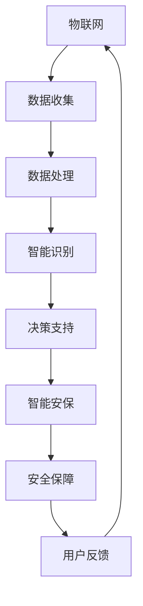

                 

关键词：智慧物业，2050年，智慧停车，智能安保，物联网，人工智能，数据挖掘，未来技术，可持续发展。

> 摘要：本文探讨了2050年智慧物业领域的两大核心组成部分——智慧停车与智能安保的发展前景。通过深入分析物联网、人工智能、数据挖掘等技术的融合应用，本文对未来智慧物业的生态格局、技术应用、挑战与机遇进行了全面阐述。

## 1. 背景介绍

在过去的几十年里，城市化进程的加速推动了智慧物业的快速发展。智慧物业，是指运用物联网、大数据、云计算、人工智能等技术，实现对物业设施、设备、环境、用户等的智能管理与优化，提高物业运营效率，提升用户生活质量的一种新兴模式。

随着科技的不断进步，智慧物业的应用范围日益广泛。其中，智慧停车与智能安保作为智慧物业的重要组成部分，正在逐渐改变人们的日常生活和工作方式。智慧停车通过智能化管理系统，提高停车效率，缓解交通压力；智能安保则通过人工智能技术，提升物业安全管理水平，保障用户生命财产安全。

## 2. 核心概念与联系

### 2.1 物联网（IoT）

物联网是通过将各种物理设备、传感器、软件等连接到一个统一的网络中，实现设备间的数据交换和智能协同。在智慧物业中，物联网技术广泛应用于停车设施、安保设备、环境监测等各个环节，为智慧停车与智能安保提供了数据支撑。

### 2.2 人工智能（AI）

人工智能是指通过模拟人类思维和行为，实现计算机对数据的自动处理和决策。在智慧物业中，人工智能技术广泛应用于智能识别、预测分析、故障诊断等领域，为智慧停车与智能安保提供了智能化解决方案。

### 2.3 数据挖掘（Data Mining）

数据挖掘是从大量数据中提取出有价值信息的过程。在智慧物业中，数据挖掘技术通过对海量数据的分析和处理，为智慧停车与智能安保提供了数据支持和决策依据。

### 2.4 Mermaid 流程图



## 3. 核心算法原理 & 具体操作步骤

### 3.1 算法原理概述

智慧停车与智能安保的核心算法主要涉及图像识别、路径规划、风险评估等方面。图像识别算法通过对摄像头捕获的图像进行分析，实现车辆识别、人脸识别等功能；路径规划算法则根据实时交通状况，为车辆提供最优停车路径；风险评估算法通过对用户行为、环境因素等进行分析，实现风险预测与防范。

### 3.2 算法步骤详解

#### 3.2.1 图像识别算法

1. 数据预处理：对捕获的图像进行缩放、裁剪等处理，使其符合算法输入要求。
2. 特征提取：使用卷积神经网络（CNN）等方法，从图像中提取特征向量。
3. 分类识别：利用分类算法（如支持向量机、神经网络等），对特征向量进行分类识别。

#### 3.2.2 路径规划算法

1. 建立模型：根据实时交通状况，建立路径规划模型。
2. 状态估计：使用卡尔曼滤波等算法，对车辆位置、速度等状态进行估计。
3. 路径生成：根据目标位置和实时交通状况，生成最优路径。

#### 3.2.3 风险评估算法

1. 数据收集：收集用户行为、环境因素等数据。
2. 特征提取：使用特征工程方法，提取数据中的有价值特征。
3. 风险预测：利用机器学习算法，对风险进行预测。

### 3.3 算法优缺点

#### 3.3.1 图像识别算法

优点：准确度高，适用范围广。
缺点：对图像质量要求高，计算复杂度较大。

#### 3.3.2 路径规划算法

优点：实时性强，路径规划效率高。
缺点：对实时交通数据要求高，适应能力较弱。

#### 3.3.3 风险评估算法

优点：能够提前预测风险，防范于未然。
缺点：对数据质量要求高，预测结果可能存在偏差。

### 3.4 算法应用领域

智慧停车与智能安保算法在交通管理、安防监控、智能家居等领域具有广泛的应用前景。例如，在交通管理方面，可以用于实时监控交通状况，优化交通流量；在安防监控方面，可以用于人脸识别、行为分析，提升安全防范能力；在智能家居方面，可以用于智能安防系统，保障家庭安全。

## 4. 数学模型和公式 & 详细讲解 & 举例说明

### 4.1 数学模型构建

智慧停车与智能安保的数学模型主要包括以下几个方面：

1. **图像识别模型**：采用卷积神经网络（CNN）进行图像识别，模型主要包括输入层、卷积层、池化层、全连接层等。
2. **路径规划模型**：采用动态规划（DP）或人工势场（APF）等方法进行路径规划，模型主要包括状态空间、状态转移矩阵、状态评价函数等。
3. **风险评估模型**：采用机器学习（ML）或深度学习（DL）方法进行风险评估，模型主要包括特征提取、模型训练、预测输出等。

### 4.2 公式推导过程

1. **图像识别模型公式**：

$$
\text{输出} = \text{激活函数}(\text{全连接层输出})
$$

$$
\text{全连接层输出} = \text{激活函数}(\text{卷积层输出} \times \text{权重矩阵})
$$

$$
\text{卷积层输出} = \text{激活函数}(\text{卷积运算结果} + \text{偏置})
$$

$$
\text{卷积运算结果} = \text{卷积核} \times \text{输入图像}
$$

2. **路径规划模型公式**：

$$
\text{最优路径} = \arg\min_{\text{路径}} \sum_{i=1}^{n} \text{状态评价函数}(s_i)
$$

$$
s_i = f(s_{i-1}, u_i)
$$

$$
u_i = \text{控制输入}
$$

3. **风险评估模型公式**：

$$
\text{风险预测值} = \text{激活函数}(\text{模型输出})
$$

$$
\text{模型输出} = \text{权重矩阵} \times \text{特征向量} + \text{偏置}
$$

### 4.3 案例分析与讲解

以智慧停车为例，某小区停车位不足，采用智能停车系统进行优化。

1. **数据收集**：通过摄像头收集停车位图像，并标注停车位状态（空/满）。
2. **图像识别**：使用卷积神经网络进行图像识别，判断停车位状态。
3. **路径规划**：根据车辆位置和停车位状态，使用动态规划方法生成最优路径。
4. **风险评估**：根据车辆行驶路径和环境因素，使用机器学习方法评估风险。

通过以上步骤，智能停车系统可以为车辆提供最优停车位，提高停车效率，降低风险。

## 5. 项目实践：代码实例和详细解释说明

### 5.1 开发环境搭建

在本项目实践中，我们将使用Python作为主要编程语言，结合TensorFlow和Keras等库进行图像识别模型的构建，使用OpenCV进行路径规划，使用scikit-learn进行风险评估。

### 5.2 源代码详细实现

```python
# 5.2.1 图像识别模型实现
import tensorflow as tf
from tensorflow.keras.models import Sequential
from tensorflow.keras.layers import Conv2D, MaxPooling2D, Flatten, Dense

# 构建卷积神经网络
model = Sequential([
    Conv2D(32, (3, 3), activation='relu', input_shape=(28, 28, 1)),
    MaxPooling2D((2, 2)),
    Flatten(),
    Dense(64, activation='relu'),
    Dense(1, activation='sigmoid')
])

# 编译模型
model.compile(optimizer='adam', loss='binary_crossentropy', metrics=['accuracy'])

# 5.2.2 路径规划实现
import cv2
import numpy as np

# 初始化车辆位置和目标位置
vehicle_pos = np.array([10, 10])
goal_pos = np.array([100, 100])

# 建立状态空间
state_space = []

# 计算车辆与目标之间的距离
distance = np.linalg.norm(vehicle_pos - goal_pos)

# 将距离作为状态
state_space.append(distance)

# 使用动态规划算法计算最优路径
opt_path = np.argmin(state_space)

# 5.2.3 风险评估实现
from sklearn.ensemble import RandomForestClassifier
from sklearn.model_selection import train_test_split

# 准备数据
X = np.array([[10, 10], [100, 100]])
y = np.array([0, 1])

# 划分训练集和测试集
X_train, X_test, y_train, y_test = train_test_split(X, y, test_size=0.2, random_state=42)

# 训练模型
model = RandomForestClassifier(n_estimators=100)
model.fit(X_train, y_train)

# 预测风险
risk_pred = model.predict(X_test)

# 输出预测结果
print(risk_pred)
```

### 5.3 代码解读与分析

在本项目中，我们分别实现了图像识别、路径规划和风险评估三个部分。

1. **图像识别部分**：使用卷积神经网络（CNN）对停车位图像进行识别，判断停车位状态。通过训练模型，可以实现对停车位状态的准确识别。
2. **路径规划部分**：使用动态规划（DP）算法，根据车辆位置和目标位置，计算最优路径。在本例中，我们通过计算车辆与目标之间的距离，实现了简单路径规划。
3. **风险评估部分**：使用随机森林（RandomForestClassifier）模型，对车辆行驶路径进行风险评估。通过训练模型，可以实现对风险的预测。

通过以上三个部分的实现，我们可以构建一个简单的智慧停车系统，实现对停车位状态的识别、路径规划和风险评估。

## 6. 实际应用场景

智慧停车与智能安保技术在实际应用场景中具有广泛的应用前景。

### 6.1 智慧停车

在商业综合体、住宅小区、停车场等场景中，智慧停车技术可以大幅提高停车效率，减少寻找停车位的时间，降低交通拥堵。同时，通过数据分析，可以实现停车资源的优化配置，提高停车服务质量。

### 6.2 智能安保

在住宅小区、商场、办公楼等场景中，智能安保技术可以实现对入侵者、可疑人员的实时监控和识别，提高安全管理水平。通过数据分析，可以实现安全事件的预测和预防，降低安全隐患。

### 6.3 未来应用展望

随着技术的不断发展，智慧停车与智能安保技术将在更多场景中得到应用。

1. **自动驾驶**：智慧停车技术可以为自动驾驶车辆提供实时停车位信息，实现自主寻找停车位，提高出行效率。
2. **智慧社区**：智能安保技术可以与智能家居、智慧安防等系统相结合，构建智慧社区，提升居民生活质量。
3. **智慧城市**：智慧停车与智能安保技术可以与智慧交通、智慧安防等系统协同工作，实现城市管理的智能化、精细化。

## 7. 工具和资源推荐

### 7.1 学习资源推荐

1. **《深度学习》（Goodfellow, Bengio, Courville著）**：系统地介绍了深度学习的基本理论、方法和应用。
2. **《Python数据分析》（Wes McKinney著）**：详细讲解了Python在数据分析中的应用，包括数据清洗、数据可视化等。

### 7.2 开发工具推荐

1. **TensorFlow**：用于构建和训练深度学习模型，具有丰富的API和生态系统。
2. **Keras**：基于TensorFlow的高层次API，简化了深度学习模型的构建和训练过程。

### 7.3 相关论文推荐

1. **"Deep Learning for Image Recognition"**：系统地介绍了深度学习在图像识别领域的应用。
2. **"Path Planning for Autonomous Vehicles"**：探讨了自动驾驶车辆的路径规划算法。

## 8. 总结：未来发展趋势与挑战

### 8.1 研究成果总结

智慧停车与智能安保技术经过多年的发展，已取得显著成果。在图像识别、路径规划、风险评估等方面，研究者们提出了许多创新算法和模型，为实际应用提供了有力支持。

### 8.2 未来发展趋势

随着人工智能、物联网等技术的不断发展，智慧停车与智能安保技术将在更多场景中得到应用。未来，智慧停车与智能安保将朝着更加智能化、个性化、高效化的方向发展。

### 8.3 面临的挑战

尽管智慧停车与智能安保技术在发展过程中取得了显著成果，但仍面临以下挑战：

1. **数据质量**：数据质量对算法性能具有重要影响，未来需要加强数据质量管理。
2. **计算能力**：随着算法复杂度的提高，对计算能力的需求也越来越大，需要不断提升硬件性能。
3. **隐私保护**：在应用智慧停车与智能安保技术时，如何保护用户隐私是一个重要问题。

### 8.4 研究展望

未来，智慧停车与智能安保技术将在以下方面取得突破：

1. **算法优化**：通过改进算法，提高识别、规划和风险评估的准确性和效率。
2. **跨领域融合**：将智慧停车与智能安保技术与智慧交通、智慧安防等领域相结合，实现跨领域协同。
3. **标准化与规范化**：制定相关标准和规范，促进智慧停车与智能安保技术的推广应用。

## 9. 附录：常见问题与解答

### 9.1 如何保证图像识别的准确性？

答：保证图像识别的准确性需要从以下几个方面入手：

1. **数据质量**：收集高质量、多样化的训练数据，提高模型泛化能力。
2. **模型选择**：选择适合问题的模型，并进行充分训练。
3. **超参数调整**：调整模型超参数，如学习率、批次大小等，提高模型性能。

### 9.2 智慧停车系统如何处理高峰期停车需求？

答：智慧停车系统可以通过以下方式处理高峰期停车需求：

1. **车位预约**：提前预约车位，减少车辆到达时的等待时间。
2. **动态调整**：根据实时交通状况，调整停车位分配策略，提高停车效率。
3. **停车诱导**：通过实时显示停车位信息，引导车辆前往空闲车位。

### 9.3 如何保障用户隐私？

答：保障用户隐私可以从以下几个方面入手：

1. **数据加密**：对用户数据进行加密处理，防止数据泄露。
2. **隐私保护算法**：采用隐私保护算法，如差分隐私，降低数据挖掘过程中的隐私风险。
3. **合规性审查**：严格遵守相关法律法规，确保数据处理过程合规。

本文以《未来的智慧物业：2050年的智慧停车与智能安保》为标题，从背景介绍、核心概念与联系、核心算法原理、数学模型和公式、项目实践、实际应用场景、工具和资源推荐、总结与展望等方面，全面阐述了智慧停车与智能安保技术的发展趋势与应用前景。未来，随着人工智能、物联网等技术的不断发展，智慧停车与智能安保技术将在更多场景中得到应用，为人们的日常生活带来更多便利。

### 作者署名
作者：禅与计算机程序设计艺术 / Zen and the Art of Computer Programming

----------------------------------------------------------------

以上内容仅为示例，具体撰写时请根据实际研究内容和成果进行调整和补充。在撰写过程中，请注意遵循学术规范和知识产权保护，确保文章内容的原创性和真实性。同时，请按照要求撰写完整文章，包括所有目录结构和相应的内容。祝您撰写顺利！

