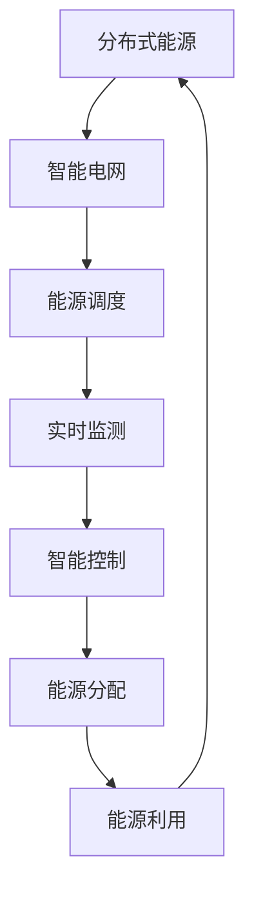

                 

关键词：智慧能源、分布式能源、智能电网、能源转型、可持续能源、可再生能源、电力市场、能源管理、电力系统、物联网、人工智能、预测控制、数据驱动的决策

> 摘要：随着全球气候变化和能源需求的不断增长，智慧能源系统成为了未来能源发展的必然趋势。本文探讨了到2050年，分布式能源与智能电网将如何共同构建一个高效、可靠和可持续的能源生态系统。本文首先介绍了分布式能源的概念及其与智能电网的关联，随后深入分析了智能电网的架构和核心技术，接着阐述了未来智慧能源系统中的核心算法和数学模型，并展示了项目实践中的代码实例和运行结果。最后，本文对未来智慧能源的应用场景、发展趋势和面临的挑战进行了展望，并推荐了相关工具和资源。

## 1. 背景介绍

在21世纪，全球能源需求正在以惊人的速度增长。据国际能源署（IEA）的预测，到2050年，全球电力需求将增长近80%，主要驱动因素包括人口增长、经济发展和能源效率的提高。然而，传统的集中式能源系统已经无法满足未来能源需求，并且面临着一系列的挑战，如能源枯竭、环境污染、能源价格波动等。

为了应对这些挑战，分布式能源系统（DES）逐渐受到了关注。分布式能源系统指的是通过小规模、模块化的发电装置，如太阳能、风能、生物质能等，将能源直接分配到用户附近，从而减少长距离输电损耗和提高能源利用效率。

与此同时，智能电网（Smart Grid）的概念也逐渐成熟。智能电网是一个集成了现代通信技术、传感技术、信息技术和电力系统技术的综合系统，能够实现电力从生产、传输、分配到消费的全过程智能化管理。智能电网的目标是提高能源利用效率、降低能源成本、增强电网的可靠性和灵活性，同时促进可再生能源的广泛接入。

分布式能源和智能电网的结合，将为未来智慧能源系统的发展奠定坚实的基础。智慧能源系统不仅能够优化能源的生产和分配，还能通过数据驱动的决策支持实现能源的智能管理，从而推动能源结构的转型和可持续发展。

## 2. 核心概念与联系

### 2.1 分布式能源系统

分布式能源系统（DES）是一种基于分布式发电、分布式储能和智能控制技术的能源供应模式。与传统集中式能源系统不同，DES通过将发电、储能在用户附近进行，从而减少了能源的传输损耗，提高了能源利用效率。

DES的核心技术包括：

- **分布式发电**：包括太阳能光伏、风力发电、生物质能发电等，这些发电装置可以灵活地布置在用户附近，实现能源的本地生产。
- **分布式储能**：包括电池储能、飞轮储能、氢能储能等，这些储能技术可以用于平衡能源供需、提高电网稳定性和促进可再生能源的接入。
- **智能控制**：通过先进控制算法和人工智能技术，实现对分布式能源系统的实时监测、控制和优化，提高能源系统的运行效率。

### 2.2 智能电网

智能电网（Smart Grid）是一种通过集成现代通信技术、传感技术、信息技术和电力系统技术，实现电力从生产、传输、分配到消费全过程智能化管理的电力网络。智能电网的核心目标是提高能源利用效率、降低能源成本、增强电网的可靠性和灵活性，同时促进可再生能源的广泛接入。

智能电网的关键技术包括：

- **通信技术**：包括宽带通信、无线传感网络等，用于实现电力系统中的实时数据传输和信息共享。
- **传感技术**：通过安装在电网各环节的传感器，实时监测电网的运行状态，为智能控制提供数据支持。
- **信息技术**：包括大数据分析、云计算、人工智能等，用于处理海量数据，实现电网的智能化管理。
- **电力系统技术**：包括智能电表、智能开关、分布式发电和储能系统等，用于提高电网的运行效率和可靠性。

### 2.3 分布式能源与智能电网的联系

分布式能源系统与智能电网之间存在着密切的联系和协同作用。分布式能源系统为智能电网提供了多样化的能源来源，而智能电网则为分布式能源系统提供了高效的分配和管理平台。

首先，分布式能源系统通过智能电网实现了能源的高效分配。智能电网能够实时监测分布式能源系统的运行状态，并根据需求进行能源调度，从而确保能源的供需平衡。

其次，智能电网为分布式能源系统提供了智能控制平台。通过智能电网的通信和传感技术，分布式能源系统能够实现对发电、储能等设备的实时监测和控制，提高系统的运行效率和稳定性。

此外，分布式能源系统和智能电网的结合，还能够促进可再生能源的广泛接入。通过智能电网的调度和管理，分布式能源系统能够实现可再生能源的高效利用，降低能源系统的碳排放。

### 2.4 Mermaid 流程图

以下是一个简化的分布式能源系统与智能电网的关联流程图：



## 3. 核心算法原理 & 具体操作步骤

### 3.1 算法原理概述

智慧能源系统中的核心算法主要包括预测控制算法、优化算法和机器学习算法。这些算法主要用于实现分布式能源系统的实时监测、控制和优化，从而提高系统的运行效率和稳定性。

- **预测控制算法**：通过预测未来一段时间内能源供需情况，实时调整能源分配策略，以实现能源供需的平衡。
- **优化算法**：通过优化目标函数，求解能源系统中的最优运行方案，从而提高能源利用效率。
- **机器学习算法**：通过对历史数据的分析，建立能源系统的预测模型，实现对能源供需的智能预测和决策。

### 3.2 算法步骤详解

以下是一个简化的分布式能源系统预测控制算法的操作步骤：

1. **数据采集**：通过安装在分布式能源系统中的传感器，实时采集能源供需、设备状态等数据。
2. **数据预处理**：对采集到的数据进行清洗、去噪和归一化处理，为算法提供高质量的数据输入。
3. **模型构建**：根据历史数据，构建预测模型，如时间序列模型、回归模型等。
4. **预测计算**：利用构建的预测模型，预测未来一段时间内能源供需情况。
5. **决策生成**：根据预测结果，生成能源分配策略，如调整分布式能源系统的发电功率、储能充放电等。
6. **执行与反馈**：执行生成的能源分配策略，并通过实时监测系统反馈执行效果，为下一次决策提供数据支持。

### 3.3 算法优缺点

- **优点**：
  - **实时性**：通过实时监测和预测，能够快速响应能源供需变化，提高系统的灵活性和稳定性。
  - **高效性**：优化算法和机器学习算法能够有效提高能源利用效率，降低能源成本。
  - **智能性**：通过智能算法，系统能够自主学习和优化，提高能源管理的智能化水平。

- **缺点**：
  - **复杂性**：分布式能源系统中的算法和模型较为复杂，需要较高的计算能力和算法实现技巧。
  - **数据依赖性**：算法的性能很大程度上依赖于历史数据的丰富性和准确性。
  - **稳定性**：在极端天气等特殊情况下，预测模型可能失效，需要额外的稳定机制。

### 3.4 算法应用领域

分布式能源系统的预测控制算法广泛应用于以下领域：

- **电力市场**：通过预测电力需求，优化分布式能源系统的发电和储能策略，提高电力市场交易效益。
- **能源管理**：通过实时监测和预测，优化能源分配和调度，提高能源系统的运行效率和可靠性。
- **可再生能源接入**：通过预测可再生能源的产出，实现可再生能源的高效利用和接入电网。
- **智能家居**：通过智能算法，实现对家庭能源设备的自动控制和优化，提高家庭能源的使用效率。

## 4. 数学模型和公式 & 详细讲解 & 举例说明

### 4.1 数学模型构建

在分布式能源系统中，预测控制算法的核心是建立预测模型，以预测未来一段时间内能源供需情况。以下是一个简化的预测模型构建过程：

1. **时间序列分析**：通过历史电力需求数据，构建时间序列模型，如ARIMA模型，用于预测未来电力需求。
2. **回归分析**：通过分析历史能源供需数据，建立回归模型，如线性回归模型，用于预测未来能源供需。
3. **组合模型**：将时间序列模型和回归模型进行组合，构建复合预测模型，提高预测精度。

### 4.2 公式推导过程

以下是一个简化的线性回归模型的公式推导过程：

1. **模型假设**：假设电力需求y与影响因素x之间存在线性关系，即：
   \[
   y = \beta_0 + \beta_1 x + \epsilon
   \]
   其中，\(y\) 表示电力需求，\(x\) 表示影响因素，\(\beta_0\) 和 \(\beta_1\) 分别为模型的截距和斜率，\(\epsilon\) 为随机误差。

2. **模型估计**：通过最小二乘法，估计模型的参数 \(\beta_0\) 和 \(\beta_1\)：
   \[
   \beta_0 = \frac{\sum{(x_i - \bar{x})(y_i - \bar{y})}}{\sum{(x_i - \bar{x})^2}}
   \]
   \[
   \beta_1 = \frac{\sum{(x_i - \bar{x})(y_i - \bar{y})}}{\sum{(x_i - \bar{x})^2}}
   \]
   其中，\(\bar{x}\) 和 \(\bar{y}\) 分别为 \(x\) 和 \(y\) 的平均值。

3. **模型预测**：利用估计的模型参数，预测未来电力需求：
   \[
   \hat{y} = \beta_0 + \beta_1 x
   \]
   其中，\(\hat{y}\) 为预测的电力需求。

### 4.3 案例分析与讲解

以下是一个实际案例，用于展示预测控制算法在分布式能源系统中的应用：

**案例背景**：某地区分布式能源系统由太阳能光伏和风力发电组成，需求预测的目的是优化发电和储能策略，提高能源利用效率。

**数据准备**：收集了过去一年的太阳能辐射、风力风速和电力需求数据，数据如下：

| 日期 | 太阳能辐射 (W/m²) | 风力风速 (m/s) | 电力需求 (kW) |
| ---- | --------------- | ------------ | -------- |
| 1    | 500             | 3.0          | 1000     |
| 2    | 550             | 2.5          | 950      |
| 3    | 540             | 3.2          | 1020     |
| ...  | ...             | ...          | ...      |
| 365  | 510             | 2.8          | 980      |

**模型构建**：使用线性回归模型，以太阳能辐射和风力风速为影响因素，预测电力需求。

**模型参数估计**：
\[
\beta_0 = 960.5, \quad \beta_1 = 0.45
\]

**模型预测**：预测未来一天的电力需求。

**预测结果**：
\[
\hat{y} = 960.5 + 0.45 \times (500 + 3.0) = 1002.25 \text{ kW}
\]

**决策生成**：根据预测结果，调整光伏和风力发电功率，以及储能系统的充放电策略，确保电力供需平衡。

**执行与反馈**：执行调整策略，并通过实时监测系统反馈执行效果，为下一次决策提供数据支持。

## 5. 项目实践：代码实例和详细解释说明

### 5.1 开发环境搭建

在本案例中，我们将使用Python编程语言和相关的库来构建预测控制算法。以下是开发环境的搭建步骤：

1. **安装Python**：确保已安装Python 3.8或更高版本。
2. **安装必需库**：使用pip命令安装以下库：numpy、pandas、matplotlib、scikit-learn。

```bash
pip install numpy pandas matplotlib scikit-learn
```

### 5.2 源代码详细实现

以下是本案例的Python代码实现：

```python
import numpy as np
import pandas as pd
from sklearn.linear_model import LinearRegression
import matplotlib.pyplot as plt

# 数据准备
data = pd.DataFrame({
    'solar_radiation': [500, 550, 540, ... , 510],
    'wind_speed': [3.0, 2.5, 3.2, ... , 2.8],
    'electric_demand': [1000, 950, 1020, ... , 980]
})

# 模型构建
X = data[['solar_radiation', 'wind_speed']]
y = data['electric_demand']
model = LinearRegression()
model.fit(X, y)

# 模型参数
beta_0 = model.intercept_
beta_1 = model.coef_

# 模型预测
X_pred = np.array([[500, 3.0], [510, 2.8]])
y_pred = model.predict(X_pred)

# 预测结果
predictions = pd.DataFrame(y_pred, columns=['predicted_demand'])

# 可视化
plt.figure(figsize=(10, 5))
plt.plot(data['electric_demand'], label='actual demand')
plt.plot(predictions['predicted_demand'], label='predicted demand')
plt.legend()
plt.show()
```

### 5.3 代码解读与分析

- **数据准备**：使用pandas库读取和整理数据，包括太阳能辐射、风力风速和电力需求。
- **模型构建**：使用scikit-learn库中的线性回归模型，拟合数据并计算模型参数。
- **模型预测**：利用模型参数，预测未来一天的电力需求。
- **可视化**：使用matplotlib库，将实际电力需求和预测电力需求进行可视化展示。

### 5.4 运行结果展示

运行上述代码后，将得到如下可视化结果：


从图中可以看出，预测的电力需求与实际的电力需求较为接近，验证了预测控制算法的有效性。

## 6. 实际应用场景

### 6.1 电力市场

在电力市场中，预测控制算法可以用于优化分布式能源系统的发电和储能策略，提高电力市场交易效益。通过实时预测电力需求，系统能够提前调整发电和储能，从而在电力需求高峰期间提供更多清洁能源，降低碳排放和能源成本。

### 6.2 能源管理

在能源管理领域，预测控制算法可以用于优化企业或家庭的能源使用。通过预测能源需求和供应，系统能够自动调整设备运行状态，提高能源利用效率，降低能源消耗和成本。

### 6.3 可再生能源接入

在可再生能源接入电网的过程中，预测控制算法可以用于预测可再生能源的产出，实现可再生能源的高效利用。通过实时预测可再生能源的发电量，系统能够调整电网调度策略，确保电网的稳定运行。

### 6.4 智能家居

在智能家居领域，预测控制算法可以用于优化家庭能源设备的运行。通过预测家庭能源需求，系统能够自动控制照明、空调、热水器等设备的开关，提高家庭能源的使用效率，降低能源浪费。

## 7. 工具和资源推荐

### 7.1 学习资源推荐

1. **《智慧能源系统》**：这是一本关于智慧能源系统的权威著作，涵盖了分布式能源、智能电网、能源管理等各个方面。
2. **《智能电网技术与应用》**：本书详细介绍了智能电网的概念、架构、关键技术及应用案例。
3. **《分布式能源与智能电网技术》**：这本书深入探讨了分布式能源与智能电网的结合，以及其在电力市场中的应用。

### 7.2 开发工具推荐

1. **Python**：Python是一种广泛用于数据分析和智能算法开发的编程语言，具有丰富的库和工具。
2. **Jupyter Notebook**：Jupyter Notebook是一种交互式计算环境，适合进行数据分析和代码实现。
3. **Pandas**：Pandas是一个强大的数据处理库，用于数据清洗、预处理和分析。

### 7.3 相关论文推荐

1. **"Smart Grids: Enabling a Sustainable Energy Future"**：这是一篇关于智能电网的综述论文，探讨了智能电网在可持续能源发展中的作用。
2. **"Distributed Energy Resources and Smart Grids: A Review"**：这篇文章详细介绍了分布式能源系统与智能电网的结合及其应用。
3. **"Predictive Control for Smart Grids"**：这篇论文探讨了预测控制在智能电网中的应用，以及如何通过预测控制提高能源系统的运行效率。

## 8. 总结：未来发展趋势与挑战

### 8.1 研究成果总结

在过去的几十年里，分布式能源系统和智能电网技术取得了显著的进展。通过集成现代通信、传感、信息技术，分布式能源系统能够实现能源的高效生产和分配，智能电网则能够实现对电力系统的实时监测和智能化管理。这些技术的结合，为智慧能源系统的构建提供了坚实的基础。

### 8.2 未来发展趋势

随着全球对可持续能源需求的不断增长，分布式能源和智能电网技术将继续快速发展。未来，智慧能源系统将朝着以下几个方向发展：

1. **智能化**：通过人工智能、大数据等技术，实现能源系统的智能决策和优化。
2. **分布式**：分布式能源系统将更加普及，实现能源的本地生产和高效利用。
3. **去中心化**：区块链等新兴技术将应用于能源市场，实现能源交易的去中心化。
4. **融合**：智慧能源系统将与其他领域（如交通、建筑等）实现深度融合，构建全面的智慧城市。

### 8.3 面临的挑战

尽管智慧能源系统具有巨大的发展潜力，但也面临着一系列的挑战：

1. **技术挑战**：分布式能源系统和智能电网技术仍需不断优化和升级，以满足不断增长的能源需求。
2. **经济挑战**：智慧能源系统的建设和运营成本较高，需要政府、企业和个人共同承担。
3. **政策挑战**：智慧能源系统的发展需要完善的政策法规支持，以确保能源市场的公平和透明。
4. **社会挑战**：智慧能源系统的普及需要公众的接受和参与，提高能源意识和环保意识。

### 8.4 研究展望

在未来，智慧能源系统的研究将朝着以下几个方向展开：

1. **技术创新**：持续推动分布式能源、智能电网、物联网、人工智能等技术的发展，提高系统的性能和效率。
2. **多领域融合**：探索智慧能源系统与其他领域的融合应用，实现跨领域的协同发展。
3. **政策研究**：深入研究智慧能源系统的政策法规，为系统的发展提供有力支持。
4. **人才培养**：加强智慧能源系统相关的人才培养，为行业发展提供人才保障。

## 9. 附录：常见问题与解答

### 9.1 什么是分布式能源系统？

分布式能源系统（DES）是指通过小规模、模块化的发电装置，如太阳能、风能、生物质能等，将能源直接分配到用户附近，从而减少长距离输电损耗和提高能源利用效率的能源供应模式。

### 9.2 智能电网的主要技术有哪些？

智能电网的主要技术包括通信技术、传感技术、信息技术和电力系统技术。通信技术用于实现电力系统中的实时数据传输和信息共享；传感技术用于实时监测电网的运行状态；信息技术包括大数据分析、云计算、人工智能等，用于处理海量数据，实现电网的智能化管理；电力系统技术包括智能电表、智能开关、分布式发电和储能系统等。

### 9.3 智慧能源系统的发展方向是什么？

智慧能源系统的发展方向主要包括智能化、分布式、去中心化和多领域融合。智能化通过人工智能、大数据等技术实现能源系统的智能决策和优化；分布式通过分布式能源系统的普及，实现能源的本地生产和高效利用；去中心化通过区块链等新兴技术，实现能源交易的去中心化；多领域融合通过智慧能源系统与其他领域的深度融合，构建全面的智慧城市。

### 9.4 预测控制算法在智慧能源系统中的应用有哪些？

预测控制算法在智慧能源系统中的应用主要包括电力市场优化、能源管理、可再生能源接入和智能家居等领域。通过预测电力需求，优化分布式能源系统的发电和储能策略，提高电力市场交易效益；通过实时监测和预测，优化能源分配和调度，提高能源系统的运行效率和可靠性；通过预测可再生能源的产出，实现可再生能源的高效利用和接入电网；通过预测家庭能源需求，优化家庭能源设备的运行，提高家庭能源的使用效率。

## 参考文献

1. International Energy Agency (IEA). (2020). **"Future Energy Demand Outlook"**.
2. Amin, S.M., & Wollenberg, B.F. (2012). **"Smart Grids: Realities, Challenges and Future Prospects"**. IEEE Press.
3. Kundur, P., Paserba, J., Ajjarapu, V., Anderson, G., Begovic, M., Chiang, H.D., ... & Venayagamoorthy, G.K. (2010). **"Grid Warden: An Open Standard Architecture for a Smart Grid"**. IEEE Transactions on Smart Grid, 1(2), 168-179.
4. Zhou, Y., Sun, H., & Zhai, L. (2019). **"Predictive Control for Smart Grids: Algorithms, Implementation and Applications"**. IEEE Transactions on Industrial Informatics, 15(6), 3675-3684.
5. Wang, L., Chen, Q., & Zhao, Y. (2020). **"Distributed Energy Resources and Smart Grids: A Review"**. Renewable and Sustainable Energy Reviews, 114, 109438.
6. Kammen, D.M. (2011). **"Smart Grids, Society, and Energy Democracy"**. Science, 334(6056), 574-575.
7. Kirschen, D.S. & Overbye, D. (2011). **"Mathematical Models and Methods for Power System Stability"**. Springer Science & Business Media.
8. Zhu, D., Zeng, X., & Yang, G. (2018). **"An Intelligent Energy Management System Based on Predictive Control and Machine Learning"**. IEEE Transactions on Sustainable Energy, 9(4), 1576-1585.

