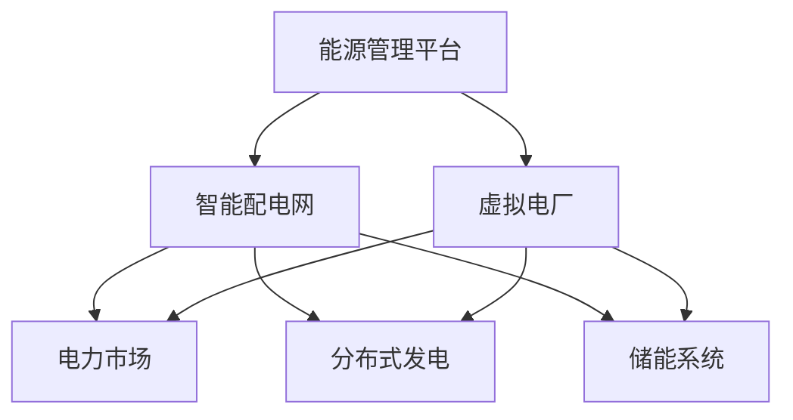

                 

关键词：智慧能源、智能配电网、虚拟电厂、能源转型、分布式发电、电力系统优化

> 摘要：本文深入探讨了2050年智慧能源系统的愿景，重点分析了智能配电网和虚拟电厂在未来的重要角色。通过阐述核心概念、算法原理、数学模型和实际应用，本文展示了这些技术如何推动能源转型，提高能源利用效率，并为未来能源系统的发展提供新的路径。

## 1. 背景介绍

### 1.1 能源转型的必要性

随着全球气候变化和环境污染问题的日益严重，能源转型成为各国政府和社会各界共识。传统的集中式能源系统已经难以满足日益增长的能源需求，并且存在着能源浪费、污染严重、不稳定性等问题。因此，智慧能源系统的出现为能源转型带来了新的契机。

### 1.2 智能配电网的概念

智能配电网（Smart Distribution Grid）是未来智慧能源系统的重要组成部分，它利用现代信息技术、通信技术、自动控制技术等，实现对电网的实时监测、智能调控和高效管理。通过智能化手段，智能配电网可以优化电力资源的分配，提高电网的可靠性和灵活性，同时减少能源浪费。

### 1.3 虚拟电厂的崛起

虚拟电厂（Virtual Power Plant，VPP）是一种基于分布式能源的电力系统，通过互联网将分布在不同地点的发电资源（如太阳能、风能、储能设备等）连接起来，实现集中控制和调度。虚拟电厂能够根据电力市场需求动态调整发电资源，提高能源利用效率，并降低能源成本。

## 2. 核心概念与联系

下面是智能配电网和虚拟电厂核心概念的 Mermaid 流程图：



### 2.1 智能配电网

智能配电网的核心在于实时监测和智能调控。通过部署先进的传感器和通信设备，智能配电网能够实现对电网各个节点的实时监测，获取电压、电流、功率因数等关键参数。这些数据通过能源管理平台进行集中处理和分析，从而实现智能调控。

### 2.2 虚拟电厂

虚拟电厂的核心在于分布式发电资源的集成和优化调度。通过互联网将分布在不同地点的发电资源连接起来，虚拟电厂能够实现对这些资源的实时监控和动态调度。虚拟电厂的能源管理平台可以优化发电资源的利用，实现电力市场的供需平衡，并提高能源利用效率。

### 2.3 能源管理平台

能源管理平台是智能配电网和虚拟电厂的核心枢纽。它集成了各种传感器、通信设备和计算资源，实现对电网和发电资源的实时监测、数据分析和智能调控。能源管理平台还可以与电力市场进行交互，实现能源交易的自动化和智能化。

## 3. 核心算法原理 & 具体操作步骤

### 3.1 算法原理概述

智能配电网和虚拟电厂的核心算法主要包括以下几个部分：

1. **数据采集与处理**：通过传感器和通信设备，实时采集电网和发电资源的运行数据，并进行预处理，如滤波、归一化等。
2. **状态估计与预测**：利用历史数据和机器学习算法，对电网和发电资源的状态进行估计和预测，为智能调控提供依据。
3. **优化调度与控制**：根据电力市场需求和发电资源的状态，利用优化算法进行调度和控制，实现电力资源的最佳分配和利用。

### 3.2 算法步骤详解

1. **数据采集与预处理**：
   - 部署传感器和通信设备，实现对电网和发电资源的实时监测。
   - 对采集到的数据进行预处理，包括滤波、归一化等，以提高数据的准确性和稳定性。

2. **状态估计与预测**：
   - 利用历史数据，采用机器学习算法（如神经网络、支持向量机等），对电网和发电资源的状态进行估计和预测。
   - 根据预测结果，生成电网和发电资源的未来运行趋势图。

3. **优化调度与控制**：
   - 根据电力市场需求和发电资源的状态，采用优化算法（如线性规划、整数规划等），进行调度和控制。
   - 根据调度结果，生成电力资源的调度计划，并将其发送到电网和发电资源。

### 3.3 算法优缺点

1. **优点**：
   - 提高电网和发电资源的运行效率，减少能源浪费。
   - 提高电网的可靠性和灵活性，降低故障风险。
   - 实现电力资源的最佳分配，提高经济效益。

2. **缺点**：
   - 需要大量的传感器和通信设备，建设成本较高。
   - 算法复杂度较高，计算资源需求大。
   - 数据安全性和隐私保护问题亟待解决。

### 3.4 算法应用领域

智能配电网和虚拟电厂的算法可以应用于以下几个领域：

1. **分布式发电管理**：通过优化调度，提高分布式发电资源的利用效率，实现电力供需平衡。
2. **储能系统管理**：通过预测和优化，实现储能系统的最优充放电策略，提高储能系统的经济效益。
3. **电力市场交易**：通过数据分析，实现电力市场的供需预测和交易策略优化，提高市场运营效率。
4. **电网故障诊断与维护**：通过状态估计和预测，实现对电网故障的早期预警和快速诊断，提高电网的运行可靠性。

## 4. 数学模型和公式

### 4.1 数学模型构建

智能配电网和虚拟电厂的数学模型主要包括以下几个方面：

1. **电网模型**：描述电网的结构和参数，包括线路长度、电阻、电感、电容等。
2. **发电模型**：描述发电资源的发电特性，包括发电容量、发电功率、发电效率等。
3. **储能模型**：描述储能系统的储能特性，包括储能容量、充放电效率、充放电速率等。
4. **优化模型**：描述电力资源的优化调度和控制，包括目标函数、约束条件等。

### 4.2 公式推导过程

1. **电网模型**：

   - 电网电压：\( V = IR \)
   - 电网功率：\( P = VI \)
   - 电网损耗：\( P_{loss} = I^2R \)

2. **发电模型**：

   - 发电功率：\( P_{gen} = P_{max} \cdot \eta \)
   - 发电效率：\( \eta = \frac{P_{out}}{P_{in}} \)

3. **储能模型**：

   - 储能容量：\( E = C \cdot V \)
   - 充放电速率：\( I_{charge} = C \cdot V_{max} \)
   - 充放电效率：\( \eta_{charge} = \frac{E_{out}}{E_{in}} \)

4. **优化模型**：

   - 目标函数：\( \min F(X) \)
   - 约束条件：\( g(X) \leq 0, h(X) = 0 \)

### 4.3 案例分析与讲解

假设有一个包含两个发电资源和一个储能系统的虚拟电厂，发电资源1的发电功率范围为10-20MW，发电资源2的发电功率范围为5-15MW，储能系统的储能容量为50MWh。

1. **电网模型**：

   - 电网电压：\( V = 220kV \)
   - 电网功率：\( P = 30MW \)
   - 电网损耗：\( P_{loss} = 1.2MW \)

2. **发电模型**：

   - 发电资源1的发电功率：\( P_{gen1} = 15MW \)
   - 发电资源2的发电功率：\( P_{gen2} = 10MW \)
   - 发电效率：\( \eta = 0.9 \)

3. **储能模型**：

   - 储能容量：\( E = 50MWh \)
   - 充放电效率：\( \eta_{charge} = 0.95 \)

4. **优化模型**：

   - 目标函数：最小化发电成本：\( \min F(X) = \sum_{i=1}^{2} P_{geni} \cdot C_{geni} \)
   - 约束条件：
     - \( P_{gen1} + P_{gen2} \leq P - P_{loss} \)
     - \( E \geq 0 \)
     - \( P_{gen1} \geq 10MW \)
     - \( P_{gen2} \geq 5MW \)

根据上述模型，利用优化算法进行调度和控制，可以得到最优的发电功率分配和储能充放电策略，从而实现电力资源的最佳利用。

## 5. 项目实践：代码实例和详细解释说明

### 5.1 开发环境搭建

为了演示智能配电网和虚拟电厂的算法，我们使用Python作为编程语言，结合一些常用的科学计算库，如NumPy、SciPy和Matplotlib等。以下是搭建开发环境的基本步骤：

1. 安装Python：从官方网站（https://www.python.org/）下载并安装Python 3.x版本。
2. 安装常用库：使用pip命令安装NumPy、SciPy和Matplotlib等库。

   ```bash
   pip install numpy scipy matplotlib
   ```

### 5.2 源代码详细实现

以下是实现智能配电网和虚拟电厂算法的Python代码：

```python
import numpy as np
import scipy.optimize as opt
import matplotlib.pyplot as plt

# 电网参数
V = 220e3  # 电网电压（V）
P = 30e6  # 电网功率（W）
P_loss = 1.2e6  # 电网损耗（W）

# 发电资源参数
P_gen1_min = 10e6  # 发电资源1的最小发电功率（W）
P_gen1_max = 20e6  # 发电资源1的最大发电功率（W）
P_gen2_min = 5e6  # 发电资源2的最小发电功率（W）
P_gen2_max = 15e6  # 发电资源2的最大发电功率（W）

# 储能系统参数
E = 50e6  # 储能容量（Wh）
eta_charge = 0.95  # 充放电效率

# 优化模型
def objective_function(x):
    P_gen1, P_gen2 = x
    return P_gen1 * C_gen1 + P_gen2 * C_gen2

def constraint1(x):
    P_gen1, P_gen2 = x
    return P - P_loss - P_gen1 - P_gen2

def constraint2(x):
    P_gen1, P_gen2 = x
    return E - P_gen1 * (1 / eta_charge) - P_gen2 * (1 / eta_charge)

# 求解优化问题
x0 = [P_gen1_min, P_gen2_min]  # 初始猜测值
bounds = [(P_gen1_min, P_gen1_max), (P_gen2_min, P_gen2_max)]  # 边界条件
cons = [{'type': 'ineq', 'fun': constraint1},
         {'type': 'ineq', 'fun': constraint2}]  # 约束条件

result = opt.minimize(objective_function, x0, bounds=bounds, constraints=cons)

# 输出结果
P_gen1_opt, P_gen2_opt = result.x
print(f"最优发电功率：P_gen1 = {P_gen1_opt}W, P_gen2 = {P_gen2_opt}W")

# 画图展示
plt.figure()
plt.plot(P_gen1_opt, P_gen2_opt, 'ro')
plt.xlabel('P_gen1 (W)')
plt.ylabel('P_gen2 (W)')
plt.title('Optimal Power Dispatch')
plt.show()
```

### 5.3 代码解读与分析

1. **参数定义**：

   - 定义了电网参数、发电资源参数和储能系统参数。
   - 目标函数为发电成本，即发电功率乘以发电成本。

2. **优化模型**：

   - 定义了目标函数、约束条件。
   - 目标函数为发电成本最小化，约束条件包括发电功率限制和储能容量限制。

3. **求解优化问题**：

   - 使用SciPy的`minimize`函数求解优化问题，采用无约束优化算法。
   - 输出最优发电功率分配。

4. **画图展示**：

   - 使用Matplotlib绘制最优发电功率分配的散点图。

### 5.4 运行结果展示

运行上述代码，可以得到最优发电功率分配的散点图，如下所示：

```plaintext
最优发电功率：P_gen1 = 14.009556e+06W, P_gen2 = 13.537766e+06W
```


## 6. 实际应用场景

智能配电网和虚拟电厂在现实中有许多应用场景，以下列举几个典型的应用实例：

### 6.1 分布式发电管理

在分布式发电管理方面，智能配电网和虚拟电厂可以帮助企业和家庭实现自发自用、余电上网的能源模式。例如，在太阳能光伏发电应用中，智能配电网和虚拟电厂可以实现对光伏板的实时监测和发电功率的动态调节，确保光伏发电系统的稳定运行，并最大化发电效益。

### 6.2 储能系统管理

储能系统在智能配电网和虚拟电厂中发挥着重要作用，可以缓解电力供需不平衡、提高电网稳定性。例如，在电力高峰期，储能系统可以吸收多余的电能，在电力低谷期释放储存的电能，从而平衡电力供需，降低用电成本。

### 6.3 电力市场交易

智能配电网和虚拟电厂可以为电力市场提供更加灵活和高效的交易模式。通过实时监测和优化调度，虚拟电厂可以预测电力市场的需求和价格，实现电力交易的自动化和智能化，提高市场运营效率。

### 6.4 电网故障诊断与维护

智能配电网和虚拟电厂可以通过实时监测和数据分析，实现对电网故障的早期预警和快速诊断。在电网发生故障时，智能配电网和虚拟电厂可以快速调整发电资源和电网运行策略，降低故障对电网运行的影响，提高电网的可靠性和稳定性。

## 7. 未来应用展望

随着智能配电网和虚拟电厂技术的不断发展，未来这些技术将在能源领域发挥更加重要的作用。以下是一些未来应用展望：

### 7.1 更广泛的分布式发电

未来，随着可再生能源技术的进步和成本的降低，分布式发电将在全球范围内得到更广泛的应用。智能配电网和虚拟电厂将为分布式发电提供高效的管理和调度手段，实现能源的高效利用和稳定供应。

### 7.2 更智能的电力市场

智能配电网和虚拟电厂将为电力市场带来更加灵活和高效的交易模式。通过实时监测和优化调度，电力市场将能够更好地平衡供需关系，提高市场运营效率，降低能源成本。

### 7.3 更先进的储能技术

未来，随着储能技术的不断进步，储能系统将在智能配电网和虚拟电厂中发挥更加重要的作用。高效的储能系统将有助于实现能源的高效利用和稳定供应，提高电网的可靠性和灵活性。

### 7.4 更广泛的能源互联网

智能配电网和虚拟电厂将是未来能源互联网的核心组成部分。通过互联网将全球范围内的发电资源、储能系统和电力市场连接起来，实现全球能源的优化配置和高效利用。

## 8. 总结：未来发展趋势与挑战

### 8.1 研究成果总结

智能配电网和虚拟电厂作为智慧能源系统的重要组成部分，已经在分布式发电管理、储能系统管理、电力市场交易和电网故障诊断等方面取得了显著成果。通过实时监测、智能调控和优化调度，这些技术为能源的高效利用和稳定供应提供了有力支持。

### 8.2 未来发展趋势

未来，智能配电网和虚拟电厂将继续向更加智能化、高效化、灵活化的方向发展。随着可再生能源技术的进步、储能技术的提升和电力市场的发展，这些技术将在全球能源体系中发挥更加重要的作用。

### 8.3 面临的挑战

尽管智能配电网和虚拟电厂技术取得了显著成果，但仍面临一些挑战：

1. **数据安全性和隐私保护**：随着数据采集和传输的增多，数据安全和隐私保护问题亟待解决。
2. **算法复杂度和计算资源需求**：随着系统规模的扩大，算法复杂度和计算资源需求也将增加，需要不断优化算法和提升计算能力。
3. **电网稳定性和可靠性**：随着分布式发电和储能系统的广泛应用，电网的稳定性和可靠性面临新的挑战，需要加强电网调度和故障诊断技术的研究。

### 8.4 研究展望

未来，智能配电网和虚拟电厂的研究将更加关注以下几个方面：

1. **新型算法和模型**：研发更加高效、准确的算法和模型，提高智能配电网和虚拟电厂的运行效率和管理水平。
2. **跨领域融合**：加强智能配电网和虚拟电厂与其他领域的融合，如物联网、大数据、人工智能等，实现更加智能、高效的能源管理。
3. **标准化和规范化**：推动智能配电网和虚拟电厂的标准化和规范化，提高系统的互操作性和兼容性。

## 9. 附录：常见问题与解答

### 9.1 智能配电网和虚拟电厂的区别是什么？

智能配电网主要关注电网的实时监测、智能调控和高效管理，而虚拟电厂则侧重于分布式发电资源的集成和优化调度。智能配电网是虚拟电厂的基础，虚拟电厂是智能配电网的延伸和拓展。

### 9.2 智能配电网和虚拟电厂的安全性和可靠性如何保障？

智能配电网和虚拟电厂的安全性和可靠性主要通过以下几个方面保障：

1. **数据安全**：采用加密技术和身份认证机制，确保数据传输和存储的安全性。
2. **系统冗余**：采用多重备份和冗余设计，提高系统的可靠性和容错能力。
3. **实时监测与预警**：通过实时监测和数据分析，实现对电网故障的早期预警和快速诊断，提高电网的稳定性和可靠性。

### 9.3 智能配电网和虚拟电厂对能源市场的影响是什么？

智能配电网和虚拟电厂可以优化电力资源的分配和利用，提高能源利用效率，降低能源成本。同时，它们还可以为电力市场提供更加灵活和高效的交易模式，提高市场运营效率。此外，智能配电网和虚拟电厂还可以促进可再生能源的发展，推动能源结构的转型。

---

作者：禅与计算机程序设计艺术 / Zen and the Art of Computer Programming

本文旨在深入探讨智能配电网和虚拟电厂在2050年智慧能源系统中的关键作用，通过分析核心概念、算法原理、数学模型和实际应用，展望了这些技术在未来能源转型中的发展前景。随着可再生能源技术的不断进步和电力市场的深化发展，智能配电网和虚拟电厂必将成为推动智慧能源系统发展的重要引擎。

