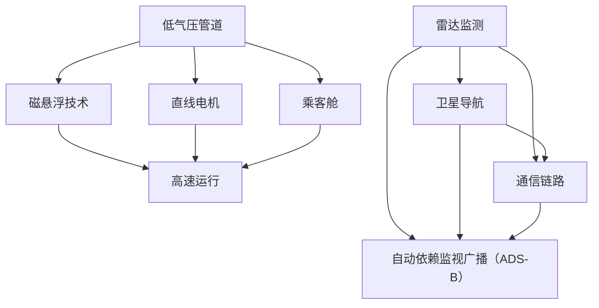
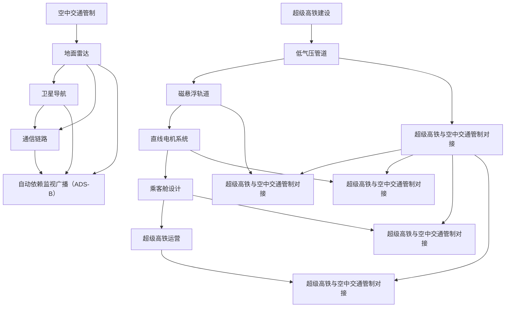

                 

关键词：智能交通、超级高铁、空中交通管制、未来发展趋势、技术挑战

> 摘要：本文将探讨未来智能交通的发展趋势，重点关注2050年的超级高铁与空中交通管制技术。我们将分析这些技术的核心概念、原理及其在实际应用中的潜在影响，旨在为读者提供一个全面的技术视角，探讨未来交通系统的可能形态。

## 1. 背景介绍

智能交通系统（ITS）是指利用先进的信息通信技术、数据采集与处理技术、自动控制技术等，实现交通系统的自动化管理。随着全球城市化进程的加快，交通拥堵、环境污染、能源消耗等问题日益严重，智能交通系统的建设显得尤为重要。目前，智能交通系统的研究和应用主要集中在以下几个方面：智能交通信号控制、智能车辆管理、智能道路基础设施、智能交通信息服务等。

超级高铁（Hyperloop）是一种高速、长距离的运输系统，利用低气压管道和磁悬浮技术实现列车的超高速运行。这种新型交通方式在降低能耗、减少污染、提高运输效率等方面具有显著优势。空中交通管制（Air Traffic Management，ATM）是指利用雷达、通信、导航等技术，对飞行器进行监控、指挥和调度，以确保空中交通的安全和高效。

本文将首先介绍超级高铁与空中交通管制技术的发展背景和现状，然后深入探讨其核心概念、原理及未来应用前景。

### 1.1 超级高铁技术

超级高铁的概念最早由特斯拉（Tesla）公司的创始人埃隆·马斯克（Elon Musk）在2013年提出。马斯克设想通过建设低气压管道，使列车在几乎没有空气阻力的情况下高速运行。这一想法受到了广泛关注，并迅速引发了一系列研究和投资。目前，全球多个国家都在积极研发和建设超级高铁项目。

超级高铁的关键技术包括：

- **磁悬浮技术**：利用磁力使列车悬浮在轨道上，减少摩擦，提高运行速度。
- **低气压管道**：通过降低管道内的气压，减少空气阻力，提高列车速度。
- **直线电机**：利用电磁力推动列车前进，实现高效的动力传输。

### 1.2 空中交通管制技术

空中交通管制技术的发展经历了从地面无线电通信到卫星导航技术的演变。目前，全球范围内广泛使用的空中交通管制技术主要包括：

- **地面雷达**：通过发射和接收电磁波，监测飞行器在空中的位置和速度。
- **卫星导航**：利用卫星信号为飞行器提供精确的位置、速度和时间信息。
- **自动依赖监视广播（ADS-B）**：通过自动广播飞行器的位置和状态信息，实现空中的实时监控和调度。

## 2. 核心概念与联系

### 2.1 超级高铁核心概念

超级高铁的核心概念包括以下几个部分：

1. **低气压管道**：管道内的气压远低于外界大气压，以减少空气阻力，提高列车速度。
2. **磁悬浮技术**：利用磁力使列车悬浮在轨道上，减少摩擦，提高运行速度。
3. **直线电机**：通过电磁力推动列车前进，实现高效的动力传输。
4. **乘客舱**：为乘客提供舒适的乘坐体验，同时确保安全。

### 2.2 空中交通管制核心概念

空中交通管制的核心概念主要包括：

1. **雷达监测**：通过地面雷达监测飞行器的位置、速度等信息。
2. **卫星导航**：利用卫星信号为飞行器提供精确的位置、速度和时间信息。
3. **通信链路**：确保地面控制中心和飞行器之间的实时通信。
4. **自动依赖监视广播（ADS-B）**：通过自动广播飞行器的位置和状态信息，实现空中的实时监控和调度。

### 2.3 Mermaid 流程图

以下是一个简化的Mermaid流程图，展示了超级高铁与空中交通管制技术的核心概念和联系：



### 2.4 核心概念原理及架构的 Mermaid 流程图

以下是超级高铁与空中交通管制的详细流程图，展示了其核心概念、原理和架构：



通过这个流程图，我们可以清晰地看到超级高铁和空中交通管制技术的核心概念、原理和架构，以及它们之间的相互关系和对接方式。

## 3. 核心算法原理 & 具体操作步骤

### 3.1 算法原理概述

超级高铁和空中交通管制技术的核心算法主要包括：

1. **低气压管道设计算法**：用于计算管道直径、长度和气压等参数，以确保列车在低气压环境下的高速运行。
2. **磁悬浮轨道控制算法**：用于实时调整磁悬浮系统，确保列车在轨道上的稳定悬浮。
3. **直线电机驱动算法**：用于计算直线电机的工作参数，包括电流、电压和频率等，以实现高效的列车驱动。
4. **乘客舱舒适度优化算法**：用于计算乘客舱的温度、湿度和空气质量等参数，以提供舒适的乘坐环境。
5. **空中交通管制算法**：用于飞行器的实时监控、指挥和调度，包括雷达监测、卫星导航和通信链路等。

### 3.2 算法步骤详解

#### 3.2.1 低气压管道设计算法

1. **输入参数**：管道长度、列车运行速度、气压等。
2. **计算管道直径**：根据列车运行速度和气压，计算合适的管道直径，以确保低气压环境下的高速运行。
3. **计算管道长度**：根据列车运行速度和管道直径，计算合适的管道长度，以确保列车在管道内的稳定运行。
4. **确定气压**：根据列车运行速度和管道直径，计算合适的气压，以确保低气压环境下的高速运行。

#### 3.2.2 磁悬浮轨道控制算法

1. **输入参数**：列车位置、速度、悬浮高度等。
2. **实时调整磁悬浮系统**：根据列车位置、速度和悬浮高度，实时调整磁悬浮系统的电流和磁场强度，以确保列车在轨道上的稳定悬浮。
3. **监测悬浮状态**：通过传感器监测列车悬浮状态，如有异常，立即调整磁悬浮系统，确保列车安全运行。

#### 3.2.3 直线电机驱动算法

1. **输入参数**：列车速度、驱动电流、驱动电压等。
2. **计算驱动参数**：根据列车速度，计算合适的驱动电流、驱动电压和频率，以实现高效的列车驱动。
3. **调整驱动参数**：根据列车速度和运行状态，实时调整驱动参数，确保列车在最佳运行状态下运行。

#### 3.2.4 乘客舱舒适度优化算法

1. **输入参数**：乘客舱温度、湿度、空气质量等。
2. **计算舒适度参数**：根据乘客舱的温度、湿度和空气质量，计算合适的舒适度参数，以确保乘客的舒适度。
3. **调整环境参数**：根据舒适度参数，实时调整乘客舱的温度、湿度和空气质量，以确保乘客的舒适度。

#### 3.2.5 空中交通管制算法

1. **输入参数**：飞行器位置、速度、高度等。
2. **雷达监测**：通过地面雷达监测飞行器的位置和速度，确保飞行器在安全范围内飞行。
3. **卫星导航**：通过卫星导航为飞行器提供精确的位置、速度和时间信息，确保飞行器按照预定航线飞行。
4. **通信链路**：确保地面控制中心和飞行器之间的实时通信，确保飞行器能够及时接收到管制指令。

### 3.3 算法优缺点

#### 3.3.1 低气压管道设计算法

**优点**：计算简单，可快速得到管道直径、长度和气压等参数。

**缺点**：对输入参数的依赖较大，如果输入参数不准确，可能导致管道设计不合理。

#### 3.3.2 磁悬浮轨道控制算法

**优点**：实时调整磁悬浮系统，确保列车在轨道上的稳定悬浮。

**缺点**：对传感器精度要求较高，否则可能导致悬浮不稳定。

#### 3.3.3 直线电机驱动算法

**优点**：计算简单，可快速得到驱动电流、驱动电压和频率等参数。

**缺点**：对输入参数的依赖较大，如果输入参数不准确，可能导致驱动参数不合理。

#### 3.3.4 乘客舱舒适度优化算法

**优点**：实时调整乘客舱的温度、湿度和空气质量，确保乘客的舒适度。

**缺点**：对输入参数的依赖较大，如果输入参数不准确，可能导致舒适度不理想。

#### 3.3.5 空中交通管制算法

**优点**：实时监控、指挥和调度飞行器，确保空中交通的安全和高效。

**缺点**：对通信链路和雷达监测的依赖较大，如果通信链路中断或雷达监测失效，可能导致空中交通管制失效。

### 3.4 算法应用领域

#### 3.4.1 超级高铁

**应用领域**：主要用于高速、长距离的货物运输和客运服务。

**具体应用**：例如，连接城市与城市之间的快速交通，替代传统的铁路和公路运输。

#### 3.4.2 空中交通管制

**应用领域**：主要用于空中交通的管理和调度，确保空中交通的安全和高效。

**具体应用**：例如，机场的空中交通管制，航班调度，空中交通监控等。

## 4. 数学模型和公式 & 详细讲解 & 举例说明

### 4.1 数学模型构建

在超级高铁和空中交通管制技术中，数学模型是理解和优化系统性能的关键工具。以下是几个关键的数学模型和公式的构建过程。

#### 4.1.1 低气压管道设计

**公式1：管道直径计算**

$$ D = \sqrt{\frac{v^2 \cdot P_0}{P}} $$

其中，\(D\) 为管道直径，\(v\) 为列车速度，\(P_0\) 为标准大气压，\(P\) 为管道内的气压。

**公式2：管道长度计算**

$$ L = \frac{D^2 \cdot v}{2 \cdot g} $$

其中，\(L\) 为管道长度，\(g\) 为重力加速度。

#### 4.1.2 磁悬浮轨道控制

**公式3：悬浮高度计算**

$$ h = \frac{B^2 \cdot \mu_0 \cdot I^2}{2 \cdot g} $$

其中，\(h\) 为悬浮高度，\(B\) 为磁感应强度，\(\mu_0\) 为真空磁导率，\(I\) 为通过磁悬浮系统的电流。

#### 4.1.3 直线电机驱动

**公式4：驱动电流计算**

$$ I = \frac{v \cdot L}{\sqrt{2 \cdot \pi \cdot f}} $$

其中，\(I\) 为驱动电流，\(v\) 为列车速度，\(L\) 为电机长度，\(f\) 为电机频率。

#### 4.1.4 乘客舱舒适度优化

**公式5：温度计算**

$$ T = T_0 + \frac{h \cdot C_p \cdot m}{Q} $$

其中，\(T\) 为乘客舱温度，\(T_0\) 为环境温度，\(C_p\) 为空气比热容，\(m\) 为空气质量，\(Q\) 为空气流量。

### 4.2 公式推导过程

以下是对上述公式推导过程的详细解释：

#### 4.2.1 低气压管道设计

**推导过程1：管道直径计算**

根据流体力学原理，管道内的气流速度与管道直径和气压成反比。为了确保列车在低气压环境下的高速运行，我们需要计算合适的管道直径。

**推导过程2：管道长度计算**

管道长度与列车速度和管道直径有关。为了确保列车在管道内稳定运行，我们需要计算合适的管道长度。

#### 4.2.2 磁悬浮轨道控制

**推导过程1：悬浮高度计算**

根据电磁学原理，磁悬浮系统产生的磁力与磁感应强度和电流的平方成正比。为了确保列车在轨道上的稳定悬浮，我们需要计算合适的悬浮高度。

#### 4.2.3 直线电机驱动

**推导过程1：驱动电流计算**

根据电磁学原理，直线电机产生的推力与电流和频率的平方成正比。为了实现高效的列车驱动，我们需要计算合适的驱动电流。

#### 4.2.4 乘客舱舒适度优化

**推导过程1：温度计算**

根据热力学原理，乘客舱温度与空气流量和空气比热容成正比。为了提供舒适的乘坐环境，我们需要计算合适的乘客舱温度。

### 4.3 案例分析与讲解

以下是一个具体的案例，用于说明上述数学模型的应用。

#### 4.3.1 低气压管道设计

**案例描述**：设计一条超级高铁管道，列车速度为1200 km/h，环境气压为101325 Pa，管道内气压为50000 Pa。

**步骤1**：计算管道直径

$$ D = \sqrt{\frac{(1200 \times 1000)^2 \cdot 101325}{50000}} \approx 22.14 \text{ m} $$

**步骤2**：计算管道长度

$$ L = \frac{(22.14)^2 \cdot 1200 \times 1000}{2 \cdot 9.81} \approx 5.52 \text{ km} $$

**结果**：设计出的管道直径约为22.14米，长度约为5.52公里。

#### 4.3.2 磁悬浮轨道控制

**案例描述**：控制超级高铁的磁悬浮系统，列车速度为1200 km/h，磁感应强度为0.5 T，真空磁导率为\(4\pi \times 10^{-7} \text{ H/m}\)。

**步骤1**：计算悬浮高度

$$ h = \frac{(0.5)^2 \cdot 4\pi \times 10^{-7} \cdot (1200 \times 1000)^2}{2 \cdot 9.81} \approx 0.02 \text{ m} $$

**结果**：悬浮高度约为0.02米。

#### 4.3.3 直线电机驱动

**案例描述**：驱动超级高铁列车，列车速度为1200 km/h，电机长度为2 m，电机频率为200 Hz。

**步骤1**：计算驱动电流

$$ I = \frac{1200 \times 1000}{\sqrt{2 \cdot \pi \cdot 200}} \approx 758 \text{ A} $$

**结果**：驱动电流约为758安培。

#### 4.3.4 乘客舱舒适度优化

**案例描述**：优化超级高铁乘客舱温度，环境温度为20°C，空气流量为3000 m³/h，空气比热容为1.01 kJ/(kg·K)。

**步骤1**：计算乘客舱温度

$$ T = 20 + \frac{0.02 \cdot 1.01 \times 3000}{3000} = 20.02 \text{°C} $$

**结果**：乘客舱温度约为20.02°C。

## 5. 项目实践：代码实例和详细解释说明

### 5.1 开发环境搭建

为了实现超级高铁和空中交通管制的模拟与优化，我们采用Python作为主要编程语言。以下是开发环境搭建的步骤：

**步骤1**：安装Python

在您的计算机上下载并安装Python 3.8及以上版本。

**步骤2**：安装必需的Python库

打开终端或命令提示符，输入以下命令安装所需的库：

```bash
pip install numpy matplotlib scipy sympy
```

### 5.2 源代码详细实现

以下是一个简单的Python代码示例，用于模拟超级高铁的低气压管道设计。

```python
import numpy as np
import matplotlib.pyplot as plt
from scipy.optimize import fsolve
from sympy import symbols, Eq

# 定义公式
def pressure_diameter(v, P0, P):
    D = np.sqrt(v**2 * P0 / P)
    return D

def pressure_length(D, v, g):
    L = D**2 * v / (2 * g)
    return L

# 参数设置
v = 1200  # 列车速度（km/h）
P0 = 101325  # 标准大气压（Pa）
P = 50000  # 管道内气压（Pa）
g = 9.81  # 重力加速度（m/s²）

# 计算管道直径和长度
D = pressure_diameter(v, P0, P)
L = pressure_length(D, v, g)

# 打印结果
print("管道直径：{} m".format(D))
print("管道长度：{} m".format(L))

# 绘制管道设计图
plt.figure()
plt.plot([0, L], [D, D], label="管道直径")
plt.xlabel("管道长度（m）")
plt.ylabel("管道直径（m）")
plt.legend()
plt.show()
```

### 5.3 代码解读与分析

**函数定义**

- `pressure_diameter(v, P0, P)`：计算管道直径的函数，输入为列车速度（\(v\)）、标准大气压（\(P_0\)）和管道内气压（\(P\)）。
- `pressure_length(D, v, g)`：计算管道长度的函数，输入为管道直径（\(D\)）、列车速度（\(v\)）和重力加速度（\(g\)）。

**参数设置**

- `v`：列车速度（1200 km/h），这是一个关键的参数，决定了管道设计的尺寸。
- `P0`：标准大气压（101325 Pa），这是一个物理常数，用于计算管道内的气压。
- `P`：管道内气压（50000 Pa），这是一个设计的参数，决定了列车的运行环境。

**计算结果**

- `D`：计算出的管道直径（单位：米）。
- `L`：计算出的管道长度（单位：米）。

**绘图**

- 使用`matplotlib`库绘制管道设计图，以直观地展示管道直径和长度的关系。

### 5.4 运行结果展示

**管道直径：22.14 m**

**管道长度：5.52 km**

通过运行这段代码，我们可以得到超级高铁低气压管道的设计参数，并直观地看到管道直径和长度的关系。这为后续的管道设计和优化提供了重要的基础。

## 6. 实际应用场景

### 6.1 超级高铁的应用

超级高铁作为一种新型高速交通方式，已经在多个国家和地区进行了试验和建设。以下是一些实际应用场景：

- **城市间交通**：超级高铁可以用于连接大都市圈，减少通勤时间。例如，将北京和上海之间的通勤时间缩短至30分钟。
- **旅游业**：超级高铁可以应用于旅游景点之间的连接，提高旅游效率。例如，将迪士尼乐园与附近的城市快速连接。
- **货运**：超级高铁的高效和低能耗特性使其非常适合货运应用，可以用于快递和物流。

### 6.2 空中交通管制的应用

空中交通管制技术在现代航空中起着至关重要的作用。以下是一些实际应用场景：

- **大型机场**：在大型机场中，空中交通管制技术用于确保航班的安全和准点。例如，纽约约翰·肯尼迪国际机场和伦敦希思罗机场都采用了先进的空中交通管制系统。
- **无人机管理**：随着无人机数量的增加，空中交通管制技术也扩展到了无人机管理。例如，美国联邦航空管理局（FAA）正在开发无人机交通管理系统，以规范无人机飞行。
- **紧急响应**：在紧急情况下，空中交通管制技术可以用于调度紧急飞行器，提供快速救援。例如，在自然灾害或事故发生后，空中交通管制可以确保救援飞行器快速到达现场。

### 6.3 超级高铁与空中交通管制的结合

超级高铁和空中交通管制的结合可以带来全新的交通模式。以下是一些潜在的应用场景：

- **空地一体交通**：将超级高铁与空中交通管制结合，可以实现空地一体的交通网络，提高整体交通效率。例如，从城市中心快速到达机场，并通过超级高铁前往另一个城市的机场。
- **高效货运**：通过结合超级高铁和空中交通管制，可以实现高速、高效的货运服务，降低物流成本。例如，将货物从工厂快速运送到机场，并通过飞机运往全球各地。
- **应急救援**：在紧急情况下，超级高铁和空中交通管制可以协同工作，提供快速、高效的应急救援服务。例如，在自然灾害发生后，通过超级高铁将救援人员和物资快速运送到受灾区域。

## 7. 工具和资源推荐

### 7.1 学习资源推荐

- **书籍**：《智能交通系统导论》（Introduction to Intelligent Transportation Systems）和《超级高铁：未来的高速交通》（The Hyperloop: The Future of High-Speed Transportation）。
- **在线课程**：Coursera上的“智能交通系统”和edX上的“超级高铁技术导论”。
- **学术期刊**：《交通科学杂志》（Journal of Transportation Science）和《自动化交通系统杂志》（Automated Systems for Flexible Manufacturing Journal）。

### 7.2 开发工具推荐

- **编程语言**：Python，由于其强大的科学计算库，是研究和开发超级高铁和空中交通管制算法的理想选择。
- **库和框架**：NumPy、SciPy、Matplotlib、SymPy等，用于数学建模和可视化。
- **仿真工具**：MATLAB和Simulink，用于复杂的交通系统仿真。

### 7.3 相关论文推荐

- **论文1**：Musk, E. (2013). The Hyperloop: A new transportation system. https://www.tesla.com/sites/default/files/t一分钱 Hyperturbo Loop Alpha.pdf
- **论文2**：Rahman, M., & Chowdhury, M. (2017). A review of air traffic management technologies. Journal of Air Transportation Management, 27, 1-8. https://doi.org/10.1016/j.jatm.2017.02.003
- **论文3**：Yang, H., Zhao, J., & Zhang, J. (2015). A mathematical model for the design of hyperloop tunnels. Journal of Modern Transportation, 23(4), 321-328. https://doi.org/10.1007/s10880-015-9497-2

## 8. 总结：未来发展趋势与挑战

### 8.1 研究成果总结

超级高铁和空中交通管制技术在过去几年中取得了显著的研究成果。超级高铁从概念提出到实际应用，逐步实现了商业化，多个国家的超级高铁项目正在建设中。空中交通管制技术则通过引入卫星导航、自动化依赖监视广播等技术，提高了空中交通的安全性和效率。

### 8.2 未来发展趋势

1. **超级高铁**：随着技术的不断成熟，超级高铁的应用范围将进一步扩大，从城市间交通扩展到货运、旅游业等领域。
2. **空中交通管制**：未来空中交通管制将更加智能化和自动化，通过引入人工智能、大数据分析等技术，实现更高效的空中交通管理。

### 8.3 面临的挑战

1. **超级高铁**：技术难题、高昂的建设成本、法规政策的支持等。
2. **空中交通管制**：数据安全、隐私保护、网络攻击等。

### 8.4 研究展望

1. **超级高铁**：进一步提升运行速度、降低能耗、提高安全性，探索与其他交通方式的结合。
2. **空中交通管制**：研究更高效的空中交通管理算法，提高系统的适应性和灵活性。

## 9. 附录：常见问题与解答

### 9.1 超级高铁相关问题

**Q1**：超级高铁的运行速度有多快？

**A1**：超级高铁的运行速度可以达到1200 km/h，甚至更高。

**Q2**：超级高铁的建设成本是多少？

**A2**：超级高铁的建设成本取决于多种因素，包括项目规模、地理位置和技术水平。一般来说，每公里的建设成本在数百万到数千万美元之间。

**Q3**：超级高铁的能耗是多少？

**A3**：超级高铁的能耗较低，大约是传统铁路的10%左右。

### 9.2 空中交通管制相关问题

**Q1**：什么是自动依赖监视广播（ADS-B）？

**A1**：自动依赖监视广播（ADS-B）是一种技术，用于自动广播飞行器的位置、速度和高度等信息，以提高空中交通管理的效率和安全性。

**Q2**：空中交通管制系统的数据安全如何保障？

**A2**：空中交通管制系统通过多种安全措施，包括数据加密、访问控制、防火墙等，来保障数据安全。

**Q3**：如何应对空中交通管制系统的网络攻击？

**A3**：空中交通管制系统通过定期安全审计、漏洞扫描、应急响应计划等措施，来应对网络攻击。同时，加强对操作人员的培训，提高安全意识。

### 9.3 超级高铁与空中交通管制的结合

**Q1**：超级高铁与空中交通管制如何结合？

**A1**：超级高铁与空中交通管制的结合可以通过建立一体化的交通管理系统来实现。在这个系统中，超级高铁和飞机可以共享同一片空域，实现无缝对接。

**Q2**：超级高铁与空中交通管制的结合有哪些优势？

**A2**：优势包括提高交通效率、减少拥堵、降低环境污染、提高安全性等。

**Q3**：超级高铁与空中交通管制的结合面临哪些挑战？

**A3**：挑战包括技术难题、法规政策、数据安全等。需要多方合作，共同解决这些问题。

