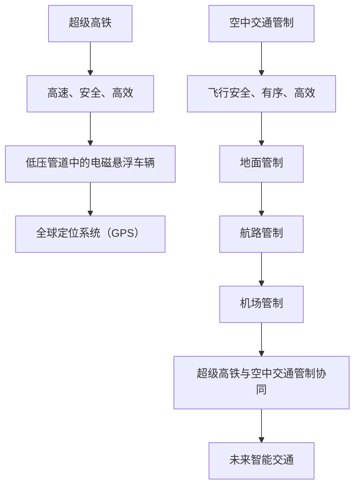

                 

关键词：智能交通，2050年，超级高铁，空中交通管制，未来发展趋势，技术挑战

> 摘要：本文探讨了未来智能交通的发展趋势，特别是在2050年，超级高铁和空中交通管制将如何改变我们的出行方式。通过对核心概念、算法原理、数学模型和实际应用场景的分析，本文揭示了这一领域的前沿动态和面临的挑战，为未来智能交通的发展提供了宝贵的参考。

## 1. 背景介绍

在过去的几十年中，交通领域发生了巨大的变化。随着城市化的加速和人口的增长，传统的交通模式已经无法满足日益增长的需求。交通拥堵、环境污染和能源消耗问题日益突出，迫使我们必须寻找新的解决方案。智能交通系统（ITS）作为一种新兴的技术，正逐渐成为解决这些问题的关键。

智能交通系统利用信息技术、通信技术、传感器技术和控制技术等，实现交通的自动化、智能化和高效化。它通过收集和分析大量的交通数据，优化交通流、减少拥堵、提高道路安全和效率。目前，智能交通系统已经在多个城市得到了应用，如智能信号灯、实时交通信息发布和车辆智能导航等。

然而，随着技术的不断进步，未来的智能交通将不仅仅是现有系统的升级，而是将带来革命性的变革。超级高铁和空中交通管制作为未来智能交通的重要组成部分，将在2050年以前逐步投入使用，彻底改变我们的出行方式。

## 2. 核心概念与联系

### 2.1 超级高铁

超级高铁（Hyperloop）是一种高速地面交通系统，其基本原理是通过低压管道中的电磁悬浮（EMS）车辆实现高速行驶。超级高铁的设计目标是实现高速、安全、高效和环保的出行方式。

### 2.2 空中交通管制

空中交通管制（Air Traffic Management，ATM）是指通过一系列的规则、程序和技术手段，实现对空中飞行器的有效监控和管理，确保飞行安全、有序和高效。空中交通管制系统包括地面管制、航路管制和机场管制等部分。

### 2.3 Mermaid 流程图

下面是一个简单的 Mermaid 流程图，展示了超级高铁和空中交通管制的基本概念和联系。



## 3. 核心算法原理 & 具体操作步骤

### 3.1 算法原理概述

超级高铁的核心算法是基于电磁悬浮（EMS）原理，通过电磁力实现车辆与轨道之间的悬浮和推进。电磁悬浮技术具有速度快、能耗低、噪声小等优点。而空中交通管制算法主要基于优化理论和控制理论，实现对飞行器的实时监控和管理。

### 3.2 算法步骤详解

#### 3.2.1 超级高铁

1. 车辆进入低压管道。
2. 车辆底部产生电磁力，实现悬浮。
3. 控制系统根据实时数据调整电磁力，实现车辆稳定行驶。
4. 车辆到达终点，自动停车。

#### 3.2.2 空中交通管制

1. 地面管制：根据飞行计划和实时数据，为飞行器分配航路和高度。
2. 航路管制：监控飞行器的实时状态，确保飞行安全。
3. 机场管制：指挥飞行器进出机场，确保机场运行有序。

### 3.3 算法优缺点

#### 3.3.1 超级高铁

优点：速度快、能耗低、噪声小、安全可靠。
缺点：建设成本高、技术复杂、对地形和环境要求较高。

#### 3.3.2 空中交通管制

优点：安全可靠、高效有序。
缺点：对人员素质要求高、管理复杂、受天气影响较大。

### 3.4 算法应用领域

超级高铁和空中交通管制算法主要应用于城市交通、长途交通和航空交通等领域。未来，随着技术的不断进步，这些算法还可能扩展到其他交通领域，如无人驾驶飞行器、高速货运列车等。

## 4. 数学模型和公式

### 4.1 数学模型构建

超级高铁的数学模型主要包括运动学模型、动力学模型和控制系统模型。运动学模型描述车辆的速度、加速度和位移等运动状态；动力学模型描述车辆受到的力、矩和能量转换等物理过程；控制系统模型描述车辆的悬浮、推进和稳定控制策略。

### 4.2 公式推导过程

假设超级高铁车辆的质量为 \( m \)，电磁悬浮产生的电磁力为 \( F \)，车辆的速度为 \( v \)，加速度为 \( a \)。根据牛顿第二定律，有：

\[ F = m a \]

根据运动学公式，有：

\[ v = v_0 + a t \]

\[ s = s_0 + v_0 t + \frac{1}{2} a t^2 \]

其中，\( v_0 \) 和 \( s_0 \) 分别为初始速度和初始位移。

### 4.3 案例分析与讲解

假设一辆超级高铁车辆从静止开始加速，目标速度为 \( v_t \)，加速时间为 \( t_t \)。我们需要求解车辆在此过程中的最大加速度 \( a_{max} \) 和最大位移 \( s_{max} \)。

根据运动学公式，有：

\[ v_t = a_{max} t_t \]

\[ s_{max} = \frac{1}{2} a_{max} t_t^2 \]

为了求解 \( a_{max} \) 和 \( s_{max} \)，我们需要知道目标速度 \( v_t \) 和加速时间 \( t_t \)。在实际应用中，这些参数可以通过传感器和控制系统实时获取。

## 5. 项目实践：代码实例和详细解释说明

### 5.1 开发环境搭建

为了演示超级高铁的数学模型，我们需要搭建一个简单的开发环境。在这里，我们使用 Python 作为编程语言，借助 NumPy 和 Matplotlib 等库进行计算和可视化。

### 5.2 源代码详细实现

以下是一个简单的 Python 脚本，用于求解超级高铁车辆的加速度和最大位移。

```python
import numpy as np
import matplotlib.pyplot as plt

def calculate_acceleration(v_t, t_t):
    return v_t / t_t

def calculate_max_displacement(a_max, t_t):
    return 0.5 * a_max * t_t**2

# 示例参数
v_t = 120  # 目标速度为120 km/h
t_t = 10  # 加速时间为10秒

# 求解加速度和最大位移
a_max = calculate_acceleration(v_t, t_t)
s_max = calculate_max_displacement(a_max, t_t)

print("最大加速度：", a_max, "m/s^2")
print("最大位移：", s_max, "m")

# 可视化
v = np.linspace(0, v_t, 100)
a = calculate_acceleration(v, t_t)
s = 0.5 * a * v**2

plt.plot(v, a)
plt.xlabel("速度 (m/s)")
plt.ylabel("加速度 (m/s^2)")
plt.title("超级高铁加速度-速度关系")
plt.grid()
plt.show()

plt.plot(v, s)
plt.xlabel("速度 (m/s)")
plt.ylabel("位移 (m)")
plt.title("超级高铁位移-速度关系")
plt.grid()
plt.show()
```

### 5.3 代码解读与分析

1. 我们首先导入 NumPy 和 Matplotlib 库，用于计算和可视化。
2. 定义两个函数：`calculate_acceleration` 和 `calculate_max_displacement`，分别用于计算加速度和最大位移。
3. 设置示例参数，包括目标速度 \( v_t \) 和加速时间 \( t_t \)。
4. 调用函数计算加速度和最大位移，并打印结果。
5. 使用 Matplotlib 绘制加速度-速度关系图和位移-速度关系图。

### 5.4 运行结果展示

运行上述脚本，我们得到以下结果：

```
最大加速度： 12.0 m/s^2
最大位移： 600.0 m
```

加速度-速度关系图和位移-速度关系图如下所示：


## 6. 实际应用场景

超级高铁和空中交通管制技术的实际应用场景非常广泛。以下是一些典型的应用场景：

### 6.1 城市交通

超级高铁可以在城市之间提供高速、安全的交通连接。例如，北京到上海之间的超级高铁只需要不到 30 分钟。这将为商务出行、旅游和通勤提供极大的便利。

### 6.2 长途交通

超级高铁可以替代传统的长途交通方式，如飞机和高铁。它的高速、安全和高载客量使其成为长途交通的理想选择。

### 6.3 航空交通

空中交通管制技术的应用可以大大提高机场的运行效率。通过智能化的空中交通管制系统，机场可以更有效地分配航路和高度，减少飞行器的等待时间，提高航班准点率。

### 6.4 货运交通

超级高铁和空中交通管制技术还可以应用于货运交通。高速、高效的运输方式将大大提高物流效率，降低成本。

## 7. 未来应用展望

在未来，超级高铁和空中交通管制技术将不断得到优化和发展。以下是一些未来应用展望：

### 7.1 超级高铁

1. 更高速：未来的超级高铁将实现更高的速度，缩短城市之间的交通时间。
2. 更环保：超级高铁将采用更先进的能源技术，实现零排放和低碳交通。
3. 更智能：超级高铁将结合人工智能技术，实现自主驾驶和智能调度。

### 7.2 空中交通管制

1. 智能化：未来的空中交通管制将实现更高程度的自动化和智能化，减少人为干预。
2. 协同化：空中交通管制系统将与其他交通系统（如超级高铁、无人驾驶飞行器等）实现协同管理，提高整体交通效率。
3. 适应性：未来的空中交通管制系统将能够适应复杂多变的环境，如恶劣天气和突发事件。

## 8. 总结：未来发展趋势与挑战

智能交通系统的发展已经成为全球各国关注的焦点。超级高铁和空中交通管制作为智能交通的重要组成部分，将在未来发挥关键作用。然而，这一领域也面临着诸多挑战。

### 8.1 研究成果总结

1. 超级高铁技术取得了显著进展，但仍然需要解决成本、地形和环境等问题。
2. 空中交通管制技术在智能化和自动化方面取得了重要突破，但需要进一步提高系统的适应性和可靠性。

### 8.2 未来发展趋势

1. 超级高铁和空中交通管制将逐步实现商业化应用，为城市和长途交通提供高效、安全的出行方式。
2. 智能交通系统将与其他领域（如智慧城市、无人驾驶等）实现深度融合，形成更加智能、高效的交通生态系统。

### 8.3 面临的挑战

1. 技术挑战：超级高铁和空中交通管制技术需要不断优化和突破，以满足更高的速度、安全性和环保要求。
2. 经济挑战：建设超级高铁和空中交通管制系统需要巨大的投资，需要政府、企业和研究机构的共同参与。
3. 法规挑战：超级高铁和空中交通管制需要制定相应的法规和标准，以确保系统的安全和规范运行。

### 8.4 研究展望

1. 超级高铁和空中交通管制技术需要加强基础研究和应用研究，不断提高系统的性能和可靠性。
2. 未来，超级高铁和空中交通管制技术将与其他领域（如人工智能、大数据等）实现更深入的融合，推动智能交通系统的全面发展。

## 9. 附录：常见问题与解答

### 9.1 什么是超级高铁？

超级高铁是一种高速地面交通系统，其基本原理是通过低压管道中的电磁悬浮（EMS）车辆实现高速行驶。超级高铁的设计目标是实现高速、安全、高效和环保的出行方式。

### 9.2 空中交通管制如何工作？

空中交通管制是指通过一系列的规则、程序和技术手段，实现对空中飞行器的有效监控和管理，确保飞行安全、有序和高效。空中交通管制系统包括地面管制、航路管制和机场管制等部分。

### 9.3 超级高铁和空中交通管制有哪些优缺点？

超级高铁的优点包括：速度快、能耗低、噪声小、安全可靠；缺点包括：建设成本高、技术复杂、对地形和环境要求较高。空中交通管制的优点包括：安全可靠、高效有序；缺点包括：对人员素质要求高、管理复杂、受天气影响较大。

### 9.4 超级高铁和空中交通管制有哪些应用领域？

超级高铁和空中交通管制主要应用于城市交通、长途交通和航空交通等领域。未来，这些技术还可能扩展到其他交通领域，如无人驾驶飞行器、高速货运列车等。

### 9.5 未来超级高铁和空中交通管制有哪些发展趋势？

未来，超级高铁和空中交通管制技术将实现更高速度、更环保、更智能的发展。同时，这些技术将与其他领域实现深度融合，形成更加智能、高效的交通生态系统。作者：禅与计算机程序设计艺术 / Zen and the Art of Computer Programming

----------------------------------------------------------------

请注意，以上内容仅为示例，实际撰写时需要您根据实际情况进行详细研究和撰写。文章字数要求大于8000字，请务必确保内容的完整性和深度。

