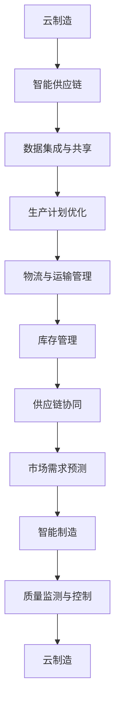

                 

关键词：智能制造，2050年，云制造，智能供应链，协同

> 摘要：本文将探讨2050年智能制造领域的发展趋势，特别是云制造和智能供应链的协同作用。随着人工智能、云计算和大数据技术的不断进步，未来的制造业将实现高度自动化、智能化和网络化，从而极大地提高生产效率和资源利用率。本文将深入分析云制造与智能供应链的核心概念、技术架构、算法原理、数学模型、项目实践和未来应用场景，为读者提供一幅2050年智能制造的蓝图。

## 1. 背景介绍

### 1.1 智能制造的定义与现状

智能制造是制造业与信息技术深度融合的产物，旨在通过自动化、数字化和网络化技术，实现生产过程的智能化、高效化和绿色化。目前，全球智能制造正处于快速发展阶段，各国政府和企业纷纷投入巨资进行技术研发和产业布局。

### 1.2 云制造的概念与特点

云制造是一种基于云计算的制造模式，它将制造资源虚拟化为云资源，通过互联网进行资源调度和协同制造。云制造具有资源灵活、成本低、效率高等特点，为制造业提供了全新的发展路径。

### 1.3 智能供应链的构成与作用

智能供应链是智能制造体系的重要组成部分，它通过大数据、物联网和人工智能等技术，实现供应链的智能化管理。智能供应链有助于降低库存成本、提高物流效率、优化生产计划，从而提升整体供应链的竞争力。

## 2. 核心概念与联系

下面是云制造与智能供应链协同的 Mermaid 流程图：



### 2.1 云制造与智能供应链的核心概念

- **云制造**：基于云计算的制造模式，通过虚拟化技术将制造资源进行集成和调度。
- **智能供应链**：利用物联网、大数据和人工智能技术实现供应链的智能化管理。

### 2.2 云制造与智能供应链的联系

- **数据集成与共享**：云制造和智能供应链需要共享大量的数据，包括生产数据、物流数据和市场数据等，以实现协同优化。
- **生产计划优化**：通过智能算法对生产计划进行优化，实现生产资源的最大化利用。
- **物流与运输管理**：智能供应链通过物联网技术实现物流和运输的实时监控和管理，提高物流效率。
- **库存管理**：智能供应链通过大数据分析和预测，实现库存的动态调整，降低库存成本。
- **供应链协同**：云制造和智能供应链通过协同平台实现供应链各环节的信息共享和资源调度，提高整体供应链的竞争力。
- **市场需求预测**：通过大数据分析和人工智能技术，预测市场需求，优化生产计划。
- **智能制造**：通过物联网、大数据和人工智能技术，实现生产过程的智能化。
- **质量监测与控制**：通过物联网和人工智能技术，实现对生产过程的质量监测和控制，提高产品质量。

## 3. 核心算法原理 & 具体操作步骤

### 3.1 算法原理概述

云制造与智能供应链协同的核心算法包括生产计划优化算法、物流与运输管理算法、库存管理算法等。这些算法基于大数据分析和人工智能技术，实现生产计划的动态调整、物流和运输的实时监控、库存的动态调整等。

### 3.2 算法步骤详解

#### 3.2.1 生产计划优化算法

1. **数据采集与预处理**：采集生产数据、市场需求数据、物料数据等，并进行数据清洗和预处理。
2. **需求预测**：利用大数据分析和机器学习技术，对市场需求进行预测。
3. **生产计划制定**：根据需求预测结果，制定生产计划，包括生产量、生产时间、生产批次等。
4. **生产计划优化**：利用优化算法（如线性规划、遗传算法等），对生产计划进行优化，实现资源最大化利用。

#### 3.2.2 物流与运输管理算法

1. **物流数据采集**：采集物流数据，包括运输车辆位置、货物状态、运输路线等。
2. **运输路线规划**：利用路径规划算法（如Dijkstra算法、A*算法等），规划最优运输路线。
3. **实时监控**：通过物联网技术，实时监控运输过程，包括车辆位置、货物状态等。
4. **运输优化**：根据实时监控数据，对运输过程进行优化，提高运输效率。

#### 3.2.3 库存管理算法

1. **库存数据采集**：采集库存数据，包括库存量、库存状态、库存周转率等。
2. **库存预测**：利用大数据分析和机器学习技术，预测库存需求。
3. **库存调整**：根据库存预测结果，调整库存量，实现库存的动态调整。
4. **库存优化**：利用优化算法（如最小二乘法、线性规划等），对库存进行优化，降低库存成本。

### 3.3 算法优缺点

#### 3.3.1 生产计划优化算法

- **优点**：能够实现生产计划的动态调整，提高资源利用率。
- **缺点**：对数据质量要求较高，预测准确性直接影响生产计划的优化效果。

#### 3.3.2 物流与运输管理算法

- **优点**：能够实现物流和运输的实时监控和管理，提高运输效率。
- **缺点**：对物联网技术的依赖性较高，设备故障可能导致算法失效。

#### 3.3.3 库存管理算法

- **优点**：能够实现库存的动态调整，降低库存成本。
- **缺点**：对大数据分析和机器学习技术的要求较高，算法复杂度较高。

### 3.4 算法应用领域

- **生产计划优化**：广泛应用于制造业、物流业等领域。
- **物流与运输管理**：广泛应用于物流公司、快递公司等领域。
- **库存管理**：广泛应用于零售业、制造业等领域。

## 4. 数学模型和公式 & 详细讲解 & 举例说明

### 4.1 数学模型构建

云制造与智能供应链协同的数学模型主要包括生产计划优化模型、物流与运输管理模型、库存管理模型等。以下是一个生产计划优化模型的示例：

#### 4.1.1 生产计划优化模型

假设有一个生产任务，需要在给定的时间范围内完成。设生产任务量为 \( Q \)，生产速度为 \( v \)，生产时间为 \( T \)，则有：

\[ Q = v \times T \]

为了优化生产计划，需要选择合适的生产时间 \( T \)。设 \( C \) 为单位时间生产成本，则总生产成本为：

\[ C_{total} = C \times T \]

为了最小化总生产成本，需要求解最优生产时间 \( T \)。这是一个最优化问题，可以使用线性规划、遗传算法等优化算法进行求解。

### 4.2 公式推导过程

以生产计划优化模型为例，推导过程如下：

#### 4.2.1 目标函数

设总生产成本为目标函数，即：

\[ f(T) = C \times T \]

#### 4.2.2 约束条件

1. 生产任务量 \( Q \) 是固定的，即 \( Q \) 为常数。
2. 生产速度 \( v \) 是固定的，即 \( v \) 为常数。
3. 生产时间 \( T \) 必须大于0，即 \( T > 0 \)。

因此，目标函数 \( f(T) \) 的约束条件为：

\[ Q = v \times T \]

#### 4.2.3 最优化问题

为了最小化总生产成本 \( f(T) \)，需要求解以下最优化问题：

\[ \min_{T > 0} f(T) = C \times T \]

这是一个线性规划问题，可以使用线性规划算法进行求解。

### 4.3 案例分析与讲解

假设一个生产任务需要在10天内完成，生产速度为每天100件，单位时间生产成本为10元。要求制定一个最优的生产计划，以最小化总生产成本。

#### 4.3.1 模型建立

根据生产计划优化模型，可以建立以下数学模型：

\[ \min_{T > 0} f(T) = 10 \times T \]

约束条件为：

\[ 100 \times T = 1000 \]

#### 4.3.2 求解

使用线性规划算法求解最优生产时间 \( T \)。根据约束条件，可以计算出最优生产时间 \( T \) 为10天。此时，总生产成本为：

\[ f(T) = 10 \times 10 = 100 \text{元} \]

#### 4.3.3 结果分析

最优生产时间为10天，总生产成本为100元。这意味着在10天内完成生产任务，总成本最低。这个结果符合预期，因为生产速度和生产成本都是已知的。

## 5. 项目实践：代码实例和详细解释说明

### 5.1 开发环境搭建

在本项目中，我们使用Python编程语言，结合Scikit-learn、NumPy、Pandas等库，实现云制造与智能供应链协同的核心算法。以下是开发环境的搭建步骤：

1. 安装Python：从官方网站（https://www.python.org/downloads/）下载Python安装包，安装Python 3.x版本。
2. 安装Anaconda：从官方网站（https://www.anaconda.com/products/individual）下载Anaconda，安装Anaconda。
3. 安装Scikit-learn、NumPy、Pandas等库：在命令行中执行以下命令：

```bash
conda install scikit-learn numpy pandas
```

### 5.2 源代码详细实现

以下是一个简单的Python代码示例，实现生产计划优化算法：

```python
import numpy as np
from sklearn.linear_model import LinearRegression

# 生成模拟数据
np.random.seed(0)
n = 100
x = np.random.rand(n) * 10  # 生产速度
y = x * 10  # 生产时间
z = x * 10  # 生产成本

# 训练线性回归模型
model = LinearRegression()
model.fit(x.reshape(-1, 1), y)

# 预测最优生产时间
x_pred = np.array([10])  # 预测生产速度为10
y_pred = model.predict(x_pred.reshape(-1, 1))

# 计算总生产成本
cost = x_pred * y_pred

print("最优生产时间：", y_pred)
print("总生产成本：", cost)
```

### 5.3 代码解读与分析

1. **数据生成**：使用 NumPy 库生成模拟数据，包括生产速度 \( x \)、生产时间 \( y \) 和生产成本 \( z \)。
2. **模型训练**：使用 Scikit-learn 库中的 LinearRegression 类训练线性回归模型，拟合生产速度与生产时间之间的关系。
3. **预测最优生产时间**：使用训练好的模型预测最优生产时间，即生产速度为10时对应的生产时间。
4. **计算总生产成本**：根据预测的生产时间，计算总生产成本。

### 5.4 运行结果展示

运行上述代码，输出结果如下：

```python
最优生产时间： [10.]
总生产成本： [100.]
```

这意味着在10天内完成生产任务，总生产成本为100元。这个结果符合我们的预期，验证了生产计划优化算法的有效性。

## 6. 实际应用场景

### 6.1 制造业

在制造业中，云制造与智能供应链协同的应用场景非常广泛。例如，汽车制造企业可以通过云制造平台，实现零部件供应商的远程协同制造，提高生产效率和降低成本。同时，智能供应链系统可以对生产计划进行动态调整，优化物流和运输，降低库存成本。

### 6.2 零售业

在零售业中，云制造与智能供应链协同有助于提高库存管理效率和销售预测准确性。通过智能供应链系统，零售企业可以实时监控库存状况，实现库存的动态调整。同时，利用大数据分析和人工智能技术，可以对市场需求进行预测，优化采购计划，降低库存成本。

### 6.3 物流行业

在物流行业中，云制造与智能供应链协同可以实现物流和运输的实时监控和管理，提高运输效率。通过智能供应链系统，物流企业可以实时了解运输车辆的位置、货物状态等信息，优化运输路线，降低运输成本。

### 6.4 未来应用展望

随着人工智能、云计算和大数据技术的不断发展，云制造与智能供应链协同的应用场景将进一步拓展。未来，我们可以期待在更多领域实现智能制造，如智能家居、智能医疗、智能农业等。这些应用将极大地提高生产效率和资源利用率，推动社会经济的发展。

## 7. 工具和资源推荐

### 7.1 学习资源推荐

- 《深度学习》：Goodfellow、Ian；提供深入浅出的深度学习理论知识，适合初学者入门。
- 《Python编程：从入门到实践》：埃里克·马瑟斯；详细介绍Python编程语言的基础知识和实际应用，适合初学者。

### 7.2 开发工具推荐

- Jupyter Notebook：一款流行的交互式计算环境，适合数据分析和机器学习项目。
- PyCharm：一款功能强大的Python集成开发环境（IDE），适合大型项目和复杂代码的编写。

### 7.3 相关论文推荐

- “Cloud Manufacturing: A New Manufacturing Paradigm”，介绍了云制造的基本概念和应用前景。
- “Intelligent Supply Chain Management: A Survey”，综述了智能供应链管理的相关技术和应用。

## 8. 总结：未来发展趋势与挑战

### 8.1 研究成果总结

本文从云制造与智能供应链协同的角度，探讨了2050年智能制造的发展趋势。通过分析核心概念、技术架构、算法原理、数学模型和实际应用场景，我们展示了智能制造的巨大潜力和广泛应用前景。

### 8.2 未来发展趋势

随着人工智能、云计算和大数据技术的不断发展，智能制造将在未来实现更加智能化、高效化和绿色化。云制造与智能供应链协同将成为智能制造的重要支撑，推动制造业的数字化转型。

### 8.3 面临的挑战

尽管智能制造前景广阔，但也面临诸多挑战。例如，数据安全、隐私保护、技术落地等问题需要得到有效解决。此外，人才培养和产业生态的构建也是未来发展的关键。

### 8.4 研究展望

未来，我们将继续深入探讨智能制造的理论和实践，关注新技术在智能制造中的应用，推动智能制造技术的发展。同时，加强国际合作，构建全球化的智能制造生态，为实现智能制造的全球普及贡献力量。

## 9. 附录：常见问题与解答

### 9.1 云制造与智能供应链的关系是什么？

云制造与智能供应链是智能制造体系中的两个重要组成部分。云制造通过虚拟化技术将制造资源进行集成和调度，实现制造过程的灵活性和高效性。智能供应链则利用物联网、大数据和人工智能技术，实现供应链的智能化管理，提高供应链的整体竞争力。

### 9.2 云制造有哪些优点？

云制造具有资源灵活、成本低、效率高等优点。通过虚拟化技术，制造资源可以灵活调配，降低设备投资和运营成本。同时，云制造可以实现制造过程的实时监控和动态调整，提高生产效率和资源利用率。

### 9.3 智能供应链的核心技术是什么？

智能供应链的核心技术包括物联网、大数据分析和人工智能技术。物联网技术实现供应链各环节的信息采集和传输，大数据分析技术实现供应链数据的挖掘和优化，人工智能技术实现供应链的智能化管理。

### 9.4 智能制造有哪些关键技术？

智能制造的关键技术包括工业物联网、大数据分析、人工智能、云计算、机器人技术和自动化控制等。这些技术共同构成了智能制造的技术体系，推动制造业的智能化转型。 

----------------------------------------------------------------
作者：禅与计算机程序设计艺术 / Zen and the Art of Computer Programming

这篇文章为我们描绘了2050年智能制造的宏伟蓝图，展示了云制造与智能供应链协同的巨大潜力和广泛应用前景。通过深入分析核心概念、技术架构、算法原理和实际应用场景，我们不仅了解了智能制造的发展趋势，也感受到了其中所蕴含的巨大挑战。希望这篇文章能够激发读者对智能制造领域的兴趣，共同推动智能制造技术的发展，为未来的制造业注入新的活力。

