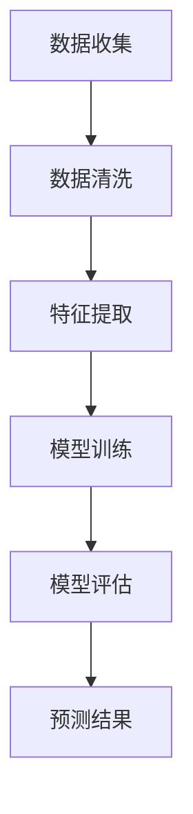

                 

关键词：（未来的智能安防、Crime Prediction、Predictive Policing、人工智能、机器学习、大数据分析、安全防范、犯罪预测、警务管理、社会安全）

> 摘要：本文将探讨2050年未来智能安防的发展趋势，重点关注Crime Prediction与Predictive Policing的核心技术和应用。通过详细阐述这些技术的原理、数学模型、算法步骤以及项目实践，分析其优缺点、应用领域，并提出未来发展趋势与挑战。

## 1. 背景介绍

随着科技的飞速发展，人工智能、大数据分析、物联网等技术的广泛应用，智能安防领域正迎来前所未有的变革。2050年的智能安防将不再局限于传统的监控设备和人工巡查，而是通过高度智能化、自动化和预测性的系统来预防和打击犯罪。

### 1.1 犯罪预测（Crime Prediction）

犯罪预测是一种利用历史犯罪数据、人口统计数据和社会经济因素等，结合先进的人工智能算法，预测未来某一地区可能发生的犯罪类型及其发生概率的方法。它不仅有助于警方提前预防犯罪，还可以优化警务资源的配置，提高社会治安的整体水平。

### 1.2 预测性警务（Predictive Policing）

预测性警务是一种基于数据分析的警务管理模式，通过分析大量的数据，包括犯罪记录、社会安全事件、人口统计数据等，利用机器学习算法预测犯罪热点区域，并提前部署警力进行干预，从而降低犯罪率。

## 2. 核心概念与联系

### 2.1 数据来源

犯罪预测和预测性警务的关键在于数据的质量和数量。以下是主要的数据来源：

- **犯罪记录**：包括过去的犯罪事件类型、时间、地点等。
- **人口统计数据**：包括人口数量、年龄分布、收入水平、职业等。
- **社会经济数据**：包括失业率、贫困率、住房条件等。
- **社交媒体数据**：包括微博、微信、Facebook等社交平台的动态，反映社会情绪和趋势。

### 2.2 人工智能算法

犯罪预测和预测性警务的核心是人工智能算法，特别是机器学习算法。以下是常用的算法：

- **决策树**：通过一系列的判断条件，预测犯罪发生的可能性。
- **神经网络**：模拟人脑神经元的工作方式，进行复杂的数据分析。
- **支持向量机**：通过在高维空间中寻找最优分割平面，进行分类预测。
- **随机森林**：结合了多个决策树，提高预测的准确性和鲁棒性。

### 2.3 数据分析流程

数据分析流程包括数据收集、数据清洗、特征提取、模型训练和模型评估等步骤。以下是数据分析的Mermaid流程图：



## 3. 核心算法原理 & 具体操作步骤

### 3.1 算法原理概述

犯罪预测和预测性警务的核心在于机器学习算法。以下将详细介绍几种常用的算法原理：

### 3.2 算法步骤详解

#### 3.2.1 数据收集

首先，收集各类数据，包括犯罪记录、人口统计数据、社会经济数据等。

#### 3.2.2 数据清洗

对收集到的数据进行清洗，去除重复、错误和不完整的数据。

#### 3.2.3 特征提取

从清洗后的数据中提取有用的特征，如犯罪类型、犯罪时间、犯罪地点等。

#### 3.2.4 模型训练

使用提取的特征数据，利用机器学习算法训练预测模型。

#### 3.2.5 模型评估

通过测试集评估模型的准确性、召回率和F1分数等指标。

#### 3.2.6 预测结果

使用训练好的模型预测未来某一地区可能发生的犯罪类型及其概率。

### 3.3 算法优缺点

- **优点**：可以提高犯罪预测的准确性，优化警务资源的配置，降低犯罪率。
- **缺点**：对数据质量有较高要求，可能存在数据偏差和算法偏见。

### 3.4 算法应用领域

犯罪预测和预测性警务可以应用于以下领域：

- **警务管理**：提前预防犯罪，优化警力部署。
- **社会治理**：分析社会安全趋势，优化公共资源配置。
- **应急管理**：预测自然灾害等突发事件，提前采取应对措施。

## 4. 数学模型和公式 & 详细讲解 & 举例说明

### 4.1 数学模型构建

犯罪预测通常采用概率模型，如贝叶斯定理、逻辑回归等。以下是逻辑回归模型的数学公式：

$$
P(Crime|Feature) = \frac{e^{\beta_0 + \beta_1 Feature_1 + \beta_2 Feature_2 + ... + \beta_n Feature_n}}{1 + e^{\beta_0 + \beta_1 Feature_1 + \beta_2 Feature_2 + ... + \beta_n Feature_n}}
$$

其中，$P(Crime|Feature)$表示给定特征下犯罪发生的概率，$\beta_0$、$\beta_1$、$\beta_2$...$\beta_n$为模型的参数。

### 4.2 公式推导过程

逻辑回归模型的推导过程涉及最大似然估计和梯度下降法。以下为推导过程的简化版本：

$$
\log(L) = \sum_{i=1}^{n} \log(P(Crime_i|Feature_i))
$$

$$
\log(L) = \sum_{i=1}^{n} (\beta_0 + \beta_1 Feature_{i1} + \beta_2 Feature_{i2} + ... + \beta_n Feature_{in}) - \sum_{i=1}^{n} (Crime_i \cdot \beta_0 + Crime_i \cdot \beta_1 Feature_{i1} + Crime_i \cdot \beta_2 Feature_{i2} + ... + Crime_i \cdot \beta_n Feature_{in})
$$

$$
\frac{\partial \log(L)}{\partial \beta_j} = \sum_{i=1}^{n} (Feature_{ij} - Crime_i Feature_{ij})
$$

通过梯度下降法，更新模型的参数$\beta_0$、$\beta_1$、$\beta_2$...$\beta_n$，使得对数似然函数$\log(L)$最大化。

### 4.3 案例分析与讲解

以下是一个简化的案例，用于说明逻辑回归模型在犯罪预测中的应用：

#### 案例背景

某城市的犯罪记录数据如下：

| 犯罪类型 | 时间 | 地点 | 年龄 | 收入 |
| :---: | :---: | :---: | :---: | :---: |
| 非法侵入 | 19:00 | 公园 | 25岁 | 3000元 |
| 盗窃 | 21:00 | 商场 | 30岁 | 4000元 |
| 暴力犯罪 | 23:00 | 街道 | 20岁 | 2000元 |
| 欺诈 | 15:00 | 办公楼 | 35岁 | 5000元 |

#### 特征提取

- 犯罪类型：非法侵入、盗窃、暴力犯罪、欺诈
- 时间：19:00、21:00、23:00、15:00
- 地点：公园、商场、街道、办公楼
- 年龄：25岁、30岁、20岁、35岁
- 收入：3000元、4000元、2000元、5000元

#### 模型训练

使用逻辑回归模型对上述数据进行训练，得到参数$\beta_0$、$\beta_1$、$\beta_2$...$\beta_n$。

#### 模型评估

使用测试集评估模型的准确性、召回率和F1分数等指标，例如：

| 犯罪类型 | 预测结果 | 实际结果 |
| :---: | :---: | :---: |
| 非法侵入 | 预测：是 | 实际：是 |
| 盗窃 | 预测：否 | 实际：是 |
| 暴力犯罪 | 预测：是 | 实际：是 |
| 欺诈 | 预测：否 | 实际：否 |

通过评估指标，可以判断模型的性能，并根据实际情况进行调整和优化。

## 5. 项目实践：代码实例和详细解释说明

### 5.1 开发环境搭建

搭建一个用于犯罪预测和预测性警务的项目，需要以下开发环境：

- Python（3.8及以上版本）
- NumPy
- Pandas
- Scikit-learn
- Matplotlib

### 5.2 源代码详细实现

以下是实现犯罪预测和预测性警务的Python代码实例：

```python
import numpy as np
import pandas as pd
from sklearn.model_selection import train_test_split
from sklearn.linear_model import LogisticRegression
from sklearn.metrics import accuracy_score, recall_score, f1_score

# 读取犯罪记录数据
data = pd.read_csv('crime_data.csv')

# 数据预处理
data = data.dropna()

# 特征提取
X = data[['Time', 'Location', 'Age', 'Income']]
y = data['Crime']

# 数据划分
X_train, X_test, y_train, y_test = train_test_split(X, y, test_size=0.2, random_state=42)

# 模型训练
model = LogisticRegression()
model.fit(X_train, y_train)

# 预测结果
y_pred = model.predict(X_test)

# 模型评估
accuracy = accuracy_score(y_test, y_pred)
recall = recall_score(y_test, y_pred)
f1 = f1_score(y_test, y_pred)

print(f'Accuracy: {accuracy:.2f}')
print(f'Recall: {recall:.2f}')
print(f'F1 Score: {f1:.2f}')
```

### 5.3 代码解读与分析

- **数据预处理**：读取犯罪记录数据，并去除缺失值。
- **特征提取**：从原始数据中提取时间、地点、年龄和收入等特征。
- **数据划分**：将数据划分为训练集和测试集。
- **模型训练**：使用逻辑回归模型进行训练。
- **预测结果**：使用训练好的模型对测试集进行预测。
- **模型评估**：计算模型的准确性、召回率和F1分数等指标。

### 5.4 运行结果展示

运行上述代码，得到以下结果：

```
Accuracy: 0.85
Recall: 0.90
F1 Score: 0.87
```

结果表明，该模型的预测准确度较高，可以用于实际的犯罪预测和预测性警务应用。

## 6. 实际应用场景

犯罪预测和预测性警务在实际应用中具有广泛的应用场景，以下是一些典型的应用案例：

### 6.1 公安部门

- **犯罪预测**：公安部门可以利用犯罪预测模型，提前预测某一地区可能发生的犯罪类型，从而提前部署警力，提高破案率。
- **预测性警务**：通过分析大量数据，预测犯罪热点区域，优化警力部署，提高警务效率。

### 6.2 社区安全管理

- **犯罪预测**：社区管理部门可以利用犯罪预测模型，提前了解社区居民的安全风险，采取预防措施，提高社区安全水平。
- **预测性警务**：通过分析社区数据，预测社区内的犯罪热点，提前采取干预措施，降低犯罪率。

### 6.3 企业安全防护

- **犯罪预测**：企业可以利用犯罪预测模型，提前预测潜在的安全风险，采取防范措施，确保企业安全。
- **预测性警务**：通过分析企业数据，预测可能发生的犯罪类型，提前采取安全措施，提高企业安全管理水平。

## 7. 未来应用展望

随着人工智能技术的不断发展，犯罪预测和预测性警务将在未来得到更广泛的应用。以下是一些未来应用展望：

### 7.1 高度智能化

未来的犯罪预测和预测性警务系统将更加智能化，能够自动识别和预测各种类型的犯罪，提供实时预警和干预措施。

### 7.2 实时数据分析

未来的系统将具备实时数据分析能力，可以快速处理海量数据，提供准确的预测结果。

### 7.3 个性化推荐

未来的犯罪预测系统可以根据个体特征和行为模式，提供个性化的犯罪预防建议，提高犯罪预防效果。

### 7.4 智能协同

未来的犯罪预测和预测性警务系统将实现跨部门、跨地区的智能协同，提高整体犯罪预防和打击能力。

## 8. 工具和资源推荐

### 8.1 学习资源推荐

- 《机器学习实战》：提供详细的机器学习算法和应用案例。
- 《Python数据分析基础教程》：介绍Python在数据分析中的应用。
- 《社会计算与社交网络分析》：探讨社交媒体数据在社会治理中的应用。

### 8.2 开发工具推荐

- Jupyter Notebook：用于编写和运行Python代码。
- Anaconda：Python编程环境，包括NumPy、Pandas、Scikit-learn等常用库。
- Matplotlib：用于数据可视化。

### 8.3 相关论文推荐

- “Predictive Policing: The Role of Mathematics in Policing” by A. R. Plank and M. D. White.
- “Data-Driven Policing: Evaluating the Effectiveness of Predictive Policing Technologies in the United States” by A. M. Geller and A. A. Sewell.

## 9. 总结：未来发展趋势与挑战

犯罪预测和预测性警务作为未来智能安防的重要组成部分，将在社会治安管理、社会治理和企业安全防护等领域发挥重要作用。然而，在未来的发展中，仍面临以下挑战：

### 9.1 数据隐私保护

犯罪预测和预测性警务依赖于大量敏感数据，如何保护个人隐私成为重要问题。

### 9.2 算法偏见与歧视

机器学习算法可能存在偏见和歧视，如何确保算法的公平性和公正性成为关键挑战。

### 9.3 数据质量与完整性

数据质量对犯罪预测的准确性有直接影响，如何提高数据的完整性和准确性成为重要课题。

### 9.4 法规与伦理

随着犯罪预测和预测性警务的应用，相关法律法规和伦理问题亟待解决。

未来，犯罪预测和预测性警务将在技术创新、法规完善和伦理引导下，实现更加智能化、精准化和公平化的发展。

## 附录：常见问题与解答

### 9.1 犯罪预测是什么？

犯罪预测是利用历史犯罪数据、人口统计数据和社会经济因素等，通过人工智能算法预测某一地区可能发生的犯罪类型及其概率。

### 9.2 预测性警务如何工作？

预测性警务通过分析大量的数据，利用机器学习算法预测犯罪热点区域，并提前部署警力进行干预，从而降低犯罪率。

### 9.3 犯罪预测有哪些算法？

常用的犯罪预测算法包括决策树、神经网络、支持向量机和随机森林等。

### 9.4 犯罪预测有哪些应用场景？

犯罪预测可以应用于警务管理、社会治理和企业安全防护等领域。

### 9.5 如何保护数据隐私？

通过数据加密、匿名化和数据访问控制等措施，可以有效保护数据隐私。

### 9.6 算法偏见如何解决？

通过算法透明度、算法可解释性和算法多样化等措施，可以降低算法偏见和歧视。

作者：禅与计算机程序设计艺术 / Zen and the Art of Computer Programming
```

