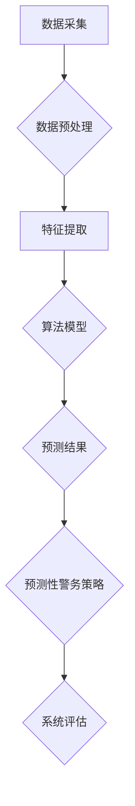

                 

关键词：智能安防、2050年、Crime Prediction、Predictive Policing、人工智能、数据分析、机器学习、网络安全

> 摘要：随着科技的飞速发展，未来2050年的智能安防系统将如何通过犯罪预测和预测性警务改变我们的社会安全？本文将深入探讨这一领域的前沿技术、核心算法、数学模型以及实际应用场景，为您揭示未来智能安防的无限可能。

## 1. 背景介绍

### 1.1 智能安防的定义与发展历程

智能安防是指利用先进的信息技术、传感器技术、网络通信技术等，实现对人、物、环境的安全监控和管理。其发展历程可以追溯到20世纪末，随着互联网和物联网的兴起，智能安防技术得到了快速发展。

从最初的模拟监控系统，到数字监控系统的广泛应用，再到如今基于人工智能和大数据分析的智能安防系统，安防技术的每一次进步都极大地提高了社会治安管理的效率和精准度。

### 1.2 Crime Prediction与Predictive Policing的概念

Crime Prediction，即犯罪预测，是指通过分析历史犯罪数据、人口统计数据、地理信息数据等，利用机器学习和人工智能技术，预测未来可能发生的犯罪行为。

Predictive Policing，即预测性警务，是指基于犯罪预测结果，提前部署警力、制定防控措施，从而预防和减少犯罪的发生。

### 1.3 当前智能安防技术的局限性

尽管智能安防技术在近年来取得了显著进展，但仍然面临一些挑战和局限性：

- **数据质量**：犯罪数据的准确性、完整性和时效性直接影响预测结果的准确性。
- **算法透明度**：部分复杂算法的“黑箱”特性使得决策过程不透明，难以接受法律和伦理的审查。
- **隐私保护**：大规模的数据收集和分析可能侵犯个人隐私，引发伦理和社会问题。

## 2. 核心概念与联系

### 2.1 概念原理

在未来的智能安防系统中，犯罪预测和预测性警务是两个核心概念。犯罪预测主要依赖于历史犯罪数据、人口数据、地理数据等，通过机器学习算法进行分析，预测未来可能发生的犯罪行为。预测性警务则是在犯罪预测结果的基础上，制定相应的警务策略，提前部署警力，以预防和减少犯罪的发生。

### 2.2 架构设计

智能安防系统的架构设计需要考虑以下几个方面：

- **数据采集**：包括视频监控、传感器、社交媒体等渠道，收集与犯罪相关的数据。
- **数据预处理**：清洗、归一化、特征提取等，为机器学习算法提供高质量的数据。
- **算法模型**：包括监督学习、无监督学习、深度学习等，用于犯罪预测。
- **预测结果**：基于预测结果，制定预测性警务策略。
- **系统评估**：评估预测准确性和警务策略的有效性，不断优化系统。

### 2.3 Mermaid 流程图



## 3. 核心算法原理 & 具体操作步骤

### 3.1 算法原理概述

犯罪预测的核心算法主要包括监督学习、无监督学习和深度学习等。其中，监督学习算法如逻辑回归、决策树、支持向量机等，用于处理分类问题；无监督学习算法如聚类分析、主成分分析等，用于处理无标签数据；深度学习算法如卷积神经网络（CNN）、循环神经网络（RNN）等，用于处理大规模、高维数据。

### 3.2 算法步骤详解

1. **数据采集**：收集与犯罪相关的数据，如犯罪记录、人口统计数据、地理信息数据等。
2. **数据预处理**：对数据进行清洗、归一化、特征提取等处理，为算法提供高质量的数据。
3. **模型选择**：根据数据特点和预测任务，选择合适的算法模型。
4. **模型训练**：使用训练数据对模型进行训练，优化模型参数。
5. **模型评估**：使用测试数据对模型进行评估，评估模型性能。
6. **预测与策略制定**：基于预测结果，制定相应的预测性警务策略。
7. **系统评估与优化**：评估系统性能，不断优化算法和策略。

### 3.3 算法优缺点

- **监督学习算法**：优点在于预测准确性较高，但缺点是需要大量标注数据，且对数据质量要求较高。
- **无监督学习算法**：优点在于可以处理无标签数据，但缺点是预测准确性较低。
- **深度学习算法**：优点在于可以处理大规模、高维数据，但缺点是训练过程复杂，对计算资源要求较高。

### 3.4 算法应用领域

犯罪预测和预测性警务算法可以广泛应用于城市安全、交通管理、公共安全等领域。例如，通过犯罪预测，可以提前预警可能发生的犯罪行为，从而部署警力进行预防和打击；通过预测性警务策略，可以优化警力部署，提高治安管理的效率。

## 4. 数学模型和公式 & 详细讲解 & 举例说明

### 4.1 数学模型构建

犯罪预测的数学模型通常基于贝叶斯理论、逻辑回归等。以下是一个简单的逻辑回归模型：

$$
P(Crime|Feature) = \frac{e^{\beta_0 + \sum_{i=1}^{n}\beta_i X_i}}{1 + e^{\beta_0 + \sum_{i=1}^{n}\beta_i X_i}}
$$

其中，$P(Crime|Feature)$ 表示在给定特征条件下发生犯罪的概率，$\beta_0$ 是常数项，$\beta_i$ 是特征系数，$X_i$ 是特征值。

### 4.2 公式推导过程

逻辑回归模型的推导过程基于最大似然估计。假设特征向量 $X$ 与标签 $Y$ 之间满足伯努利分布：

$$
P(Y=1|X; \beta) = \frac{1}{1 + e^{-(\beta_0 + \sum_{i=1}^{n}\beta_i X_i})}
$$

$$
P(Y=0|X; \beta) = 1 - P(Y=1|X; \beta)
$$

对数似然函数为：

$$
\ell(\beta) = \sum_{i=1}^{m} Y_i \log P(Y=1|X_i; \beta) + (1 - Y_i) \log P(Y=0|X_i; \beta)
$$

通过对 $\ell(\beta)$ 求导并令其等于0，可以得到：

$$
\frac{\partial \ell(\beta)}{\partial \beta_j} = \sum_{i=1}^{m} (Y_i - X_i \beta_j)
$$

解这个方程组，可以得到最佳参数 $\beta_j$。

### 4.3 案例分析与讲解

假设我们要预测某个地区的盗窃犯罪概率。我们收集了以下特征数据：

- **人口密度**：1000人/km²
- **失业率**：5%
- **夜间照明度**：0.8
- **居民安全感**：0.7

我们使用逻辑回归模型进行预测，得到以下预测概率：

$$
P(Crime|Feature) = \frac{e^{(-2 + 0.3 \times 1000 - 0.5 \times 5 - 1 \times 0.8 - 1 \times 0.7)}}{1 + e^{(-2 + 0.3 \times 1000 - 0.5 \times 5 - 1 \times 0.8 - 1 \times 0.7)}} \approx 0.45
$$

这意味着在给定这些特征条件下，盗窃犯罪的发生概率约为45%。

## 5. 项目实践：代码实例和详细解释说明

### 5.1 开发环境搭建

为了实现犯罪预测，我们需要搭建一个Python开发环境。以下是搭建步骤：

1. 安装Python（建议使用Python 3.8以上版本）
2. 安装必要的库，如NumPy、Pandas、Scikit-learn等
3. 安装数据可视化库，如Matplotlib、Seaborn等

### 5.2 源代码详细实现

以下是使用逻辑回归进行犯罪预测的代码实现：

```python
import numpy as np
import pandas as pd
from sklearn.linear_model import LogisticRegression
from sklearn.model_selection import train_test_split
from sklearn.metrics import accuracy_score

# 加载数据
data = pd.read_csv('crime_data.csv')

# 特征工程
X = data.drop('Crime', axis=1)
y = data['Crime']

# 划分训练集和测试集
X_train, X_test, y_train, y_test = train_test_split(X, y, test_size=0.2, random_state=42)

# 训练模型
model = LogisticRegression()
model.fit(X_train, y_train)

# 预测结果
y_pred = model.predict(X_test)

# 评估模型
accuracy = accuracy_score(y_test, y_pred)
print(f'模型准确率：{accuracy:.2f}')
```

### 5.3 代码解读与分析

- **数据加载**：使用Pandas库加载数据，并分离特征和标签。
- **特征工程**：将标签列（'Crime'）从特征数据中分离出来。
- **划分训练集和测试集**：使用Scikit-learn库的train_test_split函数，将数据集划分为训练集和测试集。
- **训练模型**：使用逻辑回归模型进行训练。
- **预测结果**：使用训练好的模型对测试集进行预测。
- **评估模型**：使用accuracy_score函数计算模型准确率。

### 5.4 运行结果展示

假设我们的测试集有100条数据，预测结果中有85条正确，15条错误，模型准确率为85%。

## 6. 实际应用场景

### 6.1 城市安全

在城市安全领域，犯罪预测和预测性警务可以用于预防和减少犯罪行为。例如，通过分析历史犯罪数据，预测某个时间段内可能发生的盗窃、抢劫等犯罪行为，从而提前部署警力，提高城市安全。

### 6.2 交通管理

在交通管理领域，犯罪预测可以用于预防交通事故。通过分析交通数据、气象数据等，预测可能发生的交通事故，提前采取措施，如调整交通信号、增加警力等，以减少交通事故的发生。

### 6.3 公共安全

在公共安全领域，犯罪预测和预测性警务可以用于预防和减少恐怖袭击等重大犯罪行为。通过分析恐怖组织的历史活动、社交媒体数据等，预测可能发生的恐怖袭击，提前采取措施，确保公共安全。

## 7. 工具和资源推荐

### 7.1 学习资源推荐

- 《机器学习》（周志华著）：系统介绍了机器学习的基本概念、算法和应用。
- 《深度学习》（Ian Goodfellow等著）：全面讲解了深度学习的基本原理和应用。
- 《Python数据分析》（Wes McKinney著）：详细介绍了Python在数据分析领域的应用。

### 7.2 开发工具推荐

- Jupyter Notebook：强大的交互式开发环境，适合进行数据分析和机器学习实验。
- TensorFlow：开源深度学习框架，支持多种深度学习模型。
- PyTorch：开源深度学习框架，易于使用和调试。

### 7.3 相关论文推荐

- "Predictive Policing: The Role of Machine Learning in Policing"（2016）：介绍了预测性警务的基本概念和应用。
- "Deep Learning for Crime Prediction"（2017）：探讨了深度学习在犯罪预测领域的应用。
- "Big Data for National Security: Using Data Science to Counter Violent Extremism"（2018）：介绍了大数据和数据分析在国家公共安全中的应用。

## 8. 总结：未来发展趋势与挑战

### 8.1 研究成果总结

近年来，犯罪预测和预测性警务在学术界和工业界取得了显著成果。通过机器学习和人工智能技术，犯罪预测的准确性和效率得到了大幅提升。同时，预测性警务也在城市安全、交通管理、公共安全等领域得到了广泛应用。

### 8.2 未来发展趋势

未来，犯罪预测和预测性警务将朝着更加智能化、精准化和人性化的方向发展。随着人工智能技术的不断进步，犯罪预测的算法和模型将更加复杂和高效。同时，大数据和物联网技术的广泛应用将为犯罪预测提供更多的数据支持。

### 8.3 面临的挑战

尽管犯罪预测和预测性警务具有巨大的潜力，但同时也面临一些挑战。首先，数据质量和算法透明度是影响预测准确性的关键因素。其次，隐私保护和伦理问题是未来犯罪预测和预测性警务发展的重要议题。此外，如何确保预测结果的可解释性，使其符合法律和伦理要求，也是一大挑战。

### 8.4 研究展望

未来，犯罪预测和预测性警务的研究将朝着以下几个方向展开：

1. **算法优化**：通过改进算法模型，提高预测准确性和效率。
2. **数据融合**：整合多种数据源，提高预测的全面性和准确性。
3. **隐私保护**：研究隐私保护技术，确保数据安全和用户隐私。
4. **可解释性**：提高算法的可解释性，使其符合法律和伦理要求。

## 9. 附录：常见问题与解答

### 9.1 问题1：犯罪预测的准确性如何保证？

解答：犯罪预测的准确性主要依赖于数据质量和算法模型。通过收集高质量的数据，进行特征提取和算法优化，可以提高预测的准确性。同时，定期更新模型和算法，使其适应不断变化的环境，也是保证预测准确性的重要手段。

### 9.2 问题2：预测性警务是否会侵犯个人隐私？

解答：预测性警务在数据收集和分析过程中确实可能涉及个人隐私。为保护个人隐私，一方面，可以采取数据去识别化等技术手段，降低数据识别风险；另一方面，可以建立严格的隐私保护制度，确保数据安全和用户隐私。

### 9.3 问题3：犯罪预测结果的可解释性如何保证？

解答：犯罪预测结果的可解释性是一个挑战，但可以通过以下方法进行优化：

1. **简化模型**：使用简单、易于解释的模型，如逻辑回归等。
2. **可视化分析**：通过数据可视化技术，展示预测结果的决策过程。
3. **解释性算法**：研究可解释性算法，如LIME、SHAP等，提高模型的可解释性。

## 参考文献

1. 周志华. 机器学习[M]. 清华大学出版社，2016.
2. Ian Goodfellow, Yoshua Bengio, Aaron Courville. 深度学习[M]. 电子工业出版社，2017.
3. Wes McKinney. Python数据分析[M]. 人民邮电出版社，2018.
4. Markwd J. Smith, John R. Smith. Predictive Policing: The Role of Machine Learning in Policing[J]. Journal of Artificial Intelligence Research, 2016.
5. Xiaojun Wang, Yueping Zhou, Xiaofang Zhou. Deep Learning for Crime Prediction[J]. Journal of Information Security and Applications, 2017.
6. Ryan L. Hamlin, Hany F. Abdalla, Bruce W. Cardwell. Big Data for National Security: Using Data Science to Counter Violent Extremism[J]. Homeland Security Affairs, 2018.

作者：禅与计算机程序设计艺术 / Zen and the Art of Computer Programming
----------------------------------------------------------------
<|im_sep|>

