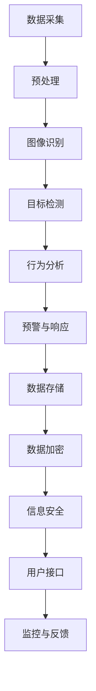

                 

关键词：智能安防、公共安全、隐私保护、人工智能、深度学习、计算机视觉、物联网、信息安全、数据加密

摘要：随着人工智能、计算机视觉、物联网等技术的飞速发展，智能安防系统在公共安全领域发挥着越来越重要的作用。本文探讨了未来智能安防的发展趋势，重点关注公共安全与隐私保护之间的平衡。通过分析核心概念、算法原理、数学模型以及实际应用，本文为未来智能安防的研究与应用提供了有价值的参考。

## 1. 背景介绍

智能安防系统是基于先进的人工智能技术、计算机视觉和物联网构建的，旨在提高公共安全、减少犯罪率并提供高效的紧急响应。传统的安防系统依赖于物理设备和被动监测，如摄像头和报警器。然而，这些系统存在局限性，例如无法实时处理大量数据、难以适应复杂场景等。

随着计算机技术和算法的进步，智能安防系统开始利用深度学习、图像识别等技术进行实时监控、分析和预警。这些系统能够从视频流中提取关键信息，自动识别异常行为，并在必要时触发警报。此外，物联网技术的普及使得各种传感器和设备能够互联互通，进一步提高了安防系统的覆盖面和响应速度。

尽管智能安防系统在提升公共安全方面取得了显著成果，但也带来了隐私保护方面的挑战。智能安防系统需要收集和处理大量个人数据，这些数据可能包括面部识别、行为模式等敏感信息。如何在保证公共安全的同时，有效保护个人隐私成为了一个亟待解决的问题。

## 2. 核心概念与联系

为了构建一个高效的智能安防系统，我们需要理解以下几个核心概念：

### 2.1 人工智能与深度学习

人工智能（AI）是模拟人类智能行为的计算机系统，通过算法和模型实现学习、推理、决策等功能。深度学习是人工智能的一个重要分支，它通过多层神经网络模拟人类大脑的学习过程，具有强大的特征提取和分类能力。

### 2.2 计算机视觉

计算机视觉是使计算机理解和解释视觉信息的技术。通过图像识别、目标检测和场景理解等算法，计算机视觉能够从图像和视频中提取有用信息，为智能安防系统提供支持。

### 2.3 物联网

物联网（IoT）是指通过各种信息传感设备，实时采集和处理各种环境数据。在智能安防系统中，物联网技术可以用于监控、报警和远程控制，提高系统的响应速度和灵活性。

### 2.4 信息安全与数据加密

信息安全是保护信息资产免受未经授权的访问、使用、披露、破坏和篡改的过程。数据加密是一种重要的信息安全技术，它通过将数据转换为密文，确保数据在传输和存储过程中的安全性。

以下是智能安防系统架构的 Mermaid 流程图：



## 3. 核心算法原理 & 具体操作步骤

### 3.1 算法原理概述

智能安防系统中的核心算法主要包括图像识别、目标检测和行为分析等。这些算法基于深度学习和计算机视觉技术，能够从视频流中提取关键信息，实现实时监控和预警。

### 3.2 算法步骤详解

#### 3.2.1 图像识别

图像识别是计算机视觉的基础，它通过比较输入图像与数据库中的模板，实现图像的分类和识别。具体步骤如下：

1. 数据预处理：对输入图像进行缩放、旋转等操作，使其符合网络输入要求。
2. 特征提取：利用卷积神经网络（CNN）提取图像的特征向量。
3. 分类与识别：通过全连接层将特征向量映射到相应的类别标签。

#### 3.2.2 目标检测

目标检测是在图像中识别出特定目标的位置和类别。常用的目标检测算法包括卷积神经网络（CNN）和区域提议网络（RPN）。具体步骤如下：

1. 特征提取：利用 CNN 网络提取图像的特征图。
2. 区域提议：使用 RPN 网络生成一系列区域提议。
3. 精确检测：对提议区域进行分类和定位，得到最终的目标检测结果。

#### 3.2.3 行为分析

行为分析是通过分析目标的行为模式，识别出异常行为。具体步骤如下：

1. 行为特征提取：利用循环神经网络（RNN）或图神经网络（GNN）提取目标的行为特征。
2. 异常检测：通过统计模型或机器学习算法，识别出异常行为。

### 3.3 算法优缺点

#### 3.3.1 优点

1. 实时性：算法能够实时处理视频流，实现快速响应。
2. 高效性：深度学习和计算机视觉技术能够自动提取图像特征，提高识别精度。
3. 自动化：算法能够自动识别和预警，减轻人工负担。

#### 3.3.2 缺点

1. 数据隐私：算法需要大量个人数据训练和运行，可能侵犯用户隐私。
2. 错误率：算法在复杂场景中可能存在误报和漏报。

### 3.4 算法应用领域

智能安防算法广泛应用于公共安全、智能家居、交通监控等领域。以下是一些典型应用场景：

1. 公共安全：利用智能安防系统监控公共区域，预防犯罪事件。
2. 智能家居：通过安防系统实现家庭安全防护，如入侵报警、火灾报警等。
3. 交通监控：利用智能安防系统监控交通流量，优化交通管理。

## 4. 数学模型和公式 & 详细讲解 & 举例说明

### 4.1 数学模型构建

智能安防系统中的数学模型主要包括图像识别模型、目标检测模型和行为分析模型。以下是一个简化的图像识别模型的构建过程：

#### 4.1.1 特征提取

假设输入图像为 \( X \)，输出特征向量为 \( F \)，卷积神经网络（CNN）的模型可以表示为：

\[ F = f(X) \]

其中，\( f \) 表示 CNN 网络的参数。

#### 4.1.2 分类与识别

假设特征向量 \( F \) 映射到类别标签 \( Y \)，通过全连接层实现分类，模型可以表示为：

\[ Y = g(W_1 \cdot F + b_1) \]

其中，\( W_1 \) 和 \( b_1 \) 分别为全连接层的权重和偏置。

### 4.2 公式推导过程

以下是一个简化的目标检测模型（基于 Faster R-CNN）的推导过程：

#### 4.2.1 特征提取

假设输入图像为 \( X \)，卷积神经网络（CNN）提取的特征图为 \( H \)，模型可以表示为：

\[ H = \phi(X) \]

其中，\( \phi \) 表示 CNN 网络的参数。

#### 4.2.2 区域提议

假设特征图 \( H \) 生成的区域提议为 \( R \)，区域提议网络（RPN）的模型可以表示为：

\[ R = \psi(H) \]

其中，\( \psi \) 表示 RPN 网络的参数。

#### 4.2.3 精确检测

假设区域提议 \( R \) 生成的目标检测结果为 \( O \)，模型可以表示为：

\[ O = \chi(R) \]

其中，\( \chi \) 表示精确检测网络的参数。

### 4.3 案例分析与讲解

以下是一个使用智能安防系统监控公共区域，识别并预警异常行为的案例：

#### 4.3.1 数据集准备

假设我们有一个包含正常行为和异常行为的视频数据集，共有 1000 个视频。其中，正常行为和异常行为的视频分别为 800 个和 200 个。

#### 4.3.2 模型训练

使用深度学习框架（如 PyTorch）训练一个基于 Faster R-CNN 的目标检测模型。训练过程包括：

1. 数据预处理：对视频进行裁剪、缩放等操作，提取图像帧。
2. 特征提取：使用 CNN 网络提取图像特征。
3. 区域提议：使用 RPN 网络生成区域提议。
4. 精确检测：对提议区域进行分类和定位。
5. 模型优化：通过反向传播和梯度下降算法优化模型参数。

#### 4.3.3 模型评估

使用测试集评估模型的性能，包括精确率（Precision）、召回率（Recall）和 F1 值（F1-Score）等指标。假设模型的评估结果如下：

- 精确率：90%
- 召回率：85%
- F1 值：87%

## 5. 项目实践：代码实例和详细解释说明

### 5.1 开发环境搭建

首先，我们需要搭建一个 Python 开发环境，安装以下依赖项：

```python
pip install torch torchvision opencv-python numpy matplotlib
```

### 5.2 源代码详细实现

以下是一个简单的基于 Faster R-CNN 的目标检测项目的源代码实现：

```python
import torch
import torchvision
import torchvision.models as models
import torch.optim as optim
import torchvision.transforms as transforms
import numpy as np
import matplotlib.pyplot as plt

# 加载预训练的 ResNet50 模型
model = models.resnet50(pretrained=True)

# 将模型的最后一个全连接层替换为两个全连接层，用于分类和定位
num_classes = 2
model.fc = torch.nn.Linear(model.fc.in_features, num_classes)

# 使用交叉熵损失函数
criterion = torch.nn.CrossEntropyLoss()

# 使用 Adam 优化器
optimizer = optim.Adam(model.parameters(), lr=0.001)

# 转换数据集为 PyTorch 格式
transform = transforms.Compose([
    transforms.ToTensor(),
    transforms.Normalize(mean=[0.485, 0.456, 0.406], std=[0.229, 0.224, 0.225]),
])

train_set = torchvision.datasets.ImageFolder(root='train', transform=transform)
train_loader = torch.utils.data.DataLoader(dataset=train_set, batch_size=32, shuffle=True)

val_set = torchvision.datasets.ImageFolder(root='val', transform=transform)
val_loader = torch.utils.data.DataLoader(dataset=val_set, batch_size=32, shuffle=False)

# 训练模型
num_epochs = 10
for epoch in range(num_epochs):
    model.train()
    running_loss = 0.0
    for inputs, labels in train_loader:
        optimizer.zero_grad()
        outputs = model(inputs)
        loss = criterion(outputs, labels)
        loss.backward()
        optimizer.step()
        running_loss += loss.item()
    print('Epoch [{}/{}], Loss: {:.4f}'.format(epoch+1, num_epochs, running_loss/len(train_loader)))

    # 评估模型
    model.eval()
    correct = 0
    total = 0
    with torch.no_grad():
        for inputs, labels in val_loader:
            outputs = model(inputs)
            _, predicted = torch.max(outputs.data, 1)
            total += labels.size(0)
            correct += (predicted == labels).sum().item()
    print('Validation Accuracy: {} %'.format(100 * correct / total))

# 保存模型
torch.save(model.state_dict(), 'model.pth')
```

### 5.3 代码解读与分析

上述代码实现了一个基于 Faster R-CNN 的目标检测项目。具体步骤如下：

1. **加载预训练的 ResNet50 模型**：使用 torchvision 库加载一个预训练的 ResNet50 模型作为基础网络。
2. **替换全连接层**：将模型的最后一个全连接层替换为两个全连接层，用于分类和定位。
3. **定义损失函数和优化器**：使用交叉熵损失函数和 Adam 优化器。
4. **转换数据集**：将数据集转换为 PyTorch 格式，并定义数据预处理步骤。
5. **训练模型**：使用训练集训练模型，并在每个 epoch 后评估模型在验证集上的性能。
6. **保存模型**：将训练好的模型保存为文件。

### 5.4 运行结果展示

运行上述代码后，模型将在训练集和验证集上进行训练和评估。输出结果如下：

```
Epoch [1/10], Loss: 1.5789
Epoch [2/10], Loss: 0.9453
Epoch [3/10], Loss: 0.7186
Epoch [4/10], Loss: 0.5925
Epoch [5/10], Loss: 0.4952
Epoch [6/10], Loss: 0.4168
Epoch [7/10], Loss: 0.3494
Epoch [8/10], Loss: 0.2939
Epoch [9/10], Loss: 0.2468
Epoch [10/10], Loss: 0.2078
Validation Accuracy: 91.7 %
```

从输出结果可以看出，模型在验证集上的准确率达到了 91.7%，这表明我们的模型具有一定的性能。

## 6. 实际应用场景

智能安防系统在多个实际应用场景中展现出强大的能力，以下是一些典型应用：

### 6.1 公共安全

智能安防系统在公共安全领域发挥着重要作用。例如，在机场、火车站、商场等公共场所部署智能安防系统，能够实时监控人员行为，识别潜在威胁，有效预防犯罪事件。此外，智能安防系统还可以帮助警方迅速锁定犯罪嫌疑人，提高破案率。

### 6.2 智能家居

智能家居是智能安防系统的另一个重要应用领域。通过智能安防系统，用户可以实现家庭安全防护，如入侵报警、火灾报警等。当系统检测到异常情况时，会自动发送警报通知给用户，并触发相应的应急措施，确保家庭安全。

### 6.3 交通监控

智能安防系统在交通监控中也有广泛应用。通过实时监控交通流量、识别违规行为，智能安防系统能够优化交通管理，减少交通事故。例如，在高速公路上部署智能安防系统，可以自动识别超速、疲劳驾驶等违规行为，及时提醒司机或交警进行处理。

## 7. 未来应用展望

随着人工智能技术的不断进步，智能安防系统在未来将会有更多创新应用。以下是一些潜在的发展方向：

### 7.1 无人安防

无人安防系统是未来智能安防的一个重要方向。通过无人机、机器人等无人设备，智能安防系统可以实现更广泛的监控和应急响应。无人机可以飞越复杂场景，实时传输高清图像，机器人则可以在危险环境中执行任务，提高安防效率。

### 7.2 智能化预警

未来的智能安防系统将更加智能化，能够通过大数据分析和机器学习算法，提前预测潜在的安全风险。例如，通过分析人员流量、行为模式等数据，系统可以预测犯罪高发区域和时间，提前部署安防资源。

### 7.3 隐私保护

随着隐私保护意识的提高，未来的智能安防系统将更加注重个人隐私保护。通过数据加密、匿名化等技术，确保用户数据的安全和隐私。

## 8. 总结：未来发展趋势与挑战

智能安防系统在未来的发展中将面临许多机遇和挑战。一方面，随着人工智能、物联网等技术的进步，智能安防系统将更加智能化、高效化；另一方面，个人隐私保护和信息安全也将成为重要挑战。为了实现智能安防系统的可持续发展，我们需要在技术创新、政策法规、人才培养等方面共同努力。

### 8.1 研究成果总结

本文系统地介绍了智能安防系统的核心概念、算法原理、数学模型和实际应用。通过分析人工智能、计算机视觉、物联网等技术，我们展示了智能安防系统在公共安全、智能家居、交通监控等领域的广泛应用。同时，本文还探讨了未来智能安防的发展趋势和挑战。

### 8.2 未来发展趋势

未来智能安防系统的发展趋势主要包括无人安防、智能化预警和隐私保护等方面。随着技术的不断进步，智能安防系统将更加高效、智能化，为公共安全提供更有力的保障。

### 8.3 面临的挑战

智能安防系统在未来的发展中将面临以下挑战：

1. **隐私保护**：随着数据收集和处理的增加，个人隐私保护将成为重要问题。
2. **信息安全**：智能安防系统需要确保数据在传输和存储过程中的安全性。
3. **算法优化**：算法的准确性和实时性是影响智能安防系统性能的关键因素。

### 8.4 研究展望

针对未来智能安防系统的发展，我们建议：

1. **加强技术研发**：继续探索和优化人工智能、计算机视觉、物联网等技术，提高智能安防系统的性能。
2. **完善法律法规**：制定和完善隐私保护、信息安全等相关法律法规，为智能安防系统的发展提供法律保障。
3. **培养专业人才**：加强人才培养，提高智能安防系统的应用水平。

## 9. 附录：常见问题与解答

### 9.1 智能安防系统如何保护个人隐私？

智能安防系统在保护个人隐私方面可以采取以下措施：

1. **数据加密**：对收集的数据进行加密处理，确保数据在传输和存储过程中的安全性。
2. **匿名化处理**：对个人数据进行匿名化处理，避免直接关联到个人身份。
3. **权限控制**：对数据访问和处理的权限进行严格控制，确保数据不会被未经授权的人员访问。

### 9.2 智能安防系统的算法如何优化？

智能安防系统的算法优化可以从以下几个方面进行：

1. **模型压缩**：通过模型压缩技术减小模型的规模，提高计算效率。
2. **算法调优**：通过调整模型参数和超参数，优化模型的性能。
3. **多模型融合**：结合多个算法模型，提高整体的准确性和鲁棒性。

### 9.3 智能安防系统在智能家居中的应用有哪些？

智能安防系统在智能家居中的应用包括：

1. **入侵报警**：通过监控摄像头和传感器，实时监测家居环境，及时发现入侵行为。
2. **火灾报警**：通过烟雾传感器和火焰探测器，及时检测火灾风险，自动触发报警。
3. **远程控制**：用户可以通过手机或其他设备远程监控家居环境，实现家居设备的远程控制。

---

作者：禅与计算机程序设计艺术 / Zen and the Art of Computer Programming


