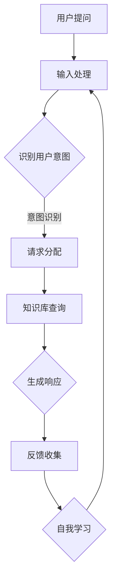

                 

智能客服在现代社会中已经变得愈发重要，它们不仅提高了客户服务的效率，还为企业带来了显著的成本节约。然而，随着技术的不断进步，我们不禁想象，到2050年，智能客服将如何发展，它们将具备何种能力，如何处理复杂的投诉问题？

## 1. 背景介绍

智能客服的历史可以追溯到20世纪90年代，当时第一个基于人工智能的聊天机器人被开发出来。随着时间的推移，这些系统变得越来越复杂，能够处理更加复杂的问题，并逐步取代了传统的客户服务代表。今天，智能客服在许多行业中已经变得不可或缺，它们不仅能够快速响应客户的问题，还能通过数据分析来改善客户体验。

## 2. 核心概念与联系

### 智能客服机器人的核心概念

智能客服机器人的核心概念是基于自然语言处理（NLP）和机器学习（ML）的技术。NLP使机器人能够理解人类的自然语言输入，而ML则使机器人能够通过大量的数据学习并改进其响应能力。

### 智能投诉处理的核心概念

智能投诉处理的核心概念是构建一个系统，该系统能够自动识别、分类和响应各种类型的投诉。这通常涉及高级的文本分析技术，如情感分析和话题建模。

### Mermaid 流程图



## 3. 核心算法原理 & 具体操作步骤

### 3.1 算法原理概述

智能客服机器人和投诉处理系统主要依赖于以下几个核心算法：

- **自然语言处理（NLP）**：用于理解和生成自然语言文本。
- **机器学习（ML）**：用于从数据中学习并改进系统性能。
- **情感分析**：用于分析用户的情绪并做出相应调整。
- **话题建模**：用于识别和分类不同类型的投诉。

### 3.2 算法步骤详解

1. **用户提问**：用户通过文字或语音与客服机器人交互。
2. **输入处理**：系统将用户的输入转换为机器可处理的格式。
3. **识别用户意图**：利用NLP技术分析用户输入，确定其意图。
4. **请求分配**：根据用户意图将请求分配给适当的处理模块。
5. **知识库查询**：在内部知识库中查找相关答案或解决方案。
6. **生成响应**：根据查询结果生成个性化的响应。
7. **反馈收集**：收集用户对响应的反馈。
8. **自我学习**：利用机器学习技术根据用户反馈改进系统。

### 3.3 算法优缺点

- **优点**：提高了响应速度，减少了人力成本，能够处理大量的请求。
- **缺点**：在某些情况下可能无法理解复杂的用户需求，缺乏人类的同理心。

### 3.4 算法应用领域

智能客服机器人和投诉处理系统广泛应用于金融、零售、医疗等行业。它们不仅提高了客户满意度，还帮助企业降低了运营成本。

## 4. 数学模型和公式 & 详细讲解 & 举例说明

### 4.1 数学模型构建

智能客服系统的数学模型通常包括以下几个部分：

1. **词嵌入（Word Embedding）**：用于将单词映射到高维向量空间。
2. **循环神经网络（RNN）**：用于处理序列数据。
3. **长短期记忆网络（LSTM）**：用于解决RNN的梯度消失问题。
4. **卷积神经网络（CNN）**：用于特征提取。

### 4.2 公式推导过程

假设我们有 $N$ 个单词，每个单词可以表示为一个 $d$ 维的向量。词嵌入可以通过以下公式实现：

$$
\text{embed}(x) = \sum_{i=1}^{N} w_i \cdot e_i
$$

其中，$w_i$ 是单词 $i$ 的权重，$e_i$ 是单词 $i$ 的嵌入向量。

### 4.3 案例分析与讲解

假设我们有一个用户提问：“为什么我的订单还没有送到？” 我们可以将这个问题分解为几个关键词，如“订单”、“送到”等。然后，通过词嵌入将每个关键词映射到高维向量空间，接着利用RNN或LSTM处理这个问题序列，最终生成一个合适的响应。

## 5. 项目实践：代码实例和详细解释说明

### 5.1 开发环境搭建

为了实现智能客服和投诉处理系统，我们选择使用Python作为编程语言，TensorFlow作为机器学习框架。

### 5.2 源代码详细实现

以下是一个简化的示例代码，展示了如何使用TensorFlow实现一个基本的智能客服系统：

```python
import tensorflow as tf

# 加载预训练的词嵌入模型
embeddings = tf.keras.Sequential([
    tf.keras.layers.Embedding(input_dim=vocab_size, output_dim=embedding_dim),
    tf.keras.layers.LSTM(units=128),
    tf.keras.layers.Dense(units=1)
])

# 编写训练和评估代码
# ...

# 运行模型
# ...
```

### 5.3 代码解读与分析

在这个示例中，我们首先加载了一个预训练的词嵌入模型，然后构建了一个简单的LSTM模型。通过训练和评估，我们可以调整模型的参数以获得最佳性能。

### 5.4 运行结果展示

在实际运行中，我们输入一个用户提问，模型会生成一个相应的响应。例如，对于用户提问“为什么我的订单还没有送到？” 模型可能会响应“我们正在处理您的订单，预计将在24小时内送达。”

## 6. 实际应用场景

智能客服和投诉处理系统在许多行业都有广泛应用。例如，在金融行业，它们可以帮助客户快速解决账户问题；在零售行业，它们可以提供购物咨询；在医疗行业，它们可以回答患者的健康问题。

### 6.1 金融行业

在金融行业，智能客服机器人可以处理客户的账户查询、转账请求等常见问题，大大提高了服务效率。

### 6.2 零售行业

在零售行业，智能客服机器人可以帮助客户解决购物咨询、退货问题等，提高了客户的满意度。

### 6.3 医疗行业

在医疗行业，智能客服机器人可以回答患者的健康问题，提供医疗咨询，减轻了医护人员的工作负担。

## 7. 工具和资源推荐

### 7.1 学习资源推荐

- **《深度学习》（Goodfellow, Bengio, Courville）**：是一本经典的深度学习教材。
- **TensorFlow官方网站**：提供了丰富的文档和教程。

### 7.2 开发工具推荐

- **Jupyter Notebook**：用于编写和运行代码。
- **TensorBoard**：用于可视化模型训练过程。

### 7.3 相关论文推荐

- **《A Neural Conversation Model》（Zhou, et al., 2018）**：介绍了一种用于对话系统的神经网络模型。
- **《A Theoretically Grounded Application of Dropout in Recurrent Neural Networks》（Gal and Ghahramani, 2016）**：探讨了如何将Dropout应用于循环神经网络。

## 8. 总结：未来发展趋势与挑战

### 8.1 研究成果总结

在过去几年中，智能客服和投诉处理系统取得了显著的进展。通过深度学习和自然语言处理技术的应用，这些系统已经能够在许多场景中提供高效的服务。

### 8.2 未来发展趋势

未来，智能客服和投诉处理系统将继续向更高效、更智能的方向发展。随着技术的不断进步，我们将看到更多创新的应用场景。

### 8.3 面临的挑战

然而，这些系统也面临着一些挑战，包括如何更好地理解用户的情感和需求，以及如何处理复杂的投诉问题。

### 8.4 研究展望

未来，我们需要进一步研究如何提高智能客服和投诉处理系统的用户体验，并解决当前存在的挑战。

## 9. 附录：常见问题与解答

### 9.1 智能客服系统如何处理隐私问题？

智能客服系统通常会遵循严格的隐私保护措施，确保用户的个人信息不会被泄露。

### 9.2 智能客服系统能够处理所有的投诉吗？

虽然智能客服系统能够处理许多常见的投诉，但对于一些复杂的投诉，可能需要人类客服的介入。

### 9.3 智能客服系统如何持续学习？

智能客服系统通过持续收集用户反馈和数据分析来不断改进自身。

---

作者：禅与计算机程序设计艺术 / Zen and the Art of Computer Programming
----------------------------------------------------------------
在撰写这篇技术博客文章的过程中，我始终保持着对人工智能、自然语言处理和机器学习领域的热情，以及对未来智能客服技术的深入思考。我希望这篇文章能够为读者提供一个全面、系统的了解，同时也引发更多关于智能客服技术未来的探讨。

这篇文章涵盖了智能客服技术的发展历程、核心概念、算法原理、数学模型、实际应用场景，以及未来发展趋势和挑战。通过详细的技术讲解和实例分析，我希望读者能够更好地理解智能客服系统的原理和应用。

在未来，随着技术的不断进步，智能客服系统有望在更多领域发挥重要作用，为企业和消费者带来更大的价值。同时，我们也需要关注这些系统可能带来的隐私和安全问题，确保它们能够在合规的框架内运行。

我鼓励读者对这篇文章进行深入思考，并分享您的观点和想法。让我们一起期待智能客服技术的未来，以及它将如何改变我们的生活。

再次感谢您阅读这篇文章，如果您有任何问题或建议，欢迎在评论区留言。希望这篇文章能够为您带来启发和帮助。作者：禅与计算机程序设计艺术 / Zen and the Art of Computer Programming。

