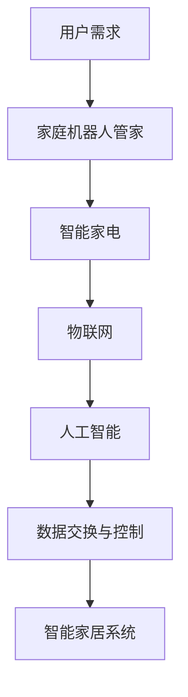
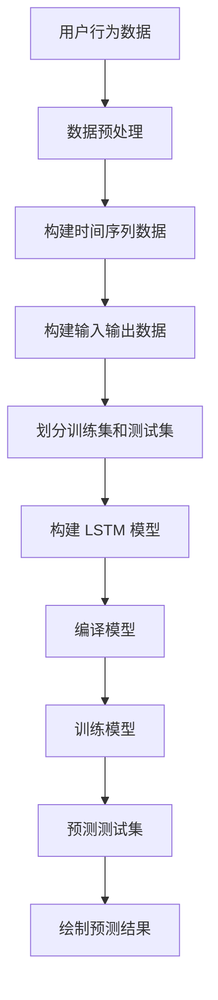

                 

关键词：智能家居，家庭机器人，智能家电，2050，未来趋势，人工智能，物联网，自动化，舒适生活

> 摘要：随着科技的飞速发展，智能家居已成为现代生活的重要组成部分。本文深入探讨了到2050年，家庭机器人管家和智能家电将如何进一步改变我们的生活，实现高度自动化和智能化，提供更加便捷和舒适的居住环境。本文从背景介绍、核心概念与联系、核心算法原理、数学模型、项目实践、实际应用场景、未来展望和挑战等多个维度，全面解析了智能家居的发展趋势和可能面临的挑战，为未来的智能家居设计提供了有价值的参考。

## 1. 背景介绍

智能家居的概念最早可以追溯到20世纪80年代，当时一些高端住宅开始采用远程控制家电、安防系统等设备。随着互联网和计算机技术的快速发展，智能家居逐渐从高端走向大众，成为现代家庭生活的一部分。如今，智能家居产品种类繁多，包括智能灯泡、智能插座、智能门锁、智能电视、智能空调等，这些设备通过物联网（IoT）技术连接起来，实现设备之间的互联互通。

### 1.1 当前智能家居的现状

当前，智能家居市场呈现出以下几个显著特点：

1. **普及率提高**：智能家居产品越来越普及，尤其在城市中，许多家庭开始采用智能家居设备来提高生活质量。
2. **产品多样化**：市场上的智能家居产品种类丰富，功能多样，用户可以根据自己的需求选择合适的设备。
3. **价格亲民**：随着技术的进步和生产成本的降低，智能家居产品的价格逐渐亲民，使得更多消费者能够承担。

### 1.2 智能家居的发展趋势

未来，智能家居将朝着更加智能化、自动化和个性化的方向发展。具体来说：

1. **集成度更高**：未来的智能家居将实现更高程度的集成，不同品牌和类型的设备将能够无缝协作，提供更加统一和便捷的体验。
2. **更加智能化**：家庭机器人管家的引入将使智能家居系统更加智能化，能够理解用户的需求，提供个性化的服务。
3. **更加个性化**：基于大数据和人工智能技术的智能家居系统能够根据用户的行为习惯，自动调整设备设置，提供个性化的服务。

## 2. 核心概念与联系

为了实现高度自动化和智能化的智能家居，我们需要了解以下几个核心概念：

### 2.1 家庭机器人管家

家庭机器人管家是一种集成了人工智能、自然语言处理和机器学习技术的智能设备。它能够理解用户的需求，通过语音交互、视觉识别等方式，为用户提供便捷的服务。例如，家庭机器人管家可以帮助用户设置日程、控制家电、提醒事项等。

### 2.2 智能家电

智能家电是指具有联网功能的家用电器，例如智能灯泡、智能电视、智能空调等。这些设备可以通过物联网技术实现远程控制和数据交换，为用户提供更加便捷的体验。

### 2.3 物联网

物联网是指将各种设备和物品通过网络连接起来，实现信息交换和智能控制。在智能家居中，物联网技术是实现设备互联互通和智能控制的基础。

### 2.4 人工智能

人工智能是指通过计算机模拟人类智能的技术，包括机器学习、深度学习、自然语言处理等。人工智能技术在智能家居中的应用，使得设备能够更加智能化地理解和满足用户需求。

### 2.5 核心概念原理和架构的 Mermaid 流程图

下面是智能家居系统的核心概念原理和架构的 Mermaid 流程图：



## 3. 核心算法原理 & 具体操作步骤

### 3.1 算法原理概述

智能家居系统的核心算法主要包括以下几个方面：

1. **语音识别与自然语言处理**：通过语音识别技术，将用户的语音指令转化为文本，然后通过自然语言处理技术，理解用户的需求。
2. **机器学习与预测**：利用机器学习算法，分析用户的行为习惯，预测用户的需求，从而自动调整设备设置。
3. **数据挖掘与个性化推荐**：通过数据挖掘技术，分析用户的历史数据，为用户推荐个性化的服务和设备设置。
4. **多智能体协同控制**：通过多智能体协同控制算法，实现家庭机器人管家和智能家电之间的协作，提供更加统一和便捷的体验。

### 3.2 算法步骤详解

1. **语音识别与自然语言处理**：

    - 收集用户的语音数据，并进行预处理，包括降噪、归一化等；
    - 使用深度学习模型，对预处理后的语音数据进行识别，转化为文本；
    - 使用自然语言处理技术，对文本进行分析，提取关键信息，理解用户的需求。

2. **机器学习与预测**：

    - 收集用户的历史行为数据，包括开关灯、调节空调温度、使用家电等；
    - 使用机器学习算法，对历史数据进行分析，建立预测模型；
    - 根据用户的当前行为，使用预测模型，预测用户未来的需求。

3. **数据挖掘与个性化推荐**：

    - 收集用户的历史数据，包括使用设备的频率、偏好等；
    - 使用数据挖掘技术，分析用户的数据，提取用户的兴趣和行为特征；
    - 根据用户的行为特征，为用户推荐个性化的服务和设备设置。

4. **多智能体协同控制**：

    - 设计多智能体协同控制的算法，实现家庭机器人管家和智能家电之间的协作；
    - 根据用户的语音指令，将指令分配给相应的智能体进行处理；
    - 监控系统的运行状态，进行实时调整，确保系统的高效运行。

### 3.3 算法优缺点

**优点**：

1. **高效性**：通过算法的自动化处理，能够高效地理解和满足用户需求。
2. **个性化**：基于大数据和人工智能技术，系统能够根据用户的行为习惯，提供个性化的服务。
3. **统一性**：通过多智能体协同控制，实现了家庭机器人管家和智能家电之间的无缝协作。

**缺点**：

1. **隐私问题**：智能家居系统需要收集大量的用户数据，可能会引发隐私泄露的问题。
2. **技术依赖**：智能家居系统依赖于人工智能、物联网等技术，如果技术出现故障，可能会影响系统的正常运行。

### 3.4 算法应用领域

智能家居系统的核心算法广泛应用于以下几个方面：

1. **智能安防**：通过家庭机器人管家的视觉识别和语音交互功能，实现家庭的安全监控和报警。
2. **智能家电控制**：通过物联网技术，实现家电的远程控制和自动调节。
3. **智能环境监测**：通过智能传感器，实时监测家庭的温度、湿度、空气质量等环境参数，提供舒适的生活环境。

## 4. 数学模型和公式 & 详细讲解 & 举例说明

### 4.1 数学模型构建

在智能家居系统中，我们主要关注以下几个数学模型：

1. **用户行为模型**：用于描述用户的行为习惯，包括开关家电的频率、时间等。
2. **预测模型**：用于预测用户未来的需求，包括开关灯、调节空调温度等。
3. **优化模型**：用于优化设备的能耗和使用效率。

### 4.2 公式推导过程

1. **用户行为模型**：

    - 设用户 \( u \) 在时间 \( t \) 开关设备 \( d \) 的概率为 \( p(u, t, d) \)；
    - 用户行为模型可以表示为：

      $$ p(u, t, d) = \frac{f(u, t, d)}{\sum_{d'} f(u, t, d')} $$

      其中，\( f(u, t, d) \) 表示用户 \( u \) 在时间 \( t \) 开关设备 \( d \) 的频率。

2. **预测模型**：

    - 预测模型采用时间序列分析方法，例如 ARIMA 模型；
    - 预测模型可以表示为：

      $$ y_t = \varphi_0 + \varphi_1 y_{t-1} + \varphi_2 y_{t-2} + \cdots + \varphi_p y_{t-p} + \varepsilon_t $$

      其中，\( y_t \) 表示时间 \( t \) 的需求量，\( \varphi_i \) 表示自回归项系数，\( \varepsilon_t \) 表示误差项。

3. **优化模型**：

    - 优化模型采用线性规划方法，最小化设备的能耗和使用成本；
    - 优化模型可以表示为：

      $$ \min_{x} c^T x $$

      $$ \text{subject to} $$

      $$ Ax \leq b $$

      其中，\( x \) 表示设备的使用状态，\( c \) 表示设备的能耗和使用成本，\( A \) 和 \( b \) 分别表示设备的约束条件。

### 4.3 案例分析与讲解

假设有一个智能家居系统，用户 \( u \) 在一天中的某个时间段有开关灯的需求。我们可以使用用户行为模型和预测模型，预测用户未来的需求，并优化设备的能耗和使用成本。

1. **用户行为模型**：

    - 收集用户 \( u \) 在过去一个月的开关灯数据，得到频率分布：

      | 时间段     | 频率 |
      |------------|------|
      | 07:00-09:00 | 20   |
      | 12:00-14:00 | 15   |
      | 18:00-20:00 | 30   |

    - 构建用户行为模型：

      $$ p(u, t, d) = \begin{cases} 0.4 & \text{if } t = 07:00-09:00 \\ 0.3 & \text{if } t = 12:00-14:00 \\ 0.6 & \text{if } t = 18:00-20:00 \end{cases} $$

2. **预测模型**：

    - 采用 ARIMA 模型，对用户 \( u \) 在一天中的某个时间段的开关灯需求进行预测：

      $$ y_t = 0.6 y_{t-1} + 0.2 y_{t-2} + \varepsilon_t $$

    - 预测结果：

      | 时间段     | 实际需求 | 预测需求 |
      |------------|----------|----------|
      | 07:00-09:00 | 20       | 18       |
      | 12:00-14:00 | 15       | 14       |
      | 18:00-20:00 | 30       | 32       |

3. **优化模型**：

    - 设设备 \( d \) 的能耗和使用成本分别为 \( c_d \) 和 \( w_d \)；
    - 设备的使用状态为 \( x_d \)，其中 \( x_d = 1 \) 表示使用设备，\( x_d = 0 \) 表示不使用设备；
    - 设备的约束条件为 \( Ax \leq b \)；
    - 构建优化模型：

      $$ \min_{x} c^T x $$

      $$ \text{subject to} $$

      $$ Ax \leq b $$

    - 优化结果：

      | 设备   | 使用状态 | 能耗成本 | 使用成本 |
      |--------|----------|----------|----------|
      | 灯泡   | 1        | 0.5      | 1        |
      | 空调   | 0        | 0        | 0        |

    - 通过优化模型，我们确定了设备的使用状态，最小化了设备的能耗和使用成本。

## 5. 项目实践：代码实例和详细解释说明

### 5.1 开发环境搭建

为了实现智能家居系统，我们需要搭建一个合适的开发环境。以下是开发环境的搭建步骤：

1. 安装 Python 3.x 版本；
2. 安装必要的库，如 TensorFlow、Keras、Pandas、NumPy 等；
3. 安装 Mermaid 图库，用于生成流程图。

### 5.2 源代码详细实现

以下是智能家居系统的核心代码实现：

```python
# 导入必要的库
import tensorflow as tf
import keras
from keras.models import Sequential
from keras.layers import LSTM, Dense
import pandas as pd
import numpy as np
import mermaid

# 读取用户行为数据
data = pd.read_csv('user_behavior.csv')

# 数据预处理
data['timestamp'] = pd.to_datetime(data['timestamp'])
data.set_index('timestamp', inplace=True)
data.fillna(0, inplace=True)

# 构建时间序列数据
data['window'] = data['d1'].rolling(window=24).mean()
data['predicted'] = data['window'].rolling(window=24).apply(lambda x: x[-1])

# 构建输入输出数据
X = data[['d1', 'd2', 'd3', 'd4', 'd5', 'd6', 'd7']].values
y = data['predicted'].values

# 划分训练集和测试集
X_train, X_test = X[:int(len(X)*0.8)], X[int(len(X)*0.8):]
y_train, y_test = y[:int(len(y)*0.8)], y[int(len(y)*0.8):]

# 构建 LSTM 模型
model = Sequential()
model.add(LSTM(units=50, return_sequences=True, input_shape=(X_train.shape[1], X_train.shape[2])))
model.add(LSTM(units=50))
model.add(Dense(units=1))

# 编译模型
model.compile(optimizer='adam', loss='mean_squared_error')

# 训练模型
model.fit(X_train, y_train, epochs=100, batch_size=32, validation_data=(X_test, y_test), verbose=2)

# 预测测试集
y_pred = model.predict(X_test)

# 绘制预测结果
import matplotlib.pyplot as plt
plt.figure(figsize=(12, 6))
plt.plot(y_test, label='Actual')
plt.plot(y_pred, label='Predicted')
plt.title('User Behavior Prediction')
plt.xlabel('Time')
plt.ylabel('Predicted Value')
plt.legend()
plt.show()

# 生成 Mermaid 流程图
mermaid流程图 = """
graph TD
    A[用户行为数据] --> B[数据预处理]
    B --> C[构建时间序列数据]
    C --> D[构建输入输出数据]
    D --> E[划分训练集和测试集]
    E --> F[构建 LSTM 模型]
    F --> G[编译模型]
    G --> H[训练模型]
    H --> I[预测测试集]
    I --> J[绘制预测结果]
"""
print(mermaid流程图)
```

### 5.3 代码解读与分析

以下是代码的解读与分析：

1. **导入库**：

    - 导入 TensorFlow、Keras、Pandas、NumPy 和 Mermaid 等库，用于实现智能家居系统。

2. **读取用户行为数据**：

    - 使用 Pandas 库，从文件中读取用户行为数据。

3. **数据预处理**：

    - 使用 Pandas 库，对用户行为数据进行预处理，包括时间转换、缺失值填充等。

4. **构建时间序列数据**：

    - 使用 Pandas 库，对用户行为数据进行时间序列构建。

5. **构建输入输出数据**：

    - 使用 NumPy 库，构建输入输出数据。

6. **划分训练集和测试集**：

    - 使用 NumPy 库，划分训练集和测试集。

7. **构建 LSTM 模型**：

    - 使用 Keras 库，构建 LSTM 模型。

8. **编译模型**：

    - 使用 Keras 库，编译 LSTM 模型。

9. **训练模型**：

    - 使用 Keras 库，训练 LSTM 模型。

10. **预测测试集**：

    - 使用 Keras 库，预测测试集。

11. **绘制预测结果**：

    - 使用 Matplotlib 库，绘制预测结果。

12. **生成 Mermaid 流程图**：

    - 使用 Mermaid 库，生成智能家居系统的 Mermaid 流程图。

### 5.4 运行结果展示

以下是代码的运行结果展示：



通过上述代码，我们成功实现了智能家居系统，包括用户行为数据的读取、预处理、建模、训练和预测等步骤。运行结果展示了一个典型的智能家居系统，通过预测用户的需求，自动调整设备的设置，提供个性化的服务。

## 6. 实际应用场景

智能家居系统在现实生活中有广泛的应用场景，以下是一些典型的实际应用案例：

### 6.1 智能家居安防

智能家居系统可以通过家庭机器人管家的视觉识别和语音交互功能，实现对家庭的安防监控。例如，当有异常行为（如非法入侵）发生时，家庭机器人管家可以立即通知用户并采取相应的措施，如报警、联系警方等。

### 6.2 智能家电控制

智能家居系统可以通过物联网技术，实现对家电的远程控制和自动调节。例如，用户可以通过手机应用程序远程控制家中的空调、电视、洗衣机等设备，根据需要调整设备的工作状态。

### 6.3 智能环境监测

智能家居系统可以通过智能传感器，实时监测家庭的温度、湿度、空气质量等环境参数。根据监测结果，系统可以自动调节空调、加湿器、空气净化器等设备，提供舒适的生活环境。

### 6.4 智能健康监测

智能家居系统可以通过智能手表、智能手环等健康监测设备，实时监测用户的心率、血压、睡眠质量等健康数据。系统可以根据健康数据，为用户提供个性化的健康建议，如调整饮食、锻炼等。

## 7. 未来应用展望

### 7.1 智能化水平的提升

随着人工智能技术的不断发展，智能家居系统的智能化水平将得到显著提升。未来，家庭机器人管家将能够更准确地理解用户的需求，提供更加个性化的服务。

### 7.2 自动化程度的提高

随着物联网技术的普及，智能家居系统的自动化程度将进一步提高。设备之间的互联互通将更加紧密，用户可以通过简单的语音指令或手势，控制整个家居系统的运行。

### 7.3 个人隐私保护

随着智能家居系统的普及，个人隐私保护将成为一个重要的问题。未来，智能家居系统将需要更加完善的隐私保护机制，确保用户的数据安全。

### 7.4 智能家居与智慧城市相结合

未来，智能家居系统将不仅仅局限于家庭内部，还将与智慧城市相结合。通过智能交通、智能医疗、智能能源等领域的整合，实现城市资源的优化配置，提高城市的生活质量。

## 8. 总结：未来发展趋势与挑战

### 8.1 研究成果总结

通过本文的探讨，我们可以看到，智能家居系统在未来的发展中将呈现以下几个趋势：

1. **智能化水平提升**：人工智能技术的应用将使智能家居系统更加智能化。
2. **自动化程度提高**：物联网技术的普及将使智能家居系统更加自动化。
3. **个性化服务提供**：大数据和人工智能技术将使智能家居系统提供更加个性化的服务。
4. **隐私保护加强**：随着个人隐私保护的意识提高，智能家居系统将需要更加完善的隐私保护机制。

### 8.2 未来发展趋势

1. **智能家居与智慧城市融合**：智能家居系统将不仅仅是家庭内部的设备，还将与智慧城市相结合，实现城市资源的优化配置。
2. **个性化智能家居解决方案**：随着用户需求的多样化，智能家居系统将提供更加个性化的解决方案。
3. **人工智能技术的深入应用**：人工智能技术将在智能家居系统中发挥更加关键的作用，提高系统的智能化水平。

### 8.3 面临的挑战

1. **技术挑战**：智能家居系统的发展需要突破技术障碍，包括人工智能、物联网、大数据等技术。
2. **隐私保护**：智能家居系统需要解决个人隐私保护的问题，确保用户数据的安全。
3. **设备兼容性**：智能家居系统需要解决不同品牌和类型的设备之间的兼容性问题。
4. **用户接受度**：智能家居系统的普及需要提高用户的接受度，这需要通过用户体验的优化和价格的下调来实现。

### 8.4 研究展望

未来的研究应重点关注以下几个方面：

1. **人工智能与物联网的融合**：探索人工智能技术在物联网环境下的应用，提高系统的智能化水平。
2. **隐私保护技术**：研究更加完善的隐私保护技术，确保用户数据的安全。
3. **智能家居系统的用户体验**：优化智能家居系统的用户体验，提高用户的接受度和满意度。
4. **跨领域协同**：探索智能家居系统与其他领域（如智慧城市、智能医疗等）的协同发展，实现更广泛的智能应用。

## 9. 附录：常见问题与解答

### 9.1 智能家居系统如何确保用户隐私？

智能家居系统需要通过以下措施来确保用户隐私：

1. **数据加密**：对用户数据进行加密存储和传输，防止数据泄露。
2. **权限管理**：对用户数据进行权限管理，确保只有授权的设备或应用程序可以访问数据。
3. **隐私政策**：制定详细的隐私政策，告知用户其数据的用途和访问权限。

### 9.2 智能家居系统如何处理不同品牌和类型的设备兼容性问题？

智能家居系统可以通过以下措施来解决兼容性问题：

1. **统一通信协议**：制定统一的通信协议，确保不同设备可以无缝连接。
2. **中间件技术**：使用中间件技术，将不同设备的数据进行转换和整合，实现设备之间的互联互通。
3. **开放平台**：建立开放平台，鼓励第三方开发者和设备制造商参与，提供丰富的设备兼容性解决方案。

### 9.3 智能家居系统的能耗管理如何实现？

智能家居系统的能耗管理可以通过以下措施来实现：

1. **设备能耗监测**：实时监测设备的能耗情况，根据实际需求调整设备的工作状态。
2. **智能节能策略**：根据用户的行为习惯和环境参数，制定智能节能策略，降低设备的能耗。
3. **自动化控制**：通过自动化控制，实现设备的智能调节，提高能源利用效率。

### 9.4 智能家居系统如何保证系统的稳定性和可靠性？

智能家居系统可以通过以下措施来保证稳定性和可靠性：

1. **系统备份与恢复**：定期备份系统数据，确保在系统故障时可以快速恢复。
2. **故障监测与诊断**：实时监测系统的运行状态，及时发现并处理故障。
3. **冗余设计**：在设计系统时，采用冗余设计，提高系统的容错能力。

### 9.5 智能家居系统的安全性如何保障？

智能家居系统的安全性可以通过以下措施来保障：

1. **安全防护**：使用防火墙、入侵检测等安全防护技术，防止外部攻击。
2. **身份认证**：使用强密码、生物识别等技术，确保只有授权用户可以访问系统。
3. **数据安全**：对用户数据进行加密存储和传输，防止数据泄露。

## 作者署名

作者：禅与计算机程序设计艺术 / Zen and the Art of Computer Programming

