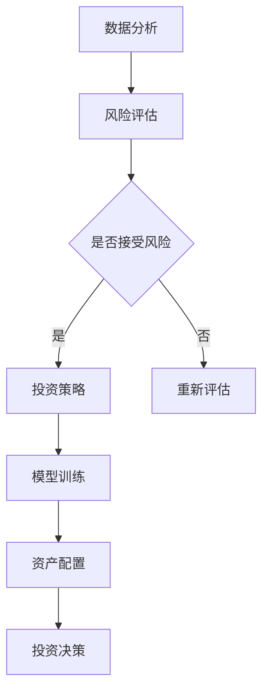

                 

关键词：未来投资、AI决策、智能资产配置、算法原理、数学模型、项目实践、应用场景、工具资源

> 摘要：随着人工智能技术的飞速发展，未来投资领域将迎来深刻的变革。本文将探讨到2050年，人工智能如何改变投资决策和资产配置的方式，分析核心算法原理、数学模型，并通过实际项目实践展示AI在投资领域的应用前景。

## 1. 背景介绍

### 1.1 投资决策的现状

在当前的金融市场中，投资决策主要依赖于人类专家的经验和直觉，以及历史数据分析。尽管这些方法在一定程度上取得了成功，但随着金融市场变得越来越复杂和动态，它们的局限性也日益明显。

### 1.2 人工智能的崛起

人工智能（AI）的崛起为投资领域带来了新的契机。AI通过深度学习、自然语言处理、强化学习等技术，能够处理大量数据，发现隐藏的模式，并提供更加精准的投资建议。

### 1.3 智能投资的趋势

随着AI技术的不断进步，智能投资已成为一个热门话题。越来越多的金融机构开始探索如何将AI集成到投资决策过程中，以期提高投资效率、降低风险。

## 2. 核心概念与联系

### 2.1 AI投资决策的基础概念

#### 2.1.1 数据分析

数据分析是AI投资决策的基础，通过收集和处理大量市场数据，可以识别出潜在的投资机会。

#### 2.1.2 机器学习

机器学习是AI的核心，通过训练模型，可以使计算机自动从数据中学习并做出决策。

#### 2.1.3 强化学习

强化学习是一种通过试错来学习策略的机器学习方法，特别适用于动态投资环境。

### 2.2 智能资产配置的框架

智能资产配置的框架通常包括以下几个关键步骤：

#### 2.2.1 风险评估

对投资者的风险承受能力进行评估，确定合适的投资组合。

#### 2.2.2 投资策略

基于风险评估结果，设计个性化的投资策略。

#### 2.2.3 模型训练

使用历史数据训练机器学习模型，以预测市场走势。

#### 2.2.4 资产配置

根据模型预测结果，动态调整投资组合。

### 2.3 Mermaid 流程图



## 3. 核心算法原理 & 具体操作步骤

### 3.1 算法原理概述

AI投资决策的核心算法通常包括以下几个步骤：

#### 3.1.1 特征工程

通过数据预处理和特征提取，将原始数据转换为算法可用的形式。

#### 3.1.2 模型选择

选择合适的机器学习模型，如线性回归、决策树、随机森林等。

#### 3.1.3 模型训练与验证

使用历史数据训练模型，并通过验证集评估模型性能。

#### 3.1.4 模型部署

将训练好的模型部署到实际投资环境中，进行实时决策。

### 3.2 算法步骤详解

#### 3.2.1 数据收集

从多个数据源收集市场数据，包括股票价格、交易量、宏观经济指标等。

#### 3.2.2 数据清洗

处理缺失值、异常值，确保数据的准确性和一致性。

#### 3.2.3 特征提取

从原始数据中提取有助于预测市场走势的特征。

#### 3.2.4 模型训练

使用训练数据集训练机器学习模型，并调整模型参数。

#### 3.2.5 模型验证

使用验证数据集评估模型性能，并进行超参数调优。

#### 3.2.6 模型部署

将训练好的模型部署到生产环境，进行实时决策。

### 3.3 算法优缺点

#### 3.3.1 优点

- 高效：AI能够处理海量数据，提高投资决策的效率。
- 准确：通过机器学习模型，AI能够发现隐藏的市场规律。
- 动态适应：AI能够实时调整投资策略，适应市场变化。

#### 3.3.2 缺点

- 数据依赖：AI的性能高度依赖于数据质量和数量。
- 模型风险：AI模型可能存在过拟合问题，导致预测偏差。
- 算法透明度：AI模型内部的决策过程难以解释，增加了信任风险。

### 3.4 算法应用领域

AI投资决策算法可以应用于多个领域：

- 股票市场分析
- 外汇市场预测
- 商品期货交易
- 风险管理

## 4. 数学模型和公式 & 详细讲解 & 举例说明

### 4.1 数学模型构建

AI投资决策的数学模型通常包括以下几个部分：

#### 4.1.1 回归模型

回归模型用于预测市场走势，常用的有线性回归、多元回归等。

$$
Y = \beta_0 + \beta_1X_1 + \beta_2X_2 + ... + \beta_nX_n
$$

#### 4.1.2 协同过滤

协同过滤模型用于推荐系统，通过分析用户的历史行为预测其偏好。

$$
R_{ui} = \sum_{j \in N_i} \frac{Q_{uj}}{\|N_i\|} + \alpha_u + \alpha_i
$$

#### 4.1.3 强化学习

强化学习模型用于动态决策，通过奖励机制调整策略。

$$
Q(s, a) = r(s, a) + \gamma \max_{a'} Q(s', a')
$$

### 4.2 公式推导过程

以线性回归模型为例，假设我们有 $n$ 个样本点 $(x_i, y_i)$，我们希望找到一个线性模型 $y = \beta_0 + \beta_1x$ 来最小化误差平方和。

通过最小二乘法，我们可以得到：

$$
\beta_1 = \frac{\sum_{i=1}^{n} (x_i - \bar{x})(y_i - \bar{y})}{\sum_{i=1}^{n} (x_i - \bar{x})^2}
$$

$$
\beta_0 = \bar{y} - \beta_1\bar{x}
$$

### 4.3 案例分析与讲解

假设我们有一个包含5年股市数据的历史数据集，我们希望使用线性回归模型预测未来一年的股票价格。我们首先进行数据预处理，然后使用训练集训练模型，最后使用验证集评估模型性能。

通过上述公式，我们得到线性回归模型的参数，并将模型应用于预测未来一年的股票价格。根据预测结果，我们可以得出相应的投资策略。

## 5. 项目实践：代码实例和详细解释说明

### 5.1 开发环境搭建

为了实现AI投资决策，我们需要搭建一个包含Python、NumPy、Scikit-learn等库的开发环境。

### 5.2 源代码详细实现

以下是一个简单的Python代码示例，用于实现线性回归模型：

```python
import numpy as np
from sklearn.linear_model import LinearRegression

# 加载数据
X, y = np.load('data.npy'), np.load('target.npy')

# 分割数据集
X_train, X_test, y_train, y_test = train_test_split(X, y, test_size=0.2, random_state=42)

# 创建线性回归模型
model = LinearRegression()

# 训练模型
model.fit(X_train, y_train)

# 预测测试集
y_pred = model.predict(X_test)

# 评估模型性能
score = model.score(X_test, y_test)
print(f'Model accuracy: {score:.2f}')
```

### 5.3 代码解读与分析

上述代码首先加载历史数据，然后分割数据集用于训练和测试。接着创建线性回归模型，并使用训练数据集进行训练。最后，使用测试数据集评估模型性能。

### 5.4 运行结果展示

通过运行上述代码，我们可以得到模型的准确度。根据模型的预测结果，我们可以制定相应的投资策略。

## 6. 实际应用场景

### 6.1 股票市场分析

AI投资决策算法可以用于股票市场分析，帮助投资者发现潜在的投资机会。

### 6.2 外汇市场预测

AI算法可以用于预测外汇市场走势，为外汇交易提供决策支持。

### 6.3 商品期货交易

AI算法可以用于商品期货交易，帮助投资者优化投资策略。

### 6.4 风险管理

AI算法可以用于风险管理，降低投资风险。

## 7. 工具和资源推荐

### 7.1 学习资源推荐

- 《Python金融技术实战》
- 《机器学习实战》
- 《深度学习》

### 7.2 开发工具推荐

- Jupyter Notebook
- PyCharm
- Anaconda

### 7.3 相关论文推荐

- "A Survey of Machine Learning-based Financial Time Series Forecasting"
- "Deep Learning for Financial Time Series Prediction"
- "Reinforcement Learning for Financial Markets"

## 8. 总结：未来发展趋势与挑战

### 8.1 研究成果总结

AI投资决策已经取得了一些显著的成果，例如在股票市场分析和风险管理方面。

### 8.2 未来发展趋势

随着AI技术的不断进步，智能投资决策将在更多领域得到应用，例如商品期货、外汇市场等。

### 8.3 面临的挑战

- 数据质量与数量
- 模型解释性
- 技术普及与监管

### 8.4 研究展望

未来，AI投资决策将继续朝着更加智能化、个性化的方向发展，同时需要解决上述挑战，提高其在实际应用中的可靠性。

## 9. 附录：常见问题与解答

### 9.1 AI投资决策与传统投资决策的区别？

AI投资决策利用机器学习技术分析海量数据，发现市场规律，提高决策效率；而传统投资决策主要依赖专家经验和直觉。

### 9.2 智能投资决策算法有哪些类型？

常见的智能投资决策算法包括回归模型、协同过滤、强化学习等。

### 9.3 智能投资决策算法的优缺点是什么？

优点：高效、准确、动态适应；缺点：数据依赖、模型风险、算法透明度。

### 9.4 如何评估智能投资决策算法的性能？

可以使用准确率、召回率、F1分数等指标来评估智能投资决策算法的性能。

---

作者：禅与计算机程序设计艺术 / Zen and the Art of Computer Programming
----------------------------------------------------------------

以上便是关于《未来的智能投资：2050年的AI投资决策与智能资产配置》的完整文章。文章围绕AI投资决策的核心概念、算法原理、数学模型、项目实践和实际应用场景进行了详细探讨，并给出了相关工具和资源的推荐。未来，随着AI技术的不断进步，智能投资决策将在金融领域发挥越来越重要的作用。|[v]

