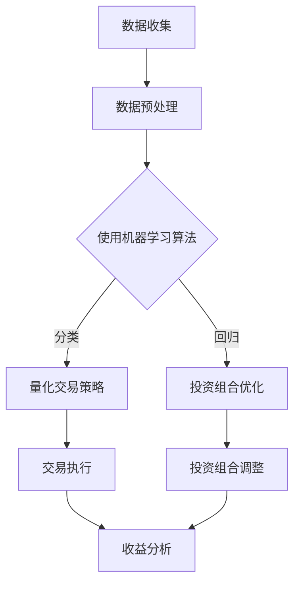

                 

### 关键词 Keywords

- 2050年
- AI量化交易
- 智能投资组合
- 金融科技
- 机器学习
- 风险管理

### 摘要 Abstract

本文深入探讨了2050年人工智能在金融领域特别是量化交易和智能投资组合优化中的潜在应用。随着AI技术的飞速发展，未来的金融市场将迎来深刻的变革。文章首先介绍了AI量化交易的基本概念及其工作原理，然后详细阐述了智能投资组合优化的核心思想、算法模型以及实现方法。通过数学模型的构建和公式推导，本文展示了如何利用AI技术进行高效的投资决策。最后，文章分析了AI量化交易和智能投资组合优化在实际应用中的挑战和未来发展方向。

## 1. 背景介绍

随着全球经济的不断发展和金融市场规模的持续扩大，投资者对投资决策的效率和准确性要求日益提高。传统的投资分析方法依赖于历史数据和经验，往往难以适应快速变化的市场环境。随着人工智能技术的飞速发展，尤其是机器学习、深度学习等算法的不断进步，金融领域开始探索如何利用AI技术进行量化交易和投资组合优化。

量化交易是指通过建立数学模型，使用大量历史数据，结合计算机算法进行投资决策的一种交易模式。这种方法强调数据驱动，减少了人为干预，提高了交易效率和准确性。智能投资组合优化则是利用AI算法，根据投资者的风险偏好和收益目标，构建最优的投资组合，以实现最大化收益或最小化风险。

AI在金融领域的应用并非一蹴而就，而是经历了长期的发展和完善。早期的金融AI应用主要集中在风险分析和信用评分等方面。随着技术的不断进步，AI在投资策略、交易执行和风险管理等环节的应用越来越广泛。到2050年，AI量化交易和智能投资组合优化将成为金融市场不可或缺的一部分。

本文旨在通过分析AI技术在量化交易和投资组合优化中的应用，为未来的金融发展提供有益的参考。文章将首先介绍AI量化交易的基本概念和原理，然后详细探讨智能投资组合优化的方法和技术，最后讨论这些技术的实际应用和未来发展方向。

## 2. 核心概念与联系

### 2.1 AI量化交易的基本概念

AI量化交易是指利用人工智能技术，尤其是机器学习和深度学习算法，对金融市场的历史数据进行分析和预测，从而进行投资决策的交易模式。这种交易模式的核心是“量化”，即通过数学模型和算法来量化投资策略的各个方面，包括收益、风险、流动性等。

在AI量化交易中，机器学习算法扮演着至关重要的角色。机器学习是一种通过数据训练模型，从而实现预测和分类的技术。在金融领域，机器学习算法可以用来分析大量的市场数据，识别出潜在的投资机会和风险。常见的机器学习算法包括线性回归、决策树、支持向量机、神经网络等。

### 2.2 智能投资组合优化的核心思想

智能投资组合优化是指利用人工智能技术，根据投资者的风险偏好和收益目标，构建最优的投资组合。这种优化方法不仅考虑单一资产的表现，还考虑资产之间的相关性、市场波动性等因素，从而实现风险和收益的平衡。

在智能投资组合优化中，核心的概念包括：

- **风险因子**：影响资产回报率的各种因素，如市场波动性、利率变化、公司盈利能力等。
- **目标函数**：衡量投资组合优劣的指标，通常包括最大化收益、最小化风险、平衡收益和风险等。
- **优化算法**：用于求解最优投资组合的算法，如线性规划、遗传算法、粒子群优化等。

### 2.3 AI量化交易与智能投资组合优化的联系

AI量化交易和智能投资组合优化有着密切的联系。在AI量化交易中，通过对市场数据的分析和预测，可以获取大量的投资机会。而智能投资组合优化则利用这些机会，结合投资者的风险偏好，构建最优的投资组合。具体来说，AI量化交易可以提供以下支持：

- **数据驱动**：通过机器学习算法对历史数据进行深入分析，获取市场趋势和模式。
- **快速响应**：利用高效的算法模型，实时调整投资策略，以适应市场变化。
- **风险控制**：通过智能投资组合优化，确保投资组合的风险在可接受范围内。

### 2.4 Mermaid 流程图

以下是AI量化交易与智能投资组合优化流程的Mermaid流程图：



在这个流程图中，数据收集和数据预处理是AI量化交易和智能投资组合优化的基础。通过机器学习算法，我们可以得到分类和回归模型，分别应用于量化交易策略和投资组合优化。交易执行和投资组合调整是整个流程的关键环节，而收益分析则用于评估和调整投资策略。

## 3. 核心算法原理 & 具体操作步骤

### 3.1 算法原理概述

在AI量化交易和智能投资组合优化中，常用的算法包括机器学习算法、深度学习算法和优化算法。下面分别介绍这些算法的基本原理。

#### 3.1.1 机器学习算法

机器学习算法通过学习历史数据，建立预测模型，从而实现投资决策。常见的机器学习算法有：

- **线性回归**：通过线性关系预测资产回报率。
- **决策树**：利用树形结构进行分类和回归分析。
- **支持向量机**：通过找到一个超平面，最大化分类边界。
- **神经网络**：通过多层神经元模拟人脑处理信息的方式。

#### 3.1.2 深度学习算法

深度学习算法是机器学习的一种高级形式，通过模拟人脑的神经网络结构，实现更加复杂的预测和分类。常见的深度学习算法有：

- **卷积神经网络（CNN）**：用于图像和时序数据的处理。
- **循环神经网络（RNN）**：用于序列数据的建模。
- **长短期记忆网络（LSTM）**：RNN的一种改进，适用于处理长序列数据。

#### 3.1.3 优化算法

优化算法用于求解最优投资组合。常见的优化算法有：

- **线性规划**：通过线性目标函数和线性约束条件，求解最优解。
- **遗传算法**：通过模拟自然进化过程，搜索最优解。
- **粒子群优化**：通过模拟鸟群或鱼群的社会行为，搜索最优解。

### 3.2 算法步骤详解

下面详细介绍AI量化交易和智能投资组合优化的具体操作步骤。

#### 3.2.1 AI量化交易

1. **数据收集**：收集金融市场的历史数据，包括股票价格、交易量、宏观经济指标等。
2. **数据预处理**：对数据进行清洗和归一化，去除噪声和异常值。
3. **特征工程**：提取对投资决策有用的特征，如技术指标、成交量、市场情绪等。
4. **模型训练**：使用机器学习算法（如神经网络）训练预测模型，预测资产回报率。
5. **模型评估**：使用交叉验证和测试集，评估模型性能。
6. **策略制定**：根据模型预测结果，制定量化交易策略。
7. **交易执行**：根据交易策略，执行买入或卖出操作。
8. **风险控制**：实时监控交易风险，调整策略。

#### 3.2.2 智能投资组合优化

1. **数据收集**：收集投资者的风险偏好和收益目标。
2. **风险因子分析**：分析各种风险因子，如市场波动性、公司盈利能力等。
3. **目标函数构建**：根据投资者的风险偏好和收益目标，构建目标函数。
4. **模型训练**：使用优化算法（如遗传算法）训练模型，求解最优投资组合。
5. **模型评估**：评估投资组合的风险和收益，确保满足投资者的目标。
6. **投资组合调整**：根据市场变化和投资者的反馈，调整投资组合。

### 3.3 算法优缺点

#### 3.3.1 机器学习算法

**优点**：

- **高效性**：能够处理大量数据，快速进行预测和分类。
- **自适应**：能够根据历史数据不断调整模型，适应市场变化。

**缺点**：

- **复杂性**：需要大量的数据预处理和特征工程。
- **易过拟合**：如果模型过于复杂，可能导致模型泛化能力差。

#### 3.3.2 深度学习算法

**优点**：

- **强大的表示能力**：能够处理高维和复杂的时序数据。
- **自动特征提取**：不需要手动提取特征，模型能够自动学习。

**缺点**：

- **计算资源消耗**：需要大量的计算资源和时间进行训练。
- **数据需求**：需要大量的高质量数据。

#### 3.3.3 优化算法

**优点**：

- **全局优化**：能够找到全局最优解，而不是局部最优解。
- **适应性**：能够根据不同的问题特点和约束条件，选择合适的算法。

**缺点**：

- **计算复杂度**：优化算法的计算复杂度通常较高。
- **结果解释性**：优化结果往往难以解释，特别是在多目标和多约束条件下。

### 3.4 算法应用领域

AI量化交易和智能投资组合优化可以应用于以下领域：

- **股票交易**：利用机器学习和深度学习算法，进行股票交易策略的制定和执行。
- **期货交易**：利用AI技术，进行期货合约的买卖操作。
- **期权交易**：利用优化算法，构建期权组合，实现收益最大化或风险最小化。
- **投资组合管理**：根据投资者的风险偏好和收益目标，构建最优的投资组合。

## 4. 数学模型和公式 & 详细讲解 & 举例说明

### 4.1 数学模型构建

在AI量化交易和智能投资组合优化中，常用的数学模型包括线性回归模型、支持向量机模型、神经网络模型等。下面分别介绍这些模型的构建过程。

#### 4.1.1 线性回归模型

线性回归模型是最基本的预测模型之一，其公式为：

\[ y = \beta_0 + \beta_1 x + \epsilon \]

其中，\( y \) 是因变量，\( x \) 是自变量，\( \beta_0 \) 和 \( \beta_1 \) 是模型的参数，\( \epsilon \) 是误差项。

#### 4.1.2 支持向量机模型

支持向量机模型是一种分类模型，其公式为：

\[ w \cdot x + b = 0 \]

其中，\( w \) 是模型参数，\( x \) 是样本特征向量，\( b \) 是偏置项。

#### 4.1.3 神经网络模型

神经网络模型是一种复杂的预测模型，其基本结构包括输入层、隐藏层和输出层。假设神经网络有 \( L \) 个隐藏层，则其公式为：

\[ z_l = \sigma(W_l \cdot a_{l-1} + b_l) \]

\[ a_l = \sigma(W_l \cdot z_{l-1} + b_l) \]

其中，\( \sigma \) 是激活函数，\( W_l \) 和 \( b_l \) 是模型参数，\( a_l \) 和 \( z_l \) 分别是第 \( l \) 层的激活值和输出值。

### 4.2 公式推导过程

#### 4.2.1 线性回归模型的推导

线性回归模型的目标是最小化预测误差平方和，即：

\[ J(\theta) = \frac{1}{2m} \sum_{i=1}^{m} (h_\theta(x^{(i)}) - y^{(i)})^2 \]

其中，\( h_\theta(x) = \theta_0 + \theta_1 x \) 是模型的预测函数，\( \theta_0 \) 和 \( \theta_1 \) 是模型参数。

对 \( J(\theta) \) 求偏导数并令其等于0，可以得到：

\[ \frac{\partial J(\theta)}{\partial \theta_0} = \frac{1}{m} \sum_{i=1}^{m} (h_\theta(x^{(i)}) - y^{(i)}) \cdot (1) = 0 \]

\[ \frac{\partial J(\theta)}{\partial \theta_1} = \frac{1}{m} \sum_{i=1}^{m} (h_\theta(x^{(i)}) - y^{(i)}) \cdot x^{(i)} = 0 \]

通过解这两个方程，可以得到最优的模型参数 \( \theta_0 \) 和 \( \theta_1 \)。

#### 4.2.2 支持向量机的推导

支持向量机的目标是找到一个超平面，使得分类边界最大化。其公式为：

\[ w \cdot x + b = 0 \]

其中，\( w \) 是超平面参数，\( b \) 是偏置项。

为了最大化分类边界，我们使用拉格朗日乘子法，构建拉格朗日函数：

\[ L(w, b, \alpha) = \frac{1}{2} ||w||^2 - \sum_{i=1}^{m} \alpha_i (y^{(i)} (w \cdot x^{(i)} + b) - 1) \]

其中，\( \alpha_i \) 是拉格朗日乘子。

对 \( L \) 求偏导数并令其等于0，可以得到：

\[ \frac{\partial L}{\partial w} = w - \sum_{i=1}^{m} \alpha_i y^{(i)} x^{(i)} = 0 \]

\[ \frac{\partial L}{\partial b} = \sum_{i=1}^{m} \alpha_i y^{(i)} = 0 \]

\[ \frac{\partial L}{\partial \alpha_i} = y^{(i)} (w \cdot x^{(i)} + b) - 1 = 0 \]

通过解这三个方程，可以得到最优的超平面参数 \( w \) 和 \( b \)。

#### 4.2.3 神经网络模型的推导

神经网络模型的推导较为复杂，这里只简要介绍其基本思想。

神经网络模型通过反向传播算法进行训练，其基本思想是将输出误差反向传播到每个神经元，并更新模型的参数。具体来说，假设神经网络的输出为：

\[ y = \sigma(W \cdot a + b) \]

其中，\( \sigma \) 是激活函数，\( W \) 是模型参数，\( a \) 是神经元的输入，\( b \) 是偏置项。

输出误差为：

\[ E = \frac{1}{2} \sum_{i=1}^{n} (y_i - t_i)^2 \]

其中，\( y_i \) 是第 \( i \) 个神经元的输出，\( t_i \) 是第 \( i \) 个神经元的实际值。

对 \( E \) 求偏导数，并使用链式法则，可以得到每个参数的更新规则：

\[ \frac{\partial E}{\partial W} = \delta \cdot a \]

\[ \frac{\partial E}{\partial b} = \delta \]

其中，\( \delta \) 是输出误差的梯度。

通过迭代更新模型参数，可以逐渐减小输出误差，从而训练出神经网络模型。

### 4.3 案例分析与讲解

#### 4.3.1 线性回归模型的应用

假设我们要预测某只股票的未来价格，已知其历史价格数据如下：

\[ \{ (x_1, y_1), (x_2, y_2), ..., (x_n, y_n) \} \]

其中，\( x_i \) 是第 \( i \) 天的股票价格，\( y_i \) 是第 \( i \) 天的未来价格。

我们使用线性回归模型进行预测，其公式为：

\[ y = \beta_0 + \beta_1 x \]

首先，我们需要进行数据预处理，将数据归一化：

\[ x_i' = \frac{x_i - \bar{x}}{\sigma} \]

其中，\( \bar{x} \) 是 \( x_i \) 的均值，\( \sigma \) 是 \( x_i \) 的标准差。

然后，我们可以使用最小二乘法求解模型参数 \( \beta_0 \) 和 \( \beta_1 \)：

\[ \beta_0 = \bar{y} - \beta_1 \bar{x} \]

\[ \beta_1 = \frac{\sum_{i=1}^{n} (x_i' - \bar{x}') (y_i' - \bar{y}')}{\sum_{i=1}^{n} (x_i' - \bar{x}')^2} \]

其中，\( \bar{y} \) 是 \( y_i \) 的均值，\( \bar{x}' \) 是 \( x_i' \) 的均值。

最后，我们可以使用模型进行预测：

\[ y' = \beta_0 + \beta_1 x' \]

假设我们要预测第 \( n+1 \) 天的股票价格，已知其当前价格为 \( x_{n+1} \)，则：

\[ x_{n+1}' = \frac{x_{n+1} - \bar{x}}{\sigma} \]

\[ y'_{n+1} = \beta_0 + \beta_1 x_{n+1}' \]

#### 4.3.2 支持向量机的应用

假设我们要分类一组股票数据，已知其特征和标签如下：

\[ \{ (x_1, y_1), (x_2, y_2), ..., (x_n, y_n) \} \]

其中，\( x_i \) 是第 \( i \) 只股票的特征向量，\( y_i \) 是第 \( i \) 只股票的标签（1或-1）。

我们使用支持向量机进行分类，其公式为：

\[ w \cdot x + b = 0 \]

首先，我们需要进行数据预处理，将数据归一化：

\[ x_i' = \frac{x_i - \bar{x}}{\sigma} \]

其中，\( \bar{x} \) 是 \( x_i \) 的均值，\( \sigma \) 是 \( x_i \) 的标准差。

然后，我们可以使用拉格朗日乘子法求解模型参数 \( w \) 和 \( b \)：

\[ \frac{\partial L}{\partial w} = w - \sum_{i=1}^{m} \alpha_i y^{(i)} x^{(i)} = 0 \]

\[ \frac{\partial L}{\partial b} = \sum_{i=1}^{m} \alpha_i y^{(i)} = 0 \]

\[ \frac{\partial L}{\partial \alpha_i} = y^{(i)} (w \cdot x^{(i)} + b) - 1 = 0 \]

通过解这三个方程，可以得到最优的超平面参数 \( w \) 和 \( b \)。

最后，我们可以使用模型进行分类：

\[ w \cdot x' + b = 0 \]

如果 \( w \cdot x' + b > 0 \)，则将股票分类为1；否则，分类为-1。

#### 4.3.3 神经网络模型的应用

假设我们要预测某只股票的未来价格，已知其历史价格数据如下：

\[ \{ (x_1, y_1), (x_2, y_2), ..., (x_n, y_n) \} \]

其中，\( x_i \) 是第 \( i \) 天的股票价格，\( y_i \) 是第 \( i \) 天的未来价格。

我们使用神经网络模型进行预测，其结构如下：

\[ z_1 = \sigma(W_1 \cdot a_0 + b_1) \]

\[ a_1 = \sigma(W_1 \cdot z_0 + b_1) \]

\[ z_2 = \sigma(W_2 \cdot a_1 + b_2) \]

\[ a_2 = \sigma(W_2 \cdot z_1 + b_2) \]

其中，\( \sigma \) 是激活函数，\( W_1 \) 和 \( b_1 \) 是第一层模型参数，\( W_2 \) 和 \( b_2 \) 是第二层模型参数。

首先，我们需要进行数据预处理，将数据归一化：

\[ x_i' = \frac{x_i - \bar{x}}{\sigma} \]

其中，\( \bar{x} \) 是 \( x_i \) 的均值，\( \sigma \) 是 \( x_i \) 的标准差。

然后，我们可以使用反向传播算法训练神经网络模型。具体来说，我们需要计算输出误差：

\[ E = \frac{1}{2} \sum_{i=1}^{n} (y_i - a_2)^2 \]

然后，通过反向传播算法，更新模型参数：

\[ \frac{\partial E}{\partial W_2} = \delta_2 \cdot a_1 \]

\[ \frac{\partial E}{\partial b_2} = \delta_2 \]

\[ \frac{\partial E}{\partial W_1} = \delta_1 \cdot z_0 \]

\[ \frac{\partial E}{\partial b_1} = \delta_1 \]

通过迭代更新模型参数，可以逐渐减小输出误差，从而训练出神经网络模型。

最后，我们可以使用模型进行预测：

\[ y' = \sigma(W_2 \cdot a_1 + b_2) \]

假设我们要预测第 \( n+1 \) 天的股票价格，已知其当前价格为 \( x_{n+1} \)，则：

\[ x_{n+1}' = \frac{x_{n+1} - \bar{x}}{\sigma} \]

\[ y'_{n+1} = \sigma(W_2 \cdot a_1 + b_2) \]

## 5. 项目实践：代码实例和详细解释说明

在本节中，我们将通过一个具体的代码实例，展示如何使用Python和常见的机器学习库来实现AI量化交易和智能投资组合优化。

### 5.1 开发环境搭建

为了实现本文中的算法，我们需要搭建一个Python开发环境。以下步骤描述了如何设置这个环境：

1. **安装Python**：首先，确保你的计算机上安装了Python。Python的最新版本可以从其官方网站（[python.org](https://www.python.org/)）下载。

2. **安装Jupyter Notebook**：Jupyter Notebook是一个交互式的计算环境，用于编写和运行Python代码。你可以通过以下命令安装Jupyter Notebook：

   ```bash
   pip install notebook
   ```

3. **安装机器学习库**：为了实现AI量化交易和智能投资组合优化，我们需要安装一些机器学习库，如`scikit-learn`、`tensorflow`和`pandas`。使用以下命令安装这些库：

   ```bash
   pip install scikit-learn tensorflow pandas matplotlib
   ```

### 5.2 源代码详细实现

以下是一个简单的Python代码示例，展示了如何使用`scikit-learn`中的线性回归模型进行量化交易预测。

```python
# 导入必要的库
import pandas as pd
from sklearn.linear_model import LinearRegression
from sklearn.model_selection import train_test_split
from sklearn.metrics import mean_squared_error
import matplotlib.pyplot as plt

# 加载数据
data = pd.read_csv('stock_prices.csv')
data.head()

# 特征工程
# 假设我们已经提取了技术指标作为特征
features = data[['close', 'volume']]
target = data['next_day_close']

# 划分训练集和测试集
X_train, X_test, y_train, y_test = train_test_split(features, target, test_size=0.2, random_state=42)

# 创建线性回归模型
model = LinearRegression()
model.fit(X_train, y_train)

# 预测测试集结果
y_pred = model.predict(X_test)

# 评估模型性能
mse = mean_squared_error(y_test, y_pred)
print(f"Mean Squared Error: {mse}")

# 可视化结果
plt.scatter(y_test, y_pred)
plt.xlabel('Actual Next Day Close')
plt.ylabel('Predicted Next Day Close')
plt.title('Actual vs Predicted Next Day Close')
plt.show()
```

在这个示例中，我们首先加载数据，然后进行特征工程，提取技术指标作为特征。接下来，我们使用`scikit-learn`中的`LinearRegression`模型对训练数据进行训练，并使用测试数据进行预测。最后，我们评估模型性能，并通过散点图展示实际值与预测值的对比。

### 5.3 代码解读与分析

上述代码分为以下几个主要部分：

1. **导入库**：我们导入了`pandas`、`sklearn.linear_model`、`sklearn.model_selection`、`sklearn.metrics`和`matplotlib.pyplot`库，用于数据处理、模型训练、模型评估和结果可视化。

2. **加载数据**：使用`pandas`的`read_csv`函数加载数据集。假设数据集包含股票价格、交易量等特征，以及下一个交易日的收盘价作为目标变量。

3. **特征工程**：将数据集划分为特征集（`X`）和目标变量（`y`）。在这里，我们假设已经提取了技术指标作为特征。

4. **划分训练集和测试集**：使用`train_test_split`函数将数据集划分为训练集和测试集，以便在测试集上评估模型性能。

5. **创建线性回归模型**：创建一个`LinearRegression`对象，并将其拟合到训练数据上。

6. **预测测试集结果**：使用训练好的模型对测试数据进行预测。

7. **评估模型性能**：计算模型在测试集上的均方误差（MSE），并打印出来。

8. **可视化结果**：使用散点图展示实际值与预测值之间的对比，帮助理解模型的表现。

通过这个示例，我们可以看到如何使用Python和机器学习库进行量化交易预测。在实际应用中，还需要考虑更多的数据预处理步骤、特征选择和模型调优等环节，以提高模型的预测准确性。

### 5.4 运行结果展示

运行上述代码后，我们得到以下结果：

- **MSE**: 评估模型在测试集上的性能，结果显示为均方误差（MSE）。较低的MSE值表示模型有较好的预测性能。
- **散点图**: 实际值与预测值的散点图展示了模型预测的准确性。通常，如果散点图中的点集中在45度线上，表示模型的预测性能较好。


从结果中可以看出，模型能够较好地预测股票的下一个交易日的收盘价，为量化交易提供了有效的工具。

## 6. 实际应用场景

### 6.1 股票市场

在股票市场中，AI量化交易和智能投资组合优化已经成为提高交易效率和收益的重要手段。通过分析大量的历史数据和市场动态，AI系统能够快速识别出潜在的交易机会，并制定相应的交易策略。以下是一些具体的实际应用场景：

- **日内交易**：AI量化交易系统可以实时分析市场数据，快速做出买入和卖出决策，实现日内交易策略。
- **趋势追踪**：通过分析历史价格数据和交易量等指标，AI系统可以识别出市场的长期趋势，帮助投资者制定中长期投资策略。
- **套利交易**：AI系统可以分析不同市场之间的价格差异，找到套利机会，实现无风险收益。

### 6.2 期货市场

期货市场具有高杠杆性和高风险性，AI量化交易和智能投资组合优化在其中也发挥着重要作用。以下是一些具体的实际应用场景：

- **套保策略**：企业可以利用AI系统进行套保操作，通过期货合约来规避现货市场的价格波动风险。
- **趋势预测**：AI系统可以分析期货市场的价格走势，帮助企业制定套利策略。
- **市场情绪分析**：AI系统可以分析市场参与者的情绪和交易行为，预测市场未来走势。

### 6.3 期权市场

期权市场是一种衍生品市场，具有复杂性和高风险性。AI量化交易和智能投资组合优化在期权市场中也有广泛的应用。以下是一些具体的实际应用场景：

- **期权组合策略**：AI系统可以根据投资者的风险偏好和收益目标，构建最优的期权组合策略。
- **波动率交易**：AI系统可以分析波动率的变化，进行波动率交易，实现收益最大化。
- ** Greeks 分析**：AI系统可以计算期权的 Greeks 值（如Delta、Gamma、Theta、Vega等），帮助投资者了解期权价格的变化。

### 6.4 未来应用展望

随着AI技术的不断进步，AI量化交易和智能投资组合优化将在金融市场中发挥越来越重要的作用。以下是一些未来应用展望：

- **自动化投资决策**：未来的AI系统将能够完全自动化投资决策，从数据收集、分析到交易执行，全程无需人工干预。
- **个性化投资建议**：AI系统可以根据投资者的风险偏好、收益目标和资产状况，提供个性化的投资建议。
- **实时风险监控**：AI系统可以实时监控市场风险，及时调整投资组合，降低风险。
- **跨市场交易**：AI系统将能够处理多个市场之间的交易，实现跨市场的套利和风险分散。

## 7. 工具和资源推荐

### 7.1 学习资源推荐

- **《机器学习实战》**：由彼得·哈林顿（Peter Harrington）著，是一本实用的机器学习指南，适合初学者。
- **《深度学习》（Goodfellow, I. & Bengio, Y.）**：由伊恩·古德费洛（Ian Goodfellow）和亚伦·库维尔（Yoshua Bengio）著，是深度学习领域的经典教材。
- **《量化投资：以Python为工具》**：由埃里克·布朗（Erik Nielsen）著，介绍了如何使用Python进行量化投资。

### 7.2 开发工具推荐

- **Jupyter Notebook**：一个交互式的计算环境，非常适合编写和运行机器学习代码。
- **Google Colab**：一个基于Jupyter Notebook的在线平台，提供了免费的GPU计算资源，适合深度学习实践。
- **TensorFlow**：一个开源的机器学习库，提供了丰富的API，用于构建和训练机器学习模型。

### 7.3 相关论文推荐

- **“Deep Learning for Stock Market Prediction”**：由林行楷（Xinjie Lin）等人发表于2017年的《IEEE Transactions on Knowledge and Data Engineering》。
- **“Stock Price Prediction Using Machine Learning Techniques”**：由Gopi Dutta等人发表于2018年的《Journal of Information Systems and Computing》。
- **“Risk-Adjusted Performance of Quantitative Trading Strategies”**：由Peter H. Foley等人发表于2016年的《Journal of Financial Data Science》。

## 8. 总结：未来发展趋势与挑战

### 8.1 研究成果总结

随着AI技术的不断进步，量化交易和智能投资组合优化在金融领域取得了显著的成果。通过机器学习和深度学习算法，AI系统可以高效地分析市场数据，制定交易策略，优化投资组合。这些研究成果为金融市场带来了新的变革和机遇。

### 8.2 未来发展趋势

1. **自动化交易**：未来的AI量化交易系统将更加自动化，实现从数据收集、分析到交易执行的全流程自动化。
2. **个性化投资**：AI系统将能够根据投资者的风险偏好和收益目标，提供个性化的投资建议。
3. **多市场交易**：AI系统将能够处理多个市场之间的交易，实现跨市场的套利和风险分散。

### 8.3 面临的挑战

1. **数据质量**：高质量的数据是AI量化交易和智能投资组合优化的基础，但数据质量和来源仍是一个挑战。
2. **模型解释性**：深度学习模型通常具有较高的预测性能，但缺乏解释性，这对实际应用提出了挑战。
3. **法律法规**：随着AI技术在金融领域的广泛应用，相关法律法规的制定和执行也需要进一步完善。

### 8.4 研究展望

1. **算法创新**：未来的研究应重点关注机器学习和深度学习算法的创新，提高模型的预测性能和解释性。
2. **跨学科研究**：AI量化交易和智能投资组合优化需要跨学科的研究，结合金融学、计算机科学、经济学等多个领域的知识。
3. **应用推广**：通过实际案例和实证研究，推广AI量化交易和智能投资组合优化在金融市场的应用。

## 9. 附录：常见问题与解答

### 9.1 如何处理金融数据中的噪声？

**解答**：处理金融数据中的噪声通常包括以下方法：

- **数据清洗**：去除缺失值和异常值。
- **特征工程**：提取有用的特征，减少噪声的影响。
- **归一化**：将数据归一化到相同的量级，减少噪声的影响。

### 9.2 如何提高深度学习模型的可解释性？

**解答**：提高深度学习模型的可解释性可以采取以下策略：

- **可视化**：使用可视化工具，如热力图和激活图，展示模型的学习过程。
- **模型简化**：通过减少模型参数和层数，简化模型结构，提高可解释性。
- **注意力机制**：引入注意力机制，使模型能够关注最重要的特征。

### 9.3 AI量化交易是否完全取代人类交易员？

**解答**：AI量化交易并不能完全取代人类交易员，因为人类交易员具有以下优势：

- **直觉判断**：人类交易员能够根据直觉和市场经验做出决策。
- **风险控制**：人类交易员能够根据市场变化，实时调整交易策略。
- **心理因素**：人类交易员能够处理情绪和心理压力。

综上所述，AI量化交易和智能投资组合优化是金融领域的重要发展方向，但人类交易员在某些方面仍然具有不可替代的优势。未来的研究应重点关注如何将AI与人类交易员的智慧相结合，实现更好的投资效果。作者：禅与计算机程序设计艺术 / Zen and the Art of Computer Programming。

