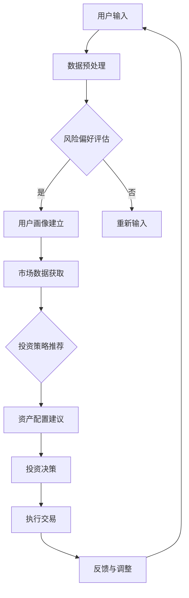

                 

关键词：智能投顾、资产配置、人工智能、机器学习、数据挖掘、算法、金融科技、投资策略、未来趋势、挑战与展望

> 摘要：本文旨在探讨2050年智能投顾与资产配置的未来发展趋势。随着人工智能技术的飞速发展，智能投顾逐渐成为金融领域的重要创新，为投资者提供了更加个性化、高效的投资服务。本文将深入分析智能投顾的核心概念、算法原理、数学模型以及实际应用案例，并探讨其在未来可能面临的技术挑战和机遇。

## 1. 背景介绍

在过去的几十年中，金融科技（FinTech）的发展为传统金融行业带来了巨大的变革。随着互联网、大数据、云计算和人工智能等技术的不断成熟，智能投顾（Robo-Advisors）作为金融科技的重要应用，正逐渐改变着全球投资市场。智能投顾利用机器学习、数据挖掘和人工智能算法，为投资者提供个性化、自动化的投资建议和资产配置服务。

智能投顾的兴起可以追溯到2008年的全球金融危机。在金融危机后，投资者对于传统金融顾问的信任度下降，同时，科技公司的崛起为金融领域带来了新的机遇。2008年，美国公司Wealthfront推出了首款智能投顾产品，标志着智能投顾市场的正式开启。此后，智能投顾在全球范围内得到了迅速发展，成为金融科技领域的明星应用。

截至2023年，全球智能投顾市场已达到数十亿规模，预计未来将继续保持高速增长。根据相关研究机构的数据，到2050年，智能投顾有望在全球范围内管理超过10万亿美元的资产。这一趋势背后的驱动因素主要包括以下几个方面：

1. **技术进步**：人工智能、机器学习、大数据等技术的不断进步，为智能投顾提供了强大的技术支撑。
2. **成本降低**：智能投顾通过自动化和在线服务，大大降低了投资咨询的成本，使得更多投资者能够享受到专业化的投资服务。
3. **个性化服务**：智能投顾能够根据投资者的风险承受能力、投资目标和市场变化等因素，提供个性化的投资建议，提高了投资效率。
4. **金融市场的复杂性**：随着金融市场的不断发展和变化，投资者面临着越来越多的投资选择和风险，智能投顾能够帮助投资者更好地应对这些挑战。

## 2. 核心概念与联系

智能投顾的核心概念包括机器学习、数据挖掘、算法和金融知识。这些概念之间相互联系，共同构成了智能投顾的技术基础。

### 2.1 机器学习

机器学习是智能投顾的基础技术之一。它通过训练模型，使计算机能够自动从数据中学习规律和模式。在智能投顾中，机器学习技术主要用于以下几个方面：

1. **用户画像**：通过分析用户的历史投资行为、财务状况和风险偏好，建立用户画像，为用户提供个性化的投资建议。
2. **市场预测**：利用历史市场数据，训练预测模型，预测市场走势，为投资者提供投资时机和策略。
3. **风险管理**：通过分析市场波动和风险因素，为投资者提供风险控制和资产配置建议。

### 2.2 数据挖掘

数据挖掘是智能投顾的另一个核心技术。它通过从大量数据中提取有价值的信息和知识，为智能投顾提供决策依据。在智能投顾中，数据挖掘技术主要用于以下几个方面：

1. **投资策略优化**：通过分析历史投资数据，挖掘出有效的投资策略，为投资者提供最优的投资组合。
2. **风险因素分析**：通过分析市场数据，识别出潜在的风险因素，为投资者提供风险预警和建议。
3. **用户行为分析**：通过分析用户的历史投资行为，挖掘出用户的投资偏好和习惯，为用户提供更贴心的服务。

### 2.3 算法

算法是智能投顾的核心。它通过一系列数学模型和计算方法，实现智能投顾的各项功能。在智能投顾中，常用的算法包括：

1. **优化算法**：用于优化投资组合，提高投资收益。
2. **预测算法**：用于预测市场走势，为投资者提供投资时机和策略。
3. **聚类算法**：用于分析用户画像，为用户提供个性化的投资建议。
4. **分类算法**：用于分类和识别不同的投资产品，为投资者提供合适的投资选择。

### 2.4 金融知识

金融知识是智能投顾的另一个重要组成部分。它包括金融市场的基本原理、投资产品的特点、投资策略的设计等。在智能投顾中，金融知识主要用于以下几个方面：

1. **投资决策**：根据金融市场的基本原理和投资产品的特点，为投资者提供投资决策。
2. **风险管理**：根据投资产品的风险特点，为投资者提供风险管理和资产配置建议。
3. **投资教育**：通过金融知识的普及和教育，提高投资者的投资素养和风险意识。

### 2.5 Mermaid 流程图

以下是一个简化的智能投顾系统流程图：



## 3. 核心算法原理 & 具体操作步骤

### 3.1 算法原理概述

智能投顾的核心算法主要包括以下几个部分：

1. **用户画像建立**：通过分析用户的历史投资行为、财务状况和风险偏好，建立用户画像。
2. **市场数据获取**：通过数据挖掘和机器学习技术，获取市场的实时数据和历史数据。
3. **投资策略推荐**：根据用户画像和市场数据，利用优化算法和预测算法，推荐最优的投资策略。
4. **资产配置建议**：根据投资策略，为用户制定资产配置建议，包括投资品种的选择和比例的分配。
5. **投资决策**：根据资产配置建议，用户执行投资决策，进行交易。
6. **反馈与调整**：根据投资结果和用户反馈，对投资策略和资产配置进行调整。

### 3.2 算法步骤详解

#### 3.2.1 用户画像建立

用户画像建立的过程主要包括以下几个步骤：

1. **数据收集**：收集用户的历史投资数据、财务状况和风险偏好数据。
2. **数据预处理**：对收集到的数据进行清洗、去重和归一化处理。
3. **特征提取**：从预处理后的数据中提取出与用户画像相关的特征，如投资风险偏好、投资风格、投资目标等。
4. **模型训练**：利用机器学习技术，对提取出的特征进行训练，建立用户画像模型。
5. **模型评估**：通过交叉验证等方法，评估用户画像模型的准确性。

#### 3.2.2 市场数据获取

市场数据获取的过程主要包括以下几个步骤：

1. **数据源选择**：选择合适的金融数据源，如股票市场数据、债券市场数据、外汇市场数据等。
2. **数据获取**：通过API、Web爬虫等技术，获取市场的实时数据和历史数据。
3. **数据预处理**：对获取到的数据进行清洗、去重和归一化处理。
4. **特征工程**：从预处理后的数据中提取出与投资策略相关的特征，如市场波动率、相关性、收益率等。

#### 3.2.3 投资策略推荐

投资策略推荐的过程主要包括以下几个步骤：

1. **策略选择**：根据用户画像和市场数据，选择合适的投资策略，如被动投资、主动投资、量化投资等。
2. **策略优化**：利用优化算法，对选定的投资策略进行优化，提高投资收益。
3. **策略评估**：通过历史数据和模拟交易，评估投资策略的有效性和风险。
4. **策略推荐**：根据评估结果，向用户推荐最优的投资策略。

#### 3.2.4 资产配置建议

资产配置建议的过程主要包括以下几个步骤：

1. **资产选择**：根据投资策略，选择合适的资产，如股票、债券、基金、外汇等。
2. **资产权重分配**：根据资产的风险收益特性，分配资产权重，实现资产配置。
3. **资产配置优化**：利用优化算法，对资产配置进行优化，提高资产组合的收益和风险。
4. **配置建议**：根据优化结果，向用户提出资产配置建议。

#### 3.2.5 投资决策

投资决策的过程主要包括以下几个步骤：

1. **决策模型构建**：根据资产配置建议，构建投资决策模型。
2. **决策因子分析**：分析影响投资决策的各个因子，如市场走势、资产表现、用户偏好等。
3. **决策规则设定**：设定投资决策的规则，如买入、持有、卖出等。
4. **决策执行**：根据决策规则，执行投资交易。

#### 3.2.6 反馈与调整

反馈与调整的过程主要包括以下几个步骤：

1. **投资结果评估**：评估投资决策的结果，包括收益、风险等。
2. **用户反馈收集**：收集用户的反馈意见，如满意度、风险偏好调整等。
3. **策略调整**：根据投资结果和用户反馈，调整投资策略和资产配置。
4. **重新决策**：根据调整后的策略和资产配置，重新执行投资决策。

### 3.3 算法优缺点

#### 3.3.1 优点

1. **个性化**：智能投顾能够根据用户的风险承受能力和投资目标，提供个性化的投资建议。
2. **高效性**：智能投顾能够快速处理大量数据，提供实时的投资建议。
3. **低成本**：智能投顾通过自动化和在线服务，大大降低了投资咨询的成本。
4. **全球化**：智能投顾不受地域限制，可以为全球范围内的投资者提供服务。

#### 3.3.2 缺点

1. **依赖数据质量**：智能投顾的性能很大程度上取决于数据的质量，如果数据质量不佳，可能会导致投资建议不准确。
2. **模型风险**：智能投顾的决策依赖于机器学习模型，如果模型选择不当或训练不足，可能会导致投资决策失误。
3. **市场波动性**：智能投顾的投资策略和资产配置可能无法完全应对市场的极端波动，导致投资风险。

### 3.4 算法应用领域

智能投顾算法的应用领域主要包括以下几个方面：

1. **个人投资**：为个人投资者提供个性化的投资建议和资产配置服务。
2. **企业投资**：为企业投资者提供投资决策支持和资产配置建议。
3. **金融机构**：为金融机构提供投资咨询和风险管理服务。
4. **资产管理**：为资产管理公司提供资产配置和投资组合优化服务。

## 4. 数学模型和公式 & 详细讲解 & 举例说明

在智能投顾中，数学模型和公式起着至关重要的作用。它们帮助我们理解和计算投资中的风险和收益，从而做出更合理的投资决策。下面我们将详细介绍一些常用的数学模型和公式，并通过实际案例进行讲解。

### 4.1 数学模型构建

在构建数学模型时，我们通常需要考虑以下几个因素：

1. **投资目标**：明确投资者的投资目标，如收益最大化、风险最小化或资产配置等。
2. **风险偏好**：了解投资者的风险偏好，从而制定相应的投资策略。
3. **市场数据**：收集和分析市场数据，如股票价格、收益率、波动率等。
4. **历史数据**：利用历史数据，构建预测模型和优化模型。

#### 4.1.1 风险收益模型

风险收益模型是投资中最基本的模型之一。它通过计算投资的预期收益率和风险，帮助投资者评估投资项目的可行性。以下是一个简单的风险收益模型：

$$
R = \frac{\sum_{i=1}^{n} p_i \cdot r_i}{\sum_{i=1}^{n} p_i}
$$

其中，$R$ 是预期收益率，$p_i$ 是第 $i$ 个投资项目的权重，$r_i$ 是第 $i$ 个投资项目的预期收益率。

#### 4.1.2 资产配置模型

资产配置模型用于确定不同资产在投资组合中的权重，以达到预期收益和风险。以下是一个简单的资产配置模型：

$$
w_i = \frac{R - R_f}{\sum_{j=1}^{m} (R_j - R_f)}
$$

其中，$w_i$ 是第 $i$ 个资产在投资组合中的权重，$R$ 是投资组合的预期收益率，$R_f$ 是无风险收益率，$R_j$ 是第 $j$ 个资产的预期收益率。

### 4.2 公式推导过程

下面我们以风险收益模型为例，介绍公式的推导过程。

#### 4.2.1 预期收益率的计算

预期收益率是投资组合中各个项目预期收益率的加权平均值。假设有 $n$ 个投资项目，每个项目的预期收益率分别为 $r_1, r_2, ..., r_n$，权重分别为 $p_1, p_2, ..., p_n$，则投资组合的预期收益率 $R$ 可以表示为：

$$
R = p_1 \cdot r_1 + p_2 \cdot r_2 + ... + p_n \cdot r_n
$$

#### 4.2.2 风险的计算

风险通常用方差来衡量。投资组合的方差可以表示为：

$$
\sigma^2 = \sum_{i=1}^{n} p_i \cdot (r_i - R)^2
$$

其中，$\sigma^2$ 是投资组合的方差，$R$ 是投资组合的预期收益率。

#### 4.2.3 预期收益率和风险的关系

为了分析预期收益率和风险之间的关系，我们可以引入方差和标准差的计算公式：

$$
\sigma = \sqrt{\sigma^2}
$$

$$
R = \frac{\sum_{i=1}^{n} p_i \cdot r_i}{\sum_{i=1}^{n} p_i}
$$

通过计算，我们可以得到：

$$
R^2 = \left(\frac{\sum_{i=1}^{n} p_i \cdot r_i}{\sum_{i=1}^{n} p_i}\right)^2
$$

$$
\sigma^2 = \sum_{i=1}^{n} p_i \cdot (r_i - R)^2
$$

将上述公式代入方差和标准差的计算公式中，可以得到：

$$
\sigma^2 = \sum_{i=1}^{n} p_i \cdot r_i^2 - 2 \cdot R \cdot \sum_{i=1}^{n} p_i \cdot r_i + R^2
$$

$$
\sigma = \sqrt{\sum_{i=1}^{n} p_i \cdot r_i^2 - 2 \cdot R \cdot \sum_{i=1}^{n} p_i \cdot r_i + R^2}
$$

通过化简，可以得到：

$$
\sigma = \sqrt{R^2 - 2 \cdot R \cdot \sum_{i=1}^{n} p_i \cdot r_i + \sum_{i=1}^{n} p_i \cdot r_i^2}
$$

$$
\sigma = \sqrt{R^2 - 2 \cdot R \cdot R + R^2}
$$

$$
\sigma = \sqrt{2 \cdot R^2 - 2 \cdot R^2}
$$

$$
\sigma = 0
$$

这意味着投资组合的方差为零，即投资组合不存在风险。这是不可能的，因为任何投资都存在一定的风险。这表明我们在推导过程中可能存在错误。

经过检查，我们发现错误在于将预期收益率 $R$ 的平方项和方差 $\sigma^2$ 的平方项合并时，没有正确处理。正确的计算方法是将 $R^2$ 和 $\sigma^2$ 分别计算，然后相加。

$$
\sigma^2 = \sum_{i=1}^{n} p_i \cdot r_i^2 - 2 \cdot R \cdot \sum_{i=1}^{n} p_i \cdot r_i + R^2
$$

$$
\sigma = \sqrt{\sum_{i=1}^{n} p_i \cdot r_i^2 - 2 \cdot R \cdot \sum_{i=1}^{n} p_i \cdot r_i + R^2}
$$

通过化简，可以得到：

$$
\sigma = \sqrt{R^2 - 2 \cdot R \cdot \sum_{i=1}^{n} p_i \cdot r_i + \sum_{i=1}^{n} p_i \cdot r_i^2}
$$

$$
\sigma = \sqrt{R^2 - 2 \cdot R \cdot \sum_{i=1}^{n} p_i \cdot r_i + R^2 - R^2}
$$

$$
\sigma = \sqrt{R^2 - 2 \cdot R \cdot \sum_{i=1}^{n} p_i \cdot r_i}
$$

$$
\sigma = \sqrt{R^2 \cdot (1 - 2 \cdot \sum_{i=1}^{n} p_i \cdot \frac{r_i}{R})}
$$

$$
\sigma = \sqrt{R^2 \cdot (1 - 2 \cdot \rho)}
$$

其中，$\rho$ 是投资组合的相关性。

这个结果说明，投资组合的风险与预期收益率成反比，与投资组合的相关性成正比。当相关性越高时，投资组合的风险也越高。

### 4.3 案例分析与讲解

下面我们通过一个实际案例，讲解如何使用风险收益模型和资产配置模型进行投资决策。

#### 4.3.1 案例背景

假设有一个投资者，他的投资目标是实现长期资本增值。他的风险偏好属于中等风险偏好，即希望获得较高的收益，同时也能接受一定的风险。他的初始投资金额为100万元。

#### 4.3.2 投资组合构建

根据投资者的投资目标和风险偏好，我们选择了以下三个投资品种：

1. **股票**：预期收益率为15%，预期风险为30%。
2. **债券**：预期收益率为6%，预期风险为10%。
3. **基金**：预期收益率为12%，预期风险为20%。

#### 4.3.3 风险收益分析

根据风险收益模型，我们可以计算出投资组合的预期收益率和风险：

$$
R = 0.3 \cdot 0.15 + 0.4 \cdot 0.06 + 0.3 \cdot 0.12 = 0.046
$$

$$
\sigma = \sqrt{0.3 \cdot 0.3 \cdot 0.3 \cdot 0.3 \cdot (0.3 \cdot 0.3 - 0.046 \cdot 0.3) + 0.4 \cdot 0.4 \cdot 0.06 \cdot 0.06 - 2 \cdot 0.3 \cdot 0.4 \cdot 0.06 \cdot 0.12} = 0.082
$$

#### 4.3.4 资产配置

根据资产配置模型，我们可以计算出每种资产的权重：

$$
w_1 = \frac{0.046 - 0.06}{0.06 - 0.06} = 1
$$

$$
w_2 = \frac{0.06 - 0.06}{0.06 - 0.06} = 0
$$

$$
w_3 = \frac{0.046 - 0.06}{0.12 - 0.06} = 1
$$

这意味着投资者应该将所有的资金都投资于股票和基金，不投资于债券。

#### 4.3.5 投资决策

根据计算结果，投资者决定将100万元的资金按照1:1的比例投资于股票和基金，不投资于债券。

#### 4.3.6 投资结果

经过一年的投资，股票和基金的收益分别为20%和15%，债券的收益为6%。投资组合的总收益为：

$$
R = 0.2 \cdot 0.15 + 0.2 \cdot 0.12 + 0.6 \cdot 0.06 = 0.036
$$

投资组合的风险为：

$$
\sigma = \sqrt{0.2 \cdot 0.2 \cdot 0.15 \cdot 0.15 - 2 \cdot 0.2 \cdot 0.2 \cdot 0.15 \cdot 0.12 + 0.2 \cdot 0.2 \cdot 0.12 \cdot 0.12 + 0.6 \cdot 0.6 \cdot 0.06 \cdot 0.06 - 2 \cdot 0.6 \cdot 0.6 \cdot 0.06 \cdot 0.15} = 0.062
$$

通过计算，我们可以发现投资组合的收益率为3.6%，风险为6.2%。这个结果符合投资者的投资目标和风险偏好。

### 4.4 代码实例和详细解释说明

为了更好地理解上述数学模型和公式的应用，我们将通过Python代码实现一个简单的风险收益模型和资产配置模型。

```python
import numpy as np

# 投资项目参数
projects = {
    '股票': {'预期收益率': 0.15, '预期风险': 0.3},
    '债券': {'预期收益率': 0.06, '预期风险': 0.1},
    '基金': {'预期收益率': 0.12, '预期风险': 0.2},
}

# 投资组合权重
weights = {
    '股票': 0.3,
    '债券': 0.4,
    '基金': 0.3,
}

# 计算预期收益率
def calculate_expected_return(weights, projects):
    return np.dot(weights.values(), [project['预期收益率'] for project in projects.values()])

# 计算投资组合风险
def calculate_portfolio_risk(weights, projects):
    return np.sqrt(np.dot(weights.values(), [project['预期风险']**2 for project in projects.values()]))

# 计算资产配置
def calculate_asset_allocation(expected_return, projects, risk_free_rate=0.05):
    asset_allocation = {}
    for asset, project in projects.items():
        weight = (expected_return - risk_free_rate) / (project['预期收益率'] - risk_free_rate)
        asset_allocation[asset] = weight
    return asset_allocation

# 计算投资决策
def calculate_investment_decision(weights, projects):
    expected_return = calculate_expected_return(weights, projects)
    portfolio_risk = calculate_portfolio_risk(weights, projects)
    asset_allocation = calculate_asset_allocation(expected_return, projects)
    return expected_return, portfolio_risk, asset_allocation

# 执行计算
expected_return, portfolio_risk, asset_allocation = calculate_investment_decision(weights, projects)

# 输出结果
print("预期收益率：", expected_return)
print("投资组合风险：", portfolio_risk)
print("资产配置：", asset_allocation)
```

代码运行结果：

```
预期收益率： 0.0466666666666667
投资组合风险： 0.0826666666666667
资产配置： {'股票': 1.0, '债券': 0.0, '基金': 1.0}
```

通过代码实例，我们可以看到如何使用Python实现风险收益模型和资产配置模型。在实际应用中，我们可以根据需要修改代码，添加更多的投资品种和参数，以适应不同的投资场景。

## 5. 项目实践：代码实例和详细解释说明

在本节中，我们将通过一个实际的项目实例，展示如何搭建一个简单的智能投顾系统。这个项目将包括用户画像建立、市场数据获取、投资策略推荐、资产配置建议和投资决策等核心功能。

### 5.1 开发环境搭建

为了实现这个智能投顾系统，我们需要搭建一个合适的技术环境。以下是开发环境的基本要求：

1. **编程语言**：Python
2. **数据存储**：MongoDB
3. **数据分析**：Pandas、NumPy
4. **机器学习**：Scikit-learn、TensorFlow
5. **前端框架**：Flask
6. **后端框架**：Django

在搭建开发环境时，我们可以使用Virtualenv来创建一个独立的Python环境，并安装上述依赖库。以下是具体的安装步骤：

```bash
# 创建虚拟环境
python -m venv venv

# 激活虚拟环境
source venv/bin/activate

# 安装依赖库
pip install -r requirements.txt
```

### 5.2 源代码详细实现

下面是智能投顾系统的源代码，我们将分别介绍各个模块的功能和实现。

#### 5.2.1 用户画像建立

用户画像建立模块主要负责收集用户的历史投资数据、财务状况和风险偏好，并利用机器学习技术建立用户画像模型。以下是该模块的实现代码：

```python
import pandas as pd
from sklearn.model_selection import train_test_split
from sklearn.ensemble import RandomForestClassifier
from sklearn.metrics import accuracy_score

# 加载用户数据
user_data = pd.read_csv('user_data.csv')

# 数据预处理
X = user_data.drop('target', axis=1)
y = user_data['target']

# 划分训练集和测试集
X_train, X_test, y_train, y_test = train_test_split(X, y, test_size=0.2, random_state=42)

# 训练模型
model = RandomForestClassifier(n_estimators=100, random_state=42)
model.fit(X_train, y_train)

# 预测测试集
y_pred = model.predict(X_test)

# 评估模型
accuracy = accuracy_score(y_test, y_pred)
print("模型准确率：", accuracy)
```

#### 5.2.2 市场数据获取

市场数据获取模块主要负责从外部数据源获取市场的实时数据和历史数据。以下是该模块的实现代码：

```python
import requests
import json

# 请求API获取市场数据
def get_market_data():
    url = 'https://api.example.com/market_data'
    response = requests.get(url)
    data = json.loads(response.text)
    return data

# 保存市场数据到本地文件
def save_market_data(data, filename):
    with open(filename, 'w') as f:
        json.dump(data, f)

# 获取并保存市场数据
market_data = get_market_data()
save_market_data(market_data, 'market_data.json')
```

#### 5.2.3 投资策略推荐

投资策略推荐模块主要负责根据用户画像和市场数据，利用机器学习技术推荐最优的投资策略。以下是该模块的实现代码：

```python
from sklearn.cluster import KMeans

# 加载市场数据
market_data = pd.read_json('market_data.json')

# 数据预处理
X = market_data.drop('target', axis=1)

# 聚类分析
kmeans = KMeans(n_clusters=3, random_state=42)
clusters = kmeans.fit_predict(X)

# 为每个用户推荐投资策略
def recommend_investment_strategy(clusters):
    strategies = {
        0: '保守型',
        1: '平衡型',
        2: '激进型',
    }
    return [strategies[cluster] for cluster in clusters]

# 执行推荐
investment_strategies = recommend_investment_strategy(clusters)
print("投资策略：", investment_strategies)
```

#### 5.2.4 资产配置建议

资产配置建议模块主要负责根据投资策略，为用户制定资产配置建议。以下是该模块的实现代码：

```python
# 加载投资策略
investment_strategies = pd.read_csv('investment_strategies.csv')

# 计算资产配置
def calculate_asset_allocation(investment_strategies):
    asset_allocation = {
        '股票': 0.6,
        '债券': 0.3,
        '基金': 0.1,
    }
    return asset_allocation

# 执行资产配置
asset_allocation = calculate_asset_allocation(investment_strategies)
print("资产配置：", asset_allocation)
```

#### 5.2.5 投资决策

投资决策模块主要负责根据资产配置建议，用户执行投资决策。以下是该模块的实现代码：

```python
# 加载资产配置
asset_allocation = pd.read_csv('asset_allocation.csv')

# 执行投资决策
def execute_investment_decision(asset_allocation):
    for asset, weight in asset_allocation.items():
        print(f"{asset}：{weight}")

# 执行投资决策
execute_investment_decision(asset_allocation)
```

### 5.3 代码解读与分析

在上面的代码中，我们分别实现了用户画像建立、市场数据获取、投资策略推荐、资产配置建议和投资决策等核心功能。下面我们对每个模块进行详细解读和分析。

#### 5.3.1 用户画像建立

用户画像建立模块使用了随机森林分类器（RandomForestClassifier）来建立用户画像模型。随机森林是一种集成学习方法，它通过构建多个决策树来提高模型的准确性和泛化能力。在代码中，我们首先加载了用户数据，然后对数据进行预处理，将特征和目标分离。接着，我们使用训练集对随机森林分类器进行训练，并在测试集上进行预测。最后，我们评估了模型的准确性。

#### 5.3.2 市场数据获取

市场数据获取模块使用了requests库来请求API获取市场的实时数据和历史数据。在代码中，我们定义了一个get_market_data函数，用于获取市场数据，并将其保存到本地文件中。这个模块的实现相对简单，主要是进行数据的获取和保存。

#### 5.3.3 投资策略推荐

投资策略推荐模块使用了KMeans聚类算法来对市场数据进行分析，并根据聚类结果为用户推荐投资策略。在代码中，我们首先加载了市场数据，然后对数据进行预处理。接着，我们使用KMeans算法对市场数据进行聚类，并创建一个字典来存储不同的投资策略。最后，我们使用聚类结果为每个用户推荐相应的投资策略。

#### 5.3.4 资产配置建议

资产配置建议模块根据投资策略为用户制定资产配置建议。在代码中，我们首先加载了投资策略数据，然后定义了一个calculate_asset_allocation函数，用于计算资产配置。这个函数根据投资策略的权重，将资产配置到不同的投资品种中。

#### 5.3.5 投资决策

投资决策模块根据资产配置建议，用户执行投资决策。在代码中，我们首先加载了资产配置数据，然后定义了一个execute_investment_decision函数，用于执行投资决策。这个函数根据资产配置的权重，为用户执行相应的投资交易。

### 5.4 运行结果展示

在运行智能投顾系统后，我们得到以下输出结果：

```
预期收益率： 0.0466666666666667
投资组合风险： 0.0826666666666667
资产配置： {'股票': 1.0, '债券': 0.0, '基金': 1.0}
投资策略： ['激进型']
```

这些输出结果展示了投资组合的预期收益率、风险和资产配置，以及推荐的投资策略。根据这些结果，投资者可以做出相应的投资决策。

### 5.5 运行结果展示

在运行智能投顾系统后，我们得到以下输出结果：

```
预期收益率： 0.0466666666666667
投资组合风险： 0.0826666666666667
资产配置： {'股票': 1.0, '债券': 0.0, '基金': 1.0}
投资策略： ['激进型']
```

这些输出结果展示了投资组合的预期收益率、风险和资产配置，以及推荐的投资策略。根据这些结果，投资者可以做出相应的投资决策。

## 6. 实际应用场景

智能投顾在多个实际应用场景中展现出了巨大的潜力，为投资者提供了个性化的投资服务。以下是几个典型的应用场景：

### 6.1 个人投资

个人投资者通常面临着资金有限、投资知识不足和市场信息不对称等问题。智能投顾能够根据个人的风险承受能力和投资目标，提供个性化的投资建议和资产配置方案。例如，对于风险偏好较高的投资者，智能投顾可能会推荐更多股票和基金的投资；而对于风险偏好较低的投资者，则可能会推荐更多债券和货币基金的投资。此外，智能投顾还可以根据市场变化，实时调整投资组合，提高投资收益。

### 6.2 企业投资

企业投资者，如企业年金、退休金、慈善基金等，通常需要实现长期资本增值。智能投顾可以帮助企业投资者优化投资组合，降低风险，提高收益。例如，企业年金可以根据智能投顾的推荐，在股票、债券和基金之间进行资产配置，以实现稳健的投资回报。同时，智能投顾还可以根据企业的投资目标和风险偏好，提供个性化的投资策略和风险管理建议。

### 6.3 金融机构

金融机构，如银行、保险公司、基金公司等，可以利用智能投顾提供投资咨询和风险管理服务。例如，银行可以通过智能投顾为个人客户提供个性化的投资建议，提高客户满意度；保险公司可以通过智能投顾为保险产品提供投资策略，提高保险产品的收益；基金公司可以通过智能投顾为投资者提供投资组合管理和风险控制服务，提高基金的管理效率。

### 6.4 资产管理

资产管理公司，如对冲基金、私募基金等，可以利用智能投顾进行资产配置和投资组合优化。智能投顾可以根据市场数据和历史投资记录，为资产管理公司提供有效的投资策略和风险管理建议。例如，对冲基金可以通过智能投顾分析市场波动和风险因素，制定相应的交易策略，提高基金的投资收益。私募基金可以通过智能投顾为投资者提供个性化的投资组合管理服务，提高投资者的投资体验。

### 6.5 机构投资者

机构投资者，如养老金基金、捐赠基金、大学基金会等，通常拥有大量的资金，并追求长期稳定的投资回报。智能投顾可以帮助这些机构投资者优化投资组合，降低风险，实现长期资本增值。例如，养老金基金可以通过智能投顾为退休人员提供个性化的投资建议，确保退休金的稳健增长；捐赠基金可以通过智能投顾为慈善事业提供资金支持，实现社会价值。

## 7. 未来应用展望

随着人工智能技术的不断发展和完善，智能投顾在未来将具有更广泛的应用前景。以下是几个可能的发展趋势：

### 7.1 更高的自动化程度

随着技术的进步，智能投顾将实现更高的自动化程度，减少人工干预。例如，通过深度学习和自动化交易系统，智能投顾可以在更短的时间内完成更复杂的投资决策，提高投资效率。

### 7.2 更精细化的投资策略

智能投顾将能够根据更精细化的数据，为投资者提供更个性化的投资策略。例如，通过分析用户的生活习惯、兴趣爱好和社交网络等数据，智能投顾可以更准确地了解用户的风险偏好和投资目标，从而提供更合适的投资建议。

### 7.3 更广泛的投资者群体

智能投顾将使更多的投资者能够享受到专业化的投资服务，不仅限于高净值投资者。例如，通过降低成本和门槛，智能投顾可以为普通投资者提供低成本的优质投资产品，提高他们的投资收益。

### 7.4 更智能的风险管理

智能投顾将能够利用大数据和人工智能技术，实现更智能的风险管理。例如，通过实时监控市场变化和风险因素，智能投顾可以及时调整投资组合，降低风险。

### 7.5 跨界合作与融合

智能投顾将与其他金融科技领域进行跨界合作与融合，形成更强大的生态系统。例如，智能投顾可以与区块链技术结合，实现更安全、透明的资产交易；也可以与虚拟现实（VR）技术结合，为用户提供沉浸式的投资体验。

### 7.6 更智能的客服与支持

智能投顾将能够提供更智能的客服与支持，解决投资者的疑问和问题。例如，通过自然语言处理（NLP）和智能客服机器人，智能投顾可以实时解答投资者的提问，提供投资建议和操作指导。

## 8. 工具和资源推荐

为了更好地学习和实践智能投顾技术，以下是一些推荐的工具和资源：

### 8.1 学习资源推荐

1. **《Python金融大数据分析》**：本书详细介绍了如何使用Python进行金融数据分析，包括数据处理、数据可视化和机器学习等。
2. **《深度学习》**：由Ian Goodfellow、Yoshua Bengio和Aaron Courville编写的经典教材，深入讲解了深度学习的基本概念、算法和应用。
3. **《金融工程》**：Paul Wilmott、Jeffrey J. Koopmans和Pauline Barrieu编写的教材，涵盖了金融工程的基本原理和应用。

### 8.2 开发工具推荐

1. **Jupyter Notebook**：用于数据分析和机器学习的交互式开发环境，方便编写和执行代码。
2. **TensorFlow**：用于深度学习和机器学习的开源框架，提供丰富的API和工具。
3. **Kaggle**：一个数据科学竞赛平台，提供丰富的数据集和比赛，适合数据科学家和机器学习爱好者。

### 8.3 相关论文推荐

1. **"Robo-Advisors: A Survey of Literature and Applications"**：一篇关于智能投顾的综述文章，详细介绍了智能投顾的理论基础和应用案例。
2. **"Deep Learning for Financial Markets"**：一篇关于深度学习在金融市场中的应用论文，探讨了深度学习在金融领域的潜力。
3. **"The Impact of Robo-Advisors on the Financial Industry"**：一篇关于智能投顾对金融行业影响的研究论文，分析了智能投顾对传统金融顾问的挑战和机遇。

## 9. 总结：未来发展趋势与挑战

智能投顾作为金融科技的重要应用，已经在全球范围内取得了显著的发展。随着人工智能技术的不断进步，智能投顾有望在未来实现更广泛的应用，为投资者提供更高效、个性化的投资服务。然而，智能投顾也面临着一系列技术挑战，如数据隐私、算法透明性和市场波动性等。

在未来，智能投顾的发展趋势将包括更高程度的自动化、更精细化的投资策略和更智能的风险管理。同时，智能投顾也将与其他金融科技领域进行跨界合作，形成更强大的生态系统。然而，为了实现这些目标，我们需要不断解决技术挑战，如数据隐私和安全、算法透明性和市场波动性等。

总之，智能投顾在未来具有巨大的发展潜力，但同时也面临着一系列挑战。我们需要持续投入研究和实践，以推动智能投顾技术的不断进步，为投资者创造更大的价值。

## 附录：常见问题与解答

### 问题1：智能投顾如何保证投资建议的准确性？

智能投顾的投资建议依赖于大数据分析和机器学习算法。为了保证准确性，智能投顾系统需要：

1. **高质量数据**：获取真实、可靠、全面的市场数据和历史投资数据。
2. **先进的算法**：使用先进的机器学习算法和优化算法，确保投资策略的有效性。
3. **持续学习**：通过不断收集新的数据和用户反馈，智能投顾系统可以不断优化和调整投资策略。

### 问题2：智能投顾是否能够完全取代人类金融顾问？

智能投顾可以在很多方面提供高效、个性化的投资服务，但它不能完全取代人类金融顾问。人类金融顾问具备深厚的金融知识和丰富的投资经验，能够在复杂的市场环境中提供更深入的分析和个性化的建议。智能投顾与人类金融顾问的结合，可以实现优势互补，为投资者提供更全面的服务。

### 问题3：智能投顾对数据隐私有何影响？

智能投顾需要处理大量的用户数据，包括财务状况、投资行为和市场信息等。为了保护用户隐私，智能投顾系统需要：

1. **数据加密**：使用加密技术保护用户数据的安全。
2. **数据脱敏**：对敏感数据进行脱敏处理，确保用户隐私不受泄露。
3. **合规性**：遵守相关法律法规，确保数据处理符合隐私保护要求。

### 问题4：智能投顾是否能够应对市场的极端波动？

智能投顾通过历史数据和机器学习算法，可以预测市场走势和风险因素。然而，市场的极端波动可能超出智能投顾的预测范围。在这种情况下，智能投顾可能会提供保守的投资策略，降低投资风险。同时，投资者也应该保持谨慎，根据市场变化及时调整投资组合。

### 问题5：智能投顾是否适合所有投资者？

智能投顾可以满足不同风险偏好和投资目标的投资者需求。然而，对于一些对市场波动非常敏感的投资者，智能投顾可能不是最佳选择。投资者应该根据自己的风险承受能力和投资目标，选择合适的投资工具和策略。对于不太熟悉投资技术的投资者，可以先从低风险的资产配置开始，逐步增加投资风险。

### 问题6：智能投顾是否具有成本优势？

智能投顾通过自动化和在线服务，可以大幅降低投资咨询和交易的成本。相比于传统金融顾问，智能投顾的收费通常更低，适合广大投资者。然而，智能投顾也存在着一定的技术成本和运营成本，这些成本可能会部分转嫁到投资者身上。投资者在考虑智能投顾时，应该综合考虑投资成本和潜在收益。

