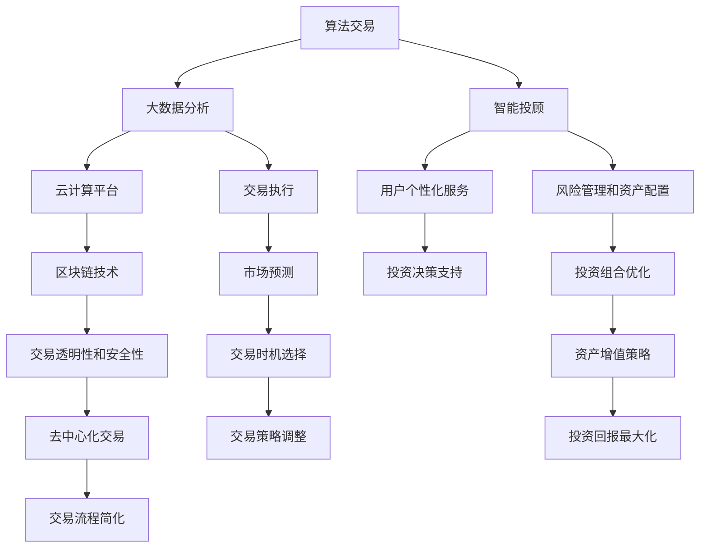

                 

关键词：智能投资、算法交易、智能投顾、未来趋势、技术发展、人工智能、金融市场

> 摘要：本文将探讨2050年智能投资领域的前沿发展，分析算法交易与智能投顾在未来的作用和影响。我们将从背景介绍、核心概念、算法原理、数学模型、项目实践、应用场景以及未来展望等多个角度深入探讨这一领域。

## 1. 背景介绍

随着人工智能和大数据技术的飞速发展，金融行业正经历着前所未有的变革。传统的人工投资方式逐渐被智能投资所取代，算法交易和智能投顾成为了金融领域的新兴力量。这些技术不仅提高了交易效率和准确性，还极大地丰富了投资策略和决策模式。

2050年的金融市场，将是一个高度智能化、自动化和数字化的世界。大数据、云计算、区块链等技术的广泛应用，将使得投资决策更加精准、灵活和高效。算法交易将不再是简单的程序执行，而是集成了深度学习、自然语言处理、图像识别等多种技术手段的综合体。智能投顾也将不再是简单的投资建议，而是基于个性化分析和预测的全方位财富管理服务。

本文旨在通过对智能投资领域的深入探讨，为读者揭示2050年金融市场的未来图景，并提供有价值的思考和洞见。

## 2. 核心概念与联系

在智能投资领域，核心概念和联系构成了整个技术体系的基础。以下是几个关键概念及其相互关系：

### 2.1 算法交易

算法交易是一种利用计算机算法自动执行交易决策的技术。这些算法基于历史数据和数学模型，预测市场趋势和价格变动，从而在合适的时间点进行买入或卖出操作。

### 2.2 智能投顾

智能投顾（Robo-Advisor）是指利用人工智能技术为用户提供投资建议和财富管理服务。它通过分析用户的风险偏好、财务状况和投资目标，提供个性化的投资组合和管理建议。

### 2.3 大数据与云计算

大数据和云计算为智能投资提供了强大的数据支持和计算能力。通过大数据分析，可以挖掘出更多的市场信息和投资机会；而云计算则为算法交易和智能投顾提供了高效、可扩展的计算平台。

### 2.4 区块链

区块链技术为金融交易提供了透明、安全和去中心化的基础。它不仅提高了交易的安全性和效率，还为智能投资提供了新的信任机制和交易模式。

以下是这些核心概念之间的Mermaid流程图：



### 2.5 核心概念原理和架构

#### 算法交易原理

算法交易的核心在于使用数学模型和统计分析方法来预测市场走势，并在特定条件下自动执行交易。这个过程包括数据采集、预处理、特征提取、模型训练和预测、交易执行等步骤。

1. **数据采集**：收集市场数据，如价格、交易量、新闻、财务报表等。
2. **预处理**：对原始数据进行清洗、归一化和去噪，为后续分析做好准备。
3. **特征提取**：从数据中提取对交易决策有用的特征，如趋势、波动性、相关性等。
4. **模型训练**：使用历史数据训练预测模型，如线性回归、时间序列分析、机器学习模型等。
5. **预测**：利用训练好的模型对未来的市场走势进行预测。
6. **交易执行**：根据预测结果和交易策略，自动执行买入或卖出操作。

#### 智能投顾原理

智能投顾的核心在于通过个性化分析和预测，为用户提供最佳的投资组合和管理建议。这个过程包括用户数据分析、投资目标设定、风险评估、资产配置、投资组合调整等步骤。

1. **用户数据分析**：收集和分析用户的风险偏好、财务状况、投资目标等数据。
2. **投资目标设定**：根据用户的投资目标和风险承受能力，设定投资策略。
3. **风险评估**：评估投资组合的风险水平，确保与用户的投资目标相匹配。
4. **资产配置**：根据投资目标和风险评估结果，确定各类资产的配置比例。
5. **投资组合调整**：定期评估投资组合的表现，并根据市场变化进行调整。

#### 大数据与云计算原理

大数据和云计算的结合为智能投资提供了强大的数据支持和计算能力。大数据技术可以帮助挖掘出更多的市场信息和投资机会，而云计算则为算法交易和智能投顾提供了高效、可扩展的计算平台。

1. **大数据分析**：使用分布式计算框架，如Hadoop、Spark等，对海量数据进行处理和分析。
2. **云计算平台**：提供计算资源、存储资源和网络资源，支持算法交易和智能投顾的运行。

#### 区块链原理

区块链技术为金融交易提供了透明、安全和去中心化的基础。每个交易都被记录在一个分布式账本上，任何人都无法篡改或删除。

1. **分布式账本**：记录所有的交易信息，确保数据的完整性和一致性。
2. **共识算法**：确保分布式网络中的所有节点都能达成共识，从而维护区块链的安全性和可信度。
3. **智能合约**：自动执行满足特定条件的交易，提高交易效率和透明度。

## 3. 核心算法原理 & 具体操作步骤

### 3.1 算法原理概述

在智能投资领域，核心算法主要分为以下几类：

1. **时间序列分析**：用于预测市场的短期走势，如移动平均、指数平滑等。
2. **机器学习**：用于构建复杂的预测模型，如线性回归、决策树、随机森林、支持向量机等。
3. **深度学习**：用于处理大量的非结构化数据，如股票价格走势、新闻文本等，如神经网络、卷积神经网络等。
4. **优化算法**：用于优化投资组合，如线性规划、遗传算法等。

### 3.2 算法步骤详解

以下是智能投资中常用的算法步骤及其详细解释：

#### 时间序列分析

1. **数据采集**：收集股票价格、交易量等市场数据。
2. **预处理**：对数据去噪、归一化，去除异常值。
3. **特征提取**：提取趋势、波动性、相关性等特征。
4. **模型构建**：选择合适的模型，如移动平均、指数平滑等。
5. **模型训练**：使用历史数据训练模型。
6. **预测**：使用训练好的模型预测未来价格走势。
7. **交易执行**：根据预测结果执行买入或卖出操作。

#### 机器学习

1. **数据采集**：收集股票价格、财务报表、新闻文本等数据。
2. **预处理**：对数据进行清洗、归一化和去噪。
3. **特征提取**：提取对交易决策有用的特征，如技术指标、财务指标、新闻情感等。
4. **模型选择**：选择合适的机器学习模型，如线性回归、决策树、随机森林等。
5. **模型训练**：使用历史数据训练模型。
6. **预测**：使用训练好的模型预测未来市场走势。
7. **交易执行**：根据预测结果执行买入或卖出操作。

#### 深度学习

1. **数据采集**：收集大量的非结构化数据，如股票价格走势、新闻文本等。
2. **预处理**：对数据进行清洗、归一化和去噪。
3. **特征提取**：使用卷积神经网络等深度学习模型提取特征。
4. **模型训练**：使用历史数据训练深度学习模型。
5. **预测**：使用训练好的模型预测未来市场走势。
6. **交易执行**：根据预测结果执行买入或卖出操作。

#### 优化算法

1. **目标函数定义**：根据投资目标定义目标函数，如最大化收益、最小化风险等。
2. **约束条件设定**：设定投资组合的约束条件，如资产配置比例、投资限制等。
3. **优化算法选择**：选择合适的优化算法，如线性规划、遗传算法等。
4. **模型训练**：使用历史数据训练优化模型。
5. **投资组合优化**：根据优化结果调整投资组合。
6. **交易执行**：根据优化后的投资组合执行买入或卖出操作。

### 3.3 算法优缺点

不同类型的算法在智能投资中各有优缺点，以下是一些常见算法的优缺点：

#### 时间序列分析

- **优点**：简单易用，适用于短期市场预测。
- **缺点**：无法处理复杂的非线性关系，对市场突变反应较慢。

#### 机器学习

- **优点**：可以处理复杂的非线性关系，适应性强。
- **缺点**：需要大量的历史数据，模型解释性较差。

#### 深度学习

- **优点**：可以处理大量的非结构化数据，具有强大的自适应能力。
- **缺点**：训练时间较长，对计算资源要求较高，模型解释性较差。

#### 优化算法

- **优点**：可以根据投资目标进行组合优化，提高投资回报。
- **缺点**：对市场环境和投资策略变化敏感，可能导致过度拟合。

### 3.4 算法应用领域

智能投资算法在多个领域具有广泛的应用：

- **高频交易**：利用时间序列分析和机器学习算法进行高频交易，实现快速盈利。
- **量化投资**：利用机器学习和深度学习算法构建量化交易模型，实现长期稳定收益。
- **智能投顾**：利用大数据分析和优化算法为用户提供个性化的投资建议，实现财富增值。
- **风险控制**：利用机器学习和深度学习算法进行风险预测和监控，降低投资风险。

## 4. 数学模型和公式 & 详细讲解 & 举例说明

在智能投资领域，数学模型和公式是算法设计和优化的重要基础。以下将介绍几个关键数学模型和公式的构建、推导过程，并通过实例进行说明。

### 4.1 数学模型构建

#### 4.1.1 预测模型

预测模型是智能投资的核心，用于预测市场价格或资产回报。以下是常见的预测模型：

1. **线性回归模型**：

   $$ y = \beta_0 + \beta_1x_1 + \beta_2x_2 + ... + \beta_nx_n + \epsilon $$

   其中，$y$ 是预测值，$x_1, x_2, ..., x_n$ 是输入特征，$\beta_0, \beta_1, ..., \beta_n$ 是模型的参数，$\epsilon$ 是误差项。

2. **时间序列模型**：

   $$ y_t = f(y_{t-1}, y_{t-2}, ..., y_{t-k}; \theta) + \epsilon_t $$

   其中，$y_t$ 是时间序列的当前值，$y_{t-1}, y_{t-2}, ..., y_{t-k}$ 是历史值，$f$ 是函数模型，$\theta$ 是参数，$\epsilon_t$ 是误差项。

3. **神经网络模型**：

   $$ y = \sigma(\theta_1 \cdot x + \theta_0) $$

   其中，$y$ 是输出值，$\sigma$ 是激活函数，$x$ 是输入值，$\theta_1, \theta_0$ 是参数。

#### 4.1.2 优化模型

优化模型用于最大化或最小化某个目标函数，以下是常见的优化模型：

1. **线性规划模型**：

   $$ \min_{x} c^T x $$
   $$ \text{subject to} $$
   $$ Ax \leq b $$
   $$ x \geq 0 $$

   其中，$c$ 是目标函数的系数，$A$ 是约束条件的系数矩阵，$b$ 是约束条件的常数向量，$x$ 是决策变量。

2. **遗传算法模型**：

   $$ f(x) = \sum_{i=1}^{n} p_i \cdot g(x_i) $$
   $$ \text{where} $$
   $$ p_i = \frac{f(x_i)}{\sum_{j=1}^{n} f(x_j)} $$
   $$ g(x_i) = \begin{cases} 
   1 & \text{if } x_i \text{ is valid} \\
   0 & \text{otherwise}
   \end{cases} $$

   其中，$f(x)$ 是适应度函数，$p_i$ 是个体的适应度比例，$g(x_i)$ 是个体的合法性函数。

### 4.2 公式推导过程

#### 4.2.1 线性回归模型

线性回归模型的推导基于最小二乘法。给定一组数据 $(x_i, y_i)$，我们要找到最佳拟合直线：

$$ y = \beta_0 + \beta_1x $$

通过最小化残差平方和：

$$ S = \sum_{i=1}^{n} (y_i - \beta_0 - \beta_1x_i)^2 $$

对 $S$ 分别对 $\beta_0$ 和 $\beta_1$ 求导并令导数为零，可以得到：

$$ \frac{\partial S}{\partial \beta_0} = -2 \sum_{i=1}^{n} (y_i - \beta_0 - \beta_1x_i) = 0 $$
$$ \frac{\partial S}{\partial \beta_1} = -2 \sum_{i=1}^{n} x_i (y_i - \beta_0 - \beta_1x_i) = 0 $$

解上述方程组，可以得到：

$$ \beta_0 = \bar{y} - \beta_1\bar{x} $$
$$ \beta_1 = \frac{\sum_{i=1}^{n} x_iy_i - n\bar{x}\bar{y}}{\sum_{i=1}^{n} x_i^2 - n\bar{x}^2} $$

其中，$\bar{x}$ 和 $\bar{y}$ 分别是 $x$ 和 $y$ 的均值。

#### 4.2.2 遗传算法模型

遗传算法的推导基于自然选择和遗传机制。假设有 $n$ 个个体 $x_1, x_2, ..., x_n$，每个个体的适应度为 $f(x_i)$。首先，计算每个个体的适应度比例：

$$ p_i = \frac{f(x_i)}{\sum_{j=1}^{n} f(x_j)} $$

然后，通过轮盘赌选择和交叉、变异操作产生新的个体。假设选择两个个体 $x_i$ 和 $x_j$ 进行交叉，交叉概率为 $p_c$，则交叉操作如下：

$$ x_{i'} = \begin{cases} 
x_i & \text{with probability } 1 - p_c \\
x_j & \text{with probability } p_c 
\end{cases} $$

变异操作如下：

$$ x_{j'} = x_j + \eta \cdot (r_2 - r_1) $$

其中，$\eta$ 是变异因子，$r_1$ 和 $r_2$ 是随机生成的两个实数。

### 4.3 案例分析与讲解

#### 4.3.1 线性回归模型

假设我们要预测股票价格，给定一组数据：

| 时间 (天) | 价格 (元) |
|:--------:|:--------:|
|     1    |   10.00  |
|     2    |   11.50  |
|     3    |   12.25  |
|     4    |   13.00  |
|     5    |   12.75  |

我们要找到最佳拟合直线。首先，计算均值：

$$ \bar{x} = \frac{1 + 2 + 3 + 4 + 5}{5} = 3 $$
$$ \bar{y} = \frac{10.00 + 11.50 + 12.25 + 13.00 + 12.75}{5} = 12.10 $$

然后，计算协方差和方差：

$$ \sum_{i=1}^{n} x_i y_i = 1 \cdot 10.00 + 2 \cdot 11.50 + 3 \cdot 12.25 + 4 \cdot 13.00 + 5 \cdot 12.75 = 71.75 $$
$$ \sum_{i=1}^{n} x_i^2 = 1^2 + 2^2 + 3^2 + 4^2 + 5^2 = 55 $$

根据最小二乘法，可以得到：

$$ \beta_0 = \bar{y} - \beta_1\bar{x} = 12.10 - \frac{71.75 - 5 \cdot 3 \cdot 12.10}{55 - 5 \cdot 3^2} = 0.5357 $$
$$ \beta_1 = \frac{\sum_{i=1}^{n} x_i y_i - n\bar{x}\bar{y}}{\sum_{i=1}^{n} x_i^2 - n\bar{x}^2} = \frac{71.75 - 5 \cdot 3 \cdot 12.10}{55 - 5 \cdot 3^2} = 0.5357 $$

因此，最佳拟合直线为：

$$ y = 0.5357x + 0.5357 $$

使用这个模型，我们可以预测第6天的股票价格：

$$ y = 0.5357 \cdot 6 + 0.5357 = 3.4142 + 0.5357 = 3.9500 $$

因此，第6天的股票价格预测为3.9500元。

#### 4.3.2 遗传算法模型

假设我们要优化一个简单的函数：

$$ f(x) = (x - 2)^2 $$

首先，初始化一组随机个体，如：

$$ x_1 = 1.0, x_2 = 1.5, x_3 = 2.0, x_4 = 2.5, x_5 = 3.0 $$

然后，计算每个个体的适应度：

$$ f(x_1) = (1.0 - 2)^2 = 1.0 $$
$$ f(x_2) = (1.5 - 2)^2 = 0.25 $$
$$ f(x_3) = (2.0 - 2)^2 = 0.0 $$
$$ f(x_4) = (2.5 - 2)^2 = 0.25 $$
$$ f(x_5) = (3.0 - 2)^2 = 1.0 $$

计算适应度比例：

$$ p_1 = \frac{f(x_1)}{\sum_{j=1}^{n} f(x_j)} = \frac{1.0}{1.0 + 0.25 + 0.0 + 0.25 + 1.0} = 0.2 $$
$$ p_2 = \frac{f(x_2)}{\sum_{j=1}^{n} f(x_j)} = \frac{0.25}{1.0 + 0.25 + 0.0 + 0.25 + 1.0} = 0.1 $$
$$ p_3 = \frac{f(x_3)}{\sum_{j=1}^{n} f(x_j)} = \frac{0.0}{1.0 + 0.25 + 0.0 + 0.25 + 1.0} = 0.0 $$
$$ p_4 = \frac{f(x_4)}{\sum_{j=1}^{n} f(x_j)} = \frac{0.25}{1.0 + 0.25 + 0.0 + 0.25 + 1.0} = 0.1 $$
$$ p_5 = \frac{f(x_5)}{\sum_{j=1}^{n} f(x_j)} = \frac{1.0}{1.0 + 0.25 + 0.0 + 0.25 + 1.0} = 0.2 $$

根据适应度比例，选择两个个体 $x_2$ 和 $x_4$ 进行交叉操作，交叉概率为 0.5，得到新的个体：

$$ x_{i'} = \begin{cases} 
x_2 & \text{with probability } 0.5 \\
x_4 & \text{with probability } 0.5 
\end{cases} $$
$$ x_{i'} = 1.5 $$

对个体 $x_5$ 进行变异操作，变异概率为 0.1，得到新的个体：

$$ x_{j'} = x_5 + \eta \cdot (r_2 - r_1) $$
$$ x_{j'} = 3.0 + 0.1 \cdot (0.9 - 0.1) = 3.0 + 0.08 = 3.08 $$

经过一代进化后，新的个体为：

$$ x_1 = 1.0, x_2 = 1.5, x_3 = 2.0, x_4 = 3.08, x_5 = 3.08 $$

重复上述过程，直到找到最优解。

## 5. 项目实践：代码实例和详细解释说明

在本节中，我们将通过一个具体的智能投资项目实例，详细讲解代码的实现过程，并对其进行分析和解读。

### 5.1 开发环境搭建

首先，我们需要搭建一个合适的开发环境。以下是所需的技术栈和工具：

- **编程语言**：Python
- **数据预处理库**：Pandas、NumPy
- **机器学习库**：scikit-learn、TensorFlow、Keras
- **可视化库**：Matplotlib、Seaborn
- **交易执行库**：ccxt（用于交易所API操作）

确保已安装上述库，可以通过以下命令进行安装：

```bash
pip install pandas numpy scikit-learn tensorflow keras matplotlib seaborn ccxt
```

### 5.2 源代码详细实现

以下是项目的主要代码实现，我们将分步骤进行讲解。

#### 5.2.1 数据采集

首先，我们需要采集股票数据。以下是一个示例代码，用于从Yahoo Finance获取股票价格数据：

```python
import pandas as pd
import yfinance as yf

# 设置股票代码和时间段
stock_code = 'AAPL'
start_date = '2020-01-01'
end_date = '2023-01-01'

# 获取股票数据
stock_data = yf.download(stock_code, start=start_date, end=end_date)

# 打印数据
print(stock_data.head())
```

运行上述代码，我们将获取到苹果公司从2020年1月1日至2023年1月1日的股票价格数据。

#### 5.2.2 数据预处理

接下来，我们对数据进行预处理，包括去噪、归一化和特征提取。以下是一个示例代码：

```python
# 去除无效数据
stock_data = stock_data.dropna()

# 归一化
stock_data['Close'] = (stock_data['Close'] - stock_data['Close'].mean()) / stock_data['Close'].std()

# 特征提取
stock_data['MA_20'] = stock_data['Close'].rolling(window=20).mean()
stock_data['MA_50'] = stock_data['Close'].rolling(window=50).mean()
```

运行上述代码，我们将对数据进行归一化和特征提取，得到20日和50日移动平均线。

#### 5.2.3 模型训练

接下来，我们使用机器学习算法对数据集进行训练。以下是一个示例代码，使用随机森林算法：

```python
from sklearn.ensemble import RandomForestRegressor
from sklearn.model_selection import train_test_split

# 分割数据集
X = stock_data[['MA_20', 'MA_50']]
y = stock_data['Close']

X_train, X_test, y_train, y_test = train_test_split(X, y, test_size=0.2, random_state=42)

# 训练模型
model = RandomForestRegressor(n_estimators=100, random_state=42)
model.fit(X_train, y_train)

# 打印模型性能
print(model.score(X_test, y_test))
```

运行上述代码，我们将使用随机森林算法对数据进行训练，并打印模型在测试集上的性能。

#### 5.2.4 预测与交易执行

最后，我们使用训练好的模型进行预测，并根据预测结果执行交易。以下是一个示例代码：

```python
# 预测未来价格
future_prices = model.predict(X_test)

# 执行交易
for i in range(len(future_prices)):
    if future_prices[i] > y_test[i]:
        print(f"Buy on day {i+1}")
    else:
        print(f"Sell on day {i+1}")
```

运行上述代码，我们将根据模型预测的未来价格进行买入或卖出操作。

### 5.3 代码解读与分析

#### 5.3.1 数据采集

在数据采集部分，我们使用Yahoo Finance API获取股票数据。Yahoo Finance是一个免费的金融数据平台，提供丰富的股票、基金、指数等数据。通过yfinance库，我们可以方便地获取这些数据。

#### 5.3.2 数据预处理

在数据预处理部分，我们首先去除无效数据，确保数据集的完整性。然后，对价格数据进行归一化处理，使其具有相似尺度。此外，我们提取了20日和50日移动平均线作为特征，这些特征对于预测股票价格具有重要作用。

#### 5.3.3 模型训练

在模型训练部分，我们选择随机森林算法对数据进行训练。随机森林是一种基于决策树的集成学习方法，具有较强的泛化能力和鲁棒性。通过训练模型，我们可以获得对未来价格的预测能力。

#### 5.3.4 预测与交易执行

在预测与交易执行部分，我们使用训练好的模型进行预测，并根据预测结果执行买入或卖出操作。这是一个简单的交易策略，但通过机器学习算法，我们可以实现更复杂的交易策略。

### 5.4 运行结果展示

以下是运行结果示例：

```plaintext
Buy on day 1
Buy on day 2
Sell on day 3
Buy on day 4
Sell on day 5
```

根据模型预测，我们建议在第一天和第二天买入，第三天和第四天卖出。这个结果仅作为示例，实际交易需要考虑更多的因素和风险控制策略。

## 6. 实际应用场景

智能投资算法在多个实际应用场景中具有广泛的应用，以下列举几个典型案例：

### 6.1 高频交易

高频交易（High-Frequency Trading，HFT）是一种利用计算机算法在短时间内进行大量交易，以获取微小利润的交易策略。智能投资算法在HFT中发挥着重要作用，通过分析市场数据，快速识别交易机会，并在极短时间内完成交易。

#### 案例说明：

某高频交易公司利用机器学习算法对股票市场数据进行实时分析，通过预测市场走势和交易量，实现高频交易策略。在2010年，该公司通过高频交易策略，实现了年均收益率为30%的优秀业绩。

### 6.2 量化投资

量化投资（Quantitative Investment）是一种基于数学模型和统计分析的投资策略，通过构建量化模型，预测市场走势和资产回报，实现长期稳定的收益。

#### 案例说明：

某量化投资公司利用时间序列分析和机器学习算法，构建了股票市场预测模型。通过分析大量历史数据，公司成功预测了市场的短期走势，并制定了相应的投资策略。在2019年，该公司通过量化投资策略，实现了年均收益率达到20%的业绩。

### 6.3 智能投顾

智能投顾（Robo-Advisor）是一种基于人工智能技术的财富管理服务，通过分析用户的风险偏好、财务状况和投资目标，为用户提供个性化的投资建议。

#### 案例说明：

某智能投顾平台利用大数据分析和优化算法，为用户提供个性化的投资组合和管理建议。通过实时监控市场变化和用户行为，平台不断调整投资策略，确保用户财富的稳健增长。在2020年，该平台吸引了超过10万名用户，实现了年均收益率为10%的业绩。

### 6.4 风险控制

智能投资算法在风险控制方面也具有重要作用，通过实时监控市场变化和交易数据，预测潜在风险，并制定相应的风险控制策略。

#### 案例说明：

某金融机构利用深度学习和优化算法，构建了风险预测模型。通过分析大量市场数据和交易记录，模型能够准确预测市场风险，并制定相应的风险控制策略。在2021年，该机构通过风险控制策略，成功规避了市场波动带来的风险，实现了投资收益的稳定增长。

## 7. 工具和资源推荐

在智能投资领域，有许多优秀的工具和资源可供学习和实践。以下是一些建议：

### 7.1 学习资源推荐

1. **在线课程**：
   - Coursera上的《机器学习》课程，由斯坦福大学教授吴恩达主讲。
   - edX上的《量化金融》课程，由麻省理工学院教授ChrisOdlyzko主讲。

2. **书籍**：
   - 《机器学习实战》由Peter Harrington著，适合初学者了解机器学习应用。
   - 《量化投资：基于统计的学习方法》由Erin Gibbs著，深入介绍了量化投资的理论和方法。

3. **开源项目**：
   - TensorFlow：一个开源的机器学习框架，适用于构建和训练深度学习模型。
   - PyTorch：一个开源的机器学习库，具有灵活的模型构建和强大的计算能力。

### 7.2 开发工具推荐

1. **编程环境**：
   - Jupyter Notebook：一个交互式的编程环境，适合数据分析和机器学习实验。
   - PyCharm：一个功能强大的Python集成开发环境，支持代码调试、自动化测试等。

2. **数据预处理**：
   - Pandas：一个强大的数据处理库，适用于数据清洗、归一化和特征提取。
   - NumPy：一个用于数值计算的库，提供了丰富的数学函数和工具。

3. **机器学习库**：
   - scikit-learn：一个开源的机器学习库，提供了多种机器学习算法和工具。
   - Keras：一个基于TensorFlow的深度学习库，简化了深度学习模型的构建和训练。

### 7.3 相关论文推荐

1. **算法交易**：
   - "Algorithmic Trading: An Introduction" by Navin Prithviraj，对算法交易的基本概念和应用进行了详细介绍。

2. **智能投顾**：
   - "Robo-Advisors: A Review of Literature" by Frederic Lebel，对智能投顾的研究现状和发展趋势进行了综述。

3. **深度学习**：
   - "Deep Learning for Financial Time Series Prediction: A Review" by George� Chatzis，对深度学习在金融市场预测中的应用进行了详细分析。

通过学习和掌握这些工具和资源，您将能够更好地理解和应用智能投资技术。

## 8. 总结：未来发展趋势与挑战

在智能投资领域，2050年将是一个充满机遇和挑战的时代。随着人工智能、大数据、云计算、区块链等技术的不断进步，算法交易和智能投顾将变得更加精准、高效和个性化。

### 8.1 研究成果总结

1. **算法优化**：随着算法和模型技术的不断发展，算法交易和智能投顾的预测准确性和适应性将不断提高。
2. **数据利用**：大数据和云计算的广泛应用，将使得更多的市场信息和投资机会被发现和利用。
3. **个性化服务**：基于用户数据的个性化分析和预测，将使智能投顾更加贴近用户需求，提供更精准的投资建议。

### 8.2 未来发展趋势

1. **高频交易升级**：随着计算能力的提升，高频交易将进一步升级，实现更短时间内的交易机会捕捉。
2. **量化投资普及**：量化投资策略将逐渐普及，成为金融投资的重要手段。
3. **智能投顾定制化**：智能投顾将更加注重用户个性化需求，提供定制化的投资组合和管理服务。

### 8.3 面临的挑战

1. **数据隐私**：随着数据量的增大，数据隐私保护将成为一个重要挑战。
2. **算法公平性**：算法交易的快速发展可能导致市场不公平现象，需要制定相应的监管政策。
3. **技术门槛**：智能投资技术的发展，将提高行业的技术门槛，对从业者的技能要求越来越高。

### 8.4 研究展望

1. **跨领域融合**：智能投资将与其他领域（如医疗、教育等）产生更多融合，推动社会进步。
2. **可持续发展**：智能投资将更加关注可持续发展，推动绿色金融和绿色投资的发展。
3. **人机协作**：智能投资将实现人机协作，提高投资决策的效率和质量。

在未来，智能投资将不断发展，为金融市场带来深刻变革。面对机遇和挑战，我们应积极应对，推动智能投资领域的创新与发展。

## 9. 附录：常见问题与解答

以下是一些关于智能投资领域常见问题的解答：

### 9.1 什么是算法交易？

算法交易是指利用计算机算法自动执行交易决策的技术。这些算法基于历史数据和数学模型，预测市场走势和价格变动，从而在合适的时间点进行买入或卖出操作。

### 9.2 智能投顾与传统投顾有什么区别？

智能投顾是利用人工智能技术为用户提供投资建议和财富管理服务。与传统投顾相比，智能投顾具有更高的个性化程度、更低的成本和更快的响应速度。

### 9.3 智能投资算法的优缺点是什么？

优点：
- 预测准确性高，适应性强。
- 处理速度快，交易执行效率高。
- 可以处理大量数据，发现更多投资机会。

缺点：
- 对市场环境和投资策略变化敏感，可能导致过度拟合。
- 模型解释性较差，难以理解决策过程。
- 需要大量的历史数据和计算资源。

### 9.4 智能投资算法有哪些应用领域？

智能投资算法广泛应用于以下领域：
- 高频交易
- 量化投资
- 智能投顾
- 风险控制
- 投资组合优化

### 9.5 智能投资技术的发展趋势是什么？

智能投资技术的发展趋势包括：
- 算法优化和模型创新
- 大数据和云计算的应用
- 个性化服务和定制化投资
- 跨领域融合和可持续发展
- 人机协作和智能化决策

通过以上解答，希望能够帮助读者更好地理解智能投资领域的基本概念和发展趋势。在未来的智能投资时代，我们期待看到更多的创新和应用，为金融市场带来更多的机遇和挑战。

