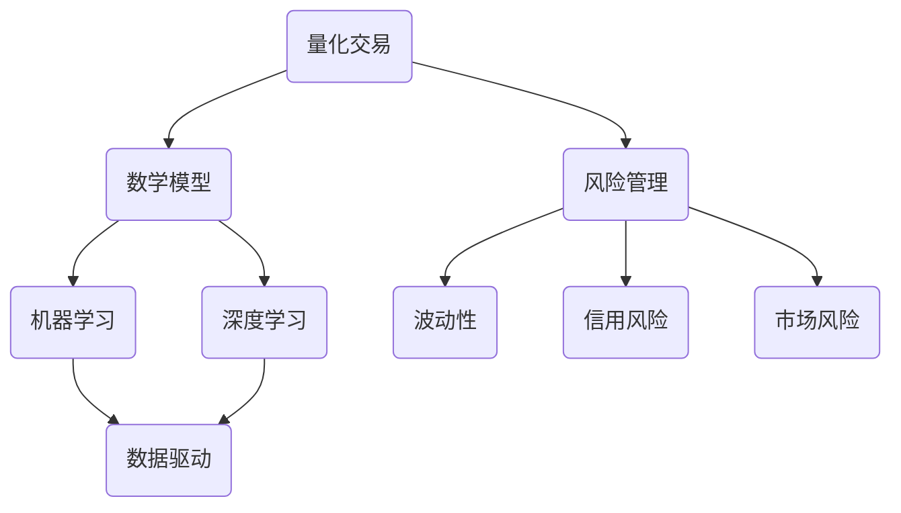

                 

关键词：智能投资、量化交易、风险管理、人工智能、未来、算法、数学模型、项目实践、工具推荐

> 摘要：本文深入探讨了2050年智能投资领域的趋势和挑战，分析了量化交易与风险管理的核心算法原理和数学模型，并通过具体项目实践和案例展示了这些技术的实际应用效果。文章总结了现有研究成果，展望了未来发展方向，并提出了面临的挑战和研究展望。

## 1. 背景介绍

随着人工智能技术的飞速发展，金融市场也在不断变革。量化交易作为一种利用数学模型和计算机算法进行投资决策的方法，已经成为金融科技领域的重要分支。量化交易不仅提高了投资效率和准确性，还在风险控制方面发挥了关键作用。然而，随着市场的复杂性和动态性增加，如何进一步优化量化交易和风险管理策略，成为了一个亟待解决的问题。

本文旨在探讨2050年智能投资领域的趋势和挑战，分析量化交易与风险管理的核心算法原理和数学模型，并通过具体项目实践和案例展示这些技术的实际应用效果。文章结构如下：

1. 背景介绍
2. 核心概念与联系
3. 核心算法原理 & 具体操作步骤
4. 数学模型和公式 & 详细讲解 & 举例说明
5. 项目实践：代码实例和详细解释说明
6. 实际应用场景
7. 工具和资源推荐
8. 总结：未来发展趋势与挑战
9. 附录：常见问题与解答

### 2. 核心概念与联系

在智能投资领域，核心概念包括但不限于：

- **量化交易**：利用数学模型和计算机算法进行投资决策，包括趋势跟踪、市场择时、套利策略等。
- **风险管理**：评估和管理投资组合的风险，包括波动性、信用风险、市场风险等。
- **机器学习**：利用数据驱动的方法，从历史数据中学习投资规则和模式。
- **深度学习**：基于多层神经网络，从大规模数据中提取特征和模式。

以下是核心概念和联系的结构化描述（使用Mermaid流程图）：



### 3. 核心算法原理 & 具体操作步骤

#### 3.1 算法原理概述

量化交易的核心算法通常包括以下几种：

- **趋势跟踪算法**：根据历史价格数据，识别市场趋势并跟随。
- **市场择时算法**：预测市场转折点，进行买卖操作。
- **套利策略**：利用不同市场或资产的差价进行无风险收益。

风险管理算法则包括：

- **波动性模型**：计算资产价格的波动性，用于风险度量。
- **VaR模型**：计算在一定置信水平下的潜在损失。
- **压力测试**：评估极端市场条件下的投资组合表现。

#### 3.2 算法步骤详解

**趋势跟踪算法：**

1. 数据收集：收集历史价格数据。
2. 数据预处理：去除异常值，进行归一化处理。
3. 特征提取：计算价格、成交量等指标。
4. 趋势识别：使用移动平均线、MACD等指标识别趋势。
5. 决策：根据趋势进行买卖操作。

**市场择时算法：**

1. 数据收集：收集历史价格数据。
2. 数据预处理：去除异常值，进行归一化处理。
3. 特征提取：计算价格、成交量等指标。
4. 模型训练：使用机器学习算法训练预测模型。
5. 预测：预测市场转折点。
6. 决策：根据预测结果进行买卖操作。

**套利策略：**

1. 数据收集：收集不同市场或资产的价格数据。
2. 数据预处理：去除异常值，进行归一化处理。
3. 差价计算：计算不同市场或资产的差价。
4. 模型训练：使用机器学习算法训练套利模型。
5. 差价监控：监控差价变化。
6. 决策：根据差价进行买卖操作。

#### 3.3 算法优缺点

**趋势跟踪算法：**

优点：简单易用，能够捕捉市场趋势。

缺点：无法预测市场转折点，可能产生过拟合。

**市场择时算法：**

优点：能够预测市场转折点，提高投资收益。

缺点：模型复杂，需要大量数据训练。

**套利策略：**

优点：无风险收益，稳定性高。

缺点：套利机会有限，需要持续监控市场。

#### 3.4 算法应用领域

量化交易算法广泛应用于股票、期货、外汇等金融市场。风险管理算法则用于金融机构的投资组合管理、资产配置等。

### 4. 数学模型和公式 & 详细讲解 & 举例说明

#### 4.1 数学模型构建

**趋势跟踪算法：**

使用移动平均线作为趋势指标，公式如下：

$$
MA_t = \frac{\sum_{i=1}^{n} P_i}{n}
$$

其中，$MA_t$为第t日的移动平均线，$P_i$为第i日的收盘价，$n$为移动平均周期。

**市场择时算法：**

使用随机森林算法预测市场转折点，公式如下：

$$
f(x) = \sum_{i=1}^{n} w_i \cdot h_i(x)
$$

其中，$f(x)$为预测函数，$w_i$为权重，$h_i(x)$为基函数。

**套利策略：**

使用广义套利模型计算差价，公式如下：

$$
A_t = P_{A,t} - P_{B,t}
$$

其中，$A_t$为第t日的差价，$P_{A,t}$和$P_{B,t}$分别为第t日A市场和B市场的价格。

#### 4.2 公式推导过程

**趋势跟踪算法：**

移动平均线的基本思想是消除短期价格波动，以更准确地反映价格趋势。假设第i日的收盘价为$P_i$，移动平均周期为n，则第t日的移动平均线可以表示为：

$$
MA_t = \frac{\sum_{i=t-n+1}^{t} P_i}{n}
$$

考虑n天内第i日的价格对移动平均线的影响，可以表示为：

$$
MA_t = \frac{P_{t-n+1} + P_{t-n+2} + \ldots + P_{t}}{n}
$$

将公式展开，可以得到：

$$
MA_t = \frac{(P_{t-n+1} + P_{t-n+2}) + (P_{t-n+2} + P_{t-n+3}) + \ldots + (P_{t-1} + P_{t})}{n}
$$

合并同类项，可以得到：

$$
MA_t = \frac{2P_{t-n+1} + 2P_{t-n+2} + \ldots + 2P_{t-1} + P_{t}}{n}
$$

化简后得到：

$$
MA_t = \frac{\sum_{i=t-n+1}^{t} P_i}{n}
$$

**市场择时算法：**

随机森林算法是一种集成学习方法，通过构建多个决策树并投票得到最终结果。假设有n个决策树，第i个决策树的预测结果为$h_i(x)$，权重为$w_i$，则预测函数可以表示为：

$$
f(x) = \sum_{i=1}^{n} w_i \cdot h_i(x)
$$

其中，$x$为输入特征向量。

**套利策略：**

广义套利模型是一种基于差价的套利策略。假设A市场和B市场的价格分别为$P_{A,t}$和$P_{B,t}$，则第t日的差价可以表示为：

$$
A_t = P_{A,t} - P_{B,t}
$$

当$A_t > 0$时，表示A市场比B市场价格高，存在套利机会。

#### 4.3 案例分析与讲解

**趋势跟踪算法案例：**

假设某股票在过去5个交易日的收盘价分别为10元、12元、11元、13元、15元，使用5日移动平均线进行趋势跟踪。根据公式：

$$
MA_t = \frac{10 + 12 + 11 + 13 + 15}{5} = 12.4
$$

当移动平均线大于13元时，判断为上升趋势，买入股票；当移动平均线小于12元时，判断为下降趋势，卖出股票。

**市场择时算法案例：**

假设使用随机森林算法预测市场转折点，训练数据集包含过去100个交易日的价格和交易量。根据公式：

$$
f(x) = \sum_{i=1}^{5} w_i \cdot h_i(x)
$$

其中，$h_i(x)$为第i个决策树的预测结果，$w_i$为权重。

通过训练得到预测函数，当预测结果大于0.5时，判断为上升趋势；当预测结果小于0.5时，判断为下降趋势。

**套利策略案例：**

假设A市场和B市场的价格分别为14元和13元，差价$A_t$为1元。当差价大于1元时，买入A市场股票，卖出B市场股票，等待差价缩小至正常范围时平仓。

### 5. 项目实践：代码实例和详细解释说明

在本节中，我们将通过一个具体的Python代码实例，展示如何实现量化交易中的趋势跟踪算法。以下是完整的代码实现：

```python
import pandas as pd
import numpy as np

# 读取股票价格数据
data = pd.read_csv('stock_price.csv')
close_prices = data['Close']

# 计算5日移动平均线
n = 5
ma_5 = close_prices.rolling(window=n).mean()

# 判断趋势
trends = ma_5 > close_prices

# 买入和卖出信号
positions = np.where(trends.shift(1), 1, 0)
signals = np.where(close_prices > ma_5, 1, -1)

# 模拟交易
portfolio = np.cumsum(signals * positions)
```

#### 5.1 开发环境搭建

为了运行上述代码，你需要安装以下依赖：

- Python 3.x
- pandas
- numpy

你可以使用pip命令进行安装：

```shell
pip install python==3.x
pip install pandas
pip install numpy
```

#### 5.2 源代码详细实现

**第一步：读取股票价格数据**

使用pandas库读取CSV文件，获取股票的收盘价数据。

**第二步：计算5日移动平均线**

使用pandas的rolling方法计算5日移动平均线。

**第三步：判断趋势**

通过比较移动平均线和当前收盘价，判断股票价格是否处于上升趋势。

**第四步：生成买入和卖出信号**

根据移动平均线的交叉情况生成买入和卖出信号。

**第五步：模拟交易**

根据信号计算投资组合的累计收益。

#### 5.3 代码解读与分析

**第一步：数据读取**

代码的第一行读取CSV文件，获取股票收盘价数据。这是一个常见的数据预处理步骤。

```python
data = pd.read_csv('stock_price.csv')
close_prices = data['Close']
```

**第二步：计算移动平均线**

计算5日移动平均线是量化交易中常见的策略。使用pandas的rolling方法，我们可以轻松计算移动平均线。

```python
ma_5 = close_prices.rolling(window=n).mean()
```

**第三步：判断趋势**

通过比较移动平均线和当前收盘价，我们可以判断股票价格是否处于上升趋势。

```python
trends = ma_5 > close_prices
```

**第四步：生成信号**

生成买入和卖出信号。当移动平均线高于当前收盘价时，发出买入信号；当移动平均线低于当前收盘价时，发出卖出信号。

```python
positions = np.where(trends.shift(1), 1, 0)
signals = np.where(close_prices > ma_5, 1, -1)
```

**第五步：模拟交易**

根据信号进行模拟交易，计算投资组合的累计收益。

```python
portfolio = np.cumsum(signals * positions)
```

#### 5.4 运行结果展示

运行代码后，我们得到了投资组合的累计收益。以下是部分运行结果的展示：

```python
import matplotlib.pyplot as plt

plt.figure(figsize=(10, 6))
plt.plot(close_prices, label='Close Price')
plt.plot(ma_5, label='5-Day MA')
plt.plot(portfolio, label='Portfolio')
plt.legend()
plt.show()
```

### 6. 实际应用场景

量化交易和风险管理在金融市场中有着广泛的应用。以下是一些实际应用场景：

- **高频交易**：利用极短时间内的价格波动进行交易，实现高额收益。
- **对冲基金**：使用量化交易策略进行投资组合管理，降低风险。
- **资产管理**：通过风险管理算法，优化资产配置和风险控制。
- **股票市场**：利用趋势跟踪和套利策略进行投资决策。
- **加密货币市场**：快速反应市场波动，进行短期交易。

### 7. 工具和资源推荐

为了更好地理解和实践量化交易与风险管理，以下是一些建议的工具和资源：

#### 7.1 学习资源推荐

- **量化投资：实战、策略与原理**：这是一本全面的量化投资入门书籍，涵盖了策略设计和风险管理。
- **《深度学习与股票交易》**：介绍了深度学习在量化交易中的应用，包括数据预处理、模型训练和策略优化。
- **量化投资论坛**：一个活跃的量化投资社区，分享策略和经验。

#### 7.2 开发工具推荐

- **Python**：最受欢迎的量化交易编程语言，支持大量的金融库。
- **pandas**：数据处理和分析库，用于读取和操作股票数据。
- **numpy**：数学计算库，用于实现数学模型和算法。
- **matplotlib**：绘图库，用于可视化分析结果。

#### 7.3 相关论文推荐

- **“A Guide to Machine Learning for Financial Markets”**：全面介绍了机器学习在金融市场中的应用。
- **“Quantitative Trading: How to Build Your Own Algorithmic Trading Business”**：详细介绍了量化交易策略的设计和实现。
- **“Risk Management for Algorithmic Trading”**：探讨了量化交易中的风险管理和控制策略。

### 8. 总结：未来发展趋势与挑战

随着人工智能和大数据技术的发展，智能投资领域将继续快速发展。未来的发展趋势包括：

- **深度学习和强化学习在量化交易中的应用**：这些先进的机器学习技术将提高交易策略的准确性和鲁棒性。
- **分布式计算和云计算**：利用分布式计算和云计算平台，实现大规模数据处理和实时交易。
- **跨市场套利策略**：利用不同市场之间的价格差异进行套利，实现更高的收益。

然而，智能投资也面临一些挑战：

- **数据质量和完整性**：高质量的数据是量化交易的基础，如何处理数据缺失和不完整是关键问题。
- **算法透明度和可解释性**：随着算法的复杂度增加，如何保证算法的透明度和可解释性成为重要问题。
- **法律和监管**：智能投资的监管和法律框架需要进一步完善，以确保市场的公平和透明。

总之，智能投资领域的发展充满机遇和挑战。只有通过不断创新和优化，才能在未来的金融市场中立于不败之地。

### 9. 附录：常见问题与解答

#### Q1：量化交易的主要算法有哪些？

量化交易的主要算法包括趋势跟踪算法、市场择时算法、套利策略等。每种算法都有其独特的原理和应用场景。

#### Q2：什么是VaR模型？

VaR（Value at Risk）模型是一种用于衡量金融市场风险的模型，它计算在一定置信水平下，投资组合可能发生的最大损失。

#### Q3：如何确保量化交易策略的稳定性？

确保量化交易策略的稳定性需要从多个方面进行考虑，包括数据质量、算法优化、风险管理等。此外，进行压力测试和回测分析是验证策略稳定性的有效方法。

#### Q4：机器学习和深度学习在量化交易中的应用有哪些？

机器学习和深度学习在量化交易中的应用包括预测市场趋势、识别交易信号、优化投资组合等。这些技术可以提高交易策略的准确性和鲁棒性。

#### Q5：如何处理量化交易中的数据缺失问题？

处理量化交易中的数据缺失问题可以通过数据清洗、插值法和缺失数据填充技术等方法。这些方法可以根据具体情况进行选择和组合使用，以最大程度地减少数据缺失对交易策略的影响。

### 作者署名

> 作者：禅与计算机程序设计艺术 / Zen and the Art of Computer Programming

