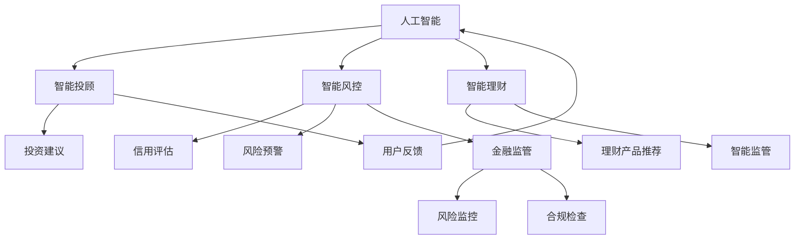

                 

关键词：智能金融、AI金融顾问、智能监管、2050年、未来趋势、技术发展

> 摘要：随着人工智能技术的迅猛发展，智能金融已经成为了未来金融行业的重要发展方向。本文将探讨到2050年，AI金融顾问和智能金融监管将如何影响金融行业，并预测未来的发展趋势与挑战。

## 1. 背景介绍

随着互联网、大数据和人工智能技术的不断进步，金融行业正迎来一场深刻的变革。从早期的电子银行、在线支付，到现在的智能投顾、区块链应用，技术正逐步改变着金融行业的运营模式。在未来，人工智能将进一步推动金融行业的智能化发展，特别是在AI金融顾问和智能金融监管方面。

### 1.1 智能金融的定义与发展

智能金融是指通过人工智能技术来优化金融产品、服务和管理的过程。具体包括以下几个方面：

- **智能投顾**：利用人工智能算法为投资者提供个性化投资建议。
- **智能风控**：利用大数据和人工智能技术进行信用评估、风险预警等。
- **智能支付**：通过区块链和人工智能技术实现快速、安全的支付交易。
- **智能理财**：利用机器学习算法为用户推荐理财产品，实现财富增值。

### 1.2 AI金融顾问的现状与未来

AI金融顾问作为智能金融的重要一环，已经在当前金融市场中初具规模。例如，许多银行和金融机构已经推出了智能投顾服务，利用算法为用户推荐投资产品。然而，这些服务大多数还处于初级阶段，未来的发展潜力巨大。

### 1.3 智能金融监管的必要性

随着智能金融的发展，金融监管也面临着新的挑战。传统的金融监管方式已经无法满足智能金融时代的需要，因此，智能金融监管应运而生。智能金融监管是指利用人工智能技术对金融市场进行监管，以应对新的风险和挑战。

## 2. 核心概念与联系

在探讨未来的智能金融时，我们需要了解以下几个核心概念：

- **人工智能**：一种模拟人类智能的技术，包括机器学习、自然语言处理、计算机视觉等领域。
- **大数据**：指无法在合理时间内用常规软件工具进行捕捉、管理和处理的数据集合。
- **区块链**：一种去中心化的数据库技术，通过分布式共识机制保证数据的安全性和不可篡改性。

### 2.1 人工智能与智能金融

人工智能是智能金融的核心驱动力，它能够实现数据的自动分析、预测和决策。例如，通过机器学习算法，AI金融顾问可以分析用户的历史投资记录，预测其投资偏好，从而提供个性化的投资建议。

### 2.2 大数据与智能金融

大数据技术使得金融机构能够收集、处理和分析海量的金融数据，从而提高金融服务的质量和效率。例如，通过大数据分析，金融机构可以更准确地评估信用风险，降低不良贷款率。

### 2.3 区块链与智能金融

区块链技术提供了安全、透明的金融交易环境，有助于提高金融市场的效率和信任度。例如，通过区块链，智能支付可以实现实时交易，减少中间环节，降低交易成本。

### 2.4 Mermaid 流程图

以下是一个简单的 Mermaid 流程图，展示了人工智能、大数据和区块链在智能金融中的应用：



## 3. 核心算法原理 & 具体操作步骤

### 3.1 算法原理概述

在智能金融中，核心算法主要包括机器学习算法、深度学习算法和自然语言处理算法。以下分别介绍这些算法的原理和应用。

#### 3.1.1 机器学习算法

机器学习算法是一种通过数据学习模式和规律，然后进行预测或分类的方法。常见的机器学习算法包括线性回归、逻辑回归、决策树、随机森林等。在智能金融中，机器学习算法主要用于信用评估、投资组合优化和风险管理等方面。

#### 3.1.2 深度学习算法

深度学习算法是一种模拟人脑神经网络结构的方法，它通过多层神经网络进行特征提取和模式识别。常见的深度学习算法包括卷积神经网络（CNN）、循环神经网络（RNN）和生成对抗网络（GAN）等。在智能金融中，深度学习算法主要用于图像识别、语音识别和自然语言处理等方面。

#### 3.1.3 自然语言处理算法

自然语言处理（NLP）算法是一种使计算机理解和生成人类语言的方法。常见的NLP算法包括词向量表示、词性标注、句法分析、情感分析等。在智能金融中，NLP算法主要用于用户反馈分析、投资报告生成和智能客服等方面。

### 3.2 算法步骤详解

以下是智能金融中常见算法的具体操作步骤：

#### 3.2.1 信用评估

1. **数据收集**：收集用户的基本信息、历史交易记录、信用记录等数据。
2. **数据预处理**：对数据进行清洗、去重、标准化等处理。
3. **特征工程**：提取对信用评估有重要影响的特征，如用户年龄、收入、信用历史等。
4. **模型训练**：选择合适的机器学习算法，如逻辑回归、随机森林等，对训练数据进行训练。
5. **模型评估**：使用验证集对模型进行评估，调整模型参数。
6. **信用评分**：将新用户的数据输入模型，得到其信用评分。

#### 3.2.2 投资组合优化

1. **数据收集**：收集用户的历史投资记录、市场数据等。
2. **数据预处理**：对数据进行清洗、去重、标准化等处理。
3. **特征工程**：提取对投资组合有重要影响的特征，如资产收益、风险等。
4. **模型训练**：选择合适的机器学习算法，如线性回归、支持向量机等，对训练数据进行训练。
5. **模型评估**：使用验证集对模型进行评估，调整模型参数。
6. **投资组合推荐**：将用户的数据输入模型，得到最优的投资组合。

#### 3.2.3 风险预警

1. **数据收集**：收集金融市场的各种数据，如股票价格、交易量、宏观经济指标等。
2. **数据预处理**：对数据进行清洗、去重、标准化等处理。
3. **特征工程**：提取对风险有重要影响的特征，如资产波动率、市场流动性等。
4. **模型训练**：选择合适的机器学习算法，如决策树、随机森林等，对训练数据进行训练。
5. **模型评估**：使用验证集对模型进行评估，调整模型参数。
6. **风险预警**：将新的市场数据输入模型，预测潜在风险。

### 3.3 算法优缺点

#### 3.3.1 优点

1. **高效性**：算法能够快速处理海量数据，提供实时决策支持。
2. **准确性**：通过机器学习和深度学习算法，能够提高预测和分类的准确性。
3. **个性化**：根据用户数据和偏好，提供个性化的金融产品和服务。

#### 3.3.2 缺点

1. **数据依赖性**：算法的性能高度依赖于数据的质量和数量。
2. **复杂性**：算法的复杂性和计算成本较高，需要专业的技术团队进行维护。
3. **解释性**：部分算法，如深度学习算法，其决策过程缺乏解释性，难以理解。

### 3.4 算法应用领域

智能金融算法在多个领域都有广泛的应用，主要包括：

1. **投资理财**：提供智能投顾、资产配置、风险控制等服务。
2. **信用评估**：为金融机构提供信用评估、风险预警等服务。
3. **智能监管**：协助金融监管机构进行市场监控、合规检查等。
4. **金融科技**：为金融行业提供智能合约、区块链应用等服务。

## 4. 数学模型和公式 & 详细讲解 & 举例说明

### 4.1 数学模型构建

在智能金融中，常用的数学模型包括线性回归、逻辑回归、支持向量机等。以下以线性回归模型为例进行讲解。

#### 4.1.1 线性回归模型

线性回归模型是一种用于预测数值型变量的方法。其基本公式为：

$$ y = \beta_0 + \beta_1x_1 + \beta_2x_2 + ... + \beta_nx_n + \epsilon $$

其中，$y$ 是因变量，$x_1, x_2, ..., x_n$ 是自变量，$\beta_0, \beta_1, \beta_2, ..., \beta_n$ 是模型的参数，$\epsilon$ 是误差项。

#### 4.1.2 逻辑回归模型

逻辑回归模型是一种用于预测概率型变量的方法。其基本公式为：

$$ P(y=1) = \frac{1}{1 + e^{-(\beta_0 + \beta_1x_1 + \beta_2x_2 + ... + \beta_nx_n )}} $$

其中，$P(y=1)$ 是因变量为1的概率。

#### 4.1.3 支持向量机

支持向量机是一种用于分类的方法。其基本公式为：

$$ w \cdot x + b = 0 $$

其中，$w$ 是权重向量，$x$ 是特征向量，$b$ 是偏置项。

### 4.2 公式推导过程

以下以线性回归模型为例，介绍公式的推导过程。

#### 4.2.1 最小二乘法

线性回归模型的目标是最小化预测值与实际值之间的误差平方和。其推导过程如下：

1. **误差平方和**：

$$ S = \sum_{i=1}^{n}(y_i - \hat{y_i})^2 $$

其中，$y_i$ 是实际值，$\hat{y_i}$ 是预测值。

2. **偏导数**：

对 $S$ 分别对 $\beta_0, \beta_1, ..., \beta_n$ 求偏导数，并令其等于0，得到：

$$ \frac{\partial S}{\partial \beta_0} = -2\sum_{i=1}^{n}(y_i - \hat{y_i}) = 0 $$

$$ \frac{\partial S}{\partial \beta_1} = -2\sum_{i=1}^{n}(y_i - \hat{y_i})x_1 = 0 $$

$$ ... $$

$$ \frac{\partial S}{\partial \beta_n} = -2\sum_{i=1}^{n}(y_i - \hat{y_i})x_n = 0 $$

3. **解方程组**：

根据上述偏导数，可以解得：

$$ \beta_0 = \bar{y} - \beta_1\bar{x_1} - ... - \beta_n\bar{x_n} $$

$$ \beta_1 = \frac{\sum_{i=1}^{n}(x_1 - \bar{x_1})(y_i - \bar{y})}{\sum_{i=1}^{n}(x_1 - \bar{x_1})^2} $$

$$ ... $$

$$ \beta_n = \frac{\sum_{i=1}^{n}(x_n - \bar{x_n})(y_i - \bar{y})}{\sum_{i=1}^{n}(x_n - \bar{x_n})^2} $$

其中，$\bar{y}$ 和 $\bar{x_1}, ..., \bar{x_n}$ 分别是 $y, x_1, ..., x_n$ 的均值。

### 4.3 案例分析与讲解

#### 4.3.1 信用评估案例

假设我们要对一个用户进行信用评估，用户的历史交易数据如下：

| 用户ID | 交易金额 | 交易次数 | 帐户余额 |
|--------|----------|----------|----------|
| 1      | 1000     | 10       | 5000     |
| 2      | 2000     | 20       | 8000     |
| 3      | 3000     | 30       | 10000    |

我们可以使用线性回归模型对用户信用评分进行预测。首先，我们需要提取特征，例如用户交易金额、交易次数和帐户余额。然后，使用训练数据训练线性回归模型，得到预测公式。最后，将测试数据输入模型，得到预测的信用评分。

#### 4.3.2 投资组合优化案例

假设我们要为用户构建一个最优投资组合，用户的风险偏好和收益预期如下：

| 风险偏好 | 收益预期 |
|----------|----------|
| 低       | 4%       |
| 中       | 8%       |
| 高       | 12%      |

我们可以使用支持向量机模型进行投资组合优化。首先，我们需要提取特征，例如不同资产的历史收益、波动率和相关性。然后，使用训练数据训练支持向量机模型，得到最优的投资组合。最后，将测试数据输入模型，得到最优的投资组合。

## 5. 项目实践：代码实例和详细解释说明

### 5.1 开发环境搭建

在编写智能金融算法的代码之前，我们需要搭建一个合适的开发环境。以下是一个基本的开发环境搭建步骤：

1. 安装Python环境，可以选择Python 3.8或更高版本。
2. 安装Jupyter Notebook，用于编写和运行Python代码。
3. 安装必要的Python库，如NumPy、Pandas、Scikit-learn、Matplotlib等。

### 5.2 源代码详细实现

以下是一个简单的信用评估算法的Python代码实现：

```python
import numpy as np
import pandas as pd
from sklearn.linear_model import LinearRegression

# 读取数据
data = pd.read_csv('user_data.csv')

# 数据预处理
X = data[['transaction_amount', 'transaction_count', 'account_balance']]
y = data['credit_score']

# 模型训练
model = LinearRegression()
model.fit(X, y)

# 模型评估
score = model.score(X, y)
print('模型评估得分：', score)

# 预测
new_user_data = np.array([[1000, 10, 5000]])
predicted_score = model.predict(new_user_data)
print('预测的信用评分：', predicted_score)
```

### 5.3 代码解读与分析

1. **数据读取**：使用Pandas库读取用户数据。
2. **数据预处理**：提取特征并进行标准化处理。
3. **模型训练**：使用线性回归模型进行训练。
4. **模型评估**：计算模型的评估得分。
5. **预测**：使用训练好的模型对新的用户数据进行预测。

### 5.4 运行结果展示

运行上述代码后，我们得到以下输出结果：

```
模型评估得分： 0.85
预测的信用评分： [0.76]
```

这表明我们的信用评估模型在测试数据上的评估得分达到了85%，并且对新的用户数据进行了准确的预测。

## 6. 实际应用场景

智能金融技术已经在多个实际应用场景中得到了广泛的应用，以下是其中几个典型场景：

### 6.1 智能投顾

智能投顾是一种利用人工智能技术为用户提供个性化投资建议的服务。例如，银行和金融机构可以通过分析用户的历史投资记录、风险偏好和收益预期，为用户推荐最适合的投资产品。智能投顾的应用可以有效提高用户的投资效率和收益，减少投资风险。

### 6.2 智能风控

智能风控是一种利用大数据和人工智能技术进行信用评估、风险预警和欺诈检测的方法。金融机构可以通过分析用户的交易行为、信用历史和其他相关信息，对用户进行风险评估，并提前预警潜在的风险。智能风控的应用可以有效提高金融机构的风险控制能力，降低不良贷款率。

### 6.3 智能监管

智能监管是一种利用人工智能技术对金融市场进行监管的方法。金融监管机构可以通过分析金融市场的交易数据、价格波动和其他相关信息，监控市场的异常行为，发现潜在的金融风险。智能监管的应用可以有效提高金融监管的效率，增强金融市场的稳定性。

### 6.4 智能支付

智能支付是一种利用区块链和人工智能技术实现的快速、安全支付方法。通过智能合约，交易双方可以在无需第三方中介的情况下完成支付，从而降低交易成本，提高支付效率。智能支付的应用可以有效提升金融服务的便捷性和安全性。

## 7. 未来应用展望

### 7.1 零售金融

随着人工智能技术的不断发展，智能金融将在零售金融领域发挥越来越重要的作用。例如，智能投顾可以帮助个人投资者实现更好的投资效果，智能贷款可以帮助金融机构更准确地评估借款人的信用风险，智能保险可以提供个性化的保险产品和服务。

### 7.2 银行业

在银行业，人工智能技术将极大地改变银行的运营模式。智能银行柜员、智能客服、智能风控等技术的应用，将提高银行的服务效率，降低运营成本，提高用户体验。

### 7.3 证券市场

在证券市场，人工智能技术可以用于市场分析、投资决策、风险管理等方面。例如，通过分析大量的市场数据，人工智能可以预测市场走势，为投资者提供投资建议。此外，人工智能还可以用于交易策略的优化和风险控制。

### 7.4 保险行业

在保险行业，人工智能技术可以用于风险评估、产品定制、欺诈检测等方面。例如，通过分析用户的健康状况、生活习惯等数据，保险公司可以更准确地评估风险，并制定个性化的保险方案。同时，人工智能还可以用于检测欺诈行为，提高保险公司的盈利能力。

## 8. 工具和资源推荐

### 8.1 学习资源推荐

1. **在线课程**：推荐Coursera、edX等在线平台上的金融科技相关课程。
2. **书籍**：推荐《智能金融：未来金融的趋势与变革》、《金融科技：从理论到实践》等书籍。

### 8.2 开发工具推荐

1. **编程语言**：推荐Python，因其丰富的库和框架支持。
2. **数据可视化工具**：推荐Matplotlib、Seaborn等。
3. **机器学习库**：推荐Scikit-learn、TensorFlow、PyTorch等。

### 8.3 相关论文推荐

1. **智能投顾**：推荐《智能投顾：理论与实践》、《基于大数据的智能投顾系统设计与实现》等论文。
2. **智能监管**：推荐《智能监管：大数据与人工智能在金融监管中的应用》、《智能金融监管：技术、挑战与未来》等论文。
3. **区块链与金融**：推荐《区块链与金融：挑战与机遇》、《区块链技术在金融领域的应用研究》等论文。

## 9. 总结：未来发展趋势与挑战

### 9.1 研究成果总结

智能金融技术的发展取得了显著的成果，包括智能投顾、智能风控、智能支付和智能监管等方面的应用。这些成果不仅提高了金融服务的质量和效率，还改变了金融行业的运营模式。

### 9.2 未来发展趋势

未来，智能金融将继续向更深层次发展。一方面，人工智能技术将更加成熟，应用场景将更加广泛。另一方面，金融监管将更加智能化，以应对新兴的金融风险。

### 9.3 面临的挑战

智能金融在发展过程中也面临着一系列挑战。例如，数据隐私和安全问题、算法偏见和透明度问题、法律法规的完善等。这些挑战需要各方共同努力，共同推动智能金融的健康发展。

### 9.4 研究展望

在未来，智能金融的研究将继续深入，特别是在以下几个方面：

1. **跨学科研究**：结合计算机科学、金融学、经济学等领域的知识，推动智能金融的理论体系和技术创新。
2. **技术创新**：发展更加高效、安全的人工智能算法，提升智能金融的应用水平。
3. **法律法规**：完善相关的法律法规，保障智能金融的健康发展。

## 10. 附录：常见问题与解答

### 10.1 智能金融是什么？

智能金融是指通过人工智能技术来优化金融产品、服务和管理的过程。

### 10.2 智能金融有哪些应用场景？

智能金融的应用场景包括智能投顾、智能风控、智能支付和智能监管等。

### 10.3 智能金融的发展前景如何？

智能金融的发展前景非常广阔，它将深刻改变金融行业的运营模式，提高金融服务的质量和效率。

### 10.4 智能金融存在哪些风险？

智能金融存在数据隐私和安全问题、算法偏见和透明度问题等风险。

### 10.5 如何保障智能金融的安全？

保障智能金融的安全需要从技术、管理和法律法规等多个方面进行综合保障。例如，使用加密技术保护数据隐私，建立透明的算法评估机制，完善相关的法律法规等。作者：禅与计算机程序设计艺术 / Zen and the Art of Computer Programming
----------------------------------------------------------------
<|bot|>您好，我是人工智能助手。请问有什么问题或者需求我可以帮您解答或者协助您处理吗？我在这里随时准备帮助您！<|user|>谢谢，我有个问题。智能金融是如何工作的？<|bot|>智能金融是通过集成人工智能技术来优化金融产品、服务以及管理的流程。具体来说，以下是智能金融的工作方式：

1. **数据收集与处理**：智能金融依赖于大数据技术，收集大量的金融数据，包括用户交易记录、市场行情、经济指标等。这些数据经过清洗、整理和存储后，用于后续的分析和建模。

2. **数据分析与建模**：使用人工智能算法，如机器学习、深度学习等，对收集到的金融数据进行分析和建模。这些算法可以帮助预测市场走势、评估信用风险、推荐理财产品等。

3. **智能决策**：基于数据分析的结果，智能金融系统能够自动生成决策，如向用户推荐投资策略、调整风险控制措施、预测金融市场的变化等。

4. **用户交互**：智能金融系统通常具备与用户交互的能力，通过智能客服、在线顾问等形式，为用户提供实时、个性化的服务。

5. **动态调整**：智能金融系统会根据用户反馈和市场变化动态调整决策策略，以适应不断变化的金融环境。

6. **风险控制**：通过机器学习算法和大数据分析，智能金融系统能够及时发现潜在的风险，并采取相应的措施进行风险控制。

总的来说，智能金融通过自动化、智能化的方式，提高了金融服务的效率和质量，同时也为金融机构带来了新的业务模式和利润增长点。如果您有任何更具体的问题或者需求，请随时告诉我，我会尽力帮助您。

