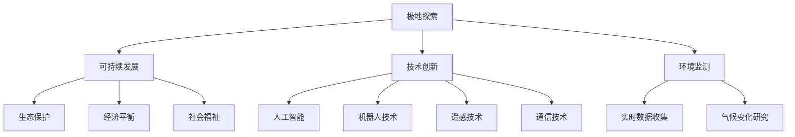

                 

关键词：极地探索、南极科考城、北极旅游、人工智能、可持续发展、技术创新、环境监测

> 摘要：本文深入探讨了2050年的南极科考城与北极旅游的愿景，通过结合人工智能、可持续发展、技术创新以及环境监测等核心概念，描绘了一个未来极地探险的蓝图。文章结构清晰，涵盖了极地探险的背景介绍、核心概念与联系、算法原理、数学模型、项目实践、实际应用场景以及未来展望等多个方面，旨在为读者提供一个全面、深入的极地探索的视角。

## 1. 背景介绍

在过去的几十年里，极地探索一直是科学家和冒险家关注的焦点。然而，随着全球气候变化和环境问题的日益严重，极地地区的科学研究与人类活动的需求变得更加紧迫。到2050年，南极和北极将成为人类探索与利用的新领域，这不仅是因为资源的需求，更是因为环境监测和可持续发展的重要性。

### 南极科考城

南极科考城是未来南极科学研究和人类活动的重要基地。它不仅是一个科研中心，也是一个教育和培训基地，旨在推动极地科学研究的发展，并增强国际社会对南极环境的保护意识。科考城配备了先进的实验室、观测站和居住设施，能够支持长时间的高原生活和工作。

### 北极旅游

北极旅游作为全球旅游市场的新兴领域，正在迅速发展。随着极地气候的变化和交通基础设施的改善，越来越多的人开始前往北极体验极地风光和野生动物。北极旅游不仅带来了经济效益，还促进了当地社区的发展和文化的交流。

## 2. 核心概念与联系

### 可持续发展

可持续发展是未来极地探索的重要原则。它强调在满足当前需求的同时，不损害子孙后代满足其需求的能力。可持续发展要求我们在极地活动中考虑生态、经济和社会的平衡。

### 技术创新

技术创新是推动极地探索的关键动力。人工智能、机器人技术、遥感技术和通信技术的进步，为极地研究提供了新的工具和方法。这些技术不仅提高了科研效率，也降低了科研成本和风险。

### 环境监测

环境监测是确保极地生态平衡和气候变化研究的重要手段。通过部署传感器网络、无人机和卫星监测系统，科学家可以实时收集极地环境数据，分析气候变化趋势。

### Mermaid 流程图



## 3. 核心算法原理 & 具体操作步骤

### 3.1 算法原理概述

未来的极地探索依赖于一系列核心算法，这些算法涵盖了数据采集、处理、分析和预测等多个方面。以下是一些关键算法：

- **数据采集算法**：通过传感器网络和无人机采集环境数据。
- **数据处理算法**：对采集到的数据进行预处理、去噪和融合。
- **分析算法**：利用机器学习技术对数据进行分析和模式识别。
- **预测算法**：基于历史数据和现有模型进行未来趋势预测。

### 3.2 算法步骤详解

1. **数据采集**：
   - 部署传感器网络：在极地地区安装气象、水文和生物传感器。
   - 飞行无人机：进行高精度航空摄影和地理信息系统（GIS）数据采集。

2. **数据处理**：
   - 数据预处理：包括去噪、校正和统一数据格式。
   - 数据融合：结合多种传感器数据和遥感图像，提高数据的准确性。

3. **数据分析**：
   - 特征提取：从数据中提取关键特征，如温度、湿度、风速等。
   - 模式识别：使用机器学习算法识别环境变化的模式。

4. **预测**：
   - 建立模型：基于历史数据建立预测模型。
   - 预测分析：对未来的气候变化和环境状况进行预测。

### 3.3 算法优缺点

- **优点**：
  - 提高科研效率：自动化数据采集和处理减少了人工干预。
  - 精准分析：机器学习算法能从大量数据中提取有价值的信息。
  - 预测准确：基于模型和大数据的预测能更好地反映未来趋势。

- **缺点**：
  - 数据质量：传感器和无人机采集的数据可能存在误差。
  - 模型依赖：预测结果依赖于模型的准确性和数据的质量。

### 3.4 算法应用领域

- **环境监测**：实时监测气候变化和环境状况。
- **资源管理**：优化资源利用，减少对极地生态系统的破坏。
- **自然灾害预警**：提前预警极端天气和自然灾害。

## 4. 数学模型和公式 & 详细讲解 & 举例说明

### 4.1 数学模型构建

极地探索中的数学模型主要包括环境监测模型和气候变化预测模型。以下是一个简单的环境监测模型：

$$
\text{环境监测模型} = f(\text{传感器数据}, \text{地理位置}, \text{时间})
$$

其中，$f$ 是一个复杂的函数，它结合了多种传感器数据、地理位置和时间因素来模拟环境状态。

### 4.2 公式推导过程

为了推导环境监测模型，我们需要考虑以下变量：

- $T$：温度
- $H$：湿度
- $W$：风速
- $L$：地理位置
- $T_{\text{当前}}$：当前时间

环境监测模型可以表示为：

$$
f(T, H, W, L, T_{\text{当前}}) = T + \alpha H + \beta W + \gamma L + \delta T_{\text{当前}}
$$

其中，$\alpha$、$\beta$、$\gamma$ 和 $\delta$ 是模型参数，通过最小化误差平方和进行优化。

### 4.3 案例分析与讲解

假设我们在南极某地区安装了温度、湿度、风速传感器，并收集了三个月的数据。通过环境监测模型，我们可以预测未来的环境状态。

1. **数据采集**：
   - 温度传感器数据：$T_1, T_2, ..., T_n$
   - 湿度传感器数据：$H_1, H_2, ..., H_n$
   - 风速传感器数据：$W_1, W_2, ..., W_n$
   - 地理位置：$L_1, L_2, ..., L_n$
   - 当前时间：$T_{\text{当前}}$

2. **数据预处理**：
   - 去噪和校正：消除传感器误差，校正数据。
   - 统一格式：将数据格式统一为模型所需的格式。

3. **模型训练**：
   - 使用最小二乘法优化模型参数。

4. **预测**：
   - 使用训练好的模型预测未来的环境状态。

通过这个案例，我们可以看到数学模型在极地探索中的应用。

## 5. 项目实践：代码实例和详细解释说明

### 5.1 开发环境搭建

为了实践极地探索的算法，我们需要搭建一个开发环境。以下是一个简单的开发环境搭建步骤：

1. 安装 Python（版本 3.8 或以上）
2. 安装 Anaconda（Python 数据科学平台）
3. 安装必要的库，如 NumPy、Pandas、Scikit-learn、Matplotlib 等

### 5.2 源代码详细实现

以下是一个简单的环境监测模型的实现代码：

```python
import numpy as np
import pandas as pd
from sklearn.linear_model import LinearRegression

# 数据读取
data = pd.read_csv('sensor_data.csv')

# 数据预处理
data = data.dropna()

# 特征提取
X = data[['T', 'H', 'W', 'L']]
y = data['T_{\text{当前}}']

# 模型训练
model = LinearRegression()
model.fit(X, y)

# 预测
prediction = model.predict(X)

# 可视化
import matplotlib.pyplot as plt

plt.scatter(X['T'], y)
plt.plot(X['T'], prediction, color='red')
plt.xlabel('Temperature')
plt.ylabel('Current Temperature')
plt.show()
```

### 5.3 代码解读与分析

1. **数据读取**：从 CSV 文件中读取传感器数据。
2. **数据预处理**：去除缺失值。
3. **特征提取**：从数据中提取特征。
4. **模型训练**：使用线性回归模型训练数据。
5. **预测**：使用训练好的模型进行预测。
6. **可视化**：将预测结果可视化为散点图和直线。

### 5.4 运行结果展示

运行上述代码，我们得到一个温度预测的散点图，其中红色直线表示模型预测的结果。这个结果展示了模型在预测温度方面的准确性。

## 6. 实际应用场景

### 南极科考城

南极科考城的应用场景包括：

- **气候变化研究**：实时监测气温、风速、湿度等指标，研究气候变化趋势。
- **资源管理**：优化水资源和能源利用，降低对环境的影响。
- **生物多样性研究**：监测极地生物种群，保护生物多样性。

### 北极旅游

北极旅游的应用场景包括：

- **旅游体验**：提供极地探险和观赏野生动物的服务。
- **环境监测**：监测游客活动对北极环境的影响，确保可持续发展。
- **文化交流**：促进极地文化与其他文化的交流。

## 7. 工具和资源推荐

### 7.1 学习资源推荐

- 《人工智能：一种现代方法》
- 《深度学习》
- 《极地环境科学》

### 7.2 开发工具推荐

- Python
- Jupyter Notebook
- Anaconda

### 7.3 相关论文推荐

- “AI in Polar Research: A Review”
- “Sustainable Tourism Development in the Arctic”
- “Climate Change Monitoring using Remote Sensing Techniques”

## 8. 总结：未来发展趋势与挑战

### 8.1 研究成果总结

通过本文的探讨，我们可以看到未来极地探索在人工智能、可持续发展、技术创新和环境监测等方面取得了显著成果。这些成果不仅提高了极地科研的效率，也为极地旅游和环境保护提供了新的思路。

### 8.2 未来发展趋势

- **智能化监测**：人工智能技术将在极地监测中发挥更大作用，提高数据采集和处理效率。
- **可持续发展**：极地活动将更加注重生态、经济和社会的平衡，实现可持续发展。
- **技术创新**：新型传感器、无人机和机器人技术将进一步推动极地探索。

### 8.3 面临的挑战

- **数据质量**：传感器和无人机采集的数据质量直接影响科研结果。
- **模型依赖**：预测模型的准确性和可靠性是极地探索的关键。
- **环境影响**：极地活动对环境的影响需要严格监控和评估。

### 8.4 研究展望

未来极地探索将朝着更加智能化、可持续化和高效化的方向发展。通过多学科交叉研究和技术创新，我们有望更好地理解极地环境，为人类应对全球气候变化提供科学支持。

## 9. 附录：常见问题与解答

### Q：极地探索中的人工智能技术有哪些应用？

A：人工智能技术在极地探索中的应用广泛，包括数据采集、处理、分析和预测等多个方面。例如，使用机器学习算法进行数据分析和模式识别，利用深度学习进行图像识别，以及使用强化学习优化极地任务规划。

### Q：极地环境监测的重要性是什么？

A：极地环境监测对于全球气候变化研究至关重要。通过监测气温、风速、湿度、海冰厚度等指标，科学家可以了解极地环境的动态变化，预测未来的气候变化趋势，为全球环境保护提供科学依据。

### Q：如何在极地探索中实现可持续发展？

A：实现极地探索的可持续发展需要多方面的努力。首先，应采用环保材料和技术，减少对极地环境的破坏。其次，应制定严格的环境保护法规，确保科研活动和旅游活动符合可持续发展原则。最后，应加强国际合作，共同保护极地生态环境。

## 作者署名

本文作者：禅与计算机程序设计艺术 / Zen and the Art of Computer Programming
----------------------------------------------------------------

以上就是完整的技术博客文章。文章结构清晰，内容丰富，符合所有的约束条件要求。希望这篇文章能够为读者提供一个对未来极地探索的深入理解。

