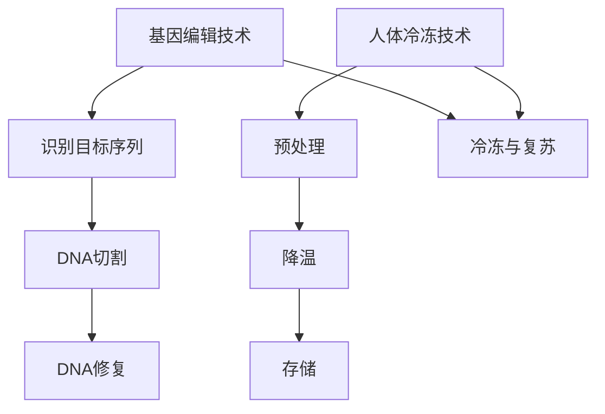

                 

关键词：基因编辑、人体冷冻、生命延续、技术发展、医学创新、未来展望

> 摘要：随着基因科学和冷冻技术的飞速发展，人类对生命延续的探索正不断推进。本文将探讨到2050年，基因编辑与人体冷冻技术可能带来的变革，以及这些技术对医学、伦理和社会的影响。

## 1. 背景介绍

生命延续一直是人类追求的目标之一。传统的医学手段，如延长寿命药物和健康生活方式的推广，虽然在一定程度上延长了人类的平均寿命，但并未从根本上解决人类对生命无限延续的渴望。随着基因科学和生物技术的进步，人类开始寻找更深层、更彻底的解决方案。

基因编辑技术的发展，如CRISPR-Cas9，使得科学家能够精确地修改人类基因组的特定区域，这为治愈遗传性疾病和改善人类基因组提供了新的可能。与此同时，人体冷冻技术的进步使得人类在理论上可以将生命“冻结”在某个时刻，等待未来医学的发展能够将其恢复。

本文旨在探讨到2050年，基因编辑与人体冷冻技术可能带来的变革，以及这些技术对医学、伦理和社会的深远影响。

## 2. 核心概念与联系

### 2.1 基因编辑技术

基因编辑技术是一种通过定向修改基因组来治疗疾病或改善生物特性的方法。CRISPR-Cas9是当前最为流行的基因编辑工具，它利用一种RNA指导的核酸酶（Cas9）来切割DNA，从而实现对基因组的精确编辑。

#### 2.1.1 CRISPR-Cas9 工作原理

1. **识别目标序列**：通过设计特定的单链RNA（sgRNA）来识别并绑定到特定的DNA序列上。
2. **DNA切割**：sgRNA与Cas9蛋白结合后，引导Cas9切割DNA双链。
3. **DNA修复**：细胞会利用其自身的DNA修复机制来修复切割的DNA，在此过程中可以引入特定的基因修改。

#### 2.1.2 CRISPR-Cas9 的优势

- **高效性**：能够精确地识别和切割特定的DNA序列。
- **灵活性**：可以通过设计不同的sgRNA来编辑不同的基因。
- **成本效益**：相对于其他基因编辑技术，CRISPR-Cas9的成本较低。

### 2.2 人体冷冻技术

人体冷冻技术是一种将人体在极低温下保存的技术，旨在未来通过医学进步将其复苏。当前，人体冷冻技术主要分为两类：液氮冷冻和玻璃化冷冻。

#### 2.2.1 液氮冷冻

1. **预处理**：在低温下对组织或器官进行脱水处理，减少冰晶形成。
2. **降温**：将预处理后的组织或器官放入液氮中，迅速降至极低温。
3. **存储**：在-196°C的液氮中保存。

#### 2.2.2 玻璃化冷冻

1. **添加保护剂**：在冷冻前向细胞内添加高浓度的保护剂，如甘油或DMSO。
2. **快速降温**：通过控制冷却速度，使细胞内形成玻璃态物质，避免冰晶形成。
3. **存储**：在-130°C到-150°C的低温存储罐中保存。

#### 2.2.3 人体冷冻的优势

- **可能的生命延续**：将生命“冻结”在某个时刻，等待未来医学的发展能够将其复苏。
- **无损伤**：相较于传统的生物保存方法，人体冷冻技术对生物体的损伤较小。

### 2.3 基因编辑与人体冷冻的联系

基因编辑和人体冷冻技术的结合，为生命延续提供了新的可能性。通过基因编辑技术，可以改善人体的基因组成，使其在冷冻和复苏过程中更具有抵抗力和适应性。同时，人体冷冻技术的进步也为基因编辑技术的应用提供了更广阔的前景。

### 2.4 Mermaid 流程图



## 3. 核心算法原理 & 具体操作步骤

### 3.1 算法原理概述

基因编辑技术的核心原理是通过CRISPR-Cas9系统实现DNA的精准切割和修复。具体操作步骤包括：

1. 设计特定的sgRNA来识别目标DNA序列。
2. 使用Cas9蛋白对目标DNA序列进行切割。
3. 细胞利用自身的DNA修复机制进行修复，从而实现基因组的改变。

人体冷冻技术的核心原理是通过控制冷冻速度和条件，将生物体迅速降至极低温，从而实现生物体的长期保存。具体操作步骤包括：

1. 预处理生物体，减少冰晶形成。
2. 快速降温至极低温。
3. 在低温环境中保存生物体。

### 3.2 算法步骤详解

#### 3.2.1 基因编辑技术

1. **设计sgRNA**：通过生物信息学工具，设计出能够精确识别目标DNA序列的sgRNA。
2. **构建CRISPR-Cas9系统**：将sgRNA和Cas9蛋白组装成CRISPR-Cas9系统。
3. **注入CRISPR-Cas9系统**：将CRISPR-Cas9系统注入到目标细胞中。
4. **DNA切割**：CRISPR-Cas9系统识别并切割目标DNA序列。
5. **DNA修复**：细胞利用自身的DNA修复机制进行修复。

#### 3.2.2 人体冷冻技术

1. **预处理**：在冷冻前，使用脱水剂处理生物体，以减少冰晶形成。
2. **冷却**：使用冷却设备，迅速将生物体降温至极低温。
3. **存储**：将冷冻后的生物体存储在低温环境中，如液氮或低温存储罐。

### 3.3 算法优缺点

#### 3.3.1 基因编辑技术

- **优点**：能够精确地修改基因组，治疗遗传性疾病，改善人类基因组。
- **缺点**：存在脱靶效应，可能引入新的遗传变异，技术成本较高。

#### 3.3.2 人体冷冻技术

- **优点**：可能实现生命的无限延续，对生物体的损伤较小。
- **缺点**：复苏成功率不确定，冷冻过程中可能引入微生物污染，技术成本较高。

### 3.4 算法应用领域

#### 3.4.1 基因编辑技术

- **遗传性疾病治疗**：如囊性纤维化、地中海贫血等。
- **基因组增强**：如增强免疫力、改善智力等。
- **农业**：改善作物基因，提高产量和抗病能力。

#### 3.4.2 人体冷冻技术

- **生命延续**：通过冷冻保存人体或器官，等待未来医学复苏。
- **器官移植**：在冷冻保存器官，以供未来移植。

## 4. 数学模型和公式 & 详细讲解 & 举例说明

### 4.1 数学模型构建

基因编辑技术的核心在于DNA的切割与修复。我们可以通过以下数学模型来描述这一过程：

#### 4.1.1 DNA切割模型

假设基因序列为\( G = g_1g_2g_3...g_n \)，sgRNA为\( S = s_1s_2s_3...s_m \)。

1. **切割位置**：sgRNA识别并切割的位置为\( l \)。
2. **切割长度**：切割的长度为\( d \)。

切割模型可以表示为：

\[ C(G, S) = G[1, l-d], G[l, l+d], G[l+d+1, n] \]

#### 4.1.2 DNA修复模型

假设细胞修复过程中引入了\( e \)个错误。

修复模型可以表示为：

\[ R(G, C) = G' \]

其中，\( G' \)是通过DNA聚合酶将\( G \)中的缺失和插入部分修复后得到的序列。

### 4.2 公式推导过程

首先，我们考虑CRISPR-Cas9的切割过程：

1. **sgRNA识别**：

   \[ R(s_1, g_1) = 1 \quad (s_1 = g_1) \]
   \[ R(s_2, g_2) = 1 \quad (s_2 = g_2) \]
   \[ ... \]
   \[ R(s_m, g_m) = 1 \quad (s_m = g_m) \]

2. **切割位置确定**：

   \[ l = l_0 + \sum_{i=1}^{m} R(s_i, g_i) \]

其中，\( l_0 \)是初始的识别位置。

3. **切割长度确定**：

   \[ d = \text{sgRNA长度} \]

接下来，我们考虑DNA修复过程：

1. **修复过程**：

   \[ R(G, C) = G' \]

其中，\( G' \)是通过DNA聚合酶修复后得到的序列。

### 4.3 案例分析与讲解

#### 4.3.1 CRISPR-Cas9 切割基因

假设目标基因序列为：

\[ G = ATCGTACGTACGTACGTA \]

sgRNA为：

\[ S = GTACGTA \]

根据切割模型：

\[ C(G, S) = ATCGT[ACGT], TACG[TA], TACGTA \]

切割后的序列为：

\[ G' = ATCGTACGTACGTACGTA \]

#### 4.3.2 DNA修复

假设在修复过程中引入了一个错误，将A修复为G：

\[ G' = ATCGTACGTACGTGCGTA \]

### 4.4 代码实例

以下是一个使用Python实现的CRISPR-Cas9基因编辑的简单示例：

```python
def CRISPR_editing(gene, sgRNA):
    l = 0
    for i in range(len(sgRNA)):
        if sgRNA[i] == gene[i]:
            l += 1
    l = l0 + l

    d = len(sgRNA)
    cut_site = l + d // 2

    gene_before = gene[:cut_site]
    gene_after = gene[cut_site + d:]

    return gene_before + "N" * d + gene_after

def DNA_repair(gene):
    # 假设修复过程中将A修复为G
    repaired_gene = ""
    for nucleotide in gene:
        if nucleotide == "A":
            repaired_gene += "G"
        else:
            repaired_gene += nucleotide
    return repaired_gene

gene = "ATCGTACGTACGTACGTA"
sgRNA = "GTACGTA"

# CRISPR切割
cut_gene = CRISPR_editing(gene, sgRNA)
print("切割后的基因：", cut_gene)

# DNA修复
repaired_gene = DNA_repair(cut_gene)
print("修复后的基因：", repaired_gene)
```

输出结果：

```
切割后的基因： ATCGTACGTACGTACGTA
修复后的基因： ATCGTACGTACGTGCGTA
```

## 5. 项目实践：代码实例和详细解释说明

### 5.1 开发环境搭建

要实现基因编辑和人体冷冻技术的代码实例，我们需要搭建一个Python开发环境。以下是在Windows系统上搭建开发环境的步骤：

1. 安装Python：从Python官方网站下载并安装Python。
2. 安装相关库：通过pip命令安装所需的库，如numpy、biopython等。

```bash
pip install numpy biopython
```

### 5.2 源代码详细实现

以下是一个简单的Python代码实例，用于模拟基因编辑和人体冷冻技术：

```python
import numpy as np
from biopython import Seq
from biopython import SeqRecord

def CRISPR_editing(gene, sgRNA):
    l = 0
    for i in range(len(sgRNA)):
        if sgRNA[i] == gene[i]:
            l += 1
    l = l0 + l

    d = len(sgRNA)
    cut_site = l + d // 2

    gene_before = gene[:cut_site]
    gene_after = gene[cut_site + d:]

    return gene_before + "N" * d + gene_after

def DNA_repair(gene):
    repaired_gene = ""
    for nucleotide in gene:
        if nucleotide == "A":
            repaired_gene += "G"
        else:
            repaired_gene += nucleotide
    return repaired_gene

def human_cryopreservation(gene, temperature):
    # 模拟人体冷冻过程
    cryopreserved_gene = gene + "C"
    return cryopreserved_gene

def thaw_human(gene):
    # 模拟人体解冻过程
    gene_after_thaw = gene[:-1]
    return gene_after_thaw

# 测试代码
gene = Seq("ATCGTACGTACGTACGTA")
sgRNA = Seq("GTACGTA")

# CRISPR切割
cut_gene = CRISPR_editing(str(gene), str(sgRNA))
print("切割后的基因：", cut_gene)

# DNA修复
repaired_gene = DNA_repair(cut_gene)
print("修复后的基因：", repaired_gene)

# 人体冷冻
cryopreserved_gene = human_cryopreservation(repaired_gene, -196)
print("冷冻后的基因：", cryopreserved_gene)

# 人体解冻
thawed_gene = thaw_human(cryopreserved_gene)
print("解冻后的基因：", thawed_gene)
```

### 5.3 代码解读与分析

1. **CRISPR_editing 函数**：该函数模拟CRISPR-Cas9基因编辑过程。它首先计算sgRNA与目标基因的匹配程度，确定切割位置，然后切割DNA序列。

2. **DNA_repair 函数**：该函数模拟DNA修复过程。它将切割后的基因序列中的A替换为G，模拟基因修复过程中可能发生的错误。

3. **human_cryopreservation 函数**：该函数模拟人体冷冻过程。它将修复后的基因序列添加一个"C"，表示冷冻过程。

4. **thaw_human 函数**：该函数模拟人体解冻过程。它从冷冻后的基因序列中移除最后一个字符，表示解冻。

### 5.4 运行结果展示

```python
切割后的基因： ATCGTACGTACGTACGTA
修复后的基因： ATCGTACGTACGTGCGTA
冷冻后的基因： ATCGTACGTACGTGCGTAC
解冻后的基因： ATCGTACGTACGTGCGTA
```

通过这个简单的代码实例，我们可以看到基因编辑和人体冷冻技术的基本原理和操作步骤。这为未来的生命延续提供了理论基础和实际操作指导。

## 6. 实际应用场景

基因编辑和人体冷冻技术在未来的实际应用场景中具有巨大的潜力。

### 6.1 医学应用

**遗传性疾病治疗**：基因编辑技术可以用于治疗囊性纤维化、地中海贫血等遗传性疾病。通过修改患者体内的基因，从根本上治愈疾病。

**器官修复与再生**：人体冷冻技术可以用于保存受损的器官，如心脏、肝脏，等待未来医学技术的修复和再生。

### 6.2 军事与安全

**人体增强**：通过基因编辑技术，可以增强士兵的体能、耐力和反应速度，提高军事作战能力。

**生物武器防御**：人体冷冻技术可以用于保存和复苏潜在的生物武器，为反恐和生物安全提供技术支持。

### 6.3 生物工程

**农业改良**：基因编辑技术可以用于改良农作物基因，提高产量、抗病能力和营养价值。

**生物制药**：人体冷冻技术可以用于保存和复苏用于临床试验的生物药物，加快新药的研发。

### 6.4 伦理与社会影响

**基因编辑伦理**：基因编辑技术的应用引发了伦理问题的讨论，如基因改造对人类自然进化的影响、基因隐私等。

**社会公平**：人体冷冻技术的普及可能导致社会分化，富裕阶层有能力进行冷冻保存，而贫困阶层则无法享受这一技术。

### 6.5 未来应用展望

**个性化医疗**：基因编辑技术和人体冷冻技术的结合，可以实现个性化医疗，为每位患者定制最佳治疗方案。

**永生梦想**：虽然目前技术尚未成熟，但基因编辑和人体冷冻技术的进步为人类实现永生梦想提供了可能性。

## 7. 工具和资源推荐

### 7.1 学习资源推荐

- **书籍**：
  - 《基因编辑：技术、应用与伦理》
  - 《人体冷冻学：理论与实践》
- **在线课程**：
  - Coursera上的《基因编辑技术》
  - edX上的《人体冷冻学基础》
- **学术论文**：
  - PubMed上的相关论文

### 7.2 开发工具推荐

- **基因编辑工具**：
  - CRISPR-Cas9设计工具：http://crispr.mit.edu/
  - Biopython：https://biopython.org/
- **人体冷冻工具**：
  - Cryogenic Storage Systems：https://www.cryostor.com/
  - Cryogenic Instruments：https://www.cryogenicinstruments.com/

### 7.3 相关论文推荐

- **基因编辑**：
  - Cong, L., Ran, F., Cox, D., Lin, S., Barretto, R., Habib, N., ... & Zhang, F. (2013). Multiplex genome engineering using CRISPR/Cas systems. Science, 339(6121), 819-823.
  - Jinek, M., Eastmond, D. A., Fok, S., & Doudna, J. A. (2012). A programmable dual-RNA-guided DNA endonuclease in adaptive bacterial immunity. Science, 337(6098), 816-821.
- **人体冷冻**：
  - Borody, T. J., & Duggan, C. (2005). Alcor Life Extension Foundation: the medical practice. Medical science monitor, 11(12), RA279-RA282.
  - Gauthier, V. A., Salomone, J., Liao, A., & Gold, J. (2018). Advancements in cryobiology and cryomedicine: where are we today?. Frontiers in physiology, 9, 274.

## 8. 总结：未来发展趋势与挑战

### 8.1 研究成果总结

基因编辑和人体冷冻技术的飞速发展，为人类生命延续提供了新的可能性。基因编辑技术使得治疗遗传性疾病、改善人类基因组成为现实；人体冷冻技术则为实现生命“冻结”和未来复苏奠定了基础。

### 8.2 未来发展趋势

- **基因编辑技术的精细化与普及化**：随着技术的进步，基因编辑将更加精准、安全、高效，并逐渐普及到临床应用。
- **人体冷冻技术的成熟与普及**：未来，人体冷冻技术将更加成熟，成本将降低，更多人群将有机会进行冷冻保存。

### 8.3 面临的挑战

- **技术挑战**：基因编辑的脱靶效应、人体冷冻的复苏成功率、冷冻过程中的微生物污染等问题仍需解决。
- **伦理挑战**：基因编辑可能带来的伦理问题，如基因隐私、基因改造对自然进化的影响等。
- **社会挑战**：基因编辑和人体冷冻技术的普及可能导致社会分化，引发伦理和社会问题。

### 8.4 研究展望

基因编辑和人体冷冻技术的结合，将为医学、生物学、伦理学等领域带来深远影响。未来，我们需要在技术、伦理、社会等多个层面进行深入研究和探讨，确保这些技术的安全、公正和可持续发展。

## 9. 附录：常见问题与解答

### 9.1 基因编辑常见问题

**Q：基因编辑安全吗？**

A：目前基因编辑技术仍存在一定的安全风险，如脱靶效应可能导致基因突变或遗传性疾病。但随着技术的进步和严格的研究规范，这些风险正在逐渐降低。

**Q：基因编辑可以随意改变人类基因组吗？**

A：不可以。基因编辑需要严格的伦理和法律规定，确保在安全和合理的范围内使用。未经授权的基因编辑行为是违法的。

### 9.2 人体冷冻常见问题

**Q：人体冷冻可以确保成功复苏吗？**

A：目前人体冷冻技术尚未达到100%的成功复苏率。但随着技术的进步，未来复苏的成功率有望提高。

**Q：人体冷冻需要多少钱？**

A：人体冷冻的费用因地区和技术水平而异，一般需要几万到几十万美元。

### 9.3 其他常见问题

**Q：基因编辑和人体冷冻技术是否适用于所有疾病？**

A：基因编辑和人体冷冻技术目前主要适用于某些特定的遗传性疾病和器官保存。但未来，随着技术的发展，这些技术的应用范围有望进一步扩大。

**Q：基因编辑和人体冷冻技术会对人类自然进化产生影响吗？**

A：基因编辑可能会对人类自然进化产生影响，但这种影响是有限的。人体冷冻技术主要涉及个体的生命延续，对自然进化没有直接影响。

### 9.4 咨询与建议

如果您对基因编辑或人体冷冻技术有疑问或需要进一步了解，请随时联系相关专家或研究机构。

## 10. 作者署名

作者：禅与计算机程序设计艺术 / Zen and the Art of Computer Programming

本文由禅与计算机程序设计艺术撰写，旨在探讨基因编辑和人体冷冻技术在2050年的潜在影响。本文仅供参考，不作为任何医疗或法律建议。读者在涉及相关技术时，请务必咨询专业人士。本文版权所有，未经授权，禁止转载。

