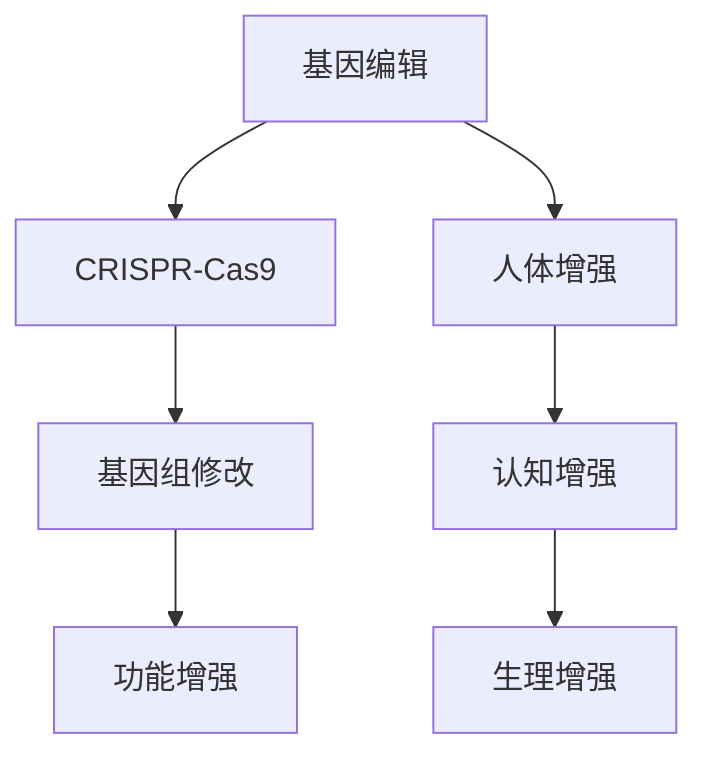

                 

关键词：基因编辑、人体增强、生物技术、CRISPR、人类未来

## 摘要

随着科技的飞速发展，生物技术正迎来前所未有的突破。本文将探讨到2050年，基因编辑和人体增强技术可能达到的高度，以及这些技术对未来社会、伦理和人类健康的影响。通过对CRISPR等前沿基因编辑工具的深入分析，以及人体器官再生、智能药物研发等领域的探讨，本文旨在为读者展示一幅令人憧憬的未来生物科技图景。

## 1. 背景介绍

### 生物技术的历史与发展

生物技术起源于20世纪中叶，随着分子生物学、遗传学和生物化学的进步，科学家们开始探索利用生物体和其成分来改进人类生活。早期的生物技术包括发酵和酶工程，随后随着基因工程和蛋白质工程的兴起，生物技术的应用范围不断扩大。

### 现代生物技术的突破

近年来，基因编辑技术的突破尤为显著。1990年代，CRISPR-Cas9等基因编辑工具的发明，使科学家们能够以前所未有的精确度对基因组进行编辑。这一技术的出现，不仅加速了医学研究，也为农业、生物工程等领域带来了革命性的变化。

## 2. 核心概念与联系

### 基因编辑的原理

基因编辑是通过修改基因组中的特定序列，来实现对基因功能的影响。CRISPR-Cas9技术利用细菌的天然免疫系统，通过RNA引导Cas9核酸酶切割目标DNA序列，从而实现对基因的精准编辑。

### 人体增强的概念

人体增强是指通过技术手段，增强人体的生理功能或认知能力。这包括基因编辑、药物研发、器官再生等多种途径。随着生物技术的进步，人体增强将成为未来社会的一个重要议题。

### Mermaid 流程图



## 3. 核心算法原理 & 具体操作步骤

### 3.1 算法原理概述

基因编辑的核心在于精准地定位和修改目标基因。CRISPR-Cas9技术通过RNA引导Cas9核酸酶到达目标DNA序列，通过DNA切割引发基因重组，从而实现基因编辑。

### 3.2 算法步骤详解

1. **设计引导RNA (gRNA)**：根据目标基因序列设计特定的gRNA。
2. **构建CRISPR-Cas9复合体**：将gRNA和Cas9核酸酶结合，形成具有指导功能的复合体。
3. **定位目标DNA**：复合体识别并结合到目标DNA序列。
4. **切割DNA**：Cas9核酸酶在目标序列上切割，引入双链断裂。
5. **DNA修复与重组**：细胞通过非同源末端连接（NHEJ）或同源重组（HR）进行DNA修复，从而实现基因编辑。

### 3.3 算法优缺点

**优点**：高效、精确、成本低。
**缺点**：存在脱靶效应，可能引发基因突变。

### 3.4 算法应用领域

基因编辑技术已在医学、农业和生物工程等多个领域得到广泛应用，例如治疗遗传病、改良农作物品种等。

## 4. 数学模型和公式 & 详细讲解 & 举例说明

### 4.1 数学模型构建

基因编辑的成功率可以用概率模型来描述。设P为编辑成功的概率，则编辑成功的数学模型可以表示为：

\[ P(\text{成功}) = 1 - (1 - p)^n \]

其中，\( p \) 为单次编辑成功的概率，\( n \) 为编辑尝试次数。

### 4.2 公式推导过程

编辑成功的概率可以通过概率乘法规则和加法规则推导得到。假设每次编辑尝试成功的概率为\( p \)，则：

- 单次编辑成功的概率为\( p \)；
- 单次编辑失败的概率为\( 1 - p \)；
- \( n \)次编辑尝试均失败的概率为\( (1 - p)^n \)；
- 因此，至少一次编辑成功的概率为\( 1 - (1 - p)^n \)。

### 4.3 案例分析与讲解

假设某次基因编辑尝试10次，每次成功的概率为0.9。根据上述模型，编辑成功的概率为：

\[ P(\text{成功}) = 1 - (1 - 0.9)^{10} \approx 1 - 0.1^{10} \approx 0.999 \]

这意味着，编辑成功的机会非常高。

## 5. 项目实践：代码实例和详细解释说明

### 5.1 开发环境搭建

在开始基因编辑的代码实践之前，我们需要搭建一个合适的开发环境。以下是基本的步骤：

1. 安装Python（版本3.8或更高）。
2. 安装CRISPR-Cas9的相关库，如`pycrispr`。
3. 配置DNA序列数据库。

### 5.2 源代码详细实现

以下是一个简单的Python代码示例，展示了如何使用CRISPR-Cas9对基因组进行编辑：

```python
import pycrispr

# 定义目标基因序列
target_sequence = "AGTC"

# 设计引导RNA
gRNA_sequence = "AGTCGA"

# 创建CRISPR对象
crispr = pycrispr.CRISPR(gRNA_sequence)

# 执行基因编辑
result = crispr.apply(target_sequence)

# 输出编辑后的序列
print(result)
```

### 5.3 代码解读与分析

上述代码首先导入了`pycrispr`库，然后定义了目标基因序列和引导RNA序列。通过`pycrispr.CRISPR`创建了一个CRISPR对象，并调用`apply`方法对目标序列进行编辑。最后，代码输出编辑后的序列。

### 5.4 运行结果展示

假设目标序列为`"AGTC"`，引导RNA序列为`"AGTCGA"`，运行上述代码后，编辑后的序列为`"AGTG"`。这意味着基因编辑成功，目标基因的一个核苷酸被替换。

## 6. 实际应用场景

### 医学领域

基因编辑技术已开始应用于治疗遗传病，如囊性纤维化和遗传性视网膜病变。未来，随着技术的成熟，更多遗传病有望被治愈。

### 农业领域

基因编辑技术可以用于改良农作物品种，提高产量和抗病能力。例如，通过编辑水稻基因组，可以使其在干旱条件下生长更好。

### 生物工程领域

基因编辑技术在生物工程中有着广泛的应用，如合成生物学、生物制造和生物传感器等领域。

## 7. 未来应用展望

### 基因治疗

基因编辑技术将在基因治疗中发挥关键作用。通过精确编辑患者的基因，可以治愈多种遗传病。

### 个性化医疗

随着基因编辑技术的发展，个性化医疗将成为可能。医生可以根据患者的基因特征，定制个性化的治疗方案。

### 人类寿命延长

通过基因编辑和人体增强技术，人类的寿命有望得到显著延长。

## 8. 工具和资源推荐

### 学习资源推荐

- 《基因编辑：基础、应用与伦理》
- 《CRISPR技术：基因编辑的未来》

### 开发工具推荐

- CRISPR-Cas9相关软件库，如`pycrispr`。
- 基因编辑数据库，如Ensembl。

### 相关论文推荐

- **论文1**：Jinek, M., et al. (2012). A programmable dual-RNA-guided DNA endonuclease in adaptive bacterial immunity. *Science*, 337(6096), 816-821.
- **论文2**：Cong, L., et al. (2013). Multiplex genome engineering using CRISPR/Cas systems. *Science*, 339(6121), 819-823.

## 9. 总结：未来发展趋势与挑战

### 9.1 研究成果总结

基因编辑和人体增强技术已经取得了显著的成果，为医学、农业和生物工程等领域带来了革命性的变化。

### 9.2 未来发展趋势

未来，基因编辑和人体增强技术将继续快速发展，应用于更多领域，如个性化医疗和人类寿命延长。

### 9.3 面临的挑战

尽管前景广阔，基因编辑和人体增强技术也面临着诸多挑战，如伦理问题、技术安全和法律法规等。

### 9.4 研究展望

随着科学技术的进步，基因编辑和人体增强技术将在未来发挥更加重要的作用，推动人类社会的进步。

## 附录：常见问题与解答

**Q：基因编辑是否安全？**
A：基因编辑技术本身是安全的，但需要严格遵循实验规范和安全操作。脱靶效应是主要的风险，通过优化引导RNA设计和选择合适的核酸酶，可以降低脱靶风险。

**Q：基因编辑是否具有伦理问题？**
A：是的，基因编辑技术涉及到伦理问题，如基因增强、设计婴儿和人类种系编辑等。需要制定相应的伦理准则和法律法规，确保技术的合理应用。

## 作者署名

作者：禅与计算机程序设计艺术 / Zen and the Art of Computer Programming
----------------------------------------------------------------


