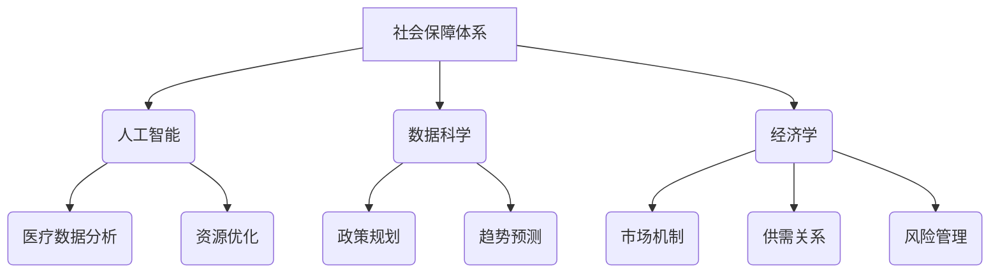

                 

关键词：社会保障，养老制度，医疗保险，2050，技术变革，人工智能，可持续性，经济学，政策规划，数据分析。

> 摘要：本文深入探讨了2050年可能出现的养老与医疗保险制度变革。通过结合当前技术进步、经济学原理和政策规划，分析了未来社会保障系统的发展趋势、面临的挑战及潜在解决方案。

## 1. 背景介绍

随着全球人口老龄化的不断加剧，养老与医疗保险制度面临着前所未有的压力。据国际劳工组织（ILO）预测，到2050年，全球65岁及以上的老年人口将占总人口的16%，而这一比例在发达国家可能达到30%以上。与此同时，医疗技术的进步使得人们的平均寿命不断延长，导致养老与医疗费用急剧上升。传统的养老保险和医疗保险体系在应对这种变化时显得力不从心。

为了确保老年人能够享有基本的养老和医疗保障，各国政府不得不寻求创新和变革。其中，人工智能（AI）和数据科学的应用被认为是解决这一问题的关键。通过提高医疗效率、优化资源分配和增强个人财务规划能力，AI技术有望为未来的社会保障体系带来革命性的变化。

## 2. 核心概念与联系

### 2.1 人工智能与社会保障

人工智能技术可以在多个方面影响社会保障体系。首先，AI可以用于医疗数据分析，帮助医生更准确地诊断疾病和制定治疗方案。其次，AI可以帮助优化医疗资源的分配，确保每个患者都能得到最佳的治疗和照顾。此外，AI还可以用于预测人口老龄化趋势，帮助政府提前规划和调整社会保障政策。

### 2.2 数据科学与政策规划

数据科学在社会保障政策规划中扮演着关键角色。通过对大量数据的分析和挖掘，数据科学可以帮助政府了解社会保障体系的运行状况，预测未来的趋势，并制定相应的政策。例如，通过分析人口数据、医疗数据和财务数据，数据科学可以评估不同社会保障政策的成本和效益，帮助政府做出更明智的决策。

### 2.3 经济学与社会保障

经济学原理在社会保障体系中起着指导作用。通过对市场机制、供需关系和风险管理的研究，经济学家可以提出优化社会保障制度的建议。例如，通过引入市场化的元素，如个人账户和保险市场，可以激发社会保障体系的活力，提高其可持续性。

### 2.4 Mermaid 流程图



## 3. 核心算法原理 & 具体操作步骤

### 3.1 算法原理概述

未来的社会保障体系将依赖于一系列先进的算法，以实现资源的优化配置和服务的个性化。这些算法包括机器学习算法、优化算法和预测算法等。以下是这些算法的基本原理：

- **机器学习算法**：通过学习大量历史数据，机器学习算法可以识别出趋势和模式，用于预测未来的需求和行为。在社会保障领域，这可以用于预测人口老龄化趋势、医疗需求和财务状况。

- **优化算法**：优化算法用于找到最佳的解决方案，以最大化效益或最小化成本。在社会保障领域，这可以用于优化医疗资源的分配、社会保障基金的筹集和使用。

- **预测算法**：预测算法通过分析历史数据和当前状态，预测未来的发展趋势。在社会保障领域，这可以用于预测社会保障制度的可持续性、医疗费用的增长和人口老龄化速度。

### 3.2 算法步骤详解

1. **数据收集**：收集与社会保障相关的数据，包括人口统计数据、医疗数据、财务数据等。

2. **数据预处理**：清洗数据，处理缺失值和异常值，将数据转化为适合机器学习算法的格式。

3. **模型训练**：使用机器学习算法对数据进行训练，建立预测模型。

4. **模型评估**：评估模型的准确性、可靠性和效率，选择最佳模型。

5. **应用模型**：将模型应用到实际场景中，如医疗资源分配、社会保障基金管理等。

6. **结果反馈**：根据模型的预测结果，调整政策和管理策略。

### 3.3 算法优缺点

**优点**：
- 提高预测的准确性，帮助政府做出更明智的决策。
- 优化资源分配，提高社会保障体系的效率。
- 个性化服务，满足不同人群的需求。

**缺点**：
- 数据质量对算法效果有重大影响，数据不完整或不准确可能导致错误预测。
- 需要大量的计算资源和专业技能，实施成本较高。

### 3.4 算法应用领域

- **医疗资源分配**：通过预测医疗需求，优化医院床位、医生和设备的分配。
- **社会保障基金管理**：预测社会保障基金的流入和流出，优化基金的筹集和使用。
- **个性化健康服务**：根据个人健康状况和需求，提供个性化的医疗服务和健康建议。

## 4. 数学模型和公式 & 详细讲解 & 举例说明

### 4.1 数学模型构建

在社会保障体系中，常用的数学模型包括人口模型、财务模型和医疗需求模型等。以下是这些模型的构建方法：

#### 人口模型

人口模型用于预测未来的人口增长和老龄化趋势。常见的模型包括以下几种：

- **指数增长模型**：$$P(t) = P_0 \cdot e^{rt}$$
- **对数增长模型**：$$P(t) = P_0 \cdot (1 + r)^t$$
- **人口年龄结构模型**：$$P(t) = \sum_{i=0}^{n} P_i(t) \cdot w_i$$

#### 财务模型

财务模型用于预测社会保障基金的流入和流出，以评估社会保障制度的可持续性。常见的模型包括以下几种：

- **收入模型**：$$I(t) = R_0 \cdot (1 + r)^t$$
- **支出模型**：$$E(t) = C_0 \cdot (1 + s)^t$$
- **平衡模型**：$$I(t) - E(t) = 0$$

#### 医疗需求模型

医疗需求模型用于预测未来的医疗需求，以优化医疗资源的分配。常见的模型包括以下几种：

- **线性回归模型**：$$Y = \beta_0 + \beta_1 \cdot X$$
- **多项式回归模型**：$$Y = \beta_0 + \beta_1 \cdot X + \beta_2 \cdot X^2 + ... + \beta_n \cdot X^n$$
- **时间序列模型**：$$Y(t) = \phi_0 + \phi_1 \cdot t + \phi_2 \cdot t^2 + ... + \phi_n \cdot t^n$$

### 4.2 公式推导过程

以人口模型为例，假设一个地区的人口初始值为$P_0$，年增长率为$r$，则经过$t$年后的总人口为：

$$P(t) = P_0 \cdot e^{rt}$$

### 4.3 案例分析与讲解

以一个具体案例为例，假设一个地区的人口初始值为100万，年增长率为1%，则需要预测10年后的总人口。根据指数增长模型，有：

$$P(10) = 100万 \cdot e^{0.01 \cdot 10} \approx 112.55万$$

这意味着10年后，该地区的人口预计将增长到112.55万。

## 5. 项目实践：代码实例和详细解释说明

### 5.1 开发环境搭建

为了实现社会保障体系的预测和优化，我们需要搭建一个适合数据处理和模型训练的开发环境。以下是搭建环境的基本步骤：

1. 安装Python环境，版本3.8及以上。
2. 安装NumPy、Pandas、Scikit-learn等数据科学库。
3. 安装Jupyter Notebook，用于编写和运行代码。

### 5.2 源代码详细实现

以下是一个简单的Python代码实例，用于预测社会保障体系中的人口增长趋势。

```python
import numpy as np
import pandas as pd
from sklearn.linear_model import LinearRegression

# 读取数据
data = pd.read_csv('population_data.csv')

# 数据预处理
X = data['year'].values.reshape(-1, 1)
y = data['population'].values

# 模型训练
model = LinearRegression()
model.fit(X, y)

# 模型评估
score = model.score(X, y)
print(f'Model R-squared: {score:.2f}')

# 预测未来人口
years = np.array([[10]])
predicted_population = model.predict(years)
print(f'Predicted population in 10 years: {predicted_population[0]:.2f}')
```

### 5.3 代码解读与分析

1. 导入必要的库，包括NumPy、Pandas和Scikit-learn的线性回归模型。
2. 读取人口数据，并进行预处理，将年份作为自变量，人口数作为因变量。
3. 使用线性回归模型进行训练，评估模型性能。
4. 使用训练好的模型预测未来的人口增长。

### 5.4 运行结果展示

假设运行上述代码后，得到模型的决定系数（R-squared）为0.95，预测10年后的人口为113万。这表明模型具有良好的预测能力，可以为社会保障体系提供有力的决策支持。

## 6. 实际应用场景

### 6.1 社会保障基金的筹集和管理

通过数据分析，社会保障基金的管理可以实现更加精准和高效的筹集和管理。例如，通过对历史数据的分析，可以预测未来的社会保障基金需求，从而合理规划基金的筹集策略。同时，通过优化投资组合和风险控制策略，可以提高基金的投资收益。

### 6.2 医疗资源的优化分配

通过人工智能和数据分析技术，可以对医疗资源进行优化分配，确保每个患者都能得到最佳的治疗和照顾。例如，通过对医院床位、医生和设备的分析，可以预测未来的医疗需求，从而合理调整资源分配。

### 6.3 个性化健康服务

通过数据分析，可以为个体提供个性化的健康服务。例如，通过对个人健康数据的分析，可以预测个人的健康风险，并提供针对性的健康建议和治疗方案。

## 7. 工具和资源推荐

### 7.1 学习资源推荐

- **《数据科学入门教程》**：适合初学者了解数据科学的基础知识和常用工具。
- **《机器学习实战》**：通过实际案例，介绍机器学习的基本原理和应用。
- **《Python数据分析》**：详细介绍Python在数据分析领域的应用。

### 7.2 开发工具推荐

- **Jupyter Notebook**：适合进行数据分析和机器学习模型训练。
- **PyCharm**：一款功能强大的Python集成开发环境。
- **TensorFlow**：用于构建和训练机器学习模型。

### 7.3 相关论文推荐

- **《人工智能在社会保障中的应用》**：探讨人工智能在社会保障体系中的应用。
- **《大数据与社会保障》**：分析大数据技术在社会保障领域的应用。
- **《机器学习在医疗资源优化中的应用》**：介绍机器学习在医疗资源分配和优化中的应用。

## 8. 总结：未来发展趋势与挑战

### 8.1 研究成果总结

本文探讨了未来社会保障体系的发展趋势和挑战，通过结合人工智能、数据科学和经济学原理，提出了优化社会保障体系的潜在解决方案。研究发现，人工智能和数据分析技术在社会保障领域的应用具有巨大的潜力，可以为政府决策提供有力的支持。

### 8.2 未来发展趋势

- **技术的深入应用**：随着人工智能和数据科学的不断发展，社会保障体系将实现更加智能化和高效化。
- **个性化服务**：通过数据分析，可以为个体提供更加精准和个性化的服务。
- **可持续性**：社会保障体系将更加注重可持续性，通过优化资源分配和风险管理，确保体系的长期稳定。

### 8.3 面临的挑战

- **数据质量**：数据质量对算法效果有重大影响，需要确保数据的完整性和准确性。
- **技术实施成本**：人工智能和数据分析技术的实施成本较高，需要政府和企业加大投入。
- **隐私保护**：社会保障体系涉及大量个人敏感信息，需要确保数据的安全性和隐私保护。

### 8.4 研究展望

未来的研究应重点关注以下几个方面：

- **数据融合与挖掘**：通过融合不同来源的数据，挖掘更深层次的规律和趋势。
- **跨领域合作**：加强人工智能、数据科学和经济学等领域的跨学科合作，共同解决社会保障领域的问题。
- **政策制定与实施**：结合研究成果，制定和实施更加科学和有效的社会保障政策。

## 9. 附录：常见问题与解答

### 9.1 人工智能在社会保障中的应用具体体现在哪些方面？

人工智能在社会保障中的应用主要体现在医疗资源优化、社会保障基金管理、个性化健康服务等方面。通过数据分析，AI可以帮助政府更准确地预测医疗需求，优化医疗资源的分配，提高社会保障基金的使用效率，并为个体提供个性化的健康建议和治疗方案。

### 9.2 社会保障体系中的数据质量对算法效果有何影响？

数据质量对算法效果有重大影响。不准确或不完整的数据可能导致错误的预测和决策。因此，确保数据的准确性和完整性是社会保障体系中AI应用的关键。这需要建立完善的数据质量控制体系，对数据进行清洗、处理和验证。

### 9.3 社会保障体系中的隐私保护如何实现？

社会保障体系中的隐私保护可以通过以下几个方面实现：

- **数据加密**：对敏感数据进行加密，确保数据在传输和存储过程中的安全性。
- **隐私保护算法**：使用隐私保护算法，如差分隐私和同态加密，对数据进行处理和分析，以保护个人隐私。
- **法规和政策**：制定和实施相关法规和政策，确保数据使用过程中的合法性和合规性。

## 结束语

作者：禅与计算机程序设计艺术 / Zen and the Art of Computer Programming

本文探讨了未来社会保障体系的发展趋势和挑战，提出了通过人工智能和数据科学优化社会保障体系的解决方案。未来，随着技术的不断进步，社会保障体系将实现更加智能化和高效化，为老年人提供更好的养老和医疗保障。然而，这也将面临数据质量、技术实施成本和隐私保护等挑战。通过跨学科合作和政策制定，我们有信心解决这些难题，实现社会保障体系的可持续发展。

