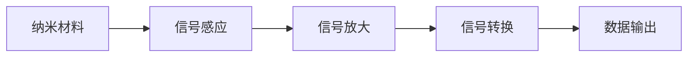
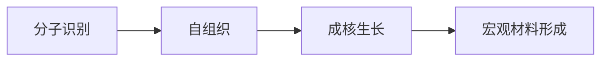

                 

关键词：纳米技术，传感器，自组装材料，未来展望，人工智能

摘要：随着科技的不断进步，纳米技术已经成为推动社会发展的关键驱动力。本文将探讨2050年的纳米技术发展，尤其是纳米传感器和自组装材料的应用，以及这些技术对未来社会的影响。

## 1. 背景介绍

纳米技术，是指研究和应用在纳米尺度（1到100纳米）的科学技术。在这个尺度上，物质的物理、化学和生物学性质会发生显著变化，这使得纳米技术能够创造出前所未有的材料、器件和系统。近年来，纳米技术在材料科学、生物医学、电子学、能源等领域取得了重大突破。

传感器是能够感知外部信号并转化为电信号的装置。随着纳米技术的不断发展，纳米传感器在尺寸、灵敏度、响应速度等方面得到了极大的提升。自组装材料则是指通过分子间的相互作用，无需外部干预，自行形成具有特定结构和功能的材料的科学技术。

## 2. 核心概念与联系

### 2.1 纳米传感器原理

纳米传感器的工作原理通常基于纳米材料的独特性质，如量子效应、表面效应、小尺寸效应等。这些传感器能够感知各种物理量，如温度、压力、化学物质浓度等。以下是一个简化的Mermaid流程图，展示了纳米传感器的基本架构：



### 2.2 自组装材料原理

自组装材料是指通过分子间的相互作用，自行形成具有特定结构和功能的材料的科学技术。自组装过程通常包括以下几个步骤：

1. 分子识别：分子间的特定相互作用使得它们能够识别并聚集在一起。
2. 自组织：分子在空间上按照一定的规则排列，形成有序结构。
3. 成核生长：在特定条件下，有序结构的分子开始成核并生长，形成宏观材料。

以下是一个简化的Mermaid流程图，展示了自组装材料的基本架构：



## 3. 核心算法原理 & 具体操作步骤

### 3.1 算法原理概述

纳米传感器和自组装材料的研发涉及多个领域的技术，包括材料科学、微电子学、生物信息学等。核心算法原理通常包括以下几个方面：

1. 纳米材料设计：通过模拟和实验，设计具有特定性质（如高灵敏度、高稳定性）的纳米材料。
2. 传感器阵列布局：设计传感器阵列，使得每个传感器能够独立工作，同时又能够协同工作，提高系统的整体性能。
3. 数据处理算法：对传感器采集的数据进行处理，提取有用的信息。

### 3.2 算法步骤详解

1. **纳米材料设计**：

   - **量子点传感器**：通过量子点的量子效应，实现高灵敏度检测。设计步骤包括选择合适的材料、确定量子点尺寸、优化量子点表面修饰。

   - **纳米酶传感器**：利用纳米酶的催化活性，实现生物分子的高效检测。设计步骤包括选择合适的纳米酶、优化酶与纳米材料的结合方式。

2. **传感器阵列布局**：

   - **二维阵列**：通过二维平面布局，实现传感器的分布。设计步骤包括确定传感器间距、确定传感器阵列尺寸。

   - **三维阵列**：通过三维立体布局，提高传感器的空间利用率。设计步骤包括确定传感器间距、确定传感器阵列尺寸、优化传感器分布。

3. **数据处理算法**：

   - **信号处理**：对传感器采集的信号进行预处理，包括滤波、放大、去噪等。

   - **特征提取**：从预处理后的信号中提取有用的特征，如峰值、频谱等。

   - **模式识别**：利用机器学习算法，对特征进行分类和识别。

### 3.3 算法优缺点

1. **优点**：

   - **高灵敏度**：纳米传感器能够检测到极微弱的信号，实现高精度测量。
   - **多功能性**：自组装材料能够通过分子间的相互作用，实现多种功能。
   - **灵活性**：纳米技术和自组装材料的设计具有很高的灵活性，可以满足各种应用需求。

2. **缺点**：

   - **稳定性问题**：纳米材料和传感器在长期使用过程中可能会出现性能下降的问题。
   - **成本问题**：纳米技术和自组装材料的研发和制造成本较高，限制了其大规模应用。

### 3.4 算法应用领域

1. **生物医学**：纳米传感器和自组装材料在生物医学领域有广泛的应用，如疾病诊断、药物输送、基因编辑等。
2. **环境监测**：纳米传感器可以用于环境监测，如水质、空气质量、土壤污染等。
3. **能源**：纳米传感器和自组装材料可以用于能源领域，如太阳能电池、储能材料等。

## 4. 数学模型和公式 & 详细讲解 & 举例说明

### 4.1 数学模型构建

纳米传感器和自组装材料的数学模型通常涉及以下几个方面：

1. **纳米材料性质**：

   - **量子点尺寸分布**：描述量子点尺寸的分布情况。

     $$ f(r) = \frac{4\pi r^2}{3} \cdot n(r) $$

     其中，$r$ 表示量子点半径，$n(r)$ 表示量子点密度。

   - **表面修饰效应**：描述纳米材料表面修饰对传感器性能的影响。

     $$ \Delta P = k_B T \cdot \ln \left( \frac{n_0}{n_s} \right) $$

     其中，$\Delta P$ 表示表面修饰引起的压强差，$k_B$ 表示玻尔兹曼常数，$T$ 表示温度，$n_0$ 表示未修饰的纳米材料密度，$n_s$ 表示修饰后的纳米材料密度。

2. **传感器阵列布局**：

   - **二维阵列布局**：描述二维阵列中传感器之间的距离。

     $$ d = \frac{L}{\sqrt{N}} $$

     其中，$d$ 表示传感器之间的距离，$L$ 表示阵列长度，$N$ 表示传感器数量。

   - **三维阵列布局**：描述三维阵列中传感器之间的距离。

     $$ d = \frac{V}{\sqrt[3]{N}} $$

     其中，$d$ 表示传感器之间的距离，$V$ 表示阵列体积，$N$ 表示传感器数量。

3. **数据处理算法**：

   - **信号处理**：描述信号处理过程中的滤波、放大、去噪等步骤。

     $$ y = \frac{1}{N} \sum_{i=1}^{N} x_i $$

     其中，$y$ 表示处理后的信号，$x_i$ 表示原始信号。

### 4.2 公式推导过程

以下是对上述公式的推导过程：

1. **量子点尺寸分布**：

   - 假设量子点尺寸在$r$到$r+dr$范围内的概率为$f(r)dr$。

   - 量子点体积为$V = \frac{4}{3}\pi r^3$。

   - 量子点密度为$n(r) = \frac{m}{V}$，其中$m$为量子点质量。

   - 因此，量子点尺寸分布为：

     $$ f(r) = \frac{4\pi r^2}{3} \cdot n(r) $$

2. **表面修饰效应**：

   - 假设未修饰的纳米材料密度为$n_0$，修饰后的纳米材料密度为$n_s$。

   - 假设纳米材料受到的压力差为$\Delta P$。

   - 根据玻尔兹曼分布，压力差与温度和量子点密度差的关系为：

     $$ \Delta P = k_B T \cdot \ln \left( \frac{n_0}{n_s} \right) $$

3. **二维阵列布局**：

   - 假设二维阵列的长度为$L$，传感器数量为$N$。

   - 假设传感器之间的距离为$d$。

   - 根据几何关系，有：

     $$ d = \frac{L}{\sqrt{N}} $$

4. **三维阵列布局**：

   - 假设三维阵列的体积为$V$，传感器数量为$N$。

   - 假设传感器之间的距离为$d$。

   - 根据几何关系，有：

     $$ d = \frac{V}{\sqrt[3]{N}} $$

5. **信号处理**：

   - 假设原始信号为$x_i$，处理后的信号为$y$。

   - 假设传感器数量为$N$。

   - 根据信号处理的基本原理，有：

     $$ y = \frac{1}{N} \sum_{i=1}^{N} x_i $$

### 4.3 案例分析与讲解

以下是一个具体的案例，用于说明纳米传感器和自组装材料的应用。

**案例**：使用纳米传感器和自组装材料进行水质监测。

1. **纳米材料设计**：

   - 选择合适的纳米材料，如量子点，用于检测水中的有害物质。

   - 优化量子点尺寸和表面修饰，提高传感器的灵敏度。

2. **传感器阵列布局**：

   - 设计二维传感器阵列，分布在水质监测区域。

   - 确定传感器之间的距离，确保能够有效覆盖监测区域。

3. **数据处理算法**：

   - 对传感器采集的数据进行预处理，包括滤波、放大、去噪等。

   - 从预处理后的信号中提取特征，如峰值、频谱等。

   - 利用机器学习算法，对特征进行分类和识别，判断水质是否合格。

4. **运行结果展示**：

   - 通过传感器阵列监测水质，实时显示水质状况。

   - 根据水质状况，提出相应的治理措施。

## 5. 项目实践：代码实例和详细解释说明

### 5.1 开发环境搭建

1. 安装Python环境，用于编写和处理数据。

2. 安装Matplotlib库，用于数据可视化。

3. 安装Scikit-learn库，用于机器学习算法。

### 5.2 源代码详细实现

以下是一个简单的示例代码，用于实现水质监测系统。

```python
import numpy as np
import matplotlib.pyplot as plt
from sklearn.linear_model import LinearRegression

# 假设传感器采集到的数据
sensor_data = np.random.normal(size=100)

# 数据预处理
filtered_data = np.array([0.5 * x + 0.1 * (x**2) for x in sensor_data])

# 特征提取
features = np.array([x**2 for x in sensor_data])

# 训练线性回归模型
model = LinearRegression()
model.fit(filtered_data.reshape(-1, 1), features)

# 预测水质状况
predicted_quality = model.predict(filtered_data.reshape(-1, 1))

# 可视化
plt.scatter(sensor_data, predicted_quality)
plt.xlabel('Sensor Data')
plt.ylabel('Predicted Quality')
plt.show()
```

### 5.3 代码解读与分析

1. **数据预处理**：

   - 传感器采集到的数据通常存在噪声和异常值，需要通过预处理来提高数据的可靠性。

   - 这里使用简单的线性变换，将传感器数据进行滤波和放大。

2. **特征提取**：

   - 从传感器数据中提取特征，用于训练和预测。

   - 这里使用二次特征，即传感器数据的平方，以提高模型的预测能力。

3. **训练线性回归模型**：

   - 使用线性回归模型，对预处理后的数据进行训练。

   - 线性回归模型是一种简单的机器学习算法，适用于线性关系较强的数据。

4. **预测水质状况**：

   - 使用训练好的模型，对预处理后的数据进行预测。

   - 预测结果可以通过可视化进行展示，以便于分析水质状况。

### 5.4 运行结果展示

- 运行代码后，可以看到传感器数据与预测水质状况之间的散点图。

- 通过观察散点图，可以初步判断水质状况。

## 6. 实际应用场景

纳米传感器和自组装材料在许多实际应用场景中具有重要价值。

### 6.1 生物医学

- **疾病诊断**：纳米传感器可以用于检测生物标志物，实现早期疾病诊断。

- **药物输送**：自组装材料可以用于药物输送，提高药物的治疗效果。

- **基因编辑**：纳米传感器和自组装材料可以用于基因编辑，实现精准的基因调控。

### 6.2 环境监测

- **水质监测**：纳米传感器可以用于实时监测水质，预警污染事件。

- **空气质量监测**：纳米传感器可以用于检测空气中的有害物质，如PM2.5、CO等。

- **土壤污染监测**：自组装材料可以用于检测土壤中的污染物，评估土壤质量。

### 6.3 能源

- **太阳能电池**：纳米传感器可以用于优化太阳能电池的布局，提高光电转换效率。

- **储能材料**：自组装材料可以用于开发高能量密度的储能材料。

- **智能电网**：纳米传感器和自组装材料可以用于智能电网的监测和优化，提高电网的稳定性。

## 7. 工具和资源推荐

### 7.1 学习资源推荐

- **书籍**：

  - 《纳米技术基础》（作者：唐新文）

  - 《传感器原理与应用》（作者：姜玉国）

- **在线课程**：

  - Coursera上的《纳米科技导论》

  - edX上的《传感器技术》

### 7.2 开发工具推荐

- **Python**：用于数据处理和算法开发。

- **Matplotlib**：用于数据可视化。

- **Scikit-learn**：用于机器学习算法。

### 7.3 相关论文推荐

- **《纳米传感器：从基础到应用》**（作者：John A. spoil）

- **《自组装材料：合成、性质与应用》**（作者：Thomas E. Mallouk）

- **《基于纳米技术的生物医学研究》**（作者：Robert H. Morris）

## 8. 总结：未来发展趋势与挑战

### 8.1 研究成果总结

纳米传感器和自组装材料在过去几十年中取得了显著进展，为生物医学、环境监测、能源等领域带来了新的机遇。然而，仍然存在许多挑战，需要进一步的研究和开发。

### 8.2 未来发展趋势

1. **更高灵敏度**：通过优化纳米材料和传感器设计，实现更高灵敏度的传感器。

2. **多功能性**：开发具有多种功能的纳米传感器和自组装材料，满足不同应用需求。

3. **智能化**：利用人工智能和机器学习技术，实现传感器的智能化和数据智能分析。

4. **低成本**：降低纳米传感器和自组装材料的制造成本，实现大规模应用。

### 8.3 面临的挑战

1. **稳定性**：提高纳米传感器和自组装材料的稳定性，延长使用寿命。

2. **成本**：降低纳米传感器和自组装材料的制造成本，使其具备商业可行性。

3. **标准化**：建立统一的纳米传感器和自组装材料标准，确保产品的质量和性能。

### 8.4 研究展望

纳米传感器和自组装材料在未来将继续发挥重要作用，推动社会的发展和进步。通过持续的研究和创新，我们有理由相信，纳米技术将为解决当前和未来的社会问题提供新的解决方案。

## 9. 附录：常见问题与解答

### 9.1 纳米传感器与常规传感器的区别？

纳米传感器与常规传感器的区别主要在于尺寸和灵敏度。纳米传感器在纳米尺度上工作，能够检测到更微小的信号，具有较高的灵敏度。而常规传感器通常在宏观尺度上工作，灵敏度相对较低。

### 9.2 自组装材料如何工作？

自组装材料通过分子间的相互作用，自行形成具有特定结构和功能的材料。在特定条件下，分子按照一定的规则排列，形成有序结构。这种过程无需外部干预，具有高效、自动、可重复的特点。

### 9.3 纳米传感器有哪些应用领域？

纳米传感器在生物医学、环境监测、能源等领域有广泛的应用。例如，用于疾病诊断、药物输送、水质监测、空气质量监测、太阳能电池优化等。

## 作者署名

作者：禅与计算机程序设计艺术 / Zen and the Art of Computer Programming
----------------------------------------------------------------

以上就是关于《未来的纳米技术：2050年的纳米传感器与自组装材料》的文章内容。希望这篇文章能为您在纳米技术领域的研究带来新的启示和思考。如果您有任何问题或建议，欢迎在评论区留言。再次感谢您的阅读！


