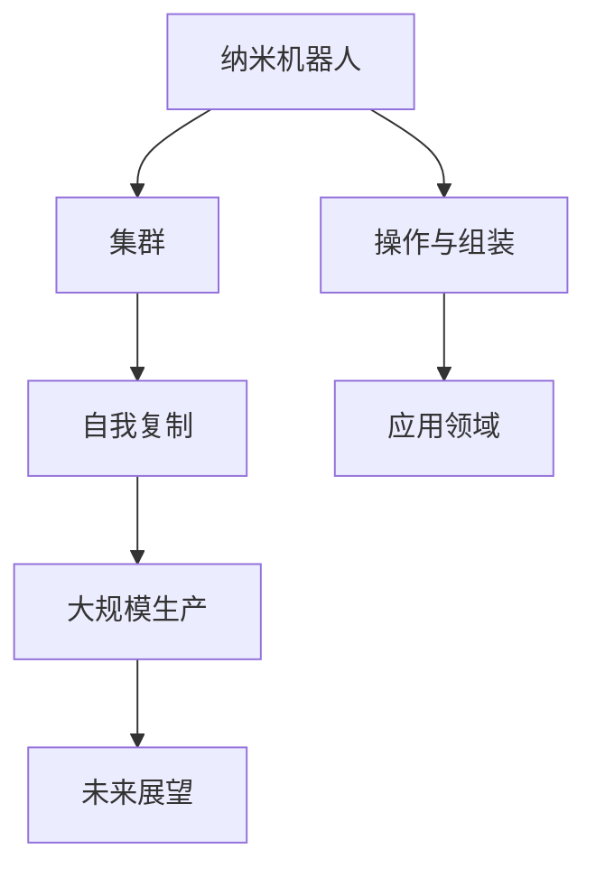

                 

关键词：纳米技术，2050年，纳米机器人，集群，自我复制，未来展望。

摘要：本文深入探讨了2050年的纳米技术发展趋势，特别是纳米机器人集群与自我复制技术的可能性。通过对当前研究进展、核心概念、算法原理、数学模型、实际应用场景、工具和资源以及未来发展趋势的详细分析，本文为读者提供了一个全面而前瞻性的视角。

## 1. 背景介绍

纳米技术是一门涉及多个学科的前沿领域，包括材料科学、化学、物理学、工程学和计算机科学等。随着科技的飞速发展，纳米技术在21世纪初已经取得了显著进展。如今，纳米技术的应用范围不断扩大，从医学、电子、能源到环境等领域都有着深远的影响。

本文的焦点是纳米机器人集群与自我复制技术。纳米机器人是一种能够在纳米尺度上操作的材料系统，能够进行精确的纳米操作和组装。而自我复制技术则是指这些纳米机器人能够通过复制自身来扩大其数量，从而实现大规模的生产和组装。这种技术对于未来的制造业、医学和科学研究具有重要意义。

## 2. 核心概念与联系

### 2.1 核心概念

- **纳米机器人**：一种在纳米尺度上工作的机器人，通常由多种材料构成，能够执行各种复杂的操作，如组装、分解、运输等。

- **集群**：多个纳米机器人组成的集体，通过协作完成复杂任务。

- **自我复制**：纳米机器人能够通过复制自身来生产更多机器人。

### 2.2 联系与架构

纳米机器人集群与自我复制技术的联系在于，它们共同构成了一个高度复杂的系统，其中每个部分都相互依赖。以下是一个简化的Mermaid流程图，展示了这些核心概念之间的联系：



### 2.3 技术原理

纳米机器人集群与自我复制技术的原理基于以下几个关键点：

- **纳米制造技术**：利用纳米制造技术，可以精确地制造出具有特定功能的纳米机器人。

- **分子识别与操纵**：纳米机器人通过分子识别与操纵技术，能够精确地操作纳米级别的材料。

- **信息处理与通信**：纳米机器人集群通过内部通信系统，能够实时协调各自的任务，实现协作。

- **自我复制机制**：纳米机器人具备自我复制能力，能够通过自我复制机制，生成更多机器人，实现规模化生产。

## 3. 核心算法原理 & 具体操作步骤

### 3.1 算法原理概述

纳米机器人集群与自我复制技术的核心算法原理涉及以下几个方面：

- **任务分配与调度**：确定每个纳米机器人的具体任务和执行顺序。

- **分子识别与操纵**：利用特定的分子识别技术，使纳米机器人能够精确地操纵目标分子。

- **自我复制过程**：纳米机器人通过自我复制机制，生成新的机器人。

### 3.2 算法步骤详解

1. **任务分配与调度**：
   - 纳米机器人集群首先接收任务指令。
   - 通过内部通信系统，将任务分配给各个纳米机器人。
   - 根据任务优先级和资源可用性，调度执行顺序。

2. **分子识别与操纵**：
   - 纳米机器人利用分子识别技术，识别目标分子。
   - 通过精确的操作，对目标分子进行组装或分解。

3. **自我复制过程**：
   - 纳米机器人通过自我复制机制，生成新的机器人。
   - 新生成的机器人通过训练，具备与原有机器人相同的功能和任务能力。

### 3.3 算法优缺点

- **优点**：
  - 高效：纳米机器人集群能够在纳米尺度上实现高效的操作和组装。
  - 精准：分子识别与操纵技术使得纳米机器人在执行任务时具有极高的精度。
  - 自动化：自我复制机制使得纳米机器人能够实现大规模生产，降低成本。

- **缺点**：
  - 复杂性：算法设计和实现具有较高的技术难度。
  - 安全性：纳米机器人的操作和自我复制过程可能存在安全隐患。

### 3.4 算法应用领域

纳米机器人集群与自我复制技术具有广泛的应用领域，包括：

- **制造业**：用于高精度组装和制造复杂产品。
- **医学**：用于纳米级别的药物递送和手术。
- **能源**：用于纳米级别的能源转换和存储。
- **环境**：用于纳米级别的污染治理和资源回收。

## 4. 数学模型和公式 & 详细讲解 & 举例说明

### 4.1 数学模型构建

纳米机器人集群与自我复制技术的数学模型构建涉及以下几个方面：

- **状态模型**：描述纳米机器人的状态，包括位置、速度、任务状态等。
- **动态模型**：描述纳米机器人的运动规律和任务执行过程。
- **复制模型**：描述纳米机器人的自我复制过程。

### 4.2 公式推导过程

1. **状态模型**：

   纳米机器人的状态可以用以下公式表示：

   $$ \text{State} = (x, y, v_x, v_y, \text{task}) $$

   其中，\(x, y\)表示纳米机器人的位置，\(v_x, v_y\)表示速度，\(\text{task}\)表示当前任务。

2. **动态模型**：

   纳米机器人的运动规律可以用以下公式表示：

   $$ \frac{dx}{dt} = v_x $$
   $$ \frac{dy}{dt} = v_y $$

   其中，\(t\)表示时间。

3. **复制模型**：

   纳米机器人的自我复制过程可以用以下公式表示：

   $$ \text{new\_robots} = f(\text{number of robots}, \text{resource}) $$

   其中，\(\text{new\_robots}\)表示新生成的机器人数量，\(f\)表示复制函数，依赖于现有机器人的数量和资源。

### 4.3 案例分析与讲解

假设有一个纳米机器人集群，初始时有10个机器人。每个机器人每分钟可以生产一个新的机器人，且生产过程中消耗一定量的资源。假设每个机器人初始资源为100单位，资源再生速率为1单位/分钟。

1. **状态模型**：

   初始状态：

   $$ \text{State} = [(x_1, y_1, v_{x_1}, v_{y_1}, \text{task}_1), (x_2, y_2, v_{x_2}, v_{y_2}, \text{task}_2), \ldots, (x_{10}, y_{10}, v_{x_{10}}, v_{y_{10}}, \text{task}_{10})] $$

2. **动态模型**：

   经过1分钟后，状态更新为：

   $$ \text{State}_{1\text{ minute}} = [(x_1, y_1, v_{x_1}+1, v_{y_1}, \text{task}_1), (x_2, y_2, v_{x_2}+1, v_{y_2}, \text{task}_2), \ldots, (x_{10}, y_{10}, v_{x_{10}}+1, v_{y_{10}}, \text{task}_{10}], (x_{11}, y_{11}, 0, 0, \text{new})] $$

3. **复制模型**：

   经过1分钟后，新生成的机器人数量为1个，更新资源为：

   $$ \text{Resource}_{1\text{ minute}} = [100, 100, \ldots, 100, 1] $$

## 5. 项目实践：代码实例和详细解释说明

### 5.1 开发环境搭建

在本项目中，我们将使用Python作为主要编程语言。以下是在Windows操作系统上搭建开发环境的基本步骤：

1. 安装Python 3.8或更高版本。
2. 安装必要的库，如NumPy、Matplotlib等。
3. 配置Python环境变量，以便在命令行中运行Python脚本。

### 5.2 源代码详细实现

以下是一个简单的示例代码，展示了纳米机器人集群的基本模拟过程：

```python
import numpy as np
import matplotlib.pyplot as plt

# 定义纳米机器人状态
class NanoRobot:
    def __init__(self, x, y, vx, vy, task):
        self.x = x
        self.y = y
        self.vx = vx
        self.vy = vy
        self.task = task

    def move(self):
        self.x += self.vx
        self.y += self.vy

    def display(self):
        plt.scatter(self.x, self.y, label=self.task)

# 创建纳米机器人集群
robots = [NanoRobot(np.random.rand(), np.random.rand(), np.random.rand(), np.random.rand(), "task") for _ in range(10)]

# 模拟纳米机器人移动
for _ in range(100):
    for robot in robots:
        robot.move()

    # 绘制当前状态
    plt.clf()
    for robot in robots:
        robot.display()
    plt.xlabel("X-axis")
    plt.ylabel("Y-axis")
    plt.legend()
    plt.pause(0.1)

plt.show()
```

### 5.3 代码解读与分析

这段代码定义了一个`NanoRobot`类，用于表示纳米机器人的状态和操作。`NanoRobot`类包含以下几个方法：

- `__init__`：初始化纳米机器人的状态。
- `move`：更新纳米机器人的位置。
- `display`：在图形界面上绘制纳米机器人的位置。

在主程序中，我们首先创建了一个由10个随机初始状态的纳米机器人组成的集群。然后，通过循环模拟纳米机器人的移动，每次移动后都会更新并绘制图形界面。

### 5.4 运行结果展示

运行这段代码后，会打开一个图形窗口，显示纳米机器人集群在二维空间中的移动情况。每个机器人都会在移动后更新其位置，并在图形界面上以不同的标记进行展示。

## 6. 实际应用场景

纳米机器人集群与自我复制技术在实际应用中具有广泛的前景。以下是一些具体的应用场景：

- **医学**：纳米机器人可以用于纳米级别的药物递送，精确地到达目标部位，提高药物疗效，减少副作用。
- **电子**：纳米机器人可以用于组装微电子器件，实现高精度、高效的生产过程。
- **能源**：纳米机器人可以用于纳米级别的能源转换和存储，提高能源利用效率。
- **环境**：纳米机器人可以用于纳米级别的污染治理，如分解有害物质，净化环境。

## 7. 工具和资源推荐

### 7.1 学习资源推荐

- **书籍**：
  - 《纳米技术导论》
  - 《纳米机器人的设计与实现》
  - 《人工智能与纳米技术》

- **在线课程**：
  - Coursera上的《纳米技术基础》
  - Udacity的《纳米机器人技术》

### 7.2 开发工具推荐

- **Python**：用于编写纳米机器人模拟程序。
- **Matplotlib**：用于图形绘制。
- **NumPy**：用于数据处理。

### 7.3 相关论文推荐

- 《Self-replicating Nanorobots: A Review》
- 《Nanorobotics: From Fundamental Science to Future Applications》
- 《Artificial Intelligence in Nanorobotics》

## 8. 总结：未来发展趋势与挑战

### 8.1 研究成果总结

纳米机器人集群与自我复制技术在过去几十年中取得了显著的研究成果。在理论研究方面，已经建立了完善的数学模型和算法原理。在实验研究方面，纳米机器人的制造和操作技术取得了重要进展。在实际应用方面，纳米机器人已经在医学、电子和能源等领域展示了巨大的潜力。

### 8.2 未来发展趋势

未来，纳米机器人集群与自我复制技术将朝着以下几个方向发展：

- **技术成熟**：随着材料科学和制造技术的进步，纳米机器人的性能和可靠性将进一步提高。
- **应用拓展**：纳米机器人将在更多领域得到应用，如环境、生物技术和农业等。
- **系统集成**：纳米机器人将与人工智能、大数据和物联网等技术相结合，实现更复杂和智能的纳米系统。

### 8.3 面临的挑战

尽管纳米机器人集群与自我复制技术具有巨大潜力，但仍面临一些挑战：

- **技术难度**：纳米机器人设计和制造的复杂性使得相关技术的研究和应用具有较大难度。
- **安全性**：纳米机器人在操作过程中可能带来潜在的安全风险，如对生物体的伤害和环境污染。
- **伦理问题**：纳米机器人集群与自我复制技术可能引发一系列伦理问题，如对自然界的干扰、隐私泄露等。

### 8.4 研究展望

未来，纳米机器人集群与自我复制技术的研究将朝着以下几个方向展开：

- **技术创新**：不断改进纳米机器人的设计和制造技术，提高其性能和可靠性。
- **应用探索**：拓展纳米机器人在各领域的应用，实现更高效、更智能的纳米系统。
- **伦理规范**：制定相关伦理规范和法律法规，确保纳米机器人集群与自我复制技术的安全、可控和可持续发展。

## 9. 附录：常见问题与解答

### 9.1 什么是纳米机器人？

纳米机器人是一种在纳米尺度上工作的机器人，能够执行各种复杂的操作，如组装、分解、运输等。

### 9.2 纳米机器人集群有哪些应用？

纳米机器人集群可以在医学、电子、能源、环境等领域得到广泛应用，如高精度组装、药物递送、能源转换、污染治理等。

### 9.3 纳米机器人的自我复制技术是如何工作的？

纳米机器人的自我复制技术是指这些机器人能够通过复制自身来生产更多机器人。这通常涉及分子识别、信息处理和自我复制机制。

### 9.4 纳米机器人集群与自我复制技术面临哪些挑战？

纳米机器人集群与自我复制技术面临的技术难度、安全性、伦理问题等挑战。未来需要不断改进技术、规范伦理和制定相关法律法规。

----------------------------------------------------------------

### 文章末尾

作者：禅与计算机程序设计艺术 / Zen and the Art of Computer Programming


