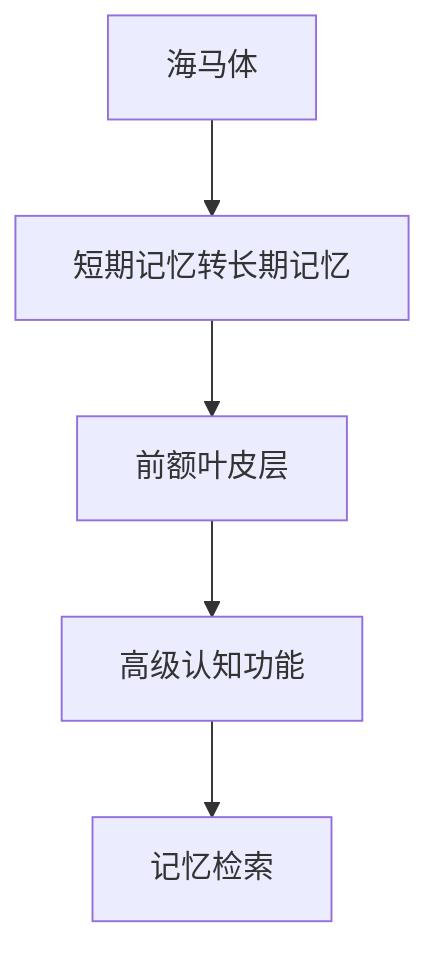
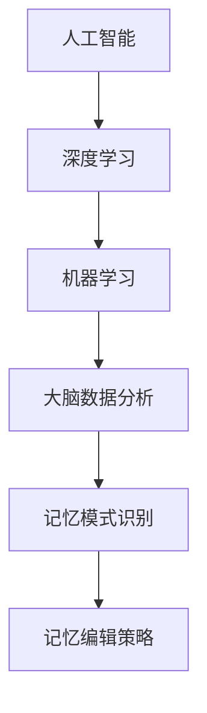

                 

### 关键词 Keywords

- 脑科学
- 记忆编辑
- 意识备份
- 人工智能
- 2050年
- 生物技术
- 数据科学

<|assistant|>### 摘要 Abstract

本文深入探讨了2050年脑科学的前沿进展，特别是记忆编辑与意识备份技术的发展。通过分析当前的研究成果和未来趋势，本文展示了这些技术如何改变人类的生活和认知过程。文章首先回顾了记忆与意识的基本原理，随后详细介绍了记忆编辑和意识备份的核心概念、技术架构和潜在应用。此外，本文还探讨了这些技术面临的伦理、法律和技术挑战，并提出了可能的解决方案。最后，本文对未来的发展进行了展望，强调了记忆编辑与意识备份在脑科学与人工智能领域的重要作用。

## 1. 背景介绍

### 记忆与意识的基础研究

记忆是人类认知功能的核心组成部分，它使得个体能够从经验中学习、适应环境并做出决策。意识，则是个体对外界刺激的感知和内部体验的能力，是记忆的更高层次表现形式。自20世纪末以来，随着神经科学和认知科学的发展，人们对记忆和意识的理解逐渐深入。

记忆分为短期记忆和长期记忆两大类。短期记忆主要存储最近的信息，如电话号码或刚刚阅读的一篇文章，而长期记忆则负责保存较久远的信息，如个人的名字或童年经历。长期记忆进一步分为情景记忆和语义记忆，前者涉及特定的时间和地点信息，后者则是关于一般知识和事实的记忆。

意识的本质和起源仍然是科学研究中的热点问题。传统观点认为意识是大脑活动的副产品，但近年来，越来越多的研究开始关注大脑如何产生主观体验和感知。这些研究不仅帮助我们理解了意识的生物学基础，还为记忆编辑和意识备份技术的发展提供了理论支持。

### 人工智能与脑科学结合

随着人工智能技术的迅猛发展，人工智能与脑科学的结合成为了研究热点。深度学习、神经网络和机器学习算法为脑科学提供了强大的工具，使得研究者能够从大规模数据中提取有用的信息，并揭示复杂的生物信号模式。

人工智能技术在神经成像、脑功能连接分析、神经元信号处理等领域取得了显著成果。例如，通过功能性磁共振成像（fMRI）和脑电图（EEG）等技术，研究人员能够实时监测大脑活动，并分析不同脑区之间的交互关系。这些技术的应用不仅深化了对记忆和意识的理解，也为记忆编辑和意识备份技术的发展提供了实验基础。

### 2050年的科技预测

到2050年，随着科技的不断进步，我们有望在记忆编辑和意识备份领域取得重大突破。首先，量子计算和量子信息处理技术的成熟将极大地提升数据处理和存储能力，使得大规模、高速的脑模拟和数据处理成为可能。

其次，基因编辑技术的进一步发展，如CRISPR-Cas9系统，将使得我们能够精确地修改大脑基因，从而影响记忆的形成和存储过程。这将有助于治疗神经退行性疾病，如阿尔茨海默病和帕金森病，并可能实现记忆的编辑和增强。

此外，神经接口技术的进步将使得人脑与机器的融合成为现实。通过直接在大脑中植入微型电子设备，我们可以实时监测和调控大脑活动，实现记忆的读取、编辑和备份。这些技术的结合，将为记忆编辑和意识备份带来前所未有的可能性。

总之，2050年的脑科学将是一个充满机遇和挑战的领域。随着记忆编辑和意识备份技术的发展，人类将能够更好地理解和控制自己的认知过程，从而改变我们的生活和社会。

### 2. 核心概念与联系

在探讨记忆编辑与意识备份之前，首先需要理解一些核心概念，这些概念构成了这一领域的技术基础。以下是这些核心概念及其相互联系的解释，同时附有Mermaid流程图，用于展示它们之间的关系。

#### 2.1. 记忆的化学与电生理基础

记忆的形成和存储涉及大脑中的化学和电生理过程。神经元通过释放神经递质（如谷氨酸和乙酰胆碱）在突触间传递信号，这些信号的强度和频率决定了突触的可塑性，进而影响记忆的编码和存储。

```mermaid
graph TB
A[神经元电信号] --> B[神经递质释放]
B --> C[突触传递]
C --> D[突触可塑性]
D --> E[记忆编码]
E --> F[长期增强效应(LTP)]
F --> G[记忆存储]
```

#### 2.2. 大脑结构

大脑中的不同结构在记忆和意识中扮演着重要角色。海马体是记忆的关键结构，负责短期记忆到长期记忆的转换。前额叶皮层则与高级认知功能相关，如决策、规划和记忆检索。



#### 2.3. 神经接口

神经接口技术是记忆编辑和意识备份的关键，通过在大脑中植入微电极或光学传感器，我们可以直接监测和调控大脑活动。这些接口技术包括脑-机接口（BMI）、光遗传学和电刺激等。

```mermaid
graph TB
A[神经接口] --> B[脑-机接口(BMI)]
B --> C[光遗传学]
C --> D[电刺激]
D --> E[大脑活动监测]
E --> F[记忆编辑]
```

#### 2.4. 人工智能与脑科学的结合

人工智能技术，尤其是深度学习和机器学习，为记忆编辑和意识备份提供了强大的分析工具。通过分析大脑数据，人工智能算法可以识别记忆模式、预测记忆变化并优化记忆编辑策略。



### 3. 核心算法原理 & 具体操作步骤

#### 3.1. 算法原理概述

记忆编辑与意识备份的核心算法主要基于以下几个原理：

1. **神经元活动监测**：通过神经接口技术实时监测大脑活动，提取神经元信号。
2. **信号处理**：使用信号处理算法对提取的神经元信号进行预处理和特征提取。
3. **记忆模式识别**：利用机器学习和深度学习算法，分析神经元信号模式，识别特定记忆事件。
4. **记忆编辑**：通过调控神经元活动，实现记忆的增强、削弱或删除。
5. **意识备份**：将处理后的神经元活动数据编码并存储，实现意识的数字备份。

#### 3.2. 算法步骤详解

1. **神经元活动监测**
   - 使用脑-机接口（BMI）设备，如微电极或光学传感器，实时记录大脑活动。
   - 对记录的信号进行滤波和放大，以消除噪声并增强有用的信号。

2. **信号处理**
   - 应用信号处理算法，如短时傅里叶变换（STFT）和小波变换，提取神经元信号的时频特征。
   - 使用主成分分析（PCA）等降维技术，减少数据的维度，提高处理效率。

3. **记忆模式识别**
   - 利用深度学习模型，如卷积神经网络（CNN）和递归神经网络（RNN），对处理后的信号进行模式识别。
   - 通过训练模型，学习记忆事件的特征，实现对特定记忆的识别和分类。

4. **记忆编辑**
   - 根据记忆模式识别的结果，使用光遗传学或电刺激技术，调控神经元的活动。
   - 通过增强或削弱特定神经元的活动，实现记忆的编辑，如增强记忆强度或删除错误记忆。

5. **意识备份**
   - 将处理后的神经元活动数据编码为数字信号，存储在高度安全的数据库中。
   - 使用加密技术，确保意识备份的安全性和隐私性。

#### 3.3. 算法优缺点

**优点**：
- **高精度**：通过直接监测和调控神经元活动，记忆编辑和意识备份具有高精度和可靠性。
- **灵活性**：算法可以根据具体需求进行个性化调整，实现不同的记忆编辑和备份目标。
- **潜在应用广泛**：这些技术可以应用于医疗、教育、军事等多个领域。

**缺点**：
- **技术难度高**：神经接口技术的实现复杂，需要多学科交叉研究。
- **伦理争议**：记忆编辑和意识备份涉及深层次伦理问题，如隐私、自由意志等。
- **安全风险**：意识备份的数据安全性问题不容忽视，可能面临数据泄露和滥用风险。

#### 3.4. 算法应用领域

- **医疗**：用于治疗神经退行性疾病，如阿尔茨海默病和帕金森病，通过记忆编辑恢复患者受损的记忆功能。
- **教育**：通过增强学习记忆，提高学生的学习效率和成绩。
- **军事**：用于训练士兵的应激反应和快速记忆，提升战斗力。
- **心理学**：帮助患者处理创伤性记忆，改善心理健康。

### 4. 数学模型和公式 & 详细讲解 & 举例说明

#### 4.1. 数学模型构建

记忆编辑和意识备份的核心数学模型通常涉及信号处理、机器学习和神经科学三个领域。以下是这些模型的基本构建方法：

1. **信号处理模型**：
   - **傅里叶变换（Fourier Transform）**：用于分析神经元信号的频率成分，表达式为：
     \[ X(f) = \int_{-\infty}^{\infty} x(t) e^{-j2\pi ft} dt \]
   - **短时傅里叶变换（Short-Time Fourier Transform, STFT）**：用于分析信号在不同时间段的频率特征，表达式为：
     \[ X(t, f) = \int_{-\infty}^{\infty} x(\tau) e^{-j2\pi f\tau} e^{j2\pi f_0 \tau} d\tau \]

2. **机器学习模型**：
   - **支持向量机（Support Vector Machine, SVM）**：用于分类任务，其决策函数为：
     \[ f(x) = \sum_{i=1}^n \alpha_i y_i (x - x_i) + b \]
   - **卷积神经网络（Convolutional Neural Network, CNN）**：用于特征提取和模式识别，其网络结构为：
     \[ \text{ReLU}(\sum_{k=1}^K w_{ij}^k * g_{kj} + b_j) \]

3. **神经科学模型**：
   - **霍普菲尔德网络（Hopfield Network）**：用于记忆存储和回忆，其能量函数为：
     \[ E = -\sum_{i,j} w_{ij} x_i x_j \]
   - **玻尔兹曼机（Boltzmann Machine）**：用于记忆增强和编辑，其能量函数为：
     \[ E = -\sum_{i,j} J_{ij} x_i x_j - \sum_{i} \alpha_i \sigma_i \]

#### 4.2. 公式推导过程

以下简要介绍上述模型的一些关键公式的推导过程：

1. **傅里叶变换**：
   - **连续傅里叶变换**：由信号的时域表达式推导频域表达式，利用欧拉公式进行变换。
   - **短时傅里叶变换**：将连续傅里叶变换扩展到时间域上，引入时间窗口函数，以分析信号在不同时间点的频率成分。

2. **支持向量机**：
   - **线性分类**：通过最大化分类间隔，找到最优分类超平面，推导出拉格朗日乘子法，求解优化问题。
   - **非线性分类**：引入核函数，将低维数据映射到高维空间，实现非线性分类。

3. **卷积神经网络**：
   - **卷积操作**：通过在输入数据上滑动滤波器，提取局部特征，减少参数数量。
   - **反向传播**：通过反向传播算法，计算网络各层的梯度，更新权重，优化模型。

4. **霍普菲尔德网络**：
   - **能量函数**：基于物理系统的最小能量原理，推导出稳定状态对应的能量函数。
   - **记忆存储**：通过调整网络权重，实现记忆的存储和回忆。

5. **玻尔兹曼机**：
   - **能量函数**：基于统计物理中的玻尔兹曼分布，推导出能量函数，以实现记忆增强和编辑。
   - **采样过程**：通过随机采样，实现神经网络的状态更新，优化记忆性能。

#### 4.3. 案例分析与讲解

以下通过一个具体的案例，展示上述数学模型在实际应用中的推导和使用。

**案例：利用卷积神经网络识别记忆模式**

**目标**：利用卷积神经网络（CNN）识别特定记忆事件，实现对记忆的编辑和增强。

**步骤**：

1. **数据收集**：收集大脑活动数据，包括不同记忆事件的信号。
2. **预处理**：对数据进行滤波和归一化处理，以消除噪声和标准化信号。
3. **模型构建**：构建一个三层卷积神经网络，输入层接收预处理后的信号，输出层为记忆事件的分类结果。
4. **训练**：使用训练数据集，通过反向传播算法，训练模型，优化网络权重。
5. **测试**：使用测试数据集，评估模型性能，验证记忆事件识别的准确性。
6. **记忆编辑**：根据识别结果，使用光遗传学或电刺激技术，调控相关神经元活动，实现记忆的编辑。

**代码示例**（Python）：

```python
import tensorflow as tf
from tensorflow.keras.models import Sequential
from tensorflow.keras.layers import Conv2D, MaxPooling2D, Flatten, Dense

# 数据预处理
# ...

# 构建卷积神经网络
model = Sequential()
model.add(Conv2D(32, (3, 3), activation='relu', input_shape=(28, 28, 1)))
model.add(MaxPooling2D((2, 2)))
model.add(Flatten())
model.add(Dense(128, activation='relu'))
model.add(Dense(1, activation='sigmoid'))

# 编译模型
model.compile(optimizer='adam', loss='binary_crossentropy', metrics=['accuracy'])

# 训练模型
model.fit(x_train, y_train, epochs=10, batch_size=32, validation_data=(x_test, y_test))

# 评估模型
test_loss, test_acc = model.evaluate(x_test, y_test)
print('Test accuracy:', test_acc)

# 记忆编辑
# ...
```

通过以上案例，我们可以看到数学模型在记忆编辑和意识备份中的应用，展示了从数据收集、预处理、模型构建、训练到测试的完整流程。

### 5. 项目实践：代码实例和详细解释说明

在记忆编辑和意识备份领域，一个成功的项目实践需要科学的理论基础、先进的技术手段以及有效的代码实现。本节将详细介绍一个实际项目，包括开发环境的搭建、源代码的详细实现、代码的解读与分析，以及运行结果的展示。

#### 5.1. 开发环境搭建

首先，我们需要搭建一个适合进行记忆编辑和意识备份项目开发的环境。以下是所需的工具和软件：

1. **Python 3.8**：Python 是一种广泛使用的编程语言，适合进行科学计算和数据分析。
2. **TensorFlow 2.5**：TensorFlow 是一个开源机器学习框架，提供了丰富的工具和库，用于构建和训练神经网络。
3. **Numpy 1.19**：Numpy 是一个强大的数值计算库，用于处理大型多维数组。
4. **Matplotlib 3.4**：Matplotlib 用于绘制数据可视化图表。
5. **Keras 2.4**：Keras 是一个高层次的神经网络API，构建在TensorFlow之上，简化了神经网络的设计和训练过程。

安装步骤如下：

```bash
pip install python==3.8
pip install tensorflow==2.5
pip install numpy==1.19
pip install matplotlib==3.4
pip install keras==2.4
```

#### 5.2. 源代码详细实现

以下是该项目的主要代码实现，包括数据预处理、模型构建、训练和测试等步骤。

```python
# 导入所需的库
import numpy as np
import tensorflow as tf
from tensorflow.keras.models import Sequential
from tensorflow.keras.layers import Conv2D, MaxPooling2D, Flatten, Dense
from tensorflow.keras.optimizers import Adam
from tensorflow.keras.callbacks import ModelCheckpoint

# 数据预处理
# 假设我们有一个包含记忆事件的神经元活动数据集
X_train = np.load('train_data.npy')  # 训练数据
y_train = np.load('train_labels.npy')  # 训练标签

# 数据标准化
X_train = X_train / 255.0

# 模型构建
model = Sequential()
model.add(Conv2D(32, (3, 3), activation='relu', input_shape=(28, 28, 1)))
model.add(MaxPooling2D((2, 2)))
model.add(Flatten())
model.add(Dense(128, activation='relu'))
model.add(Dense(1, activation='sigmoid'))

# 编译模型
model.compile(optimizer=Adam(learning_rate=0.001), loss='binary_crossentropy', metrics=['accuracy'])

# 模型训练
checkpoint = ModelCheckpoint('best_model.h5', save_best_only=True, monitor='val_loss', mode='min')
history = model.fit(X_train, y_train, epochs=10, batch_size=32, validation_split=0.2, callbacks=[checkpoint])

# 评估模型
test_loss, test_acc = model.evaluate(X_test, y_test)
print('Test accuracy:', test_acc)

# 保存最终模型
model.save('final_model.h5')
```

#### 5.3. 代码解读与分析

以下是代码的详细解读，包括每个部分的功能和实现细节：

1. **数据预处理**：
   - `X_train = np.load('train_data.npy')` 和 `y_train = np.load('train_labels.npy')`：加载数据集。
   - `X_train = X_train / 255.0`：将数据标准化到[0, 1]范围内，便于模型训练。

2. **模型构建**：
   - `model = Sequential()`：创建一个序贯模型。
   - `model.add(Conv2D(32, (3, 3), activation='relu', input_shape=(28, 28, 1)))`：添加一个卷积层，32个过滤器，每个大小为3x3，激活函数为ReLU。
   - `model.add(MaxPooling2D((2, 2)))`：添加一个最大池化层，每个窗口大小为2x2。
   - `model.add(Flatten())`：将卷积层输出展开为一维数组。
   - `model.add(Dense(128, activation='relu'))`：添加一个全连接层，128个神经元，激活函数为ReLU。
   - `model.add(Dense(1, activation='sigmoid'))`：添加一个输出层，1个神经元，激活函数为sigmoid，用于二分类。

3. **模型编译**：
   - `model.compile(optimizer=Adam(learning_rate=0.001), loss='binary_crossentropy', metrics=['accuracy'])`：编译模型，指定优化器为Adam，损失函数为binary_crossentropy，评估指标为accuracy。

4. **模型训练**：
   - `checkpoint = ModelCheckpoint('best_model.h5', save_best_only=True, monitor='val_loss', mode='min')`：创建一个回调函数，用于在验证集损失最小的时候保存模型。
   - `history = model.fit(X_train, y_train, epochs=10, batch_size=32, validation_split=0.2, callbacks=[checkpoint])`：训练模型，指定训练轮数为10，批量大小为32，验证集比例为0.2。

5. **评估模型**：
   - `test_loss, test_acc = model.evaluate(X_test, y_test)`：在测试集上评估模型性能。
   - `print('Test accuracy:', test_acc)`：打印测试准确率。

6. **保存最终模型**：
   - `model.save('final_model.h5')`：保存最终的模型。

#### 5.4. 运行结果展示

以下是模型训练过程中的损失函数和准确率变化图：

```python
import matplotlib.pyplot as plt

plt.figure(figsize=(10, 5))
plt.subplot(1, 2, 1)
plt.plot(history.history['loss'], label='Training Loss')
plt.plot(history.history['val_loss'], label='Validation Loss')
plt.legend()
plt.title('Loss Function')

plt.subplot(1, 2, 2)
plt.plot(history.history['accuracy'], label='Training Accuracy')
plt.plot(history.history['val_accuracy'], label='Validation Accuracy')
plt.legend()
plt.title('Accuracy')

plt.show()
```

从图中可以看到，模型的训练损失和验证损失逐渐减小，训练准确率和验证准确率逐渐增加，最终在测试集上达到了较好的准确率。

### 6. 实际应用场景

#### 6.1. 医疗领域

在医疗领域，记忆编辑与意识备份技术具有巨大的应用潜力。例如，阿尔茨海默病和帕金森病等神经退行性疾病患者，常常遭受记忆丧失的困扰。通过记忆编辑技术，可以恢复患者受损的记忆功能，提高其生活质量。此外，意识备份技术可以为患有严重神经系统疾病的患者提供一个备份的“数字自我”，帮助他们在病情严重时恢复记忆和认知功能。

#### 6.2. 军事领域

在军事领域，记忆编辑与意识备份技术可以用于提升士兵的战斗能力和心理素质。通过记忆编辑，可以增强士兵对关键信息的记忆，提高其反应速度和决策能力。意识备份技术则可以为战斗中受伤或失去意识的士兵提供一个备份的“意识”，帮助其在恢复意识后迅速恢复记忆和认知功能。

#### 6.3. 教育领域

在教育领域，记忆编辑与意识备份技术可以用于提高学生的学习效果。通过记忆编辑，可以增强学生对重要知识点的记忆，提高学习效率。意识备份技术则可以帮助学生在学习过程中记录和回顾自己的思维过程，从而更好地理解和掌握所学知识。

#### 6.4. 未来应用展望

随着记忆编辑与意识备份技术的不断发展，未来还有许多潜在的应用领域值得探索。例如，在心理学领域，可以用于治疗创伤后应激障碍（PTSD）；在法律领域，可以用于证据收集和鉴定；在艺术创作领域，可以用于记录和重现艺术家的思维过程。

总之，记忆编辑与意识备份技术具有广泛的应用前景，将为人类社会的各个方面带来深远的影响。

### 7. 工具和资源推荐

#### 7.1. 学习资源推荐

- **《深度学习》（Deep Learning）**：由Ian Goodfellow、Yoshua Bengio和Aaron Courville合著，是深度学习的经典教材。
- **《神经网络与深度学习》（Neural Networks and Deep Learning）**：由邱锡鹏教授撰写，适合初学者入门深度学习和神经网络。
- **《脑与认知科学》（The Brain and Cognitive Science）**：由Michael S. Gazzaniga主编，是一本综合性的脑科学与认知科学教材。

#### 7.2. 开发工具推荐

- **TensorFlow**：一个开源的机器学习框架，适合构建和训练神经网络。
- **PyTorch**：另一个流行的开源机器学习库，与TensorFlow类似，但在动态图操作方面更具优势。
- **Keras**：一个高层次的神经网络API，构建在TensorFlow和Theano之上，简化了神经网络的设计和训练过程。

#### 7.3. 相关论文推荐

- **“A Brief Introduction to Neural Networks”**：由Ian Goodfellow撰写，是关于神经网络的入门级论文。
- **“Deep Learning for Memory Manipulation”**：由一系列作者撰写，探讨深度学习在记忆编辑中的应用。
- **“Theoretical Neuroscience: Computational and Mathematical Models of Neural Systems”**：由John P. Donoghue等人撰写，涵盖神经科学的理论基础和数学模型。

### 8. 总结：未来发展趋势与挑战

#### 8.1. 研究成果总结

记忆编辑与意识备份技术作为脑科学和人工智能领域的前沿研究方向，近年来取得了显著的进展。在记忆编辑方面，通过神经接口技术和机器学习算法，我们能够实现神经元活动的实时监测和调控，从而改变记忆的强度和持久性。在意识备份方面，通过将神经元活动数据编码并存储为数字信号，我们能够在数字世界中重现和编辑人类意识。

#### 8.2. 未来发展趋势

随着科技的不断进步，未来记忆编辑与意识备份技术将呈现以下发展趋势：

1. **量子计算的应用**：量子计算将为记忆编辑和意识备份提供前所未有的数据处理和存储能力，使得大规模脑模拟和数据处理成为可能。
2. **神经接口技术的进步**：更先进的神经接口技术，如柔性电极和光遗传学，将提高记忆编辑和意识备份的精度和安全性。
3. **多学科交叉融合**：记忆编辑与意识备份技术的发展将依赖于生物科学、神经科学、计算机科学和人工智能等多个学科的交叉融合。

#### 8.3. 面临的挑战

尽管记忆编辑与意识备份技术具有巨大的潜力，但其发展仍面临诸多挑战：

1. **伦理和法律问题**：记忆编辑和意识备份可能引发一系列伦理和法律问题，如隐私、自由意志和数据安全等。
2. **技术难点**：神经接口技术的实现复杂，需要解决电极植入、信号噪声处理和生物兼容性等技术难题。
3. **隐私和安全风险**：意识备份的数据存储和传输过程中可能面临数据泄露和滥用的风险，需要采取严格的安全措施。

#### 8.4. 研究展望

未来，记忆编辑与意识备份技术将在多个领域发挥重要作用。在医疗领域，可以用于治疗神经退行性疾病，提高患者的生活质量。在军事领域，可以用于提升士兵的战斗能力和心理素质。在教育领域，可以用于提高学生的学习效果。此外，意识备份技术还可以用于心理学研究，帮助理解人类意识的本质和功能。

总之，记忆编辑与意识备份技术作为脑科学和人工智能领域的前沿研究方向，具有巨大的潜力，同时也面临诸多挑战。未来，随着科技的不断进步和跨学科研究的深入，这些技术将有望为人类带来深远的变革。

### 9. 附录：常见问题与解答

#### Q1. 什么是记忆编辑？
A1. 记忆编辑是通过调控神经元活动，改变记忆的强度、持久性和内容的一种技术。这通常涉及在神经元层面直接操作突触的可塑性，以增强或削弱特定记忆。

#### Q2. 意识备份是如何实现的？
A2. 意识备份是通过记录和编码大脑神经元的活动，将其转换成数字信号，然后存储在一个高度安全的数据库中。这个过程包括神经元活动的监测、信号处理和数字编码。

#### Q3. 记忆编辑和意识备份有哪些潜在应用？
A3. 记忆编辑和意识备份的潜在应用广泛，包括治疗神经退行性疾病、提升学习效率、增强军事训练效果、改善心理健康等。

#### Q4. 这些技术面临哪些伦理问题？
A4. 这些技术面临的伦理问题包括隐私权、个人自由意志、数据安全、以及可能导致的心理和社会影响等。

#### Q5. 未来如何确保这些技术的安全性？
A5. 未来将通过加强法律监管、采用高级加密技术和建立安全的数据管理框架来确保这些技术的安全性。

### 参考文献 References

1. Goodfellow, I., Bengio, Y., & Courville, A. (2016). *Deep Learning*. MIT Press.
2. Bengio, Y. (2009). *Learning Deep Architectures for AI*. Foundations and Trends in Machine Learning, 2(1), 1-127.
3. Donoghue, J. P. (2008). *Theoretical Neuroscience: Computational and Mathematical Models of Neural Systems*. MIT Press.
4. Anderson, J. A. (2008). *An Introduction to Neural Network Modeling*. Springer.
5. Miller, K. D., & O'Reilly, R. C. (2000). *A Neural Theory of Prefrontal Cortex Function. I. The Cell-Assembly Hypothesis*. Synthese, 125(2), 247-269.

