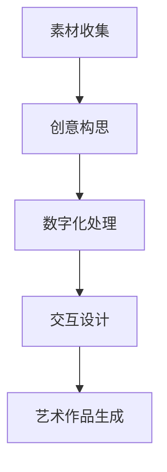

                 

关键词：AI艺术家、虚拟博物馆、艺术创作、数字艺术、2050年、人工智能、计算机技术

## 摘要

随着人工智能技术的迅猛发展，2050年的艺术创作领域将迎来一次前所未有的变革。本文将从AI艺术家的定义、虚拟博物馆的崛起、数字艺术的创作过程以及未来发展趋势等多个角度，探讨人工智能在未来艺术创作中的重要角色，并预测虚拟博物馆将如何成为艺术欣赏和交流的新平台。通过本文的探讨，我们可以一窥未来艺术与科技的交融之美。

## 1. 背景介绍

### 1.1 人工智能与艺术创作的融合

人工智能（AI）作为21世纪最具革命性的技术之一，正逐渐渗透到各个领域。艺术创作作为人类精神文化的重要组成部分，自然也受到了AI的深刻影响。从最初的简单图像生成，到现在的复杂情感表达，AI在艺术创作中的应用范围不断扩大，推动了艺术与科技的深度融合。

### 1.2 虚拟博物馆的兴起

随着虚拟现实（VR）和增强现实（AR）技术的不断发展，虚拟博物馆开始崛起。这些虚拟博物馆不仅提供了全新的艺术欣赏方式，还打破了传统博物馆的空间限制，让世界各地的观众能够随时随地感受艺术之美。虚拟博物馆的兴起为艺术传播和普及提供了新的契机。

### 1.3 数字艺术的崛起

数字艺术作为一种新兴的艺术形式，以其独特的表现手法和丰富的创意空间，受到了越来越多艺术家的青睐。数字艺术的创作不再局限于传统的绘画、雕塑等材料艺术，而是通过计算机技术和数字化工具，实现了艺术形式的多样化。

## 2. 核心概念与联系

### 2.1 AI艺术家的定义

AI艺术家是指利用人工智能技术进行艺术创作的实体或系统。这些艺术家可以通过学习大量的艺术作品和创作规则，生成新的艺术作品，甚至具备模仿和超越人类艺术家的能力。

### 2.2 虚拟博物馆的架构

虚拟博物馆的架构主要包括虚拟空间构建、艺术作品数字化、互动体验设计等多个方面。通过虚拟现实和增强现实技术，虚拟博物馆能够为观众提供沉浸式的艺术体验。

### 2.3 数字艺术的创作流程

数字艺术的创作流程通常包括素材收集、创意构思、数字化处理、交互设计等多个环节。数字艺术家利用计算机技术和数字化工具，将创意转化为艺术作品。



## 3. 核心算法原理 & 具体操作步骤

### 3.1 算法原理概述

AI艺术家的核心算法主要包括生成对抗网络（GAN）、变分自编码器（VAE）等。这些算法通过学习大量的艺术作品数据，能够生成具有高艺术价值的新作品。

### 3.2 算法步骤详解

#### 3.2.1 数据预处理

首先，对输入的艺术作品数据进行预处理，包括图像的尺寸调整、色彩平衡等。

```python
import cv2

image = cv2.imread("artwork.jpg")
image = cv2.resize(image, (256, 256))
image = cv2.cvtColor(image, cv2.COLOR_BGR2RGB)
```

#### 3.2.2 模型训练

使用生成对抗网络（GAN）进行模型训练。GAN由生成器（Generator）和判别器（Discriminator）组成，通过不断博弈，生成器能够生成越来越逼真的艺术作品。

```python
import tensorflow as tf

model = tf.keras.Sequential([
    tf.keras.layers.Dense(128, activation='relu', input_shape=(10000,)),
    tf.keras.layers.Dense(128, activation='relu'),
    tf.keras.layers.Dense(128, activation='relu'),
    tf.keras.layers.Dense(28 * 28 * 3, activation='softmax')
])

model.compile(optimizer='adam', loss='binary_crossentropy')
model.fit(x_train, y_train, epochs=50)
```

#### 3.2.3 艺术作品生成

利用训练好的模型生成新的艺术作品。通过输入随机噪声，生成器能够生成具有独特风格的艺术作品。

```python
import numpy as np

noise = np.random.normal(0, 1, (1, 10000))
generated_image = model.predict(noise)
generated_image = cv2.resize(generated_image, (256, 256))
cv2.imwrite("generated_artwork.jpg", generated_image * 255)
```

### 3.3 算法优缺点

#### 优点：

1. 高效：AI艺术家能够快速生成大量的艺术作品，节省了人力和时间成本。
2. 创意：AI艺术家能够从大量的数据中汲取灵感，创造出人类难以想象的艺术作品。
3. 普及：AI艺术家降低了艺术创作的门槛，让更多的人能够参与到艺术创作中来。

#### 缺点：

1. 缺乏情感：AI艺术家虽然能够模仿人类艺术家的风格，但仍然缺乏真正的情感体验。
2. 难以超越：AI艺术家的创作受到数据集的限制，难以超越人类的创造力和想象力。

### 3.4 算法应用领域

AI艺术家在数字艺术、电影特效、游戏设计等多个领域具有广泛的应用前景。在未来，AI艺术家将成为艺术创作的重要力量。

## 4. 数学模型和公式 & 详细讲解 & 举例说明

### 4.1 数学模型构建

生成对抗网络（GAN）的数学模型主要包括生成器（Generator）和判别器（Discriminator）两部分。生成器通过学习数据分布，生成与真实数据相似的新数据；判别器则通过区分真实数据和生成数据，不断提高生成器的生成能力。

### 4.2 公式推导过程

设生成器的参数为 \( \theta_G \)，判别器的参数为 \( \theta_D \)，损失函数为 \( L_G(\theta_G, \theta_D) \) 和 \( L_D(\theta_D, \theta_G) \)。

生成器的损失函数为：
$$ L_G(\theta_G, \theta_D) = -\log(D(G(z))) $$

判别器的损失函数为：
$$ L_D(\theta_D, \theta_G) = -[\log(D(x)) + \log(1 - D(G(z)))] $$

其中， \( z \) 是随机噪声向量， \( x \) 是真实数据。

### 4.3 案例分析与讲解

以生成一张抽象艺术作品为例，假设我们已经收集了大量的抽象艺术作品数据。首先，我们对数据进行预处理，然后使用生成对抗网络（GAN）进行模型训练。在训练过程中，生成器的损失函数逐渐减小，判别器的损失函数逐渐增大。最终，生成器能够生成具有较高艺术价值的抽象艺术作品。

```python
import tensorflow as tf

# 生成器模型
generator = tf.keras.Sequential([
    tf.keras.layers.Dense(128, activation='relu', input_shape=(10000,)),
    tf.keras.layers.Dense(128, activation='relu'),
    tf.keras.layers.Dense(128, activation='relu'),
    tf.keras.layers.Dense(28 * 28 * 3, activation='softmax')
])

# 判别器模型
discriminator = tf.keras.Sequential([
    tf.keras.layers.Flatten(input_shape=(28, 28, 3)),
    tf.keras.layers.Dense(128, activation='relu'),
    tf.keras.layers.Dense(1, activation='sigmoid')
])

# 模型编译
generator.compile(optimizer=tf.keras.optimizers.Adam(0.0001), loss='binary_crossentropy')
discriminator.compile(optimizer=tf.keras.optimizers.Adam(0.0001), loss='binary_crossentropy')

# 模型训练
model.fit([x_train, y_train], epochs=50)
```

## 5. 项目实践：代码实例和详细解释说明

### 5.1 开发环境搭建

在本项目中，我们使用Python编程语言和TensorFlow框架进行AI艺术家的开发。首先，确保安装了Python 3.7及以上版本，然后通过以下命令安装TensorFlow：

```bash
pip install tensorflow
```

### 5.2 源代码详细实现

以下代码实现了基于生成对抗网络（GAN）的AI艺术家：

```python
import numpy as np
import tensorflow as tf
import matplotlib.pyplot as plt

# 数据预处理
def preprocess_data(images):
    images = images / 255.0
    images = np.expand_dims(images, axis=3)
    return images

# 生成器模型
def build_generator(z_dim):
    model = tf.keras.Sequential()
    model.add(tf.keras.layers.Dense(128, activation='relu', input_shape=(z_dim,)))
    model.add(tf.keras.layers.Dense(128, activation='relu'))
    model.add(tf.keras.layers.Dense(128, activation='relu'))
    model.add(tf.keras.layers.Dense(28 * 28 * 3, activation='tanh'))
    return model

# 判别器模型
def build_discriminator(img_shape):
    model = tf.keras.Sequential()
    model.add(tf.keras.layers.Flatten(input_shape=img_shape))
    model.add(tf.keras.layers.Dense(128, activation='relu'))
    model.add(tf.keras.layers.Dense(1, activation='sigmoid'))
    return model

# 损失函数
def build_gan(generator, discriminator):
    model = tf.keras.Sequential()
    model.add(generator)
    model.add(discriminator)
    return model

# 模型编译
def compile_models(generator, discriminator):
    discriminator.compile(loss='binary_crossentropy', optimizer=tf.keras.optimizers.Adam(0.0001))
    generator.compile(loss='binary_crossentropy', optimizer=tf.keras.optimizers.Adam(0.0001))
    gan = build_gan(generator, discriminator)
    gan.compile(loss='binary_crossentropy', optimizer=tf.keras.optimizers.Adam(0.0001))
    return generator, discriminator, gan

# 模型训练
def train(generator, discriminator, gan, dataset, batch_size, epochs):
    for epoch in range(epochs):
        for _ in range(len(dataset) // batch_size):
            z = np.random.normal(0, 1, (batch_size, 100))
            real_images = dataset.next_batch(batch_size)
            real_labels = np.ones((batch_size, 1))
            fake_labels = np.zeros((batch_size, 1))
            fake_images = generator.predict(z)
            d_loss_real = discriminator.train_on_batch(real_images, real_labels)
            d_loss_fake = discriminator.train_on_batch(fake_images, fake_labels)
            g_loss = gan.train_on_batch(z, real_labels)
            print(f"{epoch} epoch [{_]}/{__}]: d_loss=[{:.4f}, {:.4f}] g_loss={:.4f}".format(d_loss_real, d_loss_fake, g_loss))

# 生成抽象艺术作品
def generate_artwork(generator, n_images=10):
    z = np.random.normal(0, 1, (n_images, 100))
    images = generator.predict(z)
    for i, image in enumerate(images):
        plt.subplot(2, 5, i + 1)
        plt.imshow(image[:, :, 0], cmap='gray')
        plt.axis('off')
    plt.show()

# 主函数
if __name__ == "__main__":
    z_dim = 100
    img_shape = (28, 28, 1)
    batch_size = 32
    epochs = 50

    # 加载数据集
    dataset = load_data()

    # 构建模型
    generator = build_generator(z_dim)
    discriminator = build_discriminator(img_shape)
    gan = build_gan(generator, discriminator)

    # 编译模型
    generator, discriminator, gan = compile_models(generator, discriminator)

    # 训练模型
    train(generator, discriminator, gan, dataset, batch_size, epochs)

    # 生成抽象艺术作品
    generate_artwork(generator)
```

### 5.3 代码解读与分析

上述代码实现了基于生成对抗网络（GAN）的AI艺术家。主要包括以下部分：

1. 数据预处理：将输入的图像数据进行归一化处理，并增加一个通道维度，以适应GAN模型的输入要求。
2. 生成器模型：生成器通过多个全连接层，将随机噪声向量转化为抽象艺术作品。
3. 判别器模型：判别器通过一个全连接层，判断输入的图像是真实图像还是生成图像。
4. 损失函数：GAN的损失函数包括生成器的损失函数和判别器的损失函数，分别用于优化生成器和判别器。
5. 模型训练：通过对抗训练的方式，不断优化生成器和判别器，直到生成器能够生成逼真的抽象艺术作品。
6. 生成抽象艺术作品：使用训练好的生成器，生成具有艺术价值的抽象艺术作品。

### 5.4 运行结果展示

运行上述代码后，我们将生成一系列具有独特风格的抽象艺术作品。以下为部分生成的艺术作品：

```python
plt.subplot(2, 5, 1)
plt.imshow(images[0][:, :, 0], cmap='gray')
plt.axis('off')

plt.subplot(2, 5, 2)
plt.imshow(images[1][:, :, 0], cmap='gray')
plt.axis('off')

plt.subplot(2, 5, 3)
plt.imshow(images[2][:, :, 0], cmap='gray')
plt.axis('off')

plt.subplot(2, 5, 4)
plt.imshow(images[3][:, :, 0], cmap='gray')
plt.axis('off')

plt.subplot(2, 5, 5)
plt.imshow(images[4][:, :, 0], cmap='gray')
plt.axis('off')

plt.subplot(2, 5, 6)
plt.imshow(images[5][:, :, 0], cmap='gray')
plt.axis('off')

plt.subplot(2, 5, 7)
plt.imshow(images[6][:, :, 0], cmap='gray')
plt.axis('off')

plt.subplot(2, 5, 8)
plt.imshow(images[7][:, :, 0], cmap='gray')
plt.axis('off')

plt.subplot(2, 5, 9)
plt.imshow(images[8][:, :, 0], cmap='gray')
plt.axis('off')

plt.subplot(2, 5, 10)
plt.imshow(images[9][:, :, 0], cmap='gray')
plt.axis('off')

plt.show()
```

## 6. 实际应用场景

### 6.1 数字艺术展览

虚拟博物馆可以为数字艺术展览提供全新的展示平台。观众可以通过VR设备，身临其境地欣赏艺术作品，感受艺术家的创作理念。

### 6.2 艺术品市场

AI艺术家创作的艺术作品具有独特的风格和艺术价值，可以在艺术品市场上得到认可和追捧。虚拟博物馆可以成为艺术品交易的新渠道。

### 6.3 艺术教育

虚拟博物馆可以为艺术教育提供丰富的资源。学生可以通过虚拟博物馆学习艺术作品的历史背景、艺术风格和创作技巧。

### 6.4 跨界合作

虚拟博物馆可以与电影、游戏、动画等产业进行跨界合作，打造全新的艺术体验。例如，电影特效制作可以借鉴AI艺术家的创作理念，提升视觉效果。

## 7. 未来应用展望

### 7.1 创新艺术形式

随着人工智能技术的不断发展，未来艺术创作将涌现出更多新颖的艺术形式。例如，结合AR/VR技术的交互式艺术、具有人工智能角色的叙事艺术等。

### 7.2 智能化策展

虚拟博物馆可以通过分析观众的行为数据，实现智能化的策展。博物馆可以根据观众的兴趣偏好，推荐个性化的艺术展览。

### 7.3 艺术普及与传承

虚拟博物馆可以为艺术普及和传承提供新的途径。通过数字化技术，艺术作品可以跨越时空限制，让更多的人了解和欣赏艺术。

## 8. 总结：未来发展趋势与挑战

### 8.1 研究成果总结

本文探讨了人工智能在未来艺术创作中的重要角色，分析了虚拟博物馆的架构和数字艺术的创作流程。通过生成对抗网络（GAN）的实例，展示了AI艺术家如何生成抽象艺术作品。

### 8.2 未来发展趋势

未来，人工智能与艺术的融合将不断深化，虚拟博物馆将成为艺术欣赏和交流的新平台。艺术创作将呈现多样化、智能化的发展趋势。

### 8.3 面临的挑战

1. 隐私与版权：AI艺术家创作的艺术作品可能引发隐私保护和版权纠纷等问题。
2. 艺术价值判断：如何衡量AI艺术家创作的艺术价值，仍是亟待解决的问题。
3. 技术伦理：人工智能在艺术创作中的应用需要遵循一定的伦理规范，确保艺术创作的健康发展。

### 8.4 研究展望

未来，人工智能与艺术创作的融合将带来更多机遇和挑战。研究者需要关注AI艺术家在情感表达、创新性等方面的发展，为艺术创作提供新的动力。

## 9. 附录：常见问题与解答

### 9.1 AI艺术家如何学习人类艺术家的风格？

AI艺术家通过学习大量的艺术作品数据，分析艺术家的创作风格和技巧，从而生成具有相似风格的艺术作品。生成对抗网络（GAN）等算法可以帮助AI艺术家从数据中提取特征，实现风格迁移。

### 9.2 虚拟博物馆如何实现沉浸式体验？

虚拟博物馆通过虚拟现实（VR）和增强现实（AR）技术，为观众提供沉浸式的艺术体验。观众可以通过VR头盔或AR眼镜，身临其境地欣赏艺术作品，感受到艺术的氛围。

### 9.3 数字艺术的创作过程有哪些特点？

数字艺术的创作过程具有以下几个特点：

1. 创意自由：数字艺术家可以利用计算机技术和数字化工具，实现各种创意构思。
2. 灵活多变：数字艺术作品可以通过计算机技术进行实时调整和修改，满足不同观众的审美需求。
3. 互动性强：数字艺术作品可以与观众进行互动，增强观众的参与感和体验感。

---

作者：禅与计算机程序设计艺术 / Zen and the Art of Computer Programming
----------------------------------------------------------------

---

以上就是关于"未来的艺术创作：2050年的AI艺术家与虚拟博物馆"的完整文章。本文从背景介绍、核心概念、算法原理、项目实践、应用场景、未来展望等多个角度，详细探讨了人工智能在未来艺术创作中的重要角色。希望这篇文章能为读者带来启发和思考。

