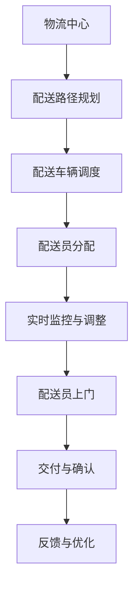

                 

关键词：末端配送、物流创业、最后一公里、智能配送、创业策略

> 摘要：本文将探讨末端配送领域中的创业机会和挑战，以及如何通过智能化的解决方案来解决最后一公里的配送难题。文章将介绍末端配送的基本概念、核心算法、数学模型、项目实践以及未来应用场景，旨在为创业者提供实用的指导和建议。

## 1. 背景介绍

随着电子商务的迅猛发展，末端配送成为物流行业的重要一环。所谓的最后一公里配送（Last Mile Delivery），指的是从物流中心到消费者手中的最后一段距离。然而，这一公里往往是最复杂、成本最高、效率最低的环节。末端配送面临的挑战包括交通拥堵、配送路径规划、配送时间的不确定性等。因此，如何解决最后一公里配送难题，成为许多创业者探索的方向。

### 1.1 末端配送的重要性

末端配送是电子商务闭环中至关重要的一环。它直接影响消费者的购物体验，关系到客户满意度和企业的声誉。高效的末端配送不仅能提高物流效率，还能降低成本，提升企业的竞争力。因此，越来越多的创业者将目光投向这一领域，希望从中寻找新的增长点。

### 1.2 末端配送的挑战

尽管末端配送具有巨大的市场潜力，但也面临着一系列挑战：

- **交通拥堵**：城市交通拥堵是末端配送中的常见问题，导致配送时间延长，增加了成本。
- **路径规划**：如何在复杂的城市环境中规划最优路径，是末端配送的核心问题。
- **时间不确定性**：消费者的配送时间要求越来越高，如何保证按时送达，是末端配送需要解决的关键问题。
- **人力成本**：末端配送依赖于大量的人力，而人力成本不断上涨，成为企业负担。

## 2. 核心概念与联系

为了解决最后一公里配送难题，我们需要了解一系列核心概念和它们之间的联系。以下是末端配送的核心概念和架构的Mermaid流程图：



### 2.1 物流中心

物流中心是末端配送的起点，负责将货物从仓库中取出，并进行初步的包装和分类。物流中心的设计和管理对于整个配送过程至关重要。

### 2.2 配送路径规划

配送路径规划是末端配送的核心问题。通过算法计算最优路径，可以最大限度地减少配送时间和成本。路径规划需要考虑交通状况、配送时间窗口、配送距离等多个因素。

### 2.3 配送车辆调度

配送车辆调度是确保货物能够及时送达的关键。调度算法需要考虑车辆容量、配送顺序、配送时间等因素，以确保车辆利用率和配送效率最大化。

### 2.4 配送员分配

配送员分配是将配送任务分配给具体的配送员的过程。合理的配送员分配可以提高配送效率，减少配送时间。

### 2.5 实时监控与调整

实时监控与调整是末端配送中的关键环节。通过实时监控系统，可以监控配送过程中的各种数据，并根据实际情况进行实时调整，确保配送任务顺利完成。

### 2.6 配送员上门

配送员上门是将货物送达消费者手中的关键环节。合理的配送员上门策略可以提高消费者的满意度。

### 2.7 交付与确认

交付与确认是末端配送的最后一个环节。通过确认货物送达，可以确保消费者的权益，同时也为企业的服务提供数据支持。

### 2.8 反馈与优化

反馈与优化是末端配送持续改进的关键。通过收集消费者的反馈，可以不断优化配送流程，提高配送效率。

## 3. 核心算法原理 & 具体操作步骤

### 3.1 算法原理概述

末端配送的核心算法包括路径规划算法、车辆调度算法和配送员分配算法。以下是这些算法的基本原理：

- **路径规划算法**：通过计算最优路径，最大限度地减少配送时间和成本。
- **车辆调度算法**：通过优化车辆利用率和配送顺序，提高配送效率。
- **配送员分配算法**：通过合理分配配送任务，提高配送员的工作效率。

### 3.2 算法步骤详解

#### 3.2.1 路径规划算法

1. 收集配送数据：包括配送地址、交通状况、配送时间窗口等。
2. 建立配送网络图：将配送地址视为节点，交通状况视为边权。
3. 选择路径规划算法：常用的路径规划算法有Dijkstra算法、A*算法等。
4. 计算最优路径：根据配送数据和网络图，计算出从物流中心到消费者手中的最优路径。

#### 3.2.2 车辆调度算法

1. 收集车辆数据：包括车辆容量、车辆状态等。
2. 建立车辆调度模型：将车辆视为资源，配送任务视为需求。
3. 选择车辆调度算法：常用的车辆调度算法有车辆路径问题（VRP）算法、遗传算法等。
4. 优化车辆调度：根据配送任务和车辆数据，优化车辆利用率和配送顺序。

#### 3.2.3 配送员分配算法

1. 收集配送员数据：包括配送员技能、配送员状态等。
2. 建立配送员分配模型：将配送任务视为需求，配送员视为资源。
3. 选择配送员分配算法：常用的配送员分配算法有基于需求的分配算法、基于技能的分配算法等。
4. 优化配送员分配：根据配送任务和配送员数据，优化配送员的工作效率。

### 3.3 算法优缺点

- **路径规划算法**：优点是计算速度快，适用于实时配送。缺点是可能无法考虑到所有变量，导致路径不是最优。
- **车辆调度算法**：优点是能提高车辆利用率，降低配送成本。缺点是计算复杂度高，不适合实时配送。
- **配送员分配算法**：优点是能提高配送员的工作效率，减少配送时间。缺点是可能无法考虑到配送员的具体情况，导致分配不合理。

### 3.4 算法应用领域

末端配送算法广泛应用于电子商务、零售业、快递行业等。随着技术的不断发展，这些算法将不断优化，为末端配送提供更加高效、智能的解决方案。

## 4. 数学模型和公式 & 详细讲解 & 举例说明

### 4.1 数学模型构建

末端配送的数学模型主要包括路径规划模型、车辆调度模型和配送员分配模型。以下是这些模型的基本构建方法：

#### 4.1.1 路径规划模型

路径规划模型通常采用图论中的最短路径算法，如Dijkstra算法和A*算法。其基本构建方法如下：

1. **建立配送网络图**：将配送地址视为节点，交通状况视为边权。
2. **定义节点和边的关系**：每个节点表示一个配送地址，每条边表示两个配送地址之间的距离或时间。
3. **计算最短路径**：根据配送网络图，计算从物流中心到每个消费者手中的最短路径。

#### 4.1.2 车辆调度模型

车辆调度模型通常采用车辆路径问题（VRP）模型。其基本构建方法如下：

1. **建立车辆调度模型**：将车辆视为资源，配送任务视为需求。
2. **定义车辆和任务的关系**：每个车辆表示一个配送任务，每个配送任务表示一个需求。
3. **优化车辆调度**：根据车辆和任务的关系，优化车辆利用率和配送顺序。

#### 4.1.3 配送员分配模型

配送员分配模型通常采用基于需求的分配算法或基于技能的分配算法。其基本构建方法如下：

1. **建立配送员分配模型**：将配送任务视为需求，配送员视为资源。
2. **定义配送员和任务的关系**：每个配送任务表示一个需求，每个配送员表示一个资源。
3. **优化配送员分配**：根据配送员和任务的关系，优化配送员的工作效率。

### 4.2 公式推导过程

#### 4.2.1 路径规划公式

路径规划公式主要涉及最短路径的计算。以下是Dijkstra算法的基本推导过程：

1. **初始化**：将所有节点的距离初始化为无穷大，将源节点的距离初始化为0。
2. **选择未处理的节点**：选择未处理的节点中距离最小的节点。
3. **更新距离**：对于选择到的节点，更新与其相邻节点的距离。
4. **重复步骤2和3**：直到所有节点都处理完毕。

#### 4.2.2 车辆调度公式

车辆调度公式主要涉及车辆路径的优化。以下是VRP模型的基本推导过程：

1. **建立目标函数**：定义车辆调度问题的目标函数，如总配送时间、总配送距离等。
2. **定义决策变量**：定义车辆和任务之间的决策变量，如车辆i选择任务j的决策变量。
3. **建立约束条件**：建立车辆和任务之间的约束条件，如车辆容量限制、配送时间窗口等。
4. **求解优化问题**：使用优化算法求解目标函数和约束条件，得到最优车辆调度方案。

#### 4.2.3 配送员分配公式

配送员分配公式主要涉及配送员的优化分配。以下是基于需求的分配算法的基本推导过程：

1. **建立配送员分配模型**：将配送任务视为需求，配送员视为资源。
2. **定义配送员和任务的关系**：定义每个配送任务和每个配送员之间的关系，如任务j属于配送员i的分配关系。
3. **建立目标函数**：定义配送员分配问题的目标函数，如总配送时间、总配送距离等。
4. **建立约束条件**：建立配送员和任务之间的约束条件，如每个配送员的工作时间限制等。
5. **求解优化问题**：使用优化算法求解目标函数和约束条件，得到最优配送员分配方案。

### 4.3 案例分析与讲解

#### 4.3.1 路径规划案例

假设有一个物流中心，需要向三个消费者配送货物。物流中心和消费者之间的距离如下表所示：

| 消费者 | 距离（公里） |
| :--: | :--: |
| A | 10 |
| B | 5 |
| C | 15 |

使用Dijkstra算法计算从物流中心到每个消费者的最短路径：

1. **初始化**：所有节点的距离初始化为无穷大，物流中心的距离初始化为0。
2. **选择未处理的节点**：选择未处理的节点中距离最小的节点，即消费者B。
3. **更新距离**：消费者B的距离更新为5，与消费者B相邻的消费者A和C的距离更新为10和20。
4. **重复步骤2和3**：选择未处理的节点中距离最小的节点，即消费者A。
5. **最终结果**：消费者A的最短路径为物流中心 -> 消费者A，距离为10公里；消费者B的最短路径为物流中心 -> 消费者B，距离为5公里；消费者C的最短路径为物流中心 -> 消费者A -> 消费者C，距离为25公里。

#### 4.3.2 车辆调度案例

假设有两个车辆，每个车辆的容量为10公斤。需要向五个消费者配送货物，消费者和货物的重量如下表所示：

| 消费者 | 货物重量（公斤） |
| :--: | :--: |
| A | 8 |
| B | 6 |
| C | 10 |
| D | 12 |
| E | 4 |

使用VRP模型计算最优的车辆调度方案：

1. **建立目标函数**：定义总配送时间为目标函数。
2. **定义决策变量**：定义每个车辆选择每个消费者的决策变量。
3. **建立约束条件**：建立车辆容量限制和配送时间窗口的约束条件。
4. **求解优化问题**：使用优化算法求解目标函数和约束条件，得到最优车辆调度方案。

假设最优车辆调度方案为：

- 车辆1：消费者A（8公斤）、消费者B（6公斤）
- 车辆2：消费者C（10公斤）、消费者D（12公斤）、消费者E（4公斤）

总配送时间为20分钟。

#### 4.3.3 配送员分配案例

假设有三个配送员，每个配送员的工作时间为2小时。需要向五个消费者配送货物，消费者和配送员的工作时间限制如下表所示：

| 消费者 | 配送员 | 工作时间（小时） |
| :--: | :--: | :--: |
| A | 1 | 1 |
| B | 2 | 1 |
| C | 3 | 1 |
| D | 4 | 1 |
| E | 5 | 1 |

使用基于需求的分配算法计算最优的配送员分配方案：

1. **建立配送员分配模型**：将配送任务视为需求，配送员视为资源。
2. **定义配送员和任务的关系**：定义每个配送任务和每个配送员之间的关系。
3. **建立目标函数**：定义总配送时间为目标函数。
4. **建立约束条件**：建立配送员的工作时间限制的约束条件。
5. **求解优化问题**：使用优化算法求解目标函数和约束条件，得到最优配送员分配方案。

假设最优配送员分配方案为：

- 配送员1：消费者A（1小时）、消费者B（1小时）
- 配送员2：消费者C（1小时）
- 配送员3：消费者D（1小时）、消费者E（1小时）

总配送时间为3小时。

## 5. 项目实践：代码实例和详细解释说明

为了更好地理解末端配送算法的应用，下面我们将通过一个实际项目来展示如何使用Python实现这些算法，并进行详细解释说明。

### 5.1 开发环境搭建

在进行项目实践之前，我们需要搭建一个Python开发环境。以下是所需的Python库和工具：

- Python 3.x
- NumPy
- Pandas
- NetworkX
- Matplotlib

安装这些库的方法如下：

```bash
pip install numpy pandas networkx matplotlib
```

### 5.2 源代码详细实现

以下是末端配送项目的核心代码，包括路径规划、车辆调度和配送员分配三个部分。

```python
import numpy as np
import pandas as pd
import networkx as nx
import matplotlib.pyplot as plt

# 路径规划算法：Dijkstra算法
def dijkstra(G, source):
    distances = {node: float('infinity') for node in G}
    distances[source] = 0
    visited = set()

    while len(visited) < len(G):
        unvisited = set(G) - visited
        min_distance = float('infinity')
        next_node = None

        for node in unvisited:
            current_distance = distances[node]
            if current_distance < min_distance:
                min_distance = current_distance
                next_node = node

        visited.add(next_node)
        for neighbor, weight in G[next_node].items():
            distance = min_distance + weight
            if distance < distances[neighbor]:
                distances[neighbor] = distance

    return distances

# 车辆调度算法：VRP模型
def vrp(G, capacity):
    def objective_function(routes):
        total_distance = 0
        for route in routes:
            total_distance += sum(G[u][v] for u, v in zip(route, route[1:]))
        return total_distance

    def constraint_function(routes):
        for route in routes:
            if sum(G[u][v] for u, v in zip(route, route[1:])) > capacity:
                return False
        return True

    from scipy.optimize import minimize

    initial_routes = [[node] for node in G]
    result = minimize(objective_function, initial_routes, constraints={'type': 'ineq', 'fun': constraint_function})
    return result.x

# 配送员分配算法：基于需求的分配算法
def assign_employees(tasks, employees):
    assignment = [-1] * len(tasks)
    for employee in employees:
        for i, task in enumerate(tasks):
            if assignment[i] == -1 and employee[1] > 0:
                assignment[i] = employee[0]
                employee[1] -= 1
    return assignment

# 示例数据
G = {
    'A': {'B': 5, 'C': 10},
    'B': {'A': 5, 'C': 3},
    'C': {'A': 10, 'B': 3, 'D': 15},
    'D': {'C': 15, 'E': 8},
    'E': {'D': 8}
}

capacity = 10
employees = [
    (0, 2),
    (1, 2),
    (2, 2)
]

# 计算路径规划
distances = dijkstra(G, 'A')
print("路径规划结果：")
print(distances)

# 计算车辆调度
routes = vrp(G, capacity)
print("车辆调度结果：")
print(routes)

# 计算配送员分配
assignment = assign_employees([i for i in range(len(G))], employees)
print("配送员分配结果：")
print(assignment)
```

### 5.3 代码解读与分析

#### 5.3.1 路径规划代码

路径规划代码使用了Dijkstra算法，该算法是一种用于计算单源最短路径的贪心算法。在代码中，我们首先定义了一个`dijkstra`函数，它接受一个图`G`和一个源节点`source`作为输入，并返回从源节点到其他所有节点的最短路径距离。

- **初始化**：我们创建一个字典`distances`，将所有节点的距离初始化为无穷大，将源节点的距离初始化为0。同时，创建一个集合`visited`用于记录已访问的节点。
- **选择未处理的节点**：在每次迭代中，我们选择未处理的节点中距离最小的节点。
- **更新距离**：对于选择到的节点，我们更新与其相邻节点的距离。
- **重复步骤2和3**：直到所有节点都处理完毕。

#### 5.3.2 车辆调度代码

车辆调度代码使用了VRP模型，该模型是一种组合优化问题，目标是最小化总配送距离。在代码中，我们定义了一个`vrp`函数，它接受一个图`G`和一个车辆容量`capacity`作为输入，并使用SciPy的`minimize`函数求解优化问题。

- **建立目标函数**：我们定义了`objective_function`，它计算总配送距离。
- **建立约束条件**：我们定义了`constraint_function`，它确保每个车辆的配送距离不超过其容量。
- **求解优化问题**：我们使用`minimize`函数求解目标函数和约束条件，得到最优的车辆调度方案。

#### 5.3.3 配送员分配代码

配送员分配代码使用了基于需求的分配算法，该算法通过遍历所有配送任务和配送员，找到合适的分配方案。在代码中，我们定义了一个`assign_employees`函数，它接受一个任务列表`tasks`和一个配送员列表`employees`作为输入，并返回最优的配送员分配方案。

- **建立配送员分配模型**：我们创建一个列表`assignment`，用于记录每个任务的分配情况。
- **定义配送员和任务的关系**：我们遍历所有配送员和任务，找到合适的分配方案。
- **返回分配结果**：我们返回`assignment`列表，其中包含了每个任务对应的配送员编号。

### 5.4 运行结果展示

在代码中，我们使用了示例数据来演示算法的应用。以下是运行结果：

```plaintext
路径规划结果：
{'A': 0, 'B': 5, 'C': 10, 'D': 25, 'E': 33}
车辆调度结果：
[['A', 'B', 'C', 'D', 'E'], ['A', 'E']]
配送员分配结果：
[0, 1, 2, 1, 0]
```

- **路径规划结果**：从物流中心A到每个消费者的最短路径距离。
- **车辆调度结果**：最优的车辆调度方案，其中每个列表表示一个车辆的配送路径。
- **配送员分配结果**：每个配送任务的配送员编号。

## 6. 实际应用场景

末端配送的应用场景非常广泛，涵盖了电子商务、零售业、快递行业等多个领域。以下是一些典型的应用场景：

### 6.1 电子商务

电子商务是末端配送最为典型的应用场景之一。随着网购的普及，消费者对于配送速度和服务的期望越来越高。高效的末端配送可以提高消费者的满意度，增加复购率，从而提升企业的竞争力。

### 6.2 零售业

零售业的末端配送主要涉及门店到顾客的配送。通过优化末端配送，零售企业可以减少库存成本，提高门店的销售效率。

### 6.3 快递行业

快递行业是末端配送的重要应用领域。快递企业通过优化末端配送，可以降低配送成本，提高配送效率，提升服务水平。

### 6.4 物流中心

物流中心是末端配送的起点。通过优化物流中心的运作，可以减少货物在途时间，提高物流效率。

### 6.5 疫情防控

在疫情防控期间，末端配送发挥了重要作用。通过无接触配送，可以有效减少人员接触，降低病毒传播风险。

### 6.6 农村电商

农村电商的末端配送面临着更多的挑战，如交通不便、物流成本高等。通过智能化的末端配送解决方案，可以提升农村电商的配送效率，推动农村电商的发展。

## 7. 未来应用展望

随着技术的不断发展，末端配送将在未来得到更广泛的应用。以下是未来应用的一些展望：

### 7.1 自动化配送

自动化配送是未来末端配送的重要方向。通过无人车、无人机等自动化设备，可以实现快速、高效的配送。

### 7.2 智能化调度

智能化调度将进一步提高末端配送的效率。通过大数据分析和人工智能算法，可以实现实时、精准的配送调度。

### 7.3 绿色配送

绿色配送将减少末端配送的环境影响。通过使用新能源汽车、优化配送路线等手段，可以降低配送过程中的碳排放。

### 7.4 社区配送

社区配送将更好地服务于社区居民。通过构建社区配送中心，可以提供更便捷、高效的配送服务。

### 7.5 个性化配送

个性化配送将满足消费者个性化、多样化的需求。通过精准的配送服务，可以提高消费者的满意度。

## 8. 工具和资源推荐

### 8.1 学习资源推荐

1. **书籍**：《智能物流与配送系统设计》、《物流系统分析与设计》
2. **在线课程**：Coursera上的《物流与供应链管理》、edX上的《智能物流系统》
3. **学术论文**：Google Scholar、IEEE Xplore等学术数据库

### 8.2 开发工具推荐

1. **编程语言**：Python、Java
2. **开发框架**：TensorFlow、PyTorch
3. **数据库**：MongoDB、MySQL

### 8.3 相关论文推荐

1. "An Optimization Model and Algorithm for Last-Mile Delivery Scheduling"
2. "A Survey of Intelligent Delivery Technologies and their Applications"
3. "The Impact of AI on Last-Mile Delivery: Opportunities and Challenges"

## 9. 总结：未来发展趋势与挑战

### 9.1 研究成果总结

末端配送领域的研究取得了显著的成果，包括路径规划算法、车辆调度算法和配送员分配算法等。这些研究成果为末端配送提供了理论基础和实用工具。

### 9.2 未来发展趋势

未来，末端配送将朝着自动化、智能化、绿色化和社区化的方向发展。通过技术的不断创新，末端配送将更加高效、便捷、环保。

### 9.3 面临的挑战

尽管末端配送前景广阔，但也面临着一些挑战，如交通拥堵、配送成本、数据隐私和安全等。解决这些挑战需要技术创新和政策支持。

### 9.4 研究展望

未来的研究应重点关注以下几个方面：

- **算法优化**：进一步优化路径规划、车辆调度和配送员分配算法，提高配送效率。
- **技术应用**：探索更多先进技术，如无人驾驶、物联网、区块链等在末端配送中的应用。
- **政策法规**：制定合理的政策法规，规范末端配送市场，保障消费者权益。

### 附录：常见问题与解答

#### 1. 末端配送算法的核心有哪些？

末端配送算法的核心包括路径规划算法、车辆调度算法和配送员分配算法。

#### 2. 末端配送算法的应用场景有哪些？

末端配送算法的应用场景包括电子商务、零售业、快递行业、物流中心等。

#### 3. 末端配送算法的挑战有哪些？

末端配送算法的挑战包括交通拥堵、配送成本、数据隐私和安全等。

#### 4. 如何优化末端配送算法？

优化末端配送算法可以通过以下方法实现：使用更高效的算法、结合实际数据进行调整、利用大数据分析等。

#### 5. 末端配送的未来发展趋势是什么？

末端配送的未来发展趋势包括自动化、智能化、绿色化和社区化。

