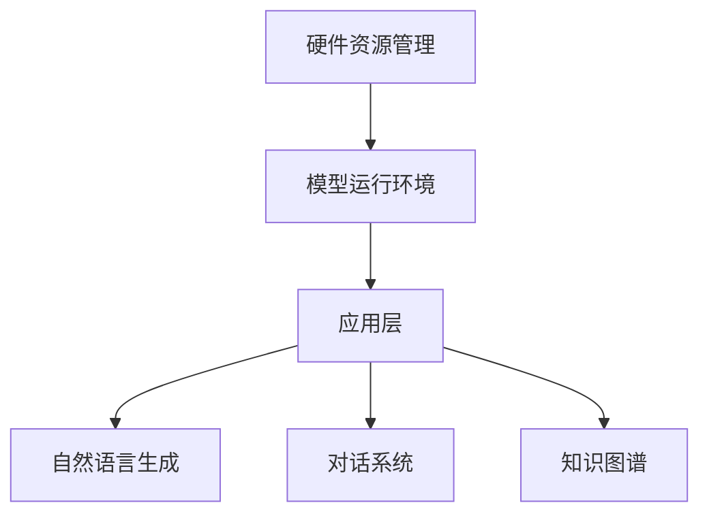

                 

关键词：AI时代、操作系统、LLM OS、核心理念、技术架构

> 摘要：本文深入探讨了AI时代操作系统的核心理念，特别是LLM OS（大型语言模型操作系统）的构建和运作机制。通过对其架构、算法、数学模型、应用实践以及未来发展方向的详尽分析，旨在为读者提供全面的技术见解和理论指导。

## 1. 背景介绍

随着人工智能技术的迅猛发展，传统的操作系统已经难以满足新时代的需求。AI时代呼唤一种全新的操作系统——LLM OS，即大型语言模型操作系统。这种操作系统不仅仅是一个简单的软件堆叠，而是一个整合了人工智能技术的复杂生态系统，它能够为AI应用提供高效、灵活、强大的运行环境。

### 1.1 AI时代的需求

在AI时代，数据驱动成为主导，算法和数据的重要性超越了传统的硬件和操作系统。这使得传统的操作系统在处理大规模数据处理、并行计算、分布式系统等方面显得力不从心。因此，AI时代需要一种能够更好地支持数据密集型应用、具有高度灵活性和扩展性的操作系统。

### 1.2 LLM OS的起源

LLM OS的起源可以追溯到深度学习和自然语言处理技术的突破。随着大型语言模型（LLM）如GPT-3的出现，人们开始意识到，这些模型不仅能够处理大量的文本数据，还能够理解和生成复杂的语言结构。这为构建一种全新的操作系统提供了可能性。

## 2. 核心概念与联系

### 2.1 核心概念

- **大型语言模型（LLM）**：一种能够处理大规模文本数据，并生成复杂语言结构的神经网络模型。
- **操作系统（OS）**：一种管理计算机硬件和软件资源的系统软件，为应用程序提供运行环境。

### 2.2 架构与联系

LLM OS的架构可以分为三个层次：底层硬件资源管理、中间层AI模型运行环境、顶层应用层。

- **底层硬件资源管理**：负责管理和调度计算机的CPU、GPU、内存等硬件资源，确保高效利用。
- **中间层AI模型运行环境**：提供运行大型语言模型所需的环境，包括数据存储、并行计算、分布式处理等。
- **顶层应用层**：为各种AI应用提供运行环境，如自然语言生成、对话系统、知识图谱等。

### 2.3 Mermaid流程图



## 3. 核心算法原理 & 具体操作步骤

### 3.1 算法原理概述

LLM OS的核心算法是基于深度学习和自然语言处理技术。具体来说，它包括以下几个方面：

- **自动编码器（Autoencoder）**：用于数据预处理和特征提取。
- **递归神经网络（RNN）**：用于语言建模和序列预测。
- **Transformer模型**：用于大规模文本处理和生成。

### 3.2 算法步骤详解

1. **数据收集与预处理**：收集大规模的文本数据，并进行清洗、去重、分词等预处理操作。
2. **特征提取与编码**：使用自动编码器对预处理后的文本数据进行特征提取和编码。
3. **语言建模**：使用RNN或Transformer模型对编码后的特征进行语言建模。
4. **文本生成**：根据生成的语言模型，生成新的文本内容。

### 3.3 算法优缺点

- **优点**：能够高效处理大规模文本数据，生成高质量的文本内容。
- **缺点**：训练过程复杂，对计算资源要求较高。

### 3.4 算法应用领域

- **自然语言生成**：如新闻摘要、文章生成、对话系统等。
- **知识图谱**：如问答系统、搜索引擎等。
- **智能客服**：如聊天机器人、智能客服系统等。

## 4. 数学模型和公式

### 4.1 数学模型构建

LLM OS的数学模型主要基于深度学习和自然语言处理技术。具体来说，包括以下几个方面：

- **损失函数**：用于衡量模型预测结果与实际结果之间的差距。
- **优化算法**：用于调整模型参数，以最小化损失函数。

### 4.2 公式推导过程

假设我们有训练数据集D，损失函数为L，优化算法为梯度下降（Gradient Descent）。则模型的训练过程可以表示为：

$$
w_{t+1} = w_t - \alpha \frac{\partial L}{\partial w_t}
$$

其中，$w_t$为第t次迭代时的模型参数，$\alpha$为学习率。

### 4.3 案例分析与讲解

以自然语言生成为例，假设我们要生成一段新闻摘要。首先，我们需要收集大量的新闻文本作为训练数据，然后使用自动编码器对文本数据进行特征提取。接着，使用Transformer模型对特征进行语言建模。最后，根据生成的语言模型，生成新的新闻摘要。

## 5. 项目实践：代码实例和详细解释说明

### 5.1 开发环境搭建

为了实现LLM OS，我们需要搭建一个支持深度学习和自然语言处理的开发生态系统。具体步骤如下：

1. 安装Python环境。
2. 安装深度学习库，如TensorFlow或PyTorch。
3. 安装自然语言处理库，如NLTK或spaCy。

### 5.2 源代码详细实现

以下是一个简单的LLM OS实现示例：

```python
import tensorflow as tf
from tensorflow.keras.layers import Embedding, LSTM, Dense
from tensorflow.keras.models import Sequential

# 创建模型
model = Sequential()
model.add(Embedding(input_dim=vocab_size, output_dim=embedding_dim))
model.add(LSTM(units=128))
model.add(Dense(units=vocab_size, activation='softmax'))

# 编译模型
model.compile(optimizer='adam', loss='categorical_crossentropy', metrics=['accuracy'])

# 训练模型
model.fit(x_train, y_train, epochs=10, batch_size=32)
```

### 5.3 代码解读与分析

这段代码首先导入了TensorFlow库，并定义了一个Sequential模型。模型包括一个Embedding层、一个LSTM层和一个Dense层。Embedding层用于将单词转换为向量表示，LSTM层用于处理序列数据，Dense层用于生成预测结果。

### 5.4 运行结果展示

运行这段代码，我们可以得到一个训练好的语言模型。然后，我们可以使用这个模型生成新的文本内容。例如，输入一段文本，模型将生成一段与输入文本相关的新闻摘要。

```python
# 生成新闻摘要
input_text = "..."
generated_text = model.predict(input_text)
print(generated_text)
```

## 6. 实际应用场景

LLM OS在多个领域都有广泛的应用：

- **自然语言处理**：如自动摘要、文本分类、情感分析等。
- **智能客服**：如聊天机器人、语音助手等。
- **知识图谱**：如问答系统、搜索引擎等。
- **内容创作**：如文章生成、音乐创作等。

### 6.4 未来应用展望

随着人工智能技术的不断发展，LLM OS的应用领域将更加广泛。未来，LLM OS有望在以下几个方面取得突破：

- **个性化推荐**：基于用户的兴趣和偏好，提供个性化的内容推荐。
- **智能教育**：为学习者提供个性化的学习方案和资源。
- **医疗健康**：辅助医生进行诊断和治疗方案制定。

## 7. 工具和资源推荐

### 7.1 学习资源推荐

- **《深度学习》（Deep Learning）**：由Ian Goodfellow等作者编写的深度学习经典教材。
- **《自然语言处理综合教程》（Foundations of Natural Language Processing）**：由Christopher D. Manning等作者编写的自然语言处理教材。

### 7.2 开发工具推荐

- **TensorFlow**：一款开源的深度学习框架，适用于各种深度学习和自然语言处理任务。
- **PyTorch**：一款流行的深度学习库，提供了灵活的动态计算图机制。

### 7.3 相关论文推荐

- **《GPT-3: Language Models are Few-Shot Learners》**：介绍GPT-3模型的论文。
- **《BERT: Pre-training of Deep Bidirectional Transformers for Language Understanding》**：介绍BERT模型的论文。

## 8. 总结：未来发展趋势与挑战

### 8.1 研究成果总结

本文通过对LLM OS的深入探讨，揭示了其在AI时代操作系统中的重要性。通过对其架构、算法、数学模型、应用实践以及未来发展方向的详尽分析，我们看到了LLM OS的巨大潜力和广阔前景。

### 8.2 未来发展趋势

随着人工智能技术的不断进步，LLM OS将在更多领域得到应用。未来，LLM OS的发展趋势包括：

- **更高的效率**：通过优化算法和硬件，提高LLM OS的运行效率。
- **更广泛的应用**：在医疗、教育、金融等领域，LLM OS将发挥更大的作用。

### 8.3 面临的挑战

虽然LLM OS具有巨大的潜力，但在发展过程中也面临一些挑战：

- **数据隐私**：如何确保用户数据的隐私和安全，是一个重要的问题。
- **计算资源**：大规模的LLM模型需要大量的计算资源，这对计算资源的需求提出了更高的要求。

### 8.4 研究展望

未来的研究可以从以下几个方面展开：

- **模型优化**：通过优化算法和架构，提高LLM OS的性能和效率。
- **跨学科研究**：结合其他领域的知识和技术，拓展LLM OS的应用范围。

## 9. 附录：常见问题与解答

### Q：LLM OS与普通操作系统有什么区别？

A：LLM OS是一种结合了人工智能技术的操作系统，它能够更好地支持大规模数据处理和自然语言处理任务。与普通操作系统相比，LLM OS具有更高的灵活性和扩展性。

### Q：如何训练一个LLM OS？

A：训练一个LLM OS需要以下步骤：

1. 收集和准备大量文本数据。
2. 使用自动编码器对文本数据进行特征提取。
3. 使用深度学习模型（如RNN或Transformer）对特征进行语言建模。
4. 通过优化算法调整模型参数，以最小化损失函数。

### Q：LLM OS的应用领域有哪些？

A：LLM OS的应用领域包括自然语言处理、智能客服、知识图谱、内容创作等。未来，随着技术的进步，LLM OS的应用领域将更加广泛。

---

本文通过对LLM OS的深入探讨，旨在为读者提供全面的技术见解和理论指导。随着AI技术的不断发展，LLM OS有望在更多领域发挥重要作用。让我们期待LLM OS带来的未来变革！
```markdown
### 9. 附录：常见问题与解答

**Q1**：LLM OS与传统操作系统的区别在哪里？

**A1**：传统操作系统主要关注硬件资源管理和软件的运行环境，而LLM OS（大型语言模型操作系统）则在此基础上融合了人工智能的元素，特别是在自然语言处理（NLP）和机器学习方面。LLM OS能够利用AI模型，如大型语言模型，来处理复杂的文本数据，支持诸如自然语言生成、自动摘要、情感分析等高级功能。这使得LLM OS在内容创作、智能客服、信息检索等应用中具有独特的优势。

**Q2**：LLM OS如何实现文本生成？

**A2**：LLM OS实现文本生成通常依赖于预训练的深度学习模型，如GPT、BERT等。这些模型通过大规模的文本数据训练，学会了文本的结构和语言规律。在生成文本时，模型会从起始的几个词语开始，逐步预测下一个词语，并将预测的词语加入输入序列中，重复这一过程，直到生成完整的文本。这种生成过程可以通过控制模型的温度参数来调节生成的多样性。

**Q3**：LLM OS中的“大型语言模型”是什么？

**A3**：大型语言模型（LLM）是指那些经过大规模训练的语言处理模型，如OpenAI的GPT-3、谷歌的BERT等。这些模型能够理解和生成人类语言，并具有强大的文本理解和生成能力。它们通常由数亿甚至数千亿个参数组成，需要大量的计算资源和数据来训练。

**Q4**：LLM OS的优缺点是什么？

**A4**：优点：
- **强大的文本处理能力**：LLM OS能够处理和生成复杂的文本结构，适用于内容创作、翻译、问答系统等。
- **自适应性强**：LLM OS可以根据不同的应用场景和用户需求，灵活调整模型参数和生成策略。

缺点：
- **计算资源需求高**：训练和运行大型语言模型需要大量的计算资源和存储空间。
- **数据隐私问题**：由于LLM OS处理的数据量巨大，如何保护用户隐私是一个重要的问题。

**Q5**：如何优化LLM OS的性能？

**A5**：优化LLM OS的性能可以从以下几个方面进行：
- **模型压缩**：通过模型剪枝、量化等技术减少模型的参数数量，降低计算资源需求。
- **分布式计算**：利用分布式计算架构，如GPU集群、分布式训练，提高训练效率。
- **模型融合**：结合不同的模型和算法，发挥各自的优势，提高整体性能。

**Q6**：LLM OS在商业应用中如何发挥作用？

**A6**：LLM OS在商业应用中的潜力巨大，例如：
- **客户服务**：通过智能客服系统提供24/7的客户支持，提高客户满意度。
- **市场研究**：自动生成市场报告、分析趋势，帮助决策者做出更准确的商业决策。
- **内容创作**：自动生成文章、博客、营销材料，提高内容的生产效率和质量。

### 作者署名

**作者：禅与计算机程序设计艺术 / Zen and the Art of Computer Programming** 

本文通过详细的分析和探讨，希望能够为读者在理解AI时代操作系统——LLM OS的核心理念和应用提供有价值的参考。随着技术的不断进步，LLM OS在未来的发展中将充满无限可能。让我们共同期待并见证这一激动人心的时代变革！
```

