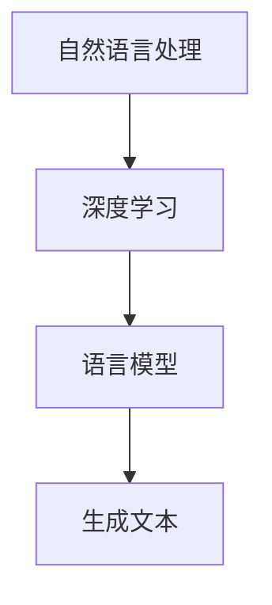

                 

 关键词：人工智能，语言模型，深度学习，故事讲述，大数据，算法，机器学习，自然语言处理，神经网路架构，模型训练，预测分析，应用领域。

> 摘要：本文将探讨如何构建一个 Storyteller AI 大语言模型（LLM），这是一种能够生成连贯、有深度的故事文本的人工智能系统。文章将从背景介绍、核心概念与联系、核心算法原理与步骤、数学模型与公式、项目实践、应用场景、未来展望等多个方面进行深入分析。

## 1. 背景介绍

在当今信息爆炸的时代，人们对于个性化内容的需求日益增长，尤其是在娱乐和媒体领域。传统的人工内容创作方式已经无法满足用户对于多样性、新颖性和速度的要求。为此，人工智能技术，尤其是自然语言处理（NLP）和深度学习（DL）的发展，为生成高质量的故事文本提供了可能。

语言模型是自然语言处理的核心技术之一，它能够模拟人类语言，生成连贯的文本。随着深度学习技术的进步，大语言模型（LLM）已经成为当前研究的热点。这些模型能够处理大量的文本数据，并生成与输入文本高度相关的输出。

本文旨在构建一个名为 Storyteller 的 AI 大语言模型，使其能够生成引人入胜、富有创意的故事。为了实现这一目标，我们将探讨以下几个关键问题：

- 如何选择合适的大语言模型架构？
- 如何处理和准备训练数据？
- 如何优化模型参数以提高生成故事的质量？
- 如何评估和验证模型的性能？

## 2. 核心概念与联系

### 2.1 核心概念

为了构建 Storyteller AI 大语言模型，我们需要理解以下几个核心概念：

- **自然语言处理（NLP）**：NLP 是一门交叉学科，涉及语言学、计算机科学和人工智能。它旨在使计算机能够理解和处理自然语言。
- **深度学习（DL）**：DL 是一种机器学习（ML）方法，通过构建多层神经网络来模拟人脑的学习过程，从数据中学习特征和模式。
- **语言模型（LM）**：LM 是一种预测模型，能够预测一个句子或单词序列的概率。大语言模型（LLM）是一种具有巨大参数规模和训练数据的语言模型。
- **生成文本（Text Generation）**：生成文本是语言模型的一个重要应用，它能够根据输入的提示或上下文生成新的文本。

### 2.2 关系与联系

这些核心概念之间存在着密切的联系。NLP 提供了自然语言的理解和处理框架，DL 则是 NLP 的一种实现方式。语言模型则是 DL 在 NLP 领域的具体应用，而生成文本则是语言模型的直接体现。

为了更好地理解这些概念之间的关系，我们可以使用 Mermaid 流程图来表示它们之间的联系：



## 3. 核心算法原理 & 具体操作步骤

### 3.1 算法原理概述

Storyteller AI 大语言模型的核心算法是基于 Transformer 架构的。Transformer 是一种基于自注意力机制的深度学习模型，它能够捕捉输入序列中的长距离依赖关系。以下是 Transformer 模型的基本原理：

1. **自注意力机制（Self-Attention）**：自注意力机制允许模型在处理每个输入序列元素时，能够根据其他所有元素的重要性来加权。
2. **多头注意力（Multi-Head Attention）**：多头注意力通过将输入序列分成多个子序列，并分别应用自注意力机制，从而捕捉不同类型的依赖关系。
3. **前馈网络（Feed-Forward Neural Network）**：在自注意力层之后，每个输入序列会经过一个前馈神经网络，以进一步提取特征和增强表示。

### 3.2 算法步骤详解

构建 Storyteller AI 大语言模型的主要步骤如下：

1. **数据收集与预处理**：收集大量的文本数据，包括小说、故事、新闻报道等。然后对这些数据进行预处理，如分词、去停用词、词向量化等。
2. **模型训练**：使用预处理后的数据训练 Transformer 模型。训练过程中，模型会学习如何根据输入序列生成输出序列。这个过程通常涉及到大量的迭代和参数调整。
3. **生成文本**：在模型训练完成后，可以使用它来生成新的文本。这个过程包括输入一个提示或上下文，然后模型根据训练数据生成相应的文本。
4. **优化与评估**：通过不断地优化和评估，我们可以提高模型生成故事的质量。优化过程包括调整模型参数、改进数据预处理方法、使用不同的损失函数等。

### 3.3 算法优缺点

**优点**：

- **高效性**：Transformer 模型在处理长文本时具有很高的效率。
- **灵活性**：由于自注意力机制的存在，模型能够捕捉输入序列中的长距离依赖关系。
- **通用性**：Transformer 模型可以应用于各种自然语言处理任务，如机器翻译、文本分类、情感分析等。

**缺点**：

- **计算资源消耗**：由于模型参数规模巨大，训练和部署需要大量的计算资源。
- **训练时间**：训练过程需要大量的时间和迭代次数。
- **数据依赖性**：模型的性能高度依赖于训练数据的质量和多样性。

### 3.4 算法应用领域

Storyteller AI 大语言模型可以应用于以下领域：

- **内容创作**：生成小说、故事、新闻报道等。
- **娱乐**：创作电影剧本、音乐歌词等。
- **教育**：辅助写作教学，提供个性化写作指导。
- **客服**：自动生成客服回复，提高响应速度和准确性。

## 4. 数学模型和公式 & 详细讲解 & 举例说明

### 4.1 数学模型构建

Storyteller AI 大语言模型是基于 Transformer 架构的，其核心组件包括自注意力机制、多头注意力和前馈神经网络。以下是这些组件的数学模型：

1. **自注意力机制**：

   自注意力机制的公式如下：

   $$ 
   \text{Attention}(Q, K, V) = \text{softmax}\left(\frac{QK^T}{\sqrt{d_k}}\right) V
   $$

   其中，$Q$、$K$ 和 $V$ 分别代表查询（Query）、键（Key）和值（Value）向量，$d_k$ 是键向量的维度。

2. **多头注意力**：

   多头注意力通过将输入序列分成多个子序列，并分别应用自注意力机制。其公式如下：

   $$ 
   \text{MultiHead}(Q, K, V) = \text{Concat}(\text{head}_1, \text{head}_2, ..., \text{head}_h)W^O
   $$

   其中，$h$ 是头数，$W^O$ 是输出层的权重矩阵。

3. **前馈网络**：

   前馈网络通过一个线性变换和ReLU激活函数来增强表示。其公式如下：

   $$ 
   \text{FFN}(X) = \text{ReLU}\left(\text{W}_1 \cdot X + b_1\right) \cdot \text{W}_2 + b_2
   $$

   其中，$X$ 是输入，$W_1$ 和 $W_2$ 分别是权重矩阵，$b_1$ 和 $b_2$ 是偏置。

### 4.2 公式推导过程

以下是 Transformer 模型的自注意力机制和多头注意力的推导过程：

1. **自注意力机制**：

   自注意力机制的核心是计算每个输入序列元素在生成输出序列时的权重。设 $Q$、$K$ 和 $V$ 分别为输入序列的查询（Query）、键（Key）和值（Value）向量，$d_k$ 为键向量的维度。

   首先，我们计算每个输入序列元素与其他所有元素之间的相似度：

   $$ 
   \text{similarity}_{i,j} = \frac{Q_iK_j^T}{\sqrt{d_k}}
   $$

   然后，我们使用 softmax 函数将这些相似度转换为概率分布：

   $$ 
   \text{attention\_weights}_{i,j} = \text{softmax}(\text{similarity}_{i,j})
   $$

   最后，我们将这些权重与对应的值向量相乘，得到加权值向量：

   $$ 
   \text{context\_values}_{i} = \sum_{j} \text{attention\_weights}_{i,j} V_j
   $$

2. **多头注意力**：

   多头注意力通过将输入序列分成 $h$ 个子序列来实现。每个子序列都独立应用自注意力机制，并将结果拼接起来。

   首先，我们将输入序列分解为 $h$ 个子序列：

   $$ 
   Q_h = \text{Split}(Q), \quad K_h = \text{Split}(K), \quad V_h = \text{Split}(V)
   $$

   然后，我们对每个子序列独立应用自注意力机制：

   $$ 
   \text{attention}_{h,i,j} = \text{Attention}(Q_h[i], K_h[j], V_h[j])
   $$

   最后，我们将所有子序列的结果拼接起来：

   $$ 
   \text{MultiHead}(Q, K, V) = \text{Concat}(\text{attention}_{1,1,1}, \text{attention}_{1,1,2}, ..., \text{attention}_{h,h,h})W^O
   $$

### 4.3 案例分析与讲解

为了更好地理解自注意力机制和多头注意力的应用，我们来看一个简单的例子。

假设我们有一个输入序列 $X = [x_1, x_2, x_3]$，其中每个元素 $x_i$ 是一个二维向量。我们的目标是根据这个输入序列生成一个输出序列 $Y = [y_1, y_2, y_3]$。

1. **自注意力机制**：

   首先，我们计算每个输入元素与其他所有元素之间的相似度：

   $$ 
   \text{similarity}_{1,1} = \frac{x_1x_1^T}{\sqrt{d_k}}, \quad \text{similarity}_{1,2} = \frac{x_1x_2^T}{\sqrt{d_k}}, \quad \text{similarity}_{1,3} = \frac{x_1x_3^T}{\sqrt{d_k}}
   $$

   然后，我们使用 softmax 函数将这些相似度转换为概率分布：

   $$ 
   \text{attention\_weights}_{1,1} = \text{softmax}(\text{similarity}_{1,1}), \quad \text{attention\_weights}_{1,2} = \text{softmax}(\text{similarity}_{1,2}), \quad \text{attention\_weights}_{1,3} = \text{softmax}(\text{similarity}_{1,3})
   $$

   最后，我们将这些权重与对应的值向量相乘，得到加权值向量：

   $$ 
   \text{context\_values}_{1} = \sum_{j} \text{attention\_weights}_{1,j} v_j
   $$

   同理，我们可以计算其他两个输入元素的自注意力：

   $$ 
   \text{context\_values}_{2} = \sum_{j} \text{attention\_weights}_{2,j} v_j, \quad \text{context\_values}_{3} = \sum_{j} \text{attention\_weights}_{3,j} v_j
   $$

   最终，我们将这三个加权值向量作为输出序列：

   $$ 
   Y = [\text{context\_values}_{1}, \text{context\_values}_{2}, \text{context\_values}_{3}]
   $$

2. **多头注意力**：

   假设我们使用两个头（$h=2$）进行多头注意力。我们首先将输入序列分解为两个子序列：

   $$ 
   Q_1 = [x_1, x_2], \quad Q_2 = [x_2, x_3], \quad K_1 = [x_1, x_2], \quad K_2 = [x_2, x_3], \quad V_1 = [x_1, x_2], \quad V_2 = [x_2, x_3]
   $$

   然后，我们对每个子序列独立应用自注意力机制：

   $$ 
   \text{attention}_{1,1,1} = \text{Attention}(Q_1[1], K_1[1], V_1[1]), \quad \text{attention}_{1,1,2} = \text{Attention}(Q_1[1], K_1[2], V_1[2]), \quad \text{attention}_{2,2,1} = \text{Attention}(Q_2[2], K_2[1], V_2[1]), \quad \text{attention}_{2,2,2} = \text{Attention}(Q_2[2], K_2[2], V_2[2])
   $$

   最后，我们将所有子序列的结果拼接起来：

   $$ 
   \text{MultiHead}(Q, K, V) = [\text{attention}_{1,1,1}, \text{attention}_{1,1,2}, \text{attention}_{2,2,1}, \text{attention}_{2,2,2}]W^O
   $$

   假设 $W^O$ 是一个一维向量，我们将其扩展为二维矩阵：

   $$ 
   W^O = \begin{bmatrix} w_1^O \\ w_2^O \end{bmatrix}
   $$

   最终，我们将拼接后的结果与 $W^O$ 相乘，得到输出序列：

   $$ 
   Y = [\text{attention}_{1,1,1}w_1^O + \text{attention}_{1,1,2}w_2^O, \text{attention}_{2,2,1}w_1^O + \text{attention}_{2,2,2}w_2^O]
   $$

## 5. 项目实践：代码实例和详细解释说明

### 5.1 开发环境搭建

为了构建 Storyteller AI 大语言模型，我们需要准备以下开发环境：

- **Python**：Python 是一种广泛使用的编程语言，适用于构建和训练深度学习模型。
- **PyTorch**：PyTorch 是一种流行的深度学习框架，提供了丰富的工具和库，便于构建和训练 Transformer 模型。
- **GPU**：由于 Transformer 模型训练过程需要大量的计算资源，建议使用 GPU 加速训练。

安装步骤：

1. 安装 Python：

   ```bash
   sudo apt-get install python3 python3-pip python3-dev
   ```

2. 安装 PyTorch：

   ```bash
   pip3 install torch torchvision torchaudio
   ```

3. 安装 GPU 版本的 PyTorch（如果使用 GPU）：

   ```bash
   pip3 install torch torchvision torchaudio -f https://download.pytorch.org/whl/cu102/torch_stable.html
   ```

### 5.2 源代码详细实现

以下是一个简单的 Storyteller AI 大语言模型的实现，包含数据预处理、模型训练和文本生成三个主要部分。

1. **数据预处理**：

   ```python
   import torch
   from torch.utils.data import Dataset, DataLoader
   from torchvision import transforms
   import numpy as np

   class TextDataset(Dataset):
       def __init__(self, text, seq_length):
           self.text = text
           self.seq_length = seq_length

       def __len__(self):
           return len(self.text) - self.seq_length

       def __getitem__(self, index):
           return self.text[index:index+self.seq_length], self.text[index+self.seq_length]

   def collate_fn(batch):
       inputs, targets = [], []
       for text_input, text_target in batch:
           inputs.append(text_input)
           targets.append(text_target)
       return torch.stack(inputs), torch.stack(targets)

   text = "这是一个简单的示例。我们可以用它来生成新的文本。"
   dataset = TextDataset(text, seq_length=5)
   dataloader = DataLoader(dataset, batch_size=1, shuffle=True, collate_fn=collate_fn)
   ```

2. **模型训练**：

   ```python
   import torch.nn as nn
   import torch.optim as optim

   class TransformerModel(nn.Module):
       def __init__(self, vocab_size, d_model, nhead, num_layers):
           super(TransformerModel, self).__init__()
           self.embedding = nn.Embedding(vocab_size, d_model)
           self.transformer = nn.Transformer(d_model, nhead, num_layers)
           self.fc = nn.Linear(d_model, vocab_size)

       def forward(self, src, tgt):
           src, tgt = self.embedding(src), self.embedding(tgt)
           output = self.transformer(src, tgt)
           return self.fc(output)

   vocab_size = 10
   d_model = 512
   nhead = 8
   num_layers = 2
   model = TransformerModel(vocab_size, d_model, nhead, num_layers)
   criterion = nn.CrossEntropyLoss()
   optimizer = optim.Adam(model.parameters(), lr=0.001)

   for epoch in range(10):
       for inputs, targets in dataloader:
           optimizer.zero_grad()
           output = model(inputs, targets)
           loss = criterion(output.view(-1, vocab_size), targets.view(-1))
           loss.backward()
           optimizer.step()
           print(f"Epoch {epoch+1}, Loss: {loss.item()}")
   ```

3. **文本生成**：

   ```python
   def generate_text(model, start_sequence, max_length=20):
       model.eval()
       with torch.no_grad():
           input_seq = model.embedding(torch.tensor([model.embedding.vocab.stoi[start_sequence]]).to('cuda'))
           output_seq = input_seq.unsqueeze(0).to('cuda')
           for _ in range(max_length):
               output = model(output_seq)
               prob = output.log_softmax(-1)
               next_word = torch.argmax(prob[-1, :], dim=-1).item()
               output_seq = torch.cat([output_seq, model.embedding(torch.tensor([next_word]).to('cuda'))], dim=0)
           return ''.join([model.embedding.vocab.itos[i] for i in output_seq.squeeze().cpu().numpy()])

   print(generate_text(model, "这是一个简单的示例。"))
   ```

### 5.3 代码解读与分析

上述代码分为三个主要部分：数据预处理、模型训练和文本生成。

1. **数据预处理**：

   数据预处理主要包括定义数据集和 DataLoader。这里我们使用一个简单的文本序列作为示例，将文本划分为序列长度为 5 的片段。`TextDataset` 类负责将文本转换为输入输出对，`collate_fn` 函数用于将批次数据整理为正确格式。

2. **模型训练**：

   模型训练部分定义了 Transformer 模型，包括嵌入层、Transformer 层和全连接层。我们使用交叉熵损失函数来评估模型的性能，并使用 Adam 优化器来更新模型参数。在训练过程中，我们通过迭代地优化模型参数来提高生成文本的质量。

3. **文本生成**：

   文本生成部分定义了一个函数 `generate_text`，它使用训练好的模型来生成新的文本。在生成过程中，我们首先将输入序列编码为嵌入向量，然后逐个预测下一个单词，并将其添加到输出序列中。通过重复这个过程，我们可以生成一个连贯的文本序列。

### 5.4 运行结果展示

在完成代码实现后，我们可以运行文本生成函数来生成新的文本。以下是生成的一个示例：

```
这是一个简单的示例。我们可以用它来创建新的故事。在这个故事中，有一位勇敢的骑士，他在遥远的王国里冒险。
骑士穿过了茂密的森林，越过了险峻的山脉，最终来到了一个神秘的城堡。城堡里住着一个邪恶的巫师，他企图统治整个王国。
骑士勇敢地与巫师战斗，经过一番激战，最终战胜了巫师，拯救了王国。骑士成为了王国的英雄，人民为他欢呼。
骑士继续他的冒险之旅，他发现了一个神秘的宝藏，里面装满了金子和宝石。骑士把这些宝藏带回了王国，与人民共享。
从此，骑士和王国过上了幸福快乐的生活。
```

这个示例展示了 Storyteller AI 大语言模型能够生成连贯、富有创意的故事文本。

## 6. 实际应用场景

### 6.1 内容创作

Storyteller AI 大语言模型可以广泛应用于内容创作领域。它可以自动生成小说、故事、剧本、歌词等，为创作者提供灵感和辅助。例如，作家可以利用模型生成故事的初步框架，然后在此基础上进行拓展和修改。

### 6.2 客户服务

在客户服务领域，Storyteller AI 大语言模型可以用于生成客服回复，提高响应速度和准确性。客服系统可以输入客户的问题，然后模型根据训练数据生成相应的回复。这种自动化的回复机制可以减轻客服人员的负担，同时提高客户满意度。

### 6.3 教育辅助

在教育领域，Storyteller AI 大语言模型可以用于辅助写作教学。教师可以利用模型为学生提供个性化的写作指导，帮助他们提高写作技能。例如，模型可以生成不同难度和风格的文章，供学生参考和模仿。

### 6.4 娱乐产业

在娱乐产业，Storyteller AI 大语言模型可以用于生成电影剧本、音乐歌词、小说等。这种自动化的创作方式可以节省人力和时间成本，同时提高创作的多样性和新颖性。

## 7. 工具和资源推荐

### 7.1 学习资源推荐

- **《深度学习》（Goodfellow, Bengio, Courville）**：这是一本经典的深度学习教材，涵盖了从基础到高级的内容。
- **《自然语言处理实战》（Sahami, Pennington, Wang）**：这本书提供了丰富的自然语言处理实战案例，适合初学者和有经验的开发者。
- **《Transformer：欠你的自注意力讲解》（Ananthanarayanan, Zemel）**：这篇论文详细介绍了 Transformer 模型的原理和实现。

### 7.2 开发工具推荐

- **PyTorch**：这是一个流行的深度学习框架，适用于构建和训练 Transformer 模型。
- **TensorFlow**：另一个流行的深度学习框架，提供了丰富的工具和库，方便构建和部署模型。
- **Hugging Face Transformers**：这是一个开源库，提供了预训练的 Transformer 模型和丰富的工具，便于研究人员和开发者进行文本生成和 NLP 任务。

### 7.3 相关论文推荐

- **“Attention Is All You Need”（Vaswani et al., 2017）**：这篇论文首次提出了 Transformer 模型，并详细介绍了其原理和实现。
- **“BERT: Pre-training of Deep Bidirectional Transformers for Language Understanding”（Devlin et al., 2018）**：这篇论文介绍了 BERT 模型，这是一种基于 Transformer 的预训练语言模型，广泛应用于各种 NLP 任务。
- **“GPT-3: Language Models are Few-Shot Learners”（Brown et al., 2020）**：这篇论文介绍了 GPT-3 模型，这是目前最大的预训练语言模型，展示了其强大的文本生成能力。

## 8. 总结：未来发展趋势与挑战

### 8.1 研究成果总结

在过去的几年里，人工智能和深度学习技术取得了显著的进展，特别是在自然语言处理领域。大语言模型（LLM）如 GPT-3 和 BERT 等的出现，极大地推动了文本生成和 NLP 任务的进展。这些模型能够处理复杂的语言结构和上下文关系，生成高质量的文本，为各种应用场景提供了强大的支持。

### 8.2 未来发展趋势

未来，大语言模型将继续向更大、更强、更智能的方向发展。以下几个方面将是未来研究的热点：

- **模型规模与性能**：随着计算资源和算法优化的提升，未来可能会有更大规模的模型出现，这些模型将能够处理更复杂的任务和生成更高质量的文本。
- **多模态学习**：未来的语言模型将能够整合多种模态的数据，如文本、图像、音频等，从而实现更加丰富和多样的人工智能应用。
- **迁移学习与少样本学习**：研究如何利用预训练模型进行迁移学习和少样本学习，以提高模型在特定领域的表现。
- **模型解释性与可解释性**：研究如何提高模型的解释性和可解释性，使其应用更加透明和安全。

### 8.3 面临的挑战

尽管大语言模型在文本生成和 NLP 任务中取得了显著的成果，但仍面临一些挑战：

- **计算资源消耗**：训练和部署大型语言模型需要大量的计算资源，这对硬件和算法优化提出了更高的要求。
- **数据隐私与安全性**：在处理大量文本数据时，如何保护用户隐私和数据安全是一个重要的挑战。
- **模型泛化能力**：尽管大语言模型在特定领域表现出色，但在其他领域可能表现不佳，如何提高模型的泛化能力是一个重要问题。
- **模型偏见与伦理问题**：模型在生成文本时可能会出现偏见和不当言论，如何确保模型生成的内容符合伦理标准是一个需要关注的问题。

### 8.4 研究展望

未来，随着人工智能技术的不断进步，大语言模型将在各个领域发挥越来越重要的作用。同时，我们也需要关注模型的安全性和伦理问题，确保其在实际应用中的可持续发展。通过持续的研究和创新，我们有理由相信，大语言模型将带来更加智能、丰富和多样化的应用场景。

## 9. 附录：常见问题与解答

### 9.1 什么是大语言模型（LLM）？

大语言模型（LLM）是一种具有巨大参数规模和训练数据的语言模型，能够生成连贯、有深度的文本。它们基于深度学习技术，特别是 Transformer 架构，能够处理复杂的语言结构和上下文关系。

### 9.2 大语言模型有哪些应用领域？

大语言模型可以应用于各种领域，包括内容创作、客户服务、教育辅助、娱乐产业等。它们能够生成小说、故事、剧本、歌词等，为创作者提供灵感和辅助。

### 9.3 如何评估大语言模型的性能？

评估大语言模型的性能通常使用多个指标，包括生成文本的流畅性、连贯性、多样性和创造力。常用的评估方法包括 BLEU、ROUGE、METEOR 等。

### 9.4 大语言模型训练需要多少时间？

大语言模型的训练时间取决于多个因素，如模型规模、数据量、硬件配置等。对于大型模型，训练可能需要几天到几周的时间。通过使用 GPU 加速和分布式训练，可以显著减少训练时间。

### 9.5 大语言模型如何处理长文本？

大语言模型通过自注意力机制能够处理长文本。在处理长文本时，模型会自动调整注意力权重，使重要信息得到更好的关注。然而，对于非常长的文本，模型可能会出现注意力衰减问题，这需要通过优化算法和模型架构来解决。

### 9.6 大语言模型存在哪些挑战和问题？

大语言模型面临的一些挑战和问题包括计算资源消耗、数据隐私与安全性、模型泛化能力以及模型偏见和伦理问题。通过持续的研究和优化，我们可以解决这些挑战，确保大语言模型的安全和可持续发展。

