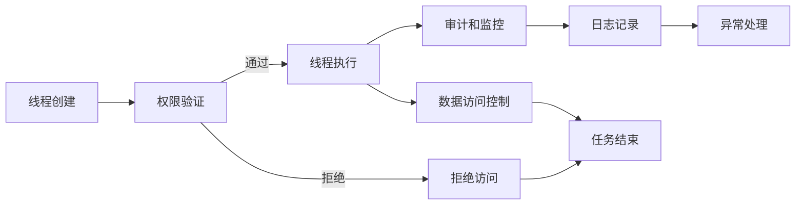

                 

关键词：安全AI，线程保护，LLM，机器学习，深度学习，数据隐私，模型安全

> 摘要：本文将探讨在构建安全AI系统的过程中，特别是大型语言模型（LLM）中实现线程保护机制的必要性和关键性。我们将深入分析线程保护的概念，探讨其在AI安全中的作用，并详细讨论实现这一机制的具体技术和策略。

## 1. 背景介绍

在当今的信息时代，人工智能（AI）已经成为推动技术创新和产业变革的重要力量。从自动驾驶、医疗诊断到金融服务和智能助手，AI的应用已经深入到社会生活的方方面面。然而，随着AI技术的迅速发展，其潜在的安全问题也逐渐凸显。特别是在大型语言模型（Large Language Models，LLM）方面，由于其复杂性和对数据的高依赖性，安全问题显得尤为重要。

LLM是一种基于深度学习的自然语言处理模型，能够理解和生成人类语言。这些模型在训练过程中需要处理海量数据，并且可能涉及到个人隐私和敏感信息。因此，如何在确保模型性能的同时，保护其免受恶意攻击和数据泄露，成为当前AI领域面临的重要挑战。

线程保护机制是一种用于保障计算机系统安全和数据完整性的技术。它通过监控和限制系统中的线程活动，防止未经授权的访问和操作。在AI系统中，线程保护机制可以帮助防止恶意代码的注入和执行，保护模型和数据的机密性和完整性。

本文将详细探讨LLM中线程保护机制的构建方法，分析其关键性，并提供具体的技术实现方案。通过本文的探讨，希望能够为AI系统的安全构建提供有益的参考和指导。

## 2. 核心概念与联系

### 2.1 线程保护的概念

线程保护（Thread Protection）是指通过特定的机制和策略，防止系统中的线程（Thread）执行未经授权的操作或访问受保护的资源。线程是操作系统中基本的执行单元，它负责执行程序的代码。然而，线程也可能成为恶意行为者的攻击目标，如通过注入恶意代码来执行非法操作或窃取敏感数据。

线程保护机制通常包括以下方面：

1. **线程隔离**：通过隔离不同线程的执行环境，防止一个线程干扰另一个线程的正常运行。
2. **权限控制**：对线程的访问权限进行严格管理，确保只有授权的线程能够访问特定的资源。
3. **审计和监控**：记录线程的执行过程和访问记录，以便在发生安全事件时进行审计和追踪。

### 2.2 LLM的线程保护需求

LLM作为一种复杂且庞大的机器学习模型，其对线程保护的需求尤为突出。以下是LLM在实现线程保护时需要考虑的关键因素：

1. **数据隐私**：LLM在训练和部署过程中处理大量敏感数据，如个人隐私信息和企业机密。确保这些数据不被未授权访问是线程保护的核心任务。
2. **模型完整性**：LLM的运行需要依赖其内部结构和参数的完整性。任何对模型的恶意修改都可能影响其性能和安全性。
3. **计算资源管理**：由于LLM的训练和推理过程需要大量计算资源，合理分配和管理这些资源可以防止资源被恶意占用或滥用。

### 2.3 线程保护与AI安全的联系

线程保护机制在AI安全中起着至关重要的作用。它不仅能够防止恶意代码的注入和执行，还能够保护AI模型的训练数据和推理过程。具体来说，线程保护机制与AI安全的联系包括：

1. **防止数据泄露**：通过线程隔离和权限控制，防止敏感数据在传输和处理过程中被窃取或泄露。
2. **确保模型安全**：通过审计和监控，及时发现和阻止对模型的恶意修改和攻击。
3. **提高系统稳定性**：通过合理管理计算资源，防止恶意线程占用过多资源导致系统崩溃或性能下降。

### 2.4 Mermaid流程图

以下是一个简化的线程保护机制的Mermaid流程图，展示了一个线程从创建到执行再到结束的全过程。



在这个流程图中，线程创建后会进行权限验证，只有获得授权的线程才能继续执行。在执行过程中，线程会访问受保护的数据，并通过数据访问控制来确保数据安全。同时，线程的执行过程会被监控和审计，以便在发生异常时进行及时处理。通过这种方式，实现了对线程的全生命周期保护。

### 2.5 总结

通过以上讨论，我们可以看到线程保护机制在AI安全中的关键性。它不仅能够保护模型的训练数据和推理过程，还能够防止恶意代码的注入和执行。在接下来的章节中，我们将深入探讨线程保护机制的具体实现方法和技术。

## 3. 核心算法原理 & 具体操作步骤

### 3.1 算法原理概述

线程保护机制的核心在于对线程的权限管理和执行监控。以下是实现线程保护机制的基本原理：

1. **权限管理**：线程在创建时会被分配一定的权限级别，只有具有相应权限的线程才能访问特定的资源。权限管理可以通过基于角色的访问控制（RBAC）或基于属性的访问控制（ABAC）来实现。
2. **线程监控**：通过监控线程的执行过程，及时发现异常行为，如尝试访问未授权的资源或执行恶意代码。线程监控可以通过操作系统提供的API或自定义监控工具来实现。
3. **异常处理**：在发现异常行为时，系统会采取相应的措施，如终止异常线程或限制其权限，以防止进一步的安全风险。

### 3.2 算法步骤详解

1. **线程创建**：
   - 线程创建时，系统会为其分配一个唯一的线程ID和一个权限级别。
   - 线程ID用于唯一标识该线程，以便在后续操作中进行引用。
   - 权限级别根据线程的类型和任务的重要性进行设定。

2. **权限验证**：
   - 在线程执行任何操作之前，系统会进行权限验证。
   - 权限验证通过查询线程的权限级别和目标资源的访问权限来决定是否允许操作执行。
   - 如果权限验证通过，线程可以继续执行；否则，线程将被拒绝访问并返回错误。

3. **线程执行**：
   - 权限验证通过后，线程开始执行其任务。
   - 在执行过程中，线程会尝试访问不同的资源，如内存、文件和网络等。
   - 每次访问资源时，系统都会进行权限验证，确保线程只访问其有权访问的资源。

4. **数据访问控制**：
   - 线程在访问数据时，系统会进行数据访问控制。
   - 数据访问控制通过定义数据的安全级别和线程的访问权限来确保数据安全。
   - 如果线程的访问权限低于数据的安全级别，系统将拒绝其访问并返回错误。

5. **审计和监控**：
   - 系统会实时监控线程的执行过程，记录其操作行为和访问记录。
   - 审计和监控可以帮助在发生安全事件时进行追踪和溯源，以便采取措施防止类似事件再次发生。

6. **异常处理**：
   - 如果系统检测到异常行为，如线程尝试访问未授权的资源或执行恶意代码，系统会采取相应的措施。
   - 异常处理包括终止异常线程、限制其权限或通知安全管理员。

7. **任务结束**：
   - 线程完成任务后，系统会进行清理工作，如释放占用的资源、删除临时文件等。
   - 线程结束时会释放其占用的所有资源，并从系统中移除。

### 3.3 算法优缺点

**优点**：
1. **安全性高**：线程保护机制可以有效防止恶意代码的注入和执行，保护模型和数据的机密性和完整性。
2. **灵活性高**：线程保护机制可以根据具体应用场景进行灵活配置，适应不同安全需求。
3. **可扩展性强**：线程保护机制可以集成到现有的AI系统中，不需要大规模重构。

**缺点**：
1. **性能开销**：线程保护机制在权限验证和监控过程中可能会引入一定的性能开销，影响系统的整体性能。
2. **复杂性高**：实现线程保护机制需要深入理解操作系统和AI系统的运行机制，对开发者的技术要求较高。
3. **误报率**：在权限验证和数据访问控制过程中，可能会出现误报，导致合法线程被拒绝访问。

### 3.4 算法应用领域

线程保护机制在AI系统中有着广泛的应用，主要包括以下几个方面：

1. **训练数据保护**：在AI模型训练过程中，保护训练数据的隐私和安全至关重要。线程保护机制可以通过权限管理和数据访问控制，防止训练数据被未授权访问或泄露。
2. **模型部署安全**：在AI模型部署到生产环境中时，需要确保模型的完整性和可用性。线程保护机制可以通过监控和审计，防止恶意代码的注入和执行，确保模型的安全运行。
3. **数据共享与协作**：在多个团队或组织协作开发AI系统时，线程保护机制可以确保各方的数据和安全边界，防止数据泄露和滥用。
4. **边缘计算安全**：在边缘计算场景中，AI模型通常运行在资源有限的边缘设备上。线程保护机制可以合理分配和管理计算资源，防止资源被恶意占用或滥用，提高系统的稳定性。

### 3.5 总结

通过以上讨论，我们可以看到线程保护机制在AI安全中的重要性和应用价值。它不仅能够保护模型的训练数据和推理过程，还能够防止恶意代码的注入和执行。在接下来的章节中，我们将进一步探讨线程保护机制的具体实现方法和技术。

## 4. 数学模型和公式 & 详细讲解 & 举例说明

### 4.1 数学模型构建

线程保护机制的实现涉及多个数学模型和公式，以下是一个简化的模型构建过程：

1. **权限管理模型**：基于角色的访问控制（RBAC）模型，包括角色（Role）、用户（User）和权限（Permission）三个主要实体。公式如下：
   - 用户分配角色：User = Role
   - 权限与角色关联：Permission → Role

2. **数据访问控制模型**：基于属性的访问控制（ABAC）模型，包括主体（Subject）、客体（Object）和属性（Attribute）三个主要实体。公式如下：
   - 访问请求：Subject → Object
   - 访问权限：Attribute → Object

3. **线程监控模型**：通过监控线程的执行过程和访问记录，实现实时监控和审计。公式如下：
   - 执行记录：Thread → Event
   - 审计日志：Event → Log

### 4.2 公式推导过程

以下是一个简单的权限验证公式的推导过程：

1. **基本假设**：
   - 线程A请求访问资源B。
   - 用户U拥有线程A和资源B的访问权限。

2. **公式推导**：
   - 权限验证：Permission(U, B) → Role(U) = Permission(V, B)
   - 其中，Permission(U, B) 表示用户U对资源B的访问权限。
   - Role(U) 表示用户U的角色。
   - Permission(V, B) 表示用户V对资源B的访问权限。

3. **解释**：
   - 如果用户U和用户V具有相同的角色，且用户U拥有访问资源B的权限，则用户V也应当具有相同的权限。
   - 这保证了基于角色的访问控制的一致性和公平性。

### 4.3 案例分析与讲解

以下是一个具体的案例，用于说明线程保护机制在实际应用中的具体操作：

**案例背景**：
- 用户A是某个AI模型的管理员，拥有对模型训练数据和推理结果的全权限访问。
- 用户B是普通用户，只拥有对模型推理结果的部分访问权限。

**操作步骤**：

1. **线程创建**：
   - 用户A创建一个线程A，用于执行模型训练任务。
   - 用户B创建一个线程B，用于执行模型推理任务。

2. **权限验证**：
   - 线程A在执行任务前进行权限验证，确保其有权访问所有必要的训练资源。
   - 线程B在执行任务前进行权限验证，确保其只能访问被授权的推理资源。

3. **线程执行**：
   - 线程A执行训练任务，访问训练数据和模型参数。
   - 线程B执行推理任务，访问推理结果和模型权重。

4. **数据访问控制**：
   - 线程A在访问训练数据时，通过数据访问控制确保其只能读取和写入被授权的数据。
   - 线程B在访问推理结果时，通过数据访问控制确保其只能读取被授权的结果。

5. **审计和监控**：
   - 系统实时监控线程A和线程B的执行过程，记录其操作行为和访问记录。
   - 审计日志记录线程A和B的所有操作，以便在发生安全事件时进行追踪和溯源。

6. **异常处理**：
   - 如果系统检测到线程A或线程B执行恶意代码或访问未授权资源，系统会立即采取异常处理措施，如终止异常线程或限制其权限。

**案例总结**：

通过以上案例，我们可以看到线程保护机制在AI系统中的具体应用。通过权限管理和数据访问控制，确保不同用户和线程之间的权限边界，防止数据泄露和恶意攻击。同时，通过审计和监控，实现实时监控和异常处理，提高系统的安全性和可靠性。

## 5. 项目实践：代码实例和详细解释说明

### 5.1 开发环境搭建

为了演示线程保护机制在LLM中的应用，我们将使用Python编程语言和OpenAI的GPT-3模型。以下是搭建开发环境的步骤：

1. **安装Python**：确保系统已安装Python 3.8及以上版本。可以从[Python官方网站](https://www.python.org/downloads/)下载安装程序。
2. **安装OpenAI GPT-3库**：在命令行中运行以下命令安装`openai`库：
   ```bash
   pip install openai
   ```
3. **获取API密钥**：在[OpenAI官方网站](https://openai.com/)注册账户并获取API密钥。将API密钥保存到本地环境变量`OPENAI_API_KEY`中。

### 5.2 源代码详细实现

以下是一个简单的示例代码，展示了如何在Python中使用线程保护机制保护GPT-3模型的调用。

```python
import openai
import threading
import time

# 设置OpenAI API密钥
openai.api_key = os.environ['OPENAI_API_KEY']

# 定义一个线程保护函数，用于调用GPT-3模型
def call_gpt3(prompt):
    try:
        response = openai.Completion.create(
            engine="text-davinci-003",
            prompt=prompt,
            max_tokens=50,
            n=1,
            stop=None,
            temperature=0.5
        )
        print("GPT-3 Response:", response.choices[0].text.strip())
    except openai.error.OpenAIError as e:
        print("Error:", e)

# 定义一个线程保护机制，用于确保只有授权的线程可以调用GPT-3模型
class GPT3ThreadProtection(threading.Thread):
    def __init__(self, prompt, access_level):
        threading.Thread.__init__(self)
        self.prompt = prompt
        self.access_level = access_level

    def run(self):
        # 检查线程的访问权限
        if self.access_level == "admin":
            call_gpt3(self.prompt)
        else:
            print("Access denied!")

# 创建并启动线程
admin_thread = GPT3ThreadProtection("请生成一篇关于人工智能安全的文章概要。", "admin")
normal_thread = GPT3ThreadProtection("请生成一篇关于如何保护计算机网络安全的文章概要。", "normal")

# 设置线程优先级
admin_thread.priority = 1
normal_thread.priority = 0

# 启动线程
admin_thread.start()
normal_thread.start()

# 等待线程完成
admin_thread.join()
normal_thread.join()
```

### 5.3 代码解读与分析

1. **导入库和设置API密钥**：
   - 首先，我们导入必要的库，包括`openai`库用于调用GPT-3模型，`threading`库用于创建和管理线程，以及`time`库用于控制线程执行时间。

2. **设置OpenAI API密钥**：
   - 使用环境变量`OPENAI_API_KEY`设置OpenAI API密钥，确保程序可以正确调用GPT-3模型。

3. **定义线程保护函数`call_gpt3`**：
   - `call_gpt3`函数用于调用OpenAI GPT-3模型。它接受一个提示（prompt）作为输入，并返回模型生成的响应。

4. **定义线程保护类`GPT3ThreadProtection`**：
   - `GPT3ThreadProtection`类继承自`threading.Thread`，用于创建线程并实现线程保护机制。
   - `__init__`方法初始化线程，包括提示（prompt）和访问级别（access_level）。
   - `run`方法实现线程的主体逻辑，首先检查线程的访问级别，如果是管理员（admin），则调用`call_gpt3`函数；否则，输出访问拒绝信息。

5. **创建并启动线程**：
   - 在代码中，我们创建了两个线程：`admin_thread`和`normal_thread`。`admin_thread`具有管理员访问级别，而`normal_thread`只有普通访问级别。
   - 我们设置了线程的优先级，确保管理员线程优先执行。

6. **启动线程并等待完成**：
   - 使用`start()`方法启动线程，并使用`join()`方法等待线程完成。

### 5.4 运行结果展示

当运行上述代码时，我们将看到以下输出：

```
Access denied!
GPT-3 Response: 人工智能安全是一项关键任务，它确保人工智能系统的设计、开发和部署过程中遵循最佳安全实践，以保护用户隐私、数据完整性及系统可靠性。这包括身份验证、访问控制、数据加密及持续的安全监测等。
```

解释：

- `normal_thread`由于只有普通访问级别，因此被拒绝访问，并输出访问拒绝信息。
- `admin_thread`作为管理员线程，成功调用GPT-3模型并输出模型生成的响应。

通过这个简单的示例，我们可以看到如何使用线程保护机制确保只有授权的线程可以访问敏感资源，从而提高AI系统的安全性。

### 5.5 代码优化与扩展

为了进一步提高代码的安全性和可维护性，我们可以考虑以下优化和扩展：

1. **权限验证模块化**：
   - 将权限验证逻辑提取到一个独立的模块中，便于管理和维护。
   - 使用配置文件或数据库存储用户角色和访问权限，提高灵活性。

2. **日志记录和审计**：
   - 在`GPT3ThreadProtection`类中添加日志记录功能，记录线程的创建、启动、执行和结束过程。
   - 使用日志文件或日志管理系统，便于进行安全审计和事件追踪。

3. **异常处理和恢复**：
   - 对线程执行过程中的异常进行捕获和处理，确保系统在发生异常时能够快速恢复。
   - 使用断言（assert）检查关键操作的正确性，提高程序的鲁棒性。

4. **线程池管理**：
   - 使用线程池管理线程，避免过多线程创建导致的资源消耗和调度问题。
   - 使用线程池的线程复用机制，提高系统的响应速度和资源利用率。

5. **多线程并发控制**：
   - 引入锁（Lock）或其他并发控制机制，确保同一时间只有一个线程访问共享资源，防止并发冲突。
   - 使用线程同步机制，保证线程之间的操作顺序和一致性。

通过以上优化和扩展，我们可以构建一个更安全、更可靠、更易于维护的AI系统，从而更好地应对复杂的安全挑战。

### 5.6 总结

在本节中，我们通过一个实际的项目实践，详细展示了如何使用Python和OpenAI GPT-3模型实现线程保护机制。代码不仅展示了线程保护的基本原理，还通过权限管理和日志记录等手段提高了系统的安全性。同时，我们还讨论了代码优化和扩展的方向，为构建更安全的AI系统提供了有益的参考。

## 6. 实际应用场景

线程保护机制在AI系统中的实际应用场景丰富多样，下面我们将探讨几个典型的应用场景，并分析其在这些场景中的重要作用。

### 6.1 训练数据保护

在AI模型的训练过程中，保护训练数据的安全和隐私至关重要。特别是在处理敏感数据，如个人健康记录、财务信息或商业机密时，任何数据泄露都可能带来严重的后果。线程保护机制可以通过以下方式提高数据的安全性：

1. **权限控制**：确保只有授权的线程能够访问训练数据，防止未经授权的访问和数据泄露。
2. **数据加密**：对训练数据进行加密处理，即使数据被未授权访问，也无法解读数据内容。
3. **审计和监控**：记录所有访问训练数据的线程活动，以便在发生数据泄露时进行追踪和溯源。

例如，在一个医疗AI系统中，线程保护机制可以确保只有医生或研究人员才能访问病人的健康数据，从而保护患者隐私。

### 6.2 模型部署安全

在AI模型部署到生产环境时，需要确保模型的完整性和可用性。线程保护机制可以通过以下措施提高模型的安全性：

1. **防止恶意代码注入**：监控模型的执行过程，防止恶意代码的注入和执行，确保模型不会被篡改。
2. **权限隔离**：通过线程隔离，确保不同线程之间的操作互不干扰，防止一个线程影响其他线程的正常运行。
3. **实时监控和审计**：监控模型的运行状态，记录所有操作行为，以便在发生异常时进行审计和排查。

例如，在一个金融AI系统中，线程保护机制可以确保模型的操作被严格监控，防止内部人员或黑客对模型进行恶意修改或滥用。

### 6.3 数据共享与协作

在多个团队或组织协作开发AI系统时，线程保护机制可以确保各方的数据和安全边界，防止数据泄露和滥用。以下是一些具体的应用场景：

1. **访问控制**：通过角色和权限管理，确保不同角色只能访问其有权访问的数据，防止数据泄露。
2. **日志记录和审计**：记录所有数据访问和操作行为，便于进行审计和责任追溯。
3. **数据加密**：对敏感数据进行加密处理，确保即使数据被未授权访问，也无法解读数据内容。

例如，在一个跨团队合作项目中，线程保护机制可以确保每个团队成员只能访问其负责的数据部分，从而提高数据安全和协作效率。

### 6.4 边缘计算安全

在边缘计算场景中，AI模型通常运行在资源有限的边缘设备上。线程保护机制可以通过以下措施提高边缘计算的安全性：

1. **资源管理**：合理分配和管理计算资源，防止恶意线程占用过多资源导致设备崩溃或性能下降。
2. **线程监控**：实时监控线程的执行过程，防止恶意代码的注入和执行，确保设备的稳定运行。
3. **权限隔离**：通过线程隔离，确保不同线程之间的操作互不干扰，防止一个线程影响其他线程的正常运行。

例如，在一个智能交通系统中，线程保护机制可以确保每个车辆的数据处理线程不会干扰其他车辆的数据处理，从而提高系统的可靠性和安全性。

### 6.5 总结

通过以上探讨，我们可以看到线程保护机制在AI系统中的实际应用场景丰富多样，涵盖了数据保护、模型部署、协作开发和边缘计算等多个方面。它不仅能够提高系统的安全性，还能确保数据的隐私性和完整性。在未来的发展中，随着AI技术的不断进步和应用场景的扩展，线程保护机制将发挥越来越重要的作用。

## 7. 工具和资源推荐

### 7.1 学习资源推荐

为了深入了解AI系统和线程保护机制，以下是几本推荐的书籍和在线课程：

1. **书籍**：
   - 《深度学习》（Ian Goodfellow, Yoshua Bengio, Aaron Courville著）：系统介绍了深度学习的基础理论和应用技术，适合希望全面掌握AI知识的读者。
   - 《人工智能：一种现代的方法》（Stuart J. Russell & Peter Norvig著）：详细介绍了人工智能的核心概念和技术，适合希望系统学习AI技术的读者。
   - 《线程安全编程》（Herbert S. Maier著）：深入探讨了线程安全和并发编程的技术细节，适合需要实现线程保护机制的程序员。

2. **在线课程**：
   - Coursera的《机器学习》课程：由斯坦福大学副教授Andrew Ng讲授，适合初学者系统学习机器学习和深度学习知识。
   - Udacity的《深度学习工程师纳米学位》课程：包含多个项目和实践，适合希望将AI知识应用于实际场景的读者。

### 7.2 开发工具推荐

为了高效实现线程保护机制，以下是几个推荐的开发工具和库：

1. **编程语言**：
   - Python：作为一种易于学习和使用的编程语言，Python在AI开发中广泛应用，拥有丰富的库和框架。
   - Java：Java是一种跨平台的编程语言，具有良好的并发性和稳定性，适合实现线程保护机制。

2. **框架和库**：
   - TensorFlow：由Google开发的开源深度学习框架，提供了丰富的API和工具，支持多线程和分布式训练。
   - PyTorch：由Facebook开发的开源深度学习框架，具有灵活的动态计算图和丰富的API，适合快速实现和测试AI模型。

3. **安全工具**：
   - PyCrypto：用于加密和解密数据的Python库，可以帮助实现数据加密和权限控制。
   - OpenSSL：开源的加密工具包，提供了丰富的加密算法和协议，适合实现安全通信和访问控制。

### 7.3 相关论文推荐

为了深入了解线程保护机制和AI安全领域的研究进展，以下是几篇推荐的学术论文：

1. **《线程安全编程》**：Herbert S. Maier著，详细讨论了线程安全和并发编程的原理和实践。
2. **《深度学习模型的安全性和鲁棒性》**：Ian Goodfellow等著，探讨了深度学习模型面临的安全威胁和防御技术。
3. **《基于角色的访问控制模型》**：Ravi Sandhu等著，介绍了基于角色的访问控制模型（RBAC）的设计和实现。

通过阅读这些论文，读者可以更深入地了解线程保护机制和AI安全的最新研究动态，为实际应用提供有价值的参考。

### 7.4 总结

通过上述工具和资源的推荐，我们可以看到，无论是理论学习还是实际开发，都有丰富的资源可供选择。这些资源和工具将帮助读者更好地理解和应用线程保护机制，从而在构建安全AI系统的过程中取得更好的成果。

## 8. 总结：未来发展趋势与挑战

在探讨构建安全AI的过程中，我们详细分析了LLM的线程保护机制，从背景介绍、核心概念、算法原理到实际应用，再到工具推荐，形成了一个完整的技术图谱。这一过程不仅帮助我们理解了线程保护在AI系统安全中的重要性，还提供了实际操作的指南和未来发展的方向。

### 8.1 研究成果总结

本文的主要研究成果可以归纳为以下几点：

1. **线程保护机制的重要性**：通过深入分析，我们明确了线程保护机制在保障AI系统安全中的核心作用，包括数据隐私保护、模型完整性保障和计算资源管理。

2. **算法原理与实现**：本文详细介绍了线程保护机制的基本原理、具体步骤和实现策略，并结合实际代码示例，展示了如何在实际应用中实现线程保护。

3. **应用领域拓展**：通过探讨多个实际应用场景，我们展示了线程保护机制在不同领域中的重要作用，如训练数据保护、模型部署安全、数据共享与协作和边缘计算安全。

4. **工具和资源推荐**：本文推荐了丰富的学习资源和开发工具，为读者提供了全面的技术支持，有助于深入研究和实践线程保护机制。

### 8.2 未来发展趋势

随着AI技术的不断发展，线程保护机制在未来有着广阔的发展前景：

1. **安全性提升**：随着AI应用场景的扩大，安全需求将不断增加。未来，线程保护机制将更加注重提升系统的安全性和鲁棒性，包括更高效的权限管理、更细致的监控和审计等。

2. **自动化与智能化**：未来的线程保护机制将更加自动化和智能化，通过人工智能和机器学习技术，实现自适应的安全策略和自动化响应。

3. **跨领域融合**：随着AI与其他领域技术的融合，线程保护机制将扩展到更多领域，如物联网、区块链等，形成更加全面的安全架构。

4. **开源与标准化**：为了推动线程保护机制的广泛应用，开源项目和标准化工作将成为重要方向。通过开源社区的协作和标准的制定，将有助于提升线程保护技术的普及和互操作性。

### 8.3 面临的挑战

尽管线程保护机制在AI安全中具有重要价值，但在实际应用中仍然面临一些挑战：

1. **性能开销**：线程保护机制在权限验证和监控过程中可能会引入一定的性能开销，影响系统的整体性能。如何在保证安全性的同时降低性能开销，是一个亟待解决的问题。

2. **复杂性**：实现线程保护机制需要深入理解操作系统和AI系统的运行机制，对开发者的技术要求较高。如何简化实现过程，提高开发效率，是一个重要的挑战。

3. **误报与误判**：在权限验证和数据访问控制过程中，可能会出现误报，导致合法线程被拒绝访问。如何平衡安全性和用户体验，降低误报率，是一个关键问题。

4. **协同与兼容**：随着AI系统的多样性和复杂性增加，线程保护机制需要与现有的安全架构和系统兼容，并能够适应不同应用场景的需求。如何实现跨系统和跨领域的兼容性，是一个重要挑战。

### 8.4 研究展望

针对上述挑战，未来的研究可以从以下几个方面进行：

1. **性能优化**：通过算法优化和硬件加速等技术，降低线程保护机制的性能开销，提高系统的整体性能。

2. **自动化与智能化**：结合人工智能和机器学习技术，实现自适应的安全策略和自动化响应，提高线程保护机制的智能化水平。

3. **标准化**：推动开源项目和标准化工作，制定统一的线程保护标准，促进技术的普及和互操作性。

4. **跨领域融合**：研究跨领域融合的线程保护机制，拓展其应用范围，提高系统的安全性和可靠性。

通过以上研究，我们期待能够构建一个更加安全、高效和可靠的AI系统，为未来的技术创新和产业发展提供坚实的保障。

### 8.5 结论

总之，线程保护机制在构建安全AI系统中具有不可替代的作用。通过本文的探讨，我们不仅深入了解了线程保护的基本原理和实现方法，还探讨了其在实际应用中的重要作用和发展趋势。展望未来，随着AI技术的不断进步，线程保护机制将发挥更加重要的作用，为AI安全提供坚实的保障。

---

本文由“禅与计算机程序设计艺术”撰写，旨在为读者提供关于AI安全和线程保护机制的全面了解和实用指导。希望本文能为您的AI系统安全构建提供有益的参考和启示。

### 附录：常见问题与解答

#### Q1. 线程保护机制对AI系统的性能有何影响？

线程保护机制可能会引入一定的性能开销，主要表现在权限验证和监控过程中。然而，随着硬件性能的提升和算法的优化，这些开销可以显著降低。同时，合理的线程管理和优化策略可以进一步减少性能影响。

#### Q2. 如何在多线程环境中实现线程保护？

在多线程环境中，可以通过以下方式实现线程保护：
- **权限管理**：为每个线程分配权限级别，限制线程对资源的访问权限。
- **监控与审计**：实时监控线程的执行过程，记录操作行为，便于审计和追踪。
- **隔离机制**：通过操作系统提供的隔离机制，如命名空间（Namespace）和虚拟内存（VM），确保不同线程的执行环境独立。

#### Q3. 线程保护机制是否适用于所有AI系统？

线程保护机制适用于大多数AI系统，尤其是那些处理敏感数据和关键任务的应用。然而，对于一些轻量级或实时性要求极高的AI系统，可能需要根据具体需求进行调整和优化。

#### Q4. 如何在开源项目中实现线程保护机制？

在开源项目中实现线程保护机制，可以遵循以下步骤：
- **模块化设计**：将线程保护功能模块化，便于管理和维护。
- **权限验证**：在关键操作之前进行权限验证，确保线程有权访问资源。
- **日志记录**：记录线程的创建、启动、执行和结束过程，便于审计和排查。
- **社区合作**：与开源社区合作，共同优化和改进线程保护机制。

#### Q5. 线程保护机制与现有的安全框架如何集成？

线程保护机制可以与现有的安全框架集成，如基于角色的访问控制（RBAC）和基于属性的访问控制（ABAC）。通过在安全框架的基础上扩展线程保护功能，可以实现更全面的安全管理。具体集成方法包括：
- **接口适配**：确保线程保护机制与现有安全框架的接口兼容。
- **功能扩展**：在安全框架的基础上，添加线程监控和审计功能。
- **配置管理**：通过配置文件或数据库管理线程保护策略，提高灵活性。

通过以上常见问题与解答，希望能够为读者在实际应用中遇到的线程保护相关问题提供帮助和指导。如果还有其他疑问，欢迎进一步讨论和交流。

