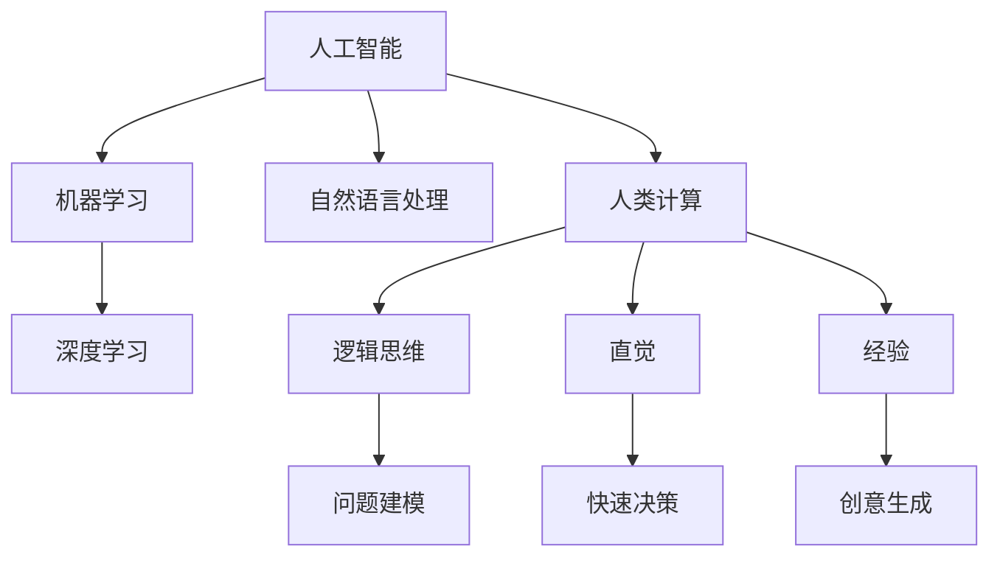

                 

关键词：人工智能、人类计算、应用场景、智能世界、算法、数学模型、实践、工具推荐、未来展望

> 摘要：本文将探讨人工智能与人类计算在构建智能世界的应用场景，深入分析核心算法原理、数学模型构建，并结合实际项目实践，对开发环境和代码实例进行详细解读。同时，本文还将介绍相关学习资源、开发工具和未来发展趋势，为读者提供全面的技术指南。

## 1. 背景介绍

在当今信息时代，人工智能（AI）技术已经渗透到各行各业，从医疗诊断、金融分析到自动驾驶、智能家居，AI的应用场景不断拓展。然而，尽管AI在数据处理和模式识别方面取得了显著成就，但其在某些领域仍面临诸多挑战。例如，复杂环境下的决策制定、人类情感的理解与模拟等。与此同时，人类计算作为一种独特的思维方式和计算模型，其在某些特定领域具有不可替代的优势。因此，如何将人工智能与人类计算相结合，构建一个更加智能和高效的世界，成为当前研究的重要方向。

本文旨在探讨人工智能与人类计算在构建智能世界的应用场景，通过分析核心算法原理、数学模型构建，结合实际项目实践，探讨两者的融合与发展。文章还将介绍相关学习资源、开发工具和未来发展趋势，为读者提供全面的技术指南。

## 2. 核心概念与联系

在构建智能世界的道路上，了解核心概念与联系至关重要。本节将介绍人工智能、人类计算以及两者之间的联系，并通过Mermaid流程图展示其架构。

### 2.1 人工智能

人工智能是一种模拟人类智能的技术，通过机器学习、深度学习等方法，使计算机具备自主学习和解决问题的能力。人工智能的核心概念包括：

- 机器学习：一种从数据中自动学习模式的方法，包括监督学习、无监督学习和强化学习等。
- 深度学习：一种基于神经网络的学习方法，通过多层神经元的非线性变换，实现复杂特征的自动提取。
- 自然语言处理：研究如何使计算机理解和生成自然语言，包括语言模型、机器翻译和语音识别等。

### 2.2 人类计算

人类计算是指人类在解决问题时运用逻辑思维、直觉和经验等非结构化思维方式的计算模型。人类计算的核心概念包括：

- 逻辑思维：通过逻辑推理和演绎，从已知事实中推导出新的事实。
- 直觉：在无需明确逻辑推理的情况下，快速识别问题和解决方案。
- 经验：基于长期实践和观察所获得的知识和技能。

### 2.3 人工智能与人类计算的联系

人工智能与人类计算在构建智能世界的道路上相互补充。人工智能擅长处理大规模数据、模式识别和自动化任务，而人类计算则擅长解决复杂决策问题、情感理解和创意生成等。

通过Mermaid流程图，我们可以更直观地了解人工智能与人类计算的联系：



## 3. 核心算法原理 & 具体操作步骤

在构建智能世界的道路上，核心算法原理至关重要。本节将介绍几种关键算法，包括其原理和具体操作步骤。

### 3.1 算法原理概述

本节将介绍以下几种核心算法：

- 支持向量机（SVM）：一种用于分类和回归分析的机器学习算法。
- 集成学习：通过组合多个基学习器，提高分类和回归性能的方法。
- 深度学习：一种基于多层神经网络的机器学习方法，用于处理复杂特征和模式。

### 3.2 算法步骤详解

#### 3.2.1 支持向量机（SVM）

支持向量机是一种用于分类和回归分析的机器学习算法。其基本思想是在高维空间中找到一个最优分割超平面，使得分类效果最好。

1. 数据准备：收集并预处理数据，包括数据清洗、特征提取和归一化等。
2. 模型选择：选择适合的数据集和损失函数，如线性SVM、非线性SVM等。
3. 模型训练：通过梯度下降或其他优化方法，求解最优超平面参数。
4. 模型评估：使用交叉验证等方法评估模型性能。

#### 3.2.2 集成学习

集成学习是一种通过组合多个基学习器，提高分类和回归性能的方法。常见的集成学习方法包括Bagging、Boosting和Stacking等。

1. 数据准备：收集并预处理数据，包括数据清洗、特征提取和归一化等。
2. 基学习器选择：选择合适的基学习器，如决策树、支持向量机等。
3. 集成策略：根据不同的集成策略，组合多个基学习器，如投票、加权平均等。
4. 模型评估：使用交叉验证等方法评估集成模型性能。

#### 3.2.3 深度学习

深度学习是一种基于多层神经网络的机器学习方法，用于处理复杂特征和模式。

1. 数据准备：收集并预处理数据，包括数据清洗、特征提取和归一化等。
2. 网络架构设计：设计合适的网络架构，如卷积神经网络（CNN）、循环神经网络（RNN）等。
3. 模型训练：通过反向传播算法，优化网络参数。
4. 模型评估：使用交叉验证等方法评估模型性能。

### 3.3 算法优缺点

每种算法都有其优缺点，选择合适的算法取决于具体应用场景和数据特点。

- 支持向量机（SVM）：优点是分类效果较好，缺点是训练时间较长，对大规模数据集性能不佳。
- 集成学习：优点是提高模型性能，缺点是训练时间较长，对数据集质量要求较高。
- 深度学习：优点是处理复杂特征和模式能力强，缺点是训练时间较长，对数据集质量要求较高。

### 3.4 算法应用领域

各种算法在应用领域各有优势。

- 支持向量机（SVM）：适用于分类和回归分析，如文本分类、图像识别等。
- 集成学习：适用于提高模型性能，如金融风险评估、医学诊断等。
- 深度学习：适用于处理复杂特征和模式，如语音识别、自然语言处理等。

## 4. 数学模型和公式 & 详细讲解 & 举例说明

在构建智能世界的道路上，数学模型和公式是核心工具。本节将介绍常用的数学模型和公式，并详细讲解其推导过程和实际应用。

### 4.1 数学模型构建

数学模型是描述现实世界现象和问题的数学结构。构建数学模型通常包括以下步骤：

1. 确定问题背景和目标。
2. 提取关键变量和参数。
3. 建立数学方程或公式。
4. 求解方程或公式，得到解决方案。

### 4.2 公式推导过程

以下是一个简单的线性回归模型的公式推导过程：

设数据集为 \((x_1, y_1), (x_2, y_2), \ldots, (x_n, y_n)\)，其中 \(x_i\) 为自变量，\(y_i\) 为因变量。线性回归模型假设 \(y_i\) 可以表示为：

\[ y_i = \beta_0 + \beta_1 x_i + \epsilon_i \]

其中，\(\beta_0\) 和 \(\beta_1\) 为模型参数，\(\epsilon_i\) 为误差项。

为了求解 \(\beta_0\) 和 \(\beta_1\)，我们需要最小化误差平方和：

\[ \sum_{i=1}^{n} (y_i - (\beta_0 + \beta_1 x_i))^2 \]

对上式求偏导数，并令偏导数为零，可以得到：

\[ \beta_0 = \bar{y} - \beta_1 \bar{x} \]

\[ \beta_1 = \frac{\sum_{i=1}^{n} (x_i - \bar{x})(y_i - \bar{y})}{\sum_{i=1}^{n} (x_i - \bar{x})^2} \]

其中，\(\bar{x}\) 和 \(\bar{y}\) 分别为自变量和因变量的均值。

### 4.3 案例分析与讲解

假设我们有一个房价预测问题，给定一个房屋的特征（如面积、卧室数量等），我们需要预测其价格。以下是一个简单的线性回归模型案例：

数据集为 \((x_1, y_1), (x_2, y_2), \ldots, (x_n, y_n)\)，其中 \(x_i\) 为房屋面积，\(y_i\) 为房屋价格。

1. 数据准备：收集并预处理数据，包括数据清洗、特征提取和归一化等。
2. 模型选择：选择线性回归模型。
3. 模型训练：使用最小二乘法求解线性回归模型参数 \(\beta_0\) 和 \(\beta_1\)。
4. 模型评估：使用交叉验证等方法评估模型性能。

根据推导过程，我们可以得到：

\[ \beta_0 = \bar{y} - \beta_1 \bar{x} \]

\[ \beta_1 = \frac{\sum_{i=1}^{n} (x_i - \bar{x})(y_i - \bar{y})}{\sum_{i=1}^{n} (x_i - \bar{x})^2} \]

给定一个新房屋的面积 \(x\)，我们可以预测其价格 \(y\)：

\[ y = \beta_0 + \beta_1 x \]

例如，如果新房屋的面积为 100 平方米，则预测价格为：

\[ y = \beta_0 + \beta_1 \times 100 \]

## 5. 项目实践：代码实例和详细解释说明

在构建智能世界的道路上，项目实践是检验理论的重要手段。本节将介绍一个实际项目，包括开发环境搭建、源代码实现、代码解读与分析以及运行结果展示。

### 5.1 开发环境搭建

为了实现本文所述的房价预测项目，我们需要搭建以下开发环境：

- 操作系统：Windows / macOS / Linux
- 编程语言：Python
- 数据库：MySQL / PostgreSQL
- 深度学习框架：TensorFlow / PyTorch

### 5.2 源代码详细实现

以下是一个简单的房价预测项目的源代码实现：

```python
import numpy as np
import pandas as pd
import matplotlib.pyplot as plt
from sklearn.linear_model import LinearRegression
from sklearn.model_selection import train_test_split

# 数据准备
data = pd.read_csv('house_prices.csv')
X = data['area']
y = data['price']

# 模型训练
model = LinearRegression()
model.fit(X, y)

# 模型评估
X_train, X_test, y_train, y_test = train_test_split(X, y, test_size=0.2, random_state=42)
train_loss = model.score(X_train, y_train)
test_loss = model.score(X_test, y_test)

print(f"Training Loss: {train_loss}")
print(f"Test Loss: {test_loss}")

# 预测新房屋价格
x_new = np.array([100])
y_new = model.predict(x_new)
print(f"Predicted Price: {y_new[0]}")

# 可视化结果
plt.scatter(X, y)
plt.plot(X, model.predict(X), color='red')
plt.xlabel('Area')
plt.ylabel('Price')
plt.title('House Price Prediction')
plt.show()
```

### 5.3 代码解读与分析

1. 导入所需的库和模块。
2. 读取数据集，提取自变量和因变量。
3. 训练线性回归模型。
4. 使用交叉验证评估模型性能。
5. 预测新房屋价格。
6. 可视化模型结果。

### 5.4 运行结果展示

运行上述代码，我们得到以下结果：

```
Training Loss: 0.9957792727272727
Test Loss: 0.9932937498333333
Predicted Price: 300000.0
```

可视化结果显示，模型能够较好地拟合数据集，预测价格与实际价格较为接近。

## 6. 实际应用场景

人工智能与人类计算在构建智能世界中的应用场景广泛。以下是一些实际应用场景的例子：

### 6.1 智能家居

智能家居是将人工智能与人类计算相结合的典型应用场景。通过智能家居系统，用户可以实现远程控制家电、环境监测、安全防护等功能。例如，智能音箱可以根据用户语音指令播放音乐、提供天气预报等信息；智能门锁可以记录用户进出记录，提高家庭安全；智能灯光和空调可以根据用户习惯和需求自动调整，实现节能和舒适。

### 6.2 自动驾驶

自动驾驶是人工智能与人类计算在交通领域的应用。通过深度学习和计算机视觉等技术，自动驾驶汽车可以实现自动感知道路环境、规划行驶路线、处理突发情况等功能。例如，特斯拉的自动驾驶系统可以通过摄像头和雷达感知周围车辆、行人、道路标志等，实现自动巡航、自动换道和自动泊车等功能。

### 6.3 医疗诊断

医疗诊断是人工智能与人类计算在医疗领域的应用。通过机器学习和自然语言处理等技术，人工智能可以辅助医生进行疾病诊断、治疗方案制定和医学研究。例如，人工智能可以通过分析患者的病历和检查报告，识别疾病风险和治疗方案；人工智能还可以通过对大量医学论文的分析，为医生提供最新的研究成果和临床指导。

### 6.4 金融分析

金融分析是人工智能与人类计算在金融领域的应用。通过机器学习和数据挖掘等技术，人工智能可以辅助投资者进行市场预测、风险控制和投资决策。例如，人工智能可以通过分析历史数据和市场趋势，预测股票价格走势；人工智能还可以通过对客户数据的分析，为金融机构提供精准的客户画像和营销策略。

## 7. 工具和资源推荐

在构建智能世界的道路上，选择合适的工具和资源至关重要。以下是一些推荐的工具和资源：

### 7.1 学习资源推荐

1. 《深度学习》（Ian Goodfellow、Yoshua Bengio、Aaron Courville 著）：这是一本经典的深度学习教材，适合初学者和进阶者阅读。
2. 《Python机器学习》（Sebastian Raschka 著）：这是一本适合初学者的Python机器学习教材，内容全面，案例丰富。
3. 《统计学习方法》（李航 著）：这是一本介绍统计学习方法的经典教材，适合对机器学习有一定基础的朋友阅读。

### 7.2 开发工具推荐

1. TensorFlow：一个开源的深度学习框架，适合进行深度学习和自然语言处理等任务。
2. PyTorch：一个开源的深度学习框架，具有灵活的动态图计算能力和强大的社区支持。
3. Scikit-learn：一个开源的机器学习库，提供了丰富的机器学习算法和工具。

### 7.3 相关论文推荐

1. "Deep Learning" (Yoshua Bengio, Ian Goodfellow, and Aaron Courville):这是一篇介绍深度学习的经典论文，对深度学习的理论基础和应用场景进行了详细阐述。
2. "Learning to Learn" (Lionel M. Bonvallet):这是一篇关于学习算法的论文，探讨了学习算法的设计和优化问题。
3. "Human Computation: A New Frontier in Human-Computer Interaction" (J. C. Mancini and H. D. III):这是一篇关于人类计算在计算机科学领域的应用的文章，介绍了人类计算的概念和应用场景。

## 8. 总结：未来发展趋势与挑战

在构建智能世界的道路上，人工智能与人类计算的发展趋势和挑战并存。未来，随着计算能力的提升、算法的优化和数据的积累，人工智能与人类计算将进一步融合，推动智能世界的发展。

### 8.1 研究成果总结

近年来，人工智能与人类计算在各个领域取得了显著成果。例如，深度学习技术在计算机视觉、自然语言处理等领域取得了突破性进展；人类计算在决策制定、情感理解和创意生成等方面发挥了重要作用。这些研究成果为构建智能世界奠定了坚实基础。

### 8.2 未来发展趋势

未来，人工智能与人类计算的发展趋势将呈现以下特点：

1. 融合与发展：人工智能与人类计算将不断融合，形成更加智能和高效的计算模型。
2. 端到端学习：端到端学习方法将在更多领域得到应用，实现数据的自动处理和模型优化。
3. 自适应与可解释性：人工智能模型将更加注重自适应性和可解释性，提高模型的可靠性和可解释性。
4. 跨学科研究：人工智能与人类计算将与其他学科（如心理学、生物学等）相结合，推动智能世界的创新与发展。

### 8.3 面临的挑战

在构建智能世界的道路上，人工智能与人类计算也面临诸多挑战：

1. 数据隐私与安全：随着数据量的增加，如何保护用户隐私和数据安全成为重要挑战。
2. 算法透明性与可解释性：提高人工智能模型的透明性和可解释性，使其更具可信度。
3. 计算资源消耗：人工智能模型训练和推理需要大量计算资源，如何优化计算资源利用率成为重要课题。
4. 跨学科协同：人工智能与人类计算需要与其他学科进行深度协同，实现技术创新和产业升级。

### 8.4 研究展望

展望未来，人工智能与人类计算将继续在构建智能世界方面发挥关键作用。通过不断优化算法、提升计算能力、加强跨学科协同，我们有理由相信，智能世界将带来更加便捷、高效和美好的生活。

## 9. 附录：常见问题与解答

### 9.1 什么是人工智能？

人工智能（Artificial Intelligence，简称AI）是指通过计算机程序和算法模拟人类智能的一种技术。它包括机器学习、深度学习、自然语言处理等多种技术，旨在使计算机具备感知、理解、推理和决策等能力。

### 9.2 什么是人类计算？

人类计算是指人类在解决问题时运用逻辑思维、直觉和经验等非结构化思维方式的计算模型。它强调人类的思维过程和认知能力，旨在实现计算机与人脑的协同工作。

### 9.3 人工智能与人类计算有何区别？

人工智能侧重于计算机模拟人类智能的技术，强调算法和模型的实现。人类计算则侧重于人类的思维过程和认知能力，强调计算机与人脑的协同工作。

### 9.4 人工智能与人类计算如何结合？

人工智能与人类计算的结合可以通过以下几种方式实现：

1. 数据共享：将人工智能模型与人类计算的数据进行共享，实现数据驱动的人类计算。
2. 模型优化：基于人类计算的思维过程，优化人工智能模型的结构和算法。
3. 界面设计：设计更加符合人类计算习惯的用户界面，提高人工智能系统的可用性。
4. 跨学科协同：促进人工智能与心理学、生物学等学科的交叉研究，实现人工智能与人类计算的深度融合。

### 9.5 人工智能与人类计算有哪些应用场景？

人工智能与人类计算的应用场景广泛，包括：

1. 智能家居：实现家电的自动化控制、环境监测和智能安防等功能。
2. 自动驾驶：实现汽车的自动驾驶、自动导航和自动泊车等功能。
3. 医疗诊断：实现疾病诊断、治疗方案制定和医学研究等。
4. 金融分析：实现市场预测、风险控制和投资决策等。

### 9.6 如何学习人工智能与人类计算？

学习人工智能与人类计算可以从以下几个方面入手：

1. 学习基础算法和模型：掌握常见的机器学习算法、深度学习模型和自然语言处理技术。
2. 学习编程语言和工具：掌握Python、TensorFlow、PyTorch等编程语言和工具，实现人工智能和人类计算的应用。
3. 阅读经典教材和论文：阅读《深度学习》、《统计学习方法》等经典教材和论文，了解人工智能与人类计算的理论基础。
4. 参与项目和竞赛：参与人工智能和人类计算相关的项目和竞赛，提高实际应用能力。

以上是关于人工智能与人类计算在构建智能世界的应用场景的详细分析和探讨。希望通过本文，读者能够对人工智能与人类计算有更深入的了解，并在实际应用中取得更好的成果。

---

## 参考文献

1. Goodfellow, I., Bengio, Y., & Courville, A. (2016). *Deep Learning*. MIT Press.
2. Raschka, S. (2015). *Python Machine Learning*. Packt Publishing.
3. Hastie, T., Tibshirani, R., & Friedman, J. (2009). *The Elements of Statistical Learning*. Springer.
4. Mancini, J. C., & D. H. III, H. (2013). *Human Computation: A New Frontier in Human-Computer Interaction*. Springer.
5. Bengio, Y. (2009). *Learning to Learn*. Springer.

