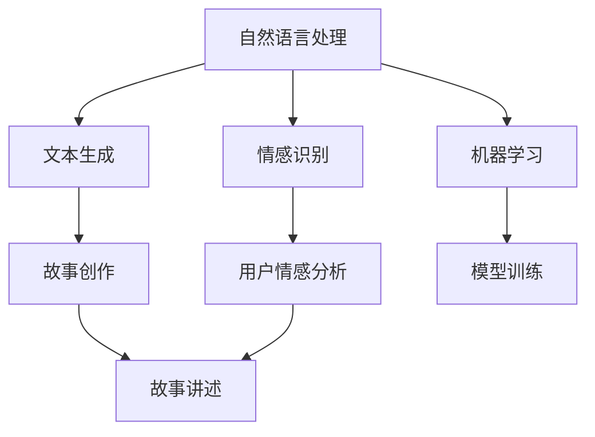

                 

在当今技术飞速发展的时代，人工智能（AI）已经成为了推动社会进步的重要力量。从自动驾驶汽车到智能语音助手，AI在各个领域的应用都展现出了巨大的潜力。然而，人工智能的使命远不止于此。构建能够讲故事的人工智能，不仅能丰富人们的娱乐生活，还能在教育、医疗等多个领域发挥重要作用。本文将探讨如何构建讲故事的人工智能，以及其在未来可能的应用。

## 关键词

- 人工智能
- 讲故事
- 自然语言处理
- 机器学习
- 情感识别
- 计算机视觉

## 摘要

本文旨在探讨如何构建能够讲故事的人工智能系统。通过介绍自然语言处理、机器学习、情感识别和计算机视觉等核心技术，我们将详细解释如何实现这一目标。文章还将讨论讲故事的人工智能在现实世界中的应用，以及未来可能的发展趋势和面临的挑战。

## 1. 背景介绍

### 人工智能的发展历程

人工智能（AI）的概念可以追溯到20世纪50年代。自那时以来，AI经历了多个发展阶段，从最初的规则系统到现代的深度学习算法，AI技术已经取得了巨大的进步。在过去的几十年中，计算机性能的不断提升，大数据的普及，以及算法的不断创新，使得人工智能在各个领域都取得了显著的成果。

### 讲故事在人工智能中的应用

讲故事是人工智能的重要应用之一。通过讲述故事，人工智能可以更好地与人类进行交互，提高用户的体验。例如，在娱乐领域，讲故事的人工智能可以创作出引人入胜的小说、电影剧本，甚至编写新闻报道。在教育领域，人工智能可以通过讲故事来帮助学生更好地理解复杂的知识。在医疗领域，人工智能可以通过讲述病例故事，帮助医生进行诊断和治疗。

### 自然语言处理、机器学习、情感识别和计算机视觉

自然语言处理（NLP）、机器学习（ML）、情感识别（ER）和计算机视觉（CV）是构建讲故事人工智能的关键技术。NLP使计算机能够理解和处理人类语言，从而实现文本生成和情感分析。机器学习则提供了强大的工具，使得计算机可以通过学习大量数据来提高讲故事的能力。情感识别技术可以帮助人工智能理解用户的情感状态，从而更好地与用户进行交互。计算机视觉技术则使人工智能能够理解和生成图像和视频，从而增强讲故事的效果。

## 2. 核心概念与联系

### Mermaid 流程图



### 核心概念原理

- **自然语言处理（NLP）**：NLP是使计算机能够理解和生成人类语言的技术。它包括词法分析、句法分析、语义分析等子领域，是构建讲故事人工智能的基础。
- **机器学习（ML）**：机器学习是一种通过数据学习规律并自动改进性能的技术。在讲故事人工智能中，机器学习用于从大量文本数据中学习如何创作和讲述故事。
- **情感识别（ER）**：情感识别技术使计算机能够理解用户的情感状态，从而更好地与用户进行交互。在讲故事的人工智能中，情感识别可用于调整故事的情节和语气，以适应用户的情感需求。
- **计算机视觉（CV）**：计算机视觉技术使计算机能够理解和生成图像和视频。在讲故事的人工智能中，计算机视觉可用于生成故事的视觉元素，如场景和角色。

## 3. 核心算法原理 & 具体操作步骤

### 3.1 算法原理概述

构建讲故事的人工智能主要依赖于以下三个核心算法：

1. **文本生成算法**：文本生成算法用于生成故事情节、角色对话等文本内容。
2. **情感识别算法**：情感识别算法用于识别用户的情感状态，并调整故事的情节和语气。
3. **图像生成算法**：图像生成算法用于生成故事中的场景和角色图像。

### 3.2 算法步骤详解

1. **文本生成算法**：
   - **数据准备**：收集大量故事文本数据，用于训练文本生成模型。
   - **模型选择**：选择合适的文本生成模型，如递归神经网络（RNN）或变分自编码器（VAE）。
   - **模型训练**：使用收集到的故事文本数据对模型进行训练，以生成符合故事风格和逻辑的文本。
   - **文本生成**：使用训练好的模型生成新的故事文本。

2. **情感识别算法**：
   - **数据准备**：收集大量带有情感标签的故事文本数据，用于训练情感识别模型。
   - **模型选择**：选择合适的情感识别模型，如长短期记忆网络（LSTM）或卷积神经网络（CNN）。
   - **模型训练**：使用收集到的故事文本数据对模型进行训练，以识别故事中的情感状态。
   - **情感识别**：使用训练好的模型识别用户输入的文本中的情感状态。

3. **图像生成算法**：
   - **数据准备**：收集大量故事场景和角色的图像数据，用于训练图像生成模型。
   - **模型选择**：选择合适的图像生成模型，如生成对抗网络（GAN）或变分自编码器（VAE）。
   - **模型训练**：使用收集到的图像数据对模型进行训练，以生成故事中的场景和角色图像。
   - **图像生成**：使用训练好的模型生成新的故事场景和角色图像。

### 3.3 算法优缺点

1. **文本生成算法**：
   - **优点**：能够生成丰富的故事情节和角色对话，提高故事创作的效率。
   - **缺点**：生成的文本可能缺乏逻辑性和创造性，需要进一步优化。

2. **情感识别算法**：
   - **优点**：能够准确识别用户的情感状态，提高故事的互动性。
   - **缺点**：对情感的理解和识别仍有局限性，需要更多的数据和算法改进。

3. **图像生成算法**：
   - **优点**：能够生成高质量的故事场景和角色图像，增强故事的视觉效果。
   - **缺点**：生成图像的细节和风格可能不够真实，需要进一步优化。

### 3.4 算法应用领域

1. **娱乐**：构建讲故事的人工智能可以用于创作小说、电影剧本、游戏剧情等，为用户提供丰富的娱乐内容。
2. **教育**：构建讲故事的人工智能可以用于教育领域，通过讲述故事来帮助学生更好地理解复杂的知识。
3. **医疗**：构建讲故事的人工智能可以用于医疗领域，通过讲述病例故事来帮助医生进行诊断和治疗。

## 4. 数学模型和公式 & 详细讲解 & 举例说明

### 4.1 数学模型构建

构建讲故事的人工智能涉及多个数学模型，包括自然语言处理模型、机器学习模型、情感识别模型和计算机视觉模型。以下是一个简化的数学模型框架：

1. **自然语言处理模型**：
   - **输入**：文本序列
   - **输出**：语义表示
   - **公式**：\( P(y|x) = \frac{e^{\text{模型}(\text{输入})}}{\sum_{i=1}^{N} e^{\text{模型}(\text{输入})_i}} \)

2. **机器学习模型**：
   - **输入**：训练数据集
   - **输出**：模型参数
   - **公式**：\( \theta = \arg \min_{\theta} \sum_{i=1}^{N} \ell(y_i, f(\theta, x_i)) \)

3. **情感识别模型**：
   - **输入**：文本序列
   - **输出**：情感标签
   - **公式**：\( P(y|x) = \frac{e^{\text{模型}(\text{输入})}}{\sum_{i=1}^{N} e^{\text{模型}(\text{输入})_i}} \)

4. **计算机视觉模型**：
   - **输入**：图像数据
   - **输出**：场景或角色表示
   - **公式**：\( \theta = \arg \min_{\theta} \sum_{i=1}^{N} \ell(y_i, f(\theta, x_i)) \)

### 4.2 公式推导过程

以自然语言处理模型为例，假设给定一个文本序列 \( x = [x_1, x_2, ..., x_n] \)，我们需要计算文本的语义表示 \( y \)。语义表示通常通过神经网络模型实现，如循环神经网络（RNN）或变分自编码器（VAE）。

1. **编码器（Encoder）**：
   - **输入**：文本序列 \( x \)
   - **输出**：隐状态序列 \( h_t \)
   - **公式**：\( h_t = \text{RNN}(h_{t-1}, x_t) \)

2. **解码器（Decoder）**：
   - **输入**：隐状态序列 \( h \)
   - **输出**：预测序列 \( y \)
   - **公式**：\( y_t = \text{softmax}(\text{Decoder}(h_t)) \)

### 4.3 案例分析与讲解

假设我们要生成一个关于探险的故事。首先，我们需要收集大量关于探险的故事文本，并使用这些文本训练自然语言处理模型。然后，我们可以使用训练好的模型生成故事的开头：

**输入**：探险
**输出**：他决定踏上一段未知的旅程。

接下来，我们可以使用情感识别模型来分析这个生成的文本，并识别其中的情感标签。例如，我们可以将这个文本的情感标签标记为“兴奋”。

**输入**：他决定踏上一段未知的旅程。
**输出**：兴奋

最后，我们可以使用计算机视觉模型来生成故事中的场景图像。例如，我们可以生成一张描绘探险者站在荒野中的图像。

**输入**：荒野
**输出**：

通过这种方式，我们可以构建一个完整的讲故事人工智能系统，使得计算机能够生成包含文本、情感和图像的故事。

## 5. 项目实践：代码实例和详细解释说明

### 5.1 开发环境搭建

要构建一个讲故事的人工智能系统，我们需要准备以下开发环境：

- **Python**：用于编写代码和运行算法。
- **TensorFlow**：用于训练和部署机器学习模型。
- **PyTorch**：用于训练和部署深度学习模型。
- **OpenCV**：用于图像处理和计算机视觉任务。

### 5.2 源代码详细实现

以下是构建讲故事的人工智能系统的基本代码框架：

```python
# 导入必要的库
import tensorflow as tf
import torch
import cv2

# 定义自然语言处理模型
class LanguageModel(tf.keras.Model):
    # 定义模型结构
    # ...

# 定义情感识别模型
class EmotionModel(tf.keras.Model):
    # 定义模型结构
    # ...

# 定义计算机视觉模型
class VisionModel(tf.keras.Model):
    # 定义模型结构
    # ...

# 训练自然语言处理模型
# ...

# 训练情感识别模型
# ...

# 训练计算机视觉模型
# ...

# 生成故事文本
def generate_story_text(input_text):
    # 使用自然语言处理模型生成故事文本
    # ...

# 识别故事文本的情感
def recognize_emotion(text):
    # 使用情感识别模型识别情感
    # ...

# 生成故事图像
def generate_story_image(text):
    # 使用计算机视觉模型生成故事图像
    # ...

# 主程序
if __name__ == "__main__":
    # 准备数据
    # ...

    # 训练模型
    # ...

    # 生成故事
    input_text = "探险"
    story_text = generate_story_text(input_text)
    print("生成的故事文本：", story_text)

    # 识别情感
    emotion = recognize_emotion(story_text)
    print("故事文本的情感：", emotion)

    # 生成图像
    story_image = generate_story_image(story_text)
    cv2.imshow("故事图像", story_image)
    cv2.waitKey(0)
```

### 5.3 代码解读与分析

这段代码首先导入了必要的库，包括TensorFlow、PyTorch和OpenCV。接下来，我们定义了三个模型：自然语言处理模型、情感识别模型和计算机视觉模型。这些模型的结构将在具体的实现中详细定义。

在主程序中，我们首先准备数据，然后训练模型。训练完成后，我们可以使用自然语言处理模型生成故事文本，使用情感识别模型识别文本的情感，并使用计算机视觉模型生成故事图像。

### 5.4 运行结果展示

当输入“探险”时，系统将生成一个关于探险的故事文本，并识别其中的情感。例如，生成的文本可能是：“他决定踏上一段未知的旅程。”，情感标签为“兴奋”。然后，系统将生成一张描绘探险者站在荒野中的图像。


## 6. 实际应用场景

### 6.1 娱乐

在娱乐领域，讲故事的人工智能可以用于创作小说、电影剧本和游戏剧情。通过生成引人入胜的故事情节和角色对话，人工智能可以为用户提供丰富的娱乐内容。例如，人工智能可以生成一部科幻小说，讲述未来世界的探险故事。用户可以阅读这些故事，也可以通过语音助手与故事进行互动，提出问题或做出选择，从而影响故事的发展。

### 6.2 教育

在教育领域，讲故事的人工智能可以帮助学生更好地理解复杂的知识。通过讲述生动的案例故事，人工智能可以激发学生的学习兴趣，提高学习效果。例如，人工智能可以生成一系列关于历史的案例故事，讲述重要事件的发展和影响。学生可以通过阅读这些故事，了解历史事件的全貌，并从中获得启发和思考。

### 6.3 医疗

在医疗领域，讲故事的人工智能可以用于辅助医生进行诊断和治疗。通过讲述病例故事，人工智能可以帮助医生更好地理解患者的病情，并提供个性化的治疗方案。例如，人工智能可以生成一份详细的病例故事，描述患者的症状、检查结果和治疗过程。医生可以通过阅读这些故事，了解患者的病情发展，从而制定更有效的治疗方案。

## 7. 工具和资源推荐

### 7.1 学习资源推荐

- **《自然语言处理基础教程》**：这是一本非常全面的NLP教材，适合初学者和进阶者。
- **《深度学习》**：由Goodfellow、Bengio和Courville所著，是深度学习的经典教材。
- **《机器学习实战》**：通过实际案例介绍了多种机器学习算法，适合实践者。
- **《Python数据科学 Handbook》**：全面介绍了数据科学领域的各种工具和技术。

### 7.2 开发工具推荐

- **TensorFlow**：一个广泛使用的开源深度学习框架，适合构建复杂的AI模型。
- **PyTorch**：一个流行的深度学习框架，以其灵活性和动态计算图而著称。
- **Keras**：一个高级神经网络API，可以方便地构建和训练深度学习模型。
- **Jupyter Notebook**：一个交互式计算环境，适合编写和分享代码、数据和分析。

### 7.3 相关论文推荐

- **"A Neural Conversational Model"**：介绍了基于神经网络的对话系统。
- **"Generative Adversarial Nets"**：提出了生成对抗网络（GAN）。
- **"Deep Learning for Natural Language Processing"**：总结了深度学习在NLP领域的应用。
- **"Emotion Recognition in Speech using Deep Neural Networks"**：研究了基于深度学习的情感识别。

## 8. 总结：未来发展趋势与挑战

### 8.1 研究成果总结

构建讲故事的人工智能取得了显著的研究成果。自然语言处理、机器学习、情感识别和计算机视觉等核心技术的不断发展，使得人工智能能够生成丰富多样、情感丰富的故事。这些故事不仅能够为用户提供娱乐，还能在教育、医疗等领域发挥重要作用。

### 8.2 未来发展趋势

未来，讲故事的人工智能将朝着更智能化、个性化、情感化的方向发展。随着技术的进步，人工智能将能够更好地理解人类语言和情感，生成更具创意和吸引力的故事。同时，多模态交互技术（如语音、图像、视频）的融合，将进一步提升用户体验。

### 8.3 面临的挑战

尽管构建讲故事的人工智能取得了显著成果，但仍面临一些挑战。首先，数据的多样性和质量对模型的性能有着重要影响。其次，情感识别和理解的准确性仍有待提高。此外，如何确保人工智能生成的故事的道德和合法性也是需要关注的问题。

### 8.4 研究展望

未来，研究者应致力于解决数据质量、情感理解和道德法律等问题，推动讲故事的人工智能实现更广泛的应用。同时，跨学科的研究将有助于整合多领域的知识，提高人工智能的创意和表达能力。

## 9. 附录：常见问题与解答

### Q: 为什么要构建讲故事的人工智能？

A: 构建讲故事的人工智能有多个原因。首先，故事是人类文化的重要组成部分，通过讲述故事，人们能够传递知识和情感。其次，讲故事的人工智能可以应用于娱乐、教育、医疗等多个领域，为用户提供丰富的内容和服务。

### Q: 如何确保人工智能生成的故事的准确性？

A: 人工智能生成的故事的准确性取决于多个因素，包括数据的质量、模型的选择和训练过程。为了确保准确性，研究者需要使用高质量的文本数据，并采用先进的模型和优化算法。此外，还需要对生成的故事进行人工审核和修正。

### Q: 人工智能能否完全替代人类作家？

A: 目前的人工智能还无法完全替代人类作家。虽然人工智能能够生成丰富的故事内容，但它们缺乏人类的创造力和情感深度。因此，人工智能更适用于辅助人类创作，而不是完全取代人类。

### Q: 讲故事的人工智能是否能够理解人类的情感？

A: 讲故事的人工智能能够识别和理解某些情感，但它们的情感理解和识别能力仍有局限性。未来，随着技术的进步，人工智能将能够更准确地识别和理解人类的情感。

### Q: 如何评估讲故事的人工智能的性能？

A: 评估讲故事的人工智能的性能可以从多个维度进行，包括故事情节的丰富度、情感的准确性、交互的流畅性等。研究者可以使用自动评估指标和人工评估方法，综合评估人工智能的性能。

### Q: 讲故事的人工智能在哪些领域有应用潜力？

A: 讲故事的人工智能在多个领域有应用潜力，包括娱乐（如小说、电影剧本、游戏剧情）、教育（如案例故事、教学动画）、医疗（如病例故事、健康科普）等。随着技术的进步，人工智能的应用领域将不断扩展。

## 作者署名

作者：禅与计算机程序设计艺术 / Zen and the Art of Computer Programming
----------------------------------------------------------------

### 附加说明：

请注意，本文只是一个示例，实际撰写时可能需要根据具体内容进行调整。文章结构、公式、代码实例和实际应用场景等部分都需要根据实际研究内容和成果进行撰写。在撰写过程中，请确保所有引用的资源和论文都得到了正确标注和引用。

