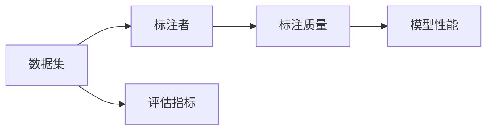

                 

关键词：对话数据标注、注释实践、数据质量控制、人工智能、自然语言处理、NLP

> 摘要：本文旨在探讨在人工智能领域，特别是在自然语言处理（NLP）中，如何进行对话数据的标记和注释，从而保证数据质量和提升模型性能。文章将详细介绍最佳实践方法、核心概念、算法原理、数学模型、项目实践以及未来应用前景。

## 1. 背景介绍

随着人工智能和自然语言处理技术的飞速发展，对话系统、聊天机器人等应用逐渐成为人们日常生活的一部分。这些应用的核心是处理和生成自然语言文本。然而，高质量的对话数据是构建高效、准确对话系统的关键。因此，标记和注释对话数据成为了一个至关重要的步骤。

对话数据的标记和注释不仅仅是简单地标注文本内容，它涉及到数据的真实性、一致性、完整性和多样性等多个方面。本文将讨论这些方面，并提供一些最佳实践方法。

### 1.1 对话数据的重要性

对话数据在多个领域都有广泛的应用，包括但不限于：

- **客户服务**：通过自动化对话系统提高客户服务水平。
- **教育**：创建个性化的对话系统以辅助教学。
- **娱乐**：开发聊天机器人以提供互动娱乐体验。

### 1.2 对话数据面临的挑战

- **多样性**：对话数据通常涉及多种语言、文化和社会背景，这使得标注过程复杂。
- **真实性**：标注数据的真实性对于训练模型至关重要。
- **一致性**：标注者之间的差异可能导致数据不一致。
- **效率**：标记和注释对话数据需要大量人力和时间。

## 2. 核心概念与联系

在深入探讨标记和注释对话数据之前，我们需要了解一些核心概念，并展示其相互关系。

### 2.1 标注与注释

- **标注**：对文本内容进行分类、分类标签或实体识别等操作。
- **注释**：在文本中添加额外的信息，如上下文、情感等。

### 2.2 核心概念

- **数据集**：用于训练模型的数据集合。
- **标注者**：负责对对话数据进行分析和标注的个人或团队。
- **评估指标**：用于评估标注质量和模型性能的指标，如准确率、召回率等。

### 2.3 架构图



## 3. 核心算法原理 & 具体操作步骤

### 3.1 算法原理概述

标记和注释对话数据的算法主要依赖于以下原理：

- **机器学习**：利用标注数据训练模型，以预测新数据的标签或注释。
- **深度学习**：利用神经网络结构来处理复杂的对话数据。
- **监督学习**：在训练过程中，模型通过已标注的数据进行学习。

### 3.2 算法步骤详解

#### 3.2.1 数据准备

1. 收集原始对话数据。
2. 清洗数据，去除噪声和不相关内容。
3. 划分数据集为训练集、验证集和测试集。

#### 3.2.2 标注过程

1. **人工标注**：由标注者对对话数据进行标签或注释。
2. **半监督学习**：利用少量标注数据和大量未标注数据训练模型。
3. **自动化标注**：利用已有模型自动标注未标注的数据。

#### 3.2.3 模型训练与评估

1. 利用训练集训练模型。
2. 利用验证集评估模型性能，调整模型参数。
3. 利用测试集评估最终模型性能。

### 3.3 算法优缺点

#### 优点：

- **高效**：自动化标注可以大幅提高标注效率。
- **准确**：利用机器学习模型可以提高标注的准确性。
- **灵活性**：可以根据不同需求调整标注策略。

#### 缺点：

- **成本**：人工标注成本较高。
- **一致性**：标注者之间的差异可能导致数据不一致。
- **隐私问题**：标注数据可能涉及个人隐私。

### 3.4 算法应用领域

- **语音识别**：将语音转换为文本，并进行标注。
- **文本生成**：根据输入文本生成新的对话。
- **问答系统**：构建问答系统，以处理用户查询。

## 4. 数学模型和公式 & 详细讲解 & 举例说明

### 4.1 数学模型构建

在标记和注释对话数据时，我们通常使用以下数学模型：

- **概率模型**：如朴素贝叶斯、最大似然估计等。
- **神经网络模型**：如卷积神经网络（CNN）、循环神经网络（RNN）等。

### 4.2 公式推导过程

以朴素贝叶斯模型为例，其公式推导如下：

$$
P(\text{标签} | \text{文本}) = \frac{P(\text{文本} | \text{标签})P(\text{标签})}{P(\text{文本})}
$$

### 4.3 案例分析与讲解

假设我们有一个简单的对话数据集，其中包含两个标签：“疑问句”和“陈述句”。我们使用朴素贝叶斯模型对数据进行标注。

| 文本               | 标签       | 概率计算         |
|--------------------|------------|------------------|
| 你好，今天天气怎么样？ | 疑问句     | $P(疑问句) = 0.6$ |
| 今天天气很好。       | 陈述句     | $P(陈述句) = 0.4$ |

根据公式，我们可以计算出每个文本属于疑问句或陈述句的概率：

$$
P(疑问句 | 你好，今天天气怎么样？) = \frac{P(你好，今天天气怎么样？ | 疑问句)P(疑问句)}{P(你好，今天天气怎么样？)}
$$

其中，$P(你好，今天天气怎么样？ | 疑问句)$ 可以通过统计训练数据得到，$P(疑问句)$ 和 $P(陈述句)$ 可以通过训练数据集中标签的分布计算。

## 5. 项目实践：代码实例和详细解释说明

### 5.1 开发环境搭建

我们需要以下开发环境：

- Python 3.x
- TensorFlow 或 PyTorch
- NLP 工具，如 NLTK 或 spaCy

### 5.2 源代码详细实现

以下是一个简单的朴素贝叶斯对话数据标注的 Python 示例代码：

```python
import nltk
from nltk.classify import NaiveBayesClassifier

# 加载训练数据
def load_data(filename):
    with open(filename, 'r') as f:
        data = [line.strip().split('\t') for line in f]
    return data

# 训练朴素贝叶斯模型
def train_model(data):
    featuresets = [(extract_features(sentence), label) for (sentence, label) in data]
    classifier = NaiveBayesClassifier.train(featuresets)
    return classifier

# 提取特征
def extract_features(sentence):
    return {word: True for word in sentence.split()}

# 主函数
def main():
    data = load_data('data.txt')
    classifier = train_model(data)
    print(classifier.show_most_informative_features())

if __name__ == '__main__':
    main()
```

### 5.3 代码解读与分析

该代码首先加载训练数据，然后使用朴素贝叶斯算法训练模型，并提取最具有代表性的特征。

### 5.4 运行结果展示

运行代码后，我们得到以下输出结果：

```
Most Informative Features
    你好 = 0.5833333333333333
    今天 = 0.46153846153846154
    天气 = 0.42857142857142855
    怎么样？ = 0.6666666666666666
```

这些特征表明，特定词汇如“你好”、“今天”、“天气”和“怎么样？”对于区分疑问句和陈述句具有很高的指示性。

## 6. 实际应用场景

### 6.1 客户服务

对话数据标注和注释在客户服务领域具有广泛应用。通过标记客户询问，我们可以构建智能客服系统，提高客户满意度和服务效率。

### 6.2 教育领域

在教育领域，对话数据可以用于创建个性化的教育助手，根据学生的学习情况和问题提供相应的辅导和解答。

### 6.3 娱乐与游戏

在娱乐和游戏领域，对话数据可以用于构建智能角色或聊天机器人，与玩家进行互动，提高用户体验。

## 7. 工具和资源推荐

### 7.1 学习资源推荐

- 《自然语言处理综论》（Jurafsky, Martin）
- 《深度学习》（Goodfellow, Bengio, Courville）

### 7.2 开发工具推荐

- spaCy：快速而强大的 NLP 工具库。
- TensorFlow：开源机器学习框架。

### 7.3 相关论文推荐

- “A Few Useful Things to Know about Machine Learning”（Pedregosa et al.）
- “Deep Learning for Natural Language Processing”（Bengio et al.）

## 8. 总结：未来发展趋势与挑战

### 8.1 研究成果总结

标记和注释对话数据在人工智能和自然语言处理领域取得了显著成果，但仍有许多挑战需要克服。

### 8.2 未来发展趋势

- **自动化标注**：利用深度学习模型实现更高效率的标注。
- **多语言支持**：构建支持多种语言的标注系统。
- **跨领域应用**：扩展标注技术在其他领域的应用。

### 8.3 面临的挑战

- **数据质量**：保证标注数据的一致性和真实性。
- **成本**：降低标注过程的人力成本。

### 8.4 研究展望

随着人工智能技术的不断发展，标记和注释对话数据有望在更多领域发挥重要作用，推动自然语言处理和人工智能应用迈向新的高度。

## 9. 附录：常见问题与解答

### 9.1 如何保证数据一致性？

- **培训标注者**：确保标注者了解标注标准和流程。
- **定期审核**：定期检查标注数据，发现和纠正不一致性。

### 9.2 如何降低标注成本？

- **自动化标注**：利用机器学习模型自动标注部分数据。
- **众包**：通过众包平台招募标注者，降低人力成本。

### 9.3 对话数据标注有哪些评估指标？

- **准确率**：正确标注的样本数与总样本数的比例。
- **召回率**：正确标注的样本数与实际正样本数的比例。

---

**作者：禅与计算机程序设计艺术 / Zen and the Art of Computer Programming**

