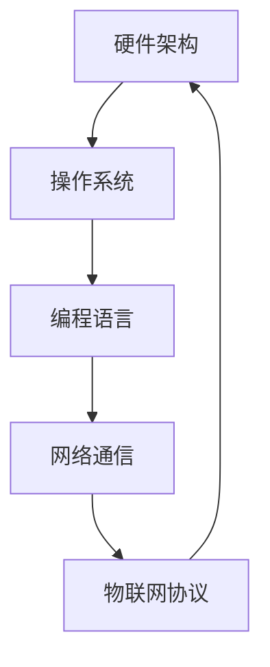

                 

### 关键词 Keywords

树莓派，硬件编程，Python，物联网，嵌入式系统，开源，Linux，开发工具，编程语言，编程实践。

### 摘要 Abstract

本文将带领读者深入探索树莓派的开发之旅，从基础入门到精通，涵盖硬件配置、编程环境搭建、核心算法实现、项目实践以及未来应用展望。通过详细的步骤和实例讲解，读者将能够掌握树莓派开发的精髓，成为嵌入式系统开发的高手。

## 1. 背景介绍

树莓派（Raspberry Pi）是一款由英国慈善基金会 Raspberry Pi Foundation 发起的微型计算机，旨在促进计算机科学教育。自从2012年第一款树莓派推出以来，它迅速赢得了全球开发者和爱好者的喜爱。树莓派以其低廉的价格、丰富的接口和开源的操作系统，成为了一个理想的嵌入式系统开发平台。

### 树莓派的发展历史

- **2012年**：Raspberry Pi Model B发布，配备256MB内存，1GB SD卡，2个USB端口，10/100Mbps以太网和HDMI输出。
- **2014年**：Raspberry Pi Model B+发布，改进了电源输入和USB端口，内存升级至1GB。
- **2015年**：Raspberry Pi 2发布，首次搭载64位处理器，4GB内存，具备更强大的性能。
- **2017年**：Raspberry Pi 3发布，内置无线网络和蓝牙功能，进一步提升了性能。
- **2019年**：Raspberry Pi 4发布，配备了更快的处理器、更高内存选项、双屏输出和以太网，成为最受欢迎的版本。

### 树莓派的广泛应用

树莓派的低廉价格和强大功能使其在以下领域得到了广泛应用：

- **教育**：作为计算机科学和编程教育的理想工具，帮助学生和教师学习计算机编程和电子学。
- **智能家居**：通过树莓派，可以实现智能灯光控制、温度监测、家庭安全监控等功能。
- **物联网**：树莓派作为物联网设备的中心，可以连接各种传感器和设备，实现数据的采集和处理。
- **媒体中心**：树莓派可以轻松搭建成为一个简易的家庭影院中心，播放高清视频和音乐。
- **实验项目**：开发者们使用树莓派进行各种实验项目，如机器人、无人机、自动驾驶汽车等。

## 2. 核心概念与联系

### 核心概念

树莓派的开发涉及多个核心概念，包括：

- **硬件架构**：树莓派的核心硬件包括处理器（CPU）、内存（RAM）、存储（SD卡或eMMC）、GPIO（通用输入输出接口）等。
- **操作系统**：树莓派通常运行基于Linux的操作系统，如Raspbian、Ubuntu等。
- **编程语言**：树莓派开发常用Python、C、Java等编程语言。
- **网络通信**：树莓派可以通过无线网络或以太网连接互联网，实现远程控制和数据传输。
- **物联网协议**：如MQTT、HTTP、CoAP等，用于设备间的通信和数据交换。

### 核心概念联系

以下是树莓派核心概念之间的联系，使用Mermaid流程图展示：



**硬件架构**决定了树莓派的基本性能和功能，**操作系统**提供了运行环境，**编程语言**用于开发应用程序，**网络通信**和**物联网协议**则实现了设备间的数据交换和控制。

## 3. 核心算法原理 & 具体操作步骤

### 3.1 算法原理概述

树莓派开发中常用的核心算法包括：

- **PID控制算法**：用于控制系统，如电机、泵等，实现精确控制。
- **数据滤波算法**：如卡尔曼滤波、均值滤波等，用于去除传感器数据的噪声。
- **图像处理算法**：如边缘检测、目标识别等，用于计算机视觉项目。
- **机器学习算法**：如决策树、神经网络等，用于模式识别和预测分析。

### 3.2 算法步骤详解

#### 3.2.1 PID控制算法

PID控制算法是一种经典的控制算法，其基本步骤如下：

1. **设定目标值**：根据控制系统的需求，设定期望的目标值。
2. **获取当前值**：通过传感器获取当前的实际值。
3. **计算误差**：计算目标值与当前值之间的误差。
4. **计算控制输出**：根据误差值，通过PID公式计算控制输出。
5. **执行控制输出**：将控制输出应用到控制系统中，如调节电机速度。

#### 3.2.2 数据滤波算法

以卡尔曼滤波为例，其基本步骤如下：

1. **初始化**：设定初始状态和初始估计误差。
2. **预测**：根据系统模型，预测下一时刻的状态。
3. **更新**：根据实际测量值，更新状态估计和估计误差。
4. **重复**：重复预测和更新步骤，不断优化状态估计。

#### 3.2.3 图像处理算法

以边缘检测算法为例，其基本步骤如下：

1. **输入图像**：读取待处理的图像数据。
2. **预处理**：对图像进行滤波、灰度化等预处理操作。
3. **边缘检测**：使用边缘检测算子，如Sobel、Prewitt等，计算图像的边缘。
4. **输出结果**：输出边缘检测结果。

#### 3.2.4 机器学习算法

以决策树算法为例，其基本步骤如下：

1. **数据准备**：收集并准备训练数据集。
2. **特征选择**：选择具有区分性的特征。
3. **构建决策树**：根据特征值划分数据集，构建决策树。
4. **训练模型**：使用训练数据集，训练决策树模型。
5. **预测**：使用训练好的模型，对新数据进行分类预测。

### 3.3 算法优缺点

#### PID控制算法

**优点**：控制精确，适用于多种控制系统。

**缺点**：对参数调节要求较高，可能存在参数不稳定的问题。

#### 数据滤波算法

**优点**：能有效去除噪声，提高数据质量。

**缺点**：计算复杂度较高，可能影响实时性。

#### 图像处理算法

**优点**：可以实现复杂的图像处理任务。

**缺点**：计算量较大，对硬件性能要求较高。

#### 机器学习算法

**优点**：能自动学习和优化，适用于复杂的数据分析任务。

**缺点**：训练过程可能较慢，对数据质量要求较高。

### 3.4 算法应用领域

- **PID控制算法**：广泛应用于工业自动化、机器人控制等领域。
- **数据滤波算法**：应用于传感器数据处理、信号处理等领域。
- **图像处理算法**：应用于计算机视觉、图像识别等领域。
- **机器学习算法**：应用于数据分析、模式识别、预测分析等领域。

## 4. 数学模型和公式 & 详细讲解 & 举例说明

### 4.1 数学模型构建

#### 4.1.1 PID控制算法

PID控制算法的数学模型可以表示为：

\[ u(t) = K_p e(t) + K_i \int_{0}^{t} e(\tau) d\tau + K_d \frac{de(t)}{dt} \]

其中：

- \( u(t) \) 是控制输出。
- \( e(t) \) 是误差，即目标值与实际值之差。
- \( K_p \)、\( K_i \)、\( K_d \) 分别是比例、积分、微分系数。

#### 4.1.2 卡尔曼滤波

卡尔曼滤波的数学模型可以表示为：

\[ x_{k|k-1} = A x_{k-1|k-1} + B u_k \]
\[ P_{k|k-1} = A P_{k-1|k-1} A^T + Q \]
\[ K_k = P_{k|k-1} H^T (H P_{k|k-1} H^T + R)^{-1} \]
\[ x_{k|k} = x_{k|k-1} + K_k (z_k - H x_{k|k-1}) \]
\[ P_{k|k} = (I - K_k H) P_{k|k-1} \]

其中：

- \( x_k \) 是状态向量。
- \( P_k \) 是状态估计误差协方差矩阵。
- \( A \) 是状态转移矩阵。
- \( B \) 是控制输入矩阵。
- \( H \) 是观测矩阵。
- \( u_k \) 是控制输入。
- \( z_k \) 是观测值。
- \( Q \) 是过程噪声协方差矩阵。
- \( R \) 是观测噪声协方差矩阵。

### 4.2 公式推导过程

#### 4.2.1 PID控制算法

PID控制算法的推导基于控制系统的动态模型，通过误差反馈来调节控制输出。具体推导过程如下：

1. **设定控制目标**：假设系统期望输出为 \( y_d \)，实际输出为 \( y \)，则误差为 \( e = y_d - y \)。
2. **建立动态模型**：假设系统满足线性时不变（LTI）条件，可以用差分方程描述：
   \[ y(t) = a_0 y(t-1) + a_1 y(t-2) + \ldots + a_n y(t-n) + b_0 u(t-1) + b_1 u(t-2) + \ldots + b_m u(t-m) \]
3. **计算误差**：将动态模型代入，得到：
   \[ e(t) = y_d(t) - y(t) \]
4. **设计PID控制器**：根据误差，设计PID控制器，其输出为：
   \[ u(t) = K_p e(t) + K_i \int_{0}^{t} e(\tau) d\tau + K_d \frac{de(t)}{dt} \]

#### 4.2.2 卡尔曼滤波

卡尔曼滤波的推导基于贝叶斯估计理论，旨在优化状态估计。具体推导过程如下：

1. **初始化**：设定初始状态和初始估计误差：
   \[ x_0 = x_0^{est} \]
   \[ P_0 = P_0^{est} \]
2. **预测**：根据状态转移模型和过程噪声，预测下一时刻的状态：
   \[ x_{k|k-1} = A x_{k-1|k-1} + B u_k \]
   \[ P_{k|k-1} = A P_{k-1|k-1} A^T + Q \]
3. **更新**：根据观测值和观测噪声，更新状态估计：
   \[ K_k = P_{k|k-1} H^T (H P_{k|k-1} H^T + R)^{-1} \]
   \[ x_{k|k} = x_{k|k-1} + K_k (z_k - H x_{k|k-1}) \]
   \[ P_{k|k} = (I - K_k H) P_{k|k-1} \]

### 4.3 案例分析与讲解

#### 4.3.1 PID控制算法案例

假设我们需要控制一个电机，使其以恒定速度旋转。我们可以使用PID控制算法来实现：

1. **设定目标值**：设定电机速度的目标值 \( y_d \)。
2. **获取当前值**：通过编码器或速度传感器获取电机的当前速度 \( y \)。
3. **计算误差**：计算误差 \( e = y_d - y \)。
4. **计算控制输出**：根据PID公式计算控制输出 \( u = K_p e + K_i \int e d\tau + K_d \frac{de}{dt} \)。
5. **执行控制输出**：通过电机驱动器执行控制输出。

#### 4.3.2 卡尔曼滤波案例

假设我们使用加速度传感器来估计一辆汽车的速度。我们可以使用卡尔曼滤波来优化速度估计：

1. **初始化**：设定初始速度和初始估计误差。
2. **预测**：根据加速度传感器数据，预测下一时刻的速度。
3. **更新**：根据实际速度测量值，更新速度估计。

通过这两个案例，我们可以看到PID控制算法和卡尔曼滤波在实际应用中的重要作用。PID控制算法提供了精确的控制输出，而卡尔曼滤波则优化了传感器数据的估计，提高了系统的鲁棒性。

## 5. 项目实践：代码实例和详细解释说明

### 5.1 开发环境搭建

要开始树莓派的开发，我们需要搭建一个合适的开发环境。以下是搭建过程：

1. **下载Raspbian操作系统**：从树莓派官方网站下载Raspbian操作系统镜像文件。
2. **制作启动盘**：使用工具如balenaEtcher，将操作系统镜像文件写入SD卡。
3. **启动树莓派**：将SD卡插入树莓派，连接电源和网络，启动树莓派。
4. **配置网络**：配置树莓派的网络，以便连接到互联网。
5. **更新系统**：运行以下命令更新系统：
   ```bash
   sudo apt update
   sudo apt upgrade
   ```
6. **安装开发工具**：安装Python、IDLE、文本编辑器等开发工具：
   ```bash
   sudo apt install python3 python3-pygame python3-idle
   ```

### 5.2 源代码详细实现

以下是一个简单的树莓派项目：使用树莓派控制LED灯的开关。

#### 5.2.1 准备工作

1. **硬件准备**：准备一个树莓派、一个LED灯、一个电阻和面包板。
2. **连接电路**：将LED灯和电阻连接到树莓派的GPIO接口，确保LED的正极连接到GPIO13，负极通过电阻连接到GND。

#### 5.2.2 编写代码

以下是一个简单的Python代码示例，用于控制LED灯的开关：

```python
import RPi.GPIO as GPIO
import time

# 初始化GPIO
GPIO.setmode(GPIO.BCM)
GPIO.setup(13, GPIO.OUT)

# 循环开关LED灯
try:
    while True:
        GPIO.output(13, GPIO.HIGH)  # 打开LED灯
        time.sleep(1)
        GPIO.output(13, GPIO.LOW)  # 关闭LED灯
        time.sleep(1)
except KeyboardInterrupt:
    # 按Ctrl+C停止程序时执行
    GPIO.cleanup()
```

#### 5.2.3 代码解读与分析

1. **导入库**：导入`RPi.GPIO`和`time`库。
2. **初始化GPIO**：设置GPIO模式为BCM模式，并设置GPIO13为输出模式。
3. **循环控制**：使用无限循环，每次循环先打开LED灯（`GPIO.HIGH`），然后关闭LED灯（`GPIO.LOW`），每次操作后延时1秒。
4. **异常处理**：当按下Ctrl+C停止程序时，执行`GPIO.cleanup()`清理GPIO资源。

### 5.3 运行结果展示

1. **启动程序**：将上述代码保存为`led_control.py`，在树莓派终端运行：
   ```bash
   python3 led_control.py
   ```
2. **观察结果**：LED灯将每隔1秒闪烁一次。
3. **停止程序**：在终端按下Ctrl+C停止程序，LED灯将停止闪烁。

通过这个简单的项目，我们可以看到树莓派开发的基本流程，包括硬件连接、代码编写和程序运行。这个项目展示了如何使用Python控制GPIO接口，实现基本的输入输出操作。

## 6. 实际应用场景

### 6.1 智能家居

树莓派在智能家居领域有着广泛的应用，例如：

- **智能灯控**：通过树莓派控制家庭中的智能灯，实现远程开关和定时控制。
- **温度监控**：使用树莓派连接温度传感器，实时监控家庭环境温度，并通过智能手机推送警报。
- **安防系统**：利用树莓派连接摄像头和传感器，实现家庭安全监控和报警功能。

### 6.2 物联网

树莓派作为物联网设备的中心，可以连接各种传感器和设备，实现数据的采集和处理。以下是一些应用实例：

- **智能农业**：使用树莓派连接土壤湿度传感器、温度传感器等，实时监测农田环境，实现精准灌溉和施肥。
- **智能交通**：通过树莓派连接交通传感器，实现交通流量监测、拥堵预警等功能。
- **环境监测**：使用树莓派连接空气质量和水质传感器，实时监测环境质量，提供数据支持和预警。

### 6.3 娱乐

树莓派还可以用作家庭娱乐中心：

- **媒体播放器**：安装Kodi等媒体中心软件，将树莓派用作高清视频和音乐的播放器。
- **游戏主机**：通过安装游戏模拟器，将树莓派转化为游戏主机。
- **电子相册**：使用树莓派展示家庭照片，实现自动滚动播放。

### 6.4 未来应用展望

随着树莓派性能的不断提升和成本的降低，其应用领域将更加广泛：

- **工业自动化**：树莓派可以用于工业自动化控制，如机器手臂、生产线监控等。
- **机器人**：树莓派作为机器人控制器，可以实现自主导航、感知和控制。
- **教育**：树莓派将继续在教育领域发挥重要作用，为编程和电子学教育提供更丰富的资源和平台。

## 7. 工具和资源推荐

### 7.1 学习资源推荐

- **《Raspberry Pi基础教程》**：一本适合初学者的入门书籍，详细介绍了树莓派的基本使用和编程。
- **树莓派官方网站**：提供最新的树莓派硬件信息、软件下载和社区支持。
- **Python官方文档**：Python官方文档是学习Python编程的宝贵资源，涵盖了Python的各个方面。

### 7.2 开发工具推荐

- **PyCharm**：一款功能强大的Python IDE，适用于树莓派开发。
- **Thonny**：一款专门为初学者设计的Python IDE，界面简洁，易于使用。
- **Arduino IDE**：虽然主要用于Arduino开发，但也可以用于树莓派编程，兼容性强。

### 7.3 相关论文推荐

- **“Raspberry Pi for IoT Applications”**：探讨树莓派在物联网中的应用。
- **“Using Raspberry Pi in Education”**：分析树莓派在教育领域的应用。
- **“Raspberry Pi and Embedded Linux”**：介绍树莓派的硬件架构和Linux操作系统。

## 8. 总结：未来发展趋势与挑战

### 8.1 研究成果总结

树莓派的推出极大地推动了嵌入式系统开发，为编程教育、物联网、智能家居等领域带来了新的机遇。其开源的硬件设计和丰富的软件资源吸引了大量开发者和爱好者，推动了相关技术的发展。

### 8.2 未来发展趋势

- **性能提升**：随着处理器性能的提升和成本的降低，树莓派将在更多领域得到应用。
- **开源生态**：树莓派的开发将更加依赖开源社区，提供更多的软件和工具。
- **教育普及**：树莓派将继续在教育领域发挥重要作用，为编程教育提供新的平台。

### 8.3 面临的挑战

- **硬件兼容性**：随着硬件的不断更新，如何保持与旧版本的兼容性是一个挑战。
- **软件生态**：如何构建和完善软件生态系统，为开发者提供丰富的工具和资源。
- **安全性**：随着树莓派在更多领域的应用，如何确保系统的安全性将成为一个重要课题。

### 8.4 研究展望

树莓派的发展前景广阔，未来将在以下方面取得突破：

- **多核处理**：多核处理将为树莓派带来更强大的计算能力，支持更复杂的任务。
- **人工智能**：结合人工智能技术，树莓派可以实现更加智能化的应用，如语音识别、图像识别等。
- **边缘计算**：树莓派在边缘计算领域具有巨大的潜力，可以处理更多的本地数据，减轻云端压力。

通过不断的研究和创新，树莓派将为嵌入式系统开发带来更多可能性，成为未来科技的重要组成部分。

## 9. 附录：常见问题与解答

### 9.1 树莓派的电源要求是什么？

树莓派需要5V/2A的电源供应，以确保稳定运行。

### 9.2 如何配置无线网络？

在树莓派启动后，打开终端，输入以下命令：
```bash
sudo nano /etc/wpa_supplicant/wpa_supplicant.conf
```
添加无线网络配置，然后重启网络：
```bash
sudo reboot
```

### 9.3 如何安装Python环境？

在终端中运行以下命令：
```bash
sudo apt install python3 python3-pip
```

### 9.4 如何安装IDLE？

在终端中运行以下命令：
```bash
sudo apt install python3-idle
```

### 9.5 如何查看树莓派的系统信息？

在终端中运行以下命令：
```bash
cat /etc/os-release
```
这将显示树莓派运行的操作系统版本和其他相关信息。

### 9.6 如何清理树莓派的存储空间？

在终端中运行以下命令，可以清理不再需要的文件：
```bash
sudo apt clean
sudo apt autoremove
```

以上是关于树莓派开发的一些常见问题和解答，希望对您有所帮助。

